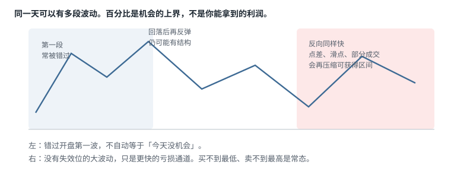

# 1.1 你到底在交易什么

> 一句话：日内交易赚的是短期价格波动，不是公司在你手里变得更值钱。先承认这件事很难，再决定要不要用真实资金去验证。

这一章要先把对象说清楚。后面所有账户、选股、图表和订单，都建立在同一个判断上：你做的是**同一交易日内开仓并平仓、试图从短期供需失衡里拿出一段价格变化**。它合法，它难，它和长期持有同一家公司的股权不是同一种工作。课程视频里出现过收益截图、工作站照片和「每天可以赚多少」的暗示；那些画面不能当作学习目标。真正要留下来的，是定义、边界、学习顺序，以及你到底在对什么下注。

## 1.1.1 课程所说的 Day Trading

日内交易（Day Trading）的最低定义很窄：在同一交易日内完成开仓和平仓，不把隔夜事件当作计划的一部分。本书关注的主战场，是美国上市股票里那些**当天有新闻或其他催化、成交量突然放大、流通盘相对较小**的异动股，以及后面几卷会单独处理的大盘股日内结构和期权。这里赚的是**价格波动**，不是因为你持有了企业的长期价值。

这个定义有三层容易被忽略的含义。

第一层是时间。持仓可以是几秒、几分钟或几小时，但策略默认在常规时段结束前离场。你当然可以另写一套隔夜或波段规则；那是另一套风险预算，不能和日内混用同一套止损和仓位。

第二层是标的选择。不是每一只当天在涨的股票都适合这套方法。没有催化、没有异常成交量、点差已经宽到计划止损没有意义的名字，只是在屏幕上移动。扫描器和观察名单的工作，是把全市场压成少数值得打开图表的对象，而不是保证你「抓住每一个大行情」。

第三层是盈亏来源。价格从 5.00 走到 5.40，和这家公司明年会不会更赚钱，没有一一对应关系。盘中买家可能在对新闻重新定价，也可能只是在对其他买家的订单流作出反应。你能管理的是自己的触发、失效和股数；你不能管理「市场应该如何理解这条新闻」。



上图把课程开场那张「早盘上涨、回落、再次反弹」的幻灯片改写成教学用路径。它只说明一件事：即使你错过第一段上涨，盘中仍可能出现第二段可交易的波段。百分比波动描述的是价格曾经走过的空间，**不代表**你能买在最低、卖在最高。实际能拿到的区间还会被买卖价差（spread）、滑点（slippage）、部分成交和反应速度再压缩一层。更重要的是另一半：波动大，意味着错误方向的损失同样快。把「今天波动很大」理解成「今天好赚钱」，是把机会的上界误当成自己的期望值。

所以，当你在观察名单上写下「这只股票今天可能走 20%」时，正确的下一句不是「我要拿到这 20%」，而是：「如果我在预先写好的位置入场，失效位离我多远，第一目标是否至少能覆盖成本后的计划风险，以及一旦停牌或跳空，最坏能亏多少。」

## 1.1.2 投资与投机：两件不同的事

长期投资和本书说的主动交易，用的不是同一套证据，也不该用同一套成功标准。

| 维度 | 长期投资 | 本书的日内投机 |
|---|---|---|
| 主要依据 | 企业价值、盈利、现金流与长期前景 | 当日催化、相对成交量、价格结构与盘口 |
| 持有周期 | 月、年，甚至更久 | 秒、分钟或小时；日内策略当天离场 |
| 主要风险 | 企业基本面与宏观环境变化 | 极端波动、执行、杠杆、停牌和纪律失控 |
| 怎样算「对」 | 估值判断随时间兑现 | 同一规则下，扣除成本后的期望值为正 |
| 成功条件 | 对企业和价格的长期判断 | 可重复的入场条件、退出和仓位控制 |

短持仓可以减少一类风险：收盘之后才公布的重大公告、周末的地缘事件、隔夜期货跳空。这一点成立。**不能**由此推出「日内交易风险较低」。高换手、保证金杠杆、开盘跳空、个股停牌（halt）和流动性突然消失，会让损失在几分钟甚至几秒内发生。你躲开了隔夜，换来的是盘中路径风险。两条风险曲线形状不同，没有哪一条天生更安全。

SEC 的投资者材料写得很直白：日内交易合法，但多数个人没有足够的资金、时间和性情去承受它带来的损失；不要用生活费、应急资金、学费或退休金当本金。宣传里的「容易赚钱」本身就是风险信号。教育材料的作者也可能在你开户或订阅之后获利。这些话不是客套，是后面所有章节的前提。

资料：[SEC：Day Trading — Your Dollars at Risk](https://www.sec.gov/about/reports-publications/investorpubsdaytipshtm)

## 1.1.3 你在对什么下注

不是「这只股票会涨」。

也不是「这条新闻是利好，所以价格应该更高」。

你在对的是：在一个事先写好的时刻，**亏钱的空间被结构限制住，赚钱的空间在扣除成本之后仍大于亏损**，然后把对错交给概率。一笔赚了，只能说明那一笔的路径对你有利；一笔亏了，只要没有违反规则，也不能证明策略无效。单笔结果不是证据。

课程里常把「有波动」讲成机会。波动同时放大两边。没有失效位（invalidation）的波动，只是噪音：价格可以继续走，你却说不出自己错在哪里。失效位不是事后画在亏损 K 线下方的一条线，而是入场之前就写下来、用来反推股数的那条线。

后面每一章都会反复使用三个词。这里先定死，避免后面把形状和触发混在一起：

| 词 | 是什么 | 不是什么 |
|---|---|---|
| **形状** | 价格怎么走出来的（旗面、平顶、横盘收窄） | 预测工具 |
| **位置** | 线画在哪（前收、VWAP、当日高点、整数关口） | 形状的另一种叫法 |
| **触发** | 价格穿过你预先画的线，并且你愿意用那根线当失效位 | 「看起来要涨了」 |

一个 setup = 形状 + 位置。触发永远在价格穿过线的那一刻，不在你认出形态的那一刻。认出来却没有穿过线，就还没有交易。穿过线却没有事先画线，就只是追价。

## 1.1.4 做多和做空：方向对称，风险不对称

后面所有「看涨 setup」默认是做多（Long），「看跌 setup」默认是做空（Short）。两者的触发写法可以对称，风险结构不对称。品种、借股和股票质量的细节在第 03 章展开；这里只把现金流方向钉住。


**Long（做多）**：先买入股票，账户承担价格下跌的风险，再通过卖出平仓。不考虑杠杆时，普通股票价格最低可以接近零，理论最大损失接近你投入的资本。用了保证金之后，还要考虑强平和欠款——亏损可以超过初始存款。

每股损益可以先写成：

```
Long P&L = 卖出价 − 买入价 − 每股交易成本
```

**Short（做空）**：向券商借入你并不持有的股票卖掉，以后再买回来归还（buy to cover）。价格下跌时获利。股票上涨没有理论上限，因此裸露空头的亏损也没有固定上限。做空不是「先点 Sell，之后再说」：不容易借到的股票，通常要先完成 Locate。借不到就不能因为看跌而直接卖出。

```
Short P&L = 卖空价 − 回补价 − 借股与交易成本
```

空头的风险预算必须按止损后的美元损失计算，不能按你收到的卖空收入计算。股票被召回、借股费飙升或强制回补，都会在价格本身之外再加一层执行风险。第 02 章会把 Locate 当成选券商的比较项；做空机制的完整流程在后续执行卷。

## 1.1.5 这本书能解决什么，不能解决什么

原课程的 Onboarding 画面列的是会员入口、登录方式和客服联系方法。那些是平台使用说明，不能证明策略有效，也不影响交易规则。原平台入口失效时可以直接跳过。真正需要保留的是概念、图表读法、执行过程和风险边界。

更重要的一句在课程开头，而且比后面任何收益案例都重要：**多数主动交易者无法持续盈利；完成课程也不被承诺就能赚钱。** 学习目标因此不能写成「看完后每天赚多少」。更诚实的目标要拆成四层：

1. **识别**：能准确说出 setup、trigger、invalidation 和 exit，而不是用「感觉要突破了」代替。
2. **执行**：在模拟盘中按事先写好的计划下单，不在成交之后临时改规则。
3. **统计**：用足够样本计算胜率、平均盈利、平均亏损和全部成本；每个 setup 分开算，不能把所有交易混成一锅。
4. **适应**：发现策略失效或市场环境变化时，能缩小仓位或停止交易，而不是加大手数去「赢回来」。

单笔盈利只能说明那一笔赚钱。它不能证明你已经掌握策略，更不能证明下一个月会重复。

本书明确不收这些内容：

- **加密货币**：现货、合约、链上叙事全部排除。以后若要写，另开一卷。
- **软件按钮教程**：DAS、Sterling、Lightspeed 的界面位置过时很快。只保留订单类型和风控逻辑。
- **跟单**：别人的代码、方向、仓位不能当你的计划。
- **收益案例当证明**：单日大赚、挑战赛、聊天室截图不进入正文当证据。

原课程视频里出现了不同年份的录屏、旧版券商界面和个人经验参数。以下内容都可能随时间、券商、账户类型或软件版本变化：Pattern Day Trader（PDT）认定和保证金要求；可借股票库存和 Locate 报价；订单路由和热键语法；Level 2 的显示单位；交易暂停后的恢复方式；手续费、平台费、借股费和融资成本。视频里的数字优先解释为「录制当时的案例」。真实交易前必须再看自己的券商协议和当前官方说明。

## 1.1.6 正确的学习顺序，不要倒过来

课程地图从市场基础、账户、基本面和技术面，逐步进入订单、Level 1、Level 2、Time & Sales、停牌、扫描器、风险和心理。合理顺序不是把这条地图当成可以两天刷完的剧集。


```
概念能讲清
  → 静态图能标出触发和失效
    → 模拟盘能按计划下单
      → 记录能算出期望值
        → 小资金验证
```

不合理的顺序是：

```
快速看完视频 → 直接模仿老师下单 → 用盈亏判断自己是否学会
```

课程建议不要在 48 小时内快速刷完。原因不是记忆力差，而是交易概念需要经过三种完全不同的验证：

- 能不能在**静态图**上解释：这条线是什么，为什么画在这里，错了会看到什么。
- 能不能在**实时变化**中识别：价格还在动、新闻还在刷、扫描器还在跳的时候，你是否仍能说出同一句话。
- 能不能在**有仓位和盈亏波动时**仍按规则执行：浮盈回吐、刚止损、刚错过一波之后，手指是否还听计划的话。

三种验证缺一种，就不该进入下一层。尤其不要用第三种还没练过的大脑，直接去承担第一种刚刚「听懂」的风险。

## 1.1.7 不要 Mirror Trade

视频明确反对盲目复制老师、群聊或知名投资者的交易。即使股票代码和方向相同，下面这些变量仍可能让结果完全相反。

| 变量 | 为什么会改变结果 |
|---|---|
| 入场时间 | 延迟数秒就可能改变止损距离和赔率；你看到的「突破」可能已是别人的离场流动性 |
| 仓位占比 | 相同股数对不同账户不是相同风险。别人用 0.3R，你用全部购买力，不是同一笔交易 |
| 持仓成本 | 对方可能已经有很厚的浮盈缓冲，回撤对他只是回吐，对你是本金 |
| 退出计划 | 对方可能分批、对冲或使用其他账户；你看到的可能只是其中一腿 |
| 信息时点 | 你看到披露时，原交易可能早已发生；13D 和 Form 4 尤其有时间差 |
| 流动性 | 后进入者承担更大的点差和滑点；小盘股上你自己的订单就会改成交价 |

看到别人买入，最多当作研究线索：去打开原始公告、核对流通盘、画出自己的触发和失效。它不能替代交易计划。聊天室里的代码推送，默认按「没有计划」处理。

## 1.1.8 模拟盘是流程测试，不是盈利证明

先用 simulator，并在一段时间里证明自己能按规则执行，这个方向正确。「模拟盈利一个月」仍不是转入实盘的充分条件。

模拟盘常常低估这些东西：

- 点差突然扩大，计划里的 0.05 美元止损在盘口上已经不存在；
- 排队得不到成交，你以为自己在 4.80 进了，实际只挂在那里；
- 部分成交，剩下的股数让风险和目标同时变形；
- 停牌和恢复后跳空，止损单在暂停期间无法让你退出；
- 借股困难与 locate 成本，空头在模拟里「永远借得到」；
- 真实亏损带来的冲动下单——模拟亏的是假钱，行为统计会偏乐观。

更完整的实盘前门槛应同时满足：

- 至少覆盖不同市场状态，而不只是连续几周顺风行情；
- 每个 setup 有独立样本，不能把突破、回踩、反转混在一起报一个胜率；
- 计入佣金、平台费、监管费、借股费和合理滑点；
- 最大单笔亏损与最大日亏损都落在事先写好的范围内；
- 没有靠一两笔异常大盈利撑起全部结果；
- 能连续执行止损，而不是只在模拟环境里「事后把止损画在不该在的地方」。

模拟盘通过的是**流程**：你是否每次都先写计划、是否按计划下单、是否记录偏差。它不通过「这个策略在未来三个月会赚钱」这种命题。

## 1.1.9 设备的目标是可靠，不是堆屏幕

课程会展示电脑、多显示器和支架。多屏只增加同时可见的信息量，不会自动增加策略优势。品牌、价格和当时推荐的外设，来自录制年份，不能当作当前采购清单。

真正影响风险的是三件事：行情是否延迟、网络是否稳定、主平台失效时你是否还有应急退出通道。

最小可靠配置应优先保证：

1. 有线或至少稳定的网络，而不是开盘三分钟时还在重连 Wi-Fi；
2. 行情、图表和订单时间同步，避免一张图还停在 09:31、另一张已经在报 09:33 的成交；
3. 主平台失效时，能用网页端或电话撤单、平仓；
4. 开盘前确认 buying power、持仓和活动订单，而不是开盘后才发现昨天的 GTC 还挂着；
5. 不在飞机、移动网络不稳定或无法处理停牌的位置，持有高风险仓位。

「可以在任何地方交易」描述的是技术可行性。它不代表任何地点都适合承担实时仓位。你无法处理 halt、无法看到 spread 突然变宽、无法确认订单状态时，就不该还开着仓。

## 1.1.10 软件只是工具，品牌不是方法

视频展示过 eSignal、Lightspeed、扫描器、新闻源和交易日志服务。应把它们按功能理解，而不是记品牌：

| 功能 | 最低要求 |
|---|---|
| 图表 | 时间周期、成交量、价格调整（复权）和数据源清楚 |
| 券商 | 受谁监管、资金和证券如何托管、订单如何路由 |
| 扫描器 | 条件定义可解释，不能只看「热门」标签 |
| 新闻 | 能区分公司公告、监管文件和二手标题 |
| 日志 | 保存原始成交、费用、截图、计划与执行偏差 |

同一功能换一家券商或换一个数据商，字段名字会变，定义也可能变。Relative Volume 在 A 平台和 B 平台都叫 RVOL，分母可以完全不同。第 05 章会单独处理扫描器口径。这里只要记住：工具负责显示和执行，不负责替你判断。

课程提到使用境外券商绕开当时的 PDT 限制。即便在 2026 年新旧规则过渡期，也不能只比较账户门槛。还必须核实监管辖区、投资者保护、出入金、做空规则、平台稳定性和争议处理机制。第 02 章会把这个问题展开。境外实体不是「没有规则的美国账户」。

## 1.1.11 收益案例不能替代基准

课程用较大日盈利和小账户增长描述「可能性」。这些数字最多说明讲师声称自己曾达到某个结果，不能推导出学习者的成功概率。

尤其要警惕三个错觉：

- **忽略基数**：从少数成功者反推所有学习者。教室里或聊天室里活下来的人，不是报名时的同一群人。
- **忽略尾部损失**：只看平均日盈利，不看最大回撤、连续亏损和爆仓路径。平均值会被少数大赢的日子拉起来。
- **忽略容量**：小盘股策略在模拟盘或极小账户上成立，放大仓位后，自己的订单会改变成交价格。点差和滑点随规模上升，期望值会变。

更有用的目标单位是 `R`：

```
R = 单笔交易预先允许的最大亏损
```

如果这一笔的计划风险是 50 美元，那么 `+2R` 是 100 美元，`-1R` 是 50 美元。用 R 可以比较不同账户、不同价格的股票，而不是把「每天 1,000 美元」当成普遍目标。账户翻倍之后，1R 的美元数可以按规则调整；比较策略时仍然用 R，避免把仓位放大误看成「自己更会做了」。


`R` 的前提是：止损真的能执行，目标真的能成交，成本另计。停牌、跳空和失去流动性时，实际亏损可以超过 1R。第 02 章会把名义敞口、计划风险和尾部风险拆开。这里先接受一个不舒服的事实：你能计划的是 1R，你不能保证市场给你的是 1R。

## 1.1.12 4% Rule 与 Rule of 300 不证明日内能养活你

课程用月支出乘以 300 来估算「退休资产」，并把它和 4% 提取规则写在同一张幻灯片上。算术上两个写法等价：月支出 5,000 美元，年支出 60,000 美元，`5,000 × 300 = 1,500,000`，而 `1,500,000 × 4% = 60,000`。

这只是长期资产提取的粗略规划方法，用来把模糊的「我想财务自由」翻译成一个资产数字。它**不是**账户可以永远不耗尽的保证。实际结果受投资组合构成、估值、通胀、税、费用、退休年限和回报顺序影响。它更**不能**用来证明日内交易能稳定替代这份退休资产。

把这类公式留在「生活规划」抽屉里。不要把它写进交易计划，当成「所以我每天必须赚 X」。每天必须赚 X 的人，会在没有 setup 的日子里强行找机会。

## 1.1.13 把财务目标与交易目标分开

财务目标回答的是生活问题：

- 每月必要支出是多少？
- 应急资金是否独立于交易账户？
- 可以承受全部损失的交易资本是多少？
- 多久需要从账户提款？

交易目标回答的是规则问题：

- 只交易哪些 setup？
- 每个 setup 需要多少样本才配谈期望值？
- 单笔、单日和单周最多亏多少？
- 出现什么条件必须停止——包括连续亏损、规则违约、平台异常、自己状态不对。

如果生活费用依赖当天盈利，交易者更容易强行找机会、放大仓位和报复交易。交易资本不应替代应急资金。SEC 的提醒在这里变成一句可执行的话：交房租的那笔钱，不是「可承受损失的本金」。

「最终可能不适合主动交易」也是有效结论。学完整卷之后决定自己只做长线、只做指数、或者完全不做，并不比「坚持做日内」更失败。失败的是：已经看到自己无法执行规则，仍然用生活费去证明自己是例外。

## 1.1.14 本书的品种范围

| 收 | 不收 |
|---|---|
| 美国上市普通股（小盘动量、大盘日内） | 加密货币 |
| 美股 / ETF / 指数期权 | 链上、现货币、永续合约 |
| 股指期货的入门概念 | 外汇作为主策略、彩票式 0DTE 推销 |

共同基金通常按每日净值处理，不是常规日内工具。杠杆或反向 ETF 即使底层指数波动不大，仍可能有很高的路径风险和持有成本。期权需要单独权限，卖方和买方的风险结构完全不同。这些品种的边界在第 03 章展开；这里先接受一个范围：本书默认你在交易**可以在交易所连续成交的美国上市证券**，并且你的券商已经批准你交易那个产品。

小盘股和高波动标的会经常遇到停牌、点差突然拉宽、借不到股票。这些不是「进阶技巧」，是这类交易的日常环境。仓位必须在进入之前就按「可能无法按计划价退出」来砍。第 03 章讲质量，第 04 章讲催化，第 05 章讲如何把全市场压成名单。停牌、SSR 和盘外的机制在执行卷；本卷只要求你在选股时就把它们算进风险，而不是开仓后再学。

## 1.1.15 第一阶段检查表

在继续第 02 章之前，应能完成下面每一条。做不到的，先停在这一章，不要用「先开户再说」跳过去。

- 用一句话描述自己要研究的市场和持仓周期，例如：「美国上市小盘股，当天平仓，只做预先写好的突破和回踩。」
- 能解释为什么不复制群聊里的交易，并能举出至少一个会改变结果的变量。
- 已经配置模拟盘、行情、图表和交易日志；日志至少能记下计划、成交、费用和偏差。
- 写下单笔风险与单日停止线，单位用美元和 R，而不是「看情况」。
- 能区分学习目标、财务目标和收益愿望：学习目标是识别与执行，财务目标是生活不被账户绑架，收益愿望不写进规则。
- 接受「最终可能不适合主动交易」也是有效结论。
- 能说出 Long 和 Short 的现金流方向，以及空头亏损为什么不封顶。
- 能说出波动同时放大两边，并且能指出「没有失效位的波动」为什么不是机会。

这一章最值得保留的不是任何收益数字，而是三条边界：**不保证成功、不盲目跟单、未验证前不使用真实资金。**

## 1.1.16 后面几章怎么接

第 02 章处理账户类型、T+1 结算、2026 年起正在替换旧 PDT 的盘中保证金规则、券商比较维度，以及名义敞口 / 计划风险 / 尾部风险三个数字。没有这三个数字，仓位公式只是摆设。

第 03 章区分股票、ETF、期权等工具，把 Long / Short、流通盘、相对成交量和「强势股」拆成可核验的条件。第 04 章教你读原始公告和 SEC 文件，而不是读标题。第 05 章把扫描器降级为候选生成器，并给出观察名单的写法。

在那些章节里，你会再次看到讲师用过的价格区间、流通盘数字和 RVOL 阈值。它们一律标成**启发式**：可以写进你的扫描器当起始过滤，必须用自己的样本验证，不能当成行业定义或物理定律。

## 先记住这些

- 日内交易是投机短期供需与波动，不是缩短版的价值投资。短持仓躲开隔夜，换来的是更快的盘中路径风险。
- 你下注的是「失效位限制亏损、目标在成本后仍大于亏损」，不是「这只股票会涨」。
- 学习顺序是：概念能讲清 → 静态图标出触发和失效 → 模拟按计划执行 → 分 setup 统计 → 极小实盘。倒过来就是用盈亏自我欺骗。
- 别人的代码、方向和仓位不能当你的计划。延迟、流动性和账户规模会改结果。
- 模拟盘测流程，不证明实盘可复制。它低估点差、部分成交、停牌、借股和真亏钱时的行为。
- 目标单位用 R，不用「每天赚多少」。4% Rule / Rule of 300 是生活规划粗算，不是日内稳定提款的证据。
- 做空必须先能借到股票，亏损理论上不封顶。做多在杠杆下也可以亏到超过本金。
- 生活费、应急资金、学费和退休金不是交易本金。

## 不要做的事

- 把课程收益图、聊天室截图或「小账户翻倍」当成自己也能复制的证据。
- 用生活费或杠杆把账户一次打满，或在还不能讲清触发和失效时就去「抓住波动」。
- 48 小时刷完视频之后直接实盘模仿老师。
- 因为别人已经进场，就认为自己迟到几秒也是同一笔交易。
- 把模拟盘一个月的曲线当成策略有效的充分证明。
- 把财务自由公式写进每日盈亏目标，没有 setup 也强行开仓。
- 在无法处理停牌、无法看到盘口、网络不稳定的地方持有高风险仓位。
- 把境外券商、多屏电脑或某个扫描器品牌当成优势本身。
