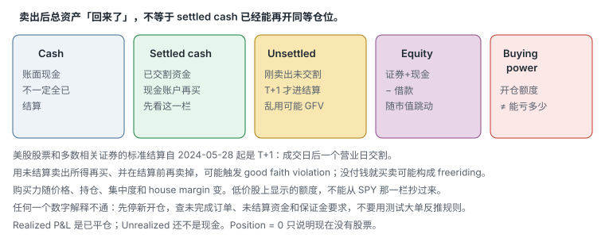
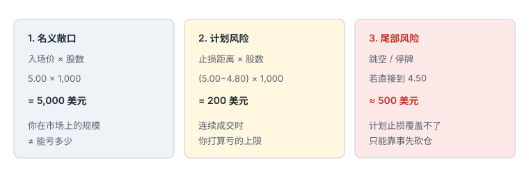

# 1.2 账户、券商与保证金

> 一句话：2026 年起美国日内保证金规则正在换代；先问清自己的券商用哪一套，再谈交易次数、购买力和「国际版有没有 PDT」。

屏幕上的数字看起来像事实：现金、购买力、可交易次数、免佣。它们都是券商按**某一套规则、某一个时点、某一种证券**算出来的。规则在变，证券不同，时点不同，同一个界面就会给出完全不同的含义。这一章的任务不是记住某家券商录制当年的佣金表，而是学会：账户类型决定你能借什么、结算决定你什么时候能再用这笔钱、保证金决定券商按什么公式借给你、购买力决定你**能开多大**而不是**能亏多少**。

视频里出现过 TradeZero、Lightspeed、TD Ameritrade 的旧界面，以及「美国版必须 25,000 美元、国际版没有 PDT」的口头对比。那些画面和句子都是录制当时的案例。截至本书核对（2026-08-26），FINRA 已经用新的盘中保证金要求替换旧的 Pattern Day Trader 框架，但券商仍处在过渡期。开户或提高交易频率之前，直接向自己的券商确认采用哪一套。

## 1.2.1 账户名称不等于风险边界

课程会介绍现金账户（cash account）、保证金账户（margin account）和退休账户（例如 IRA）。三者最重要的差异不是界面上的名字，而是下面这组权利与限制：

- 能否借用券商资金放大名义仓位；
- 卖出所得何时变成 settled cash；
- 是否允许卖空、期权或其他复杂产品；
- 是否存在税务和提前取款限制；
- 券商对单只证券使用什么 house margin（券商自己附加的保证金要求，可以比监管最低更高）；
- 发生亏损或保证金缺口时，券商是否可以不事先通知就减仓或限制开仓。

账户开好以后，仍需阅读本人的客户协议和保证金披露。视频中的账户规模、购买力倍数和「五天内可以做几次」只是当时特定券商、特定监管阶段下的例子，不是通用参数。同一品牌的美国实体与国际实体，可以适用完全不同的监管、托管和保证金制度。不能仅凭名称判断。

## 1.2.2 现金账户：先区分 Cash 与 Settled Cash

现金账户没有融资，并不等于所有卖出所得都能立刻再次使用。对美国股票和多数相关证券，标准结算周期已经从更早视频时代的 `T+2` 改为 `T+1`：通常在成交日后的一个营业日完成交割。生效日是 **2024-05-28**。部分更老的 SEC 文稿仍可能写 T+2，以现行结算规则为准。期权、国债等产品的结算周期本来就可能不同，不要把股票的 T+1 套到所有产品上。

官方说明：[SEC — T+1 Settlement Cycle](https://www.sec.gov/newsroom/press-releases/2024-62)

至少分清五个经常被界面挤在一起的词：

| 字段 | 含义 | 常见误读 |
|---|---|---|
| Cash / Cash balance | 账户账面现金 | 不一定全部已经结算 |
| Settled cash | 已经完成结算、可用于下一笔现金账户交易的资金 | 不等于账户总权益 |
| Unsettled proceeds | 刚卖出证券、尚未结算的所得 | 「钱已经回来了」不等于可以再自由买卖 |
| Cash available to trade | 券商按本账户限制计算的可下单金额 | 各家算法不同，必须看字段说明 |
| Equity / Net liquidation | 按当前价格估算的净资产 | 市价一跳它就变，不是保险箱余额 |



课程用一笔 ETF（例如 SPY）的买卖说明过一个容易吓到新手的现象：现金账户卖出后，界面上的总资产恢复了，但可再次用于交易的金额没有完全恢复。这个现象的核心是结算，不是「钱消失了」。证券卖出到资金完成交割，中间隔着 T+1。在交割完成之前，那笔所得还不是 settled cash。

不少券商允许你用未结算卖出所得再买入另一只证券。这不等于你可以在结算完成前把第二只再卖掉。若这批新买的股票在用于支付它的资金结算之前再卖掉，可能触发 **good faith violation（GFV，善意违约）**。若买入后在没有用已结算资金完成支付的情况下又卖掉，还可能被归到 **freeriding（免费乘车）** 一类限制。具体名称、计数方式和处罚（警告、限制 90 天只用 settled funds 等）以券商和适用规则为准。不要只观察订单是否被系统接受；下单前应按券商给出的 settled-cash 字段核对。

现金账户的「好处」常被说成：没有 PDT、不会借钱、不会被强平。这些只在非常窄的意义上成立。现金账户仍然会遇到：结算占用、GFV / freeriding、无法卖空或卖空能力受限、低价股流动性差时一样无法按计划价退出。它限制的是融资，不是波动。

## 1.2.3 保证金账户：购买力不是你的现金

保证金账户允许在符合条件时借用券商资金。最基本的关系可以写成：

```
账户权益 = 证券市值 + 现金 − 保证金借款
可用购买力 = 券商按监管要求、house margin、持仓集中度和证券风险计算的额外开仓容量
```

购买力会随着价格、持仓和券商风控实时变化。它不等于：

- 可以承受的最大亏损；
- 每只股票都能使用的固定倍数；
- 可以安全下满的仓位；
- 不会被盘中调整的承诺。

课程用过一个教学例子：大约 25,000 美元权益控制大约 90,000 美元股票，再遭遇大约 40,000 美元亏损，说明杠杆会让亏损超过初始存款。例子里的具体倍数**不是承诺**。实际初始保证金、维持保证金和集中持仓附加要求，由证券与券商共同决定。如果股价跳空越过止损，平台无法保证按预定价格成交；清仓后仍可能欠券商钱。

所以仓位上限应由「止损失效时可能亏多少」决定，而不是由界面还能提供多少购买力决定。购买力回答的是「系统此刻还允许我开多大」；风险预算回答的是「错了、跳了、停牌了，我还活不活得下去」。两个问题不是同一个问题。

用杠杆做保证金交易，监管层面常见的最低权益仍是 **2,000 美元**；券商可以设得更高。权益不到 2,000 美元时，仍可能在保证金账户里用自有现金交易（无杠杆），以券商为准。有 2,000 美元不等于可以按最大购买力打满。最低门槛只说明「允许开保证金账户并使用杠杆」的地板，不是安全仓位。

## 1.2.4 三个必须分开的数字

视频举例：账户有 2,000 美元，以 5 美元买入 1,000 股，计划在 4.80 美元止损，于是把计划风险写成：

```
(5.00 − 4.80) × 1,000 = 200 美元
```

左侧的 5,000 美元是持仓名义金额；200 美元只是「按计划价格连续成交」时的理论损失。如果价格直接跳到 4.50 美元，实际亏损将变成约 500 美元，尚未计手续费与滑点。停牌期间无法成交，止损单也不能保证恢复交易后在 4.80 美元退出。

因此必须同时区分三个数字：

1. **名义敞口**：入场价 × 股数；
2. **计划风险**：入场价到失效价的距离 × 股数；
3. **尾部风险**：跳空、停牌或失去流动性时可能超过计划风险的部分。



更安全的仓位公式是先定失效价，再反推股数：

```
股数 = 单笔可承受亏损 ÷ (|入场价 − 失效价| + 预留滑点)
```

预留滑点不能固定照抄一个美分。它应随股票流动性、点差、波动、是否开盘三分钟、是否停牌前后而调整。滑点预留加大之后，股数必须变小。如果入场价已经离失效位很远，同样的 1R 美元只能买更少的股——这叫追。追的定义是**离失效位远**，不是离当天最低价远。止损不会因为你买得更高就自动上移。

购买力告诉你「能开多大」，不告诉你「能亏多少」。第 01 章里的 `R`，就是这里的计划风险。尾部风险没有漂亮公式，只能靠事先砍仓：在可能 halt 的低价小盘上，按「恢复后直接跳过止损」来限制股数，而不是按「止损单会保护我」来加码。

## 1.2.5 旧 PDT 规则（部分券商在过渡期仍在用）

视频按旧规则描述：「美国保证金账户低于 25,000 美元时，五个交易日内只能有限次数日内交易。」更完整的旧框架大致是：

- 保证金账户在五个营业日内发生 **四次或以上**日内交易；
- 且这些日内交易超过同期总交易的 **6%**；
- 可能被标成 Pattern Day Trader（PDT）；
- 并被要求维持约 **25,000 美元**最低权益，否则限制日内交易。

现金账户、非美国实体、不同产品可能本来就不走这套。课程画面比较的是录制时「资金较少者：现金账户 / 受 PDT 限制的保证金账户 / 境外券商」三条路。这张比较图**不能当作 2026 年所有券商账户的现行说明**。

即便某家券商此刻仍执行旧 PDT，也不要把境外券商当成绕开限制的快捷方案。需要额外核对：

- 监管机构与注册状态；
- 客户资产由谁托管；
- 是否有适用的投资者保护；
- 提现、争议和破产处理；
- 路由、报价、借股和强平规则；
- 本人税务居民身份下的申报义务。

「国际版无 PDT」在录制当年对某个具体实体可能成立，放到 2026 年的过渡期，既不能代表该品牌的所有实体，也不能代表你作为税务居民实际面对的全部规则。

## 1.2.6 新规则：按盘中风险检查权益（2026）

**2026 年已经发生重大变化。** FINRA 用新的 **intraday margin standards（盘中保证金要求）** 替换以交易次数认定 PDT、并统一要求 25,000 美元最低权益的旧框架。公开说明的要点如下。数字以官方文本和你的券商执行为准，下面是教学用摘要，不是法律意见。

- 新框架于 **2026-06-04** 生效。
- 会员公司获准最晚在 **2027-10-20** 前完成迁移。因此 2026–2027 是过渡期。
- 不再用「数你做了几笔日内」来贴 PDT 标签，也**取消 25,000 美元最低权益**这一条作为日内门槛。
- 改为：交易日中账户权益要覆盖未平仓位的风险。不够就是 intraday margin deficit（盘中保证金缺口），应尽快补足。
- 券商可以**实时阻止**会造成盘中保证金缺口的订单，也可能事后发出 deficit，或两者都用。
- 反复未及时补足盘中保证金缺口，账户**可能**被限制继续开仓或增加借方；公开材料写最多约 **90 天**。不是第一次缺口就锁死整个账户。触发条件和范围以 FINRA Rule 4210 以及你的券商执行为准。
- 用于杠杆交易的最低权益通常仍为 **2,000 美元**；券商也可设更高要求。
- 权益不到 2,000 美元时，仍可能在保证金账户里用自有现金交易（无杠杆），以券商为准。
- 盘中维持保证金的基准之一是多头保证金股票市值的 **25%**；空头另有要求；券商可以更高，也可以对集中持仓、低价股、高波动证券再加码。
- 新要求通常覆盖保证金账户当天的活动，包括 0DTE 期权用到的保证金。

资料：

- [FINRA：Understanding the New Intraday Margin Requirements](https://www.finra.org/investors/insights/intraday-margin-requirements)
- [FINRA Rule 4210：Margin Requirements](https://www.finra.org/rules-guidance/rulebooks/finra-rules/4210)

因此，视频中「国际版无 PDT、美国版必须 25,000 美元」的陈述已经不能代表当前全部账户。真正要问券商的是下面这张清单，而不是「我还有几次日内」。

## 1.2.7 过渡期你必须亲自问券商的事

当前实际限制取决于券商是否已经迁移：

- 已迁移券商不再以旧 PDT 交易次数和 25,000 美元门槛为核心；
- 尚未迁移的券商可能继续执行旧规则；
- 非美国券商实体、现金账户和不同产品还可能适用其他规则。

开户、换账户类型或提高交易频率前，应直接查看或书面确认：

- 现在采用旧 PDT 框架还是新 intraday margin standards；
- 实施日期或过渡截止日期；
- 账户类型和产品覆盖范围（股票、期权、0DTE、盘外是否同一套）；
- 盘中保证金如何计算：实时拦单、盘后追缴，还是两者都有；
- margin call 与强平政策：是否可能不事先通知；
- house margin 对低价股、单一名字集中持仓的附加要求；
- 权益低于 2,000 美元时还能做什么。

不要背旧的「四次 / 五日」口诀去规划 2026 年的账户。也不要因为「新规则取消了 25,000」就认为小账户可以按满杠杆做高波动小盘。新规则检查的是**盘中风险是否被权益覆盖**。小账户、高波动、宽止损，更容易在盘中被系统拒绝或事后出现缺口。

## 1.2.8 退休账户不是普通账户的免税版本

课程会提到 IRA 等退休账户。具体税务待遇、可交易产品、保证金能力和提前取款后果，取决于辖区、账户类型和券商。常见限制包括：

- 通常不能像普通保证金账户一样借款；
- 卖空和裸露期权可能不允许；
- 某些有限保证金只解决结算或价差占用，不提供普通融资；
- 取款可能触发税款或罚金；
- 亏损留在账户内，也可能无法像普通应税账户那样处理。

因此退休账户应按长期税务和流动性目标设计，不应只因为「交易收益可能延税或免税」就用来承担高频、高波动、可能 halt 的小盘风险。延税或免税放大的是结果的两边：赚了少交一点税，亏了仍然是退休资产永久少了一截，而且还可能更难补救。

## 1.2.9 行情订阅：Professional 与 Non-professional

视频把行情费用分类和是否拥有证券从业执照联系起来，这只能作为例子。交易所对 professional subscriber 的定义可能还涉及：

- 是否以投资顾问、经纪商等身份注册或合格；
- 是否为他人管理资金；
- 是否代表公司或机构使用数据；
- 数据用于个人投资还是商业活动；
- 交易所协议中的其他条件。

不要自行选择更便宜的类别。应按真实身份填写，并保留券商或数据商的确认。填错的代价不只是补交费用，还可能影响账户协议。Non-professional 不是「我只用自己的钱所以一定算业余」的自我鉴定；以交易所定义为准。

## 1.2.10 选券商：先看资产安全，再看按钮速度

个人订单通常通过券商接入市场，而不是由你直接把订单发送给交易所。券商不仅提供界面，还执行合规检查、购买力检查、订单路由、清算和账户报告。「可以下单」不代表订单得到最佳成交，也不代表所有路由、流动性提供者和费用相同。对日内交易来说，订单被拒绝、部分成交、路由延迟和券商风险控制，都属于策略结果的一部分，不是「系统故障就可以不算」。

课程比较过 TradeZero 与 Lightspeed，并强调 direct access、订单路由、做空库存和开盘稳定性。画面里的最低入金、杠杆和佣金是录制时资料，不应当成 2026 年开户条件。真正值得保留的是比较维度。

筛选顺序可以是：

1. **监管注册、托管安排与适用的客户资产保护**。同一品牌的美国实体与国际实体可以完全不同。
2. **财务状况、账户协议和提现机制**。钱怎么进去、怎么出来、争议找谁。
3. **当前保证金制度**：旧 PDT 还是新盘中规则；盘中拦单还是事后 deficit。
4. **订单路由、执行质量与盘前盘后规则**。Direct access（直接接入交易所或 ECN）解决的是下单路径，不解决你有没有计划。
5. **保证金、集中度、低价股和 hard-to-borrow 政策**。SPY 上能用的购买力，不能抄到 3 美元小盘上。
6. **平台稳定性、热键、风控和灾备退出方式**。开盘三分钟系统卡住时，网页端或电话能不能平仓。
7. **完整往返成本**：佣金、ECN / 路由费、监管费、平台费、行情费、借股费。
8. **报表、税务文件和交易日志导出**。复盘工具导入后仍要和券商正式成交报告核对。

界面截图会过时。第三方复盘软件（课程里出现过 TraderVue 一类）解决的是统计和标签，不是执行。执行界面负责行情、订单和仓位；复盘工具负责聚合成交、费用和绩效。导入后仍要核对部分成交、拆股和公司行动。不应根据课程画面直接选择某家券商；软件所有权、支持范围和收费都可能已经变化。

Direct access 值得单独说一句。它让订单以更可控的方式到达交易所或 ECN，便于使用热键、指定路由、区分主动吃单和提供流动性。它不让你的策略变好，也不减少 halt 时无法退出的事实。没有计划的 direct access，只是更快地犯同样的错。

## 1.2.11 「免佣」不等于零成本

视频把 commission、routing fee 和订单股数拆开讲，说明「免佣」广告不等于零成本。主动拿走流动性（taking liquidity）和提供流动性（adding liquidity）的路由费可能不同；实际费率还会随市场、路由和账户方案变化。

比较券商时应计算一笔完整往返交易：

- 佣金（可能按股、按单或「零」）；
- 路由费 / ECN 费（吃单和挂单常不一样）；
- 监管费和其他交易所费用；
- 平台费、软件费；
- 行情费（professional / non-professional）；
- 借股费、Locate 费（做空时）；
- 融资利息（隔夜借钱时）；
- 点差与滑点（不出现在账单上，但出现在成交价里）；
- payment for order flow 等执行质量因素：表面上零佣金，成交价可能更差。

小盘低价股上，点差和滑点经常大于名义佣金。用「免佣」当选券商的第一标准，等于用账单上最不重要的一行做决定。

## 1.2.12 账户窗口里每个数字代表什么

建议至少固定显示，或能够在十秒内找到：

| 字段 | 含义 | 常见误读 |
|---|---|---|
| Cash | 账面现金 | 不一定全部已结算 |
| Settled cash | 已结算现金 | 不等于账户总权益 |
| Equity / Net liquidation | 按当前价格估算的净资产 | 市场快速波动时会变 |
| Stock buying power | 股票可用购买力 | 不代表所有股票都可用同一倍数 |
| Option buying power | 期权相关容量 | 不能替代最大风险计算 |
| Realized P&L | 已平仓损益 | 可能尚未扣齐全部费用 |
| Unrealized P&L | 未平仓浮动损益 | 不是可锁定的现金 |
| Open orders | 尚未完成的订单 | 也可能占用购买力 |
| Day-trade / intraday status | 券商对日内权限或盘中保证金状态 | 规则正处于迁移期，字段名会过时 |

旧版 TD 一类平台会同时列出 option buying power、cash / sweep vehicle 和 available funds。这些字段不能互相替代。订单区要同时检查 working、filled 和 cancelled，防止以为订单未成交而重复下单。持仓为零后仍显示当日损益，说明 realized P&L 与当前 position 是两个概念。`Position = 0` 只说明当前没有股票，不说明当日没有做过交易。

课程讲者选择不持续盯着总账户价值，以免被「必须回到某个盈利数字」的心理锚定影响决策。隐藏总 P&L 可以降低情绪干扰，但仓位、风险限额、订单状态和可用资金仍必须可监控。关掉的是虚荣数字，不是风控数字。

## 1.2.13 界面数字对不上时，不要猜

视频演示中，讲者看到大约 8,336 美元的 stock buying power，自己也无法从账户余额推导出来源。这个片段反而说明了重要原则：

1. 暂停新增订单；
2. 检查未完成订单、未结算资金和现有持仓；
3. 查看证券是否可保证金交易，以及对应 requirement；
4. 查看券商是否给了盘中购买力、overnight buying power 或特殊限制；
5. 用正式账户报表核对；
6. 仍无法解释就联系券商，**不用「测试大单」反推规则**。

课程中用真实订单测试购买力，不适合作为操作方法。即使马上平仓，也会产生市场风险、费用、在旧规则下的日内交易计数，或在新规则下的盘中保证金占用。数字解释不通时，正确动作是停止加风险，不是做实验。

## 1.2.14 低价股不一定可使用保证金

一只股票是否 marginable，可能受以下因素影响：

- 价格（不少券商对低价股提高要求或直接要求全现金）；
- 上市地点和证券类型（普通股、ADS、warrant、OTC 完全不同）；
- 波动率与流动性；
- 券商的 house rules；
- 账户集中度（同一名字占权益过高会加码）；
- 当日风险事件（halt、offering、异常波动）。

同样的账户在 SPY 上显示的购买力，不能直接套到低价小盘股。最安全的做法是查证券详情、保证金表或询问券商，并按**全现金占用**做保守预案。预案的意思是：即使系统暂时给你杠杆，你的仓位公式仍然按「这 1,000 股会占用 5,000 美元现金，且可能无法按 4.80 退出」来写。

## 1.2.15 做空库存是券商比较项，不是开盘后再学的细节

做空不是「先点 Sell」。对于不容易借到的股票，券商通常需要先完成 Locate。FINRA 的基础解释是：投资者通过保证金账户卖出自己并不持有的股票，券商会在执行前寻找可交割的股票。


进阶课程里的界面与价格只能用于学习概念。实际比较券商、以及每天开盘前，应能确认：

1. 当前股票是否 Easy to Borrow；
2. Locate 报价是每股还是总价；
3. 购买的是哪一种 Locate 类型；
4. 已使用和未使用的库存分别是多少；
5. 未使用库存能否释放、是否依赖其他用户接手、是否保证退费（有的平台叫 Credit）；
6. 隔夜借股费、强制回补和库存召回规则。

是否能获得 Credit、能退回多少、何时失去资格，都取决于库存、Locate 类型和实际使用情况。课程画面里的具体按钮和价格，不是 2026 年的报价单。借股可用性和费用会随券商、日期甚至盘中时点变化。低价股、IPO 和高拥挤度股票可能 hard to borrow，但不能用固定「10 美元以下」作为普遍边界——那是启发式口语，不是规则。

SSR（Short Sale Restriction）会改变空单能够显示或执行的价格，不是禁止做空，也不是看涨信号。精确规则在执行卷；选券商时只要知道：你的平台是否清楚标注 SSR、是否允许你在限制下仍按规则挂空单、会不会在你不知情时拒单。

## 1.2.16 热键、路由和「平台稳不稳」属于账户风险

热键和自动订单是执行工具。DAS 一类平台的官方帮助会写：部分命令区分大小写；示例脚本必须按账户、路由和订单类型调整；使用前应先测试。同一功能通过不同券商接入时，支持程度和订单路径可能不同。

至少应在模拟环境验证：买卖方向是否正确；数量用固定值还是当前仓位；是否可能反向开仓；Stop Market、Stop Limit、Range Order 的触发和成交行为；部分成交后剩余订单如何处理；断线、延迟或券商不支持某个命令时会发生什么。

这些验证属于「选券商和平台」的一部分，因为一套在 A 券商上安全的热键，复制到 B 券商可能变成反向开仓。不要把课程脚本直接贴进真实账户。

订单类型本身的边界，选账户时就要知道自己的券商在盘前盘后、停牌期间支持什么：

- **Market order** 优先争取执行，但不保证价格，也不保证在暂停期间或没有对手盘时成交；
- **Limit order** 限制最差价格，但不保证成交或全部成交；
- **Stop order** 达到触发条件后通常变为市价单，触发价不是保证成交价；
- **Stop-limit order** 触发后变为限价单，控制最差价格，但快速越过限价时可能无法退出；
- 券商可能用 last sale 或 quotation 等不同方式判断 stop 是否触发。

官方基础说明：[SEC：Stop Order](https://www.sec.gov/answers/stopord.htm)

## 1.2.17 开盘前账户检查

把下面这一组写成每日开盘前的固定动作，而不是「想起来再看一眼」：

- 账户状态是否正常，是否有 margin call、intraday deficit 或交易限制；
- settled cash、equity 和可用购买力是否能互相解释；解释不了就先不加风险；
- 昨日持仓、盘前持仓和 open orders 是否为预期；有没有隔夜留下的 GTC；
- 单笔、单日和总风险限额是否已设置，单位是美元和 R，不是「看盘感」；
- 目标股票是否 marginable、是否 hard to borrow、是否已触发 SSR；
- 行情订阅和路由是否正常，图表时间是否与订单时间一致；
- 主平台失效时，网页端、电话或备用退出方式是什么；
- 券商当前采用旧 PDT 框架还是新 intraday margin standards。

这一组视频最值得保留的不是某个平台的字段位置，而是：**先把现金、权益、借款、购买力和损益分开；任何一个数字解释不通，就先停止加风险。**

## 1.2.18 必须从视频里修正的观点

可以保留：

- 券商要比较执行、稳定性、托管和完整成本，而不是只比较广告佣金；
- 先定义失效价，再由风险反推仓位；
- 购买力不是风险预算；
- 现金账户仍受结算约束。

必须修正：

- 止损是指令或计划，不是成交价格保证；
- 视频中的券商、杠杆、佣金和 PDT 数字都可能过时；
- 「有 25,000 美元 / 没有 25,000 美元」的二分法不能代表 2026–2027 过渡期的全部账户；
- 「国际实体 = 没有规则」不成立；
- 用真实订单去试探购买力，不是可接受的操作方法；
- 最低 2,000 美元权益不是「可以按最大购买力打满」的许可。

## 先记住这些

- 2026-06-04 起 FINRA 用盘中保证金要求替换旧 PDT；券商可迁移至 2027-10-20。先问自己的券商用哪一套。
- 新框架按账户盘中实际风险检查权益，不再以「四次 / 五日」和 25,000 美元日内门槛为核心。反复不补缺口，**可能**被限制最多约 90 天。
- 杠杆交易最低权益常见为 2,000 美元，不是「有 2,000 就可以随便打满」。券商可更高。
- 美股股票和多数相关证券标准结算是 T+1（2024-05-28 起）。Settled cash ≠ Cash ≠ Equity ≠ Buying power。
- 用未结算资金再买卖，可能触发 GFV / freeriding。以券商字段和协议为准。
- 名义敞口、计划风险、尾部风险必须分开。股数 = 可亏金额 ÷（止损距离 + 预留滑点）。
- 免佣不是零成本。按完整往返算：佣金、路由、监管、平台、行情、借股、点差和滑点。
- 同一品牌的美国实体与国际实体可以是两套规则。境外券商不是绕开监管的快捷方式。
- 数字对不上就停。不要用测试大单反推保证金公式。

## 不要做的事

- 拿视频里的佣金表、杠杆倍数或「必须 2.5 万」去开户。
- 把国际实体和美国实体当成同一套规则，或把境外账户当成「没有 PDT 的美国账户」。
- 用未结算资金假设自己还能再开同等仓位。
- 按购买力下满仓，把计划止损当成已经成交的价格。
- 在低价小盘上套用 SPY 的保证金倍数。
- 界面数字解释不通时，用真实买单去「试一下还能不能过」。
- 因为新规则取消了 25,000 美元门槛，就认为小账户可以无视盘中风险检查。
- 用退休账户承担 halt、做空和高频小盘风险，只因为「可能延税」。
- 为了省行情费，自行勾选不符合真实身份的 non-professional。
