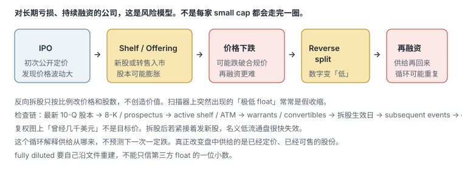

# 1.3 交易品种、多空与股票质量

> 一句话：先分清自己在交易哪一种工具，再把「强势股」拆成可核验的流通盘、相对成交量、点差和价格行为。低 float 不是天赋，是双向更肥的尾巴。

第 01 章说清了你在投机短期波动，第 02 章说清了账户能借什么、不能保证什么。这一章处理标的本身。课程会依次介绍股票、共同基金、指数、ETF、期权、商品和外汇。判断一个工具是否适合日内交易，至少要看：

- 是否能在盘中连续成交；
- 买卖价差和深度；
- 价格波动是否足以覆盖成本；
- 是否有杠杆、到期、保证金或强制平仓；
- 数据和交易时段是否清楚；
- 自己是否被券商批准交易该产品。

「批准」不是小事。美国券商通常要求单独开通期权权限；卖空需要保证金账户和可借库存；有的低价股或 OTC 名字会被限制。屏幕上能画图，不等于账户能成交。

本书不收加密货币。商品和外汇若出现在原课程里，只作为「另一种工具」的对照，不构成本卷的交易方法。

## 1.3.1 股票：日内关心的不是企业故事本身

股票代表公司的权益。日内交易关注的是可交易价格、流动性和事件驱动，不等于你对公司长期价值作出了判断。你可以完全不给这家公司估值，仍然交易它今天的供需失衡；你也可以读完整份 10-K，仍然因为点差太宽而放弃。第 04 章会说明基本面在日内里的正确用法：确认催化、排除融资地雷，而不是算出「公允价值」再去盘中兑现。

普通股、ADS（美国存托股份）、权证（warrant）、权利（rights）和特殊单位不是同一种证券。扫描器上的代码看起来像股票，打开详情可能是权证或单位。小盘过滤的第一层，就是排除自己策略不交易的证券类型。OTC（场外）报价、披露和停牌机制与交易所上市的 NMS 股票不同，不能把第 05 章的扫描器逻辑直接套过去。

## 1.3.2 共同基金通常不是日内工具

共同基金由一篮子资产构成，可以降低单一股票敞口。这是它作为长期配置工具的优点。它通常按每日净值（NAV）处理申购赎回，不像交易所上市股票和 ETF 那样在盘中连续报价、连续成交。因此它不是常规日内交易工具。你无法在 10:15 对一只典型共同基金做「突破前高」这种动作，因为那时没有可成交的连续价格。

课件里有时会写「共同基金通常跑输市场」。这句话过于笼统。主动基金表现取决于类别、基准、费用和观察区间，不能用一句话概括全部产品。对本书来说，只需要记住功能差异：要做盘中连续交易，看股票和 ETF，不看按日计价的共同基金。

## 1.3.3 ETF：盘中可交易，不等于风险和股票一样

ETF 在交易所盘中成交，可以跟踪指数、行业、商品或其他资产。对大盘日内策略，流动性好的指数 ETF 往往点差更窄、深度更好、halt 更少。这是它相对小盘动量股的执行优势。

即使底层指数波动不大，**杠杆或反向 ETF** 仍可能有很高的路径风险和持有成本。它们的设计通常按日重置，持有隔夜或跨越多个交易日时，收益不必等于「指数涨跌 × 杠杆倍数」。本书若提到杠杆 ETF，只作为「工具里有额外路径风险」的例子，不把它当成小盘动量的替代品。

ETF 的「流通盘」含义也和单只股票不同。申购赎回机制会改变份额供给。不要把小盘股那套 float 启发式原样贴到大型指数 ETF 上。大盘看的是流动性、点差、是否跟指数同向，以及 VWAP 这类被机构盯着的位置。细节在后面的大盘卷；本卷只要先分清：同一套「低 float + 新闻」过滤器，不是给所有 ETF 用的。

## 1.3.4 期权：权利、义务和到期

课程对期权的初步介绍是：买方支付权利金（premium），换取在约定时间按约定价格买卖底层资产的权利；卖方收到权利金，同时承担被指派后的履约义务。买方有权利而非义务。期权价格不只受方向影响，还受剩余时间、隐含波动率、利率，以及底层价格相对执行价的位置影响。

「买方最大亏损是权利金」只适用于没有额外融资或复杂腿部风险的单纯多头期权。卖方风险结构完全不同：裸卖认购（naked call）的亏损理论上不封顶。未平仓的短期权可能在到期前被指派；多腿策略也可能因其中一腿被指派而暴露新的股票或保证金风险。美国券商通常要求单独批准期权权限。

官方说明：[FINRA — Options](https://www.finra.org/investors/investing/investment-products/options)

期权在本书后面有独立的卷。本卷只要求三件事：不要用股票的仓位公式去套期权；不要在没有权限和没有读过风险披露时交易期权；不要把 0DTE 彩票式推销当成第 01 章说的「可重复 setup」。第 02 章已经提到，新的盘中保证金要求通常覆盖保证金账户当天的活动，包括 0DTE 用到的保证金。

## 1.3.5 指数、商品、外汇：对照，不是本卷主场

指数本身往往不可直接交易，你交易的是跟踪它的期货、期权或 ETF。商品和外汇有自己的时段、保证金和展期规则。课程把它们列出来，是为了说明「不是所有市场都是同一种交易」。本卷的选股、催化和扫描器，默认针对美国上市股票。把小盘 gapper 的启发式拿去套外汇或商品，是错配。

## 1.3.6 Market Cap、Shares Outstanding 与 Float

这三个词不能混用。

```
Market capitalization = 当前股价 × 已发行在外股份数（shares outstanding）
```

- **Shares outstanding**：公司已发行、目前由投资者持有的股份。包括内部人持有的部分。
- **Public float**：通常指排除内部人、控股股东等受限持股后，公众可交易的部分。
- **实际盘中供给**：当日真正愿意在当前价格附近卖出的数量，通常远小于名义 float。Level 2 上此刻看得见的卖单，又只是实际供给的一个可见切片。

课程有时会把 float 近似说成「shares outstanding」。这会造成误解。低 float 只是名义供给较少，不代表 Level 2 上一定没有卖单，也不代表价格必然上涨。第三方数据商的 float 还可能：

- 更新时间不同，尚未计入发行、行权或转换；
- 直接把 shares outstanding 当成 float；
- 没处理 reverse split；
- 对外国发行人 / ADS 口径不同。

扫描阶段可以使用近似值。决定较大仓位前，回到最新 SEC 文件和公司行动核对。把 float 写成区间，比假装精确到一股更诚实。例如写「第三方约 8–12M，10-Q 期末 outstanding 为 X，近期有 ATM，按 fully diluted 可能更高」，比写「float = 8,234,000」更接近事实。

市值（market cap）用来给公司规模分类：大盘、中盘、小盘、微盘。分类边界因数据商而异。对日内动量策略更关键的往往是 float 和当日成交，而不是市值标签本身。一只市值看起来不小、但 public float 很小的名字，盘中行为仍可能像低 float 股票。反过来，float 很大但当天没有人交易的名字，点差一样可以宽到无法执行。

## 1.3.7 为什么课程偏好低价、低 Float 股票

课程策略集中在一组经常一起出现的特征：

- 较低股价；
- 较小 public float；
- 当日上涨幅度大；
- 有新闻或其他催化；
- 成交量显著高于该股自己的过去；
- 成为市场主要关注对象。

其逻辑是：有限可交易供给遇到突然增加的需求，价格更容易快速移动。这是供需语言，不是价值投资语言。

同一组特征也会放大：

- 点差；
- 滑点与部分成交；
- 停牌（LULD 或其他 halt）；
- 融资或增发风险；
- 借股成本；
- 做空挤压（squeeze）；
- 单一大订单对市场的影响——包括你自己的订单。

因此「波动大」是机会来源，也是执行风险来源。只保留前半句，后半句会在第一次 halt down 或第一次跳空穿过止损时找上门。

视频给出的大约 100 万至 1,500 万股流通盘、价格大约 3–20 美元（有的课写成 2–20，有的口语会说「低于 10 美元更难借」），是课程交易风格的**候选范围**，不是行业定义，也不是物理学。本书一律标成**启发式**：可以写进扫描器当起始过滤，必须用自己的样本验证。换市场、换年份、换价格区间，同一个数字会失效。

太低的价格：点差以百分比计会变得很大，halt 更密，部分券商不可保证金，借股更难。太高的价格：同样的风险预算买不到多少股，一跳的美元波动可能已经超过 1R。这两个方向都不是「绝对不能做」，而是同一套仓位公式会给你很少的股数——那是公式在起作用，不是机会被浪费。

小账户去打最拥挤、spread 最宽的低价股，名义上「股数很多」，实际上一跳就超过计划风险。股数多不是优势，每股风险乘股数才是你在赌的东西。

## 1.3.8 成交量与 RVOL：今天是否真的有人交易

成交量是某段时间内成交的股数。绝对成交量没有统一的「够不够」数字。有用的是相对量，以及量和价格是否一起推进。

课程使用的基本概念是：

```
Relative volume = 当前成交量 ÷ 同期或日均基准成交量
```

如果过去平均每日成交 250,000 股，而今天成交 2,500,000 股，按「整日对整日」口径就是 10 倍。这个口径在上午天然偏低或失真：上午 10:00 的累计成交量，本来就不该去除以「全天平均」。


实际平台可能采用：

- 当前时刻与过去同一时刻比较（time-of-day RVOL）；
- 当前整日累计量与 30 日平均整日量比较；
- 最近五分钟相对历史可比五分钟；
- 不同回看窗口；
- 是否排除盘前盘后；
- 是否剔除异常日；
- 拆股后 volume 是否调整。

所以看到 `RVOL 5` 时先确认平台定义，不能直接把不同扫描器的数字横向比较。课程使用很高的 RVOL 阈值来筛选小盘异动股，这是讲师的个人过滤条件，不是普遍定律。

绝对成交量还要相对 float 解读。同样 500 万股成交，对 300 万流通盘和 3 亿流通盘完全不同。前者可能意味着名义筹码已经换手超过一轮，后者可能只是安静的一天。

成交量高时通常更容易进出、点差更小，但这不是绝对关系。放量要和价格一起看：放量突破、放量滞涨和放量下跌的含义不同。高 RVOL 加上价格不再推进，可能是早期持仓者在用后来者的需求退出。第 05 章会把 RVOL 写成扫描器字段；这里要先接受：RVOL 回答「今天是否异常」，不回答「现在该买」。

## 1.3.9 Long 的现金流

做多流程：

1. 买入股票；
2. 账户承担股票下跌风险；
3. 通过卖出平仓。

```
Long P&L = 卖出价 − 买入价 − 每股交易成本
```

极端情况下普通股票价格可接近零，所以无杠杆多头的理论最大损失接近投入资本。使用保证金后，还要考虑强平和欠款。第 02 章的例子已经说明：名义上控制 90,000 美元股票，亏损 40,000 美元可以超过初始存款。跳空和停牌时，平台无法保证按止损价成交。

做多还有一层常被忽略的成本：你以为自己在 5.00 买了 1,000 股，实际成交可能是 400 股在 5.00、600 股在 5.08，或者只成交一部分。部分成交会让计划风险和目标同时变形。质量差的股票——点差宽、深度薄——会把「计划里的 Long」变成「执行后的另一笔交易」。

## 1.3.10 Short 的现金流

做空前需要有合理的 locate / borrow 安排。券商没有可借股份时，不能因为看跌就直接卖出。开仓时卖出借来的股份，平仓时买回并归还，即 buy to cover。

```
Short P&L = 卖空价 − 回补价 − 借股与交易成本
```

股票上涨没有理论上限，因此裸露空头损失也没有固定上限。风险预算必须按止损后的美元损失计算，不能按收到的卖空收入计算。你在 5.00 卖空收到 5,000 美元，并不意味着你「最多只能亏 5,000」——价格到 8.00 时你已经亏了 3,000，到 15.00 时更亏，中间还可能被召回。

借股可用性和费用会随券商、日期甚至盘中时点变化。低价股、IPO 和高拥挤度股票可能 hard to borrow，但不能用固定「10 美元以下」作为普遍边界。那是启发式口语。释放未用完的 locate（有的平台叫 credit）是退库存，不是平仓。借了 100 只用 50，locate 费按 100 算，每股成本会翻倍。

空头还有一层和多头不对称的质量问题：你看空的那只股票如果当天成为全市场焦点，回补需求和追涨需求会叠在一起。高 short interest 可能放大 squeeze，但数据滞后，不能单独当信号。第 04 章会写 short interest 的分母和日期；第 06 卷会写 locate 的执行细节。本卷只要先拒绝一句口语：「这只股票空头太多，所以一定会涨。」

## 1.3.11 SSR：不是「只能在上涨时做空」

课件有时把 Short Sale Restriction 说成「只能在 uptick / ask 做空」。这是交易口语，不是规则的精确定义。

Regulation SHO **Rule 201** 的核心是：

1. 上市市场确认股票在常规时段较前一常规时段收盘价下跌至少 **10%**；
2. 触发后，普通短卖单不能在当前 National Best Bid（全国最优买价）或更低价格显示或执行；
3. 限制持续到触发日结束和下一交易日；
4. 若下一日再次下跌至少 10%，可以重新触发并继续延长；
5. 触发判定只发生在常规时段，但生效后可在存在持续 NBBO 的扩展时段适用；
6. 法规存在特定例外，普通交易者不应自行把订单标成 short exempt。

因此 SSR 可能改变短卖成交位置，却不保证股价上涨、制造 squeeze 或阻止继续下跌。它也不是「价格每一跳都必须上涨才能空」。Ask、last price 和 national best bid 不是同一个东西，不能混用。

官方说明：[SEC — Rule 201 FAQ](https://www.sec.gov/rules-regulations/staff-guidance/trading-markets-frequently-asked-questions-7)

对股票质量的含义是：一只已经触发 SSR 的下跌股，空单更难按你想要的价格成交。计划里的空头失效位和目标，必须按「限制后的可成交价」重算，而不是按触发前的盘口重算。SSR 出现在观察名单上，是执行约束，不是看涨催化。

## 1.3.12 Catalyst、Attention 与可交易性

课程提出一个常见链条：

```
新闻出现 → 算法和快速交易者反应 → 成交量增加 → 涨幅榜曝光 → 更多交易者加入
```

这个链条可能成立，但不能据此断言每次最早买入都来自算法，也不能只因为股票上榜就认为新闻有效。需要区分：

- 公司原始公告；
- SEC 文件；
- 交易所通知；
- 媒体二次报道；
- 社交媒体转述；
- 纯粹因为价格上涨而产生的关注（价格本身变成了「新闻」）。

「价格已经涨了很多」可以继续吸引需求，也可能意味着晚到交易者正在为早期持仓者提供退出流动性。注意力是可交易性的原料之一：没有人看，点差往往更宽，图形更少被共同识别；所有人看，假突破、抢跑和同步止损也会增加。第 04 章专门处理催化的真伪；这里只要先把「有人看」和「现在值得参与」分开。

## 1.3.13 什么是强势股票

课程会拿出低波动、低关注度的反例：价格长时间窄幅横盘，没有明显扩张的成交区间。对动量策略而言，利润空间可能不足以覆盖点差、滑点和错误退出。但「不适合这套动量策略」不等于股票质量差，也不等于不能用于其他策略。评价必须带上策略和持仓周期，不能把「无波动」写成绝对坏事。一只窄幅整理的大盘股，对 VWAP 均值回归策略可能刚好合适。

课程的候选条件可以整理为：

| 条件 | 想捕捉什么 | 需要防什么 |
|---|---|---|
| 显著涨幅 | 当日方向性 | 追在情绪末端 |
| 高 RVOL | 新关注与流动性 | 放量出货 |
| 低 float | 供给有限 | 剧烈跳空和停牌 |
| 新闻催化 | 需求来源 | 误读、旧闻、融资 |
| 历史曾大涨 | 市场记忆 | 样本选择偏差 |
| 「明显」 | 注意力集中 | 拥挤交易 |

供需失衡和交易者情绪，是价格快速扩张的概念框架。图上看不到「所有买方是谁」，只能看到成交后的价格和数量。真正可执行的信息是：突破是否有成交量支持、回撤是否守住结构、点差是否可接受。供需解释不能替代明确的 trigger、invalidation 和仓位计算。

Warrior 课程强调的 quality，落到执行上是：

- 文件和新闻对得上，不是空壳炒作到无法定价；
- 不是正在死亡的流动性（点差已经宽到计划止损没有意义）；
- 你能说出今天的故事，也能说出故事证伪时长什么样。

「无法定价」的意思是：halt 带已经近在眼前、spread 占了计划 1R 的一大半、盘口上一跳就是计划止损的两倍。这样的名字即使故事好听，也不是高质量的日内标的。选股的目标不是找到「最会涨」的股票，而是找到**即使判断错误，也能以计划风险完成退出的异动股票**。

## 1.3.14 「最明显的股票」为什么有时更好交易

当大量交易者同时观察同一个高成交量标的时，常见图形可能更容易被共同识别，订单也更集中。水平位更干净，成交更连续，部分成交的概率下降。这是「做最明显的那一只」这句话有价值的一半。

另一半是拥挤：

- 更多流动性可能改善成交；
- 更拥挤也可能造成假突破、抢跑和快速反转；
- 多只股票同时活跃时，资金和注意力会分散；
- 当天涨幅榜第一名仍可能完全不符合自己的价格或风险规则——例如第一阻力离现价只有 0.3R，或 upper LULD 已经贴着第一目标。

所以问题不是「它是不是全市场最热」，而是：

```
它是否同时满足我的策略条件，并且还能以可接受风险成交？
```

明显只解决「有人看」，不解决「当前价格是否值得参与」。第 05 章会把这句话写成观察名单上的 Skip if。

## 1.3.15 Base Hit 不能忽略成本

课程建议先追求较小、可重复的每股利润，而不是用小仓位等待不现实的大行情。这个执行思想有价值：先证明自己能按规则拿走一段，再考虑是否要拿第二段。课程中「先证明手续费前盈利，再放大股数」的说法需要修正。

如果一个策略在现实成本后没有正期望，单纯放大股数通常会放大亏损；仓位增加还会恶化滑点。正确验证顺序：

1. 用实际或保守估算的全部成本回测；
2. 按真实成交规则模拟部分成交；
3. 确认成本后期望值为正；
4. 再逐级增加仓位；
5. 每一级重新评估滑点和成交率。

期望值近似为：

```
EV = 胜率 × 平均盈利 − 败率 × 平均亏损 − 平均全部成本
```

「Base hit」不是「忽视成本的小盈利」。一笔去掉佣金、路由费和滑点之后期望为负的 0.05 美元利润，放大 10 倍股数，得到的是 10 倍的负期望，外加更差的成交。第 01 章的 R 在这里再次有用：先问这笔 base hit 是 +0.8R 还是扣完成本只剩 +0.1R，再问胜率是否撑得住。

## 1.3.16 盘前与盘后不是普通时段的缩小版

美国股票常规时段通常为美东 09:30–16:00。券商和交易场所自行决定向客户开放多长的盘前、盘后或 overnight session。课程画面里的具体时间不是统一规则。视频提到课程策略后来开始参与盘前交易。延长时段常见：

- 成交量与价格竞争较少；
- Spread 更宽、波动更大；
- 可见报价可能只来自部分场所，不同系统可能展示不同报价；
- 订单路由与最优执行处理可能不同；
- 很多券商只接受限价单；
- 新闻导致价格跳跃；
- 常规时段开盘价可能与盘前最后价差异很大；
- 未成交订单是否进入下一时段，取决于 Time-in-Force。

官方风险说明：[SEC — After-Hours Trading](https://www.sec.gov/about/reports-publications/investorpubsafterhourshtm) 以及 [SEC After-Hours Trading Investor Bulletin](https://www.sec.gov/files/afterhourtrading.pdf)

对股票质量的含义是：同一只股票在 08:30 和 10:30 可以是两种质量。盘前 gap 很大、成交却只有几千股，这个 gap 本身的「价格」可能并不可靠。第 05 章写 gap 扫描时会再问：极低盘前成交量是否足以形成可靠 gap。这里先记住：时段是质量的一部分，不是背景噪音。

## 1.3.17 小盘常见的融资循环（风险模型，不是命运）

长期亏损、持续融资的小盘公司，历史上反复出现过一种路径：IPO 之后通过 shelf / offerings 增加股数，价格下跌，跌破交易所合规价，做 reverse split 把报价抬回去，然后再融资。



这不是每家 small cap 的必然生命周期。它是风险模型：用来解释扫描器上突然出现的「极低 float」为什么常常是假收缩。Reverse split 机械降低 shares outstanding 后，第三方 float 会跟着变小，但潜在 warrants、convertibles 和新发行仍会把供给送回来。复权图上「曾经几千美元」不是目标价。

检查链：

1. 最新 10-Q 的 shares outstanding；
2. 最近 8-K / prospectus supplements；
3. active shelf / ATM；
4. warrants 和 convertible terms；
5. reverse split effective date；
6. subsequent events；
7. cash burn 与 going concern。

需要沿最新文件重建 fully diluted share count，不能只看一个第三方 float 数字。第 04 章会教这些文件分别回答什么。本卷先把循环放进「质量」：一家刚做完 1:40 reverse split、货架还在、现金只够一个季度的公司，和一家 float 同样「看起来很低」、但没有持续稀释史的公司，不是同一类标的。

## 1.3.18 日线是否值得继续往下查

打开候选之后，先看日线往往比先看一分钟更省时间。从当前价格向左查看历史阻力、大实体 K 线、200 日均线、是否刚做过 reverse split 复权。黑屏或数据尚未加载时，不能凭扫描器数字下单。GME 一类课程热点只是历史例子，不能成为「热门就可以忽略 price / float」的永久例外。

日线通过的标准，取决于策略。对小盘动量，常见问题是：上方到前高或前平台还有没有空间？空间若小于计划 1R，即使盘前很热闹，也不是好的多头候选。对空头，问题则是：下方有没有清晰的失效位，还是已经跌到无处再量空。日线只是过滤器，不是入场。日线通过后才值得继续研究 catalyst 和 entry，减少在二十只名字之间来回切换的时间。

## 1.3.19 停牌、点差和借股是质量的一部分

美国个股没有「每天固定 ±10% 就不能再成交」的统一涨跌幅。课程里的 halt，主要是短时间剧烈波动时的临时交易暂停，常见机制是 LULD（Limit Up–Limit Down）。暂停期间，普通卖单和止损单不能让你退出；恢复后可能直接跳空。常见的「五分钟」不是恢复时间保证。

对质量评估的直接含义：

- 低价、低 float、高波动的名字，halt 密度更高；
- 仓位必须在进入暂停前就考虑最坏情况；
- 点差突然扩大到计划止损没有意义时，这只股票对你的策略已经不合格，即使它仍在涨幅榜第一；
- hard to borrow 的名字，空头策略不合格，直到库存和费用可接受。

这些不是进阶技巧。它们是第 05 章观察名单上的 No-trade 条件。

## 1.3.20 最小候选检查表

进入图形分析前先回答：

- 交易的是普通股、ADS、ETF 还是期权？权证和 OTC 是否已被排除？
- 当前时段和券商规则是什么？盘前是否只接受限价？
- 新闻的原始来源是什么？还是只有价格上涨本身？
- public float 和 shares outstanding 的口径是什么？数据日期？是否刚 reverse split？
- RVOL 平台如何计算？分母是整日、同时刻还是五分钟？
- 当前点差、可见深度和预计滑点是多少？计划 1R 是否已经被点差吃掉一半？
- 是否停牌、SSR、hard to borrow 或临近融资事件？
- 这只股票符合自己的 setup，还是仅仅「很热」？
- 日线上到第一阻力 / 第一支撑还有没有空间？
- 即使判断错误，能否以计划风险退出？

这几节的真正重点不是记住「低于 10 美元、float 小于 10M」等固定筛选数字，而是学会把供给、需求、注意力、成本和执行风险同时放进筛选过程。讲师的数字是启发式。你的扫描器可以先抄过去当漏斗，样本不够之前，不要把启发式升级成信仰。

## 先记住这些

- 先分清工具：共同基金通常不能做盘中连续交易；杠杆 / 反向 ETF 有额外路径风险；期权要单独权限，买卖双方风险不对称。
- Market cap、shares outstanding、public float、盘中真实供给是四层东西。第三方 float 常过期或口径错误。
- 低价 + 低 float + 高 RVOL + 新闻，是课程风格的候选特征，也是点差、halt、稀释和挤压同时放大的特征。
- 做多亏完本金是无杠杆下的理论上限；做空亏损不封顶，且必须先借到。SSR 限制空单价格，不是禁空，也不是必涨。
- RVOL 必须先写分母。不同扫描器的「RVOL 10」可以不是同一句话。
- 「最明显」改善共同识别和流动性，也增加拥挤和假突破。问的是能否以可接受风险成交，不是它是不是涨幅榜第一。
- 成本后期望值为负时，放大股数只放大亏损。Base hit 也要扣完所有成本再谈。
- 盘前盘后不是缩小版的常规时段。时段本身改变股票质量。
- 小盘融资循环是风险模型。Reverse split 后的「极低 float」常常是假收缩。
- 日内里的质量 = 能定价、能进出、能说出证伪条件。不是「公司好」。

## 不要做的事

- 把所有市场当成同一种交易，或把小盘启发式套到大型 ETF、期权和外汇上。
- 把 float 写成精确到个位的事实，不写来源和日期。
- 只把低 float 理解成上涨弹性，不把它理解成下跌弹性、halt 和操纵风险。
- 把讲师的 2–20 美元、100 万–1,500 万股、RVOL 阈值当成行业定义。
- 把 SSR 说成「只能在 uptick 做空」或「空头要被轧了」。
- 因为涨幅榜第一就认为质量最高。
- 在手续费前的模拟盈利上直接放大股数。
- 用盘前稀薄成交的 last price 当成和常规时段同样可靠的价格。
- 在日线上方空间已经不够 1R 时，仍然因为「很热」而打开一分钟图找入口。
- 交易权证、OTC 或未被批准的期权，只因为扫描器上出现了代码。
