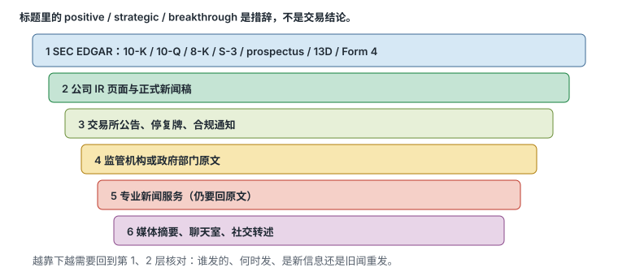
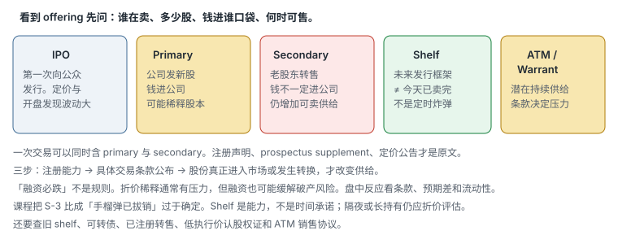
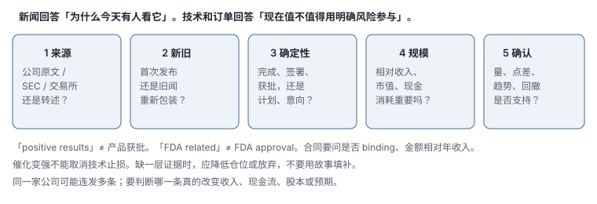

# 1.4 基本面、SEC 文件与催化

> 一句话：先确认消息是真的、是新的、是重要的，再看市场是否愿意用成交量为它定价。标题里的 positive 不是交易结论。

日内交易不以长篇公司研究为主业。你没有时间、也通常没有信息优势，去给一家微盘生物科技公司建完整估值模型。但低价小盘公司可能在盘中宣布融资、收到交易所通知或发布临床结果；这些事件会立即改变供给、波动和停牌风险。基本面在这里的工作是：**解释今天为什么有人愿意用异常成交量交易这只股票，并排除那些会让你的多头变成接盘、空头变成踩踏的供给地雷。**

新闻回答「为什么今天有人看它」。技术和订单执行回答「现在是否值得用明确风险参与」。两者缺一时，应该降低仓位或放弃，而不是用故事填补证据。催化变强，不能取消技术止损。

## 1.4.1 日内、波段与长期投资使用基本面的方式不同

课程把分析重心概括为：

- **日内交易**：以价格、成交量和执行为主，基本面用于确认催化与突发风险；
- **波段交易**：持有时间变长，需要更多考虑财务状况、行业和后续事件日历；
- **长期投资**：公司竞争力、现金流、资产负债和估值成为核心。

这不是说日内交易可以忽略基本面。区别在于问题不同。长期投资者问：「以这个价格拥有这家公司，几年后我是否得到足够补偿？」日内交易者问：「这条信息是否足以解释今天的异常量？它会不会在未来几小时改变股本或让股票停牌？我现在的点差和结构是否允许我用 1R 参与？」

同一份 10-Q，两种人读的段落不一样。日内先找 cash、shares outstanding、subsequent events、going concern、ATM 和 warrants。估值倍数可以留到周末。

课程使用约 `25% fundamental + 75% technical` 的比喻。不要把它当成可计算权重。更实用的流程是：

1. 扫描出异动；
2. 找到并核验催化；
3. 检查融资、股份和停牌等尾部风险；
4. 画出盘前高低、日线位置和关键价；
5. 只有出现符合计划的 trigger 才下单；
6. 催化变强不能取消技术止损。

`25 / 75` 是启发式口语，提醒你不要把日内做成证券分析师实习，也不要闭着眼睛只看图形。

## 1.4.2 先从原始信息源开始

建议的信息层级从强到弱：

1. SEC EDGAR 文件；
2. 公司投资者关系页面和正式新闻稿；
3. 交易所公告、停复牌通知；
4. 监管机构或政府部门公告；
5. 专业新闻服务；
6. 媒体摘要、聊天室和社交平台。



越靠后越需要回到原文验证。标题里的 “positive”“strategic”“breakthrough”“FDA related” 是措辞，不是交易结论。同一家公司可能连续发布多条消息；需要判断哪一条真的改变收入、现金流、股本或市场预期。聊天室标题的工作是提醒你去打开原文，不是替代原文。

SEC 官方入口：[EDGAR Search Filings](https://www.sec.gov/search-filings)

核对催化剂时至少回答：

- 公告来自公司、SEC 文件还是二手媒体？
- 是新信息，还是旧消息重复传播？
- 会改变收入、现金流或股本吗？
- 是否同时出现注册发行、ATM、可转债或大股东转售？
- 市场已经提前反映了多少？盘前已经翻倍的「利好」，可能已经不是你的催化，而是别人的退出流动性。

「有新闻」不等于利好。利好不等于价格会涨，更不等于你能买在低点。融资、增发和模糊的合作公告尤其要读细节。

## 1.4.3 常见文件分别回答什么问题

| 文件 | 常见用途 | 日内交易先看什么 |
|---|---|---|
| 10-K | 年度报告 | 业务、风险因素、财务、股份数量、going concern |
| 10-Q | 季度报告 | 最新财务、现金消耗、股份变化、subsequent events |
| 8-K | 重大事件的当前报告 | 协议、管理层变化、融资、重大公告、停牌相关 |
| S-3 / F-3 | 注册声明，常用于 shelf offering | 可注册证券的类型与规模，不是「已经卖完」 |
| Prospectus / 424B supplement | 对具体发行条款的补充 | 数量、价格、承销商、用途、closing 条件 |
| Schedule 13D | 超过特定门槛的实益所有权及意图 | 持有人、比例、资金来源、Purpose of Transaction |
| Schedule 13G | 符合条件的被动或特定机构持有 | 通常意图更弱，仍要看日期和比例 |
| Form 4 | 内部人权益变动 | 买卖性质、transaction code、数量、价格、持有变化 |

视频口误把 `8-K` 说成 “8-Q”。不存在与此语境对应的常规 “8-Q”。此外，S-3 本身通常只是提供发行框架，不能看到一个 shelf 就断言公司一定马上融资。

外国发行人可能用 20-F、6-K、F-3 等对应表格。ADS 的股份口径和普通股不同，float 更容易被数据商弄错。看到 F-3 或 6-K，不要因为它「不是 8-K」就当成没有文件。

## 1.4.4 10-K / 10-Q：不必逐字读，但要能定点查找

SEC 文件的交互式财务数据里，资产、负债和股东权益按报告期排列。日内交易不必为每个候选完整建模，但可以定点查 cash、debt、operating cash flow、shares outstanding 和 going-concern 风险。

`Shares outstanding` 不能直接等同于 public float。内部人、受限股和大股东持仓会影响 float 估算。一份旧季度报告只代表报告期末；后续融资、行权、转换和拆股都可能使股份数发生变化。报告期末到今天之间发生的事，往往写在 subsequent events、后续 8-K 或 prospectus supplement 里。

快速搜索词：

- `cash and cash equivalents`
- `net cash used in operating activities`
- `going concern`
- `shares outstanding`
- `warrants` / `convertible`
- `subsequent events`
- `risk factors`
- `ATM` / `at-the-market`
- `equity line`

目标不是给公司算出「正确价值」，而是回答三个问题：

1. 它是否急需现金？现金只够几个月、经营现金流持续为负、审计意见带 going concern，融资概率上升。
2. 是否存在大量潜在新增股份？warrants、convertibles、ATM、equity line、已注册未售出的 resale。
3. 这条新闻对公司规模是否真正重要？一份 200 万美元的合同，对年收入 8,000 万和年收入 150 万的公司，不是同一条新闻。

资产负债表画面上的数字是报告期的快照。不要把两个季度前的 cash 当成今天还能花的钱，尤其是烧钱快的小盘。

## 1.4.5 Shelf、发行与稀释要分三步

课程有时把 offering 简化成 IPO 后的「二次发行」，也有把 S-3 比成「手榴弹已经拔销」。两个说法都容易误导。应拆成三步：

1. **注册能力**：公司提交 shelf registration，获得未来发行某些证券的框架；
2. **具体交易**：通过 prospectus supplement、8-K 或新闻稿公布数量、价格、费用和参与方；
3. **实际影响**：新增股份进入市场、债务或认股权证发生转换，才改变真实供给和每股经济权益。



看到 “offering” 时应打开注册声明、prospectus supplement 和定价公告，核对谁在卖、多少股、何时可售和谁取得款项，而不是只看新闻标题。术语至少要分清：

- **IPO**：公司股票第一次向公众发行。定价与开盘发现过程波动很大，历史图短，lockup 口径特殊。
- **Primary offering**：公司发行新股并获得资金，可能稀释现有股东。
- **Secondary offering / resale**：可能由现有股东出售，出售所得归股东，不一定增加公司股本，但会增加可交易供给。
- 一次交易也可能同时包含 primary 与 secondary 部分。
- **Shelf registration**：只是建立未来发行能力，不一定等于当日已经完成出售。
- **ATM（at-the-market）**：按市价持续或择机出售，供给可以在你做多的那段时间里一点一点出来。
- **Registered direct**：向特定买方直接发行，条款往往一次性、可能折价、可能附带 warrants。
- **Warrants 和可转债**：另一层潜在供给，执行价和转换价决定压力何时出现。

官方入口：

- [SEC：Registered Offering 定义](https://www.sec.gov/resources-small-businesses/glossary)
- [SEC：Investing in an IPO](https://www.sec.gov/file/ipo-investorbulletinpdf)

检查具体发行时看：

- 是 common stock、preferred、debt、warrant 还是组合；
- registered direct、underwritten、ATM 或其他结构；
- 发行价相对当前价（折价多少）；
- 新增股数相对现有 shares outstanding（稀释比例）；
- 是否附带低执行价认股权证；
- 募资净额和用途；
- closing 条件及日期；
- 是否还有旧 shelf、可转换债和已注册转售股份。

「融资必跌」不是规则。折价和稀释通常造成压力，但融资可能缓解破产风险；真正的盘中反应由条款、预期差、持仓和流动性共同决定。不能只靠「offering = bearish」机械做空，也不能在刚宣布大规模折价增发时按原计划追多。

课程把 shelf 比作已经拔销的手榴弹太绝对。Shelf 是能力，不是时间承诺；但对隔夜或长时间持有确实需要折价评估。盘中已经翻倍、历史上每次脉冲后都融资的名字，隔夜多头要把「明天可能出定价公告」算进尾部风险。

Offering 风险的快速检查可以写成一张卡：

- active S-3 / F-3；
- ATM sales agreement；
- latest 424B prospectus；
- registered direct；
- resale registration；
- warrant exercise price；
- cash runway；
- history of financing after spikes。

盘前已经翻了数倍、正在停牌、刚宣布大规模增发的，观察名单里直接排除，或把仓位上限降到接近零。

## 1.4.6 Stock Split 与 Reverse Split 不创造价值

拆股只是按比例调整价格和股数：

```
拆股后持仓市值 ≈ 拆股前持仓市值
```

例如 1:10 reverse split 后，理论上股数变成十分之一、价格变成十倍。它可以让报价重新高于交易所最低价格，也会机械地降低 shares outstanding 和 float 数字，但不会自动改善业务。比较历史图表和 float 时必须使用调整后的口径，并检查拆股后是否紧接着发行新股。

正向拆股（stock split）同样不创造价值。它改变的是每股价格和股数，方便某些投资者交易，不改变公司整体权益。日内里更常造成麻烦的是反向拆股：扫描器突然显示「极低 float」、复权图上出现「曾经 2,000 美元」的幻象、未复权数据让 RVOL 和均线错位。第 03 章的小盘循环在这里落地：reverse split 往往是循环里的一环，不是新生。

## 1.4.7 13D：看申报人的计划，不要只看名字

Schedule 13D 的价值在于披露实益所有权、资金来源和 `Purpose of Transaction`。应直接阅读申报人的具体计划，而不是看到某个知名投资者的名字就做多。课程用过长期下跌与某位激进投资者申报持股同时出现的历史例子。两者同屏不能推导因果。知名投资者持股不保证价格上涨；建仓成本、投资期限、对冲和治理影响力都可能与散户完全不同。课程举出的价格和持仓是历史案例，不能作为当前交易信号。

还要区分 13D 与 13G。后者通常用于符合条件的被动或特定机构持有人，意图披露较弱。文件出现后，先确认：

- 申报日期；
- 交易实际发生日期（可能早于申报）；
- 市场是否已经消化；
- 比例相对 float 还是 outstanding；
- Purpose 里写的是积极影响治理、单纯投资，还是可能再买 / 再卖。

13D 是研究入口。它很少单独构成当天的盘中催化，除非市场第一次知道、且 Purpose 足够具体、且成交量正在确认。

## 1.4.8 Form 4：买入、授予与卖出不是一回事

内部人交易需要查看 transaction code 和脚注：

- 公开市场主动买入与薪酬授予、期权行权不是一回事；
- 卖出可能来自预设计划（10b5-1）、税务代扣或真实减持；
- 单笔金额应相对其总持仓和薪酬判断；
- 文件公布有时间差，市场可能已经反应。

所以「CEO 买了」或「内部人在卖」只能成为研究入口，不能直接成为多空指令。一笔相对总持仓很小的象征性买入，和把年薪再加一倍买进，信息量不同。一笔为了缴税而卖出的 Form 4，和清仓式减持也不同。读脚注。

## 1.4.9 新闻催化的五层验证

读到新闻后依次问：

1. **来源**：公司原文、监管文件，还是媒体转述？
2. **新旧**：首次发布，还是旧消息重新包装？同一条临床数据隔两周再发一遍，不是新催化。
3. **确定性**：已经完成、签署、获批，还是计划、申请、意向、non-binding、framework？
4. **规模**：金额相对公司收入、市值和现金消耗是否重要？
5. **市场确认**：成交量、点差、趋势和回撤结构是否支持？



五层里缺一层，就降低仓位或放弃。不要用第四层的「故事很大」去填补第一层「找不到原文」。也不要用第五层「已经涨了 80%」去证明第一层——价格可以在谣言上走完，等原文出来再反转。

## 1.4.10 生物科技尤其不能靠形容词

生物科技新闻是小盘催化里最容易被标题伤害的一类。必须区分：

- preclinical、Phase 1 / 2 / 3；
- enrollment、interim result、top-line result；
- FDA submission、acceptance、approval；
- endpoint 是否达到，是 primary 还是 secondary；
- 样本量和安全性；
- 公司自己的新闻稿与完整研究数据（poster、publication、FDA 文件）。

「positive results」不等于产品获批。「FDA related」也不等于 FDA approval。Phase 1 的安全性数据，和 Phase 3 达到主要终点、随后获得批准，不是同一个事件。样本量很小的「阳性」信号，可能在更大试验里消失。安全性问题可以单独成为负向催化，即使疗效看起来不错。

读生物科技催化时，额外问：

- 这是公司新闻稿还是独立期刊 / 监管文件？
- 对照是什么？有没有安慰剂或标准治疗？
- 下一步是什么：再做试验、申报、商业化，还是还早？
- 公司现金够不够走到下一步？不够，这条「阳性」后面可能还是融资。

## 1.4.11 按类型拆开的催化

小盘课程把催化分类。分类的用处是：每一类要问的问题不同，不能共用同一张「有新闻」标签。

### Earnings（财报）

不预测报告，而是等公布后比较：

- actual vs consensus（如果有一致预期）；
- revenue / EPS 质量：是持续经营还是一次性项目；
- guidance：上修、下修还是不给；
- one-time items：出售资产、减值、会计变更；
- 当日成交量和 price acceptance：市场是否接受这个新价格。

小盘常常没有可靠的分析师覆盖。没有 consensus 时，比较的是公司自己上次给的展望、现金消耗和股份变化，而不是「超预期 2 美分」。

### FDA / Clinical

见上一节。阶段、终点、样本、批准进度缺一不可。

### Contract（合同、订单、合作）

比较：

- 合同金额与年收入；
- 是否 binding，还是 LOI、MOU、framework、pilot；
- 执行周期：钱是今天进还是三年里分批；
- 利润率：收入很大、利润可能很薄；
- 对手方是谁，是否可以随时取消。

「签署战略合作」而没有金额、没有约束力，通常是弱催化。市场有时仍然会炒，那是注意力，不是合同质量。你若参与，仓位应按注意力交易来，并准备好注意力消失。

### Merger / Buyout（并购）

明确：现金、换股、条件、交易价、是否有融资条件、是否有监管批准、是否有 go-shop 或终止费。价格快速靠近确定的现金 offer 时，剩余 upside 可能很小，而 deal break 的下行可能很大。这更接近事件交易，不是动量突破。不确定的「听说在谈」几乎不能当催化，除非有 8-K 或交易所通知。

### Offering（发行）

对 long 通常是供给风险，但要看价格、规模、warrants 和市场预期。见第 5 节。刚宣布大规模折价发行时，多头计划要重写；空头也要防「融资解除破产担忧」的短挤。

### Split / Reverse split

本身不创造价值，可能改变报价、float 展示和合规状态。见第 6 节。

### Analyst target（分析师目标价）

来源质量和当时关注度决定影响。覆盖稀疏的小盘上，一份来路不明的「目标价 12 美元」通常弱于原始公司事件。大盘上，龙头券商的评级变化可能带动板块，那是另一套流动性环境。孤立 target 很少单独构成高质量小盘催化。

### Hot sector / Sympathy（板块情绪、跟风）

同一行业可能因共同输入价格、政策或重大公司新闻一起波动。例如油价变化会影响能源企业，也可能通过成本影响航空公司。但两家公司仍有不同的资产负债、套期保值、收入地区、业务组合、float 和做空拥挤度。

因此板块龙头上涨并不自动让所有小盘同业成为好交易。先找到 leader，再检查 sympathy stock 是否有**独立成交量与结构**。没有自己的量，只是被标签拖着走的名字，回撤时同样没有自己的买盘。Leader–laggard 的交易结构在后续策略卷；本卷只要拒绝「同板块所以同走势」。

## 1.4.12 纯技术异动：不要把它写成催化

课件承认无明确新闻的异动也可能很强，并会举出极端历史案例。必须同时记住：

- 「没有找到新闻」不等于确实没有信息；可能是数据延迟、社交信息、行业联动或未知原因；
- 无法解释的上涨会吸引 short，也会增加 exchange inquiry、offering 和突然砸盘的风险；
- 可以观察 technical setup，但应降低 conviction、仓位和持有时间。

不要把「纯技术」写成催化。它只表示当前没有可核验的 fundamental catalyst。历史暴涨案例是选择性样本，必须把失败的无新闻拉升纳入记忆：它们同样存在，只是更少被反复播放。

课程列出的历史暴涨 IPO 或无新闻暴涨，同样是选择性案例。必须把失败 IPO、开盘后迅速跌破发行价、lockup 到期砸盘纳入样本，才配谈「这类股票会怎样」。

## 1.4.13 IPO 与近期上市

初次上市交易的风险包括：

- price discovery：没有长长的日线让你画「前高」；
- 极宽 spread；
- float / lockup 口径特殊，公开可交易部分可能很小；
- opening auction 行为与普通股票不同；
- halt 更常见；
- borrow 往往缺失，空头策略可能根本不存在。

Recent IPO 的突破还要看 lockup、secondary sale 和此前高点。发行价、首日高点、lockup 到期日，是比「第三方 float」更值得记的数字。不要把 IPO 第一周当成普通 gapper 来套第 05 章的扫描器阈值。

## 1.4.14 Short Interest：可能的回补需求，不是做多指令

高 short interest 可能放大 squeeze，但数据滞后。使用时先问：

- 数据对应哪一个 settlement date；
- 分母是 float 还是 shares outstanding；
- 之后是否拆股或发行（分母变了，百分比就废了）；
- short volume 是否被误当成 short interest（日内 short volume 不是空头持仓存量）；
- days-to-cover 使用何种平均成交量；
- 当前 borrow fee 和可用性，是否已经贵到空头在减仓。

不能把 daily short volume 当 short interest，也不能用超过 100% 就断言违法。超过 100% 的报告值可以来自分母口径、做空后再借、数据时点不一致。高 short interest 也可以反映真实的基本面风险：很多人愿意付费做空，往往不是因为他们都在「错误」。它不能单独做多。

13D、Form 4 和 short interest 有一个共同点：都是滞后披露。你看到数字时，持仓可能已经变了。把它们当背景，不当触发。

## 1.4.15 Sector Sympathy 只能是辅助催化

把第 11 节的板块逻辑再钉一次，因为它最容易在热门日子里毁掉纪律。油价、利率、FDA 对某一疗法的态度、某一龙头的并购，都可能让一串代码一起动。辅助催化的意思是：

- 它解释「为什么今天这个板块有人看」；
- 它不给你入场许可；
- 每只 sympathy stock 仍要独立通过第 03 章的质量检查和第 05 章的名单条件。

两家公司标签相同，float、借股、现金和图表结构可以完全相反。先找 leader，再决定 laggard 是否值得观察。Laggard 没有量，就只是同标签。

## 1.4.16 基本面与技术面怎样接在一起

把前面的流程写成盘前可以执行的顺序：

1. 扫描器给出异动（第 05 章）；
2. 找到原始链接和发布时间；
3. 用五层验证走一遍；
4. 打开最新 10-Q / 8-K / shelf / ATM；
5. 记录融资风险和 fully diluted 的方向（变多还是暂时稳定）；
6. 再画盘前高低、前收、日线阻力；
7. 写 trigger、invalidation、第一目标和 no-trade；
8. 催化再好，没有 trigger 就不下单。

有催化、没有结构：观察。有结构、催化经不起核对：降仓或放弃。有催化、有结构、点差已经吃掉 1R：放弃。三句话已经覆盖大部分「我明明研究对了却亏钱」的日子。

## 1.4.17 盘前催化检查卡

每天对进入观察名单的每一只，至少填完：

- 原始链接和发布时间；
- headline 与正文是否一致；
- 事件是完成、批准，还是仅计划；
- 金额与公司规模的比例；
- 最新 10-Q 的 cash burn；
- 最新 shares outstanding 与近期变化；
- shelf、ATM、warrant、convertible；
- 盘前成交量、点差和关键价；
- 是否存在停牌、退市或合规风险；
- 技术 trigger、invalidation 和最大美元损失。

最终候选卡可以压成下面这个模板，和第 05 章的观察名单共用：

```text
Symbol / security type:
Price / spread:
Float source/date:
Premarket volume / RVOL definition:
Catalyst source/time:
Financing risk:
Daily room:
Premarket levels:
LULD:
Borrow:
Primary setup:
Trigger / invalidation / target:
Max shares:
No-trade:
```

本节真正要训练的是快速验证：**先确认消息是真的、是新的、是重要的，再看市场是否愿意用成交量为它定价。** 验证失败时，最有价值的输出是「今天不交易这只」，而不是再找一个能说服自己下单的形容词。

## 1.4.18 需要保留和修正的观点

可以保留：

- 新闻、量能、float 和价格结构应结合；
- 回到原始公告和 SEC 文件，不停在聊天室标题；
- 融资、权证和可转债是供给，必须单独检查；
- 板块跟风只能当辅助，要有独立的量和结构。

必须修正：

- 「有催化剂的股票」仍会受大盘、行业和流动性影响，不是封闭体系；
- 视频口误中的 “8-Q” 不存在；
- S-3 / shelf 不是已经拉销的手榴弹；
- 「融资必跌」「CEO 买入必涨」「高空头必挤」都不是规则；
- 课程收益图或某次 OXY / 历史 IPO 案例不能当当前信号；
- `25% fundamental + 75% technical` 不能真的拿计算器算。

## 先记住这些

- 日内用基本面确认催化和排除地雷，不用它给公司定价。催化变强不能取消止损。
- 信息源从 EDGAR 和公司新闻稿往下逐级变弱。标题形容词不是结论。
- 8-K 报重大事件；10-Q / 10-K 定点查现金、股本、going concern；S-3 是框架；424B / supplement 才是具体交易。
- Offering 要问谁在卖、钱进谁口袋、何时可售。Primary 稀释股本；Secondary 增加供给；Shelf 是能力；ATM 是持续供给。
- 拆股不创造价值。Reverse split 后的低 float 常是假收缩。
- 13D 读 Purpose；Form 4 读 transaction code 和脚注。名字和「买入」两个字不够。
- 五层验证：来源、新旧、确定性、规模、市场确认。生物科技还要拆阶段、终点和批准进度。
- 合同看是否 binding 和金额相对收入；并购看对价是否确定；分析师目标通常弱于公司原文。
- 无新闻异动不是催化。降低仓位和持有时间。
- Short interest 滞后，分母和日期必须写清。不能单独做多。

## 不要做的事

- 只看聊天室标题或「positive / FDA related / strategic」就下单。
- 把 shelf 当成今天已经完成的出售，或把 secondary 当成公司拿到了钱。
- 把 8-K 叫成 8-Q，或看到 S-3 就断言马上大跌 / 马上大涨。
- 用「融资必跌」机械做空，或在大规模折价增发后按原计划追多。
- 把 Phase 1 安全性和 FDA approval 当成同一条新闻。
- 因为同板块龙头在涨，就买入没有独立成交量的小盘同业。
- 把 13D 上的名人或 Form 4 上的「P」代码直接翻译成多空指令。
- 把无新闻暴涨的历史案例当成「纯技术也可以重仓」的许可。
- 用滞后的 short interest 百分比当 squeeze 定时器。
- 催化很好就取消失效位，或把故事写进观察名单代替条件式计划。
