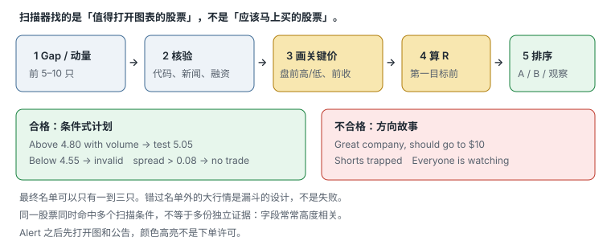

# 1.5 选股、扫描器与观察名单

> 一句话：扫描器生成观察名单，不生成买入信号。漏斗底仍然要等触发。

前面四章分别回答了：你在交易什么、账户能承担什么、什么样的工具和股票算「质量过关」、消息怎样核对。这一章处理每天早上那十分钟：全市场几百几千个代码，怎样压成一到三只你愿意盯到开盘的名字。课程把逻辑压缩成：

```
催化剂 → 成交量 → 流通盘 → 扫描器定位
```

这四项用于建立观察名单，不是自动买入信号。顺序也可以写成漏斗：扫描器先按异动程度找到「今天不同寻常」的股票，再用人核对催化、供给、点差和结构。排名靠前只能说明符合扫描条件，不能说明入场点好或风险小。


每天只盯筛出来的少数几只，比同时开二十个窗口更接近可执行。错过名单外的大行情是漏斗的设计，不是失败。扫描器的作用是减少候选，不是制造必须交易的感觉。

## 1.5.1 四步过滤，不是四步买入

课程反复出现的顺序，对应四个不同的问题：

| 步骤 | 问题 | 它不回答的问题 |
|---|---|---|
| 催化剂 | 为什么今天有人愿意用异常量交易它？ | 现在该不该买 |
| 成交量 / RVOL | 相对它自己平时，今天是否真的异常？ | 放量是推进还是出货 |
| 流通盘 / 价格 | 名义供给是否小到会放大双向波动？点差是否还能执行？ | 低 float 会不会涨 |
| 扫描器定位 | 哪些代码此刻满足我写下的条件？ | 数据是否正确、入场是否存在 |

打开名单之后，仍然要有形状、位置、触发和失效，才能变成一笔交易。第 01 章已经定死：触发在价格穿过预先画的线的那一刻。扫描器高亮发生在那之前，有时远在那之前。

选股本身就是第一层风险管理。把低 float、催化、日线和流动性放在一起，而不是只追涨幅榜。任一层不合格都可以删除候选，不必抱歉。

## 1.5.2 Scanner 是条件查询，不是推荐列表

一个扫描器根据输入字段筛选证券，例如：

- gap percentage；
- current price；
- volume / relative volume；
- float；
- change from close；
- new high；
- 五分钟动量；
- trading halt status。

结果表示「满足条件」，不表示：

- 消息可靠；
- 现在是好入场；
- 数据无误；
- 一定有足够流动性；
- 风险收益合理；
- 你的券商借得到、能保证金、能在盘前下这类订单。

课程的 scanner 是特定商业产品，界面、颜色和访问权限不是需要保留的知识。真正要学的是条件、数据定义和处理顺序。Float 列被涂成蓝色，只是软件配色，不代表低 float 自动更好；它同时意味着更高滑点和 halt risk。扫描结果是实时快照，会随价格和成交量改变，截图不能还原早晨当时的排序。

同一股票同时命中多个扫描条件，并不等于多份独立证据。Gap、涨幅、新高、RVOL 常常高度相关：一只高开 60%、盘前已经放量的股票，会同时出现在 gap 榜、涨幅榜和相对量榜上。那是同一个事件的三个字段，不是三个独立理由。

扫描器数据可能延迟。Float 与新闻分类也可能有误。候选股仍需打开图表和公告复核。Alert 后才打开图和 Level 2，不能在看到颜色高亮后直接下单。

## 1.5.3 Premarket Gap Scanner

基本 gap：

```
Gap % = (当前盘前价 − 前一常规时段收盘价) ÷ 前收盘价 × 100%
```

需要确认：

- 当前价用 last、bid / ask midpoint 还是其他值；
- 前收盘是否复权；
- 极低盘前成交量是否足以形成可靠 gap——几千股成交打出来的 40% gap，和几十万股成交打出来的 40% gap，不是同一句话；
- 昨日盘后新闻是否已在 after-hours 反应，今天的「gap」其实是昨天已经走过的路；
- 是否有拆股或 symbol change，导致前收盘和今天的代码对不上。

课程建议从 gap scanner 开始，是因为盘前最贵的资源是注意力：先处理已经跳空、已经有量的名字，比从全市场随机翻图有效。这是启发式流程，不是「只做 gap」。开盘之后，gap list 已经基本已知，工作切换到动量扫描，见第 8 节。

按 gap / liquidity 选前 5–10 只，而不是只看排名第一。第一名可能点差不可接受、正在 halt、刚宣布增发，或第一阻力只有 0.4R。第二名到第五名里，往往才有能写条件式计划的对象。

## 1.5.4 Relative Volume 的多个口径

课程把日 RVOL 近似描述为当前成交量相对过去 30 天平均量：

```
RVOL_daily ≈ 当前累计成交量 ÷ 过去 N 日平均整日成交量
```

这个口径在上午天然偏低或失真，取决于平台处理方式。更公平的是 time-of-day RVOL：

```
RVOL_tod = 今天截至当前时刻成交量 ÷ 过去 N 日同一时刻平均累计量
```

另有五分钟相对量：

```
RVOL_5m = 最近五分钟成交量 ÷ 历史可比五分钟平均量
```


必须记录：

- lookback N（20 日、30 日还是 50 日）；
- 是否包含盘前盘后；
- 是否排除异常日（上一轮已经暴涨的日子会抬高分母，让今天看起来「不异常」）；
- 分母用整日还是同一时段；
- 拆股后 volume 是否调整。

不同扫描器的 `RVOL 10` 可能不是同一含义。课程里「当天成交量是平时的 5 倍」「盘前已经成交几十万股」是讲师的过滤条件，用来缩小名单。换市场、换年份、换价格区间，同一个数字会失效。当成启发式：写进你的扫描器，用样本验证，不要当物理定律。平台对 RVOL 的基准天数和盘前数据处理也可能不同。

成交量还要相对 float 读，并和价格一起看。第 03 章写过：同样 500 万股，对 300 万与 3 亿流通盘完全不同；放量突破、放量滞涨和放量下跌含义不同。扫描器只能告诉你「量异常」，图才能告诉你「量在做什么」。

## 1.5.5 Float 数据需要核验

第三方 float 可能：

- 更新时间不同；
- 把 shares outstanding 当 float；
- 尚未计入发行、行权或转换；
- 没处理 reverse split；
- 对 foreign issuer / ADS 口径不同。

扫描阶段可以使用近似值；决定较大仓位前，回到最新 SEC 文件和公司行动核对。把 float 写成区间也比假装精确到一股更诚实。记录 float 时同时写下**来源和日期**。来源不明的「8.2M」不能进观察名单的最终栏，只能进「待核验」。

视频给出的约 100 万至 1,500 万股，是课程风格的候选范围，不是行业定义。大盘股不靠这种窗口。大盘看的是流动性、点差、是否跟指数同向，以及 VWAP 这类被机构盯着的位置。不要因为一只大盘股 float「不符合小盘启发式」就认为它今天不能交易——那只是它不属于这套小盘漏斗。

低 float 不是天然优势，而是更高的双向尾部风险。扫描器把低 float 排在前面，只说明它满足你的供给过滤器，不说明它更该买。

## 1.5.6 Short Interest 也有时间差

Short interest 通常不是实时数据。课程案例引用过很高的 short interest 百分比，并将其视为 squeeze 条件。使用时先问：

- 数据对应哪一个 settlement date；
- 分母是 float 还是 shares outstanding；
- 之后是否拆股或发行；
- short volume 是否被误当 short interest；
- days to cover 使用何种平均量；
- 当前 borrow 费用和可用性。

高 short interest 可以提供潜在回补需求，也可能反映真实基本面风险；不能单独做多。它在观察名单上是背景字段，不是 trigger。第 04 章已经写过：超过 100% 也不等于违法。扫描器若把 short interest 标红，先当提醒去查日期，不当信号。

## 1.5.7 小盘选股的六层过滤

把扫描器输出再过六层。任一层不合格都可删除，不必看到第六层才放弃。

### 价格与证券类型

排除不适用的 OTC、warrant、rights 或特殊单位，确认普通股 / ADS。确认当前价格是否落在你策略验证过的区间。启发式观察窗（不是行业定义）：大约 2–20 美元或 3–20 美元。太低则点差和停牌；太高则同样风险预算买不到多少股。区间外不是绝对禁止，而是你可能没有样本。

### Float 与实际供给

低 float 只是名义供给。还看持有人、unlock、registration for resale、刚完成的 reverse split、ATM 是否正在出货。第 03、04 章的检查链在这里落地。

### Volume / RVOL

成交量必须足以支撑你的目标股数，且异常量发生在当前时段。盘前 8,000 股的「高 RVOL」撑不起开盘后 2,000 股的订单。先问：「如果我按计划股数进出，这笔量够不够让我不是盘口上最大的傻瓜？」

### Catalyst

原始、当日、明确、与公司规模相关。用第 04 章的五层验证。旧闻、无约束力合作、找不到原文的「FDA related」，这一层就删除或降为观察。

### Daily chart

上方空间、200 MA、former-runner history、reverse-split 复权。黑屏或尚未加载时不能凭 scanner 数字下单。上方到前高不够 1R，多头候选降级。GME 等课程热点只是历史例子，不能成为「热门就可忽略 price / float」的永久例外。

### Execution

spread、depth、halt band、route、borrow。计划止损已经被点差吃掉一半，或 upper LULD 离入场不到 1R，这一层删除。空头看得到库存和费用；看不到就不写空头计划。

六层全部通过，才值得写完整的条件式计划。通过五层、执行层勉强，就降低股数或只观察。不要用「已经花了二十分钟研究」作为第七层许可。

## 1.5.8 盘前 Watchlist 流程

按顺序处理前 5–10 个，而不是只看排名第一。改写成可复现的步骤：

1. 按 gap / liquidity 选出前 5–10；
2. 验证 symbol 与 corporate action（拆股、代码变更、权证误入）；
3. 记录 float 的来源和日期；
4. 读原始 catalyst，写下链接和时间；
5. 查 recent financing：S-3、ATM、424B、warrants；
6. 画 premarket high / low、前收、日线阻力、必要时 200 MA 和 gap window；
7. 计算第一目标之前的 R；不够就删除；
8. 检查 Level 2、spread、LULD band；
9. 排序成 A / B / Observe；
10. 写明确的 no-trade。



最终 watchlist 可以只有一到三只。A 是「结构、催化、执行三层都过，开盘按计划等 trigger」；B 是「缺一层，只在非常干净的 trigger 且降低股数时考虑」；Observe 是「继续看，默认不做」。没有 C 类「随便做一下」。没有名字也不交易，是合法输出。

课程画面里扫描器左侧出代码、右侧马上打开日线和盘中图。这个联动值得保留：命中只是提醒；右侧图可能显示已经远离支撑、时间过晚或正顶在阻力。多个候选同时 alert 时，先按流动性、催化和可定义风险排序，不追最新一声提示。

## 1.5.9 Watchlist 不写方向故事

合格写法：

```text
Above 4.80 with volume → test premarket high 5.05
Below 4.55 → setup invalid
No trade if spread > 0.08 or upper LULD < 1R away
```

不合格写法：

```text
Great company, should go to $10
Shorts will be trapped
Everyone is watching
```

条件式计划允许市场否定：价格到不了 4.80，你没有交易；到了 4.80 却没有量，你没有交易；spread 变成 0.12，你没有交易。故事会诱导持仓者忽略否定：「既然 shorts 会被困，回撤只是洗盘。」观察名单上出现这类句子，就重写，写不成条件就删除该股。

## 1.5.10 开盘后切换到 Momentum Scanner

开盘后，gap list 已经基本已知。实时 momentum scanner 用来捕捉：

- 新高；
- 短时间涨幅；
- 五分钟成交量异常；
- former runner 再次启动；
- 新出现的催化；
- halt / resume。

开盘后的工作不是把盘前名单丢掉，而是：盘前 A 类按计划执行；动量扫描只为**新出现**的、通过同一六层过滤的名字开门。已经远离盘前计划、只因为又创新高就追，是另一笔没有写过计划的交易。

Former runner（历史上走过大波段的名字）会出现在某些扫描器里，逻辑是「市场记得它会动」。这是启发式，带样本选择偏差：你记得的是那些真的又动了的，不记得的是默默消失的。Former runner 仍然要过催化、量和执行三层。历史记忆不是 trigger。

## 1.5.11 Alert 后的 15 秒检查

看到新 symbol 后，用大约十几秒回答，答不全就加入观察而不是先买再查：

1. 它为什么 alert？哪一个条件被命中？
2. 当前是 fresh breakout，还是已经涨完一段、alert 只是余波？
3. 新闻是否当日、是否原始来源？
4. spread 多宽？相对计划 1R 占多少？
5. 日线第一阻力在哪里？
6. 最近结构低点到入场有多远？（离失效位远就是追）
7. 以现实 fill——不是 K 线最高价——计算是否至少满足计划 R/R？
8. 是否接近 LULD band？进去之后可能无法按计划退出。

无法在短时间确认，就观察。开盘三分钟里连点三个来不及读新闻的代码，不是「抓住动量」，是把扫描器当成了下单按钮。

## 1.5.12 「最明显」有优势，也会更拥挤

领先 gapper 和 momentum alert 往往被许多人同时看到。

优势：

- 注意力集中；
- 成交量增加；
- 共同水平更明显，计划更好写。

风险：

- 大量追价；
- 假突破和抢跑；
- halt；
- 早期持仓者借流动性退出；
- 同样的 scanner 造成同步止损——你的失效位也可能是两千人的失效位。

明显只解决「有人看」，不解决「当前价格是否值得参与」。当天涨幅榜第一名仍可能完全不符合自己的价格或风险规则。问句仍然是第 03 章那一句：

```
它是否同时满足我的策略条件，并且还能以可接受风险成交？
```

多只股票同时活跃时，资金和注意力会分散。与其三只都做半吊子，不如只做名单上 R 最清楚的那一只。错过另外两只是设计。

## 1.5.13 Hot / Cold Market 要量化

课程根据当日是否有大涨股、halt 数量来判断市场冷热。事后用盈亏解释「今天冷 / 今天热」，是循环论证：亏了就说冷，赚了就说热。可以记录成可复核指标，按预先区间调整风险：

- 盘前达到筛选条件的数量；
- 当日超过 20% / 50% 的股票数（阈值本身是启发式，用来前后比较，不是魔法数字）；
- LULD pause 数；
- leading gappers 的 median follow-through（高开之后是否继续，还是开盘即回吐）；
- 首次突破成功率；
- median spread；
- 同 setup 最近 20 笔 expectancy。

样本不够时，不要精细分十档冷热。先做三档就够：明显活跃（多个名字同时满足你的漏斗）、普通、明显枯燥（盘前凑不满三只合格候选）。枯燥日的正确输出是缩小仓位或不开张，不是降低标准去填交易次数。

按预先写好的区间调整风险，而不是亏损后说「今天市场冷」、盈利后说「市场热」。冷热是开盘前或盘中按计数器读出来的，不是复盘时的情绪标签。

## 1.5.14 时间过滤

开盘后流动性与波动通常最高，但风险也最高：点差最宽、halt 最密、计划最容易被肾上腺素替换。午后 alert 可能是：

- 真实新闻刚发布；
- 低量随机波动；
- 二次拉升；
- 收盘前资金流。

不要用固定「晚了就不做」替代分析；为每个时段单独统计 fill、胜率和 expectancy。样本不够时，保守限制到已验证时段。开盘 15 分钟、上午趋势、午休、尾盘，是四个不同的市场。把它们的成交混在同一个胜率里，扫描器回测会撒谎。

## 1.5.15 扫描器回测的常见偏差

自己改扫描条件或事后看「那天扫描器会找出谁」时，下面这些偏差会把期望值做成假的：

- 用今天的 float 回测旧日期（当时 float 可能完全不同）；
- 只保留后来大涨的 alerts，删掉立刻失败的；
- 不记录 alert 当时价格，用收盘价或最高价当入场；
- 以 K 线 high 作为可成交 entry；
- 忽略已退市证券（幸存者偏差）；
- 参数由成功图反推（先看谁大涨，再把阈值调到刚好包含它）；
- 不记录 scanner 当时延迟；
- 把同一股票连续 alerts 当独立样本（一分钟里跳三次新高，不是三笔独立交易）。

需要保存原始 alert timestamp 和当时可见字段，才能真正复现。筛选条件一改，前后结果就不能直接混在一起。扫描器 version 和参数要和成交日志一起存。

## 1.5.16 自己的最小扫描器字段

至少保存：

```text
timestamp
symbol
last / bid / ask
gap %
change %
cumulative volume
time-of-day RVOL
5m volume / RVOL
float source + date
halt status
news link + publish time
strategy/condition name
```

同时保存 scanner version 和参数。缺 timestamp 的「我记得那天它在榜上」，不能进统计。缺 bid / ask 的回测，会假装你总能按 last 成交。

## 1.5.17 Watchlist 模板与最终候选卡

盘前名单：

```text
Symbol:
Catalyst:
Gap / RVOL / Float:
Premarket high / low:
Daily resistance:
Offering / warrant risk:
Spread / depth:
Primary setup:
Trigger:
Invalidation:
First target:
Skip if:
```

更完整的最终候选卡（和第 04 章共用）：

```text
Symbol / security type:
Price / spread:
Float source/date:
Premarket volume / RVOL definition:
Catalyst source/time:
Financing risk:
Daily room:
Premarket levels:
LULD:
Borrow:
Primary setup:
Trigger / invalidation / target:
Max shares:
No-trade:
```

Max shares 必须由第 02 章的公式反推，不能由「扫描器上这只最热」决定。No-trade 至少包括：spread 超过阈值、LULD 太近、找不到原文、刚宣布大规模发行、数据未加载、已经离失效位过远。

## 1.5.18 从扫描器到交易计划

把盘前准备收成一条可执行的链，和基础课里的六步对齐：

1. 扫描器找到涨幅和量能异常的候选；
2. 核对新闻及 SEC 文件，排除明显误读；
3. 记录 float、成交量、RVOL、点差和是否容易停牌；
4. 在日线和盘中图标出前高、整数位、VWAP 等关键区域；
5. 写出触发条件、失效价、最大股数和不交易条件；
6. 开盘后只有出现计划中的价格行为才下单。

复盘时反过来问：

1. 我能否用一句话说明这只股票今天为什么活跃？
2. 当前成交量相对它自己平时究竟异常多少？用的是哪一个 RVOL 口径？
3. Float 数据来自哪里，更新时间是什么？
4. 计划风险与最坏情况下的尾部风险分别是多少？
5. 如果停牌、点差突然扩大或只部分成交，我的仓位是否仍能承受？

五问里有一问答不上，这只股票就不该从 Observe 升到 A。

## 1.5.19 大盘漏斗和小盘漏斗不要混用

小盘漏斗吃的是：gap、新闻、低 float、高 RVOL、可定义的 halt 风险。大盘漏斗吃的是：流动性、点差、与指数的关系、VWAP、更高时间框架的位置。把小盘扫描器的「涨幅 20% + float < 10M」套到大盘，会得到空名单；把大盘的「跟着指数、做 VWAP 回踩」套到 4 美元新闻股，会在第一次 halt 时发现失效位是幻觉。

本书后面有独立的小盘卷和大盘卷。本卷只要求：每天先承认自己今天跑的是哪一条漏斗，不要用同一张观察名单同时追小盘 gapper 和做大盘均值回归。注意力是有限的。扫描器可以多开，交易计划不能多开到自己执行不了。

## 1.5.20 需要保留和修正的观点

可以保留：

- 新闻、量能、float 和价格结构应结合；
- 扫描器负责发现，人负责判断；
- 先定义失效价，再由风险反推仓位；
- 每天少量名字，胜过二十个窗口。

必须修正：

- 排名第一不是买入许可；
- 讲师的 float / 价格 / RVOL 数字是启发式；
- 低 float 不是天赋；
- 有催化的股票仍受大盘、行业和流动性影响；
- 扫描器字段可能错，float 和新闻分类尤其会错；
- 结果截图中的大额盈利不能证明「跟着扫描器第一名」具有可重复优势。

选股的目标不是找到「最会涨」的股票，而是找到**即使判断错误，也能以计划风险完成退出的异动股票**。Scanner 找的是「值得打开图表的股票」，不是「应该马上买的股票」。

## 先记住这些

- 催化 → 量 → 流通盘 → 扫描定位，只生成观察名单。漏斗底还要有形状、位置、触发和失效。
- 扫描器表示「满足条件」。它不保证消息真、数据对、现在能进、风险收益合理。
- Gap % 要写清分子分母；盘前量太小的 gap 不可靠；昨收要确认是否复权、是否已在盘后走过。
- RVOL 先写口径。整日、同时刻、五分钟三种数字不能横比。课程阈值是启发式。
- Float 写来源和日期。扫描可用近似值，加大仓位前回到文件。
- 六层过滤：证券类型、供给、量、催化、日线空间、执行。任一层可删。
- 名单写成条件式：Above / Below / No trade if。不写「会到 10 美元」「空头会被困」。
- 开盘后动量扫描只接纳新通过同一漏斗的名字，不是给已经离开计划的第一名加仓。
- Alert 后先做 15 秒检查。答不全就观察，不先买再查。
- 冷热用计数器，不用当天盈亏。枯燥日可以不开张。
- 回测要保存 alert 当时字段。用今天的 float 和 K 线高点回测，会得到假期望值。
- 错过名单外的行情是设计。

## 不要做的事

- 因为涨幅榜第一就市价追。
- 把讲师的 float / 价格区间 / RVOL 倍数当成全市场标准。
- 不看催化剂，只看图形；或只看标题，不打开图。
- 看到颜色高亮或听到提示音就下单。
- 在观察名单上写方向故事，然后用故事对抗失效位。
- 同时盯二十只，或盘中每来一个新 alert 就换标的。
- 用今天的数据和收盘价回测昨天的扫描器，再把结果当成期望值。
- 市场冷的日子降低标准去「找点事做」。
- 大盘和小盘共用同一张启发式名单。
- 把 short interest 红字或 former runner 标签当成独立入场理由。
