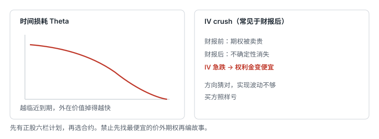

# 10.3 时间价值

> 一句话：权利金 = 内在价值 + 外在价值；到期时外在价值趋于零，买方为此付租金。



## 10.3.1 权利金的两部分

```text
期权权利金 = 内在价值 + 外在价值
```

课程常把外在价值称为「时间价值」。初学阶段可以这样记，但更准确地说，外在价值不只反映剩余时间，还包含隐含波动率、利率、股息、供需和买卖价差。到期时标准香草期权不再有时间价值，只剩内在价值对应的 payoff；到期前不能只用内在价值定价。

内在价值：

```text
Call = max(股价 − 行权价, 0)
Put  = max(行权价 − 股价, 0)
```

外在价值：

```text
外在价值 = 当前期权价格 − 内在价值
```

外在价值不会是负数。若市场价格暂时低于内在价值，通常先检查：报价是否陈旧、Bid–Ask 是否极宽、是否即将除息、是否存在提前行权价值、你看的是 Bid 还是 Mid。美式期权在有提前行权价值时，理论下限还会被行权价值托住，实盘仍可能因流动性看起来「便宜」。

举例。股价约 153 美元，150 Call 的内在价值约为 3 美元。若期权报价 4.55 美元，剩余约 1.55 美元是外在价值。OTM 期权的内在价值为 0，因此全部价格都是外在价值。ITM 不等于盈利：交易盈亏还必须扣除买入时支付的全部权利金和成本。

## 10.3.2 外在价值通常在哪里最高

在相同标的、相同到期日和相近市场条件下：

- ATM 附近的期权通常拥有较高的外在价值。市场对「会不会跨过行权价」最不确定的地方，保险费最贵。
- 越 Deep ITM，价格中内在价值占比通常越高，外在价值的绝对额和占比都可能下降。
- 越 Deep OTM，转为 ITM 的可能性通常越低，权利金可能很小。低绝对价格常伴随低到期概率和高归零概率，并不因此「更便宜」或更划算。
- 更长到期时间通常对应更多外在价值，因为未来可发生的价格路径更多。但比较不同到期日时还要注意 IV 期限结构，不能把价格差全部归因于时间。

「买低价 OTM」和「买低概率」经常是同一件事。比较合约时不要只看每张多少钱，要看：要用多少张才能达到同样的风险预算、点差占权利金的比例、归零后账户少多少。

## 10.3.3 时间损耗

只要其他条件不变，期权剩余时间减少，外在价值通常会下降，到期时外在价值归零。衡量期权价格对一天时间流逝敏感度的希腊字母是 Theta：

\[
\Theta=\frac{\partial V}{\partial t}
\]

平台常显示「经过一天」的理论变化。若 Theta = -0.063，其他输入不变，Long Option 一张标准合约的理论日损耗约为 6.30 美元。这不是账户每天机械扣除的费用，而是价格随剩余期限缩短的一个分量。

对 Long Option：

- 时间流逝通常不利；
- 标的必须产生足够快、足够大的有利变化，才能覆盖时间损耗和买卖价差；
- 方向正确但发生太晚，仍可能亏损。

对 Short Option：

- 时间流逝通常有利；
- 但标的大幅不利移动或 IV 上升，可以远远超过赚到的 Theta；
- 「卖方躺着赚钱」是危险误解。正 Theta 是承担负 Gamma、跳空和波动率风险的补偿。

Theta 不是每天均匀少一点。临近到期往往更快，ATM 附近通常更陡。课程里「90 天开始加速、30 天急剧加速」只能当经验示意，不是所有标的和行权价的固定规律。ATM、ITM 和 OTM 的 Theta 路径并不完全一样。

不能用今天不同到期日的价格，直接断言某张远期期权一个月后一定等于今天的近月价格，因为股价和 IV 会变化。周末也在模型时间内，但周末衰减会提前反映在报价和 IV 中，不能简单认为每个周末都白赚两天。

利率、股息和深度 ITM 情形可能出现例外：个别深度 ITM 欧式或美式期权的 Theta 符号会和入门口诀不一致。入门阶段先掌握「买香草期权通常付时间租金」，再在中级 Greeks 章处理例外。

## 10.3.4 用数字检查一笔 Long Call

假设：

- 股价：100；
- 买入 105 Call；
- 权利金：3；
- 到期时股价：110。

到期时：

```text
内在价值 = 110 − 105 = 5
每股净利润 = 5 − 3 = 2
标准合约利润 = 2 × 100 = 200 美元（未计费用）
```

虽然这张 Call 在股价超过 105 时已经 ITM，但买方到期盈亏平衡点是：

```text
105 + 3 = 108
```

股价在 105–108 之间时，期权有内在价值，整笔交易仍然亏损。这是初学者把「ITM」和「赚钱」搞混的标准陷阱。

再补三个到期点，仍然是同一张 \(K=105\)、\(C=3\) 的 Call：

| 到期股价 | 内在价值 | 每股盈亏 |
|---:|---:|---:|
| 95 | 0 | −3 |
| 105 | 0 | −3 |
| 107 | 2 | −1 |
| 108 | 3 | 0 |
| 120 | 15 | +12 |

如果这张表不能独立算出来，先不要学组合策略。

## 10.3.5 时间和波动率会同时动手

外在价值里有一块是「市场愿意为未来波动付的钱」。即使剩余时间没变，隐含波动率下降也会把外在价值抽走。财报前近月期权常被卖贵；财报后不确定性消失，IV 可能急跌。方向猜对、实现波动不够，买方照样亏。这叫 IV Crush，第 08 章和第 11 卷第 06 章会展开。

四个必须同时看的量：

| 发生了什么 | 对 Long Option 通常 |
|---|---|
| 标的向有利方向快速移动 | 有利（Delta、Gamma） |
| 时间流逝、标的不动 | 不利（Theta） |
| IV 上升 | 有利（Vega） |
| IV 下降 | 不利（Vega） |

「还有时间」不是买方的朋友，是买方付的租金。论点需要两周才兑现时，买只剩几天的合约，会让时间容错几乎为零。

## 10.3.6 下单前要回答

- 权利金中有多少是内在价值，多少是外在价值？
- 我的判断需要多快发生？到期日是否盖住这个窗口，并留出假启动和退出时间？
- 如果股价不动，我预计每天承受多少 Theta？
- IV 回落会不会抵消方向收益？是否临近财报、分红或其他已知事件？
- 我买的是低价格，还是低概率？
- 到期盈亏平衡点是多少？它和正股失效位是不是同一条线？
- 点差占权利金的比例是否已经大到「还没动就亏一截」？

## 先记住这些

- 外在价值不只是时间，但到期时它会趋于零。
- ATM 附近通常最贵的是不确定性，不是「最划算」。
- Theta 是局部估计，不是每天固定扣款。
- ITM 之后仍可能整笔亏损。
- 先有正股六栏计划，再选合约。禁止先找最便宜的价外期权再编故事。
