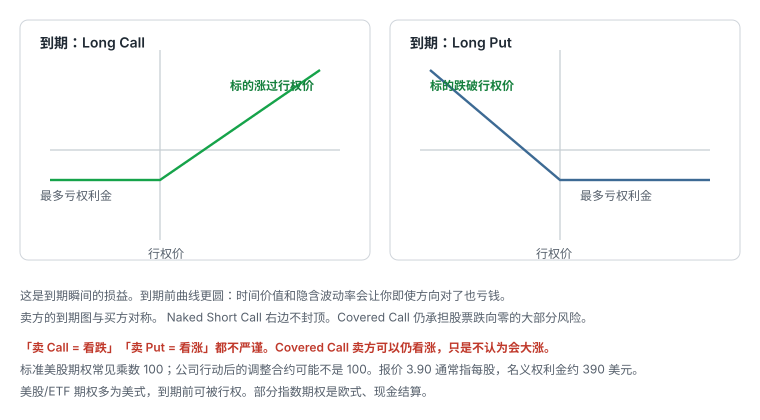
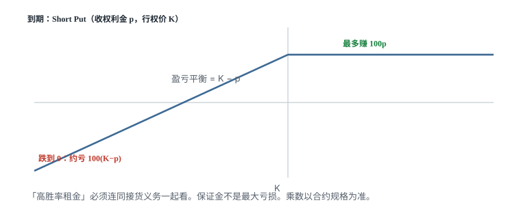

# 10.5 盈亏图

> 一句话：先画到期图，再谈到期前的曲线。ITM 不是整笔已经盈利。



## 10.5.1 先分清三种图

| 图 | 横轴 | 纵轴 | 时间条件 |
|---|---|---|---|
| 到期价值图 | 到期股价 | 合约内在价值 | 到期 |
| 到期盈亏图 | 到期股价 | 扣除权利金后的利润 | 到期 |
| 到期前价格曲线 | 当前股价 | 期权理论/市场价格 | 某个到期前时点 |

最常见错误是把「ITM 后产生内在价值」误当成「整笔交易已经盈利」。盈亏图必须计入最初权利金。第二种常见错误是把到期折线当成持仓期间的实时盈亏。到期前还有外在价值，曲线更圆；时间价值和隐含波动率会让你即使方向对了也亏钱。

本卷所有「最大收益 / 最大亏损 / 盈亏平衡」默认指到期、忽略费用和乘数之后的每股结果。标准合约的美元金额通常再乘 100。调整合约、现金结算指数要改乘数和结算定义。

## 10.5.2 不考虑权利金时的到期价值

Long Call：

```text
max(到期股价 − 行权价, 0)
```

Long Put：

```text
max(行权价 − 到期股价, 0)
```

Short 一方的合约价值方向与 Long 相反。折线拐点在行权价。Long Call 在行权价以上开始产生内在价值；Long Put 在行权价以下开始产生内在价值。这张图暂未扣权利金，所以还不是完整的交易盈亏。

## 10.5.3 计入权利金后的四个基础头寸

设：

- 到期股价为 \(S_T\)；
- 行权价为 \(K\)；
- Call 权利金为 \(C\)；
- Put 权利金为 \(P\)。

| 头寸 | 到期利润（每股） | 最大亏损 | 最大收益 | 盈亏平衡点 |
|---|---|---|---|---|
| Long Call | \(\max(S_T-K,0)-C\) | \(C\) | 理论无限 | \(K+C\) |
| Short Call | \(C-\max(S_T-K,0)\) | 裸卖时理论无限 | \(C\) | \(K+C\) |
| Long Put | \(\max(K-S_T,0)-P\) | \(P\) | \(K-P\)（股价到 0） | \(K-P\) |
| Short Put | \(P-\max(K-S_T,0)\) | \(K-P\)（股价到 0） | \(P\) | \(K-P\) |

以上均未计合约乘数和费用。

权利金使 Long Call 曲线整体下移，使 Short Call 曲线整体上移。拐点仍是行权价，盈亏平衡点则移动到 \(K+C\) 或 \(K-P\)。多空合约到期损益在费用前互为相反数。

必须立刻加上的限定：

- Short Call 只有在裸卖时才呈现理论无限风险。Covered Call 必须把股票头寸一起计算，见第 07 章。
- Short Put 的下界是标的跌到零，不是无限。但这「有界」可以接近全额行权价，一张 420 Put 收 9.45，法定最大亏损仍是 41,055 美元（乘数 100）。
- Long Call 与 Long Put 都是「先付有限成本，等待足够大的有利移动」。
- Short Call 与 Short Put 都是「先收有限权利金，承担不利尾部移动」。
- 卖方「多数价格区间盈利」不等于期望收益必然更高。仅看胜率会忽略单次损失大小、保证金、滑点和波动率风险。



## 10.5.4 自查例题

买入一张 \(K=100\)、权利金 \(C=4\) 的 Call：

- 到期股价 95：每股亏 4；
- 到期股价 102：内在价值 2，每股仍亏 2；
- 到期股价 104：盈亏平衡；
- 到期股价 115：每股赚 11。

如果不能不看答案算出这四个结果，应先暂停组合策略。

再练一张 Short Put：卖出 \(K=145\)、收 \(P=3\)。

```text
最大收益 = 3 × 100 = 300 美元
盈亏平衡 = 145 − 3 = 142
最坏到期损失 = (145 − 3) × 100 = 14,200 美元
```

这里的 300 美元收入对应的是承担最多约 14,200 美元风险和接货义务，不能类比为无风险「租金」。

## 10.5.5 到期前为什么是曲线

到期前的期权价格还包含外在价值，因此不会完全贴着到期内在价值折线。

直观形状：

- Deep OTM Call 对股价小幅变化通常不敏感，曲线较平（Delta 接近 0）。
- Call 逐渐进入 ITM 后，对股价的敏感度提高，曲线斜率增大（Delta 上升）。
- Deep ITM Call 的斜率接近 1，走起来像股票，但仍有剩余外在价值和提前行权判断。
- 斜率对应后续会学到的 Delta；曲率对应 Gamma。
- 价格曲线并非固定：剩余时间和 IV 改变时，整条曲线都会变化。

所以「我方向对了，图上应该已经赚钱」在到期前不成立。标的向有利方向走得太慢，外在价值掉得比 Delta 赚的还快，曲线会把你按回亏损区。

## 10.5.6 画图顺序

面对任何策略，按下面顺序画：

1. 画横轴股价与纵轴利润。
2. 标出所有行权价。
3. 分别写出每条腿在各价格区间的到期价值。
4. 把所有腿相加。
5. 加上收到的权利金、减去支付的权利金。
6. 标最大收益、最大亏损和盈亏平衡点。
7. 最后再单独讨论到期前的 Theta、Vega 和提前退出。
8. 再单独问：哪一腿是美式空头？除息日在不在期限内？被指派后图是否暂时失效？

不要先看平台自动生成的漂亮图再倒推结构。平台图通常假设组合一直完整、忽略点差、忽略提前指派。单腿被指派或停牌时，图上的最大亏损会暂时失真。

## 10.5.7 组合图只在各腿都还在时成立

后面会学到 Covered Call、垂直价差、Straddle、Collar。它们的到期图都是把单腿图相加。相加有两个前提：

- 各腿数量、乘数、到期日按你写的那样还在；
- 券商按组合识别保证金和风险。

一腿提前指派、一腿无法平仓、或你拆腿只平了一边，图就必须重画。第 11 卷第 05 章会用拆腿后的 Iron Condor 说明：拆腿本身是一笔新交易，不能继续沿用旧图的止损。

## 10.5.8 先记住这些

- 三种图不要混用。
- 四个基础头寸的最大盈亏和盈亏平衡必须能手算。
- 到期前是曲线，Delta 和 IV 都会改你的实时盈亏。
- 卖方多数区间盈利 ≠ 期望值为正。
- 有限风险 ≠ 小风险。图是到期理论，不是成交保证。
