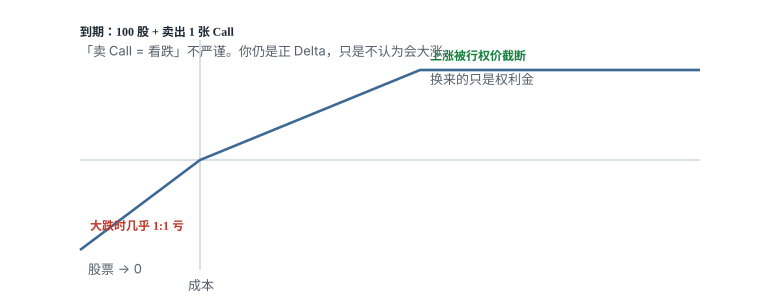

# 10.8 Covered Call 与平价

> 一句话：Covered Call 用一部分未来上涨换现在的权利金；同一张到期图可以用别的腿拼出来。

## 10.8.1 Covered Call 到底换掉了什么

Covered Call（备兑看涨）由两部分组成：

- 持有相应数量的标的（标准合约通常是 100 股）；
- 卖出 1 张同一标的的 Call。

设买股价格为 \(S_0\)，Call 行权价为 \(K\)，收到权利金 \(c\)，到期股价为 \(S_T\)。一组 Covered Call 的到期盈亏为：

\[
m\left[(S_T-S_0)+c-\max(S_T-K,0)\right]
\]

其中 \(m\) 是合约乘数，标准股票期权常见为 100。因此：

- 最大利润：\(m(K-S_0+c)\)；
- 盈亏平衡点：\(S_0-c\)；
- 上涨超过 \(K\) 后，利润不再增加；
- 股价下跌时仍会亏，权利金只提供 \(c\) 美元/股的缓冲；
- 标的跌到零时，损失仍接近 \(m(S_0-c)\)。

所以这不是「股票加一笔额外收益」，而是用一部分未来上涨空间，交换现在确定收到的权利金。股票部分随股价一比一涨跌；Short Call 在行权价以下保留权利金，在行权价以上开始抵消股票收益。两条腿相加后，右侧变成水平线，代表收益被封顶；左侧仍向下倾斜，说明股票下跌风险没有消失。

「Covered Call 本身不会让你亏钱」是错误的。Call 被股票覆盖，只代表上涨时能够交付股票，不代表组合没有亏损。相对单纯持股，Short Call 没有新增无上限下跌，但显著改变了上涨收益和指派结果。

假设股票成本 \(S_0=150\)，卖出 \(K=160\) 的 Call，收到 \(c=3\)：

- 最大利润：\((160-150+3)\times100=1{,}300\) 美元；
- 盈亏平衡点：\(150-3=147\) 美元；
- 股价跌到零的最大损失：约 \(147\times100=14{,}700\) 美元；
- 到期高于 160 时，股票通常会被按 160 卖出。

## 10.8.2 对课程案例的正确理解

课程用麦当劳举例：股价约 186 美元时卖出一周后到期、行权价 190 美元的 Call，收到约 2.20 美元/股。

到期结果应分三段看：

- \(S_T < 183.80\)：组合总体亏损；
- \(183.80 \le S_T \le 190\)：组合盈利，且随股价上升；
- \(S_T > 190\)：最大利润固定为 \(190-186+2.20=6.20\) 美元/股。

课程把 1.18% 的单周权利金直接年化，再假设一半交易成功。这种算法不能用于预期收益，因为它忽略：

- 每周可卖出的 IV 和权利金不同；
- 股票下跌造成的损失；
- 股票快速上涨造成的机会成本；
- 买卖价差、手续费、税务和提前指派；
- 为避免被行权而回购或滚动合约的成本。

Call 被股价突破后，以更高价格买回会形成 Short Call 亏损。这不是策略失败的异常情况，而是上涨封顶的正常成本。若股票长期落后市场，权利金可能只是部分弥补持股机会成本。回购 Call 保留股票，相当于主动放弃原来的封顶并确认期权损失。再卖更远 Call 是一笔新交易，不会自动消除旧亏损。

## 10.8.3 什么时候可以考虑 Covered Call

适用前提通常是：

- 本来就愿意持有这 100 股（或对应乘数的标的）；
- 在到期前愿意按 \(K\) 卖出；
- 对短期走势偏中性或温和看涨；
- 收到的权利金足以补偿让渡上涨空间；
- 能接受除息日前后或 Deep ITM 时被提前指派。

开仓前先问：**如果明天股价暴涨，我真的愿意按行权价交出股票吗？** 如果答案是否定的，就不该只因权利金看起来高而卖 Call。

滚仓也不是免费延长。回购原 Call 可能产生亏损，新卖出的合约同时引入更长时间和新的尾部风险。Roll = 平掉旧仓 + 建立新仓；旧仓盈亏已经实现，不会被删除。「滚到不亏」为止属于心理记账，不改变市场价值。原 Call 尚未平仓时再卖一张，可能暂时形成超额 Short Call，不能机械重叠。

若到期时股价接近 Strike，不要只等自动失效。收盘后价格变化仍可能影响行权，最终是否被指派具有不确定性。

四种具体用法（收租、被动止盈、主动止盈、弱对冲）放到第 11 卷第 03 章。本卷只要求能画出组合图，并接受「愿意在 \(K\) 交股」这个硬条件。

## 10.8.4 Put–Call Parity 的准确形式

对于同一标的、同一行权价、同一到期日的欧式期权，忽略交易摩擦并考虑无套利关系：

\[
C-P=S_0-PV(K)
\]

等价地：

\[
P+S_0=C+PV(K)
\]

如果标的在到期前支付股息，还要加入股息现值或使用连续股息率版本。美式股票期权可能提前行权，因此一般不能机械套用上述等式，只能结合提前行权边界分析。

课程写成 \(P+S=C+K\)，把到期支付的 \(K\) 当成今天的现金，没有处理利率、股息和时间价值。它适合帮助看懂到期收益图，不是精确报价公式。

两边到期时在所有股价情形下都有相同现金流，所以今天价格应接近。实盘差异不只是「一分钱误差」，还可能来自 Bid–Ask、股息、利率、提前行权和不可同时成交。发现报价偏离不等于获得无风险套利，必须先计入真实成交成本和执行限制。

## 10.8.5 三组常用的合成关系

由平价关系可以得到：

### Protective Put 与 Fiduciary Call

\[
S_0+P=C+PV(K)
\]

左边是持股并买 Put；右边是买 Call 并持有足以在到期支付 \(K\) 的现金。两者到期现金流相同。只比较「股票 + Put」与一张裸 Call，会漏掉右侧现金。

### Covered Call 与 Cash-Secured Put

\[
S_0-C=PV(K)-P
\]

左边是 Covered Call；右边是持有行权资金并卖 Put。两者到期收益形状相同，但实际资本占用、股息、提前指派、税务和券商保证金可能不同。ATM Covered Call 仍是正 Delta 看涨结构，而不是「希望股票不涨」。

### Synthetic Long

\[
C-P=S_0-PV(K)
\]

同一行权价、同一到期日的 Long Call + Short Put，产生类似远期多头的风险敞口。加上相应现金或融资后，才与持股关系完整。

Long Call 提供行权价以上的上涨收益；Short Put 承担行权价以下的下跌损失。两者拼接后形成近似直线型多头敞口。图上「净权利金只花 54 美元」不等于只承担 54 美元风险：Short Put 可能要求买入 100 股，券商也会占用大量保证金或现金。同一 \(K\)、同一到期日的 Call 与 Put 的 Theta、Vega 通常会大幅抵消，不能把该组合简单描述成只承担「时间损耗」。

Synthetic Long 必须按 Short Put 的完整指派义务预留资金。

## 10.8.6 实盘检查

- [ ] Call 与 Put 是否为同一标的、行权价和到期日？
- [ ] 计算是否使用了正确的合约乘数？
- [ ] Covered Call 的盈亏平衡点和股票最大下跌损失是否写出？
- [ ] 是否愿意在 \(K\) 卖出股票？
- [ ] 是否检查除息日和提前指派风险？
- [ ] Synthetic Long 是否按 Short Put 的完整指派义务预留资金？
- [ ] 平价比较是否计入利率、股息、Bid–Ask 和手续费？
- [ ] 是否把 \(P+S=C+K\) 误当成精确报价公式？

## 先记住这些

- Covered Call 是卖出上涨、留下下跌。
- 权利金年化不能当预期收益。
- 欧式平价用 \(PV(K)\)；美式还要考虑提前行权。
- 同一张到期图可以换腿，但现金、股息、指派和税务不会一起换干净。
- 合成多头的净权利金很小，却仍可能承担大额义务。
