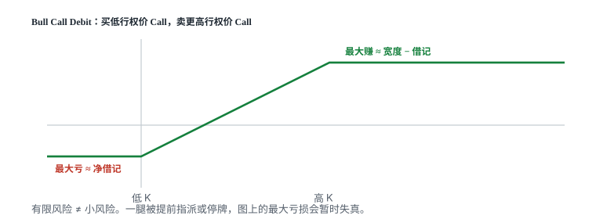

# 11.5 垂直价差

> 一句话：第二条腿用来买保险或卖保险；最大盈亏必须手算，不能只看平台绿色概率。



## 11.5.1 为什么增加第二条腿

Vertical Spread（垂直价差）由：

- 同一标的；
- 同一到期日；
- 同为 Call 或同为 Put；
- 不同 Strike；
- 一买一卖

组成。只有同到期、同类型的 vertical 才能直接用本章的表。

对 Long Option，加一条 Short Option 可以降低净成本，同时封顶一部分潜在收益；对 Short Option，加一条更远的 Long Option 可以限定尾部损失，同时减少收到的权利金。

买 450 Put 后再卖 430 Put，表示只购买 450 到 430 区间的下跌收益。跌破 430 后，两条 Put 的 Delta 逐渐抵消，收益封顶。卖出第二条腿降低成本，同时放弃极端下跌继续获利。下单时应按组合净价成交，避免先成交一腿产生裸露风险。

Short Call 收权利金，Long Higher-Strike Call 设定最大损失。少收一部分净 Credit，换来 Defined Risk。最大损失不是图上直观看到的 Strike 差，还要减去净 Credit。Long 保护腿不能随意单独卖掉，否则会重新变成 Naked Short Call。

## 11.5.2 四种垂直价差

| 方向 | 结构 | 开仓现金流 |
|---|---|---|
| Bull Call Spread | Long 低 Strike Call + Short 高 Strike Call | 通常 Debit |
| Bull Put Spread | Short 高 Strike Put + Long 低 Strike Put | 通常 Credit |
| Bear Put Spread | Long 高 Strike Put + Short 低 Strike Put | 通常 Debit |
| Bear Call Spread | Short 低 Strike Call + Long 高 Strike Call | 通常 Credit |

两种 Bull Spread 都在两条 Strike 之间随股价上涨而获利。低于下方 Strike 和高于上方 Strike 时，盈亏都封顶。相同 Strikes 的 Call 与 Put 版本，到期 payoff 可通过平价关系对应。但开仓现金流、提前指派、股息、保证金和税务并非完全相同。

先确定方向和愿意交易的价格区间，再选 Call 或 Put。不能因为 Credit Spread「先收钱」就认为更划算。Debit 占用现金，Credit 会锁定相应风险额度。应比较整组 Bid–Ask、流动性和提前指派风险。

Warrior Swing 课用支撑区上方的 Put Credit Spread 表达看涨 / 中性，用阻力区下方的 Call Credit Spread 表达看跌 / 中性。正股位置只帮助选 Strike，不能因为 Strike 在支撑下方就认为安全；隔夜跳空可直接越过两条 Strike。

## 11.5.3 最大盈亏与盈亏平衡

设两 Strike 的宽度为：

\[
W=K_{\text{high}}-K_{\text{low}}
\]

乘数为 \(m\)，费用另计。

### Debit Spread

净 Debit 为 \(d\)：

- 最大亏损：\(d\times m\)；
- 最大利润：\((W-d)\times m\)；
- Bull Call 盈亏平衡：\(K_{\text{low}}+d\)；
- Bear Put 盈亏平衡：\(K_{\text{high}}-d\)。

Bear Put Debit Spread：高 Strike Put 是 Long Leg，低 Strike Put 是 Short Leg。股价高于高 Strike 时亏掉全部 Debit；股价低于低 Strike 时赚到宽度减 Debit。

### Credit Spread

净 Credit 为 \(c\)：

- 最大利润：\(c\times m\)；
- 最大亏损：\((W-c)\times m\)；
- Bull Put 盈亏平衡：Short Put Strike \(-c\)；
- Bear Call 盈亏平衡：Short Call Strike \(+c\)。

课程说相同宽度下「Credit 越多，成功概率越低；Debit 越少，成功概率越低」。这常与 Strike 离现价更近或更远相关，但不能只用 Credit/Debit 推出准确概率。券商显示的 Probability of Profit 也是基于模型和 IV 的估计。

较高潜在回报通常对应更难达到的价格区间。但概率、赔率和期望值是三个不同指标。显示 52% 不代表 52% 会实现，也不包含滑点和提前退出。最大亏损必须在下单前独立核算，不能只看平台绿色概率。「靠近 ATM 就是 50/50」过度简化。

## 11.5.4 怎么实际构建

课程案例一是 Bear Call Credit Spread：用 Long Higher-Strike Call 限定 Naked Short Call 的上行损失。

课程案例二是 Bull Call Debit Spread：用 Short Higher-Strike Call 降低 Long Call 在高 IV 环境中的成本。Long 140 Call 提供主要看涨敞口；Short 155 Call 降低成本，同时把最大收益封在 155。第二条腿也减少部分 Vega、Theta 和 Gamma，但抵消比例会动态变化。开仓理由应是「愿意只赚到 155」，不是单纯觉得第二条腿有收入。

方向信心较强时，Debit Spread 可比 Credit Spread 保留更多方向空间，但最大收益仍被短腿限制。若正股目标低于 Short Call Strike，付出的宽度可能没有被充分利用。

### Spread 宽度

- Strikes 离得远：更像原来的单腿，成本 / 风险较大，潜在收益更高；
- Strikes 离得近：净成本 / 最大损失较小，盈利区间和最大收益也较小；
- 窄 Spread 的手续费和 Bid–Ask 占最大收益比例可能更高；
- 宽窄没有统一最优，要比较期望值和账户损失上限。

课程说 Spread 只适合短期投机、不适合系统交易，这是个人风格，不是产品性质。Vertical Spread 可用于短期、长期或系统化策略，关键是期限、定价和风险控制。

股价提前快速越过两条 Strike 时，Spread 仍可能因剩余时间价值未立即达到到期最大值。在最大利润剩余很少时继续持有，是用大量剩余风险换少量收益。

### 退出与到期

标的在两 Strikes 之间时，一条腿可能 ITM、另一条 OTM，最容易产生非预期股票。即使两腿都 ITM，也可能因行权截止、账户资金或提前指派产生暂时敞口。「赚到最大利润 80% 就走」是管理规则示例，不是最优定律。最稳妥做法通常是按组合限价平仓，不依赖自动行权替你管理。

不要拆保护腿。若确实要拆，必须把剩余头寸当作全新 Naked / Long Option，重新核算保证金和最大亏损。

四种退出可以同时写进计划：价格目标（预定净价）、正股结构失效、时间止损、事件 / 波动率改变。不要只对单腿设止损。分别市价平腿会增加成本与裸露风险。

到期前检查：两腿 ITM/ATM/OTM 组合、短腿是否可能提前指派、是否有除息、到期后会形成多少股票、购买力、流动性、券商截止时间、是否值得为最后少量利润继续承担 Pin Risk。

## 11.5.5 拆腿是一笔新交易

Warrior Swing 课的 TSLA 不对称 Iron Condor 说明了这一点。初始结构是两组 Credit Spread，两侧 Credit 严重不对称：上方 Call Spread 收得多，也说明市场对触及上方 Strike 定价更高。标的突破后 Call 侧成为主要亏损。讲师买回 Short Call、留下 Long Call，仓位由 Defined-Risk 变成单独 Long Call。Delta / Gamma / Vega 全部改变。

拆腿本身不是可普遍复制的「修复法」。这次结果盈利，不能证明以后遇到亏损价差都应该移除短腿。每次拆腿后都必须重新核对挂单、剩余合约、净 Greeks、最大损失和新的退出规则，不能继续沿用原 Spread 的止损。Credit 越诱人，通常对应更高的被触及风险。

截图若使用拆股前历史价格，不能把名义价格直接与当前标的对照。

## 11.5.6 用 Greeks 理解第二条腿

Vertical Spread 的 Greeks 是两腿之和。因为两腿同类型、方向相反，Delta、Gamma、Theta 和 Vega 会部分抵消。

- Strikes 越近，两腿敏感度通常越相似，净 Greeks 越小；
- Strikes 越远，保护腿影响越小，组合越像单腿；
- 「只剩 Delta」是近似说法，时间和 IV 在持有过程中仍可能显著影响 Spread；
- 极窄 Spread 只需很少现金，但净 Delta 和最大利润也小，不能把低成本误认成高效率无风险杠杆。

到期附近短腿周围 Gamma 敏感。Defined Risk 仍可能亏到最大值。

## 11.5.7 下单前检查

- [ ] 两腿标的、类型和到期日是否完全一致？
- [ ] 方向和 Strike 顺序是否正确？
- [ ] 净 Debit/Credit 是否按整组限价？
- [ ] 最大利润、最大亏损和盈亏平衡是否手算一致？
- [ ] Short Leg 是否存在提前指派或除息风险？
- [ ] 到期股价落在两 Strike 之间时如何处理？
- [ ] 平仓是否按组合进行，避免留下裸腿？
- [ ] 若拆腿，是否已按新仓重写最大亏损？

## 11.5.8 四个结构用同一组数字

设现价 100，乘数 100，忽略费用。宽度都是 5 美元。

**Bull Call Debit：** 买 100 Call 付 4.20，卖 105 Call 收 2.00，净 Debit \(d=2.20\)。

```text
最大亏损 = 2.20 × 100 = 220
最大利润 = (5 − 2.20) × 100 = 280
盈亏平衡 = 100 + 2.20 = 102.20
```

到期 99：两腿都废，亏 220。到期 103：内在价值合计 3，减去 2.20，每股赚 0.80。到期 110：宽度吃满，赚 280。

**Bull Put Credit：** 卖 100 Put 收 3.80，买 95 Put 付 2.10，净 Credit \(c=1.70\)。

```text
最大利润 = 170
最大亏损 = (5 − 1.70) × 100 = 330
盈亏平衡 = 100 − 1.70 = 98.30
```

到期 101：两腿都废，留 170。到期 90：宽度亏满 330。先收钱不表示更划算：这里最大亏损大于 Bull Call 的 220。

**Bear Put Debit / Bear Call Credit** 把方向反过来，公式对称。手算四次，直到不看表也能写。

课程说「Credit 越多成功概率越低」。常见原因是短腿更靠近现价。这是启发式，不是从 Credit 金额能反推的精确概率。平台 52% 不含滑点和提前退出。

## 11.5.9 宽度、点差和「80% 就走」

5 美元宽、净 Debit 2.20 的价差，若每腿点差 0.15，来回可能吃掉 0.30，约占最大利润 280 的 11%。1 美元宽的窄价差里，同样点差占比会高得多。窄价差不是自动更安全，只是把手续费和滑点变成更显眼的成本。

标的早已越过短腿、价差市价已经是宽度的 90% 时，继续拿到期是在用剩余 Pin / 指派风险换最后 10%。「赚到最大利润 80% 就走」是管理规则示例。也可以按正股失效离场。不能把其中一条写成定律。

两腿都 ITM 时，到期可能行权与指派对冲，账户仍要按券商流程处理资金。一腿 ITM、一腿 OTM，最容易变出意外股票。按组合限价平仓，比赌自动处理更干净。短腿在除息前仍可能被提前指派，保护腿还在不等于账户不会先出现股票。两腿流动性也可能不对称：保护腿更远 OTM 时点差更宽，出清整组的净价会差于两腿 Mid 之差。先手算最大盈亏，再看平台数字；对不上就停。宽度、净价、乘数三项写在同一行。


