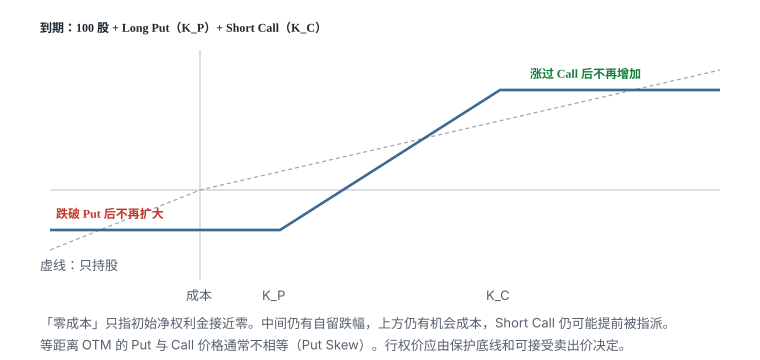
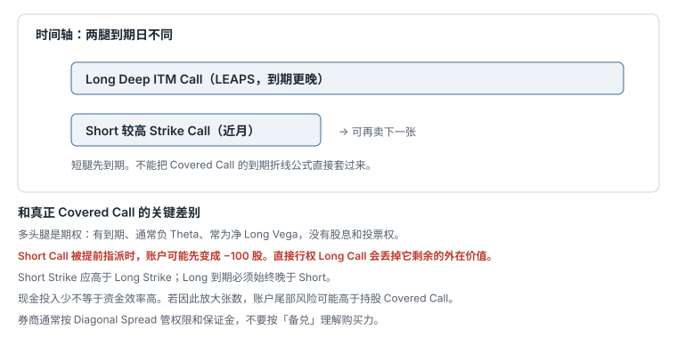

# 11.7 Collar 与 PMCC

> 一句话：Collar 用上涨换下跌边界；PMCC 用长期 Call 代替股票，不是真正的 Covered Call。



## 11.7.1 Collar

Collar 由三部分组成：

- 相应股数的股票；
- Long OTM Put；
- Short OTM Call；
- 两张期权通常使用相同到期日。

Put 限定下方，Call 补贴 Put 成本并封顶上方。它不是免费的保护，而是用上涨机会换下跌边界。

设股票成本 \(S_0\)，Put Strike \(K_P\)，Call Strike \(K_C\)，期权净 Debit 为 \(d\)，乘数 \(m\)：

- 最大亏损：\(m(S_0-K_P+d)\)；
- 最大利润：\(m(K_C-S_0-d)\)；
- 中间区间的盈亏平衡：\(S_0+d\)。

若开仓收到净 Credit，把 \(d\) 取负号代入即可。低于 Put Strike 后，到期损失不再扩大；高于 Call Strike 后，到期利润不再增加；两 Strike 之间近似持股。图例净权利金为零时最大盈亏看起来对称，现实中并不一定对称。

### Zero-Cost Collar

卖 Call 收到的权利金恰好覆盖 Long Put 时，初始净权利金约为零。但仍有：

- 股票下跌到 Put Strike 的自留损失；
- Call 以上的机会成本；
- Bid–Ask 和手续费；
- 提前指派和股息风险；
- 税务影响。

由于股票 / 指数期权常有 Put Skew，等距离 OTM Put 和 Call 的价格不保证相同。Strikes 应由保护底线和可接受卖出价决定，不必追求几何对称。

Put Strike 决定愿意承担多少下跌；Call Strike 决定愿意放弃多少上涨。两者越近，锁定区间越窄。到期时间会改变成本、Theta、Vega 和提前指派概率，不是「期限长短保护效果完全一样」。

对冲是否长期保留取决于风险目标。养老金、集中持股或有明确负债的账户可能合理地长期滚动 Collar；不能一概说长期对冲错误。

### Beta Hedge 不是绝对保险

课程用 SPY ATM Put + Short Call 对冲一个股票组合。正确做法应按组合美元 Beta 估算合约数量：

\[
N\approx
\frac{\beta_{\text{portfolio}}\times\text{Portfolio Value}}
{\text{SPY Price}\times m}
\]

它只能近似对冲市场因子。个股风险、相关性漂移、Beta 估计误差和盘中 Gamma 仍然存在，不能称为「完全消除系统性风险」。\(m\) 以合约规格为准，不要默认 100。

## 11.7.2 PMCC



Poor Man’s Covered Call（PMCC）本质是 Call Diagonal Spread：

- Long 较长期、较低 Strike、Deep ITM Call；
- Short 较短期、较高 Strike Call。

它用长期 Call 代替相应股数，降低初始现金投入。它不是传统意义的 Covered Call，券商可能按 Diagonal Spread 管理权限、保证金和指派。

### 与 Covered Call 的不同

| 项目 | Covered Call | PMCC |
|---|---|---|
| 多头腿 | 相应股数 | 长期 Call |
| 到期日 | 股票无到期 | Long Call 有到期 |
| 股息 / 投票权 | 有 | 没有 |
| Theta | 股票无 Theta | Long Call 通常负 Theta |
| Vega | 主要来自 Short Call | 通常净 Long Vega，但取决于两腿 |
| 提前指派 | 交付已有股票 | 可能先形成 Short Stock |

Long LEAPS 的负 Theta 会抵消部分 Short Call 的正 Theta。PMCC 净 Theta 取决于两腿，不保证始终为正。Long Leg 期限更长，通常 Vega 更大，因此组合常为净 Long Vega。但「IV 上升一定获益」仍取决于 IV 曲面两端怎样变化。

### Long Leg 怎么选

课程建议一年以上、Delta 大于 0.85。这是常见经验，不是安全保证。较高 Delta 的 Long Call 更接近股票，但初始成本更高。Delta 小时杠杆和外在价值占比更高。

Long Call Delta 在股价上涨时通常增加，不是课程后段所说「暴涨时快速下降」。真正可能下降的是 `Long Delta − Short Delta` 的组合净 Delta，因为 Short Call 也快速变成 ITM。

### Short Leg 的硬约束

开仓时至少检查：

- Short Call Strike 是否高于 Long Call Strike；
- 到期时若 Short Call ITM，是否有资金处理指派；
- Long Call 剩余外在价值是否太大，不宜直接行权；
- 除息日前 Short Call 是否可能提前指派；
- Long Call 到期必须始终晚于 Short Call；
- 两腿流动性是否足以按组合退出。

若 Short Call 提前指派，账户可能短暂持有空头股票。直接行权 Long Call 虽能交付股票，却会放弃它剩余的外在价值；通常先比较卖出 Long Call、回补股票和整体平仓。

### 盈亏不能用 Covered Call 公式硬套

PMCC 两腿到期日不同，完整 P/L 取决于：

- Short Call 到期时的股价；
- 当时 Long Call 还剩多少期限；
- Long Call 的 IV 和外在价值；
- 两腿净 Debit；
- 后续是否继续卖新 Call。

因此交易前应使用情景表，而不是只画最终到期折线。现金投入较少也不自动等于资金效率更高；如果因此扩大合约数量，账户风险可能更高。

## 11.7.3 两种策略的用途

- Collar：持有真实股票，希望明确限制一段时间内的下跌；
- PMCC：愿意承担长期 Call 到期、IV 和流动性风险，以较少现金建立类似 Covered Call 的敞口。

二者都需要在开仓前写好 Short Call 被提前指派时的处理方案。

## 11.7.4 进入高级前的硬门槛

- 能从零画出基础头寸与 Vertical Spread 的到期图；
- 能解释 Roll 为什么不会删除旧亏损；
- 能处理提前指派而不临时筹钱；
- 能区分 IV Crush 和策略净盈利；
- 能说明 Short Gamma 为何在到期附近危险；
- 能在券商页面之外独立算出最大亏损；
- 能保证单次最大亏损不会破坏账户。

如果这些还做不到，继续练基础结构比增加新策略更有价值。讲师给出的 Delta、Strike 和期限只是示例，不是最优解。市场环境改变后，历史习惯可能失效。「多做」不能替代仓位上限和复盘。

每笔交易保留一页记录：开仓前写观点、结构、净现金流、到期边界、Greeks、指派现金、压力情景、退出规则；平仓后写实际成交与滑点、股价 / IV / 时间分别贡献多少、原观点哪里对哪里错、是否违反纪律、下次怎样简化。

## 11.7.5 Collar 和 PMCC 各算一张情景表

**Collar。** 成本 \(S_0=100\)，买 95 Put 付 2.40，卖 108 Call 收 2.10，净 Debit \(d=0.30\)，乘数 100。

```text
最大亏损 = (100 − 95 + 0.30) × 100 = 530
最大利润 = (108 − 100 − 0.30) × 100 = 770
盈亏平衡 = 100.30
```

到期 90：Put 赔付从 100 到 95 的 5 美元，再减去 0.30，组合停在约亏 5.30/股。到期 120：Call 把价值锁在 108 附近，最多约赚 7.70/股。等距离 OTM 的 Put 往往比 Call 贵（Put Skew），「零成本」通常要把 Call 拉得更近，或把 Put 放得更远。先定保护底线和可接受卖出价，再看净权利金。

用 SPY Collar 对冲一篮子股票时，张数按组合美元 Beta 估，不能一张对一张。个股暴雷、行业偏离、盘后跳空，指数腿都补不上。

**PMCC。** 买 14 个月 70 Delta 很深的 ITM Call 付 38，卖 5 周 110 Call 收 1.90。短腿到期时股价 115，Long Call 还剩 13 个月。

不能写「最大利润 = 110 − 70 + 净权利金」。短腿到期后 Long Call 仍有外在价值，P/L 取决于当时 IV 和剩余期限。若短腿被提前指派，账户先变成 −100 股；立刻行权 Long Call 会丢掉它剩下的时间价值。先比较：买回股票、卖掉 Long Call、整组平仓。

Long Call 到期必须始终晚于 Short Call。Short Strike 应高于 Long Strike。现金少若被用来把 1 组放大成 5 组，账户尾部可能高于普通 Covered Call。

