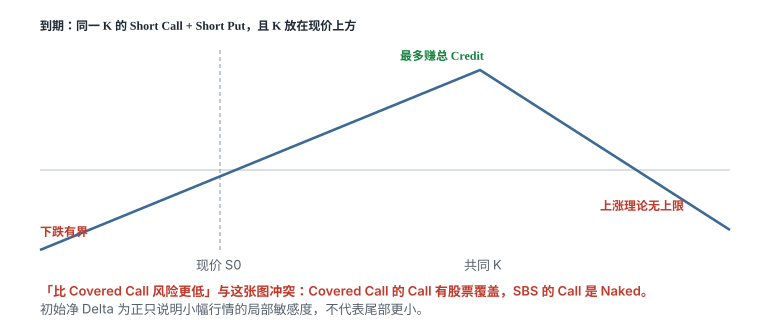

# 12.3 SBS

> 一句话：SBS 是把 Short Straddle 的共同 Strike 放到现价上方。它包含 Naked Short Call，上方亏损理论无上限。课程称它「风险最低」是错的。

## 12.3.1 结构与到期收益

本章的 SBS（Short Bullish Straddle）是课程自定义名称：把 Short Straddle 的共同 Strike 放在现价上方，使 ITM Short Put 的正 Delta 大于 OTM Short Call 的负 Delta，形成初始净看涨的 Short Straddle。

同一 Strike \(K\)、同一到期日：

- Short Put；
- Short Call；
- \(K\) 设在当前股价上方；
- 收到总 Credit \(c\)。

到期盈亏为：

\[
\text{P/L per share}=c-|S_T-K|
\]

- 最大利润：\(m\,c\)，仅在到期股价等于 \(K\) 时；
- 下方盈亏平衡：\(K-c\)；
- 上方盈亏平衡：\(K+c\)；
- 上涨亏损理论无上限；
- 下跌最大亏损为 \(m(K-c)\)，发生于股价归零。

\(m\) 以合约规格为准。

Strike 高于现价时，Short Put 更 ITM，净 Delta 可为正。「Bullish」只描述开仓局部 Delta。股价上涨穿过 Strike 后，净 Delta 会继续下降并可能变负。到期收益仍是倒 V，绝不是普通长期持股曲线。

课程把它解释成「Covered Call 中用 Short Put 替换 100 股」，目的是同时收两份权利金。两条腿都是 Short Option，净 Short Gamma、Short Vega、通常正 Theta。所谓「双倍 Edge」只是收两条腿权利金，不代表期望值翻倍。负 Gamma 和双侧尾部也同时增加。组合保证金是否等于单腿保证金完全取决于券商风险模型，课程表述不能通用。

课程最后称 SBS「比 Covered Call 风险更低、是所有策略中风险最低」。这个结论与到期 payoff 冲突，不能用于实盘风控。Covered Call 上涨风险被股票覆盖，SBS 的 Short Call 是 Naked。初始 Delta 较低只说明小幅行情下的局部敏感度，不代表尾部较低。收益风险比优于 CC / Sell Put 的说法没有本章独立回测或实盘证据。

## 12.3.2 开仓参数

课程建议：

- 选择熟悉、流动性高、波动相对可控的标的；
- 到期约 4–7 周；
- 初始组合 Delta 约 0.3–0.5；
- 高杠杆时使用更低目标 Delta。

更短期限 Theta 集中，同时 Gamma 更尖。更长期限 Gamma 较缓，但 Vega 和事件暴露更长。4–7 周只是课程折中，没有证明最优。期限不能解决 Naked Call 的无上限风险。

### 用两腿 Delta 计算净方向

例如现价约 150：

- Short 155 Put Delta 约 +0.615；
- Short 155 Call Delta 约 -0.394；
- 净 Delta 约 +0.221。

提高共同 Strike 会提高 Put Delta、降低 Call 绝对 Delta，使组合更看涨，但同时改变盈亏平衡和上方裸 Call 距离。

Delta 是当前局部值，不是整个期限固定敞口。组合 Delta 接近目标，不代表两侧最大亏损对称或可控。必须同时看净 Gamma、Vega、Theta 和压力损失。Call 与 Put 若改用不同 Strikes，就变成 Short Strangle；不同期限则是更复杂的 Calendar / Diagonal，不能继续套同一到期公式。

## 12.3.3 课程的动态 Roll 方法

课程先设目标 Delta，再设容许区间，例如：

- 目标 0.5：范围 0.25–0.75；
- 目标 0.3：范围 0.10–0.50。

正常情况下在剩余约 3–4 周时 Roll 到下一月，并让净 Delta 至少向目标移动 0.1。课程例子把 290/290 两腿 Roll 到下一月 300/300。一次要关闭两腿、开启两腿，至少四笔成交。应使用组合订单并检查净 Debit / Credit。Roll 只重置敞口，不删除旧 Straddle 的实现盈亏。

课程还允许只 Roll 一腿，让另一腿继续赚近月 Theta。一腿延期后已不再是同到期 Straddle。两个期限的 Vega、Gamma 和事件暴露不同。近月腿的 Theta 更快，但临近到期 Gamma 也更高。只看净 Delta 可能掩盖 Calendar Basis Risk。

股价大涨使净 Delta 接近或低于区间下界时，课程建议 Roll Up-and-Out；股价大跌使净 Delta 超过上界时，建议更大幅度地 Roll Down-and-Out。任何一种调整都无法保证在跳空前成交。

## 12.3.4 为什么这套结构风险很高

SBS 比动态 Covered Call 更频繁触发 Delta 边界，因为两条 Short Legs 都贡献负 Gamma。同为初始 0.5 Delta，SBS 可能只需较小股价移动就碰到 0.75。更频繁调整意味着更多滑点、手续费和决策错误。大涨后净 Delta 可变负，继续上涨时产生越来越大损失。止损或 Roll 都不能封住隔夜跳空。

课程总结称 SBS 的优点是更强卖方 Edge，缺点是「双倍负 Gamma」。双倍负 Gamma 不是一个可以用更高权利金自动补偿的小缺点。它改变的是路径：组合会更快离开目标区间，管理本身成为主要风险来源。

## 12.3.5 实盘上更合理的替代

若交易观点是「温和看涨 + 卖波动」，先考虑定义风险：

- Bull Put Spread：保留看涨 Short Volatility，但限定下跌；
- Broken-Wing Iron Butterfly / Condor：按不对称观点限定双侧；
- Covered Call：若已有股票，用股票覆盖 Short Call；
- Short Straddle / Strangle 加 Long Wings：把尾部封住。

无论如何，不应仅靠 Delta 阈值管理裸 Short Call。

## 12.3.6 SBS 风险检查

- [ ] 上方股价翻倍时会亏多少？
- [ ] 下方归零时会亏多少？
- [ ] 券商在 IV 翻倍时要求多少保证金？
- [ ] 财报和重大事件是否落在期限内？
- [ ] 四腿 Roll 的最差成交滑点是多少？
- [ ] 一腿提前指派后会留下什么股票头寸？
- [ ] 是否可以加 Long Wings 把最大亏损写死？

如果任何一项不能明确计算，就不应把它当「长期低风险策略」。

## 12.3.7 和 Covered Call、Short Put 并排看

同一现价 150、同一乘数 100：

| | Covered Call（持股 + 短 155 Call） | Cash-Secured 155 Put | SBS（155/155 双空） |
|---|---|---|---|
| 上涨到 200 | 收益封在 155，股票能交 | 最多留权利金 | Naked Call，亏损随 200 继续扩大 |
| 下跌到 0 | 接近持股亏到零，减 Call 权利金 | 亏约 \(155-p\) | 亏约 \(155-c_{\text{总}}\)，通常更大 |
| 初始 Delta | 约 \(1-\Delta_C\)，仍为正 | \(+\Delta_P\) | \(\Delta_P-\Delta_C\)，可为 +0.2～0.5 |
| 负 Gamma | 一腿 | 一腿 | 两腿 |

SBS 收两份权利金，是因为它承担两侧尾部。把「双倍权利金」写成「双倍优势」，漏掉了双倍负 Gamma。课程说保证金更省、风险更低，两条都不能当通用事实：保证金看券商模型；风险看 payoff。Covered Call 的 Call 有股票覆盖，SBS 没有。

## 12.3.8 一腿被指派之后图就裂了

155 Put 提前指派：账户付 15,500 得到 100 股，手里还留着一张 Short 155 Call。瞬时变成 Covered Call，而且股票成本就是 155。若你本来没有这笔钱，这不是「策略升级」，是资金事故。

155 Call 提前指派：账户变成 −100 股，手里还留着 Short Put。上涨继续扩大空头亏损，下跌则 Put 也开始亏。必须立刻当新仓处理：回补股票、平 Put，或整体离场。不要在缺腿的状态下继续套 SBS 的 Delta 区间。

## 12.3.9 课程参数全部标成待测假设

4–7 周、目标 Delta 0.3–0.5、区间 0.25–0.75、剩余 3–4 周换月、每次向目标挪 0.1、允许只滚一腿——没有一章独立回测证明这些数最优。它们只是让负 Gamma 结构看起来「有系统」。

只滚一腿之后，到期日拆开，Vega 和事件暴露不再对称。近月腿 Theta 更快，也更接近 Gamma 尖峰。净 Delta 仍可能碰巧等于 0.4，日历价差风险已经换了一种。不能继续叫 SBS，更不能继续用同一张到期公式 \(c-|S_T-K|\)。

若仍要交易「温和看涨 + 卖波动」，先用 Bull Put Spread 或带翼的不对称 Iron Butterfly，把最大亏损写成确定数字。SBS 的 Naked Call 没有这个数字。四腿 Roll 的滑点要按最差成交估，不能按四条 Mid 相加减。高杠杆时把目标 Delta 降到 0.3，只减小日常晃动，不减小收购公告次日的缺口。

把 SBS 画在纸上时，先标现价，再标共同 \(K\)，再标 \(K\pm c\)。现价在 \(K\) 左侧，只说明开仓时你站在倒 V 的左腰，净 Delta 为正。价格一穿过 \(K\)，你就站到右腰，Delta 变负，越涨越亏。这和持股曲线在任何一点都不一样。课程用「替换股票、收双份权利金」来命名，听起来像升级版 Covered Call；图上不是。

熟悉、高流动性、波动「可控」也不能删掉 Naked Call。并购、轧空、指数调入调出，都可以在你来不及按 Delta 区间 Roll 的夜里发生。止损单、Roll、盘中盯着组合 Delta，对跳空一律无效。仓位只能按跳空后仍活着来定。

