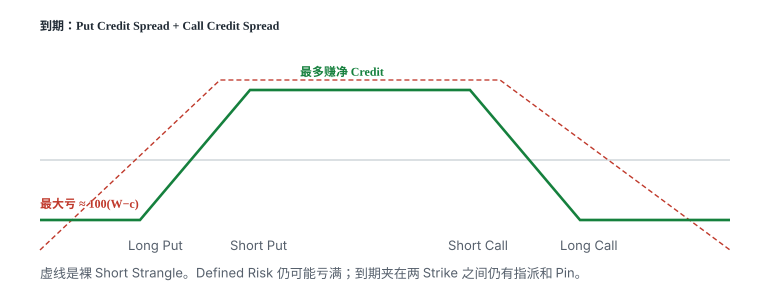

# 12.4 财报

> 一句话：高胜率不等于正期望，Expected Move 也绝不是最大损失边界。先分清是卖波动、赌方向，还是保护持股。

第 11 卷第 06 章已经写过 Straddle / Strangle 和 IV Crush。本章把同一套结构放到财报窗口里，并加上持股保护。财报交易同时包含跳空、IV Crush、流动性和执行风险。

## 12.4.1 卖财报波动率

财报前期权包含事件方差，公布后这部分不确定性消失，近月 IV 常快速下降。Short Straddle / Strangle 盈利的真实条件是：

\[
\text{实际跳空和之后波动} < \text{开仓权利金已经定价的波动}
\]

买方为凸性和有限亏损付费，卖方承担尾部。这可能形成风险溢价，不是每次财报都「错误定价」。卖方收益有限，上方 Naked Call 损失理论无上限。一次超预期跳空可能吃掉多次小利润。

### Expected Move

ATM Call + ATM Put 的总价格常被用作到期价格变动的近似尺度：

\[
\text{Expected Move heuristic}\approx
C_{\text{ATM}}+P_{\text{ATM}}
\]

但它不是严格的 68% 概率区间，也会受到利率、股息、Skew、期限和报价口径影响。

课程用一天约 20 家公司的样本得出「90% 实际波动低于预期」，样本太小，不能证明策略胜率或期望值。

高盛财报 Short Straddle 案例：财报前卖 380 Straddle 收约 1,110 美元，次日用约 800 美元回购，个案盈利来自跳空较小和 IV Crush。若股价跳空超过盈亏平衡，结果会反向。单次成功案例没有展示最坏跳空、保证金和跨夜无法止损的问题。

## 12.4.2 开仓、期限和退出

课程建议财报当天临近收盘开仓，以减少财报前其他行情暴露。这能缩短持有时间，但无法消除：

- 收盘前 Bid–Ask 扩大；
- 财报推迟或公布时间变化；
- 盘后跳空无法交易期权；
- 次日开盘熔断、停牌或报价失真。

历史 Earnings Move 可以帮助建立情景，但过去没有爆雷不代表下一次安全。股价高低也不是风险本身；应按组合在不同百分比跳空下的美元损失和账户比例判断。100 美元股票并不自动只亏几百美元。Naked Call 在收购、药物数据或极端业绩下可能跳空数倍。合约乘数是常见 100，五张合约会把风险放大五倍。最安全的做法是先用 Long Wings 写死最大损失。

### Straddle 还是 Strangle

Straddle 收更多 Credit，盈亏平衡较近。Strangle Strikes 更远，Credit 更少，仍有上方无上限风险。0.15 Delta 没有普遍「最优」证明。用 Expected Move 选 Strike 只是市场基准，不是保险。

课程建议 Straddle 次日开盘即平、短期 Strangle 可等到到期。更稳妥的规则是：事件溢价释放后重新评估剩余收益 / 尾部风险，并避免依赖自动到期。Roll 会把一次事件交易变成更长的 Short Volatility 风险。止损单无法保证跨夜跳空成交价。

## 12.4.3 把风险写成 Defined Risk

课程把「两倍 Expected Move 外的距离」当作最大亏损参考。这只能叫压力情景，不是最大亏损。实际跳空可超过 2 倍、3 倍甚至更多。

ATM Straddle 约 5 美元，只说明市场报价中的变动尺度。50–70 是一个假设区间，不是价格边界。55/65 Short Strangle 跳到 80、100 或更高时仍持续亏损。已有该股多头时，再卖 Put 会叠加下跌风险。

风险结构：

- 上方加 Long Call：把 Short Call 改成 Call Credit Spread；
- 下方加 Long Put：把 Short Put 改成 Put Credit Spread；
- 两侧都加 Wings：Iron Condor / Iron Butterfly。

「Jade Lizard」通常指 Short Put 加 Short Call Spread；要实现无上方亏损，净 Credit 需至少覆盖 Call Spread 宽度。不能只因加了一张 Call 就默认风险已完全处理。

Defined Risk 仍可能亏到最大值。四腿必须按组合净价成交。到期夹在 Strike 附近仍有指派和 Pin。

## 12.4.4 用 Vertical Spread 赌方向

若对财报方向有明确观点，课程建议：

- 看涨：Long ATM Call + Short Higher-Strike Call；
- 看跌：Long ATM Put + Short Lower-Strike Put；
- 使用覆盖财报的近期期限；
- 财报前临近收盘开仓。

Short OTM Leg 降低财报前昂贵权利金，同时封顶方向判断正确后的收益。Vertical Spread 的 Vega、Theta、Gamma 会部分抵消，不是完全消失。最大亏损是净 Debit，最大利润是宽度减 Debit。公式见第 11 卷第 05 章。

课程称到期越短越好、应尽量等到到期兑现。实际还要比较：

- 财报后已经达到最大利润的比例；
- 剩余几天的反转风险；
- 两腿 Bid–Ask；
- 标的落在两 Strikes 之间时的到期指派。

方向赌对仍可能因 IV Crush 让 Debit Spread 赚不满。开仓前写出需要移动到哪两个价格才盈利。

## 12.4.5 财报前保护已有股票

课程推荐财报前卖 ATM Covered Call。它最多用权利金缓冲下跌，并不能限定股票崩盘损失。

Airbnb 案例：收到 5.8 美元只提供 5.8 美元/股缓冲。股票跌 13% 时仍会有显著净亏损。ATM Call 从现价开始封顶全部上涨。这属于「弱保护 + 卖事件波动」，不是灾难保险。

如果真正目标是限定财报暴雷：

- Protective Put：明确底价，但财报前贵；
- Collar：卖 Call 补贴 Put，同时设上下边界；
- 减仓：没有 IV Crush，也没有指派复杂度；
- Put Spread Collar / 海鸥：降低成本，但只保护某一段，见下一章。

短期限把事件溢价集中，Gamma 也最集中。财报后大跌不代表「短期不会反弹」，不能据此机械等到期。股价上涨或横盘后尽快回购 Call，是恢复上涨敞口的一种选择。所有处理都应基于原先保护目标，而不是结果出来后改故事。预先禁止「投机失败改长期投资」。

## 12.4.6 财报前一页检查

- [ ] 是卖波动、赌方向，还是保护持股？
- [ ] 组合最大亏损能否写成确定数字？
- [ ] 上下跳空 10%、20%、50% 分别亏多少？
- [ ] 财报发布时间、到期日和除息日是否确认？
- [ ] 次日无法及时平仓能否承受？
- [ ] 是否使用组合限价和 Long Wings？
- [ ] 是否预先禁止「投机失败改长期投资」？
- [ ] ATM Straddle 定价了多大的 Expected Move？它是否被误当成价格边界？

## 12.4.7 三种目的不要共用一张退出单

卖波动、赌方向、保护持股，开仓理由不同，退出必须分开写。

**卖波动。** 目标是 Implied > Realized。事件溢价释放后，剩余权利金相对剩余跳空往往不再值得。次日开盘可以平，但不保证开盘价接近你的止盈。若跳空已经越过平衡点，这是一笔失败的短波动交易，不要改口「长期看好所以接货」。

**赌方向。** Vertical 的最大亏损是净 Debit。财报后若已接近宽度，剩下的是 Pin 和反转。若方向错了，Debit 可以全损，这是计划内的。不要加腿把 Debit 改成裸卖去「摊平」。

**保护持股。** 评价标准是组合回撤是否被限制在预先接受的区间，不是对冲腿本身赚不赚。ATM Covered Call 只缓冲权利金；真正要底价就用 Put 或 Collar。保护目标达到（事件结束、或股票已按计划减仓）就拆掉期权，不要因为「还剩一点 Theta」把保险留成下一笔投机。

## 12.4.8 Expected Move 的误用

ATM Straddle 收 5 美元，有人写成「上下各 5 美元是 68% 区间，两倍就是最大亏损」。错在三处：

1. 5 美元是价格，不是概率保证，更不是正态分布的 1σ。
2. 两倍 Expected Move 仍可能被超过。并购、药品数据、业绩爆雷没有理论上限。
3. 即使你按 2× 估压力，Naked Call 在 3×、4× 处继续亏。

正确用法：把 1×、2×、3× 跳空都算成美元和占账户比例，再决定张数和要不要 Wings。课程「一天 20 家公司、90% 低于预期」样本太小，不能当胜率。

## 12.4.9 收盘后到次日开盘之间你交易不了

美股财报常在盘后或盘前。这段时间期权可能没有可交易的流动报价，正股停牌或跳空时止损单无效。仓位必须按「从收盘到次日开盘完全不能动」来定。五张 Naked Straddle 在一只可能翻倍的生物科技上，不是「高胜率收租」，是账户级别的赌博。

## 12.4.10 已有股票时不要再叠同一方向的短 Put

课程 AMD 例子里，若已经持股，再卖 Put 是在下跌方向上加码。财报暴雷时股票亏、Put 也亏。Short Call 或 Covered Call 只缓冲权利金，挡不住 13% 这种跌幅。保护持股和卖事件波动是相反的优先顺序：要保护就付 Put 或减仓；要卖波动就不要在同一标的上保留大股票仓，除非组合图已经按「股票 + 短波动」重画，并且最大亏损按两者相加来写。

标的选择不能按股价高低：100 美元的股票跳 40% 和 400 美元跳 40%，按百分比是同类事件，按张数却差四倍名义。按账户承受的美元和百分比来选仓，不按「便宜股亏不了多少」来选。历史 Earnings Move 没有爆雷，下一次仍可以爆。

Implied Move 要用覆盖该财报的那一个到期日来算，不要拿一个月后的远月 Straddle 当当晚跳空的尺度。远月把事件方差摊在更多日子里，看起来更「便宜」，也更不像你要交易的那一个夜晚。公布时间以公司日历为准，推迟就按规则取消，不要改成「反正已开仓就拿到期」。

