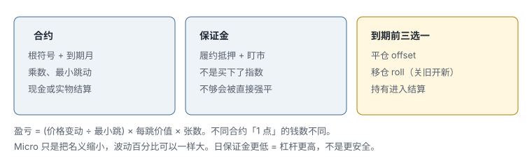

# 13.1 期货合约与参与者

> 一句话：期货是交易所写死规格的标准化远期合约。你只选方向、月份、价格和张数；保证金不是买下了标的。

本章只讲商品与金融期货。不收加密货币期货。合约规格、交易时段、保证金和符号写法都会变，正文里的数字是教学例子或课程录制期的历史值，下单前以交易所和期货商当前文件为准。

## 13.1.1 这一章解决什么

股票账户里点一下，你买的是股份。期货账户里点一下，你签的是一份**在未来按规则履约**的合约。两件事看起来都是「做多 / 做空」，机制完全不同：

- 你没有买下玉米、原油或标普指数；
- 你交的钱主要是履约抵押，不是货款；
- 合约有到期月，不能当无限期股票拿着；
- 盈亏按跳动点和乘数每天盯市，不是「卖出去才算」。

Warrior 的期货入门课用日常商品解释这件事：现货买卖双方如果自己找彼此，数量、品质、交割地点很难对上。交易所把这些写成统一合约，集中撮合，让价格可以比较，也让对冲者和投机者能在同一张纸上成交。

课程有一句好记的话：「交易期货，只决定价格方向，其他已经决定。」对初学者还要补一句：月份、移仓价差、保证金、结算方式、计价货币、涨跌停和税务处理，都会实质改写同一笔方向判断的结果。方向只是订单上的一个字段。

## 13.1.2 合约到底是什么

一份期货合约是买卖双方同意：在合约规定的未来时点，按合约规则买卖或结算某个标的（underlying）。交易所预先写死：

| 字段 | 它管什么 |
|---|---|
| 标的 | 玉米、原油、黄金、股指、利率…… |
| 合约单位 / 乘数 | 一张代表多少标的、一点值多少钱 |
| 品质与交割地 | 实物合约才有；金融合约常改成现金结算 |
| 到期月与最后交易日 | 哪一份独立合约 |
| 最小跳动（tick）与每跳价值 | 价格能走多细、走一跳赚亏多少 |
| 交易时段与日价格限制 | 什么时候能成交、单日能动多远 |
| 结算方式 | 实物交割还是现金结算 |

交易者主要选择：方向、月份、价格、张数。其余字段不是「高级选修」，是这份合约的身份。读不懂规格表，就不该下单。



图里三块必须分开：合约身份、保证金性质、到期前三选一。后两块下一章展开。这里先记住：你看到的报价是**某一份特定月份合约**的价格，不是「玉米」这个抽象概念的永久价格。

## 13.1.3 标准化解决了什么

没有标准合约时，两个农户、两个炼厂要自己谈数量、湿度、交割仓库、付款日期。谈成一单，下一单规格又变了，价格无法直接比，仓位也很难对冲。

标准化之后：

- 同一根符号、同一月份的合约可以互相抵消；
- 报价可以集中发现价格（price discovery）；
- 清算所对多方净额，降低双边对手方风险；
- 持仓可以用相反方向的等量交易平掉，不必找到原来的对手。

「降低对手方风险」不等于没有风险。市场风险、期货商（FCM）运营风险、保证金不足被强平、数据中断、自己点错月份，全部还在。监管处理的是市场诚信、客户资金隔离和机构行为，不是保证你盈利。

## 13.1.4 期货市场提供的功能

课程列了这些，每一条都对应一种真实用途，也对应一种误用：

| 功能 | 正当用法 | 常见误用 |
|---|---|---|
| 标准化 | 用同一规格对冲或投机 | 把不同月份当同一张合约 |
| 集中定价 | 看近月流动性最好的价格 | 把连续图当可结算价格 |
| 清算 | 不必信任某个匿名对手 | 以为「受监管就不会爆仓」 |
| 容易对冲 | 生产商锁售价、采购商锁进价 | 投机仓假装自己在套保 |
| 投机提供流动性 | 承担套保者不要的价格风险 | 把流动性当成自己有优势 |
| 表达方向 | 对股指、利率、能源、金属、农产品做多空 | 用股票热键的仓位直觉去打 |

农产品、能源、牲畜来自实体供需。股指期货的标的是金融指数，通常现金结算。利率、外汇、金属各有自己的库存、政策和交割规则。本章不按品种写交易策略，只要求你先能说出：这份合约的标的是什么、怎么结算、一张值多少钱。

## 13.1.5 交易期货不等于会收到实物

多数投机者从未见到一船原油或一仓玉米。原因不是「期货不会交割」，而是他们在到期或通知期之前把净仓平掉了。

持有进入通知期 / 最后交易日 / 交割流程，就可能触发结算或交割义务。现金结算合约不会送来一篮子股票，但会按规则把盈亏变成现金。实物合约可能要求你准备接收或交付符合规格的商品。期货商通常会在交易所最后期限之前设自己的强平截止日，比你在日历上圈的「到期日」更早。

所以：「大家都平仓」不是你没有义务的证明。义务写在合约和期货商客户协议里。

## 13.1.6 参与者地图

零售交易者的对手方，通常不是某个具体农户。清算体系对多方头寸净额，再要求会员缴保证金。你在屏幕上看到的成交，是这个结构的末端。

| 角色 | 做什么 | 对你意味着什么 |
|---|---|---|
| 交易所 / 清算所 | 上市合约、撮合、结算、风险管理 | 规格和保证金的源头 |
| FCM（期货佣金商） | 开户、收保证金、出对账单、接入交易 | 你的钱和强平权在这里 |
| IB（介绍经纪） | 介绍 / 服务客户 | 客户资金通常仍由 FCM 持有 |
| CFTC / NFA | 美国衍生品监管与自律 | 可查公司、负责人、处分记录 |
| 商业套保者 | 降低生产、库存或采购的价格风险 | 他们转移风险，不是来陪你玩游戏 |
| 机构 / 基金 | 配置、套保、相对价值或投机 | 提供大量流动性和持仓 |
| 自营交易者 | 用公司资本交易 | 风险由公司承担 |
| 个人交易者 | 为自己的账户承担盈亏 | 没有人替你补亏损 |

选择美国期货商时，用 [NFA BASIC](https://www.nfa.futures.org/BasicNet/basic-search-landing.aspx) 查公司、负责人和纪律历史。只看低佣金或课程推荐不够。NFA 的投资者问答也写明：监管不消除市场亏损。见 [NFA Investor FAQs](https://www.nfa.futures.org/faqs/investors.html)。

「受监管」三字容易被听成安全认证。它处理的是：客户资金怎么隔离、宣传能不能吹收益、公司有没有被处分。它不处理：你用 50 美元日保证金控制一万多美元名义敞口之后，指数走 2% 你账户会怎样。

## 13.1.7 符号怎么读

期货代码通常是：

```text
root + month code + year code
```

例如课程里出现过的玉米、原油，以及后面会写的股指微合约 MES、MNQ。同一根符号换一个月份，就是另一份合约：乘数可能相同，价格、流动性、剩余时间和基差都不同。

麻烦在于：期货商、行情商、连续合约图会用不同前缀、空格和写法。不能从一个平台复制 ticker 到另一个平台直接下单。下单前在本平台的合约搜索里核对：交易所、月份、年份、乘数。

### 月份字母

```text
F 1月    G 2月    H 3月    J 4月
K 5月    M 6月    N 7月    Q 8月
U 9月    V 10月   X 11月   Z 12月
```

`U9` 在 2019 年的截图里是 2019 年 9 月，不是一个可以永久复制的代码。年份一位或两位，取决于平台。记忆口诀不能替代订单确认。

课程说「通常交易近月」，这是流动性经验规则，不是纪律。移仓前后要比较实际成交量和未平仓量（open interest）。近月未必永远是你该交易的那一份——如果流动性已经转到下一月，你还在旧月上下单，点差和滑点会先惩罚你。

连续合约图 / 近月拼接图通常**不是**一份可结算的单一合约。它可能做过回调（back-adjust），K 线看起来连续，现金账户里并没有那根「拼接缺口」对应的盈亏。分析趋势可以用，下单必须切到具体月份。

## 13.1.8 每次下单读完的规格清单

不要只看根符号。清单如下，缺一项就停：

```text
标的是什么
哪家交易所
合约月份 / 年份
乘数（一张代表多少）
最小跳动、每跳价值、计价货币
结算方式：现金还是实物
最后交易日
第一通知日 / 交割风险
当前成交量与未平仓量
交易时段、每日维护停盘、假日
价格限制 / 熔断（若有）
期货商自己的强平截止
```

股指微合约、原油、农产品的清单长度一样。差别只在字段内容。农产品要多看交割等级和地点；股指要多看现金结算参照哪个官方开盘价；所有品种都要看自己的券商截止日。

## 13.1.9 盈亏怎么算

同一句「涨了 1 点」，在不同合约上不是同一笔钱。

```text
跳动次数 = 价格变动 ÷ 最小跳动
毛盈亏   = 跳动次数 × 每跳价值 × 张数
名义本金 = 期货价格 × 合约乘数 × 张数
```

教学例子（数字会过时，只练算法）：

- 某股指微合约乘数 5 美元、指数 3000：一张名义约 15,000 美元。
- 最小跳动若是 0.25 点、每跳 1.25 美元：走出 4 跳（1 点）= 每张 5 美元。
- 做 10 张，走出 10 点：`10 × 5 × 10 = 500` 美元（未计费用）。

把这个 500 和账户比，不要和名义 15 万比。名义告诉你杠杆有多大；账户告诉你还能不能活过下一次跳空。

风险表必须用交易所当前规格，不要用视频里的旧 tick、旧保证金、旧点位。课程录制时标普在 3000 附近，2026 年的点位、保证金和流动性都不是那张表。

「1 点」在迷你标普、微型标普、纳指、道指上的美元完全不同。日志和热键如果从股票账户抄过来，最常见的事故是：你以为在下一手「小单」，实际已经用张数叠出了股票账户里不敢开的名义。

## 13.1.10 和股票、期权的差别（只留期货侧）

后面几卷已经讲过股票保证金、PDT、期权权利金。这里只对照期货必须换掉的直觉：

| 股票 / 期权里的习惯 | 期货里为什么不行 |
|---|---|
| 保证金像借款买股票 | 期货保证金是履约抵押，仓位每天盯市 |
| 拿着不过夜就没到期问题 | 合约有到期月，隔夜也要面对移仓日历 |
| 做空先借股票 | 期货多空对称，没有 locate |
| 个股 LULD 停牌 | 期货是另一套价格限制 / 熔断，产品各不同 |
| 盘后几乎没流动性就收工 | 许多期货接近 24 小时，低流动性时段照样能成交、照样滑点 |
| 一张期权对应约 100 股 | 期货一张的美元由乘数决定，和 100 无关 |
| 美股日内和隔夜两套保证金 | 期货另有初始 / 维持 / 日保证金，且可被上调 |

税务处理在美国和其他司法辖区都可能与股票不同。课程里的旧税率表不要抄，第三章只交代核对路径。

## 13.1.11 先能讲清再碰模拟盘

在模拟盘上点 MES 之前，你应该能不看笔记回答：

1. 我现在点的是哪一个月、哪一年？
2. 这一跳值多少美元？
3. 我的止损按跳数算是多少钱？
4. 这是现金结算还是可能进入交割？
5. 今天有没有重大报告、维护停盘或期货商截止？

答不上第 1、2、3 题，仓位公式不存在。答不上第 4、5 题，你是在未知日历上赌博。

独立交易的标志不是不再看别人的品种，而是能完整解释自己的品种池、合约代码、风险、执行和停止条件。

## 先记住这些

- 期货是标准化远期合约，不是把标的买回家。
- 符号 = 根 + 月份字母 + 年份；平台写法不通用。
- 盈亏按跳数 × 每跳价值 × 张数，不同合约「1 点」的钱数不同。
- 连续图不是可下单的那份合约。
- 选期货商先查 NFA BASIC。

## 不要做的事

- 用股票热键的仓位直觉去打期货。
- 从一个行情软件复制代码到交易软件直接下单。
- 把「受监管」听成「不会亏完」。
- 交易加密货币期货（本书不收，也不要用本章的保证金直觉去套）。
- 假设自己永远不会碰到通知日或券商强平截止。
