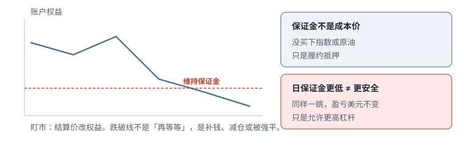
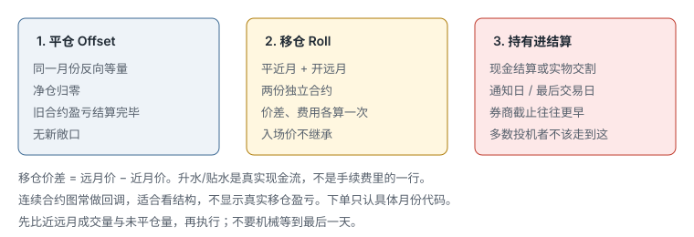

# 13.2 保证金、到期与移仓

> 一句话：期货保证金是履约抵押，不是货款；亏损当天改账户。到期前只能平仓、移仓或进入结算，没有「放着当股票」这一选项。

上一章把合约身份讲清。这一章处理两件会让账户突然消失的事：保证金怎么被吃掉，以及月份怎么换。

## 13.2.1 履约保证金不是股票融资

股票保证金常常被理解成：券商借钱给你买股票，你付利息，股份在账户里。期货保证金（margin）是 **performance bond**：一笔履约保证，证明你能承担盯市亏损。你没有买下指数或那桶油。

因此：

- 初始保证金（initial）是建立 / 持有仓位的基准；
- 维持保证金（maintenance）是之后必须维持的下限；
- 有些期货商再给更低的日内 / 日保证金（day / intraday margin）；
- 仓位按当前价或结算价重新估值，亏损直接改权益和可用保证金。

日保证金更低，不是风险更小，只是允许更高杠杆。课程录制期举过玉米初始约 770 美元、日保证金约 385 美元、常见比例 5%–15% 这类数字，那是当时的例子，不能用于今天。交易所和 FCM 随时可以因波动、事件、隔夜持仓或集中度上调要求。



股票 PDT、隔夜融资利率、期权卖方保证金是另一套规则。不要把卷一里的股票数字套到期货账户。

## 13.2.2 盯市：钱是当天走的

账户按当前价 / 结算价重新估值。浮动盈亏不是「卖了才算」，它已经是权益。当权益低于要求时，可能发生：

1. 你主动补钱；
2. 你减少一部分仓位；
3. 你全部平仓；
4. FCM 风控直接强平。

期货商不需要等到你的技术止损才保护自己。快速市场里，强平成交价可以比你画的线差一截。平台断线、手机 APP 卡、你去吃饭，都不暂停盯市。

「我设了止损所以最多亏这么多」在期货里仍然只是计划风险。尾部风险包括：跳空越过止损、涨跌停导致无法成交、强平滑点、保证金上调后被砍仓。

## 13.2.3 三个必须分开的数字

和股票那一章一样，名字换了，逻辑更硬：

```text
名义敞口 = 期货价格 × 乘数 × 张数
杠杆     = 名义敞口 / 账户权益
止损风险 = 止损跳数 × 每跳价值 × 张数
```

不能用「保证金只要 X 美元」当可承受仓位。教学用的历史例子：大约 50 美元日保证金控制约 15,000 美元名义。指数走 1%，名义变动 150 美元，已经是保证金的数倍；走 3%–4% 的事件日，小账户可以直接穿仓到超过本金。

真正决定张数的是止损风险和压力情景，不是保证金占用：

```text
张数 = floor( 单笔可承受亏损 / (止损跳数 × 每跳价值) )
```

算完再检查：

- 这几张的保证金占用是否留下缓冲；
- 相关品种是否会一起动（MES 和 MNQ、原油和汽油）；
- 挂着的所有订单如果一起成交，风险是否翻倍；
- 隔夜跳空是否大于技术止损。

课程把「账户保证金使用率 30%–50%」当成经验气压计。它不是安全保证。更有用的是同时算下面这张压力表：

```text
开仓至止损的风险合计
事件 / 跳空压力亏损
全部挂单成交
交易所 / 期货商上调保证金
该品种历史上较大的日内波幅
相关仓位同向一起动
```

只限制「用了多少百分比保证金」，会在低保证金产品上堆出不可思议的名义。

## 13.2.4 必须预留的缓冲

计划里至少留出：

- 止损本身；
- 滑点；
- 保证金上调；
- 隔夜跳空；
- 未成交订单全部成交；
- 行情 / 平台费；
- 出金、电汇到账延迟。

「满仓用满日保证金」等于把 FCM 的风控键交给市场。缓冲不是保守性格，是让一次正常波动不够资格结束你的账户。

隔夜持仓通常适用更高的隔夜保证金。盘中看起来「还有很多购买力」，收盘后同一张合约可能突然超限。日盘策略如果无意隔夜，收盘前必须检查净仓和挂单，不要靠「明天开盘再看」。

## 13.2.5 到期前只有三条路

CME 的现行教育材料把到期前的选择写成三条：平仓（offset）、移仓（roll）、进入结算 / 交割。具体日期随合约变。见 [Understanding Futures Expiration and Contract Roll](https://www.cmegroup.com/education/courses/introduction-to-futures/understanding-futures-expiration-contract-roll) 与 [Expiration and Settlement](https://www.cmegroup.com/education/courses/introduction-to-futures/get-to-know-futures-expiration-and-settlement)。



- **平仓 Offset**：对同一月份做相反、等量交易，净仓归零。旧合约盈亏结束。
- **移仓 Roll**：平掉近月，同时在远月开新仓。两份独立合约。
- **结算 / 交割**：持有到合约规则生效。

实物交割和现金结算是两套后果。不能从「多数人会平仓」推断自己没有义务。第一通知日、最后交易日、交割期的先后依产品不同。期货商的强平截止往往早于交易所最后日期。日历上要同时标三件事：交易所日期、券商截止日期、你自己更早的操作日。

股指微合约通常是季度现金结算，按相关指数官方开盘水平结算（3 / 6 / 9 / 12 月第三个星期五这类规则以当年日历为准）。「现金结算」只是说不会送来一篮子股票，不是说可以忘掉到期。

## 13.2.6 移仓不是改一下 ticker

课程用「做多 3 张」演示：卖出近月 3 张使净仓归零，再买入远月 3 张。两步都是真实成交。

```text
旧合约盈亏关闭
新合约按自己的市场价格开仓
移仓价差 = 新价格 − 旧价格
两腿都有费用和滑点
若看的是回调过的连续图，可能出现人造缺口
```

入场价不会自动继承。旧仓的浮动盈亏在平仓时落地；新仓从新的价格重新计。升水（远月贵）或贴水（远月便宜）是真实现金流，不是手续费明细里的一行。做多移仓到升水远月，等于你为续上同一方向付了一笔价差；做空则相反。是否「值得续」，要和你的 thesis、剩余时间和价差一起算，不是默认续。

执行方式：

- 日历价差单（calendar spread）：两腿尽量同时，减少单腿裸露；
- 分腿执行：先平后开或先开后平，中间有基差风险。

深度差的月份，显示的中间价未必能成交。从保守限价开始，不要追平台理论值。

## 13.2.7 何时移仓

不要机械等到最后一天。实际流程：

1. 查交易所日历和规格；
2. 查期货商截止；
3. 确认实物还是现金结算；
4. 比较两月价差、成交量、盘口深度；
5. 选择价差单或分腿；
6. 核对旧月净仓为 0、新月张数正确；
7. 更新图表、热键和日志里的合约代码。

流动性经验：成交量和未平仓量会从近月迁到下一月。你要交易的是正在承担价格发现的那一份，不是日历上还没到期、但已经没人看的那一份。移仓窗口前后点差变宽，是正常现象，不是「被针对」。

不要只依赖连续合约图。它可能做过回调，适合看长期结构，不显示真实移仓现金流，也可能把缺口抹平或制造假缺口。日志必须写具体月份代码，否则明年你无法解释这笔盈亏来自方向还是来自移仓价差。

## 13.2.8 一个完整的数字例子（教学用）

假设（全部是假数，只练步骤）：

- 近月 MES 报价 5000.00，远月 5010.00；
- 乘数 5 美元，每点 5 美元；
- 你多 4 张近月，均价 4980.00；
- 移仓：卖 4 张近月、买 4 张远月。

近月平仓盈亏：

```text
(5000 − 4980) × 5 × 4 = 400 美元（未计费）
```

远月开仓成本是 5010，不是 4980，也不是 5000。你为续上这 4 张多头，付出 10 点 × 5 × 4 = 200 美元的价差（相对近月市价）。若方向后来对了，这笔价差要从后续利润里扣；若立刻错了，你同时承受新仓亏损和已经付掉的价差、双腿费用。

这就是为什么「我只是换个月，仓位没变」是错觉。仓位的经济含义已经变了。

## 13.2.9 到期检查清单

持仓超过一天的期货账户，每周至少核一次：

```text
每份合约的最后交易日 / 通知日
券商强平截止
我计划在哪一天处理
近月与次月的成交量、未平仓量
结算方式
若误持有进入交割，账户有没有资格、有没有钱
图表是不是已经切到新月份
热键默认合约有没有过期
```

误把热键留在过期月份上，是可以单独写进事故手册的一类错误：看起来在交易「指数」，实际在交易一个点差很宽、快没人要的旧合约。

## 先记住这些

- 保证金是履约抵押；盯市当天改权益。
- 张数由止损美元反推，不由「只要几十美元保证金」决定。
- 到期三选一：平仓、移仓、结算。
- 移仓 = 关旧开新，价差和费用是真的。
- 连续图不能当订单凭证。

## 不要做的事

- 把日保证金当成最大亏损。
- 用满可用保证金。
- 拖到最后一天再处理到期。
- 以为改一下图表代码就算完成移仓。
- 用股票账户的隔夜融资直觉去理解期货保证金上调。
