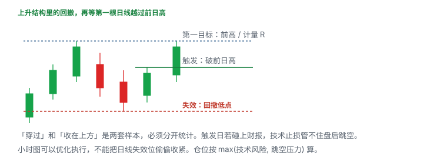

# 13.5 Swing 股票与四种日线结构

> 一句话：四种结构都从日线找多日机会。触发是价位，不是形态名字。穿过前日高和收在前日高上方，是两套样本。

本章对应 Warrior 股票 swing 的四个 setup。大盘、中盘是课程偏好，不是安全保证。财报和宏观一样会跳空。若用期权表达同一结构，到期、行权价和流动性必须同时选，下一章写载体；本章先把标的侧写死。

统一前提：

```text
趋势或区间的日线上下文先成立
触发价事先画在图上
失效价与触发同一周期
仓位按 max(技术风险, 跳空压力)
事件日历已经看过
```

## 13.5.1 Setup 1：回撤后第一根日线创新高



定义：

```text
趋势     = 上升的日线结构
回撤     = 若干根日线没有破坏主要支撑
触发     = 第一根交易日穿过或收在上一根的高点上方
止损     = 回撤低点，或事先写明的更紧结构
目标     = 前高 / 计量 R
```

这是上升趋势里的续涨，不是任意一根绿日 K。没有清楚回撤，就没有「第一根」。新高本身到处都是。

### 怎么进

- **盘中穿过**：价格越过昨日高，假突破更多，当天仍可能收阴。
- **收盘确认**：收在昨日高上方，隔夜才变成持仓，价格通常更差。

两种必须分开测试。日志记：触发日是否收在前日高上方，次日有没有 follow-through。

### 怎么看失败

失败不会总是平滑回撤。触发日可以是一根大阴，也可以是次日直接跳空跌破回撤低点。若触发日碰上财报，技术止损管不住盘后。小时图可以优化执行，不能把日线失效偷偷收紧——收紧后你做的是日内，却还按 swing 目标去拿。

上方最近前高与日线阻力决定第一目标，不应默认回到历史最高。空间不够 1R，仓位再小也是坏赔率，或者直接放弃。

选股侧课程提醒：swing 更偏中大盘，小盘要对 shelf、债务和稀释做额外尽调。「大盘股」四个字不是保险单。

教学算例（假数）：

```text
上升结构高点 56.40
回撤低点 49.80，昨日高 52.00
盘中穿过 52.00 入场
技术风险 2.20；第一目标 56.40 → 4.40 ≈ 2R
若盘中穿过时已经到 53.20，风险变成 3.40，目标只剩 3.20
→ 不是「还是同一笔」，是追。减股或不做。
```

收盘确认的样本要把入场改成收盘价。不要用盘中穿过的入场、收盘确认的胜率，拼出一个不存在的策略。

次日 follow-through 的记法：收盘是否继续远离触发线。触发日大阳、次日低开吞没，记失败，不要改口说「还在回撤里」。

## 13.5.2 Setup 2：日线 ABCD

课件把「牛旗没有立刻创新高、整理更长」的情况归为 ABCD。

```text
A → B   推动
B → C   多日回撤或整理
C 之后  重新上行
失效    C 的低点
```

入场可以用：第二次回撤后的第一根日线创新高、双底，或突破那个「失败牛旗」的高点。C 低点是结构失效，不是因为你预期有 D 就可以忽略的价位。

锚点必须在 D 出现**之前**标出。事后总能找出漂亮的三段。整理越长，若用期权，到期需要留的缓冲越多。

突破 K 线已经很大时，从入场到 C 的风险可能不合理。等回踩是独立入场，不要和突破穿越拼成同一个胜率。

D 不是固定目标。突破前高之后，要用新结构管理：分批、移止损、或改写成 Setup 1 的续涨。课程里的 TSLA、SPOT 是结果展示，存在选择偏差。必须同时保存：未突破的、跌破 C 的样本。

A–B 的高度可以当计量目标，但只是事先写在纸上的一个数字，不是市场欠你的。C 拖得越久，计量越不可靠：公司基本面、板块和利率可能已经换了一季。超过你时间止损仍未走出 C，按时间结束，不要把「ABCD 还没走完」写成无限期许可。

整理区内部的来回不是加仓理由。在 C 完成之前把仓位加满，等于提前做突破，失效却还放在更远的 C——这是追的日线版。

## 13.5.3 Setup 3：日线水平支撑 / 阻力

价格多次在相近水平受阻，同时低点抬高，看起来像平顶或上升三角形。可以交易区间拒绝，也可以交易突破。两者方向相反，触发不能混用。

```text
拒绝计划：
  入场 = 测试失败 / 跌破微观低点
  止损 = 阻力上方被接受

突破计划：
  入场 = 收盘或盘中越过区域 + 流动性
  止损 = 失败突破 / 回踩低点
```

支撑阻力更适合视为区域，但订单仍要有精确价。测试次数增加，既可能削弱挂单，也可能重复确认区域。不能机械规定「第三次一定破」。

先看区域外到下一目标的空间，再决定值不值得。空间被下一档更强的水平吃掉，突破赚的是滑点。

课程案例提到根据历史拒绝偏向「阻力仍有效」。这是需要重新验证的条件，不是定理。在阻力下方买看涨期权，必须写明：你在押突破，还是押回落。两者的失效完全相反。

财报前的压缩可以向任一方向跳空。IV 往往在事件前升高；买对方向也要超过已经定价的波动。普通止损同样管不住。

决策顺序写死，避免同一张图上午做拒绝、下午做突破：

```text
盘前只允许一种计划生效
拒绝计划生效时，突破不是「意外礼物」，是原计划失效
突破计划生效时，第一次回落到区内不是「便宜加仓」，是可能的失败突破
两种计划的触发价、失效价、仓位分开写在两张卡片上
```

区域画法：把几次触碰的影线端点和收盘端点都标出来，区域宽度就是「假突破预算」的一部分。区域比你的 1R 还宽，这笔的精确订单没有意义。

## 13.5.4 Setup 4：日线 200 EMA

这是突破后回测，不是第一次碰线就买。

典型多头路径：价格从下方站上 200 EMA，在均线附近整理，再恢复上行。空头 / 拒绝则是从上方跌破后回抽失败。

课件经验：向上突破后做空 / 拒绝的目标空间可能有限；跌到 200 EMA 的多头反弹可能拿得更久。不对称来自当时趋势和上下空间，不是均线本身的魔力。需要按实际图判断。

止损放在明确「突破并被接受」的另一侧，不要刚好贴线。「紧止损」减少每笔损失，也更容易在均线附近的正常震荡里被扫出。

200 EMA 是动态区域，不是硬墙。多根 K 线会在两侧来回。需要收盘、成交量或更高的低点来确认。均线走平，趋势意义比明显上斜 / 下斜时更弱。

四种事件分开统计：

| 事件 | 含义 |
|---|---|
| Reclaim | 从下方回到均线之上并守住 |
| Retest | 回到均线附近被撑住 / 压住 |
| Rejection | 触及后离开 |
| Breakdown | 接受在均线另一侧 |

不同平台的复权和 EMA 参数会画出不同的线。固定数据源。200 EMA 广受观察，但挡不住新闻跳空。

回踩买入和「均线支撑抄底」要拆开。前者：已经站上，回踩均线附近出现守住的证据，再进，失效在均线另一侧被接受。后者：还在均线下方，第一次碰到就买，赌的是均线有魔力。课程画的是前者。后者单独统计，通常只是均线附近的噪声。

均线附近正常震荡的幅度，要用这段回踩自己的高低点量，不要用「贴着均线 0.5%」这种与结构无关的紧止损。扫出后再站上，是新的 reclaim 样本，不是「把止损放宽接回旧仓」。

## 13.5.5 四张表并在一起

| Setup | 触发 | 失效 | 时间风险 |
|---|---|---|---|
| 第一根日线新高 | 破前日高 | 回撤低点 | 触发后没有 follow-through |
| 日线 ABCD | C 后恢复并破结构 | C 低点 | 整理继续延长 |
| 支撑阻力突破 | 区域外被接受 | 跌回区域内 | 多次假突破 |
| 200 EMA 收回 | 回到均线上并守住 | 接受在均线下 | 线附近来回扫止损 |

拒绝交易是第四列之外的另一列策略，不要和突破样本混在一个胜率里。

## 13.5.6 股票还是期权

选择股票更合适：

- 想要近似线性的 delta；
- 持有期不确定；
- 期权买卖价差很宽；
- 不想承担到期和 IV；
- 需要分红权利，并且理解除息与借券。

选择有限风险期权结构可能更合适：

- 事件和时间窗明确；
- 股票名义太大；
- 愿意支付权利金或放弃部分上行；
- 期权链流动性足够；
- 已经算过 Greeks 和到期处理。

不能因为账户买不起 100 股，就买最便宜的虚值期权。那不是「小仓位的同一笔 swing」，那是高归零概率的彩票。

## 13.5.7 复盘标准

每个 setup 同时保存：

- 入场前最后一个完整日线截图；
- 当时的大盘 / 板块；
- 入场方式：盘中穿过还是收盘确认；
- 是否跨越财报；
- 股票或期权结构及原因；
- 到第一目标的计划 R；
- 5 / 10 / 20 个交易日后的结果；
- 时间止损是否优于价格止损；
- 失败后是否立刻变成反向 setup。

目标是把漂亮图形压成在未知未来里也能执行的规则。样本不够大之前，不要因为两三张成功截图就加大隔夜仓位。

把四种 setup 混成一个「我做日线」的胜率，会让你看不到：你真正赚的是哪一种，真正亏的是哪一种。先分列，再决定保留哪个。

## 先记住这些

- 日线上下文 + 事先画线 + 同一周期失效。
- 穿过和收盘确认分开统计。
- ABCD 的锚点必须事前标。
- 突破和拒绝是相反的两笔交易。
- 200 EMA 是区域，先回测再进。

## 不要做的事

- 把任意绿日 K 叫「第一根新高」。
- 因为预期有 D 就忽略 C 被跌破。
- 在阻力下既押突破又押回落，却只用一个止损。
- 第一次碰到 200 EMA 就当反转。
- 用知名股票的成功图代替自己的失败样本。
