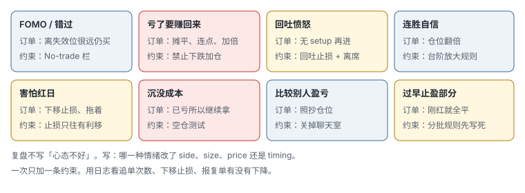
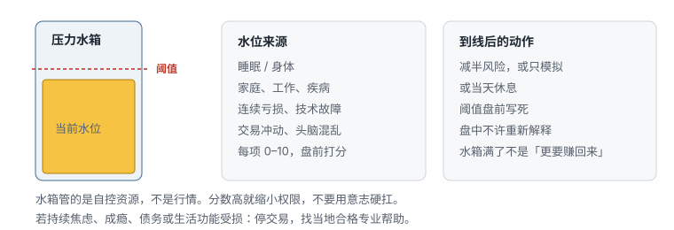
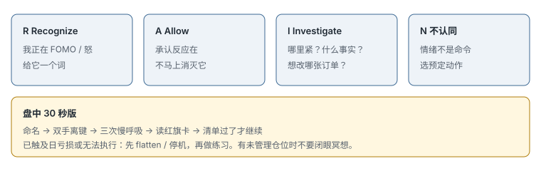

# 14.2 FOMO、亏损反应与练习

> 一句话：先把情绪翻译成订单行为，再按清单做一条练习。练习改的是追单、摊平、下移止损和报复，不是当天心情。

一百六十小时录音里大量重复的是同一件事：高唤醒状态下，人会改订单。本章把可执行练习收齐。一次只练一个动作。用日志看次数有没有下降。心理练习不能替代仓位上限、最大亏损、订单检查和平台风控。已触及日亏损或失去执行能力时，先停机，再做任何呼吸或命名。

若练习本身让你更焦虑或不适，停掉，换更合适的支持。持续功能受损：停交易，找当地合格专业帮助。

## 14.2.1 FOMO 的操作定义


FOMO 不是「我很想做」。它在订单上的定义是：**失效位还在原地，入场已经离它很远，每股 / 每跳风险变大，却仍按原股数下单，或根本算不清。** 追的不是离底部远，是离失效远。

修复不是「再给一次机会」，是 No-trade 栏：离失效位太远就不做。同一 1R 美元只能买更少；少到这笔没有意义，就放弃。错过记在「错过」表，不进真实盈亏，也不用下一笔无关标的补偿。

开盘前 15 分钟只许做预先写好的一笔（或不做），是把 FOMO 最肥的窗口直接关小。不是因为那 15 分钟没有行情，是因为那 15 分钟最容易把扫描器最新代码当成触发。

## 14.2.2 情绪必须映射到订单

目标不是像机器人一样没有情绪，而是：情绪没有权限直接改仓位。



常见触发与对应订单：

| 命名（给一个词就够） | 身体 / 想法 | 典型订单 | 预定动作 |
|---|---|---|---|
| FOMO / 错过 | 胸口紧，扫扫描器 | 离失效很远仍进 | 不做；记错过表 |
| 止损后立刻重进 | 「刚才那一下是假的」 | 无新结构再进 | 等待新触发 |
| 回吐愤怒 | 从 +300 回到 +80，「必须回到 +300」 | 无 setup 再打 | 离席 + 日盈亏锁定 |
| 连胜自信 | 「我看懂了」 | 仓位翻倍 | 台阶规则，否则不加 |
| 比较别人 | 聊天室数字 | 照抄方向和规模 | 关聊天，只用自己清单 |
| 害怕红日 | 不愿看账户 | 下移止损、拖着 | 止损只往有利移；否则 flatten |
| 赚回来 | 「必须翻本」 | 连点、加倍、换更野的标的 | 硬停止 |
| 沉没成本 | 「已经亏这么多」 | 继续拿或加仓 | 空仓测试 |
| 过早止盈 | 刚红就怕吐回去 | 计划外全平 | 按事先分批，否则记违约 |

复盘禁止只写「心态不好」。必须写：它改了 side、size、price 还是 timing。Fear 导致不敢做下一笔合规信号，也要记——冻结和乱点是同一张红旗卡的两面。

## 14.2.3 情绪劫持的三阶段

录音把情绪交易拆成大致三档（用词略有出入，结构一致）：

1. **高度聚焦**：有一点兴奋、低水平担心，还能算账；
2. **情绪卷入**：焦虑上升，呼吸变浅，开始找支持持仓的信息；
3. **劫持**：强烈情绪和「必须」接管，不再计算仓位，取消日限额。

可观察前兆（写成红旗，一出现就触发预设动作）：

- 呼吸变浅，肩颈、胃紧；
- 快速重复点击；
- 只找支持持仓的信息；
- 内心出现「必须赚回来」；
- 不再计算仓位；
- 隐藏或不愿看亏损；
- 改止损、取消日最大亏损。

在第 2 档就要减权限（减半、暂停）。等到第 3 档再决定「要不要休息」，通常已经下完单。神经叙事（杏仁核、战或逃）在课里被大幅简化，不能用来医学诊断。有用的只是这些可见信号。

## 14.2.4 偏差改写成测试题

### 4.1 确认偏误

持仓后只看支持方向的新闻和成交。入场前写出会证明自己错的证据。持仓期间每天只核对那几条，不新开「找理由」窗口。

### 4.2 近因偏误

最近三笔全赢就认为 setup 永远有效；全亏就认为策略死了。对策：看完整滚动样本，按 `strategy_version` 切片。

### 4.3 损失厌恶

不愿实现亏损，让小亏变大。也表现为拒绝去做期望值为正、但会经常止损的计划。对策：把止损定义为策略成本，不以「平仓才算真的亏」当借口。模拟转实盘时损失厌恶会放大，仓位先降下来，不要在这一档证明勇气。

课里提到「重新框架 / 锚定」：把单笔亏损锚定在事先写好的 1R，而不是锚定在今天账单或昨天的盈利。公平赌注仍可能被拒绝——这是偏差，不是新信息。

### 4.4 结果偏见

违规赚钱就认为决定正确；合规止损就认为决定错误。过程分与 P&L 分开，见上一章。

### 4.5 沉没成本测试

因为已经亏了很多而继续持有或加仓。每一刻重新问：

```text
假如现在是空仓，我还会按这个价格、这个风险新开一笔吗？
```

不会，就按失效处理。这比「再给一次机会」清楚。已经付出的权利金、已经付的移仓价差、已经亏掉的点数，都不是继续的理由。

## 14.2.5 压力水箱



当天可用自控资源是有限的。睡眠不足、家庭冲突、疾病、工作压力、连续亏损、技术故障都会抬高水位。开盘前 0–10 打分：

| 项目 | 0 | 10 |
|---|---:|---:|
| 睡眠 / 身体 | 很好 | 极差 |
| 外部压力 | 无 | 极高 |
| 交易冲动 | 无 | 强烈 |
| 清晰度 | 清晰 | 混乱 |

预先规定总分到线后的动作：减半风险、只模拟、或休息。阈值必须事前设，不能盘中为了继续交易临时解释。水箱满了不是「更要赚回来」。

生活压力和交易压力要分开记。关系冲突、睡眠债务占满水箱时，按「非交易日」处理，不要指望开盘后靠意志切换。期货近 24 小时尤其容易在水箱已满时「再看一眼」然后下单。

## 14.2.6 RAIN：暂停流程



Tara Brach 版本在课里多次出现。四步：

| 字母 | 做什么 | 交易里落到哪 |
|---|---|---|
| **R Recognize** | 识别正在发生什么 | 「我正在 FOMO / 怒 / 怕红」 |
| **A Allow** | 让体验暂时如其所是 | 承认反应在，不立刻用下一单消灭它 |
| **I Investigate** | 带兴趣和关心观察 | 哪里紧？什么事实？想改哪张订单？ |
| **N Nurture / 不认同** | 自我同情，不与情绪合一 | 情绪不是命令；选预定动作 |

N 在不同录音里叫 Nurture 或 Non-identification，操作上是同一件事：你不是这个冲动，你选择已经写好的动作。

盘中 30 秒压缩版：

```text
命名 → 双手离开键盘 → 三次慢呼吸 → 读红旗卡 → 清单过了才继续
```

立刻要行动时的更短版（课里 Ted 用过）：**数到五，再做三次呼吸**，然后才允许手指回键。

RAIN 不是消除市场风险，也不是强行压住情绪。已达到最大亏损或无法执行：先 flatten / 停机，再练习和复盘。有未管理仓位或未完成订单时，不要闭眼做长冥想。先平风险、撤单，再离开屏幕。

## 14.2.7 情绪停止协议

预先打印或钉在屏幕边：

```text
红旗：
- 连续快速点击
- 「赚回来」想法
- 取消有效止损
- 与别人盈亏比较
- 第二次规则违约
- 心率明显升高仍想下单

立即动作：
1. flatten，撤销全部
2. 禁用热键
3. 离开座位 15 分钟
4. 写下：触发 / 身体 / 想法 / 实际订单
5. 触及日限额或第二次违约：当天不再实盘
```

交通灯可以叠在上面：

- **绿**：清晰、按计划；
- **橙**：一次冲动或两次执行错误 → 减半并暂停；
- **红**：日限额、报复念头、取消止损 → 立刻结束。

协议的价值在自动化。等到高唤醒再决定是否休息，通常太晚。

## 14.2.8 回吐止损怎么执行

两种，不要混：

**账户级（日给回）。** 从当日权益峰值起算。例如峰值 +800，规则是回吐 300 或回吐峰值的 40%（取事先写死的那一个），碰到就停。防止「已经赚钱所以可以随便做」。

**交易级（单笔给回）。** 浮盈从峰值回撤超过计划部分（固定 R 或百分比）就减或平。防止把赢家重新做成输家。

两者都要事前写数字。盘中看见回撤再谈判，属于红旗。盈利回吐后的愤怒，是 FOMO 的近亲：补偿的是自我感觉，不是市场结构。动作是离席 + 锁定日盈亏，不是打开扫描器。

## 14.2.9 命名「部分」，但必须接到订单

课里用类似内部家庭系统（IFS）的语言：管理者（事先限制你进场）、消防员（错过之后逼你立刻行动）、被放逐的感受、以及「自我领导」。也给过角色外号：想打全垒打的部分、害怕亏损过早止盈的部分、害怕红日拒绝平仓的部分。

这是自我观察框架，不是说人格真的裂开，也不能当行情信号。有用的写法：

```text
触发：盈利从 +300 回到 +80
想法：必须回到 +300 才能停
身体：胸口紧、手握鼠标
冲动：跳进扫描器最新标的
实际：无 setup 买入
保护目的：避免「失去盈利」的挫败
下次动作：离席 10 分钟，日盈亏锁定
```

与某个「部分」对话的练习（只在**已平仓**、不交易的时间做）：

1. 注意当前身体感受，选一个最响的部分；
2. 问：你现在感觉什么？你怕发生什么？你需要我做什么？
3. 承认它的保护意图；
4. 问它是否接受已经写好的风控动作（而不是接受「再做一笔」）；
5. 写下下次具体订单规则。

内心批评常见类型（完美主义、监工、模具、愧疚传递）往往有「想帮你」的意图，表达方式有害。建设性批评指向**下一笔清单哪一栏」；破坏性批评指向「我这个人不行」。后者出现时，做过程分，不做自我判决。

系统一（快、自动、情绪）和系统二（慢、费力、可计算）用来提醒：高压下你跑的是系统一。对策不是在劫持时讲道理，是事先把系统二的结论写成热键和限额。把系统二练成系统一，靠的是重复合规，不是靠盘中说教。

自我怀疑表现为该做不做、不该做乱做；过度自信表现为加仓和取消限制。两者都用同一张清单衡量，不靠「找回自信」。

## 14.2.10 彻底接受 ≠ 放任亏损

接受是承认当前事实：

- 价格已经跌破失效；
- 今天已经亏损；
- 机会已经错过；
- 当前市场不适合策略。

它不是：接受持仓无限亏、不采取风险动作、用「善待自己」为违规辩护、相信一切都会回来。最有效的接受后面紧跟动作：平仓、停止、降低规模。可以对自己温和，同时对规则严格。

课里用堵车比喻：愤怒不改变红灯。交易里愤怒不改变已经成交的亏损。从次要反应练起（错过一只票、轻微滑点），再练直接面对大亏损。Radical acceptance 录音很多，操作收敛成这一段就够。

Carl Rogers 那句「接受自己才开始改变」在课里反复出现。落到账户上：先承认这笔已经结束，再改下一笔规则。不承认结束，就会用下一笔去编辑历史。

## 14.2.11 资源状态、正念与呼吸：边界写死

**资源状态**：回忆一个你曾经清楚、有耐心、或被支持的具体情景（课里有人用海滩、运动、某次冷静执行），让身体记得那种状态，再去读当天限额。它是开盘前的校准，不是入场信号。市场变了，资源状态不会给你方向。

**两分钟安全版正念**（确认没有持仓、没有未完成订单）：

1. 双脚着地；
2. 观察三次自然呼吸；
3. 扫描下颌、肩、胸、胃；
4. 给当前状态一个词；
5. 阅读当天风险上限；
6. 决定：实盘、减仓、模拟、或休息。

练习时念头出现，轻轻标成「thinking」，回到呼吸。训练的是：发现注意力已经被带走，然后重新选择。不要求头脑空白，不预测市场，不强迫放松。云层、夜空是隐喻，不是技术指标。讲者说冥想和某段连胜相关，那是个人观察，不是因果。

**呼吸练习**几种课里用过的，全部服从同一边界：

- 放慢呼气，让肩沉下来；
- 注意空气进出鼻腔、胸腹起伏；
- 有人教左右鼻孔交替或「海洋声」呼吸——当作可选的生理减速，不是秘密武器；姿势不对或不适就停；
- 不要在无人管理的仓位上做复杂呼吸法。

感恩呼吸、慈心、初学者心态、对不确定性的容忍、把恐惧当成保护者而不是敌人——Mindful Monday 大量重复这些态度。交易上只保留一句：恐惧可以存在，它没有下单权。Bodhicitta / 自我关怀用来降低羞辱螺旋，不用来给违规开脱。

初学者心态：今天的图是今天的样本，不因为「我见过这个形态」就减免清单。流状态（觉得又快又对）出现时，更要核对仓位有没有悄悄变大。

## 14.2.12 样本纪律：1 股 × 20 天

课里提过一个挑战：连续 20 个交易日，每次只做 1 股（或最小单位），目标是把流程走完，而不是赚钱。验收：

- 六栏是否写全；
- 止损有没有下移；
- 有没有计划外重进；
- 模拟是否按实盘规则对待（同一时间、同一清单、同一停机）。

1 股不是策略，是把「证明自己」从样本里拿掉。做完再考虑是否上到最小可统计仓位。期权和期货用最小张数做同一件事。

模拟必须当真实对待：同一时段、同一笔数上限、同一日亏损（用模拟账户的虚拟限额）。否则模拟只训练点击，不训练停止。

## 14.2.13 从模拟到实盘的心理差

实盘会增加压力，使人退回旧习惯。课里反复出现的操作，收成清单：

- 同一平台；
- 先降仓；
- 限制每日笔数；
- 第一周只评过程；
- 盘前情绪检查 + 身体放松；
- 写下计划再开软件；
- 过滤外部噪音，独立决策；
- 接受错误并记录，不否认。

「设置合适的阻力并拿住赢家」在录音里出现过，不要听成「扛单」。它只在你事先写了分批和失效时成立。否则就是沉没成本。

有人通过**下调**日最大亏损来降低焦虑，从而少做冲动单。这是合法方向。上调日亏损「给自己空间」通常是劫持。

## 14.2.14 练习目录（按需选一条）

下面每条都是完整练习。选一条用两周，用日志里的次数验收。不要一天做完全表。

| 编号 | 名称 | 何时 | 步骤 | 记什么 | 不是什么 |
|---|---|---|---|---|---|
| 1 | 情绪命名 → 订单 | 任何冲动 | 给一个词；写出它想改的 side/size/price/timing | 词 + 是否下单 | 心情日记 |
| 2 | 身体扫描 | 盘前或暂停后 | 下颌肩胸胃，标紧张点 | 最紧的部位 | 治疗诊断 |
| 3 | 标 thinking | 坐着练习 | 念头来了就标记，回呼吸 | 能否回来 | 入场信号 |
| 4 | 红旗卡 | 盘中 | 对照第 7 节，中了就执行协议 | 中了哪一条 | 事后解释 |
| 5 | 交通灯 | 每笔后 | 绿继续 / 橙减半 / 红停 | 颜色 | 感觉良好就绿灯 |
| 6 | 触发链 | 复盘 | 刺激 → 身体 → 想法 → 冲动 → 订单 | 哪一环能打断 | 性格鉴定 |
| 7 | 部分命名 | 平仓后 | 给「全垒打 / 怕亏 / 拒平」起名 | 映射到订单 | 多重人格理论考试 |
| 8 | 与部分对话 | 非交易时间 | 第 9 节五问 | 它接受哪条风控 | 盘中开会 |
| 9 | 批评分类 | 羞辱出现时 | 建设性 → 清单；破坏性 → 过程分 | 类型 | 追溯童年当借口 |
| 10 | 压力水箱 | 每个开盘前 | 四项 0–10，到线减权 | 分数 + 决定 | 盘中重打分骗人 |
| 11 | 两分钟坐 | 空仓 | 第 11 节七步 | live/减/sim/休息 | 有单时闭眼 |
| 12 | 资源状态 | 开盘前 | 回忆一个冷静执行的具体情景，再读限额 | 是否先读限额 | 看多看空 |
| 13 | 过程目标卡 | 开盘前 | 今天只评清单，不评收入 | 过程分 | 隐藏盈亏不管风险 |
| 14 | 环境控制 | 开盘前 | 手机、电视、旁人、通知 | 违规次数 | 装饰性香薰 |
| 15 | 前 15 分钟 | 开盘 | 只做预写的一笔或不做 | 是否破例 | 万能时段圣杯 |
| 16 | 个人时间过滤 | 若有统计 | 例如某人不做开盘前几分钟 | 样本外是否仍有效 | 9:33 神话 |
| 17 | RAIN 全流程 | 暂停后 | R-A-I-N | 最后选了哪个预定动作 | 消除恐惧 |
| 18 | 30 秒 RAIN | 手还在键上 | 命名离键三呼吸读卡 | 有没有继续乱点 | 替代 flatten |
| 19 | 数到五 | 立刻想点 | 5 + 三呼吸 | 是否仍下单 | 错过就怪练习 |
| 20 | 双手离键 | 红旗 | 物理离开 | 秒数 | 还盯着扫描器 |
| 21 | 离席 10–15 分 | 回吐或连点后 | 离开座位 | 回来后是否还开新仓 | 厕所里用手机下单 |
| 22 | 禁用热键 | 劫持 | 关掉热键或锁平台 | 是否还能点 | 只是心里说慢一点 |
| 23 | Flatten 协议 | 红灯 | 第 7 节五步 | 是否当天停 | 「先平一部分看看」 |
| 24 | 放慢呼气 | 身体紧 | 呼气长于吸气，肩沉 | 能否算账 | 复杂瑜伽考核 |
| 25 | 空仓测试 | 套住或大亏 | 「现在空仓还会开吗」 | 是/否 + 动作 | 找理由说会 |
| 26 | 反证条 | 入场前 | 写出什么事实证明我错 | 持仓时是否只核这条 | 入场后新找利多 |
| 27 | 滚动样本 | 想改策略时 | 打开完整切片，不看最近三笔 | 是否仍改版 | 近因决策 |
| 28 | 过程分 | 每天 | 六项行为分，P&L 另列 | 违约是否进策略 | 赚了就满分 |
| 29 | 止损是成本 | 不想点平 | 念一遍：这是 1R 学费 | 是否仍拖 | 扩大止损「降低成本」 |
| 30 | 接受然后动作 | 事实已发生 | 承认错过/亏了 → 平或停 | 动作 | 接受=继续扛 |
| 31 | 日亏损硬停止 | 触及 −X | flatten + 锁 | 有无例外 | 下一笔是「稳的」 |
| 32 | 软暂停 −2R | 连亏或 −2R | 离席复核 | 三笔是否合规 | 自动加仓翻本 |
| 33 | 账户回吐止损 | 日峰值回撤 | 第 8 节 | 峰值与收盘 | 已经赚过所以随便 |
| 34 | 单笔回吐 | 浮盈回撤 | 减或平 | 是否按计划 | 看到吐了再议价 |
| 35 | 三笔计划止损 | 三连亏 | 暂停 15 分再裁决 | 有无违约 | 胜率 40% 就自废武功 |
| 36 | 禁止下跌加 | 任何亏损仓 | 不允许加 | 有无加过 | 「均价下来更好」 |
| 37 | 止损只顺移 | 持仓中 | 只能朝有利 | 有无放宽 | 换周期缓刑 |
| 38 | 每日笔数帽 | 全天 | 到数停 | 实际笔数 | 拆单规避 |
| 39 | 1 股 20 天 | 纪律崩溃后 | 最小单位走完流程 | 六栏与违约 | 用 1 股证明策略期望 |
| 40 | 橙灯减半 | 交通灯橙 | size × 0.5 | 是否真减 | 减一半但又做两笔 |
| 41 | 停牌 / 宽点差不做 | 开新仓前 | 超阈值放弃 | 放弃次数 | 「马上会恢复」 |
| 42 | 禁止改标签隔夜 | 收盘前 | 无 swing thesis 必须平 | 有无偷偷留 | 亏了所以变投资 |
| 43 | 模拟当实盘 | 每次 sim | 同时段同规则同停机 | 是否在 sim 里也停 | 模拟随便点 |
| 44 | 转实盘降档 | 第一次真钱 | 第 13 节 | 仓位是否真降 | 用真钱找回模拟感觉 |
| 45 | 放大台阶 | 想加仓时 | 上一章门控 | 是否自动退档 | 连胜加三倍 |
| 46 | 改版流程 | 想改规则 | 盘后版本化 | version 号 | 盘中发明例外 |
| 47 | 错过表 | 每根合规没做的信号 | 单独记，不进 P&L | 是否用下一笔补偿 | 后悔交易 |
| 48 | 外部复核 | 每周 | 别人只看违约和日停 | 日停后是否还做 | 让别人给方向 |
| 49 | 一条教训 | 每天收盘 | 只改一个动作 | 次日是否执行 | 写长篇自我批评 |
| 50 | 比较隔离 | 想看别人盈亏 | 关聊天室 / 排行 | 是否仍改 size | 「只是学习」 |
| 51 | 事件前减权 | 水箱 + 日历 | 报告 / 财报前降仓或平 | 是否带着满仓赌 | 普通止损扛事件 |
| 52 | 相关仓合并 | 多品种同向 | 名义和止损相加 | 是否当一笔 | 「每张都很小」 |

验收只看行为次数：追单、超额仓位、移动止损、报复单、日停后是否还开。不看「今天比较平静」。

## 14.2.15 周复盘四个问题

1. 哪一种情绪最常改订单？对应表 2 的哪一行？
2. 本周选中的那一条练习，次数指标降了没有？
3. 日限额、回吐、三连亏暂停有没有被谈判掉？
4. 下周一只保留一条练习，是哪一条？

FOMO Friday 的录音很长，内容高度重复。读完本章和上一章，不需要再把 2019–2021 的场次当操作手册。若去听，只用「本场重点」判断自己卡在表 14 的哪一行，然后回来做那一行。

## 先记住这些

- FOMO = 离失效位太远还做。
- 情绪命名必须接到订单字段。
- 空仓测试处理沉没成本；回吐止损处理「已经赚过」。
- RAIN 和呼吸没有下单权；日限额才有。
- 一次一条练习，用次数验收。

## 不要做的事

- 在劫持状态写新规则。
- 用冥想代替 flatten。
- 有未管理仓位时做长练习。
- 把 160 小时录音当成必须听完才能交易。
- 用自我同情给第二次违约开脱。
