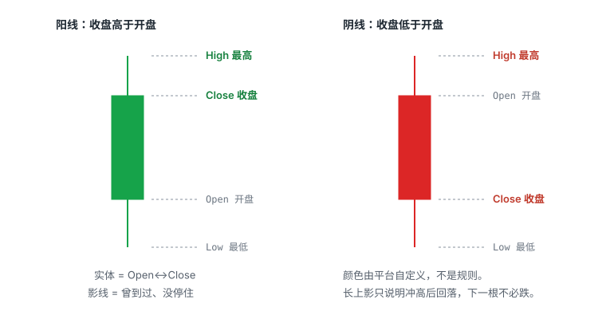
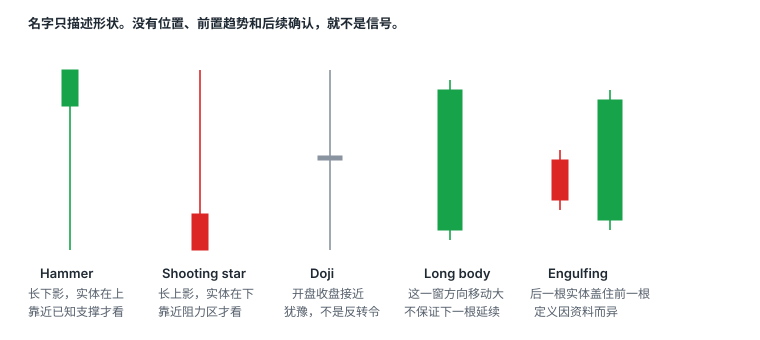

# 2.1 K 线与时间周期

> 一句话：K 线是一段时间内成交的压缩；未收盘的 K 线还在变。

图表是后面所有 setup 的公共语言。这一章只解决三件事：一根 K 线到底记下了什么、没记下什么；你选的时间周期在回答哪一类问题；以及怎样避免用「另一张图还没破」当不止损的借口。

成交量、VWAP、均线和振荡器全部放到本卷第四章。支撑阻力、缺口放到第二章。多根 K 线组成的形态、趋势的高低点序列，放到第三章。做多先买后卖、做空先卖后买的损益方向，卷一已经写过。这里只留和读图直接相关的一句：同一套 OHLC 同时服务于两个方向。Long 的损益近似为 `(卖出价 − 买入价) × 股数`；Short 方向相反，但必须先借到股票，价格理论上可以无限上涨，潜在亏损不封顶。示意图里的斜线还会省略点差、手续费、借股费、强制回补与停牌——这些不是「细节」，是真实成交和 K 线之间的缝。

## 2.1.1 技术分析是条件化观察，不是预测机器

技术分析用已经发生的价格和成交量，描述市场做过什么，再写成条件式计划：

```
如果价格突破 A，且成交量、点差符合你事先写好的要求，
就在 B 失效前尝试；
否则不交易。
```

一张图本身不能告诉你：

- 谁在买卖；
- 下一根 K 线必然怎么走；
- 你的订单能否在图示价格成交；
- 新闻或停牌何时出现。

课程把 K 线比成「看云识天气」。这个类比有用的一半是：你看到的是已经形成的形状，不是未来的保证。另一半必须补上：过去出现过，只能形成概率假设；假设要靠样本统计和风险上限，不能靠单张漂亮图。

后面每一章都沿用卷一已经定死的三个词。**形状**是价格怎么走出来的。**位置**是线画在哪。**触发**是价格穿过你预先画的线、并且你愿意用那根线当失效位。认出一根 Hammer 或一面旗，只是形状；它出现在昨天的缺口边，才有位置；当前这根 K 穿过旗面上沿，才是触发。

## 2.1.2 一根 K 线记下四个价



| 字段 | 含义 |
|---|---|
| Open | 这段时间第一笔成交价（按图表规则） |
| High | 这段时间最高价 |
| Low | 这段时间最低价 |
| Close | 这段时间最后一笔成交价 |

实体连 Open 和 Close。影线（wick）连到 High 和 Low：它记录的是「曾经到过、没有停住」的极值。绿色通常是收盘高于开盘，红色相反——**颜色可被平台改掉**，不要把颜色当规则。有的软件把阳线画成空心、阴线画成实心；换平台先核对图例。

日线图上的 Open / High / Low / Close 默认常常只含常规时段（美东 09:30–16:00）。平台是否把盘前盘后并进日线 OHLC，必须单独确认。同一只股票，含盘前的日线高和不含盘前的日线高，可以差出你整笔止损的宽度。拆股、分红和数据复权也会改写历史实体——分析前核对公司行动，不要把复权制造的视觉缺口当成隔夜跳空。

图上的紫色、橙色均线、手工水平线，不属于 K 线本身。读一根 K 的时候，先把它们当后来叠上去的注释，不要和实体、影线混成一个物件。线条颜色没有通用含义，必须先看自己的平台设置。

## 2.1.3 路径没有被记录

K 线是压缩，不是录像。同一根长上影，可能来自：

- 获利了结；
- 流动性空洞，买卖挂单之间突然没有对手；
- 某档大卖单被打穿后又被买回；
- 停牌恢复后的第一跳。

要结合位置和成交量，不能单凭形状预测下一根。长上影只说明「冲高后回落」，下一根不必跌。

只有 OHLC 时，你也不知道这一窗里先到 High 还是先到 Low。这对回测是硬约束：如果同一根 K 里止盈和止损都能被碰到，用日线或 5 分钟回测必须采用更细的数据，或者采用保守规则（例如「同一根里两个都触发，算止损」）。用收盘价回测、却按盘中影线当触发，统计是脏的。

## 2.1.4 未收盘的 K 线还在变


当前这根的 High、Low、Close 都可能继续改。上一根的高点，只有在上一根**已经收盘**之后才固定。计划如果写的是 candle close confirmation，盘中价格触及那条线，并不等于已经确认。

同一笔成交会同时更新你屏幕上的 1 分钟图和 5 分钟图。五根**已经收盘**的 1 分钟 K，合成一根 5 分钟 K。第五根还在走，5 分钟形态可以彻底改写：看起来像旗面的东西，最后 40 秒可以变成一根长上影。

不能拿未完成的 5 分钟形态当成已经确认的旗形、锤子或突破。复盘时必须固定当时屏幕上可见的信息，不能用后来走完的大周期 K 反推「当时显而易见」。

真实屏幕上往往同时还有 Level 2、持仓和新闻。决策不能只盯 K 线，但 K 线仍然是结构语言：盘口回答能不能成交，新闻回答为什么有人来，K 线回答你事先画的线破了没有。

## 2.1.5 触价、收盘确认、提前入场是三套规则

以「第一根创新高」为例，完整写法至少要有五步：

1. 先记录已收盘上一根的 High；
2. 决定是触价触发，还是收盘站上才算；
3. 预先指定失效点：上一根 Low、结构 Low，还是固定美元风险；
4. 把点差和滑点加入每股风险；
5. 触发后若无法获得合理成交，放弃追价。

触价触发：成交一出现在 7.01，规则就点火，不等当前这根收盘。收盘确认：要等这根收在 7.00 上方，假突破会少一些，进场也会更晚、离失效位更远。

课程也提到 anticipatory entry：在触发价之前先买。它不是更便宜的免费选择。更早进场意味着信号尚未确认，假突破概率更高，必须单独统计。回测时把成功样本算「提前买」、失败样本又说「尚未触发」，这不是验证，是作弊。

## 2.1.6 周期是嵌套的，不是投票

同一个价格动作在不同周期会长得不同。一根 5 分钟长上影，拆到 1 分钟后可能是先冲高、横盘，再快速下跌。局部剧烈波动在大周期上可能只剩一条影线。反过来：5 分钟看起来刚开始突破时，1 分钟可能已经连续拉升、离短期支撑很远。

不能在不同周期之间随意挑选最支持自己持仓的那一张。

课程说「绝大多数日内交易者都用 1 分钟、5 分钟和日线」是经验性表述，不是市场事实。有人加 15 分钟，有人开盘只用 1 分钟。换周期等于换策略。关键是：

- 在交易前固定周期；
- 用同一口径收集样本；
- 了解信号以哪一周期收盘确认；
- 不因一次失败临时换周期。

10 秒图或 tick 图的更新量很大。如果它不改善你已经验证过的决策，就不值得为了「看得更细」牺牲软件稳定性和注意力。工作区怎么排，见第四章。

| 周期 | 适合回答 |
|---|---|
| 日线 | 历史高低点、缺口、大级别均线、上方还剩多少空间 |
| 5 分钟 | 当天趋势是否还在、形态是否完整、是第一次有序回撤还是已经多次延伸 |
| 1 分钟 | 触发、假突破、快速失败、最近的微观失效位 |

合成规则本身没有争议，容易被忽略的是字段怎么并：

- 5 分钟 Open = 这五根里第一根已开盘的 Open；
- 5 分钟 High = 五根 High 里的最高；
- 5 分钟 Low = 五根 Low 里的最低；
- 5 分钟 Close = 最后一根的 Close。

所以 1 分钟里一段先涨后砸，在 5 分钟上可以只剩一根带长上影的实体。你在 1 分钟里觉得「趋势已经坏了」，5 分钟观察者可能还只看到「这一根上影比较长」。两边都没说错，他们在回答不同问题。

用数字走一遍。假设 10:00–10:05 这五根 1 分钟已经收盘：

| 时间 | O | H | L | C |
|---|---|---|---|---|
| 10:00 | 8.10 | 8.18 | 8.08 | 8.16 |
| 10:01 | 8.16 | 8.28 | 8.15 | 8.26 |
| 10:02 | 8.26 | 8.30 | 8.20 | 8.21 |
| 10:03 | 8.21 | 8.24 | 8.12 | 8.14 |
| 10:04 | 8.14 | 8.17 | 8.10 | 8.13 |

合成的 5 分钟是 Open 8.10、High 8.30、Low 8.08、Close 8.13。1 分钟上你看见冲到 8.30 又跌回来；5 分钟上这是一根带长上影、收盘几乎平开的 K。若 10:04 那根还没走完，High 和 Close 都还能改，这根 5 分钟现在看起来像 Shooting star，一分钟后可以变成普通小阴线。

更稳的用法：大周期决定**区域**（在哪两层之间），小周期决定**是否出现可执行的触发**。多个周期不是投票。不要说「1 分钟破了但 5 分钟还没破，所以我的止损可以先不动」。

Level 2 和 Time & Sales 回答的是「现在执行环境怎样」，不是第四张可以投反对票的图。它们的细节在卷三。

## 2.1.7 周期混用是最常见的不止损借口

触发来自 1 分钟突破，失效却跑到 5 分钟「结构还在」——这是两套计划缝在一笔交易里。统计也会脏：你无法知道自己到底在测哪套规则。

选定周期之后，入场、止损、样本都锁在同一周期。若以 5 分钟 Low 为止损，却按 1 分钟很窄的风险计算仓位，实际损失会被低估。持仓时间也要和周期一致：用 1 分钟图入场，却等日线级别判断来证明自己正确，风险会失控。

每次说出「现在是上升趋势」之前，先回答四个问题：

1. 我看的是 1 分钟、5 分钟还是日线？
2. 我打算持仓几秒、几分钟还是几小时？
3. 当前回调是否真的破坏了高一级结构？
4. 我的止损依据属于哪个时间周期？

趋势的高低点序列在第三章展开。这里先记住一条：趋势标签必须带上观察窗口。「现在是 downtrend」只有在时间范围明确时才有意义。同一只股票可以：1 分钟正在下跌，5 分钟只是大 uptrend 里的一次 pullback，日线仍然处于长期 downtrend。

## 2.1.8 常见单根形状：位置比名字重要



形态清单是观察语言，不是看到名字就下单的策略。有效信息来自「位置 + 前置趋势 + 成交量 + 后续确认」，而不是蜡烛名称本身。

| 名字 | 看上去 | 有用的前提 |
|---|---|---|
| Hammer | 长下影、小实体在上方 | 出现在你已经标出的支撑区附近 |
| Inverted hammer | 长上影、小实体在下方，但是在下跌之后 | 名称要结合所处趋势，不要和 Shooting star 混用 |
| Shooting star | 长上影、小实体在下方 | 出现在阻力区附近 |
| Doji | 开盘收盘接近 | 说明这一窗里多空暂时胶着，不是反转指令 |
| Long body | 实体很长，这一窗方向移动大 | 仍须与平均波幅和成交量比较 |
| Bullish / bearish engulfing | 后一根反向实体覆盖前一根实体 | 不同资料对是否必须吞没影线定义不同 |

没有位置的锤头，只是一根上下影不对称的 K 线。

### Hammer 与长下影

下影很长，说明低价曾经出现，随后买盘或空头回补把价格推回。它可能是拒绝下跌，也可能只是高波动。要看：

- 是否位于已知支撑；
- 收盘位置是否接近这一窗的高位；
- 下一根是否确认；
- 形成时的成交量和点差；
- 下影低点到入场的距离是否使单笔风险过大。

若只能把止损放在长影线的远端，仓位必须按更宽的每股风险缩小，不能仍使用固定股数。

### Shooting star 与长上影

上冲被压回。出现在你已经画好的阻力区，信息量高于出现在随机位置。它同样不是「下一根必跌」的指令。要等结构变化：例如更低高点之后跌破原来的更高低点序列。一根 topping tail 加上 RSI 超买，仍然不够。

### Doji

Doji 表示该周期净变化小，不代表期间没有剧烈波动——上下影可以很长。趋势末端的 doji 可能提示犹豫；区间中间的 doji 可能没有信息。它回答的是「这一窗里开盘和收盘差不多」，不是「即将反转」。

### 长实体

长阳或长阴只说明这一窗里方向移动大。突然扩大约 200% 的单根波幅，会同时增加机会和止损距离。大阳线之后可以出现多根整理，随后下跌。大阳线本身并不保证延续。

如果只能把止损放在这根长阳的低点，仓位必须按更宽风险相应缩小。看见第一根大绿 K 就市价追，失效位往往远在起点，盈亏比先坏掉。第三章会把「大突破后先等整理」写成结构规则。

### Engulfing

吞没形态展示前一根实体被下一根反向实体覆盖。有的资料要求连影线一起吞掉，有的只比实体。真正需要测试的是：在你的股票池、特定位置和成交量条件下，后续收益分布是否改善。名称本身没有概率。

## 2.1.9 固定的读图顺序

每次打开一只股票，按同一顺序，避免被最新一根绿 K 牵着走：

1. 日线：历史高低、缺口、长期均线、到第一层阻力还有多少空间；
2. 5 分钟：当天主趋势、重要平台和量能变化；
3. 1 分钟：入场触发、最近失效位置；
4. VWAP / EMA：只作为参考位置，不替代价格行为（算法见第四章）；
5. 检查当前 K 线是否已经收盘；
6. 写出如果判断错误，在哪里退出。

顺序是：**先周期，再位置，再结构，最后才是触发。** 先画线、先写失效，再谈这根 K 像不像某一种名字。

## 2.1.10 图表练习方法

静态图会骗人，因为你已经看见右边。练习时：

1. 隐藏未来 K 线；
2. 只画三到五个最重要水平；
3. 写下对上破、下破和横盘三种情景；
4. 再逐根推进；
5. 记录计划价与现实可成交价；
6. 统计同一 setup 至少几十个样本；
7. 失败样本和成功样本同样保留。

「会看图」不是能给已经发生的走势命名，而是在只看到左侧数据时，仍能写出有限、清楚、可证伪的下一步计划。

## 2.1.11 和后面几章怎么接

读完一根 K，你还没有交易。你只知道这一窗的四个价，以及当前这根还改不改得了。下一步：

- 把这些价放到已经画好的区域里，看它是在试探、接受，还是夹在两层中间——第二章；
- 把相邻的摆动高点、低点连成序列，看现在是 HH / HL、LL / LH 还是横盘——第三章；
- 看量能不能支持这次移动，VWAP 从哪一侧被接近——第四章。

四章合在一起，才是「先周期，再位置，再结构，最后触发」。单独这一章最容易犯的错，是把单根名字当成全部。

## 2.1.12 本课最容易误用的地方

- 指标越多不代表确认越强。多个指标可能都由同一价格数据计算，信息高度重复。这一条在第四章展开，但读 K 线时已经成立：不要为了给一根锤子找「共振」再叠 RSI。
- 颜色、参数和计算时段可能因平台不同而变化。
- 「价格在 VWAP 上方」只是描述，不自动等于做多。
- K 线形态必须放在支撑阻力和量能环境中解释。
- 任何图形都只能帮助定义概率与风险，不能保证下一根 K 线方向。
- 未收盘 K 线的最高价更不能当已经突破。影线试探和接受成交的差别，下一章用图说明。
- 先持仓，再随意更换时间周期为亏损找理由，会让样本和纪律一起坏掉。

## 先记住这些

- 未收盘 K 线不是信号。
- 大周期定区域，小周期定触发。
- 锤头、流星、十字星没有位置就没有含义。
- 同一根 K 里先到高还是先到低，图上读不出来。
- 触价、收盘确认、提前入场是三套规则，样本不能混。

## 不要做的事

- 把课程里的 9 / 100 / 200 EMA 周期当最优解。
- 用未完成的 5 分钟形态当作已经确认的旗形。
- 1 分钟进、5 分钟止损。
- 回测时用后来走完的大周期 K 证明「当时早该看出来」。
- 看见长阳就按固定股数追，止损仍钉在这根低点。
