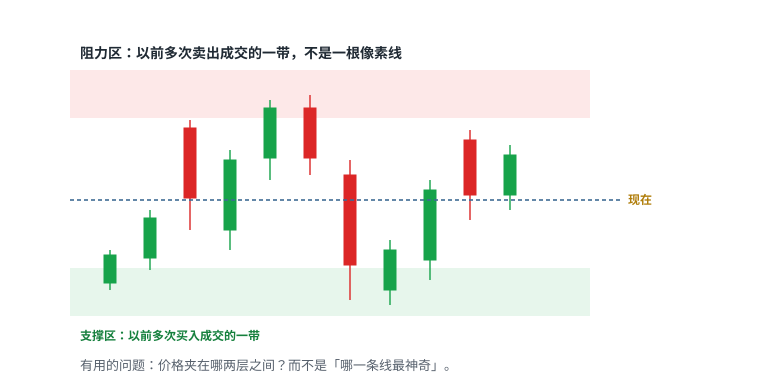
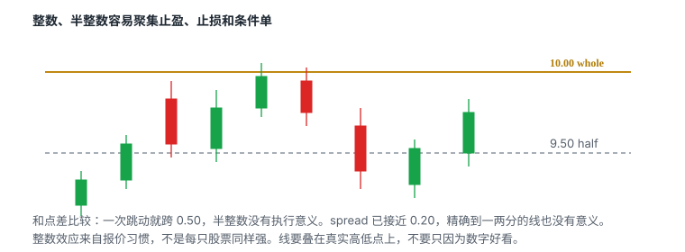
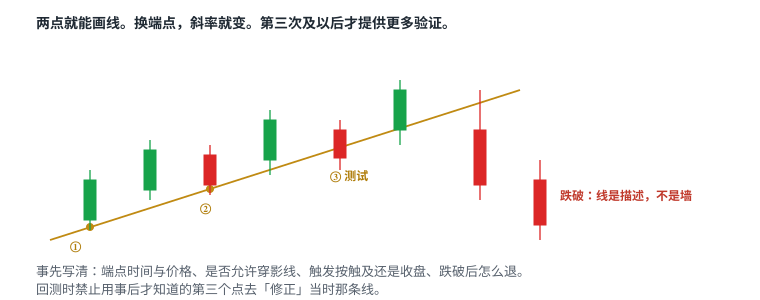
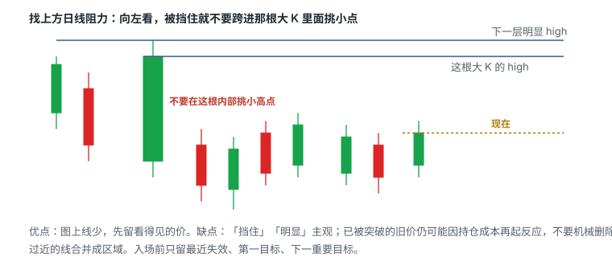
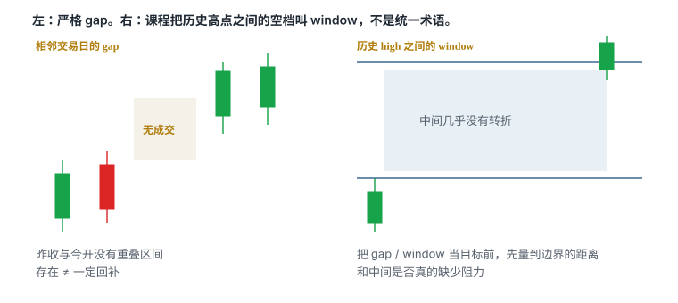
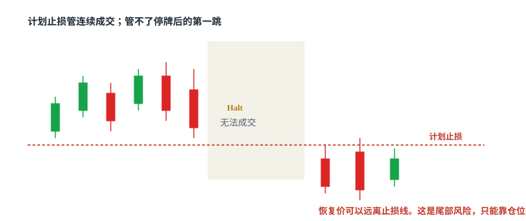

# 2.2 支撑、阻力与缺口

> 一句话：支撑阻力是区域；「现在夹在哪两层之间」比「神奇的一条线」有用。

上一章解决了单根 K 线和时间周期。这一章解决线画在哪。线不是预测工具。它的价值是：让入场、退出和「今天不交易」都有事前位置。

停牌、LULD、盘前盘后的完整规则在卷三。这里只保留和画线、跳空直接相关的部分：停牌会在图上留下空白或缺口，暂停期间普通止损单无法执行。

## 2.2.1 区域，不是像素

支撑是价格下跌时可能出现新增需求的区域；阻力是价格上涨时可能出现新增供给的区域。需求可以来自新买家，也可以来自空头回补。供给可以来自新卖家，也可以来自多头止盈。图上你看不见「谁」，只能看见以前这里成交过、并且价格在这里停过或反转过。

市场不会精确停在你画的那根线上。点差、滑点、影线都会让价格在一条带状区域里来回。线应盖住**实际发生过反应的那一带**，不要为了贴合最高一根影线画得过分精确。

「接近支撑」只值得观察，不能替代止损和仓位计划。价格走到区域里，你的工作是看它怎么反应，不是假设它必须弹回去。

线画得太多，任何结果都能事后解释。盘前只留可能影响今天计划的几层。屏幕上的线按优先级分层：最近、最明显、最可能影响当前仓位。当前价格位于哪两层之间，比寻找一条「神奇阻力」更实用。

## 2.2.2 五类来源（常会重合）

课程把常见依据分成五类。它们不是彼此独立的五个系统。历史高点常常本身就是整数关口；VWAP 某一分钟也可能刚好叠在半美元上。

| 类别 | 例子 | 注意 |
|---|---|---|
| 心理价位 | 整美元 10.00、半美元 9.50 | 若一只股票一次跳动就跨 0.50，半整数没意义 |
| 历史价位 | 明显高低点、横盘平台、缺口边、成交密集区 | 多次转折比只出现一次的随机价更值得画 |
| 指标 | VWAP、关键 EMA | **动态的**，随新成交移动 |
| Level 2 大单 | 某价位公开的卖单墙 | 可撤、可改、可被隐藏单替代 |
| 图形结构 | 双顶、双底、水平平台 | 第二次碰到时，形态还没完成 |

多个来源叠在同一价位，提高**关注优先级**，不会把概率变成确定性。最终确认来自价格到达该区域后的成交量、速度和能否站稳。

Warrior 的清单还补了盘中常用的具体位置：盘前高低、前一日高低与收盘、当前区间高低、停牌参考价、发行价格。这些仍然属于上面五类，只是更贴近开盘当天。

## 2.2.3 心理价位：Whole 与 Half Dollar

10.00、20.00 这类整数容易被人记住，也常聚集止盈、止损和条件单。9.50、10.50 这类 half dollar 在低价股里也可能产生反应。整数效应来自订单聚集和人类报价习惯，不是每只股票都有相同强度。

心理价位必须和当前点差比较：

- 一次跳动就跨越 0.50 美元，单独画半整数意义很小；
- spread 已经接近 0.20 美元，精确到一两美分的水平线没有实际执行意义；
- 水平线应结合此前真实高低点，而不是仅因数字「好看」就画。

## 2.2.4 历史价位

历史支撑阻力来自过去明显的高点、低点、横盘平台、缺口边缘或高成交区域。

多次转折的位置比只出现一次的随机价格更值得记录。距离太远、成交背景完全不同的旧价位，参考价值可能下降——但不要机械删除：以前被突破的价位，仍可能因持仓成本或市场记忆再次产生反应。

先找价格此前明显停顿或反转的区域，再看当日是否再次接近。到位后的第一根红 K 不是自动做空信号。更重要的是：反弹能否收复、量能是否衰减。失效条件应写成「突破并站稳某区域」，而不是凭感觉扩大止损。

## 2.2.5 指标形成的动态区域

EMA 和 VWAP 随新数据变化，属于动态参考，不像历史高点那样钉在一个价。价格接近它们之后有没有反应，才是事实。反复测试会消耗一侧订单，也可能说明该区域失效。

第四章会把 VWAP 的计算、平台差异和四种用法写全。这里只需记住：动态线和历史水平不是同一类东西。止损不要钉在「VWAP 本身」，钉在结构失效处。VWAP 是位置，不是形状。

## 2.2.6 Level 2 大单

某价位的公开大卖单说明当下有可见供给，但订单可以撤销、移动或被隐藏单替代。应观察大单被成交后是否继续补回，以及价格是否能推进。

只因看到「墙」就提前反向入场，容易被撤单或真正突破击中。Level 2 回答的是现在的执行环境，不是未来一定往哪走。完整读法在卷三。

## 2.2.7 图形结构

双顶表示两次上冲在相近区域失败；双底表示两次下探被买回。水平平台是一段时间内高低点都挤在同一带。

第二次触碰时，你并不知道形态是否会完成。必须等价格反应，不能用事后命名代替决策。两个顶或底之间的量能、时间间隔和大趋势都会影响可解释性。

用双顶这个名字替代失效价，是这一章最常见的偷懒：名字不能告诉你该在哪退出。

## 2.2.8 测试次数没有机械规律

- 同一个位置被碰到 2–4 次、低点同时抬高，可能是买方在往上接。
- 碰到 7–8 次还过不去，也可能是买方把自己耗尽了。
- 「测试越多越容易破」和「测试越多越坚固」都不是定律。反复测试既可能消耗一侧订单，也可能说明这个区域已经失效。

贴顶突破把「多次接近同一高点 + 低点抬高」写成形状，那是第五章的 setup，不是这里的定律。没有抬高的低点、只是反复撞同一根线，更像冲高失败，不是更强的支撑。

## 2.2.9 趋势线的画法与局限

斜线连接多个抬高的低点，试图表示 ascending support。两点可以画线，第三次及以后测试才提供更多验证。选择不同端点会得到不同斜率。

价格后来跌破趋势线，说明线是结构描述，不是墙。跌破是否有效，还受时间周期、收盘确认、成交量和回抽影响。

避免为了贴合价格不断重画趋势线。应保存最初画法，记录：

- 端点时间和价格；
- 是否允许穿影线；
- 触发按触及、突破还是收盘；
- 跌破后的退出规则；
- 是否在回测中使用了事后才知道的点。

回测时用后来第三个低点去「修正」当时那条线，是典型的事后偏见。

## 2.2.10 Left and up：少画线的一种方法

寻找上方日线阻力时，课程采用：

1. 从最新价格向左看；
2. 遇到挡住视线的大 K 线，不跨过其价格范围去挑内部小点；
3. 从该 K 线 High 再向左、向上找下一个明显 High；
4. 依次标出可能的阻力。

优点是减少图上密密麻麻的水平线，优先保留明显价位。缺点是「挡住」「明显」的判断主观；以前被突破的价位仍可能再次产生反应，不能机械删除。

更稳妥的标注分级：

- A：近期且多次有反应；
- B：较远但明显的日线高低；
- C：只有单次或较弱证据；
- 已突破：保留灰色，观察是否发生 role reversal；
- 与当前价过近：合并为区域。

入场前只保留最近失效点、第一目标和下一重要目标。其他远端水平用于情景参考。这是历史图上的事后标注；练习时应只用当时可见数据重画。

## 2.2.11 影线试探与接受成交

一根长上影穿过阻力又收回来，是试探，不是接受。接受看起来更像：收盘站在线的那一侧，随后的回落不把线还回去。

用未收盘 K 线的最高价当「已经突破」，会把大量假信号算进样本。你的计划必须事先写清：触发是 trade-through、bid hold、收盘确认，还是突破后回踩。不能事后任选最漂亮的那一种。

## 2.2.12 角色会换

旧阻力被向上突破并在上方被接受，才有资格成为新支撑的**候选**。要等回踩验证，不能假设换位已经完成。若新低跌破前一个有效支撑，向上的阶梯就被破坏了——这是减多头预期的事实，不是「还可以等一等」。

价格阶梯和突破后怎么等整理，在第三章展开。这里先定一条：role reversal 是观察结论，要价格走给你看，不是画线当时就能宣布。

一个可执行的最小定义（启发式，写进计划后用样本改）：

- 向上突破：收盘站上区域上沿，随后一次回踩的低点仍在区域上沿之上；
- 向下跌破：收盘站下区域下沿，随后一次反抽的高点仍在区域下沿之下；
- 只插一根影线就回来，区域身份不变。

「站上」用哪个周期，必须和这笔交易的主风险周期一致。用 1 分钟影线宣布日线阻力已经换成支撑，是周期混用的另一种写法。

## 2.2.13 Gap 与课程所称 Window

严格的 price gap 是两个相邻交易时段之间没有重叠的价格区间。日线图上的缺口常常来自隔夜新闻。盘中小周期也会因停牌恢复而跳空。

缺口大小要相对该股票通常波幅判断。很小的缺口可能被 spread 和噪声淹没。图上历史上发生过 gap，不等于今天一定会回去 fill。拆股、分红和数据复权也可能制造视觉缺口，分析前要核对公司行动。

课程另外把历史长 K 线内部、几乎没有转折阻力的宽区间称为 `window`。后者是本课程的观察术语，不是所有技术分析资料统一采用的定义。线与线之间较空的区域被视为潜在 window：中间缺少明显转折，并不等于价格会一口气走完这段。

## 2.2.14 「Gap Fill」不是必然回归

缺口可能：

- 很快回补；
- 部分回补后反转；
- 数周或数年不回补；
- 因公司价值重估永久留在图上；
- 在复权后消失。

缺口边缘经常被当成潜在反应区，**不是**「缺口一定回补」。有的缺口当天就填，有的变成新的支撑或阻力。是否有交易价值，看价格第一次碰到缺口边时怎么反应，而不是看缺口存在本身。

把 gap 当目标前，至少确认：

- 缺口为何形成；
- 目前价格到 gap 边界的距离；
- 中间是否真的缺少阻力；
- 当日成交量能否支持；
- 到目标前的 reward 是否大于现实 risk；
- 是否接近停牌、发行或财报。

开盘高开本身不是信号。Gap and Go 是卷五的策略：触发在盘前高点被接受，不是高开百分比。

盘前高低本身就是当天最常用的两层。把它们画成区域，而不是一根穿过最高一笔盘前成交的细线。开盘后第一段波动经常先回测这层：站稳，它是支撑候选；失守，它是失败高开。盘前成交量通常更低、spread 更宽，很多券商只接受限价单——所以盘前「突破」的质量，默认低于常规时段同样形状的突破。课程画面里具体的盘前起止时间不可直接套用，以你的券商当日支持为准。

缺口还有一种盘中来源：停牌恢复。那不是隔夜定价，是交易被强制切断后再打开。图上看起来都是空白，决策含义不同。隔夜缺口至少经过数小时的订单积累；停牌缺口可能只有五分钟，恢复价可以远离任何你画过的线。

## 2.2.15 停牌会留下空白（指针）

LULD 等机制可能在常规时段的剧烈波动中暂停个股交易。图表上的特征是出现时间空白，或直接跳到新价格。暂停期间没有连续成交路径。暂停前的 stop 无法在暂停期间执行，恢复时才有机会进入市场。

课程区分两类：volatility pause halt（短时间价格变动过大）与 pending news halt（公司申请停牌以发布消息）。halt 越久，reopen 时价格变动往往越大——这是计划止损失效的来源。

恢复价可能明显高于或低于暂停前。在 halt down 时挂市价单等恢复，不是安全方案：市价单会在可成交的未知价格执行。更稳妥的原则是**进入停牌前控制仓位**，恢复后重新观察可见报价。完整规则、LULD 档位和盘外时段见卷三。

低流通盘、连续加速的股票必须使用更小仓位，原因之一就是这种缺口。盘外成交量通常更低、spread 更宽；很多券商只接受限价单。日线缺口经常就是在这些时段形成的。

## 2.2.16 从日线区域转到盘中执行

先在日线标出最重要的两三层，再看 5 分钟当天是否再次接近，最后用 1 分钟决定触发和最近失效。小周期上的漂亮突破若正撞到大周期高点，实际空间可能很小。同一水平位在早盘高量和午间低量时段的意义不同。

盘前为每只候选股建立：

1. 最近的历史支撑与阻力区；
2. whole / half dollar；
3. VWAP 与关键 EMA（动态，角色随接近方向变）；
4. 停牌、融资和盘外流动性风险；
5. 价格到达每一区域时的计划动作；
6. 突破站稳或跌破后哪个判断失效。

融资公告会改变供给预期，但「offering」一词本身不够：要读是新发行还是股东转售。那是选股和新闻核对的事，不在这一章展开。发行价本身常常变成之后数日的水平——它属于历史价位，不是新的一类来源。

## 2.2.17 同一区域被不同时段使用

早盘高量时，10.00 可能是真正的供给墙：止盈、新空、条件单叠在一起。午间同一根线可能只剩稀薄挂单，一根市价就能穿过去，随后又因没有跟随而跌回。所以「这是阻力」必须带上时间：它是今天早上被验证过的阻力，还是昨天日线上的旧平台，中午第一次被薄量碰到？

远景能看出早盘高点、午间低量整理和后续再启动。小周期上的漂亮突破若正撞到大周期高点，实际空间可能很小——不是形态错了，是位置把 reward 先削掉了。这种情况正确的动作常常是不交易，而不是把止损放到更远的日线低点去「给空间」。空间不够是位置问题，不是胆量问题。

## 2.2.18 从图形到交易计划

图形名称只填 Setup 一栏。没有 context、trigger、invalidation、size 和 exit 的「形态」，仍然不是可以执行的策略。

| 项目 | 示例写法 |
|---|---|
| Context | 盘前有新催化，日线接近历史高 |
| Setup | 5 分钟第一次有序回撤 |
| Trigger | 突破已收盘前一根 5 分钟 high |
| Invalidation | 跌破回撤 low，且计入滑点 |
| First target | 盘前高 |
| Next target | 日线下一个阻力区 |
| Position size | 最大美元风险 ÷ 每股风险 |
| No-trade | spread 过宽、停牌、无成交量确认 |

练习时隐藏未来 K 线，只画三到五个最重要水平，写下上破、下破、横盘三种情景，再逐根推进。记录计划价与现实可成交价。失败样本和成功样本同样保留。

这四节源课的核心不是背 whole dollar 或 gap fill，而是建立一套不会随持仓改变的画线顺序：先周期，再位置，再结构，最后才是触发。线是为了限定决策，不是为了让事后解释完整。

## 先记住这些

- 先画少而清楚的区域。
- 问「夹在哪两层之间」。
- 突破后的新支撑是候选，要回踩确认。
- 缺口边缘是反应区候选，不是回补保证。
- 触发写法事先定死：触及、收盘还是回踩。

## 不要做的事

- 为了让影线贴线而把图画得像工程图。
- 把 Level 2 上的大单墙当成不会撤的铁壁。
- 用双顶名字替代失效价。
- 为贴合价格不断重画趋势线。
- 把「缺口还没补」当成必须交易的理由。
