# 2.3 形态与多周期

> 一句话：形态只提出假设；价格接受、成交量和明确失效点才决定它是不是一笔交易。

上一章把线画成区域。这一章处理多根 K 走出来的形状，以及怎样把 1 分钟上的局部结构放回 5 分钟和日线。突破、回踩、开盘策略的**完整执行**在卷五（5.1 旗形、5.2 贴顶、5.3 ABCD……）。本章只认形状和周期，不当成交易计划。

核心动作其实很基础：

```
找最近支撑 → 找最近阻力 → 等价格确认 → 更新地图
```

「会看图」不是能给已经发生的走势命名，而是在只看到左侧数据时，仍能写出有限、清楚、可证伪的下一步计划。

## 2.3.1 Pattern 只是重复形状，Strategy 才能执行

同一个 bull flag 可以出现在：

- 有真实催化、高相对成交量的低流通盘股票；
- 没有新闻、点差很宽的冷门股票；
- 大盘 ETF；
- 盘前薄量阶段；
- 高位第三、第四次拉升之后。

形状相似，后续分布和成交质量可能完全不同。完整策略至少需要：

```
股票池 + 市场环境 + setup + trigger + invalidation + sizing + exit + 成本
```

Starter 课只介绍形态。屏幕上一次成功的实时示范，不能当作统计验证。图形名称只填 Setup 一栏。

形状和位置必须分开。能独立存在的形状其实很少，其余大多是「这条线画在哪」。

| 形状（怎么画线） | 位置（线画在哪） |
|---|---|
| Bull flag（旗杆 + 旗面） | 前收盘 |
| Flat top（平顶 + 抬高的低点） | VWAP |
| 横盘箱体 | 当日最高价 HOD |
| ABCD / 1-2-3-4 | 整美元、盘前高点、日线阻力 |

Bull flag 可以出现在任何位置。HOD 也可以被任何形状突破。位置越有名，突破时越容易猛——因为更多人的止盈、止损和条件单堆在同一价。上方卖压也会更集中，必须看成交是否真的推进。

HOD 会随新高更新。VWAP 会随成交移动。它们是动态位置。

## 2.3.2 趋势不是「这一根 K 涨还是跌」

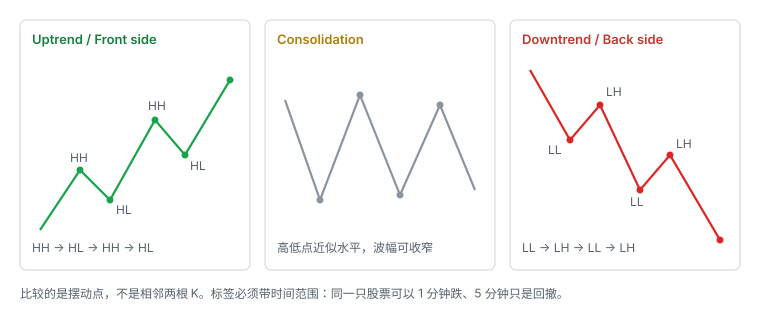

Trend 指价格在一段时间内的总体移动方向。先分三类：

- **Uptrend / Front side**：上升趋势；
- **Downtrend / Back side**：下降趋势；
- **Sideways / Consolidation**：横向整理。

趋势必须同时说明「在哪个时间范围观察」。同一只股票可以：1 分钟图上正在下跌；5 分钟图上只是大 uptrend 中的一次 pullback；日线图上仍然处于长期 downtrend。因此，「现在是 downtrend」只有在 time frame 明确时才有意义。

看趋势截图时不要从最右边最后一根 K 开始。正确顺序是：

1. 从左向右圈出连续的 swing high 与 swing low；
2. 比较相邻高点、低点是抬高、降低还是近似水平；
3. 最后再看成交量、均线和阻力是否支持这个结构判断。

不要把每一根 K 的小波动都当 high / low。只挑足以改变结构的摆动点。高低点都没有明显抬高或降低时，先标为 consolidation，比强行猜方向更安全。单独一根红 K 不足以证明 uptrend 结束；单独一根绿 K 也不足以证明 downtrend 结束。

### Uptrend：Higher High + Higher Low

1. 价格突破前一个高点，形成 **higher high**；
2. 突破后出现 pullback；
3. 回调低点没有跌回前一个低点，形成 **higher low**；
4. 再次上涨并形成下一个 higher high。

```
HH → HL → HH → HL
```

含义：买家持续愿意用更高价格成交；每次回调都有人在更高位置承接。Day trade 里，front side 往往伴随较高或增加的成交量。在结构未被破坏前，逆势做空风险较高。

结构开始损坏的观察：

- 突破新高失败；
- 回调跌破前一个重要 higher low；
- 反弹只能形成 lower high；
- 成交量和向上 momentum 显著下降。

最右侧急涨只能证明当下动能强，是否维持 uptrend 仍要看下一次回调。

### Downtrend：Lower Low + Lower High

```
LL → LH → LL → LH
```

Back side 的整体成交量通常比最初 front side 少。随着关注度和新买家减少，量能可能继续下降。低量反弹很容易只是 downtrend 中的 lower high。不应只因「已经跌很多」就认定趋势会反转。

如果做空入场太晚，哪怕结构仍向下，也可能因离阻力过远而得到很差的风险收益比。

### Consolidation：区间、低量与等待

典型特征：

- 价格在一个区间内上下波动；
- 多个高点大致位于同一水平；
- 多个低点大致位于同一水平；
- 单次波动幅度逐渐变小；
- 成交量通常下降；
- 最终向一侧突破时，量和波动可能突然增大。

横盘内部的某一根上涨或下跌 K 不能单独定义新趋势。真正的结构变化要等价格离开区间，并观察突破后是否保持。

区间内部可能正在积累两类仓位：Long traders 在支撑附近买入；Short sellers 在阻力或区间内部做空。最后突破方向会迫使错误一方离场：向下破位，多头止损可能加速 flush；向上突破，空头回补可能加速 squeeze。

若在 consolidation 内基于支撑做多，风险放在区间明确低点下方。若做突破，则应先定义「突破失败后哪里证明判断错误」，不能等到价格穿过整个区间才处理。

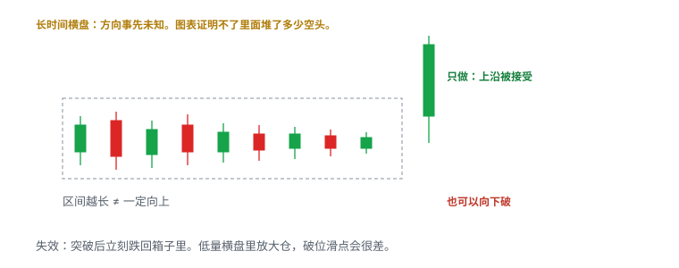

区间越长 ≠ 一定向上。图表证明不了里面堆了多少空头。低量横盘里放大仓，破位滑点会很差。

## 2.3.3 价格阶梯

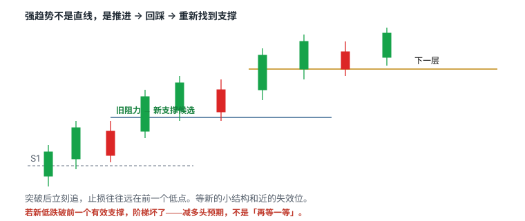

强趋势不是直线上涨，而是推进、回踩、重新找到支撑。每一级旧阻力被突破后成为新支撑候选，要等回踩验证。若新低跌破前一有效支撑，阶梯结构被破坏，应降低多头预期。

较小阻力被突破后，目标可以转向更高一级阻力。近端阻力用于第一目标，更高阻力用于判断是否保留剩余仓位。买在支撑附近与等阻力突破后买，胜率、入场确认和 stop 距离不同。不应只因价格最后涨到更高位置，就否定较早按计划止盈。

同一段走势可以有多种画法。水平线标出每一阶段可见的局部高低点，不是一次性画好后永不改变。为了减少主观性，画线时记录：

- 该位置至少被测试几次；
- 当时是否有明显成交量；
- 是已收盘 K 线还是仍在变化；
- 与 VWAP、整数位或大周期区域是否接近；
- 突破后怎样才算「站稳」。

线的作用是限定决策，不是让图表看起来解释完整。

## 2.3.4 大突破后先等整理

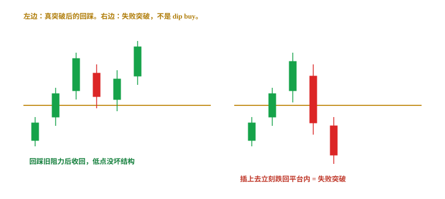

大绿 K 后立即追入，stop 往往很远，risk / reward 变差。等价格形成新支撑和新阻力，能够把失效位缩小到当前结构。如果回落直接穿过前支撑，说明不是健康整理，而可能是失败突破。

左边：真突破后的回踩，低点没坏结构。右边：插上去立刻跌回平台内，不是 dip buy。卷五会把回踩写成独立策略；这里只要先分清两张图。

## 2.3.5 第一根创新高到底指什么

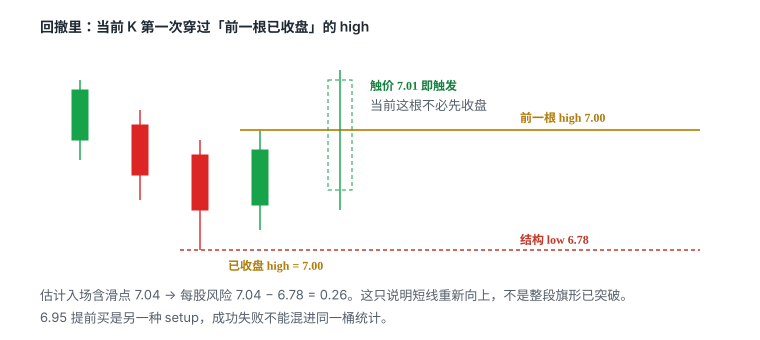

课程定义是：回撤过程中，当前 K 线第一次突破前一根**已收盘** K 线的 high。它不要求当前 K 线先收盘。

例如：

- 前一根 high：7.00；
- 计划触价触发：成交出现 7.01；
- 结构 low：6.78；
- 估计入场含滑点：7.04；
- 每股风险：`7.04 − 6.78 = 0.26`。

这个触发只说明短期方向重新向上，不说明：

- 一定突破整个旗形；
- 能在 7.01 成交；
- 风险固定为 0.10；
- high 上方没有大卖单；
- 假突破后能按 low 平仓。

如果提前在 6.95 anticipatory entry，必须把它定义为另一种 setup。不能在回测时把成功样本算「提前买」，失败样本又说「尚未触发」。

## 2.3.6 Bull Flag

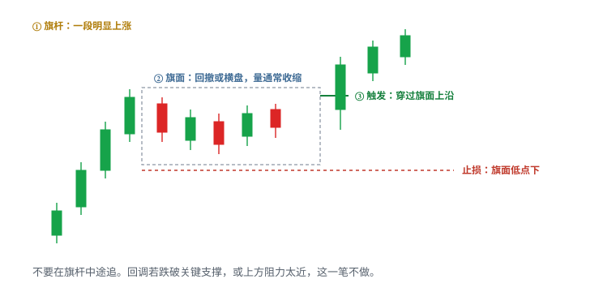

| | |
|---|---|
| 怎么认 | 旗杆 = 前一段明显上涨；旗面 = 量能通常收缩的回调或横盘 |
| 触发 | 整理区上沿被穿过并接受 |
| 止损 | 旗面低点 / 关键支撑下方 |
| 常见失效 | 跌破旗面低点；假突破 |
| 不做 | 回调已跌破关键支撑、量能失控、上方阻力太近 |

不要看见第一段上涨就追。那是旗杆，不是触发。

课件提出的常见特征：多根上涨 K 线、至少两根回撤 K 线、回撤靠近 9 EMA，再由第一根创新高触发。这些数字是课程的筛选偏好，不是 bull flag 的唯一市场定义。手绘形状只表达结构；没有价格、成交量、时间和失效点，不能直接计算交易。

课程偏好的较强版本（启发式，写进你的计划并用自己的股票池验证）：

- 旗杆有价格和成交量扩张；
- 回撤量缩；
- 回撤深度不超过旗杆约一半；
- 在高位而非完全跌回起点；
- 靠近 9 EMA 或前一个结构支撑；
- 再突破时成交量重新扩大；
- 1 分钟与 5 分钟没有相互冲突。

「不超过一半」不是自然定律。需要在自己的股票池中测试不同 retracement 深度。

## 2.3.7 Flat-top Breakout

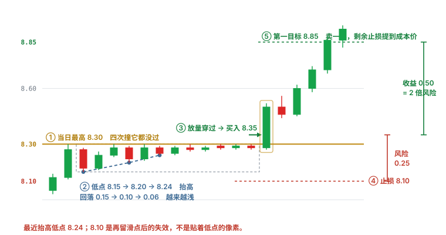

结构：

- 多次在接近同一 high 受阻；
- low 逐步抬高或价格在 high 附近收紧；
- 突破水平线后才进入新价格区。

两个条件缺一不可。只满足平顶、低点没有抬高的，是「反复冲高失败」，不是 flat top。

| | |
|---|---|
| 触发 | 水平上沿被**接受**（实体站上，不是一根影线插一下） |
| 止损 | 最近抬高的低点下方，再留一点滑点（图里低点 8.24，失效画在 8.10） |
| 常见失效 | 突破后迅速跌回；高位供给还在 |
| 不做 | 入场离上沿已经很远 |

需要防：

- 每次测试都在消耗买盘而非卖盘；
- 可见卖单撤单造成假象；
- 突破只有一笔小成交；
- 入场价离最近 low 太远；
- 整数位上方立即有日线阻力。

有效触发应明确是 trade-through、bid hold、收盘确认，还是突破后回踩；不能事后任选。

测试次数越多越容易突破？**不是机械规律。** 多次测试也可能把买盘耗尽，或专门制造假突破。一套可执行的起始规则（启发式，改完必须写下来并跑满自己的样本）：

- 横盘至少数根 1 分钟 K；
- 回落至少两次且后一次更浅；
- 横盘内量能萎缩；
- 风险：收益的长度从结构上能到约 1:2。

对了赚 0.50、错了亏 0.25，十次里对四次仍可能正期望——**前提是止损被执行**。完整策略卡在卷五。

## 2.3.8 接受 vs 影线

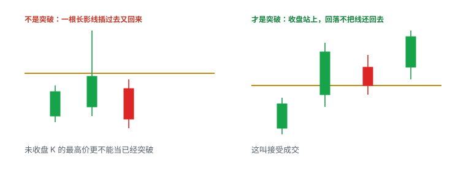

一根长上影穿过阻力又收回来，是试探，不是接受。接受看起来更像：收盘站在线的那一侧，随后的回落不把线还回去。用未收盘 K 线的最高价当「已经突破」，会把大量假信号算进样本。

## 2.3.9 Moving-average Pullback

价格在趋势中回到 9 EMA、20 EMA 或 VWAP 附近，再恢复方向。均线只是动态参考，不是天然支撑。

较好的观察条件：

- 均线斜率与趋势一致；
- 回撤有序、量能收缩；
- 均线附近同时有结构 low 或此前突破位；
- 价格不是第一次触碰就直接盲买；
- 失效点放在价格结构，而不只是均线下方一分钱。

不同平台的 EMA 和 VWAP 输入数据可能不同，实际价位要以自己下单时使用的数据为准。课程里的 5 分钟 EMA9、1 分钟 EMA100 / 200 是个人模板，标成启发式。

## 2.3.10 ABCD / 1-2-3-4

常见描述：

- A→B：第一段上涨；
- B→C：回撤；
- C→D：恢复上涨并测试或突破 B；
- D：目标区，不是保证到达的位置。

它就是「旗杆 + 回撤 + 再破前高」的另一种画法。触发是 C 之后恢复并穿过 B；失效在 C 的低点。事后硬凑三段不算。D 不是承诺。

ABCD 很宽泛。必须额外定义：

- B→C 最大回撤；
- C 是否必须高于 A；
- C 处成交量；
- D 用等距投射还是前高；
- 超过多长时间失效；
- 是否允许 C 下破某个支撑。

否则几乎任何走势都能事后标成 ABCD。

## 2.3.11 Head and Shoulders

经典结构包含左肩、较高头部、右肩以及 neckline。实盘问题是右肩形成前并不知道它一定是右肩，neckline 也可能是斜线或区域。

较客观的记录：

- 三个 swing high 的时间和价格；
- neckline 两个锚点；
- 触发是跌破还是回抽失败；
- 头顶以上的 invalidation；
- 到目标的空间是否覆盖 stop 与成本。

不能看到三个凸起就自动预测目标等于「头到颈线」的高度；那只是待验证的测量方法。

## 2.3.12 Top / Bottom Reversal

反转形态是逆着当前延伸方向交易，风险来自「看起来已经很高 / 很低」但仍继续延伸。

不要仅因 RSI overbought、连续多根绿色 K 线、整数位、一根 topping tail，就判断顶部成立。至少等待结构变化，例如 lower high 后跌破 higher-low sequence，并用反转失效点控制风险。

同样，抄底前需要看到卖压减弱和结构恢复。「已经跌很多」不是支撑。

## 2.3.13 VWAP Break / VWAP Fade

- **VWAP break**：价格从下方向上突破 VWAP，并尝试在其上方维持；
- **VWAP fade**：价格反弹到 VWAP 附近受阻，再转弱。

检查：VWAP 是否含盘前数据、当天锚定起点、穿越时成交量、突破后 bid 是否能保持、距离下一水平位有多少空间。在 VWAP 附近来回穿越的横盘日，信号会反复失效。四种更细的大盘用法（Bounce / Reclaim / Rejection / Break-and-retest）在第四章单独统计。

## 2.3.14 Bull Trap / Bear Trap

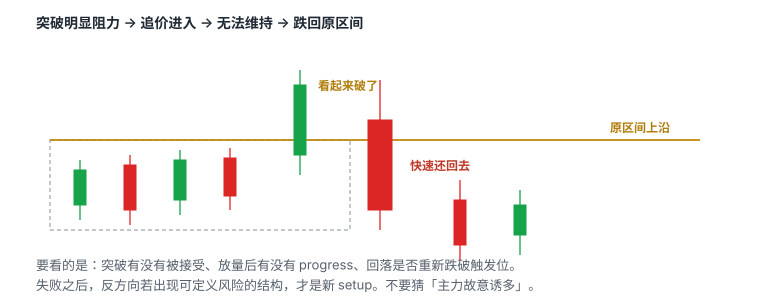

Bull trap：

1. 价格突破明显阻力；
2. 追价买盘进入；
3. 价格无法维持，快速跌回原区间；
4. 被套多头止损进一步增加卖压。

Bear trap 是反向结构。

关键不是猜「主力故意诱多」，而是观察：

- 突破是否被接受；
- 成交量增加后价格是否有 progress；
- 回落是否重新跌破触发位；
- 失败后反方向是否出现可定义风险的 setup。

## 2.3.15 第一次与后续 Pullback

课程偏好第一、第二次回撤，警惕第三次以后。逻辑是：早期动量尚新；后续买方可能逐渐耗尽；趋势离 VWAP 和基础支撑越来越远；高位持仓和获利盘增加。

但「第几次」必须按固定周期和固定 reset 规则计数。跨 1 分钟、5 分钟混着数会让统计没有意义。1 分钟可能已经是第三次小回撤，5 分钟仍只是一根扩张 K。不要把第二、第三次和第一笔丢进同一个统计桶。

## 2.3.16 High-volume false breakout

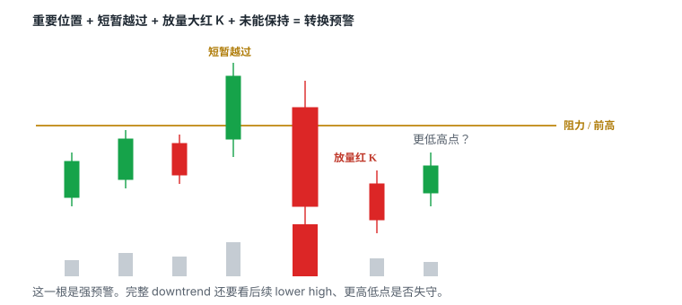

Uptrend 转成 Downtrend 可以很快。常见触发包括：到达事前画好的 resistance；在重要位置出现 shooting star 或冲高失败；出现 **High-volume false breakout**；Long buyers 失去信心并离场；Short sellers 同时开始进场。

High-volume false breakout 的核心组合：

1. 出现在重要位置附近；
2. 价格短暂突破；
3. 紧接着出现一根明显的大红 K；
4. 该红 K 成交量显著放大；
5. 突破未能保持。

这一根红 K 是强预警，不是完整 downtrend 本身。真正的转换确认仍需后续形成 lower high、跌破 higher low。

市场参与者的连锁反应：突破买入者发现判断错误，开始止损；其他 long buyers 暂停进场；Short sellers 把失败突破当成做空信号；向上需求减少，主动卖单增加；趋势可能从 HH / HL 转成 LH / LL。

如何确认不是普通 Pullback：

- 前一重要 higher low 是否失守；
- 反弹是否无法回到 high，形成 lower high；
- 回落量是否大、反弹量是否小；
- 阻力上方是否无法保持；
- 时间框架更大的结构是否也开始破坏。

Daily EMA、Historical Resistance、whole / half dollar 应提前画好。价格到达这些区域时，多头准备止盈，空头开始寻找确认。若第一条阻力突破，则看下一条，不要强行猜顶。

## 2.3.17 Downtrend 如何转成 Uptrend

这一方向通常更慢、更难。原因是 downtrend 已经赶走许多买家，新买家不会凭空同时出现。直接 V 型反转不是默认情景——除非股票非常热门、成交量极大或停牌后重新引入大量关注。短暂反弹也可能只是 lower high。

先找潜在支撑：whole / half dollar、VWAP、EMA 100 / EMA 200、前一明确 low、预期中的 higher low。这些均线周期是课程模板，标成启发式。第一个支撑反弹后如果继续创新低，反转判断就失败。只有后续低点抬高并突破前一个 lower high，uptrend 才逐步建立。

通常需要 Consolidation：

1. 股票先进入 downtrend；
2. 在支撑或已经回撤一大段后停止下跌；
3. 价格开始横盘，量能降低；
4. Short sellers 继续在区间中建立仓位；
5. 但价格迟迟不再创新低；
6. 空头耐心下降、风险累积；
7. 向上突破区间时触发 cover；
8. Short squeeze 帮助建立新 uptrend。

「已经横盘」本身不是做多信号。价格也可能向下破位。

较容易出现这种反转的候选条件（不是买入信号）：

- 借股便宜或 easy-to-borrow，空头参与者多；
- 开盘后曾经向上突破，仍有较高关注度；
- Downtrend 没有持续太久；
- 回落到 VWAP、EMA 100 等支撑；
- 或回吐前面涨幅约一半后开始 consolidation；
- 横盘时不再继续破低。

## 2.3.18 为什么不提前做 Downtrend → Uptrend

横盘时成交量小，price action 比较 choppy，支撑并不会立刻产生大反弹，可能等待 10–30 分钟才知道方向。Level 2 大单更少。大仓位止损时缺少买家承接，slippage 更严重。

事后看「两个低点都是好买点」很容易，实时中第二个低点也可能继续下破。成功案例不能用于估计胜率，因为你看不见所有失败横盘。

同样是 10,000 股：高量的顶部 short 后快速下跌，可能几十秒内获得方向确认；低量区间内 dip buy，若破位卖出，10,000 股可能向下连续成交，平均离场价明显差于计划。

因此更稳妥的倾向是：

1. 不预测最低点；
2. 等 consolidation 明确向上突破；
3. 等成交量从低迷水平明显增加；
4. 再考虑跟随，而不是在最低量阶段埋伏。

「等成交量从约 100k / 分钟增加到更高水平」是讲师的启发式过滤，换股票、换年份会失效。写成你自己的相对量条件，用样本验证。

## 2.3.19 HOD 附近的决定

价格沿更高低点接近当日最高，说明多头仍在推进。越靠近 HOD 买入，确认更强，但失败时回撤也可能更快。应提前决定：做突破、等突破回踩，还是因空间不足放弃。

小周期上的漂亮突破若正撞到大周期高点，实际空间可能很小。同一水平位在早盘高量与午间低量时段的意义不同。

## 2.3.20 把 1 分钟结构放回大图

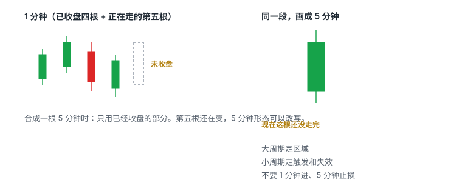

远景能看出早盘高点、午间低量整理和后续再启动。多周期共振不是「指标越多越好」，而是各周期对同一个风险位置没有明显冲突。

| 周期 | 主要问题 |
|---|---|
| 日线 | 上方历史套牢 / 突破空间在哪里？ |
| 5 分钟 | 当天是上升、下降还是宽幅震荡？是第一次有序回撤，还是已经多次延伸？ |
| 1 分钟 | 触发与最近失效位在哪里？是否过度延伸，有没有清晰 micro pullback？ |
| Level 2 / T&S | 当前是否具备可接受的执行条件？ |

一个具体检查法：

1. **日线**：上方最近阻力和潜在空间；
2. **5 分钟**：当前是第一次有序回撤，还是已经多次延伸；
3. **1 分钟**：触发是否过度延伸，是否有清晰 micro pullback；
4. **Tape / Level 2**：点差、成交速度和拒绝位置；
5. **订单计划**：哪个周期的 low 是真正失效点。

一笔交易只能有一个主风险周期。如果以 5 分钟 low 为止损，却按 1 分钟很窄风险计算仓位，实际损失会被低估。多个周期不是投票。不要说「1 分钟破了但 5 分钟还没破，所以止损可以先不动」。

讲师的实际偏好（启发式）：超短和短线仓位主要关注约 15–30 分钟的局部趋势；计划持有更久，同时查看更大的 time frame。不要被单一图表缩放程度困住。

## 2.3.21 从失败结构中学习

左侧冲高失败后出现大幅回落，旧多头结构已经结束。底部横盘形成新的交易区间，后续突破属于新 setup，不能沿用原 stop 和原叙事。图中最后上涨很醒目，但实时应先经历「是否能守住底部」的不确定阶段。

## 2.3.22 一套可复现的读图流程

1. 隐藏后续 K 线，防止看到结果；
2. 在日线标出最重要的两三层区域；
3. 在 5 分钟图判断当前趋势；
4. 在 1 分钟图只画最近有效支撑和阻力；
5. 写出两种路径：突破怎样处理，跌破怎样处理；
6. 每形成一个新高 / 新低就检查地图是否需要更新；
7. 保存入场前、入场后和退出后三张图，比较决策而非只看盈亏。

趋势识别的逐步流程可以压成六步：选定与持仓计划一致的 time frame → 只标真正的 swing points → 写出 HH / HL 或 LL / LH 或 consolidation，混乱时写「无清楚趋势」→ 加入成交量 → 标阻力与支撑 → 定义转换确认，不要只写「感觉会反转」。

例如：

- Up → Down：重要阻力假突破 + 大量红 K + 跌破 higher low；
- Down → Up：停止创新低 + consolidation + higher low + 放量突破区间。

## 2.3.23 形态记录模板

```text
symbol:
date/time:
market session:
catalyst:
daily context:
primary timeframe:
setup:
trigger:
expected entry:
invalidation:
per-share risk:
max dollar risk:
share size:
first/second target:
spread/slippage:
reason to skip:
actual fills:
```

复盘趋势时再加：观察 time frame、计划持仓时间、当前结构（HH / HL / LL / LH）、量能变化、潜在转换信号、确认条件、失效条件、实际结果。

## 2.3.24 常见错误

1. 用一根 K 线定义趋势；
2. 把大 uptrend 中的 pullback 当成完整 downtrend；
3. 只因价格跌很多就 dip buy；
4. 在低量 consolidation 使用过大仓位；
5. 忽略成交量与流动性造成的离场困难；
6. Resistance 到达前过早猜顶；
7. 把所有反弹都当作 downtrend 已结束；
8. 先持仓，再随意更换 time frame 为亏损找理由；
9. 把 VWAP 突破、HOD 突破、flat top 当成三个必须同时满足的圣杯；
10. 大阳线中途市价追。

## 先记住这些

- 形态只负责提出假设；接受、成交量、执行成本和失效点才决定它是不是一笔交易。
- 趋势看摆动点序列，标签必须带时间范围。
- 一笔交易只能有一个主风险周期。
- 第一根创新高只说明短线重新向上，不是整段旗形已确认。
- Uptrend 转弱可以很快；Downtrend 真正反转通常要先停止创新低、经历横盘，再以放量突破证明买家回来了。

## 不要做的事

- 跨 1 分钟和 5 分钟混着数「第几次回撤」。
- 在低量横盘里用大仓位赌 V 型反转。
- 看见三个凸起就按头肩测量目标下单。
- 用 RSI 超买或「已经涨很多」当空单理由。
- 突破失败后沿用原来的叙事和原来的止损。
