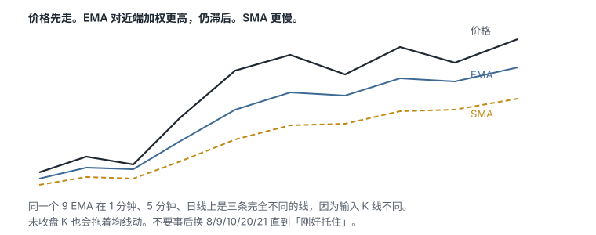
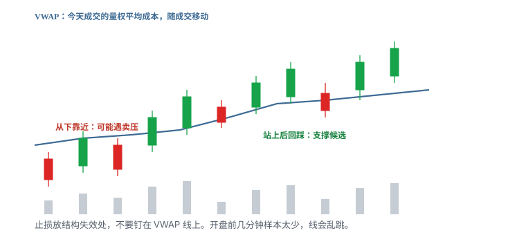
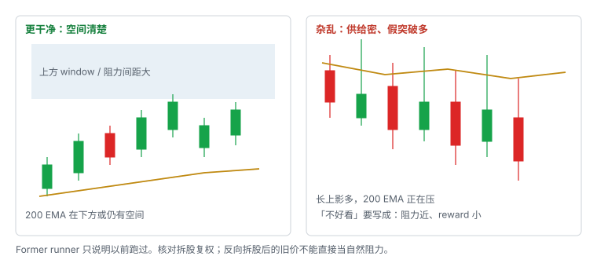
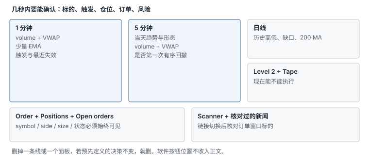

# 2.4 成交量、VWAP 与指标

> 一句话：指标是已经发生的价格的函数；VWAP 是当天的量权平均成本，不是买卖指令。

前三章已经能画出区域、形状和触发。这一章处理叠在图上的数字：成交量、均线、VWAP、MACD、RSI。它们都不能单独给出答案。日线「干不干净」和工作区怎么排，也放在这里——不是因为它们是指标，而是因为它们决定你到底看不看得清前三章。

## 2.4.1 指标是价格数据的变换，不是额外的真相

同时添加 RSI、RMI、Bollinger Bands、MACD 和 Stochastic 之后，图会看起来很忙。问题不是这些工具「无效」，而是它们常用同一套 OHLC 计算，容易重复计票：

- 价格上涨使短均线向上；
- 同一上涨又使 MACD 变强；
- RSI 同时进入高位；
- 三个提示看似独立，实际来自同一个价格动作。

使用指标前先写清：

- 输入数据与时段；
- 参数；
- 信号发生在盘中还是收盘；
- 它是过滤器、触发器还是退出参考；
- 对实际结果增加了什么信息。

如果一张图已经有价格、成交量、VWAP，再叠一堆振荡器，通常是在给同一信息找心理安慰。宁可少。删掉一条线以后，若预先定义的决策不会明显变差，就删。

课程里的 9 / 20 / 100 / 200 EMA、RSI 的 14 和 70 / 30、MACD 的 12 / 26 / 9，全部标成启发式。换一组数字，线会挪地方，历史图形看起来也会「更准」——那是拟合，不是发现。不要事后轮流尝试 8、9、10、20、21、50，直到找到「刚好托住」的那条线。

## 2.4.2 成交量问三个问题


每根量柱对应同一时间窗里的成交股数。颜色通常跟着 K 线走，**不等于**这些成交都由「买方主动」或「卖方主动」发起。每一笔成交同时有买卖双方。红量柱不表示该周期每一股都是主动卖出，绿量柱也不表示全是主动买入。

成交量回答「有多少股成交」，不直接回答：

- 有多少独立交易者；
- 买方是否比卖方多；
- 主动买 / 卖的完整比例；
- 可见挂单是否真实；
- 未来是否继续有流动性。

看量时问三个问题：

1. 和前几根比，是扩张还是萎缩？
2. 和这只股票平时同一时段比，是否异常？
3. 放量之后价格有没有推进？还是成交很多却走不动（吸收 / 分配）？

比较时使用一致基准：同一股票历史同期、同一日内时间、突破与回撤对照。还要看突破价附近实际成交速度、点差与可见深度、突破后能否维持，而不只是瞬间打印。

突破没有新增量能，后续跟随可能不足。但放量也可能是顶部换手或恐慌出逃。量是上下文，不是许可。高量但价格不再上涨，不能只把高量视作确认。

整理区里量能逐步萎缩，是很多突破 setup 的**配料**，不是充分条件。量缩回撤的解释是抛压可能较轻；它仍可能只是买方消失。

## 2.4.3 SMA 与 EMA



简单移动平均：

```
SMA(n) = 最近 n 个周期收盘价之和 ÷ n
```

指数移动平均给近期价格更高权重，递推形式为：

```
EMA(today) = α × Price(today) + (1 − α) × EMA(previous)
```

其中 `α = 2 / (n + 1)`。

EMA 比简单均线跟得稍紧，**仍然滞后**。价格碰到均线后有没有反应，才是事实。

同一个 `9 EMA` 在 1 分钟、5 分钟和日线上完全不同，因为每个周期的输入 K 线不同。EMA 也会随着当前未收盘 K 线变化。`Price Source = Close` 与 typical price 会得到不同数值。`Bars Offset` 应保持明确：正负偏移可能把线视觉上挪到未来或过去，造成误读。

课程主要使用：

- 9 EMA：很短的盘中动量参考；
- 20 EMA：稍慢的短期趋势；
- 100 / 200 EMA：更长周期的位置参考。

这些参数受欢迎不等于自然法则。日线均线在进阶课里常被当成动态阻力。用法仍然是：把它当一层位置，等小周期给出触发和失效，而不是均线一碰就空。

均线回踩已经在第三章写过：失效点放在价格结构，而不只是均线下方一分钱。价格不是第一次触碰就直接盲买。

## 2.4.4 VWAP 是什么



会话 VWAP（Volume Weighted Average Price）：

```
VWAP = Σ(成交价 × 成交量) ÷ Σ(成交量)
```

价格输入可能是成交价，也可能是 K 线 typical price，取决于平台。它回答：到目前为止，今天成交的平均成本大概在哪。机构常用它衡量执行优劣，所以它附近容易有反应——这是行为叠加，不是魔法。Volume weighting 只是计算差异，不保证比任何均线更能预测价格。VWAP 看不见隐藏意图。

平台差异你必须知道：

- session 从何时开始；
- 是否含盘前；
- 用 tick、trade 还是 bar 近似；
- 公司行动如何调整；
- 数据源；
- 何时重置；
- 锚定 VWAP（anchored VWAP）是否另算；
- 多日图是否每天 reset。

不同软件的数值可以不一致。出现几分钱差异时，先核对上述各项，不要假定某一家「算错」。实际下单价位以你下单时使用的数据为准。

常见描述：

- 价格在 VWAP 上方：当前价高于当日量加权均价；
- 在下方：当前价低于均价；
- 来回穿越：市场可能没有明确方向。

「上方就是强、下方就是弱」是描述，不是买卖规则。高位价格可远离 VWAP 后继续上涨，也可能均值回归；低位同理。「价格在 VWAP 上方」不自动等于做多。

## 2.4.5 位置角色取决于你怎么接近它

- 从下往上靠近，可能遇到卖压；
- 站上之后回踩，可能变成支撑候选；
- 从上往下靠近，可能遇到买盘；
- 失守之后反抽，可能变成阻力候选。

止损不要设在「VWAP 本身」，设在结构失效处。VWAP 是位置，不是形状。

开盘前几分钟样本很少，VWAP 会乱跳，不能当稳定均衡。开盘附近 first cross 噪声高：spread 和波动大，催化还在重新定价。午后 VWAP 更稳定，但量往往更低；多次穿越可能只是区间；收盘附近的 flow 会再改一次。同一规则不能默认跨时段有效。

## 2.4.6 四种 VWAP 用法（每种单独统计）

大盘股课里常见四种写法。每一种是独立 setup，不要混在一个桶里回测。

| 用法 | 语境 | 触发（示例） | 失效 |
|---|---|---|---|
| Bounce | 强势回踩 | VWAP 有反应且出现更高低点 | 在 VWAP 下方被接受 |
| Reclaim / pop | 从下收回 | 收回并站稳 | 跌回并破微结构低点 |
| Rejection / fade | 弱势反抽 | 更低高点 / 破微结构低点 | 在 VWAP 上方被接受 |
| Break-and-retest | 趋势转换 | 突破后再回踩 | 回踩失败 |

「VWAP pop」如果入场已经离 VWAP 很远，把止损放到 VWAP 上会让单笔风险过大。Pop 的触发应定义为 reclaim、first pullback 或 break micro high，不要事后三者任选。

比「碰线」更强的观察：

- 回撤到 VWAP 时 volume 收缩；
- 出现 rejection wick 后破 high；
- Level 2 / prints 显示实际成交但价格不再下行；
- retest 守住；
- 大盘 / 板块同向；
- 上方有足够空间。

这些信号彼此相关，仍需长期样本。风险是否更小，取决于 stop distance、结构和执行，不取决于线叫 VWAP。

### 三种止损设计

1. VWAP 另一侧固定 buffer；
2. 最近 swing low / high；
3. acceptance stop：在另一侧保持 N 根 K。

固定 buffer 简单但不适应波动；swing stop 结构合理但可能较远；acceptance stop 减少 wick 止损却增加平均损失。用 MAE 分布比较，不要口头觉得哪一种「更安全」。

### 常见失败

- VWAP 横向、价格反复穿越；
- 开盘 first cross；
- 重大 news 直接重估；
- 大盘与板块强烈反向；
- 假 reclaim 后立即 flush；
- entry 离 VWAP 太远；
- 把亏损的多单扛到「等 VWAP」当成 swing；
- 把 anchored VWAP 与 session VWAP 混淆。

日志至少记下：setup 类型、session 起点与配置、一天中的时点、入场距 VWAP 的距离、VWAP 斜率、此前穿越次数、相对成交量、大盘 / 板块、触发与止损、被接受的时间、MFE / MAE、费用与滑点。

## 2.4.7 MACD

经典 MACD：

```
MACD line = EMA(12) − EMA(26)
Signal line = MACD line 的 EMA(9)
Histogram = MACD line − Signal line
```

它反映两条均线之差及其变化，必然落后于快速价格动作。交叉发生时，价格运动已经发生了。快线上穿慢线不等于必须买入。横盘和剧烈震荡时会频繁给出假信号。需要趋势、波动和位置过滤。

如果价格已经接近强阻力，MACD 看多也不能消除上方供给。它不能单独消掉你在日线上已经标出的那一层。

## 2.4.8 RSI

经典 RSI 以一段周期内平均涨幅与平均跌幅计算，常见默认参数为 14，范围 0–100。70 / 30 常被标为 overbought / oversold，只是常见刻度。

注意：

- overbought 不等于立即做空；
- 强趋势中 RSI 可长时间处于高位；
- 参数和周期改变会显著改变信号；
- RSI 低可能来自持续弱势，而非「便宜」；
- 背离只有在事先定义 swing 后才能客观测试。

课程讲者介绍但不使用 RSI。正确做法不是因此排除 RSI，而是只有在它对明确策略带来可测的增量后才保留。超买不是必须下跌，超卖不是必须反弹。

## 2.4.9 可以不看振荡器

MACD 和 RSI 放在这里，是因为基础课会点名。不是因为你必须把它们加进模板。如果它们不能改变你事先写好的触发和失效，它们就是装饰。

指标互相矛盾时再加一个指标来「投票」，是在给同一价格动作找心理安慰。宁可回到价格、成交量、VWAP 和你画的那几层区域。

## 2.4.10 Strong Daily Chart 的含义



课程偏好的「强日线」不是公司质量评级，而是适合其小盘动量策略的结构：

- 当前价在 200 EMA 上方，或到 200 EMA 仍有足够空间；
- 上方历史阻力较少、间距清晰；
- 有较大的 gap / window；
- 过去曾在高量下持续上涨，即 former runner；
- 最近不是连续「冲高长上影后回落」；
- 当前触发位到第一阻力仍有合理 reward。

Former runner 只能说明历史上跑过，不能保证下次重复。历史高位留下的持仓者可能在反弹时卖出，形成 overhead supply。比较时要核对拆股复权；低价股多次 reverse split 后的旧价格不能直接当自然阻力。

Former runner 是筛选变量，不应成为结果标签。要避免只记得后来大涨的股票，而忽略大量「以前跑过、后来没跑」的样本。

## 2.4.11 弱或杂乱的日线

警惕这些结构：

- 当前价正顶在 200 EMA；
- 每次 spike 都收成长上影；
- 最近刚有大批买家在更高价被套；
- 历史价格因反向拆股而失真；
- 上方每几分钱都有转折；
- gap 已几乎填完，第一目标就在眼前。

价格长期处在下倾的长周期均线下方，历史反弹多次失败，图上有许多重叠 K 线和长上影——上方潜在供应难以简化成一个清晰目标。最右侧突然放量上涨仍可能形成日内机会，但日线背景要求更保守的目标和仓位。

「图不好看」要翻译成具体原因：上方阻力近、reward 小、假突破历史多，而不是凭审美否决。

## 2.4.12 日线筛选打分

可以用简单记录代替主观「强 / 弱」：

| 项目 | 0 | 1 | 2 |
|---|---|---|---|
| 到第一阻力空间 | 小于风险 | 约 1–2R | 大于 2R |
| 200 MA | 正在压制 | 仍有空间 | 已站上且确认 |
| 历史延续 | 多次失败 | 混合 | 多次有量延续 |
| Overhead supply | 密集 | 中等 | 稀少 |
| 当前成交量 | 弱 | 一般 | 明显异常 |

这个分数只是保持一致性的工具。真正结果仍需统计，不要随意调权重。分数高不是买入许可；它只减少「每天凭心情换标准」。

## 2.4.13 工作区只保留决策必需信息



软件名称、菜单路径和窗口皮肤过时很快，本书不收按钮教程。保留的是结构：几秒内要能确认标的、触发、仓位、订单与风险。

通常需要同时看见：

- 1 分钟图；
- 5 分钟图；
- 日线；
- volume；
- VWAP；
- 少量固定均线；
- Level 2 / order entry；
- Time & Sales；
- 新闻和 scanner；
- positions / open orders / risk controls。

功能齐全不等于工作流清晰。多个浮动窗口互相遮挡时，你看不清 symbol、side、size、price 和 order status。与当前策略无关的面板会占用屏幕和注意力，也可能增加 CPU、内存和数据带宽。任何 linked window 都应在模拟环境测试，避免图表已切换但订单窗口仍停留在另一股票。

课程讲者自己的软件操作也有找不到设置、误删指标等情况，所以模板保存和开盘前检查很重要。

### 平台无关的设置步骤

1. 选择行情时区和 regular / extended-hours；
2. 确认 K 线复权方式；
3. 建立 1 分钟、5 分钟、日线模板；
4. 统一颜色：9、20、200 EMA 与 VWAP 不冲突；
5. 把 volume 独立显示，避免遮挡价格；
6. 链接 symbol，但保留明显的订单窗口 symbol；
7. 保存模板并重启验证；
8. 用模拟账户测试 market / limit、cancel、flatten；
9. 人为断网或关闭一个模块，验证备用退出流程；
10. 开盘前检查时间、行情延迟和账户环境。

### 性能和故障风险

同时跑多套图表会卡。真实交易前要测：

- CPU / memory 峰值；
- 多屏和高频刷新下的延迟；
- 行情断线如何提示；
- 软件是否自动重连；
- open orders 是否仍在券商端；
- 快捷键焦点落错窗口时会发生什么；
- 备用网页或电话平仓渠道。

10 秒或 tick 图的更新量很大。如果它不改善已验证的决策，就不值得为了「看得更细」牺牲稳定性。

### 最小模板

```text
左：1-minute + volume + VWAP + 9/20 EMA
中：5-minute + volume + VWAP + 9/20/200 EMA
右上：daily + volume + 200 MA + 手工水平
右中：Level 2 + Time & Sales
右下：order entry + positions + open orders
侧边：scanner + verified news
```

指标越少，越需要清楚每一条线为什么存在。最终保留标准是：**删掉它以后，是否会让预先定义的决策明显变差？如果不会，就删。**

均线颜色只是可读性设置。线越醒目不代表重要性越高。

## 2.4.14 实用读图顺序（把指标放回原位）

每次打开股票，仍然按第一章的顺序。指标只插在第四步：

1. 日线：历史高低、缺口、长期均线、到第一阻力的空间（用第 10–12 节的打分，不要用「好看」）；
2. 5 分钟：当天主趋势、重要平台和量能变化；
3. 1 分钟：入场触发、最近失效位置；
4. VWAP / EMA：只作为参考位置，不替代价格行为；
5. 检查当前 K 线是否已经收盘；
6. 写出如果判断错误在哪里退出。

量能变化嵌在第 2、3 步里一起看，不要单独开一张「量能图」来投票。

## 2.4.15 本课最容易误用的地方

- 指标越多不代表确认越强；多个指标可能都由同一价格数据计算。
- 颜色、参数和计算时段可能因平台不同而变化。
- 「价格在 VWAP 上方」只是描述，不自动等于做多。
- 开盘三分钟的 VWAP 不是铁支撑。
- RSI 超买不是空单理由。
- 高量不是许可；走不动的高量是吸收。
- 日线「曾经跑过」不是今天会再跑的证据。

## 先记住这些

- 量要比较：刚才、平时、有没有推进。
- VWAP 是量权平均成本，角色随接近方向变。
- 均线和振荡器滞后；参数不是科学常数。
- 日线质量写成空间、供给和相对量，不要写成审美。
- 工作区以决策速度为准，不以功能多少为准。

## 不要做的事

- 把 RSI 超买当空单理由。
- 开盘三分钟就用 VWAP 当铁支撑。
- 指标互相矛盾时再加一个指标来「投票」。
- 事后换均线周期，直到历史图「刚好托住」。
- 入场已经远离 VWAP，还把止损钉回 VWAP。
- 把 session VWAP 和 anchored VWAP 当成同一条线。
