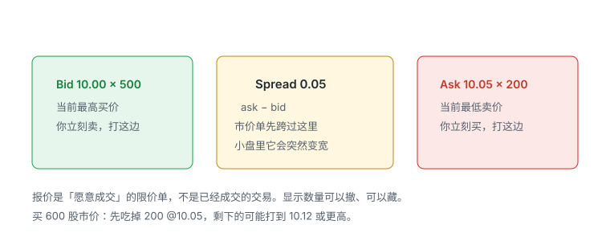
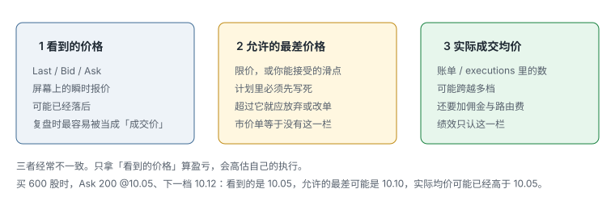
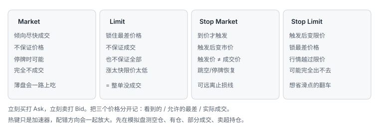
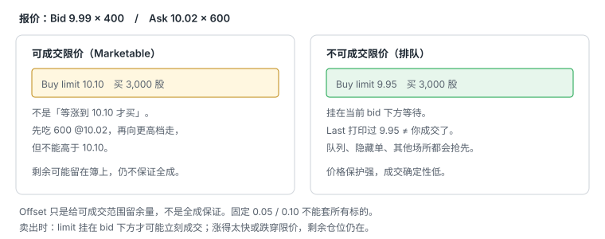

# 3.2 订单类型

> 一句话：市价单保执行不保价格；限价单保最差价格不保成交；Stop 价不是成交价。没有一种订单同时保证两件事。

下单不是「按买入键」。你提交的是一组约束：代码、方向、股数、订单类型、限价或止损价、路由、有效期、常规时段还是扩展时段、账户。字段写错，往往比方向判断错更危险。

报价那一章把 Bid、Ask、点差和 Level 1 读完。这一章只讲五种订单：**Market、Limit、可成交限价（Marketable limit）、Stop Market、Stop Limit**。每一种真正保证什么、不保证什么，必须能在下单前用一句话说出来。数字例子用同一本 600 股的簿，把「屏幕上看到的价」和「账单上的均价」拆开。

盘口深度怎么读、热键怎么加速、停牌细则怎么处理，都不在本章。这里先把没有 Level 2 也能成立的执行规则写死。

官方基础说明见 [SEC：Trading Basics](https://www.sec.gov/file/trading101basicspdf) 与 [SEC：Stop Order](https://www.sec.gov/answers/stopord.htm)。券商用 last sale 还是 quotation 判断 stop 是否触发，可能不同；盘前盘后、暂停和特定路由支持的订单类型也可能不同。课程界面里的行为不是通用法。

## 3.2.1 这一章只解决一个取舍

核心取舍不可消除：

```
价格保护更强  ↔  成交确定性更低
```

想马上成交，就必须接受当时对手盘给出的价格，可能跨越多档。想锁住最差价格，就必须接受：可能只成交一部分，也可能整单不成交。

不存在第三种订单，能同时保证：

- 一定成交；
- 一定全部成交；
- 成交价一定等于你屏幕上看到的那个数。

很多人用「再加一种订单」逃避这个取舍：用市价追求确定，用限价追求价格，用 stop-limit「既要出去又要好价钱」。最后一种是本章最常见的翻车。Stop-limit 并没有打破取舍，它只是把「不成交」藏到你最需要出去的时候。

课程说「多数日内交易者不用 market order」不能泛化。高流动性产品、紧急减仓或某些自动策略仍会使用。关键是预估市场冲击，而不是按身份决定订单类型。

## 3.2.2 订单是一组约束，不是一个按钮

一笔订单至少包含：

- symbol；
- side（Buy / Sell / Short / Cover）；
- quantity；
- order type；
- limit / stop price（如需要）；
- route / destination；
- time in force；
- regular 或 extended hours；
- account。

熟练度应先在模拟环境里形成，不能用真钱订单来测试按钮。屏幕布局复杂时，先确认 symbol 和账户，再确认方向、数量、价格和未成交订单。

本章不写任何平台脚本、热键命令或路由代码。那些东西随券商、软件版本和账户权限变化。把某套课程里的命令贴进真实账户，不是执行，是把别人的历史配置当成自己的风险。

Time in force、路由、扩展时段会改变「这张单还在不在、去了哪里」。它们不改变五种订单类型各自保证什么。DAY 还是 IOC，不能把市价单变成有价格上限的单，也不能把限价单变成一定成交的单。

## 3.2.3 立刻买打 Ask，立刻卖打 Bid



| 词 | 是什么 | 立刻成交时你碰到的一侧 |
|---|---|---|
| Bid | 当前公开报价里最高的买价 | 你立刻卖，打这边 |
| Ask / Offer | 当前公开报价里最低的卖价 | 你立刻买，打这边 |
| Best bid | 所有可见买价里最高的那一档 | 卖出的第一档对手盘 |
| Best ask | 所有可见卖价里最低的那一档 | 买入的第一档对手盘 |
| Spread | ask − bid | 市价单先跨过的距离 |

报价是挂着的限价意愿，不是已经完成的交易。显示数量只是公开部分：隐藏单、其他市场、随时撤单，都不在一个画面里。

基本关系：

```
Quoted spread = Best ask − Best bid
```

若买在 ask、立刻卖在 bid，即使市场价格一步都没动，你也先承担一个点差。这不是「被骗了」，这是立刻成交的价格。复盘时把这一格当成执行成本，不要把它记成「策略判断错了」。

小盘股的点差可以在几秒内拉宽。点差宽 = 市价单立刻付出的成本高。仓位越大，还可能扫到下一档，实际成本更高。Ask 上只显示 200 股，不代表市场只能卖 200 股，也不代表这 200 股会等你到。

挂单簿上全是限价单。上方看起来「稀薄」，是因为没有人在那些价位挂卖单，**不是因为没有买方**。买方如果愿意立刻成交，会去打 Ask，而不是在空白价位上变出一堵墙。

## 3.2.4 三个必须分开的价格



每一笔都要分开记三栏：

- **看到的价格**：屏幕上的 last / bid / ask。它是瞬时报价，快速行情里可能已经落后。
- **允许的最差价格**：你的限价，或你事先写好的可接受滑点。超过它，这笔单就不该按原计划继续。
- **实际成交均价**：最后填进账单、executions 窗口里的数。可能跨越多档，还要加佣金和路由费。

三者经常不一致。复盘时只看「看到的价格」会高估自己的执行。绩效只认第三栏。

Last 可能落后于正在变化的 bid/ask。只按 last 去设限价，常见结果是：你以为自己挂在「现价附近」，实际已经离开 inside market 好几档。

市价单等于没有第二栏。你没有事先写下允许的最差价格，市场会用当时能成交的所有档来填这一栏。Stop 的触发价也不是第二栏，更不是第三栏。触发价只回答「要不要把订单变成市价或限价」，不回答「最后均价是多少」。

计划入场价应是 **expected average fill**，不是 top-of-book 的 ask。把 Ask 10.05 写进日志当入场，再拿 10.05 算盈亏，等于用第一栏冒充第三栏。

## 3.2.5 五种订单各自保证什么、不保证什么



先把保证写死，再看例子。可成交限价不是第五种神秘订单，它是限价单里**已经能立刻碰到对手盘**的那一类。

| 类型 | 保证什么 | 不保证什么 | 典型翻车 |
|---|---|---|---|
| Market | 执行优先级：按当时可成交的对手盘依次撮合 | 成交价、全部同价、一定成交 | 薄盘一路上吃；停牌或无对手盘时仍不成交 |
| Limit | 最差价格：买不高于限价，卖不低于限价 | 成交、全部成交 | 涨太快限价太低，整单没成交 |
| Marketable limit | 仍是限价：立刻吃对手盘，但不超过限价 | 全成、均价等于你看到的 ask | 当成「等涨到限价才买」；offset 太大近似市价 |
| Stop Market | 到价才触发；触发后变市价，倾向尽快退出或进场 | 触发价 = 成交价 | 跳空或停牌恢复后远离止损线 |
| Stop Limit | 到价才触发；触发后变限价，锁最差价格 | 一定能出去 | 行情越过限价，单子还挂着，你还在仓里 |

读表的方法：每一行只承诺一列。把「保证什么」那一列没有写上的事，当成默认不保证。

「点了就一定成交」对市价单也不成立。交易暂停、无对手盘、市场拒单或技术故障都可能阻止成交。停牌或极端波动中，市价单可能等到恢复后才执行，价格可与下单时相差很大。

## 3.2.6 市价单：保执行优先级，不保价格

市价单优先追求执行，不承诺具体成交价格。它会和当时可用的对手盘依次成交。买入市价单打 ask 一侧，卖出市价单打 bid 一侧。实际平均价取决于：

- 点差；
- 每档可成交数量；
- 市场移动速度；
- 路由和延迟；
- 是否处于停复牌或开盘；
- 订单大小相对深度。

「立即」不等于零延迟，也不等于整笔同价成交。大订单可能扫过多个价位。Ask 薄时，买单会向更高档连续吃，均价恶化。这不是平台「滑点 bug」，这是市价单的定义。

市价单没有第二栏。你在屏幕上看到 Ask 10.05，只是第一栏。账单上的均价是第三栏。中间那一跳，由深度和撤单决定。

市价单保护的是执行优先级，不是价格。它适合：你已经接受「现在必须成交」，并且仓位小到即使扫一档也仍在风险预算内。它不适合：点差已经很宽、可见深度远小于股数、你还把 last 或 best ask 当成成交价。

紧急减仓时用市价，仍然要先问：这笔仓位当初是不是就不该大到必须无价格保护地逃。市价能加快退出，不能把选股和仓位错误补回来。

## 3.2.7 教学例子：买 600 股

后面所有计算都用同一本簿。先把它背熟。

假设报价为：

- Bid：10.00 × 500 股
- Ask：10.05 × 200 股
- 下一档 Ask：10.12 × 1,000 股

点差是 0.05。你要买 600 股。屏幕上最显眼的买入价是 10.05，但 10.05 这一档只有 200 股。

若提交**买入市价 600 股**，并且簿在订单到达时仍然如此、中间没有人撤单：

```
200 × 10.05 = 2,010
400 × 10.12 = 4,048
合计 6,058
均价 = 6,058 / 600 ≈ 10.0967
```

三栏分别是：

| 栏 | 这个例子里的数 |
|---|---|
| 看到的价格 | Ask 10.05 |
| 允许的最差价格 | 市价单没有这一栏 |
| 实际成交均价 | 约 10.0967（还没加佣金和路由费） |

你若在日志里把入场写成 10.05，每股少记了约 0.047，600 股约 28 美元。数字不大，但是同一错误在 5,000 股、更薄的下一档上会放大。绩效只认 10.0967 这一栏。

若 10.05 的 200 股在你的订单到达前消失，市价单可能整笔从 10.12 开始吃。看到的还是「刚才的 10.05」，实际均价直接变成 10.12 或更高。

若提交**买入限价 10.05**：

- 成交价不能高于 10.05；
- 最多吃掉当时仍在 10.05 的卖单；
- 剩余 400 股可能不成交。

你得到的不是「600 股 @ 10.05」，更可能是「200 股 @ 10.05，400 股还在外面」。仓位计划若按 600 股算风险，实际仓位已经对不上。

若提交**买入限价 10.08**：

- 可以吃 10.05，不能吃 10.12；
- 10.05 的卖单可能在到达前消失；
- 消失之后 ask 变成 10.12，你的 10.08 变成不可成交限价，整单可能挂在簿上。

10.08 看起来「比 10.05 宽松一点」，并不保证比 10.05 更容易全成。它只保证：哪怕成交，也不会差过 10.08。

这就是为什么应把「看到的价格」「允许的最差价格」和「最后的实际成交」分开记录。同一本簿、同一 600 股，三种订单给出三种完全不同的持仓。

## 3.2.8 限价单：锁住最差价格，不锁成交

买入限价单：成交价不能高于 limit。
卖出限价单：成交价不能低于 limit。

它限制最差价格，但不保证成交，也不保证全部成交。

在快速上涨中把买入限价设得太低，可能完全错过。这不等于应该改用无价格保护的市价单。错过一笔和在未知价格成交，是两种不同的风险，不要用同一种情绪处理。

限价单的价格保护是硬的。买限价 10.05，交易所不应让你以 10.12 成交。你若事后发现成交价差过限价，那是需要查券商报告的异常，不是「市价单那种正常滑点」。

限价单的成交是软的。价格打印过你的限价，只说明**有人**在那个价成交了，不说明**你的**订单排到了、对面还有量、你的路由去了那个场所。

卖出限价挂在 ask，是在等买方来打你。价格可能更好，但不保证 fill。买入限价挂在 bid，是在等卖方来打你。两种都是排队，不是「价格到了就轮到我」。

## 3.2.9 可成交限价：不是「等涨到限价才买」



可成交限价（Marketable limit）仍是限价单。差别只在：你的限价已经穿过 inside market，订单到达时通常会立刻与对手盘撮合。

若 ask 为 10.02：

- buy limit 10.10 通常会立即与 10.02 及更高、但不超过 10.10 的卖单撮合；
- 它不是「等价格涨到 10.10 才买」；
- 如果只有 600 股在 10.02，而订单是 3,000 股，剩余部分可能在更高档成交，或留在簿上。

回到 600 股那本簿：Ask 10.05 × 200，下一档 10.12 × 1,000。

- **Buy limit 10.10**：可成交。先吃 200 @ 10.05；10.12 高于 10.10，吃不到。剩余 400 股变成挂在 10.10 的限价，等待。均价若只成交 200 股，是 10.05，但你没有买到计划的 600 股。
- **Buy limit 10.15**：也可成交。200 @ 10.05 + 400 @ 10.12，均价约 10.0967，和市价单在这本静止簿上相同，但多了一道 10.15 的天花板。若下一档突然变成 10.30，市价单会继续吃，10.15 限价不会。

所以可成交限价的正确读法是：**按市价去碰对手盘，直到我的限价为止。** 限价是天花板，不是目标价，更不是「我愿意等到的那个价」。

卖出时镜像成立。Sell limit 设在当前 bid 下方，可以成为 marketable limit，给价格保留一个下界。它会立刻打 bid，并可能继续向下吃，但不低于你的限价。Sell limit 挂在 ask 上，通常不可立刻成交。

「Avoid slippage」这种说法不准确。限价只能给最差价格边界。相对你心里的预期价，仍可能发生滑点。Ask 10.05、限价 10.15、实际均价 10.10，对 10.05 来说已经滑了。保护的是「不要差过 10.15」，不是「成交在 10.05」。

## 3.2.10 不可成交限价：打印过 ≠ 你成交了

不可成交限价（Non-marketable limit）挂在 inside market 这一侧尚未触及的位置，等待市场来找它。

若 bid/ask 为 9.99 / 10.02，buy limit 9.95 会等待市场回落，或卖方主动打到该价。排队位置、隐藏订单和其他场所会影响是否成交。「价格打印过 9.95」也不保证你的订单得到 fill。

回到 600 股例子。Bid 10.00 × 500，Ask 10.05 × 200。Buy limit 9.95：

- 不是可成交单；
- 不会去吃 10.05；
- last 哪怕打印过 9.95，你仍可能排在别人后面，或那笔成交发生在别的场所；
- 600 股可能一直是 0 成交。

把「K 线刺到过」当成「我成交了」，是用第一栏的 last 冒充第三栏的 fill。executions 窗口没有你的成交，就没有成交。图上的刺穿只证明有人的单子成交了。

不可成交限价适合：你愿意等更好的价格，也愿意错过。它不适合：结构已经失效、你必须退出。风险失效时优先退出，不为更好价格继续暴露。

## 3.2.11 Offset 只是容差，不是全成保证

不少平台允许「买在 ask + offset」或「卖在 bid − offset」。这只是在生成一张可成交限价，offset 用来决定限价离 inside market 多远。

使用 offset 的作用是容许一定价格范围，不是保证全成。固定 0.05 或 0.10 美元会随股价、spread 和波动变化，不能用于所有标的。Offset 太小会 miss 或只成交一部分；太大则接近市价单风险。

在 600 股例子里：

| Offset（买在 ask +） | 限价 | 静止簿上大概发生什么 |
|---|---|---|
| 0.00 | 10.05 | 最多 200 股，400 股可能挂着 |
| 0.03 | 10.08 | 能吃 10.05，吃不到 10.12；10.05 撤了可能整单不成交 |
| 0.10 | 10.15 | 200 @ 10.05 + 400 @ 10.12，类似市价，但有天花板 |
| 0.50 | 10.55 | 对这本簿几乎等于市价；若突然出现 10.40 的卖单也会吃 |

没有一个 offset 能同时保证全成和保证均价接近 best ask。你必须按这只股票当时的点差、股数和可见深度选，并在计划里写死「最差均价超过 X 就取消剩余」。

不要把课程热键里的固定 offset 抄到所有标的。2 美元的大盘股和 0.80 美元的小盘，0.10 的含义完全不同。本章不提供任何热键公式。

## 3.2.12 同一本簿，五种订单分别会怎样

继续用：

- Bid：10.00 × 500
- Ask：10.05 × 200
- 下一档 Ask：10.12 × 1,000

**进场：买 600 股。** 假设订单到达时簿仍如此，且没有隐藏卖单。

| 订单 | 第一栏（看到的） | 第二栏（允许最差） | 可能的第三栏 / 持仓 |
|---|---|---|---|
| Market buy 600 | 10.05 | 无 | 约 10.0967，600 股都在（簿不变时） |
| Limit 10.05 | 10.05 | 10.05 | 最多 200 股 @ 10.05，400 股未成 |
| Limit 10.08 | 10.05 | 10.08 | 最多 200 @ 10.05；剩余挂在 10.08 |
| Marketable limit 10.15 | 10.05 | 10.15 | 约 10.0967，600 股都在（簿不变时） |
| Limit 9.95 | 10.05 | 9.95 | 0 股；在等回落 |

把「Market」和「Marketable limit 10.15」在静止簿上对比：均价可以相同。差别出现在簿突然变差的时候。下一档若变成 10.40，市价单继续吃，10.15 限价停在 10.15，剩余不成交。你要事先决定：宁可均价失控，还是宁可仓位不齐。

再加一条现实：订单有延迟。你按下时看到的 10.05 × 200，到达时可能已经是 10.12 × 100。三种限价的第二栏仍在工作，市价单的第二栏仍不存在。延迟不会把市价单变成限价单。

**出场：假设你已经持有 600 股多头，现在要走。** 为了对称，补一档更低的买盘：

- Bid：10.00 × 500
- 下一档 Bid：9.92 × 800
- Ask：10.05 × 200

| 订单 | 保证 | 静止簿上可能发生什么 |
|---|---|---|
| Market sell 600 | 执行优先级 | 500 @ 10.00 + 100 @ 9.92，均价约 9.9867 |
| Sell limit 10.05（挂在 ask） | 不差于 10.05 | 通常排队，可能 0 成交 |
| Sell limit 9.97（bid 下方，可成交） | 不差于 9.97 | 500 @ 10.00；剩余 100 股限价 9.97，吃不到 9.92，可能未成 |
| Sell stop market，触发 9.90 | 到价后变市价 | 现在不会触发；以后触发时按当时 bid 吃 |
| Sell stop limit 9.90 / 9.80 | 到价后变限价 9.80 | 现在不会触发；触发后若 bid 已经低于 9.80，可能出不去 |

Sell limit 9.97 看起来「比市价更稳」，结果可能是：500 股出去了，100 股还在。部分仓位继续暴露。这不是平台故障，这是限价的定义。

## 3.2.13 买、卖、空、平：方向写反比选错类型更致命

同一张限价、同一个 stop，方向不同，含义完全不同。

| 方向 | 市价碰到哪一侧 | 保护性 Stop 通常长什么样 | 限价「更好价格」在哪 |
|---|---|---|---|
| Buy（开多或回补） | Ask | 一般不用卖 stop 来开多；突破买可用 buy stop | 低于 ask 的买限价更便宜，也可能不成交 |
| Sell（平多或开空） | Bid | 多头保护：sell stop | 高于 bid 的卖限价更贵，也可能不成交 |
| Short | Bid | 空头保护：buy stop | 更高的卖限价更有利，成交更不确定 |
| Cover | Ask | 空头保护触发后常变成 buy market / buy limit | 更低的买限价更有利，可能平不掉 |

Buy stop 和 sell stop 不要混。价格向上碰到的是 buy stop（空头止损，或突破追买）。价格向下碰到的是 sell stop（多头止损，或向下突破追卖）。Stop 不是「亏了就平」的自动翻译，它是「某价触及之后生成买或卖」。

画线或下单界面若根据「线在现价上方还是下方」自动选方向，必须自己核对 side。线画错一侧，限价可能变成反向开仓。核对属于热键和画线那一章；本章只要求：写订单时 side 和 order type 分开读。

Short 还有借股、locate、SSR。那些规则不改变「卖出市价打 bid」。它们改变的是你有没有资格卖空、空单会不会被拒。拒单不是滑点，是这张单根本没进市场。

## 3.2.14 退出未成交，本身就是风险

风险计划不能只写 stop price，还要写：

- stop 触发后的订单类型；
- 可接受最大 slippage；
- partial fill 怎么办；
- halt 后如何处理；
- 平台失效时的备用渠道。

卖出 limit 设置在 bid 下方，可以成为 marketable limit，给价格保留一个下界。但快速下跌越过 limit 后：

- 订单可能完全未成交；
- 只成交一部分；
- 剩余持仓继续暴露；
- 你需要 cancel / replace，或使用其他退出方式。

600 股若只卖掉 500，剩下 100 股的止损、目标和风险金额都变了。计划按 600 股写、仓位只剩 100，还用原来的「1R」说话，账是假的。

分批退出可以降低风险、锁定部分盈利、让剩余仓位参与延续。规则必须事先写清，例如三分之一在第一目标、三分之一在下一阻力、三分之一按结构移动。必须测试部分成交之后，剩余仓位的止损数量是否同步。

限价已挂出却重复按买、partial fill 后仍按原股数卖、cancel 未确认就发新单：这些是执行错误，不是策略问题。它们会被热键放大。本章能做的，是让你先承认：未成交和部分成交是订单类型的正常结果，必须写进计划，不能当意外。

赢家与输家不应使用同一份耐心。结构还在、你在等更好价格，可以用不可成交限价。结构坏了，优先退出。为了少亏几分钱把卖限价挂在 ask 上排队，等于用限价单的「不成交」去拒绝承认失效。

## 3.2.15 Stop ≠ fill：触发价不是成交价

Stop 价格通常只是**触发条件**。触发之后才变成市价单或限价单。触发价不是保证成交价。

这句话要拆开读：

1. **触发前**：Stop 还不是一张会立刻撮合的买卖单。价格没碰到触发条件，仓位不会因为这张 stop 而减少。
2. **触发时**：券商或场所根据自己的规则，用 last sale 或 quotation 判断「碰到了」。同一张「stop 9.90」在不同平台上，触发时刻可以差一截。
3. **触发后**：订单变成 Market 或 Limit，此后遵守市价或限价的全部规则——包括市价不保价格、限价不保成交、停牌可能不成交。

所以：Stop ≠ fill。Stop 价被打印、K 线刺过 stop 线、平台把状态改成 triggered，都不等于你已经以 9.90 成交。

图上的 trigger price 不是绩效入场价，也不是绩效出场价。每笔应记录 planned price、average fill 和 worst fill。

「市场参与者能看到个人 stop，并刻意把价格推过去」这种说法过度简化。普通 stop 在触发前是否以及如何被显示，取决于券商和场所。从图上看到价格扫过集中止损区，也不能证明有人针对某个账户。可以讨论流动性聚集，不要用无法验证的意图解释亏损。

Mental stop 不是订单。它只是你计划在某价手动操作。它额外增加反应延迟、犹豫、网络故障和漏看。课程讲者因盯住单一标的而偏好 mental stop，那是个人执行方式，不是更优的订单类型。新系统应分别统计真实 stop order 和人工退出的滑点与违约率。

## 3.2.16 Stop Market：倾向出去，价格交给市场

假设多头持仓，触发价 9.90。Sell stop market：价格向下触及 9.90 之后，变成市价卖单。它倾向尽快退出，不保证成交价。

触发后，它就是 3.2.6 的市价单。当时 bid 有多厚、点差有多宽、是否刚复牌，决定第三栏。Stop 线上写着 9.90，只说明你希望从那附近开始退出，不说明账单是 9.90。

适合：你已经决定「碰到这条结构失效线就必须走」，并且接受走的价格可能坏于这条线。不适合：你把 9.90 写进仓位公式当「最差价」，却用 stop market 去执行。仓位公式若按 9.90 算出 1R，实际 fill 在 9.20，你亏的不是 1R。

Buy stop market 对空头是同一逻辑：向上触发后变市价买，倾向回补，均价可能高于触发价。对想做突破追买的人，buy stop market 会在穿越后按当时 ask 吃，滑点就是突破的一部分成本。

停牌期间普通止损单无法执行。计划止损覆盖的是连续成交，覆盖不了停牌后的第一跳。对可能停牌、点差宽、成交稀疏的股票，仓位应先按「止损失效或滑点扩大」做压力测试。具体停牌规则见后面的停牌章；本章只要记住：Stop Market 在没有连续交易时，什么都卖不掉。

## 3.2.17 Stop Limit：越过限价可能完全出不去

Sell stop limit 在触发后变成限价卖单。例如触发 9.90、限价 9.80：触及 9.90 之后，只允许以 9.80 或更高卖出。价格保护在，退出不保证。

| 类型 | 触发后变成什么 | 保证什么 | 不保证什么 | 典型翻车 |
|---|---|---|---|---|
| Sell stop market | 市价卖单 | 倾向尽快退出 | 成交价 | 跳空或停牌恢复后远离 stop |
| Sell stop limit，例如最低 9.80 | 限价卖单 | 最差价格 | 一定能出去 | 行情越过 9.80，单子还挂着，你还在仓里 |

Stop-limit 有两个价格，必须两个都写，也必须两个都理解：

- **Stop price**：何时触发；
- **Limit price**：触发后最差允许成交价。

两个价格设成同一个，等于触发后立刻变成几乎没有余地的限价。快速行情里很容易触发了却不成交。两个价格离得很远，等于触发后接近市价，限价保护变薄。没有「正确间距」能用于所有股票。间距必须相对点差、波动和你能接受的未成交去选。

用 stop-limit「省滑点」，结果行情穿过限价你还在仓里，是这一对订单里最常见的翻车。它看起来同时得到了 stop 的「自动」和 limit 的「好价钱」，实际上在最需要流动性的时候，把订单变成了 3.2.10 的不可成交限价。

Buy stop limit 对空头同样危险。向上触发后变成买限价；价格继续涨过你的买限价，回补单挂在后面，空头亏损继续开。

## 3.2.18 跳空时两者差最大：9.90 → 9.20

假设多头，stop 9.90。下一笔可成交价直接是 9.20，中间没有连续的 9.89、9.88 给你慢慢卖。

- **Stop market**：触发后市价卖，可能接近 9.20 成交。你出去了，第三栏很差。
- **Stop limit 9.80**：触发后限价 9.80。9.20 差过 9.80，这张限价通常不会在 9.20 成交。你可能还在仓里，账面继续跟着 9.20 走。

三栏在这一跳里变得很刺眼：

| | Stop Market | Stop Limit 9.90 / 9.80 |
|---|---|---|
| 看到的价格 | 曾经的 9.90 那条线 | 同一条线 |
| 允许的最差 | 无（市价） | 9.80 |
| 实际成交 | 可能 ~9.20 | 可能没有成交 |

Stop Market 的失败模式是：出去了，但亏得比计划多。Stop Limit 的失败模式是：计划里的最差价守住了，人还在仓里，真实亏损没有上限。对可能跳空的股票，第二种失败往往更贵。

不存在同时保证退出和保证价格的订单。跳空、停牌恢复、开盘集合之后的第一笔，都会把这个事实放大。仓位必须在进去之前按「止损失效」砍过，而不是事后指望某一种 stop 把缺口补上。

600 股的算术在这里同样适用。若复牌后 bid 只有 9.20 × 100，下一档 8.90 × 2,000：

- Stop market 卖 600：100 @ 9.20 + 500 @ 8.90，均价约 8.95；
- Stop limit 9.80：一张卖限价 9.80 对着 9.20 的 bid，通常 0 成交。

看到的仍是「我的止损在 9.90」。账单要么是 8.95，要么是还没卖。没有 9.90 这一栏。

## 3.2.19 部分成交之后，剩下的仓位仍在

五种订单都可以部分成交。部分成交不是错误提示，是结果。

买入限价 10.05 买 600 股，成交 200，剩余 400 仍是未完成的买。你已经有 200 股风险，同时还有一张可能突然补上的单。若此时结构失效，你要处理的是：200 股的持仓，加上 400 股还想买进来的订单。先撤剩余，再决定 200 股怎么出。

市价单在薄盘上也可能分多笔回报。executions 里出现 200 @ 10.05、400 @ 10.12，这是一笔订单的两档，不是两次独立决策。均价按加权算，不要只盯第一笔 10.05 觉得「执行很好」。

Stop 触发后变成的那张市价或限价，同样可以部分成交。Sell stop limit 触发后卖掉 300、剩下 300 挂着，等于止损只完成一半。若你以为「stop 已经触发所以我平了」，账户里的 300 股会继续动。

必须自己测：部分成交后再次发送同类订单，会不会在剩余仓位上再下一张全量单。这是热键事故的来源之一。本章只要求记账：未完成数量和已成交数量分开看，风险按实际持仓算。

## 3.2.20 停牌和无对手盘：市价也不保证成交

附录里的规则可以缩成四句：

- 市价：倾向成交，不保证价格；停牌或没有对手盘时可能不成交；
- 限价：锁最差价格，不保证成交或全部成交；
- Stop：触发价不是保证成交价；触发后通常变市价；
- Stop-limit：越过限价可能完全出不去。

券商用 last sale 还是 quotation 判断 stop，可能不同。上线前用自己的券商文档核对。

停牌期间：

- 已有持仓通常无法在连续市场卖出；
- 新订单可能被拒绝、排队或参与复牌流程，取决于场所和券商；
- stop 也无法在没有交易时提供退出；
- 复牌价可以远离停牌前的 stop 线。

因此 halt 时挂一张市价单「等恢复自动出去」，不是安全方案。恢复后的第一笔可成交价是未知的。更稳妥的原则是进去之前控制仓位，恢复后重新看可见报价，再用与风险相符的订单。

无对手盘是更 quietly 的版本。不是正式停牌，只是 bid 或 ask 空了、点差拉到你无法接受。市价单仍会按规则寻找可成交的价格，可能去到很远；限价单停在限价处不成交。两种都要在进场前想过，不能进场后再惊讶。

盘外时段很多券商只接受限价。你习惯的市价、stop market，盘前可能根本下不出去。这不是「平台坏了」，是该时段的订单类型集合变了。扩展时段的点差和深度通常更差，同一张可成交限价的第三栏会更丑。

## 3.2.21 可见深度不够时，先算理论均价

600 股是教学尺寸。仓位变大，只是把同一件事乘上去。买入 5,000 股前，先把可见卖档加总：

```
ask 5.00: 800
ask 5.01: 1,200
ask 5.03: 2,000
ask 5.06: 1,000
```

若全部可见且不撤单，理论 VWAP：

```
(800×5.00 + 1200×5.01 + 2000×5.03 + 1000×5.06) / 5000
= 25,132 / 5000
= 5.0264
```

三栏：看到的是 5.00；允许的最差取决于你的限价；理论第三栏是 5.0264，还没算撤单、隐藏流动性、其他买单和费用。

真实结果还受其他买单、隐藏流动性和更新延迟影响。可见档加起来不够你的股数时，市价单会继续往更差的价格走；限价单会在限价处停下，剩下的不成交。两种结果都要在进场前算过。

若限价设在 5.03：

- 最多吃 800 + 1,200 + 2,000 = 4,000 股；
- 1,000 股吃不到 5.06；
- 你计划的 5,000 股风险模型，从第一秒就缺 1,000 股。

若用市价 5,000 股，而 5.06 之后下一档是 5.40，第三栏会立刻离开 5.0264。可见深度表只是下限估算，不是成交承诺。

每笔应记录 planned price、average fill 和 worst fill。图上的 trigger price 不是绩效入场价。

## 3.2.22 把保证写成计划字段

下单前，计划里至少有这些格子。空着就等于把保证交给情绪。

| 字段 | 必须能填的内容 | 填不出来时 |
|---|---|---|
| Side | Buy / Sell / Short / Cover | 不下单 |
| 股数 | 与当前风险匹配的数量 | 不下单 |
| 订单类型 | 五种之一，写全称 | 不下单 |
| 第二栏 | 限价，或市价下可接受的最差均价 | 市价必须写「接受无上限」或改用限价 |
| 不成交时 | 取消、改价、放弃，还是换类型 | 默认会在盘中即兴 |
| 部分成交时 | 剩余撤不撤、止损股数怎么改 | 仓位和计划脱节 |
| Stop 触发后 | Market 还是 Limit；Limit 是多少 | 不要只写一条止损线 |

下单前五秒仍只问事实：

1. 代码对不对；
2. 方向：Buy / Sell / Short / Cover；
3. 股数是否与当前风险匹配；
4. 订单类型：Market、Limit、Stop Market 还是 Stop Limit；限价和触发价各是多少；
5. 是否已有未成交单、是否停牌、是否在扩展时段。

热键只是加速器。它同时放大正确流程和配错的方向。上线前在模拟盘验证：空仓按、有仓按、部分成交后再按、卖超持仓会不会反手、路由不可用、重复按键。不要把某套课程脚本直接贴进真实账户。

## 3.2.23 模拟盘必须测完的生命周期

至少用同一只流动性一般的股票，把五种订单各走一遍，并写下实际三栏：

- market、marketable limit、non-marketable limit；
- 600 股这种「第一档不够」的尺寸，对照 3.2.7 的表；
- partial fill 后修改和取消；
- stop market 与 stop limit 的跳空差异——用历史 halt / gap 日复盘，模拟盘不一定能重放缺口；
- 触发价用 last 还是 quote，看自己的券商说明；
- 盘前盘后哪些类型被拒；
- 错 symbol、错账户、错股数的防护。

模拟盘能练流程，不能证明实盘可复制。它通常低估：点差突然变宽、排队不成交、部分成交、停牌、借不到股票、真亏钱时的冲动。模拟里 stop-limit 总能「看起来很干净」，因为很少出现 9.90 直接到 9.20。

测的时候不要追求一次全成。要故意用过小的限价、过大的股数、过紧的 stop-limit 间距，把不成交和部分成交做出来。没见过自己的未成交，就不会在实盘承认它是风险。

## 3.2.24 常见混淆对照

把口头禅翻译成订单语言。左边是盘中常说的话，右边是它实际在要求哪一种保证。

| 口头禅 | 实际在要求 | 更接近的订单 | 做不到的部分 |
|---|---|---|---|
| 「现在必须进去」 | 执行优先级 | Market，或 offset 足够的 marketable limit | 价格 |
| 「不能高于这个价」 | 最差价格 | Limit / marketable limit | 一定成交 |
| 「等回落到我的价再买」 | 排队 | Non-marketable limit | 打印过 ≠ fill |
| 「到这条线就走」 | 触发后退出 | Stop Market 更接近「走」 | 成交价 = 这条线 |
| 「到这条线走，但不能太差」 | 触发后限价 | Stop Limit | 一定走得成 |
| 「我的止损已经保护我了」 | 把 trigger 当成 fill | 不存在这种订单 | Stop ≠ fill |

「Avoid slippage」如果意思是「第三栏不要离第一栏太远」，只能靠：更小的股数、更厚的标的、可成交限价的天花板、以及愿意错过。不能靠把 stop-limit 的两个价格贴在一起。

「我用限价所以没有滑点」是错的。限价相对 best ask 仍可滑到限价本身。没有滑点的说法，通常是把第二栏和第三栏当成了同一个数，并忽略未成交。

「市价一定成交」是错的。停牌、拒单、无对手盘、盘外不支持，都会让市价单停住或等到一个你没见过的价格。

## 3.2.25 600 股例子收成一张检查表

最后把教学簿再读一遍。Bid 10.00 × 500，Ask 10.05 × 200，下一档 Ask 10.12 × 1,000。买 600 股。

1. 第一栏是 10.05，不是 10.00，也不是 last。立刻买打 ask。
2. 10.05 只有 200 股。任何「整笔 600 @ 10.05」的想象，默认是假的。
3. 市价：可能 200 @ 10.05 + 400 @ 10.12，均价约 10.0967；10.05 撤了会更差。
4. 限价 10.05：锁第二栏 10.05，可能只拿到 200 股。
5. 限价 10.08：仍吃不到 10.12；10.05 撤了可能 0 股。
6. 可成交限价 10.15：静止簿上像市价，但 10.15 以上不吃。
7. 限价 9.95：在等，last 打印过 9.95 也不等于你成交。
8. 若这 600 股已经买到、要保命：sell stop 9.90 的 9.90 不是成交价；stop-limit 9.80 可能让你留在仓里。
9. 部分成交按实际持仓重新算风险。未完成的剩余订单先处理。
10. 停牌时以上全部不能让你出去。仓位必须在进去之前按这一条砍过。

能把这十条对着空白纸写出来，五种订单才算会用。写不出来，就还在用第一栏交易。

本节的核心仍是那一个不可消除的取舍：**价格保护越强，越可能不成交；越要求马上成交，越无法保证价格。** Stop 只是把这个取舍延迟到触发之后，没有取消它。

## 先记住这些

- 立刻买打 ask，立刻卖打 bid。报价是意愿，不是成交。
- 把三个价格分开记：看到的 / 允许的最差 / 实际成交。绩效只认第三栏。
- 市价单保护执行优先级；限价单保护价格边界。两者都没有免费确定性。
- 可成交限价不是「等涨到限价才买」。它是带天花板的立即成交。Offset 不是全成保证。
- 价格打印过你的限价，不等于你的单成交了。
- Stop 价格是触发条件，不是保证成交价。Stop ≠ fill。
- Stop Market 倾向出去，不保价格。Stop Limit 锁最差价格，越过限价可能完全出不去。
- 不存在同时保证退出和保证价格的订单。
- 停牌、无对手盘、盘外不支持时，市价也不保证成交。
- 600 股、Ask 只有 200：先算会扫到哪一档，再决定用哪一种订单。

## 不要做的事

- 在点差已经很宽、第一档深度远小于股数的小盘上习惯性打市价，还把 best ask 当成交价。
- 用 stop-limit「省滑点」，结果行情穿过限价你还在仓里。
- 只写 stop price，不写触发后的订单类型和最大可接受滑点。
- 看见 last 打印过自己的限价，就以为自己成交了。
- 把可成交限价的限价当成目标价，等它「涨到 10.10 才买」。
- 用课程里的固定 offset、固定股数套所有标的。
- 部分成交后仍按原计划股数说话，或重复发送全量单。
- 结构已经失效，还把卖限价挂在 ask 上排队等更好价格。
- 把 Stop 线、触发、成交当成同一个数记进日志。
- 把任何平台脚本、热键命令或 DAS 语句当成可以贴进真实账户的配方。
