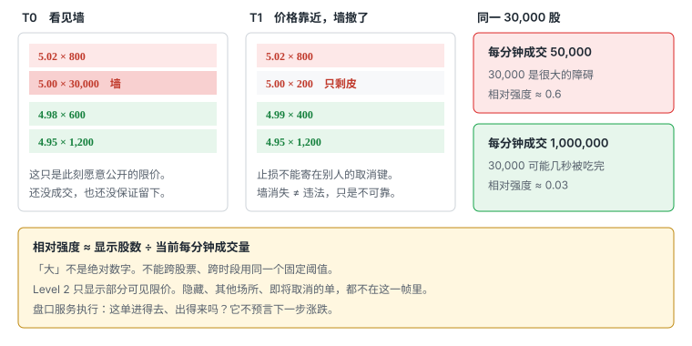
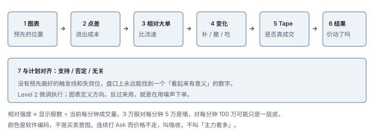

# 3.3 Level 2

> 一句话：Level 2 是此刻愿意公开挂出的限价快照。墙会撤，隐藏会补，「大」必须对比流速。它服务执行，不预言下一步。

K 线告诉你一段时间内已经发生的 open / high / low / close。Level 1 只给最优 bid / ask。Level 2 把最优价后面的若干档、若干场所、若干可见 size 摊开。三者回答的问题不同：图表给位置，Level 1 给 inside market，Level 2 给**当前进出的可见摩擦**。

本章只处理 Level 2。报价见 3.1，订单类型见 3.2。逐笔成交见 3.4。识别隐藏单、区分「被吃掉」还是「被撤掉」时，必须对照已经发生的成交；那是核对手段，不是把本章改写成 Tape 课。

Level 2 更适合需要精确执行的超短 / 短线。计划持仓一两个小时，它的权重下降：那几秒的档位变化，撑不起一份以小时计的逻辑。缺点是画面每秒都在改，长时间盯盘消耗注意力。它不能用一张静态截图完整解释，因为真正有用的信息来自**变化过程**：增加、减少、撤走、补回、卡住。

课程把用法分成四层：看相对大单；看 size 怎样变；找 hidden / reserve；再把前三类用于入场、离场和止损。四层都成立的前提只有一句——**先有图表上的计划价，盘口只负责微调执行**。反过来用，盘口里永远能找到一个看似有意义的数字。



## 3.3.1 可见报价回答什么

Level 2 显示的是尚未成交、且被数据源公开出来的限价。每一行大致是：某个场所或做市商，在某个价格，愿意买或卖多少**可见**股数。它回答的是现在：

- 立刻买，第一档打在哪，后面还有没有可见卖单；
- 立刻卖，第一档打在哪，下面还有没有可见买单；
- 点差是 0.01 还是突然变成 0.20；
- 计划触发价附近，有没有远大于邻档的可见聚集；
- 突破前后，簿是在变厚、变薄，还是整档消失。

它不回答：

- 这些单会不会在成交前撤走；
- 真实总量是不是比显示的大（hidden / reserve / iceberg）；
- 其他场所、暗池、批发商那里还有多少；
- 某个大单属于谁、为什么挂在那里；
- 价格下一步必然往哪走。

所以「ask 有 50,000 股，因此绝不可能突破」不成立；「bid 有大墙，因此多头安全」也不成立。把止损寄托在一张可见卖单墙上，是把风险交给别人的取消键。

公开限价是意愿，不是承诺。意愿可以在下一跳报价里消失。Level 2 的合法身份是**执行环境监视器**，不是方向预言机。

## 3.3.2 比 Level 1 多了什么，仍缺什么

Level 1 通常只有 best bid / best ask 和各自 size。它适合扫一眼 inside market，不足以证明某价「有墙」。Level 2 多出来的是：

- 最优价后面的若干档；
- 同一价上不同场所 / 做市商的分列或汇总；
- 可见深度随时间的变化；
- 有时还有状态行：LULD 带、halt、短卖限制提示。

多出来的仍是**可见部分**。缺的东西和 Level 1 同一类，只是档位更多、更容易让人误以为完整：

- 即将取消的订单；
- 不显示或只显示一小截的订单；
- 未订阅、未汇总的场所；
- 你的队列位置；
- 其他参与者的真实剩余量；
- 未来成交意愿。

深度更完整，只是噪声和认知负担一起上升。直接从 total depth 推断方向，是最容易过拟合的读法。策略用不到的列，藏起来往往比「再开一档」更有利于执行。

更快的数据需要更稳的硬件和更低的处理延迟。显示比别人快 20 毫秒，自己的终端卡 200 毫秒，优势是负的。订阅等级、刷新率和平台聚合方式，决定你看见的是哪一种残缺，不是决定你看见了市场本身。

## 3.3.3 一列报价怎么读

常见列：

| 列 | 是什么 | 不是什么 |
|---|---|---|
| 场所 / MM / ECN | 这条可见报价来自哪个市场中心或标识 | 最终受益所有人、庄家身份 |
| Bid price / size | 该处愿意买的可见限价与数量 | 所有想买的人 |
| Ask price / size | 该处愿意卖的可见限价与数量 | 市场总供应 |
| 多档 | 最优价后面仍挂着的可见价格 | 连续的真实墙 |
| 状态 / LULD | 交易状态或限价带提示 | 买卖信号 |

同一价格可能拆成多行（按场所），也可能合成一行（aggregated）。分列时，5.00 上三行各 2,000，合计可见 6,000，不表示三家互不相干的人，也不表示有 6,000 股一定会成交。同一参与者可以拆单、改路由、只在一个场所露头。场所缩写、MMID、ECN 代码是报价来源标签，不是账户名。同一标签下可以是做市库存、客户代理、算法切片，或几家被平台合成的结果。不要因为某行写着你认得的四个字母，就说「某某在出货」。

你也看不见自己的队列位置。簿上写着 5.00 × 6,000，你的 400 股限价排在这 6,000 的哪一截，零售 Level 2 通常不告诉你。价格打印过 5.00，不保证轮到你。3.1 对不可成交限价已经写过这句；拿到深度之后，这句话仍然成立。

价格分组（price grouping）把相同价涂成同色，为的是让你一眼抓住 level，不是识别每个 market maker。Best bid / ask 应最醒目。把所有行涂得一样花，inside market 反而丢了。

读一行的最小动作：

1. 这是 bid 还是 ask；
2. 价格离计划触发位多远；
3. size 的单位是什么；
4. 它是单独一行，还是同价多行之一；
5. 相对邻档和当前流速，它算不算「大」；
6. 下一秒它是增加、减少、挪档，还是整行没了。

不要在第一眼就讲故事。先读字段。

## 3.3.4 Size 先确认单位

有的平台把 `1` 显示成 100 股（一个 round lot），有的显示实际股数。视频里的 DAS 风格界面常按「百股」：`300` 约是 30,000 股。odd-lot 可能被藏、被汇总、或单独一列。课程截图里的数字不能脱离那个历史平台解释，更不能当成你自己屏幕上的同一回事。

实际使用前只做四件事：

1. 查自己平台的字段文档，写清 size 单位；
2. 用模拟或极小订单观察自己的单怎样出现在簿上；
3. 分清 aggregated size 和 venue-specific size；
4. 确认刷新速度、行情订阅等级、盘前盘后是否同一套深度。

课程里某只股票「买盘 8 万股」只是那一时刻、那一数据源的观察，不是阈值。换一只股票、换一个分钟、换一个 vendor，同一个绝对数字可以毫无意义。

自己的订单出现在簿上，是核对单位最好的办法。你挂 200 股，屏幕上跳出 `2` 还是 `200`，单位当场结算。不要用别人直播里的口播数字给自己定「大单标准」。

## 3.3.5 颜色不是买卖信号

绿色、红色、黄色通常只是平台对 bid、ask、相同价位或状态行的视觉编码。不同平台规则不同，用户还可以改。绿色不天然代表 bullish，红色的 LULD 行也不是「该卖」。

设置时至少确认：

- price grouping 按什么规则上色；
- bid / ask 两侧是否强制分色；
- 场所 / ECN 有没有独立色；
- size 单位是否在图例里写死；
- LULD / halt / SSR 状态行什么颜色；
- hidden / reserve 有没有单独标识。

颜色分组应让 inside market 最醒目，同时避免红绿造成情绪化判断。把 best bid 涂成「赚钱绿」、best ask 涂成「危险红」，盘中你会先产生感觉，再找理由。感觉不是字段。

数据延迟、报价更新顺序、跨场所和特殊状态，都会让颜色分类不完美。记颜色前先读平台定义。不确定就当它是涂色，不当它是意图。

## 3.3.6 挂着的是 Passive，打过去的是 Aggressive

- **Passive order**：挂在订单簿上等待别人来成交。例如 limit buy at bid，limit sell at ask。
- **Aggressive order**：主动跨过 spread 与对手方成交。例如 market buy，或可立即成交的 limit buy。

Level 2 主要让你看到部分 **passive liquidity**。墙是被动流动性的快照，不是未来方向。真正推动 last 的，是有人愿意跨过点差去打对方。

簿上看起来「上方稀薄」，只说明那些价位没有人挂出卖限价，**不是因为没有买方**。买方如果愿意立刻成交，会去打 ask，而不是在空白价位上变出一堵墙。同样，下方没有大 bid，也不等于没有人想卖——想立刻卖的人会去打 bid。

所以不要把「ask 厚」读成「大家看空」，把「bid 厚」读成「大家看多」。厚只表示这一刻有人愿意在那个价被动排队。他们可以在你的市价单到达前全部离开。

你自己的单也一样。挂在 bid 上，你是别人 Level 2 里的一行 passive size。对方看不见你的意图，只看得见你愿意公开的那一截。你取消的那一瞬间，别人屏幕上的「支撑」可以一起消失。用这个对称关系提醒自己：你对别人的墙并没有更多洞察，对方对你的墙也没有。

## 3.3.7 可见报价可以撤、改、拆、藏

公开限价单可以：

- 立即取消；
- 改价、改量；
- 只显示一部分（reserve / iceberg）；
- 完全不显示（hidden），只在成交时露出来；
- 被其他订单抢先成交；
- 在不同场所重复或聚合显示。

因此一帧截图证明不了下一秒。更有信息量的是互动过程：

- 成交不断打在 ask，大单 size 是否减少；
- size 减少后是否在同价补回；
- 打穿后 bid 是否抬高；
- 突破后价格是否接受新区域；
- 大 size 是被成交，还是突然撤走。

「减少」有三种常见来源，屏幕上的数字长得一样：

| 来源 | 簿上看到什么 | 必须同时核对什么 |
|---|---|---|
| 成交消耗 | size 下降，价位还在 | 该价是否出现对应成交 |
| 撤单 | size 下降或整档消失，成交对不上 | 该价成交量远小于减少量 |
| 改价 / 挪档 | 一档变薄，邻档变厚 | 总量是转移还是蒸发 |

分不清这三种，就会把「墙撤了」讲成「被主力吃掉」，或把「被吃掉」讲成「吓跑了」。两种错误都会让你在错误的方向上加仓。

从个人零售 Level 2 看到大单撤走，不能直接断言违法。正常交易者也会因市场变化取消；订单可能在另一场所成交；数据聚合和延迟会改变显示；需要更完整的消息级数据才能重建行为。操纵性 spoofing 是受禁止的，但你的屏幕不够当法庭。操作上只需要接受：**可见 size 可以消失**。

## 3.3.8 「大」必须对比当前流速

某价格的 ask 上有远大于附近档位的卖单，价格向上需要足够多的主动买单把它吃掉。某价格的 bid 上有大量买单，主动卖单需要先消耗这批需求，价格才容易继续下跌。这只是短期阻力 / 支撑的**候选**，不是铁板。

「大」不是绝对数字。判断式：

```
订单相对强度 ≈ 显示订单股数 ÷ 当前每分钟成交量
```

不需要精确算到小数点后三位，但必须建立量级感。例如 ask 显示约 30,000 股：

- 若这只股票当前每分钟只有 50,000 股成交，30,000 是很大的障碍；
- 若每分钟成交 1,000,000 股，30,000 可能几秒被吃完。

不能跨股票使用同一个固定阈值。同一只股票也不能跨时段共用：开盘第一分钟的流速，和中午的流速，不是同一个分母。分母要用**此刻附近**的成交速度，不要用昨日全日均量去除。

相对强度只比较量级。0.6 和 0.03 的差别，肉眼就该能分开。把「超过 10,000 股就是大单」写进计划，是把启发式冻成迷信。

再算一笔给自己的订单，不要只算给市场：

```
计划买 2,000
最优 ask 可见 200
下一档 400
再下一档 300
可见合计 900
当前每分钟成交 ≈ 80,000
```

对市场，2,000 ÷ 80,000 = 0.025，你的单不是墙。对你，可见前三档只有 900，市价买 2,000 必须走到更差的价，或限价买只成交一部分。两种「大」要分开记：墙相对流速大不大，是观察别人；深度相对你的股数够不够，是决定发不发单。

执行问题永远先问：**这单相对可见深度有多大**，再问墙对别人有多大。

## 3.3.9 墙不是支撑

墙是某一价上、某一时刻、某一数据源里偏大的可见挂单。它不是：

- 支撑 / 阻力本身——支撑阻力首先是图表上反复被检验的位置；
- 保护你仓位的保险；
- 「主力」的签名；
- 突破不可能发生的证明。

大单不是保证，因为：

- 订单可以被取消；
- 同一参与者可拆单；
- 不同交易所 / 路由显示的深度不完整；
- 大单可能在价格接近时消失；
- 高量 momentum 可以直接消耗它。

因此，大单是「值得观察的潜在流动性」，不是必定守住的墙。只因看到墙就提前反向入场，容易被撤单或真正突破击中。只因看到墙就放松止损，等于把失效条件改写成「等别人按取消」。

整数、整美元、盘前高、前收盘这些位置上更容易看见墙，因为那是大家都看得见的价。墙和位置叠在一起，信息比「随便一个 4.37 上的大单」稍强，仍然不是承诺。位置先来自图表；墙只说明这个位置此刻有人愿意公开排队。

把止损放在墙的背面，隐含假设是：墙会先被打，而且打的时候你能按计划价出去。墙若先撤，你的假设先死。墙若是隐藏供应的冰山一角，价格卡住，你的止盈也会死。两种死法都来自同一句错话：「墙会保护我。」

## 3.3.10 变化比快照重要

Level 2 每秒都在变。比起「墙有多大」，更有用的是：

- 大单增加还是减少；
- 价格靠近时它仍在还是撤掉；
- 被成交后是否真的消耗；
- 消耗后是否重新补回；
- Bid 与 Ask 哪一边正在失去力量；
- 点差是否突然变宽；
- 成交很活跃时，价格有没有同步推进；
- 关键位附近是被吸收（成交多、价格不动）还是快速撤单。

| 现象 | 可能含义 | 必须同时看什么 |
|---|---|---|
| 大 Ask 快速减少 / 消失 | 上方可见阻力变薄，也许准备向上 | 是成交还是撤单；价是否真上去 |
| 大 Bid 快速减少 / 消失 | 下方可见承接变弱，也许准备向下 | 是成交还是撤单；价是否真下去 |
| Ask 被持续买入但仍补回 | 可能有隐藏 / 补充卖方 | 价格有没有卡住 |
| Bid 被持续卖出但仍补回 | 可能有隐藏 / 补充买方 | 价格有没有卡住 |
| 大单在价格接近时突然撤掉 | 原支撑 / 阻力不再可信 | 随后是否顺着空出来的方向走 |
| 大单先减少后又恢复 | 可能只撤了部分，也可能有新单加入 | 补回的是同一价还是移到别档 |

这些都只是可能解释。必须结合成交、量、图表位置和实际价格移动。只有价格随后向相应方向移动，盘口变化才获得结果确认。簿变薄而价不动，什么都还没证明。

所谓 bid stacking：多档 bid 上移、inside bid size 增加、ask 被打、last 抬高。四件事要一起发生，才谈得上「档位在走」。只有 size 增加、price 不前进，可能是吸收，也可能是噪声。Ask 侧镜像成立：多档 ask 下压、inside ask 变厚、bid 被打、last 走低。

点差突然拉宽，常常比某档 size 的绝对数字更紧急。触发那一秒 spread 从 0.02 变成 0.20，计划里的 1R 已经改写。可以放弃。盘口在这里做的是风控，不是找理由硬上。

## 3.3.11 Hidden：显示小、成交大、价格卡住

有些 passive order 不显示真实总数量，只在 Level 2 上露出一个很小的固定数量。每次部分成交后，显示数量继续补回。Iceberg / reserve 是这一类的常见实现：簿上留一个可见尖，水下还有一截。完全 hidden 的单在成交前可能连尖都不露。


例如 ask at 5.04 显示约 200 股：

1. 已经发生的成交显示有人主动买了 5,000 股；
2. 正常情况下，200 股早应被吃完，价格应去下一个 ask；
3. 但 5.04 仍显示很小的 size，且价格无法突破；
4. 这说明可能有 hidden seller 在持续供给。

Hidden buyer 则相反：大量卖单打到某个 bid，但该价格仍不断吸收，无法跌破。

仅看 Level 2 的小 size 无法证明隐藏订单。必须同时满足：

- 实际成交量显著大于显示量；
- 成交发生在同一价格；
- 显示 size 反复补回，或价格持续卡住。

如果成交后价格顺利穿过，该订单只是普通小单。Hidden 的真实剩余数量不可见，因此更合理的用法是把它当成短线离场理由，而不是尝试猜总量。猜「大概还有两万」没有字段支持。

隐藏只是「不显示真实总量」，不代表不可突破。高 volume、强催化或更多 aggressive orders 仍可能把它全部成交。把它写成「永远打不穿的隐形墙」，和把可见墙写成铁支撑，是同一种错。

超短线处理：

- Long 遇到 ask 上的 hidden seller：倾向先离场，因为不知道总量多大、多久才能突破；
- Short 遇到 bid 上的 hidden buyer：同理，应提高警惕或 cover；
- 若隐藏流动性与计划方向一致，可作为支持信息，但不能单独决定入场。

持仓周期越短，无法突破几秒就可能破坏交易逻辑；持仓周期较长，可以给它更多时间。时间预算必须事先写在计划里，不能盘中临时改成「再等一下，也许要完了」。

平台若对 hidden / reserve 有单独标记，把它算作「可能不完整」的提示，不要当成已测量的剩余量。没有标记也不等于没有隐藏。有标记也不等于水下还有十万股。标记只改变你的置信度，不改变「不知道总量就不要赌厚度」这条规则。

吸收是隐藏的近亲：大量主动成交打在某价，价格无法继续。许多 ask 侧成交却不涨，上方可能有隐藏或补充供应；许多 bid 侧成交却不跌，下方可能有吸收需求。这只是可检验的订单流解释，不能从零售数据确定是谁在吸收。操作上把「高成交但无进展」视作警告，并定义价格失效点。警告不是反向开仓许可证。

## 3.3.12 深度决定预期成交，不决定方向

买入之前，先把可见卖档加总。这是执行算术，不是多空投票。

假设你要买 5,000 股，可见 ask 为：

```
ask 5.00: 800
ask 5.01: 1,200
ask 5.03: 2,000
ask 5.06: 1,000
```

若全部可见且不撤单，理论均价：

```
(800×5.00 + 1200×5.01 + 2000×5.03 + 1000×5.06) / 5000
= (4000 + 6012 + 10060 + 5060) / 5000
= 25132 / 5000
= 5.0264
```

屏幕上的 best ask 是 5.00。账单上的理论均价已经是 5.0264。中间这 0.0264 不是「滑点 bug」，是你的股数走过可见簿的代价。真实结果还受其他买单、隐藏流动性和更新延迟影响——通常比这个算术更差，因为 5.00 那 800 股可能先被别人拿走，或在你到达前撤掉。

可见档加起来不够你的股数时，市价会继续往更差的价格走；限价会在限价处停下，剩下的不成交。两种结果都要在进场前算过。计划入场价应是 **expected average fill**，不是 top-of-book 的 ask。每笔至少记 planned price、average fill、worst fill。图上的 trigger price 不是绩效入场价。

3.1 已经写过：屏幕价、允许的最差价、账单均价经常不是同一个数。Level 2 的用处是把第二、第三个数估出来。估出来发现点差和深度已经吃掉计划里的 1R，这笔就不该发。

卖出同样算。你要出 3,000 股，最优 bid 只有 400，下面两档也稀，市价卖的均价会明显差于 last。这时「图表上看着还能再拿」和「你这 3,000 股出得去吗」是两个问题。Level 2 只回答第二个。

模拟器里的 fill 不能当真实深度。模拟撮合往往更厚、更稳、更不撤单。用模拟器练热键可以，用模拟器练「这堵墙一定在」不行。

## 3.3.13 先图表，再盘口微调

讲师强调，先从图表确定大致交易位置，再用 Level 2 微调执行。不能反过来。盘口里永远能找到某个看似有意义的数字：这边多 2,000，那边少 500，点差收了一分。没有预先画好的触发线和失效位，这些数字可以被解释成任意方向。

合法用途是**执行质量**：

- 计划买 2,000 股，ask 上只有 200，市价会滑；
- 突破触发时 spread 从 0.02 变成 0.20，这笔的计划风险已经变了，可以放弃；
- 停牌恢复前盘口乱跳，不应用市价去抢；
- 关键位上出现 hidden seller，超短线先走，而不是加仓赌它马上被打穿。

非法用途是：因为看到一张大买单就认为价格必涨；因为看到 ask 变薄就认为突破已确认；因为颜色是绿的就按买。

进阶课会把 Level 2 当成入场过滤。能保留的只有：流动性是否足够让你的股数进出，以及关键位是否被吸收。不能保留的是「看到某数字就开仓」的口诀。坏的日线、不够的 reward / risk、已经延伸过头的位置，盘口再漂亮也救不回来。

何时可以少看 Level 2：

- 持仓周期以小时计，触发不依赖秒级深度；
- 标的深度稳定、点差极窄，你的股数相对流速可忽略；
- 你还不会按固定顺序读，盯盘只会制造故事。

何时必须看：

- 小盘、低价、点差不稳定；
- 订单相对可见深度不算小；
- 触发就在整美元、前高、开盘区间这种大家排队的地方；
- 你准备用可成交限价去扫，需要知道扫多远。

窗口越多不代表信息越好。每个窗口应有明确问题。Level 2 的问题只有两个：**现在摩擦多大**，以及**计划位上的可见流动性是在消耗、补回还是撤走**。

## 3.3.14 三个执行情景

三者都先有图表上的计划价。Level 2 只负责触发附近的微调。相同的数字变化，没有位置就可以被任意解释成买入或卖出理由。

### 情景 A：Long Breakout

假设图表显示 4.00 是 breakout level：

1. 先由 candle / pattern 判断突破逻辑，失效位事先写死；
2. 观察 4.00 ask 上的相对大单；
3. 若 ask size 持续减少，并且减少对得上成交，主动买单正在消耗卖压；
4. 大单接近被吃完、点差没有突然拉宽时，用预设方式执行；
5. 若大单突然补回、出现 hidden seller，或价格无法保持在 4.00 上，及时退出。

看见一次 4.00 被打到，不能叫确认。要看 bid 是否抬到 4.00，以及回踩时 4.00 是否还在。一次刺穿加一堵马上补回来的墙，是假突破的常见盘口长相。

「大卖单突破」按过程观察。假设 7.00 ask 显示 20,000 股：

1. 记录显示 size 和当时每分钟成交；
2. 观察成交是否连续发生在 7.00；
3. 区分 size 被成交减少，还是未成交就撤走；
4. 突破后检查 7.00 是否转为 bid；
5. 查看 7.01–7.10 是否有新供应；
6. 若价格立刻跌回 7.00 下，按 failed breakout 处理。

不能因为看见一次 7.00 打穿就推断全部 20,000 股被同一买方吃掉。

### 情景 B：Long Dip Buy

假设图表支持在 4.00 附近做 dip buy：

1. 看 4.00 bid 是否有明显承接，相对流速够不够称为承接；
2. 看卖单打到 4.00 时 bid 是否保持，还是越打越薄；
3. 可用接近 bid 的限价方式尝试成交，接受不成交；
4. 若大 bid 被撤掉或迅速消耗，原支撑逻辑失效，按计划走，不要把失效位往下拖。

Dip 的盘口用途是确认「计划接的那一层还在不在」。层撤了，你不是「便宜了」，你是没了接盘假设。

### 情景 C：Short at Resistance

与 breakout long 相反：

1. 图表先确认阻力；
2. Ask 出现相对较大的卖单；
3. 主动买单无法突破，价卡住或回落；
4. Bid 逐步下移或变薄；
5. 才考虑 short，并把阻力突破定义为风险。

只看见大 ask 就空，是墙交易。墙可以撤。空的理由是位置加反应，不是某一行红色数字。

## 3.3.15 继续持有还是现在走

Level 2 的价值是帮助决定「当前继续持有还有没有即时优势」，不是寻找完美最高 / 最低点。

### Long 止盈

若 long 后上涨到 4.22：

- Ask 出现远大于附近档位的卖单，相对当前流速不小；
- 主动买无法继续推进，价在墙前卡住；
- 可以在大 ask 前用可成交的限价方式退出，例如接近 ask 一分钱；
- 若发现 hidden seller，则更快处理。

这不预测 4.22 一定是最高点。它只说：再往上的即时摩擦变大了，继续拿的优势下降。

### Short 止盈

若 short 后下跌：

- Bid 出现明显大单；
- 卖单无法继续压低；
- 可能是潜在支撑；
- 可以 cover 全部或部分仓位。

同样不预测最低点。Exit 的理由是风险收益改变。

### 显示支撑撤掉

假设 long entry 在 4.10，预期 4.00 反弹：

1. 原本 4.00 bid size 相对较大；
2. 价格回到 4.00 时，size 明显缩小，或整档先撤；
3. 支撑变弱；
4. 可用可成交方式尽量在 4.00 附近离场，接近入场价。

「保本」只表示接近入场价，并不保证扣除点差、手续费和滑点后净盈亏为零。支持原交易的即时流动性已经变弱时，继续按原计划等待，是把失效条件往后推。

### 遇到 Hidden Seller

更坏的情况是价格回到计划位：

- 某档 size 卡在很小数字；
- 大量成交后仍无法向有利方向移动；
- 说明有隐藏流动性阻挡；
- 不知道真实 size 时，倾向立即退出，而不是等待。

Level 2 与交易逻辑冲突时扩大止损，是本章最贵的错误之一。盘口否定的是即时假设，不是请你把图表上的失效位改远一点，好让自己再看一会儿。

## 3.3.16 一条完整序列

下面用整数价，不是某只真实股票。目的是看 Level 2 在同一笔里怎样换角色：先帮你决定能不能空，再帮你决定该不该走。

### Entry

价格快速上涨到 5.00 整数附近。5.00 是 whole dollar，本身就是图表上的候选阻力。Level 2 的 5.00 ask 有相对较大的订单。价格尝试突破 5.00，但卖单持续存在——减少对得上成交，却不断补回，价过不去。约在 4.98 建立 short，不是因为看到任意一笔大 Ask，而是整数阻力与盘口反应同时出现。如果 5.00 的卖单被快速吃掉且价格站稳，原 short 逻辑应重新评估，而不是「既然空了就拿着」。

### Holding

下跌过程中：Ask 一侧持续有相对较大的订单；Bid 没有同等强度的承接。没有因为小反弹立即 cover。继续观察前低能否被跌破。这里 Level 2 的工作是**没有出现否定**：下方没有突然冒出相对流速很大的 bid 墙，点差没有倒过来变得无法覆盖。小反弹打到 4.90 又退回去，只要 5.00 的供给还在、计划失效位没被打穿，就还是同一笔交易。盘口上每一秒的来回，不够单独改方向。

### Exit

价格下到约 4.77。Bid 出现相对较大的承接。Short 已持有约两分钟，从 5.00 附近下跌到 4.77。下方继续突破的即时难度增加。Cover / take profit。这并不预测 4.77 一定是最低点，只说明 short 当下的即时优势下降。若 cover 之后价格继续跌，那是下一笔的事，不要为了「没拿到最低」把已执行的离场改写成错误。

这笔序列里 Level 2 提供了两条不同信息：

- 5.00 大 Ask：帮助确认 entry / 继续持有；
- 4.77 大 Bid：帮助决定 exit。

同一张盘口，前后职责不同。不要指望它从头到尾只给你一个「看空」或「看多」的手势。日志里写成「5.00 可见供给持续、相对流速够大、价过不去；4.77 可见需求出现、继续向下摩擦变大」。不要写成「主力在 5.00 出货，又在 4.77 接回」。

## 3.3.17 固定阅读顺序

每次只按固定顺序看，避免信息过载。



1. **图表位置**：当前接近哪一个预先计划的 level？
2. **Best bid / ask 与 spread**：执行成本是否合理？
3. **附近相对大单**：哪一侧有明显流动性？相对每分钟成交量有多大？
4. **变化**：增加、减少、撤单还是补单？
5. **成交核对**：主动买卖是否真的发生，减少是吃掉还是撤掉？
6. **价格结果**：成交后价格有没有移动？
7. **与计划对齐**：支持、否定还是无关？

没有第 1 步，后面六步都是闲聊。没有第 7 步，你会在盘口里循环讲故事。第 5 步需要成交窗口，但你问的仍是 Level 2 上那一行的命运，不是去数 Tape 的颜色。

Level 2 与图表必须看同一标的。多窗口增加切错 symbol 的风险；颜色链接不能替代订单窗口中醒目的 symbol。最小安全联动检查：

- 点击 watchlist 后，图表、Level 2、成交窗口是否同步；
- order entry 是否同步，还是保持原 symbol；
- 热键使用当前焦点、鼠标所在窗口，还是固定窗口；
- 多账户时 account 是否一起改变；
- symbol 字段能否在发送前被风险弹窗复核。

新手应先只管理一只股票。深度更完整能看到更多场所，但也增加噪声。如果策略不使用某些字段，隐藏它们。先固定三到五个观察变量，不要每秒扫描全部档位。

建议固定的五个变量：

```
spread
trigger 价上的可见 size
该 size 相对当前每分钟成交
该 size 是在减、补，还是撤
价格有没有离开该价
```

五个以外的故事，默认不看。

## 3.3.18 工作区、数据源与开盘盘口

不同软件对 size、颜色、route、短卖可用量和热键有不同字段。界面长得像，订单语义可以完全不同。Broker、front end、market data vendor 可能是三个实体，故障点也是三个。选平台依据当前文档和测试，不照搬课程旧品牌组合。

「更多数据」不一定更有优势。多开三只股票的 Level 2，你对任何一只的撤单都看不清。复盘时至少保存触发前约 10 秒到退出后的盘口；单张图无法显示 speed。画面下方的订单状态也必须纳入，避免只研究价格、不研究自己那笔有没有挂上、有没有部分成交。

开盘或停牌复牌时可能出现：

- auction 一次撮合；
- 大量积累订单突然变成一跳；
- spread 突然很宽；
- quotes 快速重置；
- 成交速度远高于平时。

这些盘口不应与连续交易中的普通一档一一类比。先确认交易状态，再解释任何一行。停牌恢复前盘口乱跳，不应用市价去「抢」。红色的 LULD 行是限价带提示，不是买卖信号；价格逼近该带只说明停牌风险上升。

「Institutional order」不能从一张 Level 2 确认。图上看到大 size，不足以识别最终受益所有人。机构可拆单、使用算法、隐藏数量或跨场所；零售也可能聚合成大单。Chart 和成交能证明行为，不能证明身份和目的。把「institutional」改写成「large / consistent flow」，避免不可验证归因。不要在 Level 2 上数「主力」。

从个人屏幕看到大单快撤，只能记「可见 size 消失了」。不要写进日志「有人在 spoof」。你没有消息级重建，那个句子不可检验。可检验的句子长这样：

```
4.00 ask 显示 18,000，当时约每分钟 40,000
价格到 3.99 时该档剩 400，中间成交合计约 1,200
结论：主要是撤，不是吃
随后 8 秒跌到 3.92
```

不可检验的句子是：「有人故意挂墙骗多头，然后砸盘。」后一种句子会让你在下一笔里寻找坏人，而不是寻找深度、点差和失效位。

## 3.3.19 训练

先用 demo account，只录屏不交易：

1. 选一只活跃、点差会变的股票；
2. 每次只标记一个大 ask 或大 bid，写下相对当前每分钟成交的量级；
3. 记录随后 5–10 秒：增加、减少、撤走、补回；
4. 对照成交，给这一行打标签：吃掉 / 撤掉 / 分不清；
5. 记录价格是突破、反弹还是无反应；
6. 每天复盘约 10 个片段；
7. 熟悉字段之后再练发送订单，并把 size 降到最小。

训练每次只选一个明确水平：

```
symbol:
time:
level:
pre-level spread:
visible size:
size unit:
shares ≈
per-minute volume ≈
relative size ≈
reduced / reloaded / cancelled:
price progress:
held above / below:
actual fill:
result after 10s / 30s / 1m:
```

训练分三步：

1. 只看录像，暂停前先写判断；
2. 隐藏后续结果，防止 hindsight；
3. 用成交数据统计，不只收藏「看起来很明显」的案例。

成功案例需要对应失败案例才能评价。盘后用慢放能看懂，不代表实盘也能稳定执行。单帧截图只证明那一瞬间屏幕显示了什么，不能证明挂单之后一定成交。

突破前后若要留清单，也只留执行字段：

```
spread:
visible ask at trigger:
visible size vs per-minute volume:
ask reduced / reloaded / cancelled:
bid stepped up:
seconds held above:
actual fill:
failed back below:
```

统计的是自己的 fill 和随后价格，不是「我当时觉得像主力」。熟悉后再把热键接进来；热键是另一章的生产系统，本章先把眼睛训练到不会看见墙就下单。

## 3.3.20 常见错误

1. 脱离图表，只看 Level 2 下单。
2. 把任何大单都当绝对支撑 / 阻力。
3. 忽略大单相对于每分钟 volume 的比例。
4. 只看显示 size，不核对该价成交，分不清吃掉还是撤掉。
5. 把 hidden order 当作永远打不穿。
6. 看到单子撤掉后仍按原计划等待。
7. Level 2 与交易逻辑冲突时扩大止损。
8. 看见绿色就买，看见红色就卖。
9. 看到一个大 size 就猜机构方向，在盘口上数「主力」。
10. 忽略 spread，用 top-of-book 当自己的成交价。
11. 用一个数据商的档位深度当所有平台的真相。
12. 把 simulator fill 当真实深度。
13. 没有预先定义的图表位置，却用盘口数字给自己找入场理由。
14. 同时盯多只股票的 Level 2，结果哪一只的墙撤了都没看见。
15. 开盘或复牌的 auction / 乱跳报价，按普通连续时段解读。
16. 把课程讲者口述的意图当作盘口本身可证明的事实。

## 先记住这些

- 可见订单可以消失。墙不是支撑。
- 「大」必须和当前每分钟成交量比较。3 万股对每分钟 5 万是墙，对每分钟 100 万可能只是一层皮。
- 隐藏流动性的识别条件是：成交远超显示量，且价格卡住。不知道剩余总量时，超短线先走。
- 减少要先分清成交、撤单、改价。分不清就不要讲故事。
- 阅读顺序永远是：图表位置 → 点差 → 相对大单 → 变化 → 成交核对 → 价格结果 → 是否对齐计划。
- 盘口首先服务于执行：这单进得去、出得来吗？其次才是上下文。它不预言下一步。
- 颜色是软件规则。LULD 行是状态，不是信号。
- 同一标的、同一计划价。没有位置的盘口数字，两边都能讲。

## 不要做的事

- 把墙当铁支撑，或在 Level 2 上数「主力」。
- 因为看见一次打穿就推断整堵墙被同一买方吃掉。
- 用一个数据商的档位深度当所有平台的真相。
- 开盘或复牌的乱跳报价按普通连续成交解读。
- 没有预先定义的图表位置，却用盘口数字给自己找入场理由。
- 把止损寄在别人的取消键上，或盘口否定后把失效位改远。
- 把模拟器里砸不穿的墙，当成实盘还会在的墙。
