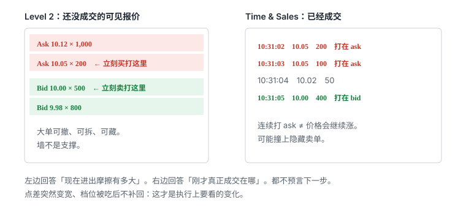
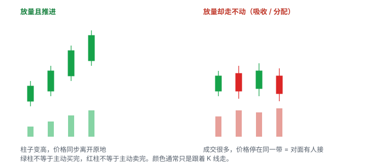
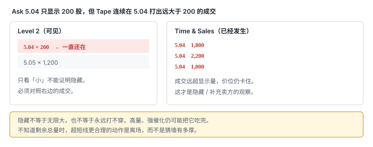

# 3.4 Time & Sales

> 一句话：Tape 记录已经成交的事实。连续打在 ask 上，不等于价格会继续涨。

报价是还没成交的意愿。Level 2 把一部分意愿按价位摊开。Time & Sales（Tape）打印已经发生的成交。K 线再把一段时间里的成交压成一根 open / high / low / close。四张东西问的问题不同：图问位置，报价问现在进出要付多少摩擦，盘口问可见深度怎么变，成交带问刚才真正打在哪一侧、打完之后价格有没有走。

这一章只写 tape。墙会不会撤、隐藏单怎么补、点差突然拉宽，属于盘口。热键怎么把单子送出去，是动作问题，不在这一章。停牌、集合竞价和 LULD 会改 print 的含义，这里只写到「先认交易状态，再解释颜色」为止。

课程幻灯片若写成「Time & Sales 显示每一张刚挂出的订单」，那是不准确的。未成交的限价单属于 order book。已取消的挂单通常不会变成 print。你在成交带上看到的每一行，默认是一笔已经撮合的交易，不是一张还挂着的单。

## 3.4.1 Print 是成交，报价是挂单



| | 报价 / Level 2 | Time & Sales（print） |
|---|---|---|
| 显示 | 尚未成交的**可见**意愿 | 已经发生的成交 |
| 问的问题 | 现在进出的摩擦有多大 | 刚才打在 ask、bid，还是中间 |
| 常见字段 | 场所、价、量、多档 | 时间、价、量、场所或条件代码 |
| 可以消失吗 | 可以撤、改、藏、拆 | 已经成交的那一行通常不会「撤掉」 |
| 陷阱 | 大单当墙 | 连续打 ask 当成必涨 |

一笔 print 同时有买方和卖方。屏幕把它标成绿或红，是软件根据成交价相对当时 bid / ask 的位置，推断哪一侧更主动。绿色不是「只有买没有卖」。红色也不是「只有卖没有买」。把 print 读成单边投票，后面所有故事都会歪。

报价可以骗人，因为还没成交。Print 也不能预言下一步，因为它只证明刚才发生了什么。两者合在一起，仍然只回答「刚才」和「现在」，不回答「接下来一定怎样」。

最小对照：

```
报价：现在 5.00 / 5.02，ask 上挂着 800 股。
Print：10:31:03  5.02  200
```

这只证明有人在 5.02 成交了 200 股。它不证明：

- 剩下 600 股还会挂着；
- 下一笔还会在 5.02；
- 买方会把价格推到 5.03；
- 这 200 股属于同一个「主力」。

先分清这两列，再谈颜色、速度和吸收。分不清，后面只会把挂单当成交、把成交当许可。

## 3.4.2 窗口里通常有哪些列

不同软件列名不同，语义要自己对一遍。常见字段：

- **时间**：成交报告时间，不一定等于你屏幕刷新的那一毫秒；
- **价格**：这笔成交的价；
- **数量**：这笔成交的股数，或按 round lot 显示的缩写；
- **场所 / ECN**：报告发生在哪个市场或报告设施；
- **条件代码**：普通连续成交、开盘 / 收盘竞价、跨市场、特殊条件；
- **颜色**：软件对「相对 bid/ask 的位置」或「同一价位」的视觉编码。

使用前先确认四件事：

1. Size 的单位。有的界面 `1` 表示 100 股，有的显示实际股数，odd-lot 可能单独处理。课程里 DAS 风格画面常把 `300` 显示成约 30,000 股。不能照搬别人截图里的数字。
2. 刷新和订阅等级。延迟行情上的 tape 不是你下单时面对的 tape。
3. 过滤。有的窗口默认藏掉 odd-lot、盘前、条件成交。你关掉的那一类，恰好可能是开盘或复牌时最不该忽略的。
4. 图表、Level 2、Time & Sales、下单框是不是同一个 symbol。颜色链接不能替代订单窗口里醒目的代码。

Last 常常只是最近一笔 print 的价格。Last 不是 bid，也不是 ask。只按 last 去设限价，常见结果是：你以为挂在「现价附近」，实际已经离开 inside market 好几档。报价章把三个价格拆开过：看到的价、允许的最差价、账单均价。Tape 只负责解释第一栏里「last 从哪来」。绩效仍然只认第三栏。

你自己的成交也会出现在 tape 上，只是混在别人的 print 里，通常看不出是你。不要在成交带上找自己的单来获得安全感。要看 executions / 账单。

## 3.4.3 一笔成交同时有买方和卖方

所谓 green print、red print、buyer initiated、seller initiated，都是推断，不是身份证明。常见分类：

| 相对当时报价的位置 | 软件常怎么标 | 只说明什么 | 不说明什么 |
|---|---|---|---|
| 打在 ask 附近 | 绿 / 主动买 | 有人愿意跨过点差去买 | 价格接下来会涨 |
| 打在 bid 附近 | 红 / 主动卖 | 有人愿意跨过点差去卖 | 价格接下来会跌 |
| 落在 spread 内 | 白 / 中性色 | 可能是中点、改善或其他机制 | 不能简单归买方或卖方 |
| 高于 ask / 低于 bid | 亮色或高亮 | 报价可能已变，或扫过数档 | 不是自动的「异常机会」 |
| 带不规则条件 | 橙或其他 | 先读条件代码 | 不能按连续成交解读 |

数据延迟、报价更新顺序、跨场所和特殊成交条件，都会让颜色分类不完美。NBBO 已经跳了，print 还按旧报价上色，是常见噪声。不确定就标中性，不要为了填满复盘表硬编方向。

「主动买」的准确意思是：这笔成交发生时，吃掉的是当时可见的卖价。它证明有人付了点差。付点差的人多，只说明当时更急的一侧在买；对面如果不断补供应，价格可以一动不动。这就是下一节之后要反复用的那句话：**打在 ask ≠ 延续**。

## 3.4.4 颜色是软件规则

绿色、红色、黄色通常只是平台对 bid、ask、成交方向或相同价位的视觉编码。不同平台规则不同，用户还可以改。记颜色前先读自己软件的定义，不要背课程截图。

尤其不要做下面三件事：

- 看到一串绿 print 就买；
- 看到一串红 print 就空；
- 因为某一档在 Level 2 和 tape 上同色，就以为「这一侧已经赢了」。

相同价格使用相同颜色，是为了让你快速认出价位，不是认出每个做市商。Best bid / ask 的颜色由平台设置，绿色不天然代表看多。颜色分组应让 inside market 最醒目，同时避免红绿把你推进情绪判断。

设置时确认：price grouping、按边着色还是按价着色、exchange / ECN 是否显示、size 单位、LULD / 状态、条件成交是否单独着色。红色的 LULD 行是停牌价格带提示，不是买卖信号。价格逼近该带，只说明停牌风险上升。

Tape 的价值不在颜色。价值在：多少成交发生以后，价格有没有真正向前走。

## 3.4.5 四个维度：价、量、速度、反应

只盯颜色，是把软件当指标。读 tape 时固定看四个维度，每次都写下来。

### 价

成交是在抬高、在同一阻力重复、突破后立刻打回、还是在 bid / ask 两侧来回。价位本身要对照事先画好的图，而不是对照「刚才那一串绿的」。

问：

- 现在的 print 是不是打在计划位上？
- 是连续打在同一价，还是已经出现更高 / 更低的成交？
- 刚打穿的那个价，有没有马上被反过来成交回去？

### 量

看相对值，不盯单笔传奇数字。

- 大 print 是连续出现，还是孤零零一笔？
- 总成交增加之后，价格有没有离开原地？
- 大单是不是都堆在同一价？
- 很多小单加在一起，是不是已经产生和大单一样的效果？

「大」必须和这只股票当前每分钟成交量比。5,000 股在每分钟 30,000 股的小盘上很显眼；在每分钟 800,000 股的股票上，可能只是噪声。不能跨股票背一个固定阈值。

### 速度

成交从零散变密集，说明参与度和紧迫性上升。速度快本身没有方向：买的人急，tape 快；卖的人恐慌，tape 也快。静态截图看不到速度。复盘需要成交导出或逐段录像，不能凭一帧颜色总结。

速度变化有用，是因为它告诉你「现在比三十秒前更挤」。它不告诉你该站哪一边。必须和价、反应一起看。

### 反应

四个维度里这一条最重要。成交之后价格做什么：

- ask 被持续成交，报价有没有上移？
- 大量打在 ask 上的 print 之后仍不涨，是不是吸收？
- bid 被持续击穿，有没有出现新低？
- 突破价有没有变成新的 bid？
- 回踩时，这个价还继续成交并守住吗？

没有价格推进的「买盘」只是换手。没有价格推进的「卖盘」也只是换手。把反应从阅读里拿掉，tape 就会退化成闪灯。

## 3.4.6 打在 ask 不等于延续

这是整章最容易用错的一句。很多人把「主动买」翻译成「多方已经赢了」。翻译不成立。打在 ask 上，只证明有人愿意按卖价成交。供应如果还在，价格可以停在原地；供应如果被撤走但没有后续买单，价格也可以立刻回来。

用整数价写一个失败样本。阻力事先画在 5.00：

```
10:21:01  报价 4.98 / 5.00
10:21:02  print  5.00 × 800
10:21:03  print  5.00 × 1,200
10:21:04  print  5.00 × 500
10:21:05  报价仍是 4.98 / 5.00
10:21:07  print  4.98 × 900   ← 打回 bid
```

三笔都打在 ask 上。没有更高的 print。bid 没有抬到 5.00。随后成交回到 bid。把第 2 到第 4 行叫「突破确认」，是把意愿当成结果。

对照一个至少配得上「向前走了一步」的序列：

```
10:21:02  print  5.00 × 800
10:21:03  print  5.00 × 1,200
10:21:04  print  5.01 × 300
10:21:05  print  5.02 × 400
10:21:06  报价变成 5.00 / 5.03   ← bid 抬到旧 ask
10:21:20  回踩时 5.00 继续有成交，且没有连续打回 4.98
```

这里多出来的不是更绿，而是三件可核对的事：出现了更高的成交价，bid 接受了旧阻力，回踩时这个价还在被交易。即使这样，也只是短线接受，不是「一定会继续涨」。完整的突破交易还要看图上的结构、点差和你的失效位。Tape 不能单独发许可证。

下行镜像同样成立。连续打在 bid 上，不等于价格会继续跌。可能只是有人在同一价吸收。可能只是点差里来回扫。可能下一秒 bid 补回来，价格一动不动。

| 你看见的 | 合法读法 | 非法读法 |
|---|---|---|
| 连续 print 打在 ask | 有人在按卖价买 | 多方赢了，追 |
| 连续 print 打在 bid | 有人在按买价卖 | 空方赢了，追 |
| 打穿一档后又立刻打回 | 这一档还没被接受 | 「刺穿就是突破」 |
| 大 print 打在 ask，随后安静 | 刚才换了一大笔手 | 机构进场，必涨 |

「打穿」和「吃完」也不是同一件事。看见一次 7.00 的 print，不能推断 7.00 上显示的 20,000 股已经被同一买方吃掉。可能只成交了其中一小截，可能大部分已经撤走，可能新的供应马上补回。Tape 能证明成交了多少、打在哪个价；它不能证明墙上原来那一列数字的命运，除非你同时看盘口变化，并且看到价格离开了那个价。

所以最小纪律是：把「打在 ask」写成观察，把「价格离开并被接受」写成结果。中间那一跳，不要用颜色补上。

## 3.4.7 吸收：成交很多，价格走不动



吸收是四个维度里「量」和「反应」打架时的名字。大量主动成交打在某价，价格无法继续：

- 许多 ask 侧成交却不涨：上方可能有隐藏或补充供应；
- 许多 bid 侧成交却不跌：下方可能有吸收需求。

这只是可检验的订单流解释。零售数据不能告诉你是谁在吸收、还剩多少、是不是同一账户。操作上只保留两件事：把「高成交但无进展」当成警告；事先写好价格失效点。警告不是反向开仓许可。失效点没破，原来的计划还可以活着；失效点破了，不要用「还在吸收」给自己加时间。



隐藏卖方的最小观察，必须三件同时在：

1. 某档 ask 显示很小，例如 5.04 × 200；
2. Tape 在 5.04 连续打出远大于 200 的成交，例如 1,800、2,200、1,000；
3. 价格仍停在 5.04，显示数量反复补回或根本不让你看到下一档被稳定交易。

缺任何一件，都只是普通小单，或者只是你看漏了盘口刷新。Hidden buyer 则相反：大量 print 打在某个 bid，该价仍不断吸收，无法跌破。

隐藏只是「不显示真实总量」，不代表不可突破。高成交量、强催化、更多可成交买单，仍可能把它全部吃完。真实剩余数量不可见，因此更合理的用法是短线离场理由，而不是猜墙有多厚。持仓周期越短，卡住几秒就越可能破坏交易逻辑；持仓周期较长，可以给它更多时间，但时间必须事先写在计划里，不能盘中发明。

吸收和推进的对照，用同一组数字写：

```
A. 推进
   5.00 连续成交 4,000 股
   随后 print 出现在 5.01、5.02
   bid 抬到 5.00
   → 成交在做事

B. 吸收
   5.00 连续成交 4,000 股
   报价仍是 4.98 / 5.00
   下一笔回到 4.98 bid
   → 成交在换手
```

成交量柱也会呈现同一件事：放量且离开原地，和放量却停在同一带，不是同一种许可。量章写过，绿柱不等于主动买完。Tape 把这件事拆到逐笔。不要在 1 分钟图上看见一根高量绿 K，就回头说「tape 已经确认」。那根 K 可能整段都在 5.00 换手。

吸收出现之后，常见的错误是立刻改方向。更干净的处理：

- 若你本来要做 5.00 突破：这里没有接受，仓位是 0，或者已有仓马上按失效处理；
- 若你本来在 5.00 下方做空、把 5.00 当阻力：吸收支持「这档暂时还在」，但不允许你把止损取消；
- 若你没有事先计划：什么都不做。吸收不是新 setup。

## 3.4.8 最小序列：不要把第二步叫确认

假设阻力 5.00。完整一点的观察顺序是：

1. Level 2 显示 5.00 ask；
2. Tape 开始连续在 5.00 成交；
3. 可见 ask size 降低，或被打掉后立刻补回；
4. print 出现在 5.01、5.02；
5. bid 抬到 5.00；
6. 回踩时 5.00 是否继续成交并守住。

只有第 2 步，不能叫突破确认。第 2 步只证明有人在这个价成交。第 3 步还要分清：size 变少是因为成交，还是因为撤单。第 4、5 步才是价格进展。第 6 步才是短线接受。中间任何一步失败，都应该把标签改回「试探」或「吸收」，不要继续用突破这个词。

大卖单那边同样按过程看，不要按传说看。假设 7.00 ask 显示 20,000 股：

1. 先记下显示数量，以及当时每分钟成交大概多大；
2. 看 print 是不是连续发生在 7.00；
3. 区分数量被成交减少，还是未成交就撤走；
4. 突破后检查 7.00 有没有变成 bid；
5. 看 7.01–7.10 有没有新的供应和新的 print；
6. 若价格立刻跌回 7.00 下，按失败突破处理。

不能因为看见一次 7.00 打穿，就推断整堵墙被同一买方吃掉。也不能因为墙还在，就提前反向开仓——墙可以在你进场的同一秒撤掉。

把序列写成一句检查口令：

```
有成交 → 数量怎么变 → 价有没有走 → 走了能不能停住
```

第二格以前的任何兴奋，都先当作噪声。

## 3.4.9 大 print 不领先，也认不出机构

单笔 50,000 股可能是：

- 普通大宗成交；
- 多笔聚合后一次报告；
- 延迟或特殊条件打印；
- 已经在别处完成的交叉；
- 对当前可交易价格没有持续影响的历史成交。

因此不因单笔 size 追价。先看之后若干秒：

- bid / ask 有没有改变；
- 后续 print 有没有跟随同一方向；
- 图上有没有离开触发位；
- 点差是收窄还是拉宽。

随后什么都没发生，这一笔就是换手。随后价格顺着大 print 的方向走，也只说明这一小段订单流暂时占优，不是「大单领先市场」。

「机构单」不能从一笔 print 确认。图上看到大数量或异常成交，不足以识别最终受益人。机构可以拆单、用算法、隐藏数量、跨场所报告；零售单也可以聚合成看起来很大的成交。Chart / tape 能证明成交行为，不能证明身份和目的。把「institutional」改写成「大额 / 持续的流动」。不要在成交带上数主力。

持续的流动，仍然要用反应来验证。连续三分钟都有相对大的 print 打在 ask 上，但 5.00 一次都没有变成 bid，这不是主力吸筹的证据，这是吸收。故事越精彩，越要回到四个维度。

## 3.4.10 Spread 内成交归中性

若 bid / ask 为 10.00 / 10.05，10.03 的成交可能来自 midpoint、价格改善、隐藏中点单或其他订单机制。它不适合简单归类为买方或卖方。

观察重点：

- 后续报价有没有向 10.03 靠拢；
- 同类中间价成交是否持续；
- NBBO 是否在报告前已经变化；
- 你的数据源是否完整，有没有把这类成交过滤掉。

不确定就标 neutral。不要为了让复盘更好看，把中间价 print 涂成绿或红。中间价成交多，有时只说明有人在用中点机制减摩擦，与突破无关。

高于 ask 或低于 bid 的 print 同样要先核对报价时序。可能是扫过数档的可成交买单，也可能是报价已经跳开、颜色还按旧 inside market 上色。先看随后几秒的 bid / ask，再决定这是扫货还是延迟。

## 3.4.11 开盘、Halt Resume 的 print 不同

开盘或停牌复牌时可能出现：

- auction print；
- 大量积累订单一次撮合；
- 点差突然很宽；
- 报价快速重置；
- 成交速度远高于平时；
- 条件代码与连续交易不同。

这些 print 不应与连续交易中的普通单笔一一类比。先确认 condition code 和交易状态，再解释颜色。开盘第一笔很大、颜色很绿，只说明竞价撮合出了一个价，不说明接下来的连续交易会顺着这个方向走。

停牌恢复前盘口乱跳，tape 也会打印出很难归类的数字。不应用市价去抢这些 print。复牌后先等报价稳定、点差回到你的预算内，再把后续成交按普通连续 tape 读。集合竞价的机制、LULD 带和停牌时长，以附录 A 的当前规则为准，不以课程画面为准。

盘前、盘后的 print 也要单独看待。扩展时段流动性更薄，同一笔 2,000 股造成的价格跳跃，在常规时段可能只是噪声。路由是否支持扩展时段，是订单问题；tape 上出现盘前成交，不自动等于你可以按同样方式进出。

## 3.4.12 Tape 与图表的职责不同

图表负责：

- 语境；
- setup；
- 触发位；
- 失效。

Tape 负责：

- 触发附近有没有加速；
- 你的限价有没有可能成交；
- 突破有没有被接受；
- 退出时流动性有没有恶化。

Tape 不能把一个坏的日线或不合理的 reward / risk 变成好交易。5.00 在日线上是无人区里的一根细线，1 分钟上又没有结构，成交带再绿也补不出空间。反过来，图上位置很好，tape 显示点差已经从 0.02 变成 0.20、print 又稀又乱，这笔的计划风险已经变了，可以放弃。

合法顺序永远是先图后带：

1. 事先画好要观察的那一条线；
2. 价格靠近这条线时，才打开注意力看 tape；
3. 用四个维度记录线被碰到之后的几秒到一两分钟；
4. 结果只用来执行或放弃已经写好的计划。

反过来做——先在成交带上找一串绿的，再回头补一条线——叫给自己找入场理由。盘口和 tape 里永远能找到某个看似有意义的数字。没有预先定义的位置，相同的 print 可以被解释成买或卖。

持仓周期越长，tape 的权重越低。计划拿一两个小时的交易，不必为三秒的绿色加速改失效位。计划只拿二十秒的突破，三秒的吸收就够让你离场。权重必须和持仓时间匹配，不能今天用 tape 否决日线，明天又用日线忽略 tape。

## 3.4.13 合法用途是执行质量

Tape 首先服务于执行，其次才是上下文。能留下来的用法，几乎都可以改写成「我这笔单现在还做得成吗」。

合法：

- 计划买 2,000 股，ask 上可见 200，tape 又几乎没有后续 print：市价会滑，预期均价不是卖一；
- 突破触发时，print 变稀、点差从 0.02 变成 0.20：计划风险已经变了，放弃；
- 你在 ask 挂限价止盈，tape 显示对面不再主动打过来：这笔限价可能挂不成，该改成可成交方式，而不是假装还在「等更好的价」；
- 离场时 bid 一侧 print 突然放大、报价下移：流动性在恶化，优先出去，不为更好价格继续暴露。

非法：

- 因为看见一串绿 print 就开仓；
- 因为看见一个 50,000 股的 print 就猜机构方向；
- 因为 5.00 被打了一下就宣布突破成功；
- 因为吸收了十秒就反向满仓；
- 因为模拟盘上 tape 看起来很慢，就以为实盘也能慢慢读完再按键。

进场过滤只保留两句：流动性够不够你的股数进出；关键位是被推进还是被吸收。不能保留的是「看到某一种颜色就开仓」的口诀。

止盈、止损时 tape 的用法也是执行，不是找最高最低。多头涨到大 ask 附近，print 打上去却推不动，可以在还能成交的价离开。空头跌到大 bid 附近，print 打下去却砸不穿，可以 cover。这只说明当下继续持有的即时优势下降。它不预测那个价一定是极端点。

## 3.4.14 速度本身没有方向

开盘后三分钟、停牌刚复牌、整美元被第一次碰到，tape 都会变快。快只说明拥挤。拥挤可以是买盘抢突破，也可以是卖盘出逃，也可以是两边同时砸进同一档。

判断速度时至少写三个数：

```
加速前大约每秒几笔：
加速后大约每秒几笔：
加速期间价格净位移：
```

净位移接近零，速度快只是吸收或来回扫。净位移很大但点差同时拉宽，可能是流动性撤了，不是健康趋势。净位移和你的计划方向一致、点差没有失控，才谈得上「触发附近在加速」。

盘后用慢放能看懂，不代表实盘也能稳定执行。训练时如果必须把录像放到 0.25 倍速才能读完四列，实盘就不该把 tape 当成入场触发，只把它当成否决器：太乱、太快、读不动，就放弃。放弃是执行，不是怂。

## 3.4.15 训练方法

每次只选一个明确水平。不要同时盯五只股票的成交带。窗口越多，越容易把别人的 print 读进自己的计划。

突破前后可以记：

```
spread:
visible ask at trigger:
prints at ask:
ask reduced / reloaded / cancelled:
bid stepped up:
seconds held above:
actual fill:
failed back below:
```

更通用的一笔观察：

```
symbol:
time:
level:
pre-level spread:
visible size:
prints at level:
speed change:
price progress:
held above / below:
actual fill:
result after 10s / 30s / 1m:
```

训练分三步：

1. 只看录像，暂停前先写判断。写的是四个维度和序列走到了哪一步，不是「我觉得要涨」。
2. 隐藏后续结果，防止事后聪明。看完 10 秒就停，先分类：推进 / 吸收 / 失败打穿 / 读不懂。
3. 用成交数据统计，不只收藏「看起来很明显」的案例。成功和失败成对留。单张图无法显示速度，至少保存触发前 10 秒到退出后的 tape；订单状态也要纳入，避免只研究价格、不研究未成交。

建议先用 demo：选一只当日活跃、你已经画好水平的股票，只录屏不交易。每次只标记一个价。记录 5–10 秒内 print 的价、量、速度和随后的价格。熟悉之后再练热键，并且把股数降到最小。热键没练熟就对着变快的 tape 实盘下单，是把操作风险和读带错误叠在一起。

复盘时额外记两栏：你当时把第几步叫成了确认；实际填进账单的均价和当时 last 差多少。后一栏专门打击「我按 tape 的价成交」的错觉。

统计不要追求复杂。先能回答：

- 在自己的样本里，「只看到打在 ask 就进」后来有多少是吸收或失败打穿；
- 「等到 bid 抬上旧阻力」之后，滑点是不是小到值得等；
- 哪些时段的 print 根本读不动，应该直接放弃。

读不懂本身是合法分类。硬编故事会污染样本。

## 3.4.16 常见错误

1. 把 Time & Sales 当成挂单列表。
2. 看到绿就买，看到红就空。
3. 看到一个大 print 就猜机构方向。
4. 忽略点差，只按 last 读带。
5. 只看成交速度，不看价格进展。
6. 把序列的第 2 步叫突破确认。
7. 因为看见一次打穿，就推断整堵墙被同一买方吃掉。
8. 把吸收当成反向开仓信号。
9. 把隐藏流动性当成永远打不穿，或当成可以猜总量的墙。
10. 开盘或复牌的 auction print 按普通连续成交解读。
11. 没有预先定义的图表位置，却用 print 给自己找入场理由。
12. 盘后慢放能看懂，就以为实盘也能稳定执行。
13. 把课程讲者口述的意图，当作 tape 本身可证明的事实。
14. 把 simulator 上的成交密度，当成真实深度。
15. Tape 与交易逻辑冲突时，扩大止损或改 setup 名字。
16. 多窗口切错 symbol，把另一只股票的 print 读进当前订单。

这些错误的共同结构是：用一个更精彩的故事，替换「成交以后价格做了什么」。

## 先记住这些

- Print 是已经成交。报价是还没成交。取消的挂单通常不会出现在 tape 上。
- 每一笔成交都有买卖双方。颜色是软件按相对报价做的推断，不是单边投票。
- 连续打在 ask ≠ 价格会继续涨。连续打在 bid ≠ 价格会继续跌。
- 四个维度里，反应最重要：成交之后价有没有走，走了能不能停住。
- 吸收 = 成交很多、价格走不动。它是警告，要配合事先写好的失效点，不是反向许可。
- 隐藏流动性的观察条件是：成交远超显示量，且价格卡住。不知道总量时，超短线倾向离场。
- 不要把序列的第二步叫确认。要看到更高 / 更低的 print、报价移动、回踩仍被交易。
- 大 print 不领先，也认不出机构。改写成大额 / 持续流动，并用随后几秒验证。
- Spread 内、条件成交、开盘和复牌，先标中性或先认状态。
- Tape 不能修好坏日线或坏盈亏比。先图、后带、再决定做不做。

## 不要做的事

- 把成交带当成挂单簿，或把 last 当成可以立刻成交的报价。
- 因为一串绿色 print 或单笔大单就追价。
- 看见一次打穿就宣布墙被吃完，或看见吸收就立刻反手。
- 在 Level 2 或 tape 上数主力、讲机构故事。
- 开盘、复牌、点差失控时，用市价去抢读不懂的 print。
- 没有预先画线，却用 tape 给自己找 setup。
- 用一张静态图证明速度，或用模拟成交证明真实深度。
- 读不懂还继续加仓。读不懂就放弃，是这一章允许的动作。
