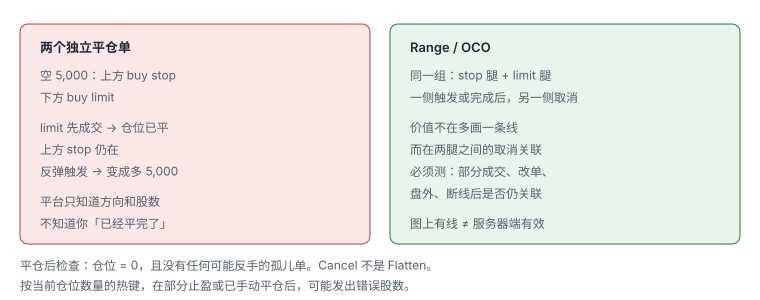
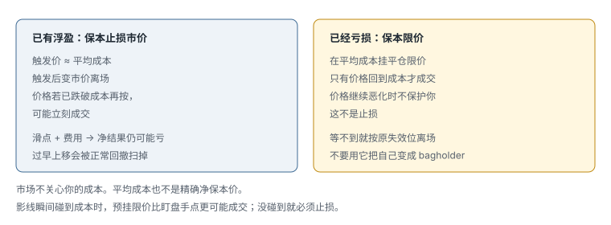

# 3.5 热键、画线下单与保本

> 一句话：热键把已经规划好的订单更快送出；它不能替你决定风险，更不能替你检查「这个订单触发后究竟是在平仓、加仓，还是反向开仓」。

上一章把盘口读懂。这一章处理动作本身。速度来自省略人工输入，也同时省略了人工复核。任何字段写错都会被更快执行：错误方向、重复下单、超大股数或反向开仓。

课程里出现过具体平台的脚本、按键和画线模板。那些东西属于当时的软件版本、券商路由和账户权限。**不要把它们当作可以贴进真实账户的配方。** 下面只保留逻辑、风险和必须自己测的边界。

## 3.5.1 先说安全边界

热键语法、route、订单类型、扩展时段支持和画线方向都可能随平台、账户、版本和券商变化。部分命令区分大小写。同一功能通过不同前端或不同券商使用时，支持程度和订单路径可能不同。官方帮助通常会写：用当前的 Script Builder / 热键编辑器看可用命令；示例必须按账户、路由和订单类型调整；使用前应先测试。

正确顺序：

1. 阅读自己平台当前说明；
2. 在 simulator / demo 中验证；
3. 用 1 股分别测试 long 和 short；
4. 测试部分成交、撤单和盘前盘后；
5. 确认不会意外加仓或反向开仓；
6. 才逐渐用于真实交易。

上线前至少在模拟账户验证：

1. 空仓、持多仓、持空仓时分别按键；
2. 部分成交后再次按键会发生什么；
3. 卖出数量超过持仓会不会反手做空；
4. 路由不可用、停牌、盘前盘后时怎样处理；
5. 按键重复或网络延迟是否会产生多个订单；
6. 撤单键是否只撤当前股票，还是撤全账户订单。

还要测：Stop Market、Stop Limit、Range / OCO 的触发和成交行为；部分成交后剩余订单如何处理；断线、延迟或券商不支持某个命令时会发生什么。

不要在开盘或持仓中临时改热键。修改后应导出带日期的版本，不能只依赖平台里一份未记录配置。

## 3.5.2 热键是预先编程的订单

热键可能把以下字段一次性发送：

- buy / sell / short / cover；
- 固定股数，或按购买力 / 当前仓位计算；
- bid / ask 加 offset；
- limit / market / stop；
- route；
- time in force；
- sell full / half / quarter；
- cancel 或 flatten。

有的平台还区分「只把参数载入订单框」和「载入并立刻发送」。这两个动作差的是整个复核窗口。选错「立即发送」，等于把还没看完的票直接扔进市场。某些「全部成交否则取消」的选项也不是「允许任意成交」；错误打开会影响部分成交行为。

执行后把默认股数改成当前仓位，可能让连续加仓数量指数式放大。增加仓位时的默认数量，更稳妥的是固定小值，而不是当前持仓。点击 Level 2 价格时自动改 order size，是另一条常见的放大路径：你点的是报价，平台却把数量改成了那一档的显示量。

## 3.5.3 固定股数热键的风险

课程示例常用「一键买 1,000 股、一键买 2,000 股」。固定股数会让美元风险随 stop distance 改变：

| 每股风险 | 1,000 股理论风险 |
|---:|---:|
| 0.05 | 50 |
| 0.20 | 200 |
| 0.80 | 800 |

更稳妥的逻辑：

```
shares = 向下取整(max dollar risk ÷ per-share risk)
```

还需受以下上限约束：

- 最大名义仓位；
- 可用购买力；
- 日均成交与 Level 2 深度；
- 券商的最大订单；
- 单只股票集中度。

课程展示过「使用 90% 购买力」的小账户挑战，并明确说不适合初学者。本书不把这种挑战模式作为建议。高杠杆全仓会把滑点、停牌和平台错误放大到不可恢复。

两种数量语义必须分清：

- **固定股数**：每次按键都发同一数量。空仓时是开仓，有仓时是加仓。
- **按当前仓位**：看起来适合平仓。部分止盈后是否自动更新、手动平仓后是否变成 0、计算时点是按键瞬间还是成交瞬间，都必须在自己的平台测试。

平台只知道订单方向和股数，不知道你的主观目的。你已经 long 5,000，却在当前价下方又画了 / 又按了买 5,000，价格到达后不是止损，而是再买 5,000，仓位变成 long 10,000。一个平仓订单在原仓位已手动关闭后仍留着，触发时可能直接建立反向 position。

## 3.5.4 Offset 的方向必须逐一验证

例如多头：

- buy limit：ask + offset；
- sell marketable limit：bid − offset。

空头和 cover 的符号关系不同。若平台把 offset 定义成绝对值、tick 或百分比，照抄 `0.10` 会产生完全不同订单。

每个热键都应在模拟器用人工计算复核：

```
当前 bid / ask:
期望 side:
期望 quantity:
期望 limit:
期望 route:
实际 order ticket:
实际 fill:
```

课程里的 5–10 美分 offset 只是当时标的经验。应按 spread、price、volatility 和 depth 调整。Offset 太小会 miss / partial fill，太大则接近 market-order 风险。

## 3.5.5 Sell Full / Half / Quarter

部分退出可以降低风险、锁定部分盈利、让剩余仓位参与延续。但 half / quarter 热键要处理：

- 奇数股的舍入；
- partial fill 后当前仓位变化；
- 多次快速按键；
- pending sell orders 尚未取消；
- 空仓时是否意外开出 short；
- 跨 symbol 焦点错误。

优先使用 reduce-only 或平台等效保护（若支持），并设置最大订单量。赢家与输家不应使用同一耐心：风险失效时优先退出，不为更好价格继续暴露。

## 3.5.6 Cancel 与 Flatten 不一样

| 动作 | 通常做什么 | 常见误用 |
|---|---|---|
| Cancel all | 取消未成交订单，不一定平仓 | 当成紧急平仓键 |
| Cancel symbol | 只处理当前标的 | 以为全账户都撤了 |
| Cancel buys / sells | 只处理一侧 | 另一侧孤儿单还在 |
| Flatten | 通常平掉当前持仓，并可能取消关联订单 | 没测过是否真的取消关联单 |
| Reverse | 平掉后建立相反方向 | 风险很高，应远离常用键 |

必须人为测试平台具体行为。不要把 `cancel all` 当作紧急平仓键。持仓归零不代表没有遗留挂单。Open Orders、Fills、Positions 是三张表，不能互相替代。

多窗口时，最致命的问题不是「看不懂图」，而是在错误窗口发送正确热键。热键作用于当前焦点、鼠标所在窗口还是固定窗口，必须搞清。Buy 与 sell-full 不应安排在容易同时或相邻误触的位置。Flatten 与 Reverse 应远离。危险动作使用组合键。限制单笔 shares / notional。打开 audible fill / reject。在模拟熟练且风控可靠之前，保留 order confirmation。

键盘贴纸能减少记忆错误，但不能防止焦点、账户和 symbol 错误。每天用测试代码或模拟账户做开盘前检查。

## 3.5.7 为什么要在 Chart 上画订单

Level 2 热键适合快速进出超短线。持仓时间稍长时，交易者可能想提前设定 Entry、Stop loss、Take profit。

图表画线的优势：

- 不必手动输入价格；
- 价格位置更直观；
- 可以拖动线快速修改；
- 便于提前规划，而不是临场情绪化下单。

不同平台的演示方式不同：有的是先挂出订单，再在 chart 上拖动对应线；有的用专门热键进入画线模式。图上的水平线代表已经生成的订单，不只是视觉标记。Level 2 / 订单窗口应同时出现相应委托，必须核对价格、方向和股数。拖动图上水平线会修改订单价格，修改后还要确认券商端已经接受。快速行情中拖线动作和券商确认之间可能有延迟，不能只凭图线位置认为订单已修改。手动平仓后应检查这条线是否仍在，避免之后触发反向仓位。

## 3.5.8 画线限价：位置决定方向

限价单限制可接受的成交价格：Buy limit 只在限价或更低成交；Sell limit 只在限价或更高成交。它保证价格边界，但不保证一定成交，也可能只成交一部分。

在某些画线模式里，同一个热键会根据画线位置相对当前股价自动判断方向。假设当前价格 5.00：

- 线画在 4.00（当前价下方）→ buy order；
- 线画在 6.00（当前价上方）→ sell order。

这可以用于：下方埋伏 long entry、下方 cover short、上方卖出 long、上方建立 short。

最大危险仍是意外加仓或反手。仓位状态已经变化时，原本想平仓的线可能变成加仓或反向开仓订单。固定股数和「按当前仓位」是两种完全不同的数量行为。如果仓位已经变化，按当前仓位发出的单可能变成 0 股、半仓或反向开仓。

## 3.5.9 画线止损市价

Stop price 被触发后，订单转为 market order。优点是优先尽快离场；缺点是实际成交价不保证。快速行情、低量或 halt resume 后可能产生很大 slippage。

适合已经入场并打算持有稍久的交易：

1. 建立 position；
2. 立即在图表上画结构性止损；
3. 让订单留在市场；
4. 不必一直手动盯住每个 tick。

图上的止损线必须与结构失效点对应，不能只为了缩小账面亏损随意贴近。StopMarket 只指定触发后的订单类型，不保证最终成交在那条蓝线价格。

风险：

- Gap 或快速 flush 会在远离 stop price 的位置成交；
- Halt 期间无法成交，resume 后可能跳空；
- 按当前仓位计算的时点要测试；
- 部分止盈后，原 stop size 是否自动更新不能想当然；
- 手动平仓后必须确认 stop 已取消；
- 暂停期间即使 stop 已触发，也可能要到恢复交易后才有机会成交。

## 3.5.10 为什么不能简单同时挂两个独立平仓单



假设 short 5,000 股：

- 上方挂 buy stop-market 作为止损；
- 下方挂 buy limit 作为止盈。

如果价格先下跌，take-profit limit 成交，short 已经完全 cover；但上方 stop 仍然存在。之后价格反弹触发该 stop：

- 它会再买 5,000 股；
- 原本用于 cover 的订单现在可能建立 long 5,000；
- 交易者如果已离开电脑，风险会继续扩大。

反方向的 long position 也有同样问题。平台只知道方向和股数，不知道你「已经平完了」。

## 3.5.11 Range / OCO：成对止盈止损

Range order 同时定义两个价格：Stop price 与 Limit price。其中一侧触发 / 成交后，另一侧订单应被取消。它的逻辑类似 OCO（One Cancels the Other）。不同界面可能叫 low price / high price，或 stop price / limit price。

### Short 示例

- Entry 在中间；
- 上方 stop price：若价格上涨 / squeeze，market cover 止损；
- 下方 limit price：若价格下跌到目标，limit cover 止盈；
- 任一侧完成后，另一侧取消。

### Long 示例

- Entry 在中间；
- 下方 stop price：跌破时 market sell 止损；
- 上方 limit price：上涨到目标时 limit sell 止盈。

「一边成交后另一边取消」听起来简单，但实际要测试：

- 触发即取消，还是完全成交后才取消？
- Partial fill 怎样处理？
- 修改一条线是否破坏 OCO 关联？
- 盘前盘后是否支持？
- Stop leg 是 market 还是 limit？
- 断线、平台退出后订单是否仍在服务器？

拖动 stop 或 target 后，要检查另一腿的 OCO 关联是否仍保留。图线存在不代表服务器端一定有效，订单窗口状态才是最终核对点。若只部分成交，剩余数量与另一腿数量是否同步是最需要测试的边界条件。

## 3.5.12 两种「保本」不是同一种工具



把 stop 放在 average cost：

- 触发后仍可能滑点；
- 佣金和费用使净结果为负；
- spread 可能让触发价与成交价不同；
- average cost 在加减仓后会改变；
- 过早移动 stop 可能让正常回撤退出。

所以称 breakeven stop 只是价格参考，不是结果保证。

### 已有浮盈：保本止损市价

当 position 已经盈利、价格朝有利方向移动后，把 stop-market 放到平均成本。若价格回到 entry：

- Long：触发 sell market；
- Short：触发 buy market；
- 目标是在 breakeven 附近离场。

重要陷阱：若当前 trade 已经亏损，市场价格已经越过平均成本，新 stop 可能立即满足触发条件，按热键后会马上离场。即使在盈利，market fill 仍可能因 spread / slippage 低于成本。所谓 breakeven 不保证净利润为零，还要算费用。

### 已经亏损：保本限价

当 position 已经亏损，但交易者预期价格可能短暂反弹到 entry，可把平仓 limit 放在平均成本。

例如 long：

1. Entry 后价格下跌；
2. 在平均成本挂 sell limit；
3. 若短暂反弹回成本，订单自动卖出；
4. 若反弹不到，就不会成交。

Short 则在平均成本挂 buy limit。

**这不是 Stop Loss。** 它只表达「如果回来成本就平仓」，不能保护继续恶化的亏损。它位于市场上方（对 long 而言），价格继续下跌时不保护仓位。所以它必须配合独立的失效条件，绝不能代替 stop loss。

处理原则：

- 出现短暂反弹机会时才使用；
- 若价格继续往不利方向走，取消等待；
- 立即用正常 stop / sell at bid 等方式离场；
- 不要为了等 breakeven 变成 bagholder。

它很容易强化错误心理：「我不接受亏损，只要再等一下，它一定会回到成本。」市场不关心你的成本价。若结构已经失效，继续等待只会扩大损失。Breakeven limit 应是极短暂的执行工具，不是取代止损的理由。

## 3.5.13 影线碰到成本的一秒

一个教学序列：亏损仓位，Level 2 下方出现承接，判断可能有很短的反弹，用保本限价把 exit 放在 entry。下一根 K 的上影线短暂触及成本，limit 成交后，价格马上继续下跌。

如果靠手动盯 Level 2，这个机会可能不到一秒；预挂订单提高了成交机会。随后价格继续向下，说明这不是趋势反转，只是极短反弹。这张「成功成交」最容易诱发「亏损都可以等回来」的误解。

正确结论是：若预先观察到极短反弹机会，limit 可改善执行；若价格没有立即回来，就必须按原止损退出。如果没有触及、K 线继续收在低位、下一根准备跌破前 low，就应马上止损，不能继续等。

## 3.5.14 五种工具对照

| 工具 | 主要目的 | 价格保证 | 成交保证 | 最大风险 |
|---|---|---|---|---|
| Limit | 指定可接受价格 | 有边界 | 无 | 不成交 / 部分成交 |
| Stop Market | 触发后尽快离场 | 无 | 相对优先 | Slippage |
| Range / OCO | 同时设置止盈止损 | 两腿不同 | 取决于订单 | OCO / partial-fill 行为 |
| Breakeven Stop | 盈利后保护到成本 | 触发价是成本，fill 不保证 | 相对优先 | 实际非 breakeven；已亏损时可能立刻触发 |
| Breakeven Limit | 亏损时反弹到成本退出 | 有 | 无 | 等不到、亏损继续扩大 |

## 3.5.15 订单生命周期检查

### 入场前

- Entry、stop、target 已定义；
- 方向和 share size 正确；
- Route / TIF 合适；
- 热键已在 demo 验证。

### 入场后

- Position 数量与预期一致；
- Stop 确实存在；
- Stop 方向是「减仓」，不是「加仓」；
- Range / OCO 两腿已经关联。

### 部分止盈后

- 剩余 position 数量；
- Stop size 是否同步；
- 是否留下多余订单。

### 完全平仓后

- Position = 0；
- 所有 stop / limit / range 子订单已取消；
- 没有可能反向开仓的 orphan order。

## 3.5.16 热键变更流程

1. 记录变更原因；
2. 导出旧配置；
3. 在收盘后修改；
4. 静态检查 side、size、price、route、TIF、account；
5. 模拟环境测试正常、partial、reject、halt 场景；
6. 重启软件再次测试；
7. 小规模实盘验证；
8. 观察至少数日错误率，再扩大使用。

无论导入谁的热键文件，都要逐条阅读逻辑，换成自己的账户和风险数值后在模拟环境测试。课程脚本属于当时的平台与券商配置，不能直接复制到当前实盘。

## 3.5.17 最小工作区

新闻窗口回答催化剂，扫描器发现候选，图表提供结构，Level 2 / T&S 展示执行环境。窗口越多不代表信息越好。最关键的账户、symbol、仓位、未成交订单和风险数据应放在不易看错的位置。

推荐最小布局：

1. 一张日线 / 5 分钟背景图；
2. 一张 1 分钟执行图；
3. Level 2 + Time & Sales；
4. 当前仓位与未成交订单；
5. 新闻与基础数据；
6. 交易日志入口。

图表、Level 2、Time & Sales 必须链接为同一 symbol。盘中复盘信息不应当遮挡 open orders 和 positions。外接显示器断开时，窗口可能仍加载在不可见坐标；应另存一套单屏布局，并保证主交易窗口能在主屏恢复。

软件界面、行情套餐、佣金和路由在录制后均可能变化，应重新配置而非复制截图。Broker、front end、market data vendor 可能是不同实体，故障点也不同。选平台依据当前文档和测试，不照搬课程旧品牌组合。

## 先记住这些

- 热键是加速器，会同时放大良好流程和配置错误。
- 固定股数让美元风险随止损宽度变化。按风险反推股数。
- 平台只知道方向和股数，不知道你想平仓还是加仓。
- 两个独立平仓单会留下反向仓位。Range / OCO 的价值是取消关联。
- 保本止损市价用于已有浮盈；保本限价用于浮亏时等短暂反弹。后者不是止损。
- 平均成本不是精确净保本价。滑点和费用仍可能造成亏损。
- Cancel 不是 Flatten。仓位归零后还要查孤儿单。
- 图上有线 ≠ 服务器端有效。

## 不要做的事

- 把某套课程热键脚本直接贴进真实账户。
- 没测过空仓 / 有仓 / 部分成交 / 卖超持仓就实盘连点。
- 用 90% 购买力或固定 1,000 / 2,000 股当默认仓位。
- 把 cancel all 当成紧急平仓。
- 为了等保本限价成交，取消原来的止损。
- 在开盘或持仓中临时改热键。
- 平仓后不检查图上的订单线是否还在。
