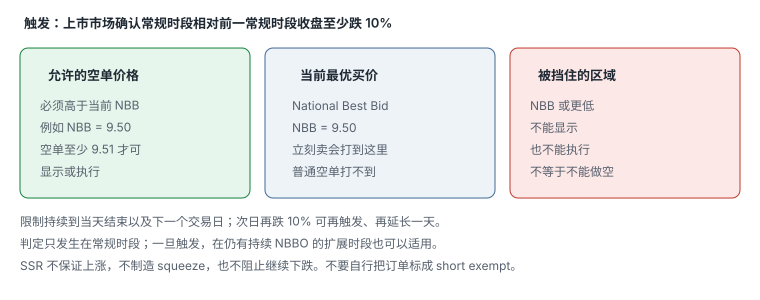

# 3.7 SSR

> 一句话：SSR 不是禁止做空，只是限制普通空单必须高于当前最优买价（NBB）才能显示或执行。它不保证上涨，也不制造 squeeze。

做空的借股、Locate、强制回补在卷六。这一章只处理 Regulation SHO **Rule 201** 的价格测试：它什么时候触发、限制写在哪一档价格上、怎样改变你的成交，以及为什么屏幕上的 SSR 标签不能当方向信号。

官方入口：[SEC Rule 201 FAQ](https://www.sec.gov/divisions/marketreg/rule201faq.htm)、[Nasdaq Short Sale Circuit Breaker](https://www.nasdaqtrader.com/trader.aspx?id=shortsalecircuitbreaker)。Regulation SHO 的概述文里结算周期可能仍写 T+2，机制部分仍有用；现行美股标准结算是 T+1，见附录 A。

## 3.7.1 准确含义



上市市场确认某只股票在**常规时段**相对前一常规时段收盘价下跌至少 **10%** 后，触发短路器。10% 是由上市市场依据合并成交数据判定，不是交易者看图自行宣布。

Rule 201 要求交易中心建立、维护并执行书面政策和程序，合理地防止：在短路器触发后，对 covered security 的空单在**小于或等于当前 National Best Bid** 的价格上显示或执行。换成人话：

```
普通 short order 必须高于当前 NBB，才能被显示或成交。
```

例如当前 NBB = 9.50：

- 普通空单不能挂在 9.50，也不能打到 9.50 或更低；
- 至少要在 9.51（或更高，取决于最小跳动）才可能显示或执行；
- 你立刻卖会打到 bid；普通空单打不到 bid。

这就是所谓 alternative uptick rule。它限制的是**价格**，不是「能不能空」。

平台界面上的 SSR 标识只说明平台状态，仍要以券商和上市市场信息为准。课程截图里的红字不能替代官方列表。

## 3.7.2 持续多久

限制通常持续：

- 触发当日剩余时间；
- **下一个交易日**；
- 若下一日再次下跌至少 10%，会重新触发并延长。

判定只发生在常规时段。一旦触发，在仍有持续 NBBO 的扩展时段也可以适用。FAQ 的表述是：触发后，价格测试适用于当天剩余时间和次日，只要该证券的 national best bid 仍由计划处理器按有效的 NMS 计划计算并持续发布。

用日历把「下一个交易日」写死，避免把周末和假日算错：

| 触发时刻 | 限制覆盖 |
|---|---|
| 周二常规时段确认跌满 10% | 周二剩余时间 + 整个周三 |
| 周五常规时段确认 | 周五剩余时间 + 下周一（若周一是交易日） |
| 周三已在 SSR，周三又相对周二收盘再跌 10% | 再延长一天，覆盖到周四 |
| 只在盘前相对昨收跌了 10%，常规时段尚未确认 | 还不能自己宣布 SSR；等上市市场确认 |

因此：

- 盘前你看见 SSR，可能是**昨天**已经触发、今天还在生效，不一定是今天又跌了 10%；
- 今天常规时段刚触发，盘后只要还有持续 NBBO，限制仍可能套在你的空单上；
- 次日开盘不要默认「过了一夜就自由了」。次日全天仍在限制里，除非你核过官方状态；
- 「再跌 10%」的比较基准是**前一常规时段收盘**，不是触发当天的盘中低点，也不是你自己画的 VWAP。

平台旗帜、扫描器颜色和聊天室口播都可能滞后或超前。下空单前以券商状态和上市市场 / 计划处理器的公开信息为准。

## 3.7.3 它不是什么

把下面几条写进计划，避免把标签当成策略：

- SSR **不是**不能做空。
- 它不保证股价会涨。
- 它不制造 squeeze。
- 它不阻止股票继续下跌。
- 它不是 Locates 变少的同义词。借不到股票是另一件事。
- 它不是「空头已经被消灭」。已经建立的空仓仍然在，只是新的普通空单更难主动打到 bid。
- 它不是 A 股意义上的「限制卖出」。多头卖出不受这条价格测试约束。
- 它不是你的方向过滤器。标签本身没有期望值。

强上涨可能来自多种买盘来源。SSR 只改变部分短卖订单的价格测试。价格上涨后仍可出现持续下跌，不能用「SSR 在」判断方向。观察借股紧张、成交量、回补压力和关键位失败，比只看一个状态标签有效。

## 3.7.4 执行上到底改了什么

简化理解是：普通 short order 要在当前最佳买价之上等待，而不能主动打到 bid。因此：

- 快速下跌时，普通短卖单可能排队而未成交，实际入场会晚于设想；
- 价格反弹、ask 附近出现可成交机会时，空单可能更容易成交——那往往也是更差的入场；
- 回测若直接使用 K 线触价假设成交，会高估 SSR 环境下的执行质量；
- 「我想在 9.50 砸空」在 SSR 下可能根本不会显示，更不会成交。

把上一章的三个价格拿回来：

| 价格 | SSR 下的空单 |
|---|---|
| 看到的价格 | Last 可能已经在 bid 上往下走 |
| 允许的最差价格 | 你的空单限价必须高于当时 NBB |
| 实际成交 | 可能比你看到的下跌「晚一截」，成交在反弹里 |

这会系统性扭曲两类策略：

1. **追空下跌**：你看见的是已经打在 bid 上的主动卖。普通空单不能加入那一侧。等你能成交时，价格可能已经弹回来。
2. **阻力位做空**：若阻力就在当前 bid 附近，空单可能无法按计划价格挂出。要么等到 bid 下移后你的限价相对变成「高于新 NBB」，要么你把限价抬到 ask 附近，等于用更差的价格换成交。

Level 2 上你会看到：bid 一侧仍有人在卖，但那不一定是普通空单。多头减仓可以打 bid。SSR 限制的是 short sale 的显示与执行，不是所有卖出。Tape 上连续打在 bid 的红单，在 SSR 日更不能自动翻译成「空头在砸」。

热键也要跟着改语义。若你有一组「卖在 bid / 略低于 bid」的空单键，SSR 日它可能被拒、被改价，或发出一张根本不能显示的单。应收起这组键，改用「限价高于当时 NBB」的空单，或干脆不空。不要在拒单后连点，把一张被拒的 bid 空单连发成一串。

盘中刚触发时，已经挂在 NBB 或以下的普通空单可能被取消、拒绝继续显示，或被交易中心按政策和程序处理。不要假设「早上挂的单下午还在原价」。触发后立刻核对 Open Orders：还在不在、价格是否仍合法、数量是否还是你以为的那个数。

## 3.7.5 一个数字序列

假设前一常规时段收盘 10.00。常规时段某刻上市市场确认该股已跌到 9.00 或更低，触发 Rule 201。此后：

当前报价 Bid 8.80 × 2,000 / Ask 8.82 × 500。

你想空 1,000 股：

- **打 bid 的市价空单**：交易中心的政策和程序应阻止它在 8.80 或更低显示或执行。你以为自己在「市价空」，实际可能被拒、被改价，或变成必须高于 8.80 的订单。
- **限价空 8.80**：等于挂在 NBB，通常不能显示。
- **限价空 8.81**：高于当前 NBB，原则上可以显示。它不一定立刻成交。买方必须愿意买到 8.81，或 NBB 上移。
- **限价空 8.82 或更高**：更接近 ask，成交机会更大，入场更差。

几秒后报价变成 Bid 8.70 / Ask 8.73。你原来挂在 8.81 的空单现在远高于新 NBB，变成排队在市场上方的被动卖单。下跌继续，你还没进场。这就是「K 线已经跌破，回测当作成交，实盘却还在排队」。

再几秒后价格反弹到 Bid 8.80 / Ask 8.84。你的 8.81 空单可能突然成交。你空在反弹里，而不是空在你当初看见的 8.70。

把这一段写进日志：计划空价、当时 NBB、订单是否被显示、实际成交价、迟到了多少。SSR 日的滑点统计必须和普通日分开，否则你会高估阻力空的可执行性。

同一逻辑反过来看多头。SSR 让部分新空单更难主动打 bid，并不自动让你的多单更好成交。Ask 薄、点差宽、停牌风险，和有没有 SSR 是分开的账。多头仍按第一章的三个价格记账。不要因为「空头不好砸」就把可成交限价的 offset 放大到接近市价。

## 3.7.6 怎样当场读 NBB

National Best Bid 是全市场当前最高买价，不是你这一个 Level 2 窗口里看起来最高的那一档。订阅不完整、场所缺档、数据延迟，都会让屏幕上的「best bid」和规则里的 NBB 短暂不一致。

操作上：

- 空单限价不要贴着自己窗口里的 bid 一分钱就完事，快速行情里那一分钱可能已经过时；
- 点差突然拉宽时，先问 NBBO 是否还在连续发布，再问自己的限价是否仍高于新 NBB；
- 最小跳动随股价变化。低价股的「高于 NBB」可能是 0.0001 或 0.01，取决于证券和场所规则。不要把 10 美元股票的一分钱习惯套到 0.40 的票上。

你无法从零售 Level 2 重建交易中心内部的合规引擎。能做的是：让自己的空单明显停在 bid 上方，并接受「可能排队、可能不成交」。

课程开头那类 Gap-Up 之后长期回落的图，不能用来假设最高点容易做空。从顶部到下跌确认之间可能有多次剧烈反弹，空头 stop 必须按局部结构设置。SSR 若在下跌途中亮起，只会让你更难把反弹里的空单打在理想价。复盘应标出当时可见的入场触发，而不是只展示完整右侧结果。

## 3.7.7 Short exempt 不是给你开的后门

法规存在特定例外。交易中心和券商有自己的政策和程序。普通交易者不要自行把订单标成 short exempt。

例外是给满足规则条件的券商、做市和特定客户保护情形的，不是给你开的后门。课程或论坛里「勾上 exempt 就能打 bid」如果出现，当作危险建议丢掉。错标订单是合规问题，不是执行技巧。

期权和其他衍生品上的合成空头，本身不一定受这条股票空单的显示 / 执行限制；用来对冲这些头寸的正股仍受 Rule 201 约束。这不是鼓励用期权绕开 SSR，只是避免把规则说成「所有看空敞口都被禁止」。正股空单该受限还是受限。

## 3.7.8 停牌恢复、开盘拍卖与 SSR

开盘或 halt resume 的第一笔往往是拍卖或一次性撮合，不是连续交易里的普通单笔。SSR 若已在生效，恢复后的第一批普通空单仍然要满足「高于当时 NBB」——但恢复瞬间 NBB 可能还没稳定，quotes 在重置，spread 可以极宽。

不要用「复牌第一秒市价空」去赌方向。那是把拍卖未知价、可能立刻再 halt、以及 Rule 201 的价格测试叠在同一张无保护订单上。恢复后先看：交易状态是否已是连续交易、NBBO 是否连续发布、你的空单限价是否仍高于新 NBB。

LULD 最后 10 分钟若已转入收盘程序，连续交易意义上的「打 bid 空」本来就不存在。SSR 不会在收盘拍卖里给你额外的方向优势。

## 3.7.9 与 Locate、借股不是同一件事

SSR 管价格测试。Locate 管你能不能借到股票去交割。两者经常同时出现在大跌的小盘上，但机制独立：

- 有 Locate、股票在 SSR：你可以空，但不能在 NBB 或以下显示 / 执行。
- 没有 Locate：即使没有 SSR，很多硬借股票你也空不了。
- Easy-to-borrow 清单上的股票触发 SSR：借得到，仍然不能打 bid 空。

不要把「SSR + hard to borrow」读成一条消息。一个是价格规则，一个是库存。卷六写 Locate。这里只要记住：SSR 标签亮起，不自动说明借股费、库存或强制回补发生了变化。

## 3.7.10 回测、模拟盘与实盘的缺口

模拟盘和很多回测引擎不知道 Rule 201。它们看到 K 线碰到你的空单价格，就记一笔成交。SSR 日这是假成交。

至少要在日志里标：

- 该标的当日是否在 SSR（以及是当天触发还是昨日延续）；
- 你的空单是打 bid、挂在 NBB 上方，还是打 ask；
- 是否被拒、被改价、排队后在反弹里成交；
- 计划价与实际价的差。

转实盘后，仓位应小到足以观察真实滑点和心理反应。模拟盘连续盈利不证明策略已排除抽样偏差，也不代表 SSR 日的真实成交同样好。

课程画面里的旧标识和订单行为必须用当前券商环境验证。平台把 SSR 显示成旗帜、颜色还是单独一列，都不改变规则本身。

## 3.7.11 工作区里 SSR 放哪

新闻窗口回答催化剂，扫描器发现候选，图表提供结构，Level 2 / T&S 展示执行环境。SSR 状态属于「当前规则约束」，应和 LULD band、short availability 放在同一眼能看到的位置，而不是埋在某个需要点开的菜单里。

它回答的问题只有一个：**我现在的空单价格测试是什么。** 它不回答：

- 该不该空；
- 会不会挤空；
- 明天会不会涨。

扫描器列出的 gap、价格、float 和 volume 是候选排序，不是策略结论。不同数据源的 float、新闻速度和盘前量可能不一致。「带 SSR」可以当过滤条件，不能当入场理由。

## 3.7.12 个人规则里怎么写 SSR

好规则必须可观察。例如：

| 类别 | 可执行的写法 | 不可执行的写法 |
|---|---|---|
| Setup | 只交易事前定义的 2–3 类结构；SSR 日额外要求空单限价高于当时 NBB | 「看情况空」 |
| Execution | SSR 下禁止按「打 bid」那组热键发空单 | 「注意一下 SSR」 |
| Review | 收盘后保存入场前截图，并写计划价、当时 NBB、实际滑点 | 只看盈亏 |
| Behavior | 连续两笔因 SSR 排队不成交却强行改市价后停止 | 「保持纪律」 |

禁止在 halt 中排无价格保护的市价单，和禁止在 SSR 下假装自己能打 bid，是同一类规则：先承认订单约束，再谈方向。

每月根据日志评估规则，不因单笔结果临时改动。SSR 日赚了一笔大的，不能证明「SSR = 做多」。SSR 日空单没成交，不能证明「以后都不空 SSR」。

## 3.7.13 和停牌、盘外叠在一起时

同一只股票可以同时：

- 在 SSR 里；
- 贴近 LULD lower band；
- 在盘前或盘后交易。

叠在一起时，约束是相加的，不是互相取消的：

- 停牌期间你仍然出不去，SSR 帮不了你，也害不了已经进不去的市场。
- 盘外若仍有持续 NBBO，已触发的 Rule 201 仍可能套在空单上；同时盘外深度更差、很多券商只接受限价。
- 贴近 lower band 时，继续追空的尾部风险是 halt down，不是「SSR 会托住价格」。

开仓前把三张检查表一起过：LULD 距离、SSR 状态、时段与 TIF。缺一张，执行计划就是不完整的。

## 3.7.14 常见错误

1. 把 SSR 读成「不能做空」。
2. 把 SSR 读成「必涨」或「空头挤压」。
3. 用 K 线触价回测 SSR 日的空单，当作成交。
4. 自行把订单标成 short exempt。
5. 看见平台旗帜就追多，不看位置和流动性。
6. 下跌中反复改价试图打到 bid，直到变成接近市价的乱单。
7. 把昨日延续到今日的 SSR 当成今日新跌 10%。
8. 把 SSR 和借不到股票当成同一件事。
9. 在扩展时段假设规则自动关闭。
10. 用课程录屏里的按钮路径代替当前券商文档。

## 先记住这些

- SSR = 空单价格限制：必须高于当前 NBB。不是做空禁令，也不是必涨。
- 触发：上市市场确认常规时段相对前收至少跌 10%。不是你自己量出来的。
- 持续到当天结束以及下一个交易日；次日再跌 10% 可再触发、再延长一天。
- 判定只发生在常规时段；一旦触发，在仍有持续 NBBO 的扩展时段也可以适用。
- 普通账户不要自行标 short exempt。
- 回测和模拟盘往往会假装你打到了 bid。实盘日志必须把计划价和实际价拆开。
- 工具只负责提供状态，不能替代 setup 和风险边界。

## 不要做的事

- 把 SSR 当成空头挤压信号去追多。
- 在快速下跌里假设市价空单能打到 bid。
- 用「勾 exempt」当执行技巧。
- 把 K 线回测里的理想空价写成实盘期望。
- 看见 SSR 就不看 Locate、不看 LULD、不看点差。
