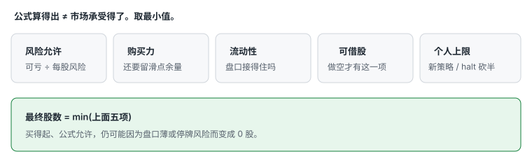
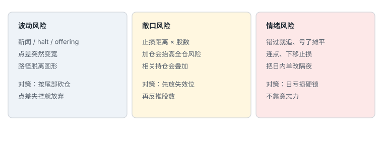
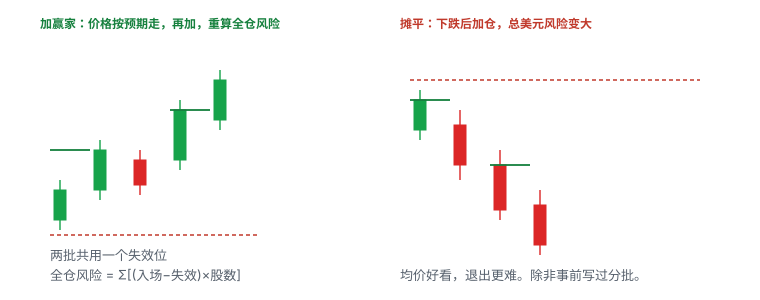

# 4.1 仓位、期望值与三类风险

> 一句话：止损定股数，不是股数定止损。单笔绿不评价策略，期望值才评价。

前面几卷讲的是：你在交易什么、图怎么读、单怎么下。这一卷开始回答另一件事——**错了你会亏多少，对了你平均能拿回多少，连续错一串会不会失去继续验证的资格**。没有这三句话，形态再熟也只是在用购买力赌方向。

课程里会同时出现几套数字：每股先赚 10 美分、固定 1,000 股、小账户单日冒 5%–10%、模拟盘每笔最多亏 50 美元。它们都是**某位讲者在某段市场里训练自己的启发式**，不是物理定律，也不是你必须抄的仓位。本章只保留计算框架：三个必须分开的数字、从失效位反推股数、期望值、三类风险、加仓怎么重算、日亏损上限为什么是硬锁。个人百分比、固定美分数、固定股数，全部标成启发式，改完写进计划，用自己的样本验证。

## 4.1.1 交易是概率问题，不是猜对方向

单笔盈利不能证明策略有效，单笔亏损也不能证明策略无效。需要在**相同定义**下记录足够多的样本：同一形状、同一位置、同一触发、同一失效、同一退出规则。换了退出规则，胜率和平均盈亏都会变，那是另一套策略。

策略和经验提高的是**条件概率**，不是把下一笔变成确定事件。「胜率超过 50%」仍不足以判断能不能活：还要比较平均盈利和平均亏损，还要扣掉成本。模拟盘能练流程，但成交质量、心理压力、借股条件和停牌恢复，与实盘不同。模拟绿了，只说明你在那个环境里按按钮的顺序大致对了。

期望值可以先写成：

```
EV = 胜率 × 平均盈利 − 败率 × 平均亏损 − 平均交易成本
```

例如胜率 45%、平均赚 2R、平均亏 1R，忽略成本时：

```
0.45 × 2R − 0.55 × 1R = +0.35R
```

这里的 **R 是这一笔的计划风险**，不是固定美元数。不同交易的 1R 美元数可以不同，只要不超过你的单笔上限。比较策略时用 R，不要用「今天赚了 800 美元」——那可能只是仓位翻了倍。


盈亏平衡胜率（忽略成本）为：

```
盈亏平衡胜率 ≈ 平均亏损 ÷ (平均盈利 + 平均亏损)
```

平均赚 2R、亏 1R，理论盈亏平衡胜率约 **33.3%**。计入佣金、滑点、拒单之后会更高。所以：胜率过 50% 既不是必要，也不是充分。只追胜率会让人过早止盈、拖延止损。只追纸面盈亏比会忽略目标根本成交不到。

一笔交易不是因为结果只有赢/亏就各 50%。胜率来自 setup 条件、退出规则、数据与成交、市场状态、以及你自己的执行行为。同一 setup 如果过早止盈，胜率可能升高但平均盈利下降；把止损放宽，也可能制造「高胜率」并积累罕见巨亏。

## 4.1.2 三个必须分开的数字

购买力告诉你「能开多大」，不告诉你「能亏多少」。必须把下面三个数分开写，混在一起就会用名义市值当风险，或用计划止损当最大损失保证。


| 名字 | 算法 | 它管什么 |
|---|---|---|
| 名义敞口 | 入场价 × 股数 | 你在市场上的规模 |
| 计划风险 | \|入场价 − 失效价\| × 股数 | 连续成交时你打算亏多少 |
| 尾部风险 | 跳空、停牌、没流动性时超出计划的部分 | 计划止损覆盖不了的部分 |

例：账户 2,000 美元，5.00 买 1,000 股，计划 4.80 止损。

- 名义敞口 5,000；
- 计划风险 200；
- 若停牌后直接跳到 4.50，实际约亏 500，还没算费用。


「止损价」只是计划输入，不是最大损失保证。对可能 halt 的低流通股票，`$40` 的计划风险并不是保证最大损失；必须进一步减仓，或直接放弃。

日内交易常直接用心算：

```
美元波动 = 每股价格变化 × 股数
```

长期投资者看投入总金额和年度百分比。超短线要在几秒或几分钟内判断：一根正常 K 大约移动多少美元、当前 size 会让账户跳多少、止损距离对应多少实际美元。这是心算工具，**不能单独决定仓位**。真正下单仍按「入场 − 失效 + 滑点」计算。

毛盈亏还不是口袋里的钱：

```
Long  毛盈亏 = (卖出价 − 买入价) × 股数
Short 毛盈亏 = (卖空价 − Cover 价) × 股数
净盈亏 = 毛盈亏 − 佣金 − 平台/路由费 − 监管费 − Locate/借券 − 滑点
```

做空难借的股票尤其要把 Locate 费提前纳入。若预期每股只赚 0.05，但 Locate 已经每股 0.08，方向看对仍可能亏钱。

## 4.1.3 股数从失效位反推

正确顺序永远是：

1. 找到结构失效点（判断错了，价格会先走到哪里）；
2. 估算现实能成交的入场价；
3. 加入滑点预留；
4. 算出每股风险；
5. 用单笔可承受美元风险反推股数；
6. 再按购买力、流动性、停牌风险和个人上限往下砍。

```
每股风险 = |预计入场 − 失效价| + 预留滑点
股数 = floor(单笔可承受亏损 ÷ 每股风险)
```

滑点不能抄一个固定美分。点差宽、盘口薄、开盘三分钟、停牌前后，预留要加大；加大之后股数必须变小。

### 例 1：基础多单

- 最大可承受亏损：100 美元；
- 入场：5.00；
- 失效价：4.85；
- 预留滑点：0.05；
- 每股风险：0.20；
- 最大股数：`100 ÷ 0.20 = 500`。

### 例 2：止损变远，股数必须变小

- 计划 long at 5.00，结构止损 4.80，每股风险 0.20；
- 单笔最多亏 200 美元 → 1,000 股。
- 若止损必须放到 4.50：每股风险变成 0.50，同样 200 美元只能用 400 股。

这说明 share size 取决于「判断错误需要走多远」，而不仅是预期能赚多少。

### 例 3：把滑点写进去

- 最大风险：50 美元；
- 预计入场：5.10；
- 结构止损：4.98；
- 滑点预留：0.03；
- 每股风险：0.15；
- 股数：`floor(50 / 0.15) = 333`。

如果入场价已经离失效位很远，同样的 1R 美元只能买更少的股——这叫**追**。追的定义是**离失效位远**，不是离底部远。止损不会因为你买得更高就跟着上移。


错误顺序是：

1. 想赚 0.10；
2. 因此 stop 设 0.05；
3. 再寻找图形解释。

正确顺序是：

1. 找结构失效点；
2. 估算现实入场和滑点；
3. 计算每股风险；
4. 看第一目标是否提供足够空间；
5. 不够就跳过，而不是把止损挤近。

课程有「每天抓 10 美分、亏损也控制在 5–10 美分」的训练思路。这是**启发式**。只有当结构止损恰好落在这个距离内才成立。高价、高波动股票不可能因为热键固定 0.10 就变成低风险。

固定 1,000 股不叫固定风险。同一只股票，止损 0.10 和止损 0.40，1,000 股的美元风险差四倍。

## 4.1.4 最终股数取多个上限的最小值

公式算得出，不等于市场承受得了。



```
最终股数 = min(风险允许, 购买力允许, 流动性允许, 可借股数, 个人上限)
```

**风险允许**：由最大亏损与止损距离决定。

**购买力允许**：`可用购买力 ÷ 预计入场价`，还要留出滑点、费用和价格快速变化的余量。买得起不等于仓位合理。

**流动性允许**：仓位不能大到无法正常退出。看每分钟成交量、买卖盘深度、点差、预期止损时有没有人接、自己的订单会不会显著推动价格。低量股票用理论上算得出的超大 size，是把「表格里的利润」当成可实现利润。

**可借股数**：做空还受 locate / 库存限制。没有股票可借，股数就是 0。

**个人或策略上限**：即使所有公式允许，也可以主动设更低上限——新策略、新闻股、halt 风险、睡眠不足、情绪状态不佳。这不是胆小，是承认尾部。

比较成本时用点差百分比，不要只看绝对美分：

```
点差% = (ask − bid) ÷ 中间价
```

0.01 的点差对 0.20 美元的股票约 5%，对 20 美元的股票约 0.05%。更细的报价增量不会自动增加可交易性。

## 4.1.5 股价贵不贵，决定不了风险

新手常见规则：「便宜股用大 size，贵股用小 size」。单价不能代表波动。

反例 A：一只 5 美元股票每根 K 可能移动 0.50。1,000 股的一根正常波动 = 500 美元。

反例 B：一只约 19–20 美元的股票每根 K 可能只移动 0.10。200 股只对应 20 美元；若想让 0.10 的移动对应 500 美元，需要 5,000 股，约 100,000 美元购买力，还可能买不进去、出不来。

```
股价高 ≠ 波动一定大
股价低 ≠ 风险一定小
```

两张图的纵轴尺度不同，不能只比较蜡烛在屏幕上的像素高度。先读价格轴上的实际差值，再决定 size。

视频里用「正常一根 K 可能带来多少 profit/loss」帮助建立波动感。这适合快速比较不同股票，**不能单独决定真实仓位**。完整计算仍要先定义入场、失效、单笔最大允许亏损。

## 4.1.6 同一天里波动会突然换挡

盘前每根 K 约波动 0.30–0.50 时，1,000 股对应约 300–500 美元的一段正常波动。开盘后同一只股票可能变成每根 3–4 美元。若仍用 1,000 股，单根 K 的美元盈亏会从几百变成几千。若只希望把一段正常波动控制在几百美元，size 必须明显下降，例如 100 股。

**不能因为盘前用过 1,000 股，开盘后就继续固定用 1,000 股。**

放大因素包括：成交量突然增加、空头回补加速、触发波动停牌、连续向上停牌、停牌恢复后剧烈跳动。应以「最近几根、最能代表当前状态的 K」为参照，而不是半小时前的平均波动。价格正在加速时，历史 K 的估算仍可能滞后，此时进一步减仓或跳过，比精确计算更重要。

动态调整流程（启发式，用来组织观察，不是固定根数）：

1. 观察最近 3–5 根相同周期的 K；
2. 估算正常高低点区间；
3. 检查是否接近新闻、开盘或 halt 恢复；
4. 根据计划的美元风险反推 size；
5. 波动突然放大时主动减仓或跳过；
6. 每笔新交易重新计算，不沿用上一笔 size。

课程常用「每股先赚 10 美分」当训练目标。对 3 美元和 100 美元股票，10 美分的意义完全不同；对点差已经 0.10 的股票更没有意义。目标应根据第一技术阻力、结构风险的 R 倍数、近期波动、盘口深度、停牌带设定，而不是固定美分。这是启发式。

## 4.1.7 不要从「想赚多少」倒推仓位

危险句子：

> 我今天想赚 500 美元，所以无论止损多远都要把 size 调到能赚 500。

合理顺序：

1. 先确定结构性止损；
2. 由最大亏损算 size；
3. 再看目标距离；
4. 计算名义盈亏比；
5. 若利润空间不够，跳过，而不是扩大 size。

例：入场 5.00，止损 4.80（风险 0.20/股），目标 5.40（潜在 0.40/股），名义 2:1。最大亏损 200 美元 → 1,000 股。目标毛利润约 400，止损毛亏损约 200。若上方阻力在 5.10，潜在收益只剩 0.10，扩大股数不能改善结构，只会同时放大损失。

单独的 2:1 不保证盈利。还需要胜率、费用和样本量。「成功交易者最低 1:1」不是普遍门槛：高胜率策略可以低于 1:1，低胜率策略需要更高赔率。平均值可能被极少数大单扭曲，应同时看中位数和尾部分位数。

利润因子：

```
PF = 总盈利 ÷ 总亏损
```

还要看最大回撤、连亏长度和左尾，不把 EV 当完整风险报告。

## 4.1.8 三类风险

只控制每笔止损，仍可能因交易次数、相关性和情绪升级，形成不可承受的当日风险。课程把风险拆成三类；小盘课又按交易 / 当日 / 账户三层来写。两套分类不冲突，叠在一起用。



### 8.1 波动风险（Volatility）

突发新闻、halt、offering，价格路径可能突然脱离历史图形。波动不只是标准差：对执行而言，点差、跳空和订单簿变薄都很关键。历史波动小不代表下一分钟安全，尤其是消息驱动的小盘股。

对策：仓位按尾部砍；点差突然变宽就放弃；halt 暴露的交易进一步减仓或直接不做。

### 8.2 敞口风险（Exposure）

入场与止损之间的距离决定每股计划风险。股数越大，同样的小幅不利波动会产生越大美元亏损。图上的正常止损只覆盖连续成交；跳空后实际退出可能远离计划线。

对策：先放失效位，再反推股数。加仓必须重算全仓风险。同一标的、同一方向的多笔，按相关敞口合并看。

再拆一层，避免只盯单笔：

| 层级 | 管什么 |
|---|---|
| 单笔 | 入场到失效、点差/滑点、部分成交、halt/跳空、借股与费用 |
| 当日 | 日最大亏损、相关持仓、未成交订单、情绪升级、平台故障 |
| 账户 | 杠杆、集中度、回撤、取款、税务与结算义务 |

### 8.3 情绪风险（Emotional）

常见表现：错过后追价、亏损后加仓、连续下单、擅自移动止损、把亏损的日内单改成隔夜、亏损后不敢做下一笔合规信号。它不是靠「意志坚定」就能消失，最好用最大日亏损、强制冷静时间、最大订单、券商 lockout 约束。

复盘应记录有没有遵守流程，不能只看最后赚亏。Fear 不是理由标签：要记录它改了方向、仓位、价格还是时机。解决方案是自动限制、减小规模和预演，不是要求自己「更勇敢」。

因亏损不愿平仓而隔夜，会突然新增：隔夜跳空、盘后流动性、融资/新闻、借股、保证金变化、无法按日内止损退出。如果 swing 不是事前计划，收盘前必须按日内失效处理，不能用长期故事覆盖短期错误。

## 4.1.9 加赢家，不是自动追高，更不是摊平

价格按预期推进后加仓，通常比下跌中无限摊平更容易保持逻辑一致。但加仓会增加总敞口，也可能把整体平均成本抬到不利位置。每次加仓都应重新计算全仓止损后的总美元风险，不能只看首笔已经浮盈。



```
全仓风险 = Σ[(各批入场价 − 共同失效价) × 各批股数]
```

若加仓后全仓风险超过单笔预算，就需要减少新股数、上移有效止损，或不加仓。

下跌后加仓会：改善平均成本、增加股数、把总美元风险放大、让退出更难。只有策略事前定义分批入场、统一失效和最大总风险时，才是计划内 scale-in。因为亏损而临时加仓，是规则改变。

课程讲者会在先盈利后扩大 size，理由是已有「利润垫」。账户盈亏不会改变下一笔交易的概率；它只改变人的心理和当日剩余风险预算。安全写法：

- 单笔风险不因已盈利无限上升；
- 当日累计风险有固定上限；
- 放大只能来自经过验证的 setup 和流动性；
- 盈利回吐达到阈值时停止；
- 不用「house money」描述已经赚到的钱——那是你的钱。

## 4.1.10 日亏损上限是硬锁，不是提醒

除了单笔 R，还应设：

- 单日最大亏损（计入已实现、未实现、费用和未成交订单风险）；
- 连续亏损后的暂停；
- 单一股票总敞口；
- 停牌股和盘外时段的更低仓位上限；
- 任何时候最大未实现亏损；
- 平台或网络异常时的应急退出方法；
- 盈利回吐上限（启发式例子：固定金额，或当日高点回吐某一比例）。

日亏损上限用来阻断：报复交易、状态不佳仍扩大频率、平台或行情异常、市场状态与策略不匹配、连续执行错误。

触发后应：

1. 平掉风险；
2. 取消所有未成交订单；
3. 禁用热键或启用券商 lockout；
4. 不通过换账户继续；
5. 当天只复盘，不「赚回来」。

示例写法（数字是启发式，按你的 R 和承受力改）：

```
R = 自己的单笔上限
软暂停 = −2R   → 停 15 分钟，复核是否合规
硬停止 = −3R   → flatten → 取消全部 → lockout → 当天不再实盘
```

软暂停用来审查市场与行为，硬停止不允许主观例外。达到日止损后，下一笔无论看起来多好，都不属于当天计划。

连续三笔亏损不是万能门槛。策略胜率 40% 时，三连亏并不罕见。可以把它当作暂停触发：停 15 分钟，复核三笔是否合规；若有规则违约或达到日上限，结束；若全部合规且计划允许，只以缩小风险继续。门槛需用策略分布校准，不要从课程抄「三次」。

亏损后不要问「下一笔能否赚回来」，改问：前一笔是否合规？当前 setup 是否独立满足条件？当日剩余风险预算？有没有情绪红旗？市场是否已经变了？

## 4.1.11 回撤、破产风险、小账户神话

回撤后回到原点所需的涨幅不是对称的：

| 亏损 | 回到原点所需涨幅 |
|---:|---:|
| 10% | 11.1% |
| 20% | 25% |
| 50% | 100% |
| 80% | 400% |

高波动结果下，即使正期望，过大风险比例也可能在优势兑现前破产。危险因素：每笔冒账户 10%、setup 高度相关、多笔同一标的、杠杆、尾部损失远大于止损、策略参数来自小样本。

所以「账户小所以必须冒更高比例风险」逻辑是错的。账户太小无法安全执行某策略时，正确选择是继续模拟、减少规模、换更适合的产品，或暂不交易。

课程讨论过小账户单日承担 5%–10%、500 美元账户单次冒 50–100 美元。这意味着一次或一天损失 10%–20%，连续几次失败就会造成巨大回撤。**本书不把该挑战式风险容忍度作为实盘建议。** 学习路径是：单笔风险小到即使连续错，也触发日亏损暂停，而不是触发爆仓。

风险比例应先保证能承受正常连亏，再考虑收益目标。没有统一正确百分比。对高波动、可停牌的小盘股，需要额外预留「止损以外的跳空」。

## 4.1.12 放大不是按股数等比例放大利润

从 100 到 200、400、800 股，结果可能接近线性；再往上会出现：更差的平均入场、部分成交、自己推动价格、出场困难、心理压力改变决策、券商/风控限制、更高借股成本。

扩大一级后重新统计：每股盈亏、滑点、成交率、最大不利偏移（MAE）、规则遵守率。只有在新规模仍保持正期望时再升级。一次大盈利不是扩仓证据。

## 4.1.13 快速心算表

这张表同时适用于盈利和亏损。手续费、借股、滑点另计。

| 股数 | 每股 0.05 | 每股 0.10 | 每股 0.25 | 每股 0.50 | 每股 1.00 |
|---:|---:|---:|---:|---:|---:|
| 100 | 5 | 10 | 25 | 50 | 100 |
| 500 | 25 | 50 | 125 | 250 | 500 |
| 1,000 | 50 | 100 | 250 | 500 | 1,000 |
| 2,000 | 100 | 200 | 500 | 1,000 | 2,000 |
| 5,000 | 250 | 500 | 1,250 | 2,500 | 5,000 |

## 4.1.14 下单前大约 20 秒

- 当前一根正常 K 大约波动多少？
- 入场和结构止损在哪里？两者是同一周期吗？
- 每股风险（含滑点）是多少？
- 单笔最大允许亏损是多少？
- 由风险公式算出的股数是多少？
- 点差、成交量、Level 2 能否承受这个 size？
- 做空是否有足够库存、Locate 费是否吃掉目标？
- 波动是否刚因开盘、新闻或 halt 突然改变？
- 到第一目标的空间是否足以覆盖费用和滑点？
- 加仓后全仓风险是否仍在预算内？
- 今天还剩多少日亏损额度？

写不出来，这一笔就不存在。

## 4.1.15 练习

1. 800 股上涨 0.35，毛利润是多少？
2. 做空 1,500 股，从 8.20 cover 在 7.90，毛利润是多少？
3. 单笔最大亏损 300 美元，入场 12.00，止损 12.50，最多多少股？
4. 同一只股票盘前每根 K 波动 0.30，开盘后变成 1.50；若希望美元波动相近，size 大致怎么调？再结合止损重算一遍。
5. 为什么一只低波动的 20 美元股票，可能需要比高波动的 5 美元股票更多股数？
6. 账户 2,000 美元，5.00 买 1,000 股，计划 4.80 止损。名义敞口、计划风险各是多少？若跳到 4.50，和计划差多少？
7. 第一批 5.00 买 400 股，第二批 5.20 加 200 股，共同失效 4.90。全仓计划风险是多少？若单笔预算是 80 美元，还加不加？
8. 胜率 55%、平均赚 1R、平均亏 1R、平均成本 0.15R。成本后期望值是多少？

### 答案

1. `0.35 × 800 = 280` 美元。
2. `(8.20 − 7.90) × 1,500 = 450` 美元。
3. 每股风险 0.50，`300 ÷ 0.50 = 600` 股。
4. 波动扩大 5 倍，size 大致缩到原来的 1/5，再按新的入场–止损距离重算，并检查流动性。
5. 仓位由每股波动与止损距离决定，绝对价格不是风险的充分指标。
6. 名义 5,000；计划 200；跳到 4.50 约亏 500，超出计划 300，费用另计。
7. 第一批 `(5.00−4.90)×400 = 40`，第二批 `(5.20−4.90)×200 = 60`，全仓 100。超过 80 的预算：减少第二批、上移有效止损，或不加。
8. `0.55×1 − 0.45×1 − 0.15 = −0.05R`。毛期望为正，扣成本后为负。

## 先记住这些

- 股数 = 可亏金额 ÷ 每股风险（含滑点），再取多个上限的最小值。
- 正期望可以来自不到一半的胜率，只要平均盈利够大且止损被执行。
- 计划止损管连续成交，管不了停牌后的第一跳。
- 日亏损上限是硬约束。小账户不需要更大比例风险。
- 加仓重算全仓风险。摊平除非事前写过，否则是改规则。

## 不要做的事

- 先决定「我想买 1,000 股」，再把止损挤近。
- 从今天的账单倒推必须赚多少，再倒推仓位。
- 按股价贵贱机械选股数；盘前盘后用同一个 size。
- 用模拟盘盈利证明期望值为正。
- 把一笔超大风险的绿日子当成稳定优势。
- 把课程里的 10 美分、1,000 股、账户 5%–10% 当成你的默认数字。
