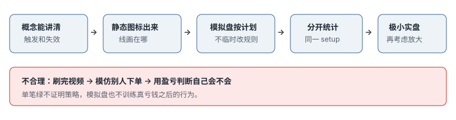

# 4.2 交易计划与学习流程

> 一句话：下单前六栏写不齐，就没有这一笔。时间不能替代证据，收入目标不能反推必须交易。

上一章把风险收成可计算的数字。这一章把那些数字嵌进一份**别人按你的文字也能复现**的计划，并给出从「会讲概念」到「敢用真钱」的学习阶梯。课程里的「先模拟三个月」「每天一个 magic number」「违规后去跑步」都是启发式或个人习惯。计划的价值在它能被拒绝、被统计，而不是听起来像纪律。

## 4.2.1 六栏：写不出来就没有这一笔


| 栏 | 要回答 |
|---|---|
| Setup | 为什么现在可能有优势？（形状 + 位置） |
| Trigger | 哪个价格行为出现才进？ |
| Invalidation | 什么事实说明判断错了？ |
| Size | 最坏可接受亏损对应多少股？ |
| Exit | 目标、分批、时间退出怎么执行？ |
| No-trade | 哪些条件出现直接放弃？ |

「我觉得要涨」「低买高卖」「只做强股」「我做 bull flag」填不进任何一栏。形态名只是「在哪画线」的规则。判断点永远在价格穿过线的那一刻。

触发条件和失效价必须来自**同一个周期**。1 分钟触发、5 分钟止损，是两套逻辑硬拼；按 1 分钟止损可能被噪声扫出，按 5 分钟止损又可能让仓位过大。选了周期，就用同一周期定义入场、失效和统计样本。

止损放在逻辑失效处，不是放在「亏 20 美元刚好心里能接受」的随意价。空间不够，跳过。入场离失效位太远，也不做——那是追，定义见上一章。

止损只能往有利方向移（多单往上），不能往不利方向放宽。错过就错过。时间退出要写进 Exit 栏：「还没跌」不是继续持有的理由。

保本（把止损移到成本）会提高「不亏」的频率，同时提高被扫出后价格继续走的频率。它改变的是分布，不是魔法。每一种退出规则要单独统计。

## 4.2.2 一份计划必须能让第三方复现

最低章节：

1. 交易目标和资本边界（用什么钱、不能亏到哪）；
2. 股票池；
3. 数据、新闻和扫描源；
4. 可交易时段；
5. 市场语境（做什么、不做什么的大环境）；
6. Setup；
7. Trigger；
8. Invalidation；
9. 仓位公式；
10. 入场/出场订单类型；
11. 当日/当周风险；
12. No-trade 条件；
13. 日志和复盘日程；
14. 策略修改流程（含版本号）。

「先模拟三个月」只是最低提醒，不是毕业条件。三个月里可能只经历一种市场状态、每天只做一笔样本不足、大量随意交易却没有固定策略、模拟成交不现实、规则违约没有被记录。上线条件应由样本量、成本后期望值、最大回撤、执行错误率、规则遵守率、实盘与模拟的成交差决定，而不是日历。

## 4.2.3 规则是护栏，不是事后惩罚

课程会列出 daily max loss、连续三次亏损停止、不做 large cap、不做第三次回撤、不追第三次 halt，以及「违规后跑五分钟」。这些是讲者按自身策略写的历史规则，**不适合作为你的默认数值**。跑步无法撤销订单风险，惩罚还可能让人隐藏违规。

更好的设计是：券商最大亏损锁定、最大订单、禁止继续下单、当日结束。规则应符合：

- **客观**：能判断是否触发；
- **即时**：触发后马上执行；
- **自动**：尽量不依赖高压时的意志；
- **可审计**：日志能证明是否遵守；
- **与风险相关**：不是无关的自我惩罚。

例如：

```
若 已实现 + 未实现 ≤ −100 美元：
flatten → 取消全部订单 → 券商 lockout → 当天不再实盘。
```

比「亏了就提醒自己冷静」有效。100 美元是启发式，换成你的硬停止即可。

## 4.2.4 股票池写到可查询

不要只写「1–10 美元的股票」。应包括：

- 交易所 / 证券类型；
- 价格区间；
- float 口径（以及你信哪家数据）；
- 最小成交量 / 相对量；
- 最大点差；
- 允许的催化类型；
- offering / 合规排除项；
- 是否允许 ETF、ADR、IPO；
- 是否允许盘前 / 盘后；
- 做空时的借股要求。

股票池是风险控制的一部分。临时因社交媒体热点切到不熟悉的产品，会同时改变波动、点差、订单和心理压力。计划若允许这种「跨策略」交易，必须在事前写出：何种极端关注条件、更高价格与点差下的仓位公式、盘外订单、halt 与隔夜风险、最大允许亏损。否则它就是计划外交易，即使赚钱也应记为规则违约。

低流通会放大涨幅，也会放大点差、halt、offering 和无法退出的风险。课程通常偏好较低价格、较低 float，并允许在极端热门行情中例外交易更高价、更大 float。为避免所有失败都被规则排除、所有成功都被称为「例外」，应事先定义：

- 核心价格 / float 范围；
- 允许例外的相对量、成交额和催化；
- 例外仓位是否降低；
- 哪些统计与核心股票池分开。

这些范围全部是启发式。

## 4.2.5 Setup 说明书，不是名字

每个 setup 写成可测试的规格。示例（数字是启发式，不能照搬）：

```
名称: 第一次 5 分钟回撤
语境: 新鲜、已核对的催化；缺口榜前列；日线空间 ≥ 2R
形状: 冲动高点后 2–5 根回撤，量收缩
触发: 突破前一根已收盘 5 分钟高点
入场: 可成交限价，最大偏移 0.03
失效: 回撤低点
目标: 盘前高，然后日线阻力
放弃: 点差 > 0.05；距 LULD 2% 以内；第三次回撤
```

每个字段都要从真实日志验证。课程的 2–5 根、回撤不超过 50%、日线空间 2R，都是待校准边界。

同一形状至少有三种入场，必须分开记账，不能拼成一个不存在的「又便宜又高胜率」策略：


| 入场 | 你在做什么 | 主要风险 |
|---|---|---|
| 预判 Anticipation | 线还没破就买 | 突破从未发生 |
| 穿越 Trade-through | 价格穿过线的那一下 | 滑点、追高 |
| 回踩 Retest | 破了再回来确认 | 可能不给回踩 |

课程若把三种填进同一个胜率，样本是脏的。你的计划必须声明默认用哪一种，另外两种是否允许、如何单独统计。

## 4.2.6 执行循环，不是预测循环

```
找最近支撑 → 找最近阻力 → 等价格确认 → 更新地图
```

一笔交易的生命周期：

1. **盘前**：名单、关键区域、no-trade、当日最大亏损、允许的 setup 版本、收工时间。
2. **盘中**：等触发，不预测。
3. **触发**：检查点差和盘口，下单，立刻挂上止损。
4. **持仓**：按计划移动止损或分批；不因「感觉还能涨」改规则。
5. **结束**：记下是否遵守计划，不只记盈亏。

热键、画线下单、区间单、保本单都是执行工具。工具不产生优势，只减少手慢和手抖。

## 4.2.7 收入目标不能反推必须交易

课程谈到 magic number 和依靠交易的收入目标。财务目标可以用于资本规划，但市场不按账单提供机会。

危险链条：

```
今天目标 500 → 只赚 200 → 必须再做一笔 → 降低标准 → 亏损
```

更适合每日控制的是：

- 最大风险；
- 最大笔数；
- 允许的 setup；
- 交易窗口；
- 流程分数（有没有遵守，而不是赚了多少）。

收入预期用长周期分布估算，并准备其他收入和现金缓冲。不要用借款、生活费或短期必须支出的钱交易。

课程给模拟阶段的「每日 100–250 美元利润目标、每周目标」只是训练示例，不应制造必须交易的压力。固定利润不能脱离波动：3 美元股票和 100 美元股票的「10 美分」不是同一件事。

## 4.2.8 情绪红旗写成停机条件

「感觉到才停」可能太晚。每个状态要附可观察行为。

可以用交通灯（阈值是启发式）：

| 灯 | 可观察 | 动作 |
|---|---|---|
| 绿 | 清晰、按计划、点击节奏正常 | 按计划做 |
| 橙 | 一次冲动，或两次执行错误 | 风险减半并暂停 |
| 红 | 碰到日亏损、出现报复念头、取消止损、连点 | 立刻结束 |

常见高唤醒：肾上腺素、FOMO、亏损愤怒、和别人的盈亏比较。和他人比较会改变自己的仓位标准，尤其在群聊或直播环境。最好让平台限制和计时器配合识别，而不只靠意志。

工作区规则：

- 固定、安静、无无关通知；
- 代码 / 账户 / 订单状态醒目；
- 手机和社交媒体移出视线；
- setup 检查表可见；
- 收工时间到自动提醒；
- 平仓后退出平台，不回来看「最后一笔」；
- 网络、电源和备用退出渠道已测试。

视觉提示只放当前规则和风险上限，不贴收益截图刺激追逐。设备的目标是可靠，不是堆屏幕。多屏不增加优势。最小要求是：稳定网络、行情与订单时间同步、主平台失效时能用网页或手机撤单平仓。

## 4.2.9 社区可以复盘，不能替你下单

社区可用于：复盘和问答、共享原始来源、责任监督、发现执行盲点。

风险：跟单、幸存者偏差、盈亏比较、只分享赢家、群体 FOMO、把讲师的风险容忍度当标准。

延迟几秒的 alert 对快速小盘策略可能已经失效。任何别人报出的股票都必须通过自己的完整检查表。别人的入场时间、仓位占比、持仓成本、退出计划、信息时点、流动性都和你不同。看到别人买入只能作为研究线索。

课程结尾用热点大涨和一笔约十点亏损收尾，同时刚强调过不做不符合自己风格的标的。真正应研究的是：每笔计划风险、实际滑点、为何偏离原股票池。把事后结果说成「正确类型股票」，是结果导向。赚钱的计划外交易，仍是违约。

是否继续某套课程，与策略能否在你的真实成本下盈利是两件事。学习资源按证据质量选，不按群体认同或成功故事选。

## 4.2.10 策略修改必须版本化

盘中不改规则。流程：

1. 收集问题，不在盘中改；
2. 写出假设；
3. 定义新旧规则差异；
4. 在历史或模拟上重测；
5. 保留样本外；
6. 指定生效日期；
7. 小规模前瞻测试；
8. 不满意时回滚，而不是继续叠加例外。

日志写 `strategy_version`，否则长期统计混合不同规则。改了 float 区间、改了「第几次回撤还能做」、改了止损从旗面低点变成固定 10 美分，都是新版本。

## 4.2.11 学习阶梯：适配交易者，不适配讲师的手速



课程把快速反应、计算机能力和风险容忍度与 1 分钟交易联系起来。这不表示反应慢就只能失败。可以选择：5 分钟确认、更少标的、更少交易、预设止损/目标、更高流动性的股票、完全不同的持有周期。策略应适配交易者，而不是为了模仿讲者强迫自己进入最快节奏。

### Phase A：机制

平台、订单、热键、日志。不评价盈利。目标是：不会反手、不会重复发单、能找到取消按钮。

### Phase B：回放 / 模拟里只做一种 setup

固定股票池、固定时间。收集全部信号，包括没做的和做砸的。

### Phase C：保守成交模拟

加点差、滑点、部分成交。计算成本后期望值。

### Phase D：最小实盘

只验证成交和情绪差异，不追求收入。仓位小到最坏成交也只是学费，不是生活事件。

### Phase E：受控放大

每次只升一档。指标恶化立即退回。

任何阶段都可以得出「这套策略不适合我」。停止不是失败，而是风险决策。

不合理的顺序是：把视频刷完 → 模仿别人下单 → 用盈亏判断自己会不会。概念需要三种验证：能不能在静态图上解释，能不能在实时变化中识别，能不能在有仓位和盈亏波动时仍按规则执行。

## 4.2.12 盘前 / 盘后检查表

盘前：

```
睡眠 / 压力分数:
账户 / 购买力:
平台 / 数据 / 路由:
未平仓 / 未成交订单:
当日最大亏损:
允许的 setup 与版本号:
市场状态:
观察名单 + 原始来源:
关键位置 + LULD:
计划入场 / 止损 / 目标 / 股数:
收工时间:
```

盘后：

```
券商成交已导入并对账:
费用 / 借股已计入:
全部交易已打标签:
规则违约:
最好的流程决策:
最差的流程决策:
情绪红旗:
平台问题:
一条以后再测的改动:
今天不改实盘规则:
```

Starter 课的终点不是「准备好实盘」，而是终于拥有足够术语去写第一版可检验计划。**是否实盘，由数据和风险承受力决定，不由看完多少视频决定。**

## 先记住这些

- 六栏写不齐 = 没有交易。周期一致。
- 规则要客观、即时、自动、可审计，不要靠事后惩罚。
- 股票池和 setup 都要写到可查询、可统计。
- 预判、穿越、回踩分开记账。
- 收入目标不能制造必须交易。版本化以后再改规则。

## 不要做的事

- 进场后再想止损。
- 用另一个周期给当前这笔「缓刑」。
- 把时间退出从计划里删掉，因为「看起来还在盘整」。
- 用三个月日历或课程升级当毕业。
- 跟单；或把赚钱的计划外交易留在策略样本里。
