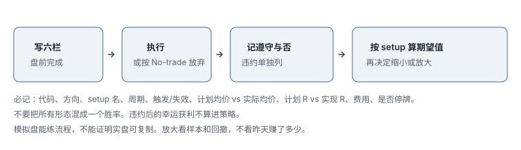
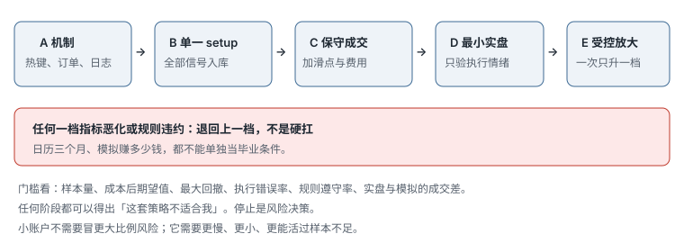

# 4.3 复盘、模拟盘与放大

> 一句话：日志第一列是有没有遵守；放大看的是样本和回撤，不是昨天赚了多少。

计划写完之后，真正决定你能不能活过下一季的，是记录是否诚实、样本是否干净、从模拟到实盘的台阶有没有跳。课程产品里的三角评分、一个月模拟盈利、挑战赛式放大，都只能当诊断玩具或反面教材。本章把它们降级，留下可审计的字段、分层复盘、以及一架可以往上也可以往下走的梯子。

## 4.3.1 为什么要记，记什么

没有样本就没有期望值，只有故事。日志不是为了写情绪日记，也不是为了做出一张好看的权益曲线。它要回答：

- 这一笔的 setup 定义和昨天是不是同一个；
- 触发有没有按计划发生；
- 计划亏 1R，实际亏了多少；
- 规则有没有被遵守——赚钱的违约仍然是违约。



一笔至少记这些：

- 日期、时区、代码、方向、setup 名称（用本书或你计划里的名字，不要现场发明）；
- 周期；
- 催化来源（原始公告，不是标题）；
- 触发价、失效价、实际入场均价、实际离场均价；
- 计划股数、实际股数；
- 计划 R、实现 R；
- 点差、是否部分成交、是否停牌、是否 SSR；
- MAE / MFE（最大不利 / 有利偏移）；
- 有没有违反六栏（是/否 + 哪一栏）；
- 费用：佣金、监管费、借股、平台费；
- `strategy_version`；
- 可选：入场前和结束后你自己的截图。

从执行导出按成交加权，不要把肉眼平均数写进表里：

```
加权均价 = Σ(价格 × 股数) / Σ(股数)
净盈亏 = 毛盈亏 − 全部交易成本
```

「Bad risk」应在入场时有客观定义。如果只给亏损交易补标，会产生事后偏差。

不要只记「今天绿 / 红」。一笔超大风险的绿会污染整周。也不要把所有 setup 混成一个胜率。错过的交易单独记在 `MissedTrades`，不要混进真实盈亏。

新增字段的原则：之后会用它回答一个具体问题。否则只增加填写成本。IRA、1 分钟 / 5 分钟、高 / 低风险、动量策略——课程允许加列，但空列没有价值。

## 4.3.2 把成交聚合成「一笔交易」要先写死规则

一笔策略交易可能包含：分批买入、卖一半、再加回、再卖四分之一、最终 flatten。软件可能把每个 fill 当一行，也可能自动聚合。分析前决定：

- 同代码同方向、间隔多少时间算同一笔；
- 完全平仓后重新进入是否新交易；
- 反手如何处理；
- 多账户是否合并；
- 佣金如何分摊。

规则变化会改变胜率和平均盈利，必须版本化。第三方复盘工具先和券商对账：时区与夏令时、部分成交、公司行动、空/平方向、期权乘数、佣金 / ECN / 借股、已取消或被拒的订单不应成为成交。导入成功只说明格式接受，不说明盈亏正确。随机抽查若干笔，与券商正式账单对齐。

课程表格为方便会把约 7 美元记成 10 美元。这适合粗略回顾，不适合税务或精确绩效。佣金若被公式误算成一笔亏损交易，胜率会被污染。

## 4.3.3 评价策略的最低标准

- 同一 setup 定义稳定；
- 样本覆盖不同市场状态，不只是顺风的两周；
- 计入佣金、平台费、借股、合理滑点；
- 最大单笔亏损和最大日亏损都在计划内；
- 规则违约次数单独列，不把违约后的幸运获利算进策略；
- 没有靠一两笔异常大盈利撑起全部结果；
- 能连续执行止损，而不是只在模拟里「事后画止损」。

期望值公式见本卷第一章。课程评分用最近数周、几十笔提供快速反馈，但样本小容易被偶然性支配。不要因为：两周盈利就上线大仓位；三次第一次回撤全赢就断言有效；一次 halt 巨亏就删掉所有样本；只导入「认真做的交易」——而改变策略。

先定义最小样本量和复盘日期。无论盈亏，所有符合条件的信号和所有实际交易都入库。

选择偏差的几种脏法：只保存成功图、用最终大绿 K 的收盘假装自己在启动时成交、把预判的最好成交价和结构确认的胜率拼在一起、按结果给亏损单补「当时其实不该做」。

## 4.3.4 Profit Trifecta 是诊断玩具，不是行业标准

课程的三角综合：consistency（连续盈利周数）、accuracy（胜率）、profit/loss ratio（平均盈利 / 平均亏损绝对值）。三条边不是三枚独立奖章：胜率高但平均亏损过大，仍可能亏。分数是课程产品自定义刻度，不能比较不同风险规模的交易者，更不是资金放大的自动许可。「一周绿色」可能来自一笔超大风险；「每天绿色」也可能掩盖偶发灾难性亏损。「7 分以上很可能盈利」是课程经验阈值，不是统计保证。

底层关系仍是期望值：

```
EV = 胜率 × 平均盈利 − 败率 × 平均亏损 − 平均每笔成本
```

55% 胜率与 1:1 毛比率在忽略成本时有轻微正期望；若交易频率高、费用和滑点大，净期望仍可为负。

用三角定位弱项（然后回到原始成交，不要停在分数上）：

| 表象 | 先查什么 |
|---|---|
| 胜率低、比率还行 | 入场选择、确认、市场状态 |
| 胜率高、比率差 | 摊平、止损太晚、过早获利 |
| 两者尚可但不稳 | 仓位乱变、过度交易、某些星期的违约 |
| 毛正净负 | 佣金、借股、数据和平台成本、滑点 |
| 分数提高但回撤也扩大 | 可能只是股数增大，不是优势改善 |

更可靠的仪表盘：

- 每笔净期望值；
- 利润因子；
- 最大回撤；
- 平均 / 最大不利偏移；
- 平均滑点；
- 规则遵守率；
- 按 setup、时段、价格、流动性分组；
- 置信区间和样本量。

静态表格模板里常见的坑：旧券商佣金常数、整列公式把空白和未完成交易算进胜率、2018/2019 的结算假设、仓位公式没有自动限制流动性、购买力、跳空和最大持仓占比。最实用的做法不是继续叠加模板，而是从最小字段开始，用券商成交对账，再只添加能形成决策的列。

## 4.3.5 复盘分层

### 每笔

- setup 是否存在；
- 触发是否按计划；
- 入场滑点；
- 止损是否合理执行；
- 有无规则违约。

### 每日

- 最好 / 最差决策；
- 盈亏是否由少数异常交易驱动；
- 触发日止损后是否继续；
- 平台问题。

### 每周

- 各 setup 样本量和期望值；
- 时段、价格、相对量分组；
- 规则遵守率；
- 是否需要暂停某一类交易。

### 每月

- 回撤；
- 策略漂移（规则在盘中被例外掏空）；
- 放大仓位的影响；
- 数据完整性；
- 是否有足够证据修改规则。

风险日志每周额外找：实际亏损超过 1R 的原因；止损限价未成交；高频加回导致总风险被低估；某价格 / float 区间的尾部亏损；盈利后是否无纪律扩大 size。

风险管理不是让每笔只亏很少，而是确保**任何合理的失败序列都不会夺走继续验证策略的能力**。

## 4.3.6 模拟盘能练什么，不能证明什么

适合练习：平台和热键、setup 识别、订单状态、风险计算、日志流程、规则一致性。

通常无法完整复制：排队位置、部分成交、自己的冲击、快速行情滑点、借股可用性与费用、halt 竞价、真钱导致的行为变化。

因此从模拟到实盘不是一次「毕业」，而是逐级验证。一个月盈利记录只是短期门槛，可能只有少量样本或单一市场环境。不能因为课程下一阶段到了就自动切换真钱。

模拟计划建议固定：

```
股票池:
可交易时段:
唯一 setup:
每笔最大风险:
每日最大风险:
最大交易次数:
订单类型:
保守滑点:
日志字段:
复盘日期:
```

课程用每笔最大 50 美元、按 0.10 / 0.20 / 0.40 止损换算 500 / 250 / 125 股——框架对，`shares = max risk ÷ per-share risk` 成立。但「满仓 = 1,000 股」与风险公式冲突：满仓仍应由当笔止损决定。50 美元和 1,000 股都是启发式。

## 4.3.7 从模拟到实盘的梯子



示例门槛（「数周」「正期望」需要你自己写成可检查的数，不要抄日历）：

1. 至少数周平台操作无严重错误；
2. 在成本和保守滑点后正期望；
3. 最大回撤在预定范围；
4. 规则遵守率达到你写死的目标；
5. 实盘从可忽略的最小规模开始；
6. 模拟与实盘并行比较成交；
7. 每次只增一级；
8. 指标恶化就退回上一规模。

不是模拟赚了多少钱决定上线，而是流程是否可复制、尾部损失是否能承受。任何一步出现规则违约，先缩小，不要放大。

放大门：

- 至少一组足够大的样本；
- 净期望值为正；
- 各 setup 分开后仍有优势；
- 最大回撤在预设范围；
- 没有摊平 / 止损违约撑起利润；
- 增仓后仍能按同样速度退出；
- 只把 size 增加一个小台阶；
- 若表现跌破阈值，自动退回上一档。

分数提高但回撤扩大，先检查是不是只加了股数。

IRA / 退休账户：通常限制做空、限制日内保证金、结算和允许的产品都更窄。不能把保证金小盘策略原样搬进去。另开版本，另开统计。

## 4.3.8 何时停止一套规则

- 市场结构变了（停牌规则、借股、你交易的那类股票不再活跃）；
- 样本外期望值转负，且违约率没有同时下降（不是「只是手生」）；
- 你无法再执行止损（生活压力、睡眠、账户已经触及不可承受回撤）。

停止是交易计划的一部分，不是认输仪式。小盘框架的价值同样在它能被拒绝：写出单一 setup 的完整规则，在模拟环境收集未经筛选的连续样本。不要因为理解了「提前进突破」就开始真钱。

课程录制于异常活跃的 2020–2021。练习时应按市场状态分组，避免把热市样本直接外推到冷市。讲者的时段优势也不能直接迁移到另一套券商、数据源和执行速度。

## 4.3.9 每种 setup 至少要能回答的复盘问题

后面两卷会出现许多名字。日志不需要为每个名字发明新表，但每笔都应能填：

- 当日 gap、盘前成交量、float、催化；
- 入场属于预判、穿越还是回踩；
- 距离 VWAP、盘前高、日线阻力、LULD 带多远；
- 是当日第几次回撤或第几次测试；
- 是否停牌、点差是否扩张、深度是否消失；
- 严格按规则退出时的结果，而不是事后最佳退出点；
- 1 / 5 / 15 分钟后价格在哪（用来看你是不是过早或过晚）。

反转类还要多记一项：观察窗口内根本没有反转。只有把「没反转」留下，极端过滤器才有机会被证伪。

## 先记住这些

- 日志的第一列是「有没有遵守」。违约后的获利不算进策略。
- Setup 分开统计。成交聚合成交易的规则要版本化。
- 三角分数、绿日子、模拟一个月，都不是放大许可。
- 放大是样本够了之后的决定；恶化就退回。
- 停止一套规则是计划的一部分。

## 不要做的事

- 用一天的盈亏改第二天的规则。
- 只导入认真做的或赚钱的交易。
- 没写下当前 1R 美元数就开始「感觉可以多买点」。
- 把课程挑战仓位当学习样本。
- 用别人的权益曲线证明自己的 setup。
