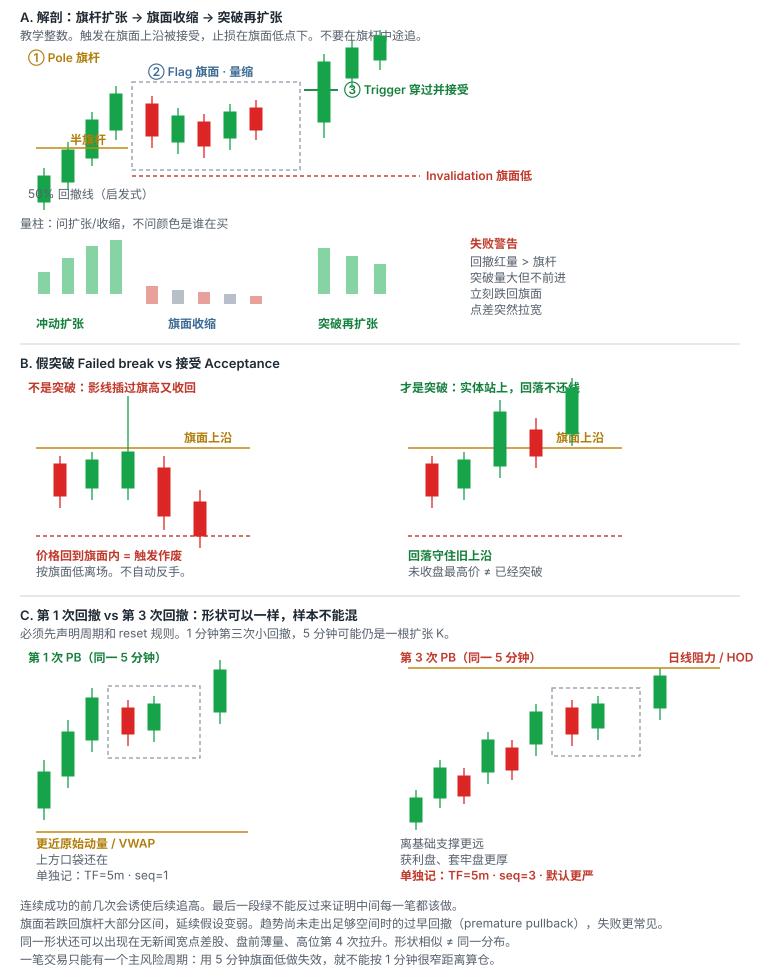

# 5.1 Bull Flag

> 一句话：赌的是旗杆那段买盘还没做完；触发在旗面上沿被接受，不是看见第一段上涨就追。

这一章只写一种形状：**Bull Flag（牛旗 / 旗形突破）**。贴顶、ABCD、回踩、HOD、VWAP 是别的章节。这里出现它们，只是为了对照：触发和失效不同，就不能共用一个胜率。

前几卷已经定死三个词。**形状**是价格怎么走出来的。**位置**是线画在哪。**触发**是价格穿过你预先画的线，并且你愿意用那根线当失效位。认出一面旗，只是形状。它贴在前收盘、VWAP 或当日最高旁边，才有位置。当前这根 K 穿过旗面上沿并被接受，才是触发。

小盘动量的基本链条是：

```
催化或异动 → 成交量集中 → 价格突破 → 回撤整理 → 再次扩张
```

Bull flag 占的是后两段：已经发生过一段明显上涨，市场用一段相对有序的停顿消化，然后你只在整理区上沿被接受时参与。`Buy high, sell higher` 只是趋势交易的口号。没有明确失效时，它会退化成追高。

课程把很多名字堆在一起：bull flag、flat top、ABCD、均线回踩、趋势线、VWAP 突破、HOD 突破。能独立存在的形状其实很少。其余大多是「这条线画在哪」。旗形可以出现在任何位置。HOD 也可以被旗形打穿。位置越有名，突破时越容易猛——因为更多人的止盈、止损和条件单堆在同一价。上方卖压也会更集中，必须看成交是否真的推进。

数字——回撤 2–5 根、不超过 50%、靠近 9 EMA、日线空间 2R——全部是**启发式**。写进你的计划，用自己的股票池校准。它们不是市场的自然定律，也不是这本手册的盈利保证。

## 5.1.1 这笔交易在赌什么

Bull flag 赌的不是「还会涨很久」，也不是「空头一定被挤爆」。它赌的是一件更窄的事：

**制造旗杆的买盘还没有做完。旗面是暂停，不是反转。价格重新穿过旗面上沿并被接受之后，仍有足够买盘把价格推离失效位，使第一目标盖过 1R 加成本。**

把它拆开，才能知道哪一句话被证伪：

| 句子 | 被什么证伪 |
|---|---|
| 旗杆是真冲动，不是一根孤立绿 K | 旗杆量小、实体短、随后立刻回到起点 |
| 旗面是有序暂停 | 旗面跌破关键支撑，或回撤量大于冲动段 |
| 上沿被接受 | 只有影线穿过，或穿过后立刻回到旗面内 |
| 上方还有可实现空间 | 一破就撞上更近的日线阻力 / 整美元 / HOD，口袋不够 1R |
| 你能按失效价附近离开 | 点差失控、盘口消失、停牌跳过止损线 |

图表只能显示合成后的成交价格。上涨可能同时来自新多头买入和空头回补。你不需要猜「是谁在买」。可操作的观察是：量能是否按「冲动扩张 → 回撤收缩 → 突破再扩张」走，突破后价格有没有推进。

这笔交易**不是**在赌：

- 旗杆中途的每一根绿 K 都会继续；
- 回撤一定浅、一定守住 9 EMA；
- 突破后一定走到等距测量目标；
- 第三次、第四次回撤和第一次是同一分布；
- 形状漂亮就等于订单能按图成交。

「我做 bull flag」填不进交易计划的任何一栏。形态名只是「在哪画线」的规则。判断点永远在价格穿过线的那一刻。完整策略至少需要：

```
股票池 + 市场环境 + setup + trigger + invalidation + sizing + exit + 成本
```

图形名称只填 Setup 一栏。Starter 课只介绍形态。屏幕上一次成功的实时示范，不能当作统计验证。

## 5.1.2 旗杆 Pole 和旗面 Flag


| | |
|---|---|
| 怎么认 | 旗杆 = 前一段明显上涨；旗面 = 量能通常收缩的回调或横盘 |
| 触发 | 整理区上沿被穿过并接受 |
| 失效 | 旗面低点 / 关键支撑下方 |
| 常见失败 | 跌破旗面低点；假突破后立刻回到旗面内；旗杆中途追入后回撤把你扫出 |
| 不做 | 回调已跌破关键支撑、量能失控、上方阻力太近、入场离上沿已远 |

**Pole（旗杆）**是已经发生的冲动段。它必须在图的左侧看得见：一段相对快速、方向清楚的上涨，通常伴随价格区间扩大和成交量扩张。没有旗杆，后面那一小段横盘只是普通 consolidation，不能事后改名叫旗。

**Flag（旗面）**是高位短暂、相对有序的回撤或横盘。有序的意思是：波动比旗杆小、低点大致可标、量通常比旗杆段小。它可以略向下倾斜，也可以接近水平。它不是必须画成一面飘扬的平行四边形。手绘形状只表达结构；没有价格、成交量、时间和失效点，不能直接计算交易。

两段缺一不可：

1. 没有 pole，就没有 continuation 假设。你没有东西可延续。
2. 没有 flag，你面对的是还在走的旗杆。此时入场叫追 pole，不是做 flag。

旗面若跌回旗杆的大部分区间，延续假设变弱。趋势尚未建立足够空间时的过早回撤（premature pullback），整理更容易失败——冲动还没证明买家愿意用更高价持续成交，回撤就把结构还回去了。

把旗杆和旗面画出来时，至少记下：

- 旗杆起点、终点（通常用已收盘摆动，而不是未走完的影线尖）；
- 旗杆的相对高度（这段涨了多少，相对这只股票当天的正常波动）；
- 旗面高点（整理区上沿，常常就是旗杆末端附近的局部高）；
- 旗面低点（回撤最低的有效低，作为 invalidation 候选）；
- 旗面用了多少根已收盘 K、耗了多少分钟；
- 旗面量相对旗杆量是收缩还是扩张。

同一段走势可以有多种画法。水平线标出每一阶段可见的局部高低点，不是一次性画好后永不改变。为了减少主观性，画线时记录：该位置至少被测试几次；当时是否有明显成交量；是已收盘 K 线还是仍在变化；与 VWAP、整数位或大周期区域是否接近；突破后怎样才算站稳。线的作用是限定决策，不是让图表看起来解释完整。

## 5.1.3 量能：旗面通常收缩



延续偏好的顺序：

```
冲动扩张 impulse expansion
  → 回撤收缩 pullback contraction
    → 突破再扩张 breakout re-expansion
```

「旗面量通常收缩」是观察，不是许可。量缩回撤的解释是抛压可能较轻；它仍可能只是买方消失。整理区里量能逐步萎缩，是很多突破 setup 的配料，不是充分条件。

很多平台把上涨 K 线对应的总成交量涂绿、下跌 K 线涂红。红量柱不表示该周期每一股都是主动卖出，绿量柱也不表示全是主动买入。每一笔成交同时有买卖双方。观察 contraction / expansion 时应比较：

- 本周期总量与前几根；
- 相同日内时段的正常量；
- 突破价附近实际成交速度；
- 点差与可见深度；
- 突破后能否维持，而不只是瞬间打印。

看量时问三个问题：

1. 和前几根比，是扩张还是萎缩？
2. 和这只股票平时同一时段比，是否异常？
3. 放量之后价格有没有推进？还是成交很多却走不动（吸收 / 分配）？


突破没有新增量能，后续跟随可能不足。但放量也可能是顶部换手。高量但价格不再上涨，不能只把高量视作确认。量是上下文，不是许可。

失败警告（出现一项就提高放弃权重，不要加成机械总分）：

- 回撤红量大于冲动段；
- 突破量大但价格不前进；
- ask 不断补单，打穿后价格停在原地；
- 突破后马上跌回旗面；
- 点差扩大，可见深度消失。

大盘语境里还要多问一句：收敛点是否太近、上方口袋是否还在。Apex 太近才进场，可能出现拥挤假突破——人人都看见要突破，止损又都堆在同一处。突破再放量常见但不是保证；低量突破也可能持续。失败样本必须进统计：整理量大于冲动段；突破量大但价格不前进；指数已经走弱还在做个股旗形；口袋被盘中新高切成两截。

相对量的正确基准：同一标的、同一时段、同一交易时段。开盘十分钟自然比午间活跃，不能用全天平均直接判断。盘前与常规时段的量基础不同，应分开比较。

## 5.1.4 触发 Trigger：穿过旗面上沿并被接受

触发位置是**整理区上沿**，而不是看到第一段上涨就追入。水平高点被穿过只是触发条件。之后能否在新价位**接受成交**（实体站上，而不是一根长影线插过去又回来）才决定质量。


一根长上影穿过阻力又收回来，是试探，不是接受。接受看起来更像：收盘站在线的那一侧，随后的回落不把线还回去。用未收盘 K 线的最高价当「已经突破」，会把大量假信号算进样本。

把 trigger 写成可执行的一句话，必须先选定一种，并且成功失败都用这一种：

| 你写进计划的触发 | 它实际要求什么 | 主要风险 |
|---|---|---|
| 触价 trade-through | 成交出现在旗面上沿之上（例如上沿 7.00，成交 7.01） | 假突破、滑点、当前 K 尚未收盘 |
| 收盘确认 close | 选定周期的 K 收在上沿之上 | 等收盘时已经离开，盈亏比变差 |
| 回踩 retest | 先接受上沿，再回到上沿附近守住 | 可能不给回踩；把失败突破误当成回踩 |

三种不要事后任选。回测时把成功样本算「提前买」、失败样本又说「尚未触发」，统计是脏的。

真突破和假突破的对照：

| | 更像真 | 更像假 |
|---|---|---|
| 突破后 | 在新价位接受成交，量能跟上 | 立刻跌回旗面内 |
| 回落 | 守住旧阻力（原旗面上沿），量收缩 | 直接穿过前支撑 |
| 再上冲 | 有新增成交 | 没有新增量能 |

突破后观察：多久维持在水平上方、bid 是否抬到旧阻力、回踩是否量缩、是否形成新的更高低点、大成交是否带来进展。失败特征：立即跌回、卖盘量大却不涨、旧阻力没有转支撑、点差扩大、更低高点后跌破区间。

放量也可能是顶部换手。横盘既可能蓄势，也可能买盘衰竭。「还没跌」不是继续持有的理由——时间退出要写进计划。

## 5.1.5 第一根创新高：口号还原成可成交规则

课程常用另一句更细的触发：**回撤过程中，当前 K 线第一次突破前一根已收盘 K 线的 high**。它不要求当前 K 线先收盘。


例如（教学整数，不是某只股票的行情）：

- 前一根 high：7.00；
- 计划触价触发：成交出现 7.01；
- 结构 low：6.78；
- 估计入场含滑点：7.04；
- 每股风险：`7.04 − 6.78 = 0.26`。

这个触发只说明短期方向重新向上，不说明：

- 一定突破整个旗形；
- 能在 7.01 成交；
- 风险固定为 0.10；
- high 上方没有大卖单；
- 假突破后能按 low 平仓。

如果提前在 6.95 anticipatory entry，必须把它定义为另一种 setup。不能在回测时把成功样本算「提前买」，失败样本又说「尚未触发」。

完整写法至少要有五步：

1. 先记录已收盘上一根的 High；
2. 决定是触价触发，还是收盘站上才算；
3. 预先指定失效点：上一根 Low、旗面 Low，还是你另写的结构 Low；
4. 把点差和滑点加入每股风险；
5. 触发后若无法获得合理成交，放弃追价。

「第一根创新高」和「穿过整段旗面上沿」不是自动同一件事。旗面里后一根的 high 可能低于整段整理的最高点。你必须在计划里写死：

- 触发 A：穿过前一根已收盘 high（更快，假信号更多）；
- 触发 B：穿过整段旗面最高（更慢，失效距离往往更大）。

两种分开统计。不要同一笔里两种都算对。

当前这根的 High、Low、Close 都可能继续改。上一根的高点，只有在上一根**已经收盘**之后才固定。计划如果写的是 candle close confirmation，盘中价格触及那条线，并不等于已经确认。五根已经收盘的 1 分钟合成一根 5 分钟；第五根还在走，看起来像旗面的东西，最后 40 秒可以变成一根长上影。不能拿未完成的 5 分钟形态当成已经确认的旗形。

## 5.1.6 失效 Invalidation：旗面低点

Stop 放在**旗面低点下方**，再留一点滑点。这是结构失效，不是「我最多想亏 10 美分」。

失效的含义是：旗面不再是「高位有序暂停」。价格向下接受旗面低点，说明回撤已经变成对旗杆的否定，continuation 假设结束。你不再讨论「再给一次机会」，因为判断错了的事实已经出现。

常见画法：

| 你标的失效 | 适用 | 不要这样做 |
|---|---|---|
| 旗面最低已收盘低点下方 | 标准旗形 | 把止损挤到旗面中部，只为了让股数好看 |
| 旗面里最近一个更高低点下方 | 旗面本身在抬高 | 未声明就换锚点 |
| 「关键支撑」下方 | 旗面低正好叠在 VWAP / 前破位 / 整美元 | 支撑换了，叙事还用旧的 |

实际 stop 可能很宽。仓位必须相应改变，而不是把线往上挪。如果旗面已经很深，入场到旗面低的距离吃掉大部分口袋，这一笔的正确动作是 **no-trade**，不是改用固定 10 美分。

滑点不能抄一个固定美分。点差宽、盘口薄、开盘三分钟、停牌前后，预留要加大；加大之后股数必须变小。计划止损只覆盖连续成交场景。跳空、停牌后，实际退出可能远离计划线。对可能 halt 的低流通股票，图上的 1R 不是最大损失保证。

一笔交易只能有一个主风险周期。如果以 5 分钟旗面低为止损，却按 1 分钟很窄风险计算仓位，实际损失会被低估。多个周期不是投票。不要说「1 分钟破了但 5 分钟还没破，所以止损可以先不动」。

入场与 stop 之间的距离决定每股计划风险。股数越大，同样的小幅不利波动会产生越大美元亏损。正确顺序永远是：先找到结构失效点，再估算现实能成交的入场价，加入滑点，用单笔可承受美元风险反推股数。错误顺序是：先想买多少股，再把止损挤到很近。

## 5.1.7 用哪个时间周期

Bull flag 不是「1 分钟专属」或「5 分钟专属」。它是嵌套的。5 分钟的一根扩张 K，在 1 分钟上可能已经走完旗杆加第一次旗面。日线上的一根大阳，盘中可以拆成好几段旗。

多周期分工：

| 周期 | 主要问题 |
|---|---|
| 日线 | 上方历史套牢 / 突破空间在哪里？口袋还够不够 2R？ |
| 5 分钟 | 当天是上升、下降还是宽幅震荡？是第一次有序回撤，还是已经多次延伸？ |
| 1 分钟 | 触发与最近失效位在哪里？是否过度延伸，有没有清晰 micro pullback？ |
| Level 2 / T&S | 当前是否具备可接受的执行条件？点差、深度、成交速度 |

一个具体检查法：

1. **日线**：上方最近阻力和潜在空间；
2. **5 分钟**：当前是第一次有序回撤，还是已经多次延伸；
3. **1 分钟**：触发是否过度延伸，是否有清晰可画的旗面；
4. **Tape / Level 2**：点差、成交速度和拒绝位置；
5. **订单计划**：哪个周期的 low 是真正失效点。


5 分钟看起来刚开始突破时，1 分钟可能已经连续拉升、离短期支撑很远。日线上还有历史水平和更长均线；盘中形态不能覆盖更大周期阻力。小周期上的漂亮突破若正撞到大周期高点，实际空间可能很小。同一水平位在早盘高量与午间低量时段的意义不同。

多周期共振不是「指标越多越好」，而是各周期对同一个风险位置没有明显冲突。1 分钟与 5 分钟相互冲突时，默认不做：例如 5 分钟已是第三次延伸、1 分钟却长得像「新的第一次旗」。

讲师的实际偏好（启发式）：超短和短线仓位主要关注约 15–30 分钟的局部趋势；计划持有更久，同时查看更大的 time frame。不要被单一图表缩放程度困住。左侧多窗口同时看 Level 2、1 分钟、5 分钟和 daily，是为了回答上面那张表，不是为了找第五个同意你买入的窗口。

1 分钟信号更快但噪音更多；5 分钟更慢，失效距离通常也更大。两种周期的旗形突破分开统计。你的主风险周期必须在下单前写死。

未收盘的大周期 K 会改写形态。复盘时必须固定当时屏幕上可见的信息，不能用后来走完的 5 分钟阳线反推「当时显而易见」。保存入场前、入场后和退出后三张图，比较决策而非只看盈亏。

## 5.1.8 第一次、第二次、第三次回撤必须分开统计

课程偏好第一、第二次回撤，警惕第三次以后。逻辑是：

- 早期动量尚新；
- 后续买方可能逐渐耗尽；
- 趋势离 VWAP 和基础支撑越来越远；
- 高位持仓和获利盘增加。

这是**启发式排序**，不是「第三次一定亏」。真正禁止的是：把第二、第三次和第一笔丢进同一个统计桶，然后宣称「我的牛旗胜率是 X%」。

「第几次」必须按固定周期和固定 reset 规则计数。跨 1 分钟、5 分钟混着数会让统计没有意义。1 分钟可能已经是第三次小回撤，5 分钟仍只是一根扩张 K。

建议的计数规则（启发式，改完必须写下来）：

```
主周期 = 你用来画旗面、放失效的那一个（例如 5 分钟）
一次 pullback = 主周期上，冲动之后一段可标低点的回撤或横盘
seq = 1, 2, 3, …
reset：价格回到旗杆起点附近并失去结构，或出现新的日线级事件，才重新从 1 数
```

不要用 1 分钟的第三次小停顿，去给 5 分钟的第一次旗面贴「已经是第三次」的标签，除非你的计划明确只做 1 分钟。

连续成功的前几次 setup 会诱使后续追高。sequence number 必须入日志。最后的结果不能反过来证明中间每个 entry 都正确。右上长趋势中出现多个小回撤；并非每一个都值得交易。箭头附近要确认是第几次 pullback、离 VWAP 多远、日线空间多大。

第三次以后不是自动禁做。它是另一组条件概率。你要单独看：量是否仍在收缩、口袋是否还在、点差是否仍可接受、是否已经贴近 LULD 或日线套牢区。缺一项，放弃的权重就该上升。

开盘第一次回撤和盘中动量里的第一次回撤，若时间窗口和股票状态不同，不要强行合并——除非你的计划明确它们是同一个定义。

## 5.1.9 不要追旗杆

不要看见第一段上涨就追。那是旗杆，不是触发。

大绿 K 后立即追入，stop 往往很远，risk / reward 变差。等价格形成新支撑和新阻力，能够把失效位缩小到当前结构。如果回落直接穿过前支撑，说明不是健康整理，而可能是失败突破。

追的定义是**离失效位太远**，不是离底部远。止损不会因为你买得更高就跟着上移。旗杆中途买入，失效如果还放在旗杆起点，每股风险会被旗杆高度吃掉；如果把失效上移到「刚刚那根绿 K 的低点」，你用的已经不是旗形逻辑，而是另一套更吵的微结构，必须另开统计桶。

情绪风险常表现为错过后追价。它不是靠「意志坚定」就能消失。最好用事先写死的规则约束：旗杆还在走、旗面尚未形成、入场离上沿已经很远，这三项任一成立，热键上的买入就不该按下去。

同一段从 4.00 拉到 5.20 的走势，可以同时被叫成三种名字。必须在事前写死你做哪一种，否则每笔都能在事后找到一个赢的叫法。

| 你等的结构 | 失效通常在 | 更像什么 |
|---|---|---|
| 3–5 根缩量旗面 | 旗面低 | 本章的 bull flag |
| 停 1 根就再穿前高 | 那一根的低点 | 微回撤（更进阶，噪声大） |
| 没有旗面，直接打当日最高 | 最近更高低点，往往很远 | HOD 穿越（位置，不是旗） |

教学数：旗面低 4.90，上沿 5.05，入 5.08，失效 4.87（含滑点），每股 0.21。微回撤停在 5.12–5.16，入 5.18，失效 5.10，每股 0.08——看起来更「安全」，但 5.10 被一根影线扫掉的频率更高，且 5.20 上方可能就是 LULD。HOD 在 5.20，入 5.28、失效还在 4.90，每股 0.38，这是追。

三种不要补成一笔「先旗形、再微回撤、再 HOD 加仓」的完美赢家，除非每一笔都单独满足计划六栏，并且全仓风险重算后仍在预算内。

## 5.1.10 三种入场必须分开记账


| 入场 | Entry | 优点 | 主要风险 |
|---|---|---|---|
| 预判 Anticipation | 旗面上沿下方 | 均价较低 | 突破从未发生 |
| 穿越 Trade-through | 穿过上沿的成交 | 条件已触发 | 滑点、追高、假突破 |
| 回踩 Retest | 突破后回到上沿 | 失效更清晰 | 可能不给回踩；误判失败突破 |

提前进入可以改善均价，也承担「突破从未发生」的风险。卖出后把心理止损调到平均成本，只是价格上的保本；费用与滑点仍可能使净结果为负。多次加回会产生一串不同 setup，日志必须分别记录，而不能合并成一笔漂亮的大赢家。

本章的默认主规则是穿越并接受。预判和回踩若要做，各自写成独立版本号。回踩还要满足一个前提：前面的突破已经被接受。没有这一步，后面无论跌多深，都不是旗形的 retest，而是失败突破或另一种 dip。突破后的回踩是后面章节的独立策略；这里只要求你分清两张图。

## 5.1.11 失败突破 Failed Break

突破失败时：

1. 不等待「再给一次机会」；
2. 按 invalidation 减仓 / 平仓；
3. 检查是否成为 bull trap；
4. **不自动 reverse 做空**——反手是新的一笔，要有 locate 和新计划；
5. 记录 slippage 和 acceptance time（在上方停留了多久）。


Bull trap：

1. 价格突破明显阻力（这里就是旗面上沿）；
2. 追价买盘进入；
3. 价格无法维持，快速跌回原区间（旗面内，甚至旗杆里）；
4. 被套多头止损进一步增加卖压。

关键不是猜「主力故意诱多」，而是观察：突破是否被接受；成交量增加后价格是否有 progress；回落是否重新跌破触发位；失败后反方向是否出现可定义风险的 setup。


High-volume false breakout 的核心组合：出现在重要位置附近；价格短暂突破；紧接着出现一根明显的大红 K；该红 K 成交量显著放大；突破未能保持。这一根红 K 是强预警，不是完整 downtrend 本身。真正的转换确认仍需后续形成 lower high、跌破更高低点。

如何确认不是普通 pullback：

- 前一重要更高低点（旗面低）是否失守；
- 反弹是否无法回到 high，形成更低高点；
- 回落量是否大、反弹量是否小；
- 阻力上方是否无法保持；
- 时间框架更大的结构是否也开始破坏。

失败之后，旧多头结构已经结束。底部再横盘形成的新区间，后续突破属于**新 setup**，不能沿用原 stop 和原叙事。图中最后上涨很醒目，但实时应先经历「是否能守住底部」的不确定阶段。

如果回落直接穿过前支撑，说明不是健康整理。价格没有立刻延续时，横盘既可能是蓄势，也可能是买盘衰竭。观察回落是否守住旧阻力、成交量是否收缩、再次上冲有没有新增成交。时间退出也应写进计划：旗面已经横了太久，市场注意力消散，即使形状还在，也是 no-trade。

## 5.1.12 和 Flat Top、ABCD 的对照

对照的目的只有一个：不要因为「都是涨完以后整理」就把样本混在一起。差异在触发和失效，不在名字漂不漂亮。

| | Bull flag | Flat top（对照） | ABCD（对照） |
|---|---|---|---|
| 形状 | 旗杆 + 回撤或横盘的旗面 | 同一水平上沿多次未破 + 低点抬高 | A→B 冲动，B→C 回撤，C→D 再推 |
| 触发 | 旗面上沿被接受；或前一根已收盘高 | 水平上沿被接受 | C 之后恢复并穿过 B，且被接受 |
| 失效 | 旗面低点 | 最近抬高的低点下方 | C 的低点 |
| 常见失败 | 假突破回旗面；旗杆中途被扫 | 突破后迅速跌回；高位供给仍在 | 第二次上攻量不足；C 破了还等 D |
| 不做 | 已跌破关键支撑；上方太近；追杆 | 入场离上沿已远；整理过长 | 事后硬凑三段；D 当承诺 |

Flat top 两个条件缺一不可：多次接近同一水平上沿没过去；低点逐步抬高。只满足平顶、低点没有抬高的，是「反复冲高失败」，不是 flat top。测试次数越多越容易突破？**不是机械规律。** 多次测试也可能把买盘耗尽，或专门制造假突破。完整贴顶策略不在本章。

ABCD 就是「旗杆 + 回撤 + 再破前高」的另一种画法。最初可能被当作 bull flag，但未立即创新高；经过更深整理后才形成 ABCD。D 只是潜在测量目标，不是承诺。不应因为预期 D 就在 C 下破后继续持有。必须先独立标 A/B/C，再揭示后续，防止重构。单边趋势可包含许多重叠 ABCD，必须固定最小摆动和时间尺度。5 分钟旗形与更细周期 ABCD 叠加，是多周期对齐，不是两个独立信号。

均线回踩也常和旗面叠在一起。价格回到 9 EMA、20 EMA 或 VWAP 附近再恢复方向，均线只是动态参考，不是天然支撑。失效点放在价格结构（旗面低），而不只是均线下方一分钱。价格不是第一次触碰均线就直接盲买。均线周期是启发式。趋势线和均线同时出现不等于两个独立概率信号，它们都来自价格路径。

HOD 和 VWAP 是**位置**，不是形状。旗面可以贴在 VWAP 上方整理，也可以在打 HOD 之前形成。多个位置重合提高关注度，但不是独立概率相乘。日志里仍是同一条价格路径上的一次事件。开盘前几分钟 VWAP 样本少，不要把早期 VWAP 当铁支撑。

## 5.1.13 启发式过滤

课件提出的常见特征：多根上涨 K 线、至少两根回撤 K 线、回撤靠近 9 EMA，再由第一根创新高触发。这些数字是课程的筛选偏好，不是 bull flag 的唯一市场定义。

课程偏好的较强版本（全部启发式，写进你的计划并用自己的股票池验证）：

- 旗杆有价格和成交量扩张；
- 回撤量缩；
- 回撤深度不超过旗杆约一半；
- 在高位而非完全跌回起点；
- 靠近 9 EMA 或前一个结构支撑；
- 再突破时成交量重新扩大；
- 1 分钟与 5 分钟没有相互冲突。

「不超过一半」不是自然定律。需要在自己的股票池中测试不同 retracement 深度。回撤 2–5 根同样是边界，不是教条：1 根更像微回撤，10 根更像注意力已经散掉的盒子。

可测试版本（边界全部启发式，用自己的样本校准）：

```
冲动段 >= 相对区间 X
回撤根数 = 2..5
回撤幅度 <= 50%
回撤量 < 冲动段量
触发 = 前一根已收盘高点
失效 = 回撤低点
```

每个 X 和边界都需用自己的样本校准。改一个数字，就是新的 `strategy_version`。改了 float 区间、改了「第几次回撤还能做」、改了止损从旗面低点变成固定 10 美分，都是新版本。否则长期统计混合不同规则。

形态记分卡（启发式过滤，不是总分买卖）。不要把下面累加成机械评分。缺一项就提高「放弃」的权重：

- 新鲜催化；
- 相对量靠前；
- 日线空间 ≥ 2R；
- 第一或第二次回撤；
- 量能收缩；
- 低点清楚；
- 点差可接受；
- 深度够退出；
- 不在 LULD 附近；
- 触发时没有已经延伸很远。

形态最漂亮的一笔不一定最好。真正可交易的是**风险点明确、第一目标有空间、现实订单能完成**的那一笔。

同一个 bull flag 可以出现在：

- 有真实催化、高相对成交量的低流通盘股票；
- 没有新闻、点差很宽的冷门股票；
- 大盘 ETF；
- 盘前薄量阶段；
- 高位第三、第四次拉升之后。

形状相似，后续分布和成交质量可能完全不同。先识别股票类型和市场状态，再决定这个形状还值不值得用同一套仓位。无新闻、宽点差、盘前薄量、第三次以后的高位旗，默认提高 no-trade 权重。

## 5.1.14 R 与仓位

R 是这一笔的计划风险，不是固定美元数。不同交易的 1R 美元数可以不同，只要不超过你的单笔上限。比较策略时用 R，不要用「今天这面旗赚了 800 美元」——那可能只是仓位翻了倍。


```
每股风险 = |预计入场 − 旗面低（失效）| + 预留滑点
股数 = floor(单笔可承受亏损 ÷ 每股风险)
最终股数 = min(风险允许, 购买力允许, 流动性允许, 个人上限)
```

例 1：基础多单（教学整数）。

- 最大可承受亏损：100 美元；
- 入场：5.00（旗面上沿附近含滑点）；
- 失效价：4.85（旗面低下方）；
- 预留滑点：0.05；
- 每股风险：0.20；
- 最大股数：`100 ÷ 0.20 = 500`。

例 2：止损变远，股数必须变小。

- 计划 long at 5.00，结构止损 4.80，每股风险 0.20；
- 单笔最多亏 200 美元 → 1,000 股；
- 若旗面更深，止损必须放到 4.50：每股风险变成 0.50，同样 200 美元只能用 400 股。

这说明 share size 取决于「判断错误需要走多远」，而不仅是预期能赚多少。如果入场价已经离失效位很远，同样的 1R 美元只能买更少的股——这叫追。

例 3：把第一根创新高的滑点写进去。

- 前一根 high 7.00，触价 7.01，估计成交 7.04；
- 旗面低 6.78；
- 每股风险 0.26；
- 单笔最多亏 50 美元 → `floor(50 / 0.26) = 192` 股。

不要为了买满「习惯的 1,000 股」把止损从 6.78 抬到 6.94。那不再是这面旗的失效。

期望值可以先写成：

```
EV = 胜率 × 平均盈利 − 败率 × 平均亏损 − 平均交易成本
```

例如胜率 45%、平均赚 2R、平均亏 1R，忽略成本时：

```
0.45 × 2R − 0.55 × 1R = +0.35R
```

盈亏平衡胜率（忽略成本）约为 `平均亏损 ÷ (平均盈利 + 平均亏损)`。平均赚 2R、亏 1R，理论盈亏平衡胜率约 33.3%。计入佣金、滑点、拒单之后会更高。对了赚 0.50、错了亏 0.25，十次里对四次仍可能正期望——**前提是止损被执行**，并且目标真的能成交。

纸面 1:2 不是盈利保证。真实平均亏损可能因滑点超过 1R，真实平均盈利也可能因提前卖出小于 2R。只有把同一 setup 的实际成交样本统计出来，1:2 才不是纸面数字。课程中的固定 1:2 是组织思路。真正需要验证的是自己的成交记录、成本和最差尾部事件。

如果到目标前有明显阻力，理论利润空间应按现实障碍缩短。口袋太窄：方向对也可能不够 1R。口袋很宽：仍按旗面失效管理，不要改成「一定走到对面」。空档越干净，突破时越容易拥挤，也越容易 trap。

单笔盈利不能证明旗形策略有效，单笔亏损也不能证明它无效。需要在**相同定义**下记录足够多样本：同一形状、同一触发、同一失效、同一退出规则、同一 seq。换了退出规则，胜率和平均盈亏都会变，那是另一套策略。

## 5.1.15 加仓与全仓风险

价格按预期推进后加仓，通常比下跌中无限摊平更容易保持逻辑一致。但加仓会增加总敞口，也可能把整体平均成本抬到不利位置。每次加仓都应重新计算全仓 stop 后的总美元风险，不能只看首笔已经浮盈。

```
全仓风险 = Σ[(各批入场价 − 共同失效价) × 各批股数]
```

若加仓后全仓风险超过单笔预算，就需要减少新股数、上移有效 stop（只有结构真的抬高了才能上移），或不加仓。

加仓必须是新的、已经触发的结构：例如第一面旗兑现后，出现第二面更小的旗，上沿再次被接受。它是第二笔，seq 要另记。不要把「还没跌」当成加仓理由。也不要在同一面旗里，因为均价不够好看就往下补——那是摊平输家，和 Add to Winners 相反。

复盘不能只圈最终突破；应记录首次入场时可见的上沿、stop 与上方空间。多次加仓会改变平均成本和全仓风险，必须逐笔重算。

## 5.1.16 突破之后：阶梯、横盘、时间退出


强趋势不是直线上涨，而是推进、回踩、重新找到支撑。每一级旧阻力被突破后成为新支撑候选，要等回踩验证。若新低跌破前一有效支撑，阶梯结构被破坏，应降低多头预期。

较小阻力被突破后，目标可以转向更高一级阻力。近端阻力用于第一目标，更高阻力用于判断是否保留剩余仓位。买在支撑附近与等阻力突破后买，胜率、入场确认和 stop 距离不同。不应只因价格最后涨到更高位置，就否定较早按计划止盈。

价格没有立刻延续时，横盘既可能是蓄势，也可能是买盘衰竭。观察：

- 回落是否守住旧阻力（原旗面上沿）；
- 成交量是否收缩；
- 再次上冲有没有新增成交；
- 点差有没有重新拉宽；
- 你预先写的持有时间到了没有。

「还没跌」不是继续持有的充分理由。时间退出要写进计划。旗面已经整理过长，市场注意力消散，即使后来才大涨，当时那一笔仍然应该放弃——你不能用未来的绿去改当时的规则。

突破后的回踩（旧上沿转为支撑）是独立策略，前提是前面真的发生过有效突破。不要把失败突破误判为回踩。那一章会单独写；本章只要求：旗形单的第一责任是按旗面低管理风险，而不是在破位后改口说自己在等更低的 dip。

越靠近 HOD 买入，确认更强，但失败时回撤也可能更快。应提前决定：做这面旗的突破、等突破回踩，还是因空间不足放弃。

## 5.1.17 不做：No-trade

一份最小交易计划应包含 Setup、Trigger、Invalidation、Size、Exit、No-trade。No-trade 不是事后找借口，是入场前就能勾上的清单。下面任一成立，默认仓位是零：

- 没有旗杆。只是一段无冲动的小横盘。
- 还在旗杆中途，旗面尚未形成。
- 旗面已经跌破关键支撑，或回撤超过你写下的深度上限。
- 回撤量大于冲动段，量能失控。
- 上方最近阻力比 1R 还近（日线套牢、整美元、盘前高、LULD 上轨）。
- 入场离旗面上沿已经很远，失效却还在很深的旗面低——这是追。
- 点差与预期利润相比过大；深度不够你按计划进出。
- 靠近停牌带，无法接受恢复后的离散损失。
- 1 分钟与 5 分钟对「第几次、失效在哪」互相冲突。
- 这是该周期第三次及以后，且你的计划把它们列为单独、更严的版本——而当前并不满足那一版。
- 盘前薄量、无催化冷门股、点差已经不正常。
- 触发来自未收盘大周期 K 的「看起来像旗」，最后几十秒还能改写成上影。
- 你想买的理由是害怕错过，而不是线被接受。
- 当天已经触及单日亏损上限、连续亏损暂停，或单股敞口用完。

四个窗口同时闪会制造模式错觉。一次只对计划中的标的和参考位作判断。在流动性消失时，限价单也可能完全不成交；成交与不成交都要纳入统计。

波动不是只有标准差。对执行而言，点差、跳空和订单簿变薄都很关键。历史波动小不代表下一分钟安全，尤其是消息驱动的小盘股。突发新闻、halt 和 offering 会让价格路径突然脱离历史图形。技术上的旗面在坏消息里不作数。

## 5.1.18 可测试定义与日志

把本章压成一份可复现的定义。括号里的数字全部启发式：

```
setup: bull_flag
primary_tf: 5m          # 或 1m，下单前写死，不得盘中改
location: 记录前收 / VWAP / HOD / 日线阻力是否重叠
pole: 已收盘摆动上涨，相对区间 >= X，量扩张
flag: 2..5 根，回撤 <= 50% 旗杆，量 < pole
seq: 该 primary_tf 上第几次 pullback
trigger: accept through flag_high
         # 备选：first new high of prior closed candle
         # 两种分开统计
invalidation: flag_low 下方，含滑点
entry_type: trade-through | anticipation | retest   # 只选一种
size: floor(美元风险 / (entry - flag_low + slip))
first_target: 近端阻力或 2R 中较近者
time_stop: 旗面或突破后横盘超过 T 分钟仍无推进则减仓
no_trade: 见 5.1.17
```

形态记录模板：

```text
symbol:
date/time:
market session:
catalyst:
daily context:
primary timeframe:
setup: bull_flag
seq:                    # 该周期第几次
location:               # 前收 / VWAP / HOD / 日线
entry_type:             # 预判 / 穿越 / 回踩
trigger:
expected entry:
invalidation:
per-share risk:
max dollar risk:
share size:
first/second target:
spread/slippage:
reason to skip:
actual fills:
acceptance time:
MAE / MFE:
1m / 5m / 15m 后结果:
```

复盘时再加：观察 time frame、计划持仓时间、当前结构（HH / HL 还是已经坏了）、量能变化、潜在转换信号、确认条件、失效条件、实际结果。隐藏后续 K 线，防止看到结果再命名。

一套可复现的读图流程：

1. 隐藏后续 K 线；
2. 在日线标出最重要的两三层区域；
3. 在 5 分钟图判断当前趋势和第几次延伸；
4. 在 1 分钟图只画最近有效旗面高低；
5. 写出两种路径：上沿被接受怎样处理，旗面低被跌破怎样处理；
6. 每形成一个新高 / 新低就检查地图是否需要更新；
7. 保存入场前、入场后和退出后三张图，比较决策而非只看盈亏。

「会看图」不是能给已经发生的走势命名，而是在只看到左侧数据时，仍能写出有限、清楚、可证伪的下一步计划。

## 5.1.19 工作例子：从看到结构到下单

下面全程是教学整数，用来走一遍六栏，不是某只股票、某一天的行情。

日线：上方最近清晰阻力在 5.80，当前价在 5.00 一带，口袋看起来大于 2R。5 分钟：开盘后有一段从 4.40 到 5.10 的冲动，量扩张，这是 pole。随后 4 根 5 分钟 K 在 4.90–5.05 来回，量缩小，低点 4.90 守住，这是 flag。seq = 1。1 分钟没有已经延伸到贴近 5.80 的抛物线。点差约 0.02。

六栏可以写成：

| 项目 | 这一笔的回答 |
|---|---|
| Setup | 5 分钟第一次 bull flag，位置在 VWAP 上方、HOD 附近 |
| Trigger | 5.05 旗面上沿被接受；触价 5.06，预估滑点后 5.08 |
| Invalidation | 4.90 旗面低下方，计划 4.87（含滑点） |
| Size | 每股风险 0.21；单笔 100 美元 → 476 股；再按流动性往下砍 |
| Exit | 第一目标近端 5.50（约 2R）；时间退出：突破后 15 分钟无推进减半 |
| No-trade | 若 1 分钟已经直冲 5.40 才看到、或点差扩到 0.08、或消息变成增发 |

这笔的假设很窄：4.90 以上的暂停仍是暂停。价格向下接受 4.87，假设结束，市价或可成交限价离开，不讨论「旗还在」。价格接受在 5.05 之上之后立刻跌回 5.00 以下，按失败突破处理，而不是改口等 4.90 的 dip。

若你改用 1 分钟前一根 high 作触发，入场可能更早、失效仍应声明是不是还用 4.90。用 1 分钟更近的低点算仓、却在 4.90 才认输，是把风险算小了。

CORT 一类的盘中图，左侧往往先冲高再高位整理，右侧订单记录才能还原分批成交。复盘不要只圈最终那根突破大阳。要问：第一次下单时，上沿、stop、上方空间是不是当时就看得见。看不见的「后来才完美的旗」，不能进胜率。

## 5.1.20 入场检查表

下单前逐条回答。答不出的那一条，就是 no-trade：

- 这个水平位在入场前是否已清晰可见？
- 旗杆在哪里？旗面在哪里？量是不是收缩的？
- 是第一段突破，还是已经延伸很远后的追价？
- 当前点差与预期利润相比是否过大？
- 上方最近阻力有多远？够不够覆盖 1R 加成本？
- 失效价在哪里，包含滑点后应买多少股？
- 若停牌、坏消息或继续 flush，最大损失是否可承受？
- 这笔是「看到确认」，还是只因为害怕错过？
- 预判 / 穿越 / 回踩，你记的是哪一种？
- 这是该周期第几次回撤？主风险周期是哪一个？
- 1 分钟和 5 分钟有没有互相冲突？
- 触发用的是未收盘最高价，还是已经定义好的接受？

任何突破都是条件组合，不是单一蜡烛形态。先有价格地图，再谈触发；先有退出，再谈盈利目标。

## 5.1.21 常见错误

1. 看见第一段上涨就市价追，把 pole 当成 trigger。
2. 用未收盘 K 的最高价宣布「旗已经破了」。
3. 跨 1 分钟和 5 分钟混着数第几次回撤，再把三次样本合成一个胜率。
4. 以 5 分钟旗面低为失效，按 1 分钟很窄距离下仓。
5. 把预判、穿越、回踩混成一笔，成功算得早、失败算得晚。
6. 旗面已跌回旗杆大部分，还讲 continuation。
7. 回撤量大于旗杆，仍当「健康缩量整理」。
8. 突破量大但价格不前进，把高量当成确认。
9. 上方立刻是日线阻力或 LULD，仍按 2R 目标下单。
10. 失败后等待「再给一次机会」，或自动反手做空。
11. 把 VWAP、HOD、flat top 当成必须同时满足的圣杯。
12. 先选股数，再把止损从旗面低挤到噪声区。
13. 用均线下方一分钱代替旗面低。
14. 第三次高位旗和第一次开盘旗共用同一期望值。
15. 形状出现在无新闻、宽点差、盘前薄量里，仍用热门股仓位。
16. 只保存教科书成功图，不收失败突破和 premature pullback。
17. 突破后立刻跌回，改口说自己其实在做长线或 dip。
18. 加仓不重算全仓风险。
19. 用 RSI 超买或「已经涨很多」代替结构失效。
20. 把一次实时示范或单笔大绿当成策略已验证。

模拟盘能练流程，但成交质量、心理压力和停牌恢复与实盘不同。模拟绿了，只说明你在那个环境里按按钮的顺序大致对了。

## 先记住这些

- 牛旗赌的是旗杆买盘还没做完；旗面是暂停，不是反转。
- 旗杆是已经发生的冲动，旗面是量通常收缩的回撤或横盘。没有杆就没有旗，没有旗就是在追杆。
- 触发 = 旗面上沿被接受。未收盘最高价不是突破。影线插一下不是接受。
- 失效 = 旗面低点被向下接受。Stop 由结构定，股数由距离反推。
- 一笔交易只能有一个主风险周期。
- 第一次、第二次、第三次回撤必须分开统计；计数前先写死周期和 reset。
- 量能顺序偏好：冲动扩张 → 回撤收缩 → 突破再扩张。量是上下文，不是许可。
- 预判、穿越、回踩是三笔不同的交易。
- 2–5 根、50%、9 EMA、2R，全部是启发式。
- 形态只负责提出假设；接受、成交量、执行成本和失效点才决定它是不是一笔交易。

## 不要做的事

- 在旗杆中途进场。
- 把第二、第三次和第一笔丢进同一个胜率。
- 跨 1 分钟和 5 分钟混着数「第几次」。
- 用 5 分钟低做止损，按 1 分钟窄风险算仓。
- 大阳线中途市价追。
- 突破失败后沿用原来的叙事和原来的止损，或自动反手。
- 把 VWAP 突破、HOD 突破、flat top 当成三个必须同时满足的圣杯。
- 机械地「测得越多越买」，或看见均线就当旗面支撑。
- 只因为形状像旗，就在无空间、无流动性、停牌附近下单。
- 用后来走完的大周期 K，证明当时那面旗「本来就该买」。
