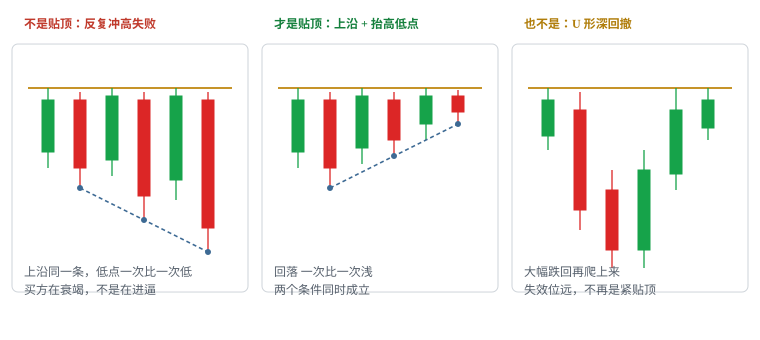
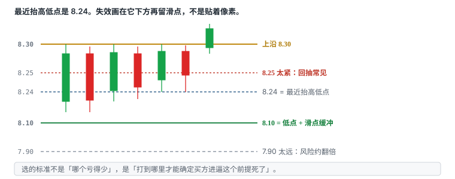

# 5.2 Flat Top（贴顶突破）

> 一句话：同一上沿被反复测试，且低点抬高、回落变浅；触发是上沿被接受，失效在最近抬高低点再留滑点。

上一章把形状和位置切开。旗形是「旗杆 + 缩量旗面」。贴顶是另一种形状：**水平上沿不动，底下的低点往上抬。** 名字不预测。它只告诉你线画在哪、哪一根穿过才算触发、打到哪里你的前提死了。

课程和笔记里它还叫 flat-top breakout、贴顶、平顶突破。本书统一用 Flat Top / 贴顶。它不是「HOD 策略」，也不是「VWAP 策略」。HOD、VWAP、整美元、日线阻力是位置。贴顶可以贴在其中任意一条上；一条光秃的 HOD 被一根大阳线直接打穿，没有横盘、没有抬高低点，那就不是这一章。

这一章在赌一个很窄的时刻：看得见的上沿供给相对固定，买方已经一次比一次早接货，穿过并被接受之后，亏钱的空间由最近那个抬高低点限定，赚钱的空间至少还能量到大约两倍风险。不是赌「这只股票还会涨很久」。

图上的 8.30、8.24、8.10、8.35、8.85 是教学用整数，不是某只股票的行情。数字可以改；改完必须写进计划，用自己的样本重跑，不能盘中「今天例外」。

## 5.2.1 这一章在赌什么

不是赌方向猜对。是等一个风险和收益都能事先量出来的时刻。


图右侧两根竖线就是全部：入 8.35、止 8.10，每股计划风险 0.25；第一目标 8.85，每股 0.50，长度比约 1:2。

```
错了亏 0.25，对了赚 0.50

做 10 次：
  对 4 次 → 4 × 0.50 = 2.00
  错 6 次 → 6 × 0.25 = 1.50
                 净赚 0.50
```

错 6 次、只对 4 次，纸面上仍可能赚钱。**前提是止损被执行，且目标真能按计划成交。** 期望值写在卷四：胜率 × 平均盈利 − 败率 × 平均亏损 − 成本。把止损偷偷下移、把目标提前改成「心里痒了就走」，上面那串算术立刻作废。

所以核心不是「看得准」，是每一笔都提前定好：

- 哪一条上沿事先看得见；
- 什么叫穿过并被接受；
- 最近抬高的低点在哪，滑点留多少；
- 上方第一层阻力够不够覆盖 1R，最好约 2R；
- 哪些情况直接放弃。

认出来「这像贴顶」只意味着值得画线。判断点永远在价格穿过那条线、并且被接受的那一刻。

## 5.2.2 两个条件缺一不可

贴顶不是「上面平就行」。必须同时满足：

1. **同一水平上沿被多次接近，没有过去。** 卖盘集中在相近价格，天花板几乎不动。
2. **低点逐步抬高，回落一次比一次浅。** 买方愿意越来越早承接，地板在抬。

只满足平顶、低点没有抬高的，是「反复冲高失败」，不是 flat top。回落一次比一次深（8.15 → 8.05 → 7.90），是买方在衰竭——关掉，看下一只。结构变成 U 形、或大幅跌回整理区的大部分，已经不是课程所定义的紧贴顶：失效位被拉远，盈亏比先坏了。



| 你看见的 | 叫什么 | 这一章做不做 |
|---|---|---|
| 同一上沿 + 低点抬高 + 回落变浅 | 贴顶 | 等上沿被接受 |
| 同一上沿 + 低点走平或下移 | 反复冲高失败 | 不做多；不要改口说「测得越多越容易破」 |
| 先深砸再爬回上沿 | U 形 / 深回撤 | 不是紧贴顶；另开样本，或改用别的形状 |
| 一根大阳线直接打穿前高 | 光秃突破 | 止损没地方放，默认放弃 |
| 两边都平的窄箱 | 横盘箱体 / squeeze | 方向未知；见后面的挤压章，不要提前命名成贴顶 |

「多次接近」是区域，不是像素。8.29、8.30、8.31 三次碰到，常常仍是同一条上沿。非要把影线尖端对齐到 0.01，会画出一条永远被刺穿、永远可以事后解释的线。卷二已经写过：线应盖住实际发生过反应的那一带。

回落变浅，可以用绝对深度看，也可以用相对上沿的距离看。教学例：

```
上沿        8.30
回落低点    8.15 → 8.20 → 8.24
距上沿      0.15 → 0.10 → 0.06
```

低点抬高，和回落变浅，在这个例子里是同一件事的两种读法。实盘里它们可能分开：低点略抬高，但某一次回落吃掉了横盘宽度的一大半——紧贴顶的假设已经变弱。计划里要写你认哪一种：绝对低点序列、还是相对深度序列。事后两套轮流用，样本是脏的。

## 5.2.3 形状不是位置

Setup = 形状 + 位置。两者独立。

| 形状（怎么画线） | 位置（线画在哪） |
|---|---|
| 贴顶：平顶 + 抬高低点 | 当日最高 HOD |
| 旗形：旗杆 + 旗面 | VWAP |
| 横盘箱体 | 整美元、半美元 |
| ABCD | 盘前高、日线阻力、发行价 |

贴顶经常贴在 HOD 下面，所以有人把两者叫成同一个策略。统计时必须拆开：

- 贴在 HOD 下的贴顶；
- 贴在 10.00 下的贴顶；
- 贴在 VWAP 下的贴顶；
- 没有贴顶形状、只是一根 K 打穿 HOD。

位置越有名，突破时越容易猛——止盈、止损、条件单堆在同一价。上方卖压也会更集中。必须看成交是否真的推进，不能因为「这是 HOD」就提高仓位。HOD 会随新高更新。一旦 8.30 被接受，新的 HOD 变成 8.55，旧线的身份变了：它变成回踩时的支撑候选，不再是这一笔的触发线。

多个位置重合提高关注优先级，不是独立概率相乘。小周期先突破整理区，再接近 VWAP 或 HOD，可能形成连续触发；日志里仍是同一条价格路径上的一次事件。不要把「VWAP + HOD + 贴顶」加成三倍胜率。

## 5.2.4 上沿怎么画

上沿必须在入场前清晰可见。事后把最高影线连起来，谁都能画出一个「早就该破」的顶。

画法：

1. 找到这段整理里，价格多次接近、但实体没有站上去的那一带；
2. 用区域，不要用一根贴合最高影线的工程线；
3. 记下它是 HOD、整美元、盘前高，还是日线旧平台——这是位置标签，不影响形状是否成立；
4. 写清「穿过」用哪一口径：最高价刺破、last 穿过、还是已收盘实体站上。

不要为了让第四次测试刚好碰到线，把线从 8.30 改成 8.32。线一改，触发、失效、空间全部跟着改，等于另开一笔。练习时保存当时锚点：时间、价格、是否允许影线穿过、当时已经测试几次。

上沿如果本身在走高——8.30、8.38、8.45 连续更高高点——那是趋势延续，不是贴顶。贴顶的「平」是这一笔的定义，不是装饰。上沿如果在走低，是更低高点，更像派发或冲高失败。

整数、半整数常常就是上沿。若一只股票一次跳动就跨 0.50，单独把半整数画成天花板没有执行意义。点差已经 0.08，还在 8.300 和 8.305 之间争论「有没有碰到」，是把噪声当结构。

## 5.2.5 低点抬高，回落一次比一次浅

第二个条件才把「有阻力」变成「买方在进逼」。

横盘可以写成一句话：

```
8.30 ═══════════════════  ← 今天这条上沿，摸了几次没过去

      ▁▂▃▄▄  ← 价格贴在下面，实体越来越小

回落低点：8.15 → 8.20 → 8.24
            └── 一次比一次浅
```

观察顺序：

1. 先有至少两次可以标出来的回落。一次下探就叫「抬高」，样本里会塞进大量随机噪声。
2. 后一次低点高于前一次，或至少不明显下破。允许影线略穿，但实体应抬高——具体容差写进计划。
3. 回落深度变浅。启发式：单次回落小于横盘区间宽度的一半。一半不是定律，是起始过滤。
4. 横盘里实体变小、波动收敛，比「K 线根数够了」更重要。

低点抬高被破坏的几种写法，必须事先认一种当失效，而不是事后挑最宽容的：

- 新低收在前一个抬高低点下方；
- 新低的实体跌破横盘下沿；
- 回落深度重新超过你写死的比例。

「还没破上沿」不是继续等待的理由。地板已经塌了，天花板还在，只是冲高失败换了一张更难看的图。

回落一次比一次浅，并不保证下一次一定破。它只说明：若还要做这一笔，失效可以画得比较近。这是仓位友好，不是胜率保证。

## 5.2.6 机制：固定供给撞上增强需求

天花板不动 = 卖单集中在同一价位，**可见数量在一段时间内相对固定**。地板抬高 = 买方一次比一次早接货，**力量在增强**。固定的供给撞上增强的需求，卖单总有被吃完的一刻——这是解释，不是定律。

反过来的机制同样常见：

- 每次测试消耗的是 bid 而不是 ask。买方把货接下来，卖方的墙还在，甚至补得更厚；
- 可见卖单突然撤走，价格空一截上去，墙又挂回来，制造假突破；
- 横盘里量一直很大但价格不动，有人在持续派货；
- 整理过长，市场注意力跑到别的名字上，破的时候没有跟随。

所以「供给会被吃完」只能当假说。能观察的是：接近时量是否收缩、突破时量是否带着价格前进、破了之后回落是否还把线还回去。猜「谁在卖」没有用。图表看不见持仓，Level 2 上的墙可以撤。

空头回补是另一种常见故事。贴顶下方如果真有人空着，上沿被接受后他们可能买回。你通常没有及时、完整的空头持仓数据。把它写成注释可以，写成触发条件不行。可观察的仍然是：穿过、接受、推进。

## 5.2.7 测试次数不是机械规律

「测得越多越容易破」和「测得越多越坚固」都不是定律。

卷二写过同一句话。这里落到贴顶上：

- 同一个位置被碰到 2–4 次、低点同时抬高，可能是买方在往上接；
- 碰到 7–8 次还过不去，也可能是买方把自己耗尽了，头顶套牢盘更厚；
- 反复测试既会消耗一侧订单，也可能说明该区域已经失效，只是还没选方向。

课程笔记里有一条否决：撞了 7 次以上还没过就关掉。**这是启发式过滤，不是物理边界。** 你可以写成 5 次、8 次，或干脆不按次数过滤、只按「低点是否还在抬、量是否还在缩」。改完写下来，单独统计。不要盘中数到第 6 次时临时改成「再给一次」。

测试次数还有周期问题。1 分钟图上已经撞了五次，5 分钟图上可能只是一根带上影的横盘。声明你在哪个周期数次数。用 1 分钟的次数去证明 5 分钟「马上要破」，是周期混用。

每次测试消耗的是当时愿意在上沿下面买的人。次数多，不自动等于卖方变少。卖方可以一直补单。次数少，也不自动等于假突破——第一次真正的放量穿过也可能直接走完口袋。所以次数只是描述，不能替代接受成交和失效位。

## 5.2.8 接受成交，不是影线插一下

水平上沿被穿过只是触发候选。之后能否在新价位**接受成交**，才决定质量。


一根长上影穿过 8.30 又收回来，是试探，不是接受。接受看起来更像：收盘站在线的那一侧，随后的回落不把线还回去。用未收盘 K 线的最高价当「已经突破」，会把大量假信号算进样本。

计划必须事先写死一种触发，不能事后挑最漂亮的：

| 口径 | 你在等什么 | 优点 | 代价 |
|---|---|---|---|
| 穿越 Trade-through | last / 主动买盘穿过上沿 | 条件出现得早 | 影线假突破多，滑点大 |
| 收盘确认 | 选定周期的 K 线收在上沿上方 | 过滤不少试探 | 入场更晚，有时直接跳开 |
| Bid hold | 买价抬到上沿之上并维持 | 更接近「被接受」 | 盘口会骗，难回测 |
| 回踩 Retest | 破了再回到旧上沿附近收回 | 失效往往更清楚 | 可能不给回踩 |

本书默认教学口径是：**选定周期上，实体站上，随后回落不还线。** 你若改成「第一笔成交穿过就买」，必须单独开桶，不要和收盘确认混胜率。

「放量」常常被写成接受的替身。量柱跳高而价格只到 8.32 就长上影收回，那是供给吸收，不是许可。量没有方向。真假对照沿用突破章：

| | 更像真 | 更像假 |
|---|---|---|
| 突破后 | 在新价位接受成交，量能跟上 | 立刻跌回平台内 |
| 回落 | 守住旧阻力，量收缩 | 直接穿过前支撑 |
| 再上冲 | 有新增成交 | 没有新增量能 |

放量也可能是顶部换手。横盘既可能蓄势，也可能买盘衰竭。接受是价格行为，不是成交量柱的高度。

## 5.2.9 和旗形、冲高失败、箱体差在哪

四种图经常被事后叫成同一个名字。入场前必须能一句话分开。

**旗形。** 先有一段明显上涨当旗杆，再有缩量回调或斜向/横向旗面。触发在旗面上沿。旗面上沿常常低于或等于前高，但不要求多次精确撞同一价。旗面若跌回旗杆大部分区间，延续假设变弱。贴顶可以没有明显旗杆——它强调的是天花板重复、地板抬高。一段上涨后贴着前高收紧，两种名字都能贴；事前写死你用哪一套触发和失效，不要等结果出来再改名。

**反复冲高失败。** 上沿在，低点不抬，甚至一波比一波深。这是阻力还有效、买方变弱。把它当贴顶买穿越，等于在卖方占优的地方追多。大盘里这种失败更常见：供给可以持续挂在同一整数关口。

**横盘箱体 / squeeze。** 上沿平、下沿也平。低点没有抬高序列。方向未知。课程对 squeeze 的处理是只做向上被接受的突破，下沿失守就说明整理失败。贴顶的下沿是斜的（更高低点），失效更近，这是它和箱体在仓位上的主要差别。

**ABCD。** 回撤更深、时间更长，要等穿过 B 点。最初可能被当成贴顶或旗形，未立刻创新高，整理变深之后才变成 ABCD。C 被跌破还拿着等 D，不是贴顶的持仓方式。

对照表：

| | 贴顶 | 旗形 | 冲高失败 | 箱体 |
|---|---|---|---|---|
| 上沿 | 水平、多次未破 | 旗面上沿，不一定反复撞同一价 | 水平、多次未破 | 水平 |
| 低点 | 抬高、回落变浅 | 旗面低点，通常高于旗杆中段 | 走平或下移 | 接近同一下沿 |
| 触发 | 上沿被接受 | 旗面上沿被接受 | 没有做多触发 | 上沿被接受（只做上） |
| 失效 | 最近抬高低点下 | 旗面低下 | — | 箱体下沿失守 |
| 典型错误 | 把失败高点当贴顶 | 旗杆中途追 | 测得越多越买 | 在箱里猜方向 |

名字次要。触发和失效不同，就是不同策略。

## 5.2.10 三种入场必须分开记账


同一条 8.30，三种进法是三笔交易。

| 入场 | Entry | 优点 | 主要风险 |
|---|---|---|---|
| 预判 Anticipation | 上沿下方，整理还没破 | 均价较低 | 突破从未发生；低点抬高中途失败 |
| 穿越 Trade-through | 穿过 8.30 的那一下 | 条件已触发 | 滑点、影线假突破、追高 |
| 回踩 Retest | 破了再回到 8.30 一带收回 | 失效更清晰 | 可能不给回踩；把失败突破误当成回踩 |

预判贴顶，等于在阻力正下方抄一个尚未发生的突破。均价好看，证伪也快：低点不再抬高，或价格远离上沿往下走，预判就错了。不要把预判失败改口成「那我改做旗形，止损放到更低」。

穿越是这一章的主入口。代价是墙刚破时盘口最稀薄。可成交限价必须有上限，上限由止损倒推，见第 15 节。

回踩是突破之后的另一笔，不是同一笔的「更优版本」。前提是前面真的发生过接受，不是影线。回踩低点若重新被 8.30 下方接受，前面那笔穿越已经错了；不要用回踩去摊平穿越。完整回踩写法在后面的回踩章。这里只要求：穿越和回踩分开统计。

加仓同理。第一笔 8.35 穿越，第二笔 8.42 再买，失效仍在 8.10，全仓风险会跳一截。本阶段默认不加。想加，必须先会重算：

```
全仓计划风险 = Σ[(各批入场价 − 共同失效价) × 各批股数]
```

超预算就减股数、或不加。卷四有完整算法。

## 5.2.11 教学例：8.30、8.24 与 8.10

沿用图里的整数，把一笔从画线写到股数。不是推荐仓位，是把字段写全。

**看见的结构。** 当日最高 8.30，四次撞它都没过。回落低点 8.15 → 8.20 → 8.24，深度 0.15 → 0.10 → 0.06。横盘里量在缩，实体在变小。上方日线下一层在 9.00 一带，中间没有更近的强平台。

**一句话。** 「它放量穿过 8.30 并被接受，跌回 8.10 我就错了。」说不出来就不做。

**触发。** 第一根在 8.30 上方留下实体、量至少达到你写死的倍数（启发式：前 5 根均量的 2 倍）。买入价按可成交限价，教学数用 8.35。

**失效。** 最近抬高低点是 8.24，不是横盘最早那个 8.15。8.24 再留滑点，图里画在 8.10。打到 8.10，「买方在进逼」这个前提死了。

**不做的附近版本。**

- 入场已经 8.55，失效还在 8.10：你在追，每股风险 0.45，同一笔预算只能买更少，且第一目标可能不够 2R；
- 突破时量没放大，价格只插到 8.33 收回：试探；
- 8.30 上方 0.20 处就是日线密集成交：口袋不够。

**第一目标。** 结构上 8.85 = 2R，或先看 9.00 整数。以先碰到的那一层为准。不要用「这只股票今天能翻倍」把目标画到看不见的地方。

这五个数——8.30、8.24、8.10、8.35、8.85——必须在点击前写在纸上或计划栏里。缺一个，这笔不存在。

## 5.2.12 止损放在哪：最近抬高低点再留滑点



选的标准不是「哪个亏得少」，是「打到哪里我才能确定自己错了」。

| 候选 | 判断 |
|---|---|
| 8.25（上沿下方一点） | 太紧。突破后回抽是常见动作，正常波动就会扫掉 |
| 8.24 正下方 8.23 | 仍然太贴。影线、点差、一次错价就能打穿 |
| **8.10（最近抬高低点再留滑点）** | 跌破它，抬高序列坏了 |
| 8.15（更早的低点） | 那是第一波回落，不是最近的结构；用它等于承认后面的抬高不算数 |
| 7.90（更早的波段低） | 太远。风险约 0.45，股数得同比砍半，而且你不再是在做贴顶 |

8.24 是结构事实。8.10 是执行价：给点差、滑点、报价跳动留的缓冲。缓冲不要留在整数、半整数关口的正下方——那里止损单最密，也最容易被扫。0.05、0.06 这类缓冲是启发式，随价格和波动改，不能固定照抄。2 美元的股票和 18 美元的股票，同一美分缓冲含义不同。

三条铁律（和卷四一致）：

1. 止损价必须在按下买入键之前就定好，同时挂上止损单；
2. 止损只能往上移，永远不能往下移；
3. 周期要一致。1 分钟给的触发，就用 1 分钟的最近抬高低点。

「1 分钟破了但 5 分钟还没破」是最常见的不止损借口。触发来自哪一根图，失效就在那一根图。选了 5 分钟当主风险周期，股数必须按 5 分钟那个更远的低点重算，不能偷用 1 分钟的窄止损放大仓位。

止损是指令或计划，不是成交保证。停牌、跳空、流动性消失时，真实亏损可以远离 8.10。仓位还要按「止损失效时我亏多少」压，见下一节。

## 5.2.13 仓位：止损定股数

止损定股数，不是股数定止损。先把失效放到逻辑死掉的地方，再反推能买多少。

```
每股风险 = 买入价 − 止损价
         = 8.35 − 8.10
         = 0.25

股数 = 单笔风险预算 ÷ 每股风险
```

教学预算用 50 美元（账户 0.5% 这类比例是启发式）：

```
50 ÷ 0.25 = 200 股
```

换一只股票就重算。止损宽就买得少，止损窄就买得多——每一笔计划亏的钱尽量同一量级。

| 每股风险 | 预算 50 时的股数 |
|---|---|
| 0.10 | 500 |
| 0.25 | 200 |
| 0.50 | 100 |

公式还要加上滑点预留，再取流动性、点差、停牌暴露等上限的最小值。预留滑点不能固定照抄，随深度和波动改。点差已经占掉每股风险的很大一块，先放弃，不要靠「少买一点」硬做。课程策略卡里有一条起始过滤：spread 超过每股风险的 20% 就不做（风险 0.25 → spread > 0.05）。**20% 是启发式。**

必须做的压力测试：止损保护不了停牌和跳空。下单前问：

> 如果它现在 halt，复牌跳到 7.50，我亏多少？能承受吗？

```
(8.35 − 7.50) × 200 = 170
```

承受不了就减股数，或仓位直接是 0。低流通、靠近 LULD、刚出融资公告的名字，尾部比 0.25 那一格大多了。名义敞口、计划风险、尾部风险必须分开写，见卷四。

小盘优先减仓，不是优先多买。波动大、停牌风险高，是双向尾部，不是天赋。

## 5.2.14 量能顺序与突破那一根

延续偏好的顺序：

```
冲动扩张 → 整理收缩 → 突破再扩张
```

贴顶的整理段，理想情况是量逐渐萎缩、实体变小、回落变浅。突破那一根，理想情况是量重新放大，并且价格真的离开上沿。

失败警告：

- 整理红量大于前面的冲动段；
- 横盘时量一直很大，价格走不动——更像派货；
- 突破量大但价格不前进，长上影；
- ask 被打穿后不断补单，价格停在线上；
- 突破后马上跌回区间；
- 点差突然扩大。

「必须放量」的机制解释是：8.30 挂着一堵卖单墙，价格上去必须把它吃掉。量放大，墙更可能是被买单吃穿；量没变，卖家可能只是暂时撤单，随时挂回来。解释只是解释。放量也可能是套牢盘集中出逃。所以量是过滤器，接受仍然看价格有没有在上方留下来。

策略卡给的起始阈值：突破那根 ≥ 前 5 根平均量的 2 倍。**2 倍、前 5 根，都是启发式。** 开盘前两分钟均量不稳定；午间均量偏低，2 倍也不等于「有跟随」。按时段分开统计，比死守一个倍数有用。

只买第一根，错过就不做——这也是启发式纪律，不是市场规则。它在防的是：止损还在 8.10，入场已经变成 8.60，风险翻倍。你若允许「第二根回踩再进」，那是回踩桶，不是穿越桶。

## 5.2.15 订单：可成交限价、部分成交、止损类型

墙刚破时最稀薄。三种买单的差别，卷三写过，这里用 8.30 再说一次。

- 市价单：倾向成交，不承诺价格。可能从 8.35 滑到 8.60，计划里的 0.25 风险当场变成 0.50。
- 普通限价挂 8.35：价格直接跳到 8.45，你可能完全没成交。
- **可成交限价**：想在 8.35 附近买，把限价挂在 8.42 一类「还能接受的最差价」。立刻吃货，但设了天花板。

上限怎么定：由止损倒推。止损 8.10，最多接受 0.32 的每股风险 → 买入上限 8.42。超过这个价没成交，是规则生效，不是遗憾。反复上调限价直到成交，等于把限价单改成了追单。

如果只成交了一部分——这会经常发生。挂 200 股，可能只成交 120 股：

1. 撤掉剩余未成交，别让它挂在市场上偷偷补上；
2. 按**实际成交股数**重挂止损；
3. 后续所有计算用实际股数，不用计划股数。

屏幕上的「计划 200」和真实持仓不是一回事。不重算，风险是错的。

止损单用 Stop Market 还是 Stop Limit，取舍在卷三。贴顶失败时速度往往很快。Stop Limit 可能在跌破 8.10 后完全无法退出。你要的是「一定出得来」，通常更接近 Stop Market，并接受滑点。停牌期间两种都无效。

卖出同理。「价格到过 8.85」不代表你能在 8.85 卖掉。急涨急跌时盘口变薄、点差拉开，挂单可能只成交一部分。限价卖单没成交：不要反复改价追着卖，直接 hit bid。少卖几分钱，好过卖不掉。

把三个价格分开记：看到的价格、允许的最差价格、账单上的均价。滑点是真实成本。不记录，你永远不知道自己实际在冒多少险。

## 5.2.16 第一目标与移止损

分两次走，是一种常见启发式，不是唯一正确退出。

**第一次：价格到约 2R，或先碰到的那层结构阻力。** 教学数 8.85。卖掉一半，剩余止损提到成本价附近。做完这一步，这笔的计划亏损被锁掉——费用和滑点仍可能让净结果为负，所以「保本」是价格上的，不是会计上的。

**第二次：剩下的用结构移动止损。** 价格每创新高，把止损挪到最近一个明显更高低点下方。跌破就走。不要用「再拿一点」代替那个低点。

目标位优先用现成的结构，按顺序找，别用「赚够多少钱」：

1. 上方最近的整数 / 半整数（9.00）；
2. 上方最近的历史阻力（日线上找，left-and-up 那套少画线的方法见卷二）；
3. 都没有，或结构目标远于 2R 且中间干净 → 用 2R。

若到目标前有更近的障碍，理论利润按现实障碍缩短。8.35 进，8.10 止，8.50 就有密集成交，口袋只有 0.15，连 1R 都不够——形态再标准也不合格。不要假设「突破后动量会打开新口袋」。新口袋是下一笔的事。

最容易犯的错：**触发条件是「价格到了 8.85」，不是「我有浮盈了心里痒」。** 在 8.40 就把止损提到 8.35「保本」，止损从 0.25 变成 0.05，正常回抽就会扫出去，然后看着它到 9.50。保本止损移得太早，等于自己给自己设了个极窄止损。移保本的价格条件要事前写死，例如「触及 2R 且卖出第一批之后」，而不是「绿了」。

时间退出也要写进计划。破了之后横着不动，既可能蓄势，也可能买盘衰竭。「还没跌」不是继续持有的充分理由。你可以写：突破后 N 根 1 分钟没有新高、或 M 分钟仍在上沿附近来回，减仓或平掉。N、M 是启发式。

不应只因为价格最后涨到更高位置，就否定较早按计划止盈。评价依据是预定规则，不是事后最高点。

## 5.2.17 突破之后：阶梯、横盘、时间退出

强趋势不是直线。它是推进 → 回踩 → 重新找到支撑。

8.30 被接受之后，它成为新支撑候选，要等回踩验证，不能宣布换位已经完成。回落到 8.32 迅速收回，低点没有坏结构，那是下一笔回踩。回落到 8.28 并在 8.30 下方留下实体，阶梯坏了，前面的多头假设降级。

大绿 K 后立刻再追，止损往往还在 8.10，入场已经 8.70，盈亏比变差。等新的小结构和近的失效位，再决定要不要下一笔。那一笔可能是旗形，可能是微回撤，可能还是贴顶——事前命名，不要事后合并成一个大赢家。

价格没有立刻延续时，看三件事：

- 回落是否守住旧上沿；
- 成交量是否收缩；
- 再次上冲有没有新增成交。

三件都不成立，时间退出。复盘不能只圈最终那根最高的绿 K。应记录首次入场时可见的上沿、止损与上方空间。当时看见的图，才是样本。

突破后的回踩，前提是前面真的接受过。没有这一步，无论跌多深都不是回踩，更不是「更便宜的贴顶」。

## 5.2.18 假突破之后做什么

1. 不等待「再给一次机会」；
2. 按失效减仓 / 平仓；
3. 检查是否成为多头陷阱（本卷后面的反转章）；
4. **不自动反手做空**——反手是新的一笔，要有 locate、新计划和向上跳空的尾部准备；
5. 记录滑点和「在上方停留了多久」。

失败特征：立即跌回、卖盘量大却不涨、旧阻力没有转支撑、点差扩大、更低高点后跌破最近抬高低点。可见卖单突然撤走再挂回，是假突破的常见盘口样子；你未必能在当时识别「这是撤单」，所以还是用价格接受来判。

失败后不准改故事：

- 不加仓摊平，除非计划事前写过分批和全仓风险上限；
- 不把亏损的日内单改成隔夜；
- 不因为这一笔亏了，就把下一笔无关的上涨叫「还回来」；
- 不把没成交的限价单在更高的地方反复改价，直到变成市价追。

1 分钟信号更快但噪音更多；5 分钟更慢，失效距离通常也更大。两种周期的贴顶分开统计。

## 5.2.19 多周期与日线空间

四个窗口回答不同问题，不是投票。

| 周期 | 贴顶上它回答什么 |
|---|---|
| 日线 | 上沿是不是旧套牢？破了之后到下一层还有没有 ≥ 1R、最好约 2R？ |
| 5 分钟 | 当天是上升、下降还是宽幅震荡？这是第几次高位整理？ |
| 1 分钟 | 触发和最近抬高低点在哪？ |
| Level 2 / T&S | 现在点差、深度、是否补单，能不能按计划进出？ |

先用较大周期确定区域，再用较小周期找可执行的触发和清晰失效。小周期上漂亮的贴顶若正撞到日线高点，实际空间可能很小——不是形状错了，是位置把 reward 先削掉了。这种情况正确的动作常常是不交易，而不是把止损放到更远的日线低点去「给空间」。空间不够是位置问题，不是胆量问题。

第几次必须声明周期。1 分钟可能已经是第三次小贴顶，5 分钟仍只是一根扩张后的横盘。第一次通常更接近原始动量；后面每一次都要重新判断注意力有没有散。不要把第二、第三次和第一笔丢进同一个统计桶。连续成功的前几次会诱使后续追高；序号必须入日志。

开盘头两分钟，K 线还没形成稳定高低点，你往往没有可用的最近抬高低点。策略卡把「开盘后 2 分钟才开始做」写成启发式。午间低量时段，同一条 8.30 可能只是稀薄挂单，一根单就能刺穿再跌回。所以「这是阻力」必须带上时间：它是今天早上被验证过的上沿，还是中午第一次被薄量碰到的旧线？

靠近 LULD 上轨时，下一事件可能是停牌而不是平滑的 2R。计划止损覆盖不了恢复后的第一跳。默认仓位可以是 0。

## 5.2.20 盘口：墙会撤，量没有方向

Level 2 回答现在的执行环境，不预言下一步。贴顶上沿常常能看见一档或多档卖单。它只说明当下有可见供给。

观察顺序：

- 点差有没有突然变宽；
- 某档被吃后是否补回；
- 成交主动性变化时价格有没有同步推进；
- 关键位附近是吸收还是快速撤单。

大单可撤销、可拆单、可被隐藏单替代。只因看见「墙」就提前在下方预判，容易被撤单击中。只因墙消失就市价追，容易买在假突破的第一跳。Time & Sales 连续打在 ask，也不等于价格会继续涨——可能正撞上隐藏卖单。

突破那一下，真正要看的是：价格离开 8.30 之后，bid 有没有跟上来。若 last 在 8.40、bid 还在 8.28，你看到的「突破」可能只是一次扫单。接受，很多时候长得像 bid 抬到旧阻力之上，并且回落时仍有人在那附近接。

自己的计划股数不能大于当前可见深度的一小部分。200 股在 8.30 × 5,000 的墙上和在 8.30 × 100 的墙上，不是同一笔交易。深度不够，先砍股数；砍完口袋仍不够覆盖成本，放弃。

隐藏流动性会让「放量穿过」看起来很轻松，随后价格走不动。Tape 持续成交而显示量不下降，只是行为线索，不能证明某个买家身份，更不能加仓。

## 5.2.21 否决清单

任何一条成立，关掉这只股票，找别的。「不交易」也是一个需要事前定义的动作。

- 回落一次比一次**深** → 买方在衰竭
- 只满足平顶，低点没有抬高 → 冲高失败，不是贴顶
- 结构已变成 U 形或大幅跌回 → 不再是紧贴顶
- 没有横盘，一根大阳线直接冲过去 → 止损没地方放
- 突破时成交量没放大，或放量但价格不前进 → 更像假的或吸收
- 横盘时量一直很大但价格不动 → 持续派货候选
- 没在你写死的那一种入场里进场，价格已经跑远 → 止损不变，风险翻倍
- 上方空间不足（到下一层阻力 < 1R，或达不到你写死的最小倍数）→ 不划算
- 按可成交限价单的上限没成交 → 规则生效，不是遗憾
- 点差超过你写死的比例 → 执行成本吃掉太多利润
- 开盘头几分钟还没有稳定高低点 → 没有可用失效位
- 整理过长、相对量已经掉出观察名单 → 注意力可能已经离开
- 靠近 LULD / 正在停牌 / 刚出融资或坏消息 → 尾部不接受就仓位为 0
- 入场离上沿已经很远，还不肯减股数
- 说不出那句「它 ______，跌到 ______ 我就错了」

次数那一条单独再说一次：撞了「很多」次还没过，可以当成启发式放弃，**不是**「第 7 次一定不能买、第 6 次一定能买」。你要么写死一个上限，要么不按次数过滤。不要用次数替代低点是否抬高。

## 5.2.22 启发式起始规则

下面整张表都是起始值，不是市场定律，也不是你必须抄的参数。定死才重要。定死了才能事后区分「规则错了」和「我没执行」。改参数的唯一时机是复盘，依据是统计，不是上一笔。

| 参数 | 起始值（启发式） | 它在防什么 |
|---|---|---|
| 横盘最少 K 线 | 数根 1 分钟，策略卡常用 ≥ 4 | 把一根停顿当成贴顶 |
| 最少回落次数 | ≥ 2，且后一次更浅 | 把随机下影当成抬高 |
| 单次回落深度 | < 横盘宽度的一半 | U 形、深砸 |
| 横盘量能 | 逐渐萎缩 | 高量走平的派货 |
| 突破量 | ≥ 前 5 根均量的 2 倍 | 没人吃墙 |
| 触发 | 第一根被接受的穿越；错过改回踩或不做 | 追远 |
| 失效 | 最近抬高低点 − 滑点缓冲 | 用情绪距离当止损 |
| 缓冲 | 随波动，教学图用 0.05 | 贴像素 |
| 最小空间 | 结构上约 1:2，至少能看见 1R | 破了就撞墙 |
| 点差上限 | 每股风险的 20% | 成本吃掉期望 |
| 开盘后等待 | 约 2 分钟 | 没有稳定高低点 |
| 单笔风险 | 账户一个很小的固定比例 | 按「想买多少股」倒推 |
| 测试次数上限 | 可设 7，也可不设 | 耗尽的买方；设了就执行 |

选股漏斗——涨幅、相对量、价格区间、流通盘——在卷一。贴顶不负责从全市场抓股票。它只在已经 in-play、你愿意盯到触发的那几只上工作。没有催化、没有量、点差不能执行的名字，形状画得再标准也不进观察名单。

可测试的最小定义，写成和旗形同一格式，方便对照：

```
同一上沿被测试 >= 2 次，实体未站上
抬高低点 >= 2 个，后一次回落更浅
整理量 < 前一段冲动量
触发 = 上沿被接受（写死穿越 / 收盘 / 回踩之一）
失效 = 最近抬高低点 − 滑点
第一目标 = min(2R, 下一层已看见的阻力)
```

每个边界用自己的股票池校准。热市样本不要直接外推到冷市。

## 5.2.23 日志字段与复盘

没有这块，三个月后还是现在的水平。形态最漂亮的一笔不一定最好。真正可交易的是风险点明确、第一目标有空间、现实订单能完成的那一笔。

每笔至少记：

```text
日期 / 代码 / 周期
位置标签（HOD / 整美元 / 日线 / VWAP）
上沿价（画线当时，不是事后修正）
测试次数（声明周期）
抬高低点序列
最近抬高低点 / 滑点缓冲 / 失效价
入场类型（预判 / 穿越 / 回踩）
计划买入 / 实际均价
计划止损 / 实际止损成交
股数：计划 / 实际成交
点差 / 可见深度
突破量 vs 前 N 根均量
上方第一阻力 / 计划目标
是否到达 1R / 2R
在上方停留了多久
MAE / MFE
规则违约（与盈亏分开）
```

每笔存三张图：入场前（右侧全部遮住）、入场后、退出后。比较决策，不比较故事。

每笔回答三个问题：

1. 入场时，我看到的两个条件是否已经完整出现？不是事后补的低点抬高。
2. 如果没有后来那根大绿 K，我这个入场还合理吗？
3. 这笔的结果，是因为决策好，还是因为运气好？

赚钱的不合格入场，记成错误。它比亏损的合格入场更危险：它教你重复那个入场，直到亏光。按计划做了、亏了，不算流程错误。没按计划做、赚了，算。

每月只根据统计改规则。不要用单笔绿或单笔红改 8.10 那种结构定义。1 分钟和 5 分钟、穿越和回踩、贴在 HOD 和贴在整美元，分开算胜率和平均盈亏。混成一个「贴顶胜率 55%」，你不知道到底是形状、位置还是入场类型在贡献。

反事后偏差的最低动作：把画面停在穿越前一根，问自己当时会不会买。会，再揭开后面。不会，这笔不能进「好形态」相册。

## 5.2.24 入场检查表

下单前逐项。有一项答不上，仓位是 0。

**形状**

- 上沿在入场前是否已清晰可见？它是区域还是你刚为了贴影线改过的线？
- 低点是否抬高？回落是否变浅？还是只是平顶？
- 有没有变成 U 形或深回撤？
- 你在哪个周期数测试次数？次数有没有被你当成机械买卖信号？

**位置**

- 这条上沿贴在 HOD、整美元、日线还是 VWAP？
- 当前价夹在哪两层之间？上方最近阻力有多远？扣掉滑点后还有没有 ≥ 1R？
- 是第一段整理，还是已经延伸很远后的追价？

**触发**

- 触发价具体是哪个数字？穿越、收盘、回踩，你写死的是哪一种？
- 那根 K 线收盘了吗？未收盘最高价有没有被你当成已经突破？
- 量是推进，还是只有柱子没有价格？
- 这笔是「看到确认」，还是只因为害怕错过？

**风险**

- 最近抬高低点是哪个价？滑点缓冲多少？失效写成价格了吗？
- `可亏金额 ÷ (入场 − 失效 + 滑点)` = 多少股？再和深度上限比了吗？
- 点差占每股风险多少？
- 若停牌、坏消息或直接 flush，最大损失是否可承受？
- 预判 / 穿越 / 回踩，你记的是哪一种？有没有偷偷加仓却没重算全仓风险？

**退出**

- 第一目标在哪个阻力？分批比例？
- 移保本止损的价格条件是什么？会不会太早？
- 时间退出条件是什么？
- 卖不掉时，是 hit bid 还是改价追着卖？

**一句话**

```
它 ______，跌到 ______ 我就错了。
```

## 5.2.25 数字练习

教学整数。先自己算，再对答案。

1. 上沿 8.30，回落低点 8.18、8.22、8.26。这还是不是贴顶？最近抬高低点是哪个？
2. 同上，你留 0.06 滑点。失效画在哪？若计划买在 8.36，每股风险多少？
3. 单笔可亏 40 美元，每股风险 0.20，最多多少股？若点差 0.06，按「点差 ≤ 风险 20%」这条启发式，做不做？
4. 计划买 300 股，只成交 180 股。止损单应按多少股挂？剩下 120 的限价怎么办？
5. 入 8.35，止 8.10，第一目标 8.50 就有日线平台。口袋多少 R？按「至少约 2R」做不做？按「至少 1R」呢？
6. 8.30 被一根长上影插到 8.41 收回，收盘 8.27。算不算接受？
7. 同一只股票，1 分钟图回落三次，5 分钟图只是一根带上下影的 K。你用 1 分钟穿越、5 分钟低点当止损，错在哪？
8. 第一批 8.35 买 200 股，第二批 8.50 加 200 股，共同失效仍是 8.10。全仓计划风险多少？若预算 50 美元，还加不加？
9. 胜率 40%，平均赚 0.50，平均亏 0.25，平均成本 0.04。期望值是多少？若因为过早保本，平均盈利掉到 0.20，还剩多少？
10. 8.24 是最近抬高低点。有人把止损放 8.25，有人放 7.90。各错在什么地方？

### 答案

1. 是：同一上沿（题设）+ 低点抬高、回落变浅。最近抬高低点 8.26。
2. 失效 8.20。每股风险 `8.36 − 8.20 = 0.16`。
3. `40 ÷ 0.20 = 200` 股。点差 0.06 > 0.20 × 20% = 0.04，按该启发式不做。
4. 按 180 股挂止损；撤掉未成交的 120，不要留在市场上。
5. 口袋 `8.50 − 8.35 = 0.15`，风险 0.25，约 0.6R。按 2R 不做；按 1R 也不做。不要假设会打开新口袋。
6. 不算。影线试探，收盘还在线下。
7. 周期混用：触发和失效必须同一周期。5 分钟低点更远，按它算仓位会过大；按 1 分钟算又和 5 分钟止损不一致。
8. 第一批 `(8.35−8.10)×200 = 50`，第二批 `(8.50−8.10)×200 = 80`，全仓 130。超过 50 的预算：减少第二批、上移共同失效（需结构允许），或不加。默认不加。
9. `0.40×0.50 − 0.60×0.25 − 0.04 = 0.01`。平均盈利掉到 0.20 后：`0.40×0.20 − 0.15 − 0.04 = −0.11`。过早保本可以单独把正期望做负。
10. 8.25 太紧，回抽就会扫；7.90 太远，不再检验「抬高序列」，只是把贴顶做成宽止损的波段。

## 先记住这些

- 两个条件同时成立：同一上沿多次未破，加上低点抬高、回落变浅。只平顶不是贴顶。
- 触发是上沿被接受。影线插一下、未收盘最高价，都不是突破。
- 失效在最近抬高低点下方，再留滑点。教学图里低点 8.24，失效画在 8.10。
- 测试次数不是机械规律。测得越多越买、测得越多越坚固，两条都不成立。
- 贴顶是形状。HOD、VWAP、整美元是位置。不要加成圣杯。
- 追 = 离失效位太远。止损位不会跟着买入价上移。
- 预判、穿越、回踩分开记账。旗形、冲高失败、箱体，触发和失效不同。
- 止损定股数。计划止损管连续成交，管不了停牌后的第一跳。
- 表里的根数、倍数、2R、点差比例全部是启发式。改完写下来，用样本验证。

## 不要做的事

- 把反复冲高失败、U 形深回撤、光秃大阳线都叫做贴顶。
- 机械地「测得越多越买」，或数到某个次数就空。
- 用未收盘 K 的最高价当已经突破。
- 止损贴在上沿下方一点，或放到更早的大波段低点充大胆。
- 大阳线中途市价追；错过第一根就用原止损去追远。
- 过早把止损挪到成本，给自己设一个极窄止损。
- 把 VWAP 突破、HOD 突破、贴顶当成必须同时满足的三倍确认。
- 假突破后摊平、改口隔夜、或自动反手做空。
- 用后来那根大绿 K 证明当时的入场合格。
- 把课程里的 4 根、2 倍、7 次、0.05 缓冲当成自然定律。
