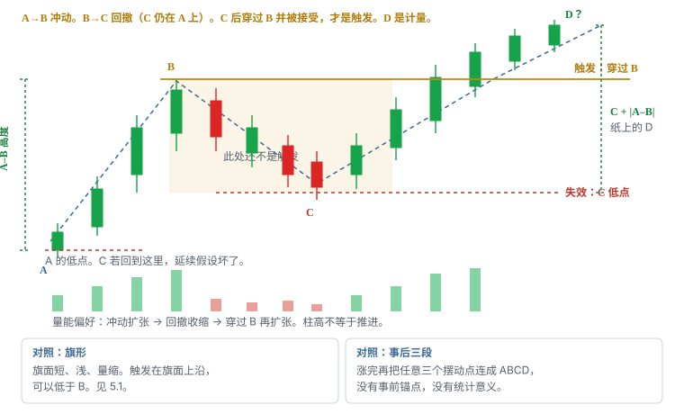
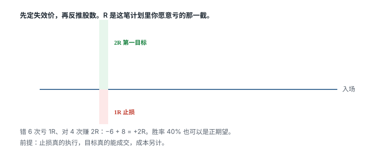

# 5.3 ABCD

> 一句话：ABCD 是计量延续。A→B 冲动，B→C 回撤，C 后穿过 B 并被接受才触发；失效在 C 低点。D 不是欠条。事后硬凑三段不算。

课程也把它叫 1-2-3-4。名字不重要。它和旗形是同一家人：前面有一段已经发生的上涨，后面有一段整理，你赌整理结束之后趋势恢复。差别不在四个字母，在**等多深、等多久、用哪条线当触发、错了从哪走**。

旗形的旗面短、浅，触发常常就在旗面上沿，那个上沿可以低于 B。ABCD 往往是：最初被当成旗形，**没有立刻创新高**，整理更深、更长，才把前高 B 重新当成必须穿过的那条线。课件把这种「失败或拖延的旗形」归为 ABCD。你不能等它走完再改口：做成了叫 ABCD，没做成叫「还在旗面里」。

D 只是事先写在纸上的计量。市场不欠你这段距离。C 被跌破之后还拿着等 D，是改故事，不是持有。

本章只做多头延续。向下的镜像还要处理 locate、借股费、SSR 和上行跳空，规则不能把图上下翻转就用。形状和位置仍然分开：ABCD 是怎么连线；整美元、盘前高、日线阻力、VWAP、HOD 是线画在哪。位置越有名，穿过时越容易猛，上方供给也越集中。

数字——回撤不超过 A–B 的一半、C 必须高于 A、整理根数、等距投射——全部是启发式。改完写进自己的计划，用自己的股票池校准。未标明的「感觉像 ABCD」没有统计意义。



## 5.3.1 四个点分别是什么

事前能指着图说出来的只有 A、B、C。D 在穿过 B 之前不存在。

| 点 | 是什么 | 不是什么 |
|---|---|---|
| A | 这一段冲动的起点。起涨基点 | 当天最低、年初最低、你喜欢的任意低点 |
| B | 冲动段的第一个清楚摆动高点 | 盘中每一根上影的最高价 |
| C | 回撤后可防守的低点，计划里通常要求仍在 A 上方 | 「已经跌回去了，所以一定会再涨」的理由 |
| D | 计量延伸区，或穿过 B 之后新结构给出的目标 | 承诺到达的位置、持有许可证 |

A 是起涨基点，不是「这张图最左边那根」。B 是第一次高点，不是事后看见的最高点——后面如果走出 D，最高点会更高，那是结果，不能倒过来改 B。C 必须是你在**还没穿过 B 的时候**就能防守的低点：跌破它，延续假设结束。只有重新突破 B，才进入所谓 D 段。

1-2-3-4 是同一套点的另一种数法：1 = A，2 = B，3 = C，4 = D。日志里只留一套字母，不要两套混用。

四个点必须落在**同一个主周期**上。1 分钟上的 A、5 分钟上的 B、日线上的 C，拼不出一笔交易。嵌套可以存在：5 分钟看起来像旗形，1 分钟走出 ABCD，那是多周期对齐，不是两个独立信号，也不是两份仓位。

## 5.3.2 A→B：冲动段

没有冲动，就没有延续。A→B 必须是一段**相对清楚、相对快**的上涨，而不是横盘里随机抬了几根绿 K。

冲动段要能回答：

- 相对同一股票、同一时段，这段涨幅和速度够不够被叫作摆动，而不是噪声；
- 价格扩张时成交量是否同步扩张（偏好，不是定律）；
- 这段上涨有没有把价格送到一个新的、事前看得见的区域附近——前收盘、整美元、盘前高、日线阻力、HOD；
- 从 A 到 B 的高度，后面会不会变成你纸上的计量尺。

「相对区间 X」里的 X 必须自己定。小盘热股 1 分钟上 8% 可能只是一根普通冲动；冷门大盘股日线上 8% 已经是事件。不要把课程截图里的垂直绿柱当成所有市场的最小摆动。

趋势尚未走出足够空间就回撤，整理更容易失败。A→B 太短，B→C 再吃掉一大半，你得到的不是 ABCD，是一次冲高失败。过早的回撤记 premature pullback，不要硬留在样本里当「还没走完的 D」。

冲动段本身不是入场。看见第一段上涨就追，是在旗杆 / A→B 中途进场。触发在后面。

A 的锚点一旦写下就不要因为后面更低而改。如果后来跌破 A，这笔 ABCD 已经失效，需要的是新地图，不是把 A 往下拖。

## 5.3.3 B→C：回撤

B→C 是整理，不是新的下跌趋势。你要看到的是：抛压减轻或买盘仍愿意在更高处接手，而不是 HH/HL 结构已经坏掉。

计划里至少要事先写死这几条（数字可改，不能不写）：

1. **C 是否必须高于 A。** 默认要高于。C 回到 A，等于把冲动段走回去，延续假设变弱到通常不该再叫 ABCD。ATAI 那类 scalp 的教法也是：C 必须在 A 上方形成可防守低点。
2. **B→C 最大回撤。** 课程常把「不超过冲动段约一半」当作较强版本的启发式。50% 不是自然边界。更深的回撤可以另开一个桶，不要和浅回撤混胜率。
3. **时间。** 旗面常见 2–5 根；ABCD 的 C 往往更长。长到什么时候算「注意力散了」，必须有时间止损，不能无限等。
4. **量。** 偏好回撤量小于冲动段量。红柱不等于这一根里每一股都是主动卖；绿柱也不等于主动买完。比较的是总量、同时段基准、点差和推进，不是颜色。
5. **C 能不能再破某个支撑。** 例如 VWAP、9 EMA、前一次突破位。允许或禁止必须写死。不写的话，你会在盘中把每一次下探都解释成「还在找 C」。

C 不是买点。C 只是把失效位标出来。在 C 完成之前把仓位加满，等于提前做突破，失效却放在更远的 C——这是追的 ABCD 版。整理区内部的来回不是加仓理由。

回撤过浅，C 离 B 很近，穿过 B 的触发容易被噪声扫进扫出，1R 很小但假信号多。回撤过深，趋势可能已经损坏，穿过 B 时你离 C 很远，1R 很大，股数必须下去。两种都可能出现在同一名字下，所以深度要分桶。

C 的低点用**已完成摆动**来标，不要用还在延伸的下影。未收盘 K 线还可能继续往下。你以为 C 在 7.70，下一分钟打到 7.58，锚点已经改写。样本规则是：C 确认之前，这笔不算触发，也不算「C 被跌破的失败」——它还没出生。

## 5.3.4 C→D：恢复并穿过 B

C 之后价格重新上行。这只说明短线方向转向上，**还不构成 ABCD 的触发**。触发是：恢复之后**穿过 B，并且在 B 上方被接受**。

接受不是一根长上影插过 B 又收回来。接受看起来更像：收盘站在 B 那一侧，随后的回落不把 B 还回去。用未收盘最高价当「已经突破」，会把大量假信号算进样本。影线试探和实体站上的对照见卷二；这里只记住：B 被刺穿 ≠ B 被接受。


穿过 B 之后才谈 D。D 有两种常用写法，必须事先选一种，不能看走成什么样再挑：

- **等距计量：** 从 C 向上量一段约等于 A–B 的高度，纸上得到 D。有人从 B 再量一段 A–B，得到更远的第二目标。都是尺子，不是欠条。
- **结构目标：** 穿过 B 之后，看上一层事前画好的阻力——整美元、日线套牢、盘前高。空间不够 1R 或 2R（你计划里写的那个），这笔放弃，不要因为名字叫 ABCD 就做。

C 拖得越久，计量越不可靠。盘中拖二十根，注意力可能已经换股；日线上拖一个季度，公司、板块、利率可能已经换了一季。超过时间止损仍未走出 C，按时间结束，不要把「ABCD 还没走完」写成无限期许可。

第二次上攻量能不足、在 B 附近连续受阻，应降低突破预期。价格来回舔 B 而不推进，是吸收，不是「测得越多越买」。

## 5.3.5 触发、失效、三种入场

| | |
|---|---|
| 怎么认 | A→B 冲动清楚；B→C 回撤后 C 仍可防守（默认高于 A）；主周期固定 |
| 触发 | C 之后恢复并穿过 B，且被接受 |
| 失效 | C 的低点（可再留一点滑点，但滑点不是把 C 改到更舒服的地方） |
| 常见失败 | 第二次上攻在 B 连续受阻；穿过 B 立刻跌回；C 被跌破后仍拿着等 D；突破 K 已经很大，入场到 C 的风险不合理还硬上 |
| 不做 | 事后硬凑三段；任何三段都叫 ABCD；D 当承诺；C 完成前加满仓；与日线阻力重叠却不算空间 |

失效永远在 C 低点。不是「B 下方几个百分点」，不是均线，不是你的均价。选了 C 当结构失效，仓位就必须按入场到 C 的距离来算。觉得太宽，就减股数或放弃，而不是把止损挤到 B 底下几美分——那是另一笔交易，叫「B 假突破」，要另开桶。

三种入场必须分开记账。同一条 B，三种进法，混进一个胜率，样本是脏的。


| 入场 | 在 ABCD 里长什么样 | 优点 | 主要风险 |
|---|---|---|---|
| 预判 | C 之后、尚未穿过 B，在 B 下方买 | 均价较低 | 突破从未发生；你把「靠近 B」当成了触发 |
| 穿越 | 价格穿过 B 的那一下 | 条件已触发 | 滑点、追高、假突破 |
| 回踩 | 穿过 B 并被接受后，回到 B 附近再收回 | 失效往往更清楚，有时能把风险从「入场到 C」收到「入场到 B 回踩低点」 | 可能不给回踩；给了也可能是失败突破的回抽 |

预判在 ABCD 里特别危险：B 还没破，你已经按 C 那么远的止损在承担风险。均价好看，期望值不一定好看。若你坚持做预判，日志必须标明，不能成功算「ABCD」，失败算「还没触发」。

穿越是课程最常说的那一种：C 后恢复，trade-through B。入场含滑点后减去 C（再减你允许的缓冲），才是每股风险。

回踩是独立入场。穿过 B 的那根 K 已经很大、到 C 的距离不合理时，等回踩是合法的下一笔，不是同一笔的「改良版」。不要把成功的穿越和成功的回踩拼成同一个胜率，也不要把失败的穿越改口成「我其实在等回踩」。


C 之后、穿过 B 之前，1 分钟上会出现「第一根创新高」：当前 K 第一次突破前一根已收盘高点。那只说明短线重新向上。它不是整段 ABCD 已确认，更不等于已经穿过 B。若你用微结构创新高当触发，那是另一套 setup（更接近旗形或第一 / 第二次回撤），不要事后贴上 ABCD 的标签。

## 5.3.6 对照旗形

两张图经常长得很像。差别要写在计划里，不能靠盘中感觉。


| | 旗形（5.1） | ABCD（本章） |
|---|---|---|
| 前一段 | 旗杆 = 明显上涨 | A→B = 同样是冲动 |
| 整理 | 旗面短、浅，常见 2–5 根，量通常缩 | B→C 更深或更长，「没立刻过前高」 |
| 触发线 | 旗面上沿，可以低于 B | **B 本身** |
| 失效 | 旗面低点 | **C 低点**（常常更深，1R 更大） |
| 典型失败 | 旗面跌破；旗杆中途追 | 在 B 受阻；C 破了还等 D；事后三段 |
| 互相转化 | 未立刻创新高，整理加深 | 最初可能被当成旗形 |

转化规则必须事前写死，例如：

```
若整理开始后 N 根内穿过前高 → 记旗形
若 N 根内没有过前高，且回撤仍满足 C > A、回撤 ≤ 计划上限
    → 改记 ABCD 候选，触发改到 B，失效改到新的 C
若回撤跌破原旗面低点但仍高于 A
    → 旗形失败；是否升级为 ABCD，只能用事先写好的规则，不能看结果再决定
```

禁止的做法：旗形触发做了、止损打了，价格后来过了 B 并走出一段，再把旧单改名为 ABCD 赢家。那是两笔，中间隔着一次失效。

5 分钟旗形与更细周期 ABCD 叠在一起，是多周期对齐。处理方式：

- 只选一个主风险周期；
- 触发和失效都在这个周期上定义；
- 另一个周期只用来避免明显冲突（例如 1 分钟要买，5 分钟已经跌破对应低点）；
- 不要把两个名字加成两个「确认」。

贴顶（5.2）也常和 ABCD 抢标签。贴顶的触发是水平上沿被接受，低点抬高是形状的一部分。若上沿就是 B，且低点逐步抬高，你可以把它记成贴顶，也可以记成「C 由一串更高低点组成的 ABCD」。选一个名字，写死触发，不要同一笔两边都算。

## 5.3.7 不是事后三段

这是 ABCD 最容易烂掉的地方。单边趋势里可以标出许多重叠的 A–B–C–D。右侧已经涨完时，谁都能连出漂亮的四段。若任何三段都能命名为 ABCD，标签就失去统计意义。

活着的样本，只允许在 B、C **尚未被后续价格改写之前**标点。练习方法：

1. 隐藏右侧 K 线；
2. 在当前可见图上标 A、B，若回撤已停，标 C；
3. 写下：触发价 = B 被接受；失效价 = C；时间止损 = T；计量 D = …；上方空间 = …；
4. 再揭示后续；
5. 结果只能是：触发并走、触发失败、从未触发、C 被跌破、时间结束。不许第四种「其实换个 A 更好看」。

最小摆动和时间尺度必须固定。否则你会把 1 分钟上每一个微高点当 B，也可以把三天的大波当 B，同一天给自己六笔「ABCD」。规定例子（启发式，改完要用样本校准）：

- 主周期 5 分钟时，A→B 至少是最近 20 根里最大的向上摆动，或至少 X 倍 ATR / 相对开盘波幅；
- 1 分钟上的微摆动只用于执行，不另开一套字母；
- 同一主周期里，前一笔 ABCD 的 D 还没走完，不重叠再标一套新的 A。

C 低于 A 的三段，不是多头 ABCD。那是冲高回落，可能变成完全不同的 setup（失败突破、反转、甚至做空），不要为了四个字母把 A 往下挪。

「看起来像」不够。必须额外定义的边界见下一节。缺任何一条，你都在给自己事后解释权。

## 5.3.8 必须额外写死的边界

Starter 课说得很直：ABCD 很宽泛。必须额外定义，否则几乎任何走势都能事后标成 ABCD。把下面六条抄进计划，填上你的数：

| 边界 | 你要填的 | 不填会怎样 |
|---|---|---|
| B→C 最大回撤 | 例如 ≤ 50% A–B，或 ≤ 某个均线 / VWAP | 深度完全不同的回撤被当成同类 |
| C 是否必须高于 A | 默认是 | 把回到起点的失败冲高算进延续 |
| C 处成交量 | 例如小于 A–B 段均量 | 放量崩回仍被当成「健康回撤」 |
| D 怎么量 | 等距投射 / 前高 / 只做到 2R 中的哪一种 | 走多远都能说「还没到 D」 |
| 超过多长时间失效 | 根数或分钟、日线则是交易日 | C 无限延长，仓位变成无期限赌注 |
| C 是否允许下破某支撑 | 允许或禁止，写明是哪一条线 | 盘中把每一次下探都解释成找 C |

这六条不是圣杯参数。它们的作用是：**让失败长得像失败**。没有它们，你总能为亏损找到一个更漂亮的字母。

和日线阻力重叠时，先计算穿过 B 之后的真实空间，而不是只看形态名称。空间被下一档更强水平吃掉，你赚的是滑点。多个位置重合提高关注度，但不是独立概率相乘。日志里仍是同一条价格路径上的一次事件。

## 5.3.9 计量怎么用，怎么不用

A–B 的高度可以当尺子：

```
纸上的 D ≈ C + (B − A)
```

有人再写第二目标：

```
D2 ≈ B + (B − A)
```

只是事先写在纸上的一个数字。用途：

- 检查第一目标有没有至少约 2R 的结构空间（2R 本身也是启发式）；
- 决定分批：一部分在计量附近减，一部分改用新结构管；
- 穿过 B 之后如果立刻撞上更近的日线阻力，计量作废，这笔可能直接不做。

不用途：

- 作为持有到 C 被跌破的理由；
- 作为「还没到 D 所以加仓」的理由；
- 作为胜率承诺。课程里的 TSLA、SPOT 日线例子是结果展示，存在选择偏差。必须同时保存：从未穿过 B 的、跌破 C 的、穿过 B 立刻失败的。

计量在盘中短结构上比在跨季日线上更说得通，因为尺子的假设是「同一段注意力、同一批参与者还在」。C 拖得越久，这个假设越差。即使 D 碰巧走到了，也不能证明当时的持有过程正确——你可能在 C 下方熬过了一段不该熬的路。

穿过 B 之后，管理改用新结构：更高低点、回踩 B、下一层阻力。不要把四个字母一直画到收盘。字母的任务在触发那一刻已经完成。

## 5.3.10 量能顺序

延续偏好的顺序：

```
冲动扩张 → 回撤收缩 → 穿过 B 再扩张
```

这是偏好，不是开关。低量突破有时也能走，高量突破有时是顶部换手。量要问有没有推进，不是只问柱子高不高。

失败警告：

- 回撤红量大于冲动段，C 更像出货；
- 穿过 B 时量大但价格不前进，ask 不断补单；
- 突破后马上跌回 B 下方，B 没有转成支撑；
- 点差扩大，可见深度消失；
- 突破量大，第一根接受 K 之后立刻大阴，像高量假突破。

平台把上涨 K 的总量涂绿、下跌 K 涂红。颜色不是主买主卖的鉴定。观察收缩 / 扩张时比较：本周期总量与前几根、相同日内时段的正常量、突破价附近实际成交速度、点差与可见深度、突破后能否维持而不只是瞬间打印。

量缩回撤的解释是抛压可能较轻；它仍可能只是买方消失。买方消失的回撤，后面很难给出干净的 D。

## 5.3.11 多周期：一笔交易一个主风险周期


同一段价格，1 分钟看起来杂乱，5 分钟可能更清楚。清楚不代表免费。选择了 5 分钟的 C 当止损，就必须按 5 分钟的每股风险缩小股数。用 1 分钟很窄的微低点算仓位、用 5 分钟很宽的 C 当「真正失效」，实际损失会被低估。

检查顺序和卷二相同，只是问题换成 ABCD：

1. **日线：** 上方最近阻力、潜在空间、B 是不是正好顶在套牢区；
2. **5 分钟：** 当天是上升、下降还是宽幅震荡；这是第一段有序回撤，还是已经多次延伸；
3. **1 分钟：** 穿过 B 时是否已经过度延伸；有没有可执行的微结构，还是只能市价追；
4. **Tape / Level 2：** 点差、成交速度、B 上方可见供给是被吃掉还是撤单制造假象；
5. **订单计划：** 哪一个周期的 C 是真正失效点。只能有一个。

不要说「1 分钟破了 C 但 5 分钟还没破，所以止损可以先不动」。多个周期不是投票。未收盘的 1 分钟还会改写正在合成的 5 分钟；用未完成的 5 分钟 C 当下止损锚点，锚点自己会动。

「第几次」也必须按固定周期数。1 分钟可能已经是第三次小回撤，5 分钟仍只是 A→B 这一根扩张。跨周期混着数，统计没有意义。课程偏好第一、第二次回撤，警惕第三次以后——这是启发式。逻辑是早期动量尚新、后续买方可能耗尽、价格离 VWAP 和基础支撑越来越远。第三次以后的 ABCD 另开桶，或者直接列入放弃。

日线 ABCD 是同一形状的慢速版，见 5.3.16。不要用日线的 C 给 1 分钟仓位当止损，除非你真的按日线距离算股数，并且接受隔夜跳空。

## 5.3.12 数字例：同一张图，三种完全不同的账

下面的价格是教学用整数，不是某只股票的行情。

```
A = 7.20
B = 8.40
C = 7.70
A–B = 1.20
C 高于 A：是（0.50）
回撤占 A–B：0.70 / 1.20 ≈ 58%（若你的上限是 50%，这笔在计划外，应放弃或另桶）
纸上 D = 7.70 + 1.20 = 8.90
下一档日线阻力 = 8.55
```

**账 1：穿越 B。** 计划触价 8.41，估计成交 8.44。失效用 C 再留 4 美分滑点：7.66。每股风险 `8.44 − 7.66 = 0.78`。若单笔只许亏 50 美元，股数约 `50 / 0.78 ≈ 64` 股，不是你平时那 300 股。穿过 B 之后到日线阻力 8.55 只有 0.11，不到 1R。**空间不够，穿越不做。** 名字再漂亮也没有用。

**账 2：日线阻力不在 8.55，而在 9.20。** 第一目标可以放到 8.90 计量附近。从 8.44 到 8.90 是 0.46，约 0.6R，仍偏紧。你要么放弃「必须 2R」的硬过滤，要么把第一目标改到 9.20 并承认中间没有结构平台、中间回撤可能先打到 B。改规则可以，改完记到这一桶的定义里，不能只改这一笔。

**账 3：回踩。** 穿越发生后价格回到 8.38 再收回 8.42。若你把失效收到回踩低点 8.30，每股风险变成约 0.12，股数可以更大。这是另一笔。它的失败模式是：回踩其实是失败突破，8.30 破了之后直奔 7.70。你不能在 8.30 破了以后说「总失效还在 C，所以接着拿」。那又是改故事。回踩计划的失效就是回踩低点；若你想保留 C 当总失效，必须一开始就按 0.78 的距离算股数，不能两头占。

再加一个**对照旗形**的数。同一段 A→B 之后，价格只回到 8.18，四根 1 分钟，量缩，旗面上沿 8.28。触发在 8.28，失效在 8.18。这是旗形。若 8.28 没过、整理继续拖到 7.70，旗形失败。能否变成 ABCD，只看你事先有没有写 5.3.6 那条转化规则。没有写，就记「旗形失败」，不要在后来过了 8.40 时补一张 ABCD 门票。

## 5.3.13 失败模式

把失败写成能在当下认出来的样子，不要写成事后感叹。

**1. 在 B 连续受阻。** C 之后两次、三次碰到 B 都留下上影，量一次比一次弱。延续假设还没触发就已经在消耗买盘。计划可以写：第二次失败测试之后，取消当天的穿越，而不是「再给一次」。

**2. 穿过 B 不被接受。** 影线或一根实体站上，下一根立刻收回 B 下。按假突破处理：减仓 / 平仓，检查是否变成多头陷阱。不等待「再给一次机会」。不自动反手做空——反手是新的一笔，要有 locate 和新计划。

**3. C 被跌破。** 结构结束。还拿着等 D，等于用已经证伪的地图继续下注。scalp 的核心是 C 失效时立即退出，而不是等待全天趋势证明自己。

**4. 突破 K 过大。** 穿过 B 的那根已经走到接近计量 D，入场到 C 的距离吃掉全部空间。此时穿越的期望值很差。合法反应是放弃，或改做独立的回踩样本。不合法的反应是「已经过了 B 所以必须在」。

**5. 时间结束。** C 区域横盘超过你的 T。注意力消散、点差变差、午间低量。按时间停，不要因为「形状还在」而把仓位留过你不会盯盘的时段。

**6. 停牌与 LULD。** B 附近正好是涨停带或已经触发过 halt。图上的 C 距离在恢复交易时可能被跳空一次吃完。若不能接受 halt resume 后的离散损失，仓位是零。停牌不是上涨确认。

**7. 重叠改写。** 你标的 B 其实只是更小的摆动，更大周期的前高在上面不远处。穿过小 B 之后立刻撞大 B。日志里这是空间问题，不是「ABCD 骗了你」。

**8. 高量假突破。** 重要位置短暂越过 B，紧接着明显放量的大红 K，突破未能保持。这一根红 K 是强预警，不是完整反转本身。真正的结构转换仍要看是否跌破 C、之后能否形成更低高点。

失败后不准改故事：

- 不准把失效改成「更大周期的 C」；
- 不准把预判失败改成「尚未触发」；
- 不准把止损单改成均价保本之后的长期投资；
- 不准因为后面真的涨到了纸上的 D，就把中途的违规持有算正确。

## 5.3.14 假突破之后做什么

和所有突破相同，只是线的名字叫 B：

1. 不等待「再给一次机会」；
2. 按失效减仓 / 平仓——若你做的是穿越且总失效在 C，价格重新接受在 B 下是否先减，必须事先写；建议至少先减，C 破再清。两步都要在计划里，不能盘中发明；
3. 检查是否成为多头陷阱（反转与陷阱章）；
4. **不自动反手做空**；
5. 记录滑点和「在 B 上方停留了多久」。

1 分钟信号更快但噪音更多；5 分钟更慢，失效距离通常也更大。两种周期的 ABCD 分开统计。

假突破后价格回到 C 上方横盘，那是新的整理，不是旧单复活。要做，按新的 A/B/C 重标，或者干脆记「无交易」。沿用原来的叙事和原来的止损，是第七章点名的错。

## 5.3.15 位置：B 常常不是随便一个高点

形状是 ABCD。B 经常碰巧是一个有名字的位置：整美元、半美元、盘前高、HOD、VWAP、日线阻力。位置提供的是关注度和供给，不是第二个独立优势。

检查：

- B 是不是整美元。整美元上沿更容易堆条件单。穿过时既可能加速，也可能被吸收。关口附近是否真的反复成交、是否有整理，比数字是否整齐更重要。
- B 是不是盘前高或 HOD。HOD 会随新高更新；若 B 就是当时的 HOD，穿过 B 等于 HOD break，日志可以加注位置，但 setup 不要同时算两笔。
- B 是不是 VWAP。VWAP 会动。用移动中的 VWAP 当 B，锚点自己在漂移。B 必须是已完成成交形成的摆动高点，不能是一条跟着成交走的均价。
- 穿过 B 之后下一层阻力多远。这决定账 1 里那种「空间不够」的放弃。

多个标签叠在同一段走势上——整数、停牌线、第一次回撤、ABCD——彼此相关，不能把五个名字当成五个确认。你只做其中一张卡。

开盘前几分钟 VWAP 样本少，不要把早期 VWAP 当铁支撑，更不要把偶然的三下浪标成开盘 ABCD。开盘缺口类入口另章。本章默认股票已经 in-play，冲动段发生在你能看清 A、B 的时段。

## 5.3.16 日线 ABCD（同一形状，更慢、隔夜更大）

课件把「牛旗没有立刻创新高、整理更长」的情况归为日线 ABCD：

```
A → B   推动
B → C   多日回撤或整理
C 之后  重新上行
触发    穿过 B 或等价的结构高点，并被接受
失效    C 的低点
```

入场可以用：第二次回撤后的第一根日线创新高、双底，或突破那个「失败牛旗」的高点。三种进法仍然分开统计。`trades above` 与 `closes above` 必须分开测试。盘中穿越和收盘确认的假突破率、隔夜风险都不同。

锚点必须在 D 出现**之前**标出。事后总能找出漂亮的三段。整理越长，若用期权，到期需要留的缓冲越多。期权不能绕过 C 被跳空跌破的风险，只是改变 payoff。不能因为账户买不起 100 股，就买最便宜的虚值期权来「参与同一笔 ABCD」。

突破日 K 已经很大时，从入场到 C 的风险可能不合理。等回踩是独立入场。次日 follow-through 的记法：收盘是否继续远离 B。触发日大阳、次日低开吞没，记失败，不要改口说「还在回撤里」。

C 拖得越久，计量越不可靠。超过时间止损仍未走出 C，按时间结束。整理区内部的来回不是加仓理由。在 C 完成之前把仓位加满，等于提前做突破，失效却还放在更远的 C。

日线样本要同时保存：未突破的、跌破 C 的、触发后没有 follow-through 的。知名股票的成功图不能当胜率。5 / 10 / 20 个交易日后的结果、时间止损是否优于价格止损，都要记。隔夜跳空可以一次击穿 C；仓位按你能接受的跳空尾部来，而不是按日 K 实体的美分距离假装精密。

## 5.3.17 仓位：C 往往很远，股数必须下去

R 是入场到失效的距离，不是固定 10 美分。ABCD 的失效在 C，穿越 B 时这段距离经常难看。这是特征，不是缺陷。缺陷是看见距离难看就把止损挪到 B 底下，同时保留「我在做 ABCD」的标签。



股数 = 可亏金额 ÷（每股风险 + 滑点）。每股风险用含滑点的入场减 C 低点（穿越计划），或减回踩低点（回踩计划）。点差已经大于你的滑点预算，放弃。

深度够不够退出，要在 B 这种大家盯着的位置上特别问一次。可见卖单可以撤。市价穿过 B 可能买在上影顶端。高速行情用可成交限价控制最坏价格；纯市价可能产生不可接受的滑点。模拟盘也要模拟延迟、部分成交和滑点，否则穿越样本过度乐观。

加仓规则：

- 穿过 B 之前不加满。C 内部的来回不是「便宜的同一笔」；
- 穿过 B 之后若加仓，必须重算全仓到失效的美元风险，不能只算新的一截；
- 止损只能往有利方向移。移到保本只覆盖价格，费用与滑点仍可能使净结果为负；
- 多次加回会产生一串不同 setup，日志分别记录，不能合并成一笔漂亮的大赢家。

课程难度排序里，ABCD 和 VWAP 突破放在第一 / 第二次回撤之后、半美元 / HOD 和微回撤之前。这是学习顺序，不是收益承诺。前一层只有在模拟盘有足够样本、扣除滑点后仍能稳定执行，才把 ABCD 从观察升到允许交易。热市样本不要直接外推到冷市。课程录制于异常活跃的 2020–2021，抛物线式的 A→B 在冷市里会少得多，C 的失败率也会变。

## 5.3.18 样本、日志、记分卡

每笔至少记录：

```
symbol / date / session
catalyst / RVOL / float / market regime
primary timeframe
A 价与时间
B 价与时间（标点时是否已经看见 C、D？必须是「否」才算事前）
C 价与时间
B→C 回撤占 A–B 的比例
C 是否高于 A
触发种类：预判 / 穿越 / 回踩
expected entry / 实际均价 / 滑点
invalidation = C（或回踩计划的低点）
per-share risk / share size / planned R
纸上 D / 实际第一目标（哪一层阻力）
上方空间是否 ≥ 计划最小 R
是否与整美元、盘前高、HOD、VWAP、日线阻力重叠
第几次（声明周期）
量能：冲动 / 回撤 / 突破是否符合偏好
结果：从未触发 / 触发失败 / 时间结束 / C 破 / 走到目标 / 中途违规
1 / 5 / 15 分钟后的价格（日线则 5 / 10 / 20 日）
退出是否符合原计划
```

同时保存三类图：入场前（只有 A/B/C）、入场后、退出后。只存「走出 D」的完成图，你会永远看见 ABCD 很美。

记分卡是过滤，不是总分买卖。缺一项就提高「放弃」的权重：

- 新鲜催化；
- 相对量靠前；
- 日线空间 ≥ 2R；
- 第一或第二次回撤（声明周期）；
- 回撤量缩；
- C 清楚且高于 A；
- 点差可接受；
- 深度够退出；
- 不在 LULD 附近；
- 触发时没有已经延伸到计量附近。

形态最漂亮的一笔不一定最好。真正可交易的是**风险点明确、第一目标有空间、现实订单能完成**的那一笔。

旗形、贴顶、ABCD、第一根创新高、HOD 突破，不要混成一个「我做突破」的胜率。先分列，再决定保留哪个。样本不够大之前，不要因为两三张成功截图就加大仓位。

## 5.3.19 入场检查表

下单前逐条回答。答不出就停。

- A、B、C 是在揭示后续之前标的吗？三个点的时间和价格写下来了吗？
- 主周期是哪一个？股数是按这个周期的 C 算的吗？
- C 高于 A 吗？回撤占 A–B 多少？有没有超过你的上限？
- 触发是预判、穿越还是回踩？和日志里的名字一致吗？
- B 被接受了，还是只有影线？
- 入场含滑点到 C（或回踩低点）是多少钱？股数有没有跟着降？
- 穿过 B 之后到下一层阻力有多少？纸上的 D 有没有被更近的阻力作废？
- 这是该周期第几次？第三次以后你还做吗？
- 量能顺序有没有明显相反的警告？
- 点差、深度、停牌带：现在能不能进出？
- 若立刻假突破，第一步减多少、C 破清不清，写了吗？
- 若时间到了还横在 C，你退出吗？
- 你是看到确认，还是只因为害怕错过 A→B 那一段？

任何延续都是条件组合，不是四个字母。先有地图和失效，再谈 D。

## 5.3.20 可测试版本

边界全部启发式，用自己的样本校准：

```
主周期 = 5m（或你写死的那一个）
A→B = 该周期上可识别的冲动摆动，最小波幅 = X
B = 该摆动的已完成高点
C = 回撤已完成低点，且 C > A
B→C 回撤 ≤ 50% × (B − A)
B→C 根数 ≥ 旗形上限（避免和旗形抢样本）
回撤量 < 冲动段量（偏好，可作软过滤）
时间止损 = T 根仍未穿过 B 则取消
触发 = C 之后价格穿过 B 并被接受
     （写死：收盘站上 / 盘中穿过，择一）
入场种类 = 穿越（预判、回踩另桶）
失效 = C 低点 − 滑点缓冲
放弃 = 入场到失效的距离使目标空间 < 2R
     或下一阻力比 1R 还近
     或点差 > 滑点预算
     或在 LULD / halt 附近
D_paper = C + (B − A)   # 只用于检查空间，不是持有令
管理 = 穿过 B 后改用新结构；C 破即清
```

X、50%、T、2R 全部可改。改一天，就要新开一列样本。不要在亏损后把 50% 改成 61.8%，再把旧的赢家算进新规则。

和旗形共用观察名单可以，共用胜率不行。和 VWAP 突破、HOD 突破共用同一根穿过 K 时，只许记一个 setup 名。位置可以当备注，形状只能有一个。

## 先记住这些

- A→B 冲动，B→C 回撤，C 后穿过 B 并被接受才触发。C 不是买点。
- 失效在 C 低点。C 破了还等 D，是改故事。
- D 是尺子上的数字，不是市场欠你的路。
- 旗形更短更浅，触发在旗面上沿；ABCD 往往是没立刻过前高之后的那一笔。转化规则必须事前写死。
- 事后三段不算。最小摆动、时间尺度、C 是否高于 A，不写就没有样本。
- 一笔交易一个主周期。选了 5 分钟的 C，股数按 5 分钟的距离算。
- 预判、穿越、回踩三本账。空间不够、点差不够、已经延伸到计量附近，放弃。

## 不要做的事

- 涨完再把任意三个摆动点连成 ABCD。
- 因为预期有 D 就忽略 C 被跌破。
- 在 C 完成前加满仓，失效却放在远 C。
- 旗形止损打掉之后，把后来的行情改名为同一笔 ABCD 赢家。
- 用 1 分钟窄风险算仓位、用 5 分钟宽 C 当真正止损。
- 把整美元、HOD、VWAP、ABCD 当成必须同时满足的圣杯。
- 突破 K 已经吃掉到 D 的空间还市价追。
- 用知名股的成功日线图代替自己的失败样本。
