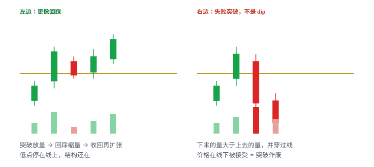

# 5.4 突破后回踩

> 一句话：先确认前面真的发生过有效突破，再谈回踩。没有接受成交，无论跌多深都不是这一章的交易。

第一章把突破拆成三种入场：预判、穿越、回踩。前两种发生在线被穿过之前，或穿过的那一下。本章只写第三种：线**已经被接受**，价格回到这条线附近，你在测它有没有变成支撑。测住了，延续假设还在，只是换了一个更近的失效位。测不住，前面那次突破作废。

这不是「已经跌了很多所以该买」。跌幅是结果，不是触发。触发是：事先画好的参考位上出现承接，低点没有坏掉前一结构，然后价格收回。

急跌低吸（flush）是另一类低吸。图形上都叫「买回踩」，当下外观也像。课程作者多年后才把 flush 加入方法库，本身说明它不适合当作入门第一策略。本章默认不教 flush。把失败突破里那一截下跌，改口叫「更深的回踩」，是这一 setup 的主失败模式。

共用卷四的仓位公式。回踩不是「更安全的突破」。失效位经常更近，失败时速度也快。点差已经拉宽就放弃。

## 5.4.1 它赌什么，不赌什么


回踩这一栏的优点是失效往往更清楚：回踩低点、或刚被突破的那条线，就在附近。主要风险也写在同一张图里——**可能不给回踩**。价格接受之后直接走，你没有这一笔，这不是错过了一笔必赚的，是这个 setup 当天没有触发。

它赌的是一件可证伪的事：

```
刚才被接受的那条线，现在有资格当支撑来测。
测住 → 延续还在。
测不住 → 前面的突破作废。
```

不赌的事：

- 不赌「已经从高点跌了很多，所以该弹」；
- 不赌均线、VWAP、整数自己有魔力；
- 不赌别人也在买回踩，所以你的失效位可以模糊；
- 不赌失败突破跌回平台之后，还会再给你一次同样质量的突破。

| | 突破穿越 | 本章：突破后回踩 | 急跌低吸 flush |
|---|---|---|---|
| 前提 | 线事先看得见 | **前面真的发生过有效突破** | 下杀正在发生或刚发生 |
| 假设 | 供给被吃完，上方被接受 | 旧阻力 / VWAP 已转支撑候选 | 卖压释放、超卖反弹 |
| 触发 | 穿过并接受 | 回到参考位后收回，低点未坏结构 | 低点停止、点差恢复、买盘能推回去 |
| 常见失效 | 立刻跌回平台 | 跌回原区间；证明前面是失败突破 | 低点继续下移 |
| 主要风险 | 滑点、追高、假突破 | **把失败突破误判为回踩** | 接飞刀、停牌、坏消息 |
| 本章做不做 | 见第一章 | 做 | 不做，下一章 |

三种不要补成一笔「先穿越、再回踩、再 flush 加仓」的完美赢家。每一笔单独满足触发、失效、股数，全仓风险重算后仍在预算内，才谈加。日志必须用三个名字。

难度大致是：突破穿越 / 突破后回踩 → flush。这个排序不是收益承诺，是学习顺序。回踩相对可定义，是因为它有一条**事先存在的线**当参照。flush 常常没有近端失效。没有近端失效的下跌，不是这一章。

## 5.4.2 前提：前面必须是接受，不是影线

没有这一步，后面无论跌多深，都不是这一章的交易。把影线插过去又回来的试探，当成「已经突破、现在回踩」，样本从第一秒就是脏的。


一根长上影穿过阻力又收回来，是试探，不是接受。接受看起来更像：收盘站在线的那一侧，随后的回落不把线还回去。用未收盘 K 线的最高价当「已经突破」，会把大量假信号算进样本。

最小零件（和第一章同一套，这里当成回踩的门票）：

1. 事前看得见的水平位或整理区——不是下跌开始以后才补画的线；
2. 价格在线的上方留下实体，而不是只有影线；
3. 回落没有立刻把线还回去；
4. 突破当时流动性够你进出，点差没有失控。

「站上」用哪个周期，必须和这笔交易的主风险周期一致。用 1 分钟影线宣布 5 分钟阻力已经换成支撑，是周期混用。用未收盘 1 分钟的最高价宣布突破，再在同一根还没走完的红 K 里「买回踩」，两步都不成立。

接受还可以补几条观察，它们是配料，不是可以拿掉门票的替代品：

- 在新价位停留了多久：一闪而过，更像刺穿；
- bid 有没有抬到旧阻力附近，而不是一破就撤；
- 突破量有没有推进价格，而不是放量却走不动；
- 随后有没有出现一个更高低点的雏形。

停留时间没有统一秒数。计划里可以写成启发式，例如「至少一根已收盘 K 的实体在线上」，然后用自己的样本改。不要口头觉得「看起来站稳了」。

旧阻力被向上突破并在上方被接受，才有资格成为新支撑的**候选**。候选不是已经换位。换位要等回踩验证。这是卷二就定过的角色转换：role reversal 是观察结论，要价格走给你看，不是画线当时就能宣布。

门票检查（任一否，仓位是 0）：

- 这条线在入场前是否已经画在图上？
- 突破那一侧有没有已收盘实体，而不只是影线？
- 回落有没有立刻把线还回去？若已经还回去，这不是回踩，是失败突破。
- 你准备用的周期，是不是这笔的主风险周期？

过了这四问，才进入下一节：回踩到哪一条线。

## 5.4.3 回踩到哪一条事先画好的线

回踩不是对着红 K 的长度下注。必须先有可验证的参考。基础课写的是：突破后价格常回踩原阻力或 VWAP。若该区域转为支撑，并出现卖压衰减，才叫 dip buying after breakout。Warrior 的清单更长，仍然是同一句话的展开：前一次突破位、VWAP、均线、整数位。LULD 下轨也常被列进去——那是另一类风险，靠近它时下一事件可能是停牌，不是平滑回踩。

常见参考，按「它是什么」而不是按名字的神圣程度：

| 参考 | 它是什么 | 回踩时怎么用 |
|---|---|---|
| 刚被突破的旧阻力 | 整理上沿、贴顶、前高、盘前高 | 最干净的一条。回踩低最好停在它附近，而不是穿过后才找借口 |
| VWAP | 当天量权平均成本，动态位置 | 站上之后回踩，可能变成支撑候选。止损不要钉在 VWAP 本身，钉在结构失效处 |
| 整美元 / 半美元 | 订单常聚集的心理价 | 必须和点差比较。一次跳动就跨 0.50，半整数没意义 |
| 短期均线 | 价格的滞后函数 | 碰线不是触发。需要收回或破微结构。失效在结构低，不是均线下方一分钱 |
| 盘前高 / 前收 | 开盘前就存在的位置 | 和旧阻力经常重合。重合提高关注度，不是两个独立概率 |

多个来源叠在同一价，提高关注优先级，不会把概率变成确定性。VWAP 某一分钟刚好叠在旧阻力、又叠在 8.00 上，日志里仍是同一条价格路径上的一次事件。不要写成「三条确认」。

线是区域，不是像素。点差、滑点、影线都会让价格在一条带状区域里来回。线应盖住实际发生过反应的那一带，不要为了贴合最高一根影线画得过分精确。回踩「碰到线」只值得观察。你的工作是看它怎么反应，不是假设它必须弹回去。

动态线还要记住自己会动。HOD 会随新高更新。VWAP 会随成交移动。开盘前几分钟 VWAP 样本少，不要把早期 VWAP 当铁支撑。你回踩的若是 VWAP，入场那一刻的 VWAP 值和你盘前画的值可能已经不是同一个数。计划里写的是「回踩当时的 VWAP 区域」，不是早上 9:32 的一个固定价。

不要在下跌开始以后补画一条刚好托住当前低点的线，再宣布「回踩成立」。那是事后拟合。合法的线，是突破发生前就已经在图上的那一条。

回踩深度没有机械百分比。旗面回撤不超过 50%、回撤 2–5 根，那是旗形的启发式，不是本章的许可证。回踩穿过旧阻力并在下方被接受，深度再浅也不是回踩。回踩停在旧阻力上方 3 美分，但从未收回、从未形成更高低点，也还没有触发。

## 5.4.4 有效回踩长什么样


左边才是本章。价格先有有效突破，回到刚刚被突破的那条线，量能收缩，低点没有坏掉前一结构，然后重新抬高。

确认、触发、失效必须分开写。确认是「这件事看起来还像回踩」。触发是「现在才允许下单」。失效是「判断错了，价格会先走到哪里」。把确认当成触发，会在第一根碰到线上的 K 里买进去——那一根还可能继续向下。

| | |
|---|---|
| 确认 | 回踩到旧上沿 / VWAP 后迅速收回；随后更高低点；回撤量通常小于突破量；下跌速度减慢 |
| 触发 | 收回参考位，或突破回踩里的微结构高点（**写死一种**） |
| 失效 | 回踩低点被向下接受，或价格重新被原区间接受 |
| 常见失败 | 把失败突破误当成回踩；未完成 K 线继续向下；参考位根本没有转成支撑 |
| 不做 | 只因为「已经从高点跌了很多」；入场必须很宽的止损还不降股数；点差已经失控；门票（接受）根本没有发生 |

有效回踩常需要同时看到：

- 下跌速度减慢，而不是加速穿过线；
- 关键位有实际买盘反应——价格停在线上、或留下拒绝下影后收回；
- 重新突破回踩过程中的微高点，或收盘重新站上参考位；
- 回撤量小于突破量。量缩是配料：抛压可能较轻，也可能只是买方消失。

缺其中一项，就把「放弃」的权重提高，而不是补一个故事把缺的那项解释掉。

事后图很顺。实盘里每根未完成 K 线都还可能继续向下。不要因为「已经从高点跌了很多」而买；需要能说明承接出现在哪里。承接出现在事先画好的线上，并且价格收回，才轮到你。承接若出现在线下方，原支撑假设已经失效。

「迅速收回」是相对这只股票自己的节奏，不是统一的 30 秒。计划可以写成启发式：例如「回踩低出现后，N 根 K 内收回参考位；超时当作时间退出」。时间退出和价格失效一样，都要事前写。价格没有立刻延续时，横盘既可能是蓄势，也可能是买盘衰竭。「还没跌」不是继续等的充分理由。

强趋势不是直线。它是推进 → 回踩 → 重新找到支撑。每一级旧阻力被突破后成为新支撑候选，要等回踩验证。新低跌破前一有效支撑，阶梯坏了，降低多头预期，不是「再等一等」。


大绿 K 后立刻追，止损往往很远，盈亏比变差。等新的小结构和近的失效位，正是回踩这一栏存在的理由。它不是胆怯，是把失效从「旗杆起点」收到「刚才这个低点」。收得近的前提仍然是：前面的突破是真的，这个低点没有把结构砸坏。

## 5.4.5 失败突破被误读为回踩

这是本章的主风险。外观很像：都是突破之后的下跌。差别在线的哪一侧被接受。

左边（回踩）：回踩低点停在旧阻力附近，随后收回，更高低点还在。  
右边（失败突破）：插上去立刻跌回平台内，价格在线下被接受。

把右边当成左边，你买的不是支撑测试，是已经失败的突破。后面每跌一截，都更容易改口说「更深的回踩更好」。那不是计划，是摊平。

失败突破的常见样子：

- 只有影线穿过，收盘已经回到线下——门票根本没发，见 5.4.2；
- 有实体站上，但下一根就把线还回去，并且在线下留下实体；
- 上去的量留不住，下来的量大，价格穿过线后还在推进；
- bid 在旧阻力附近一层层撤，而不是重新排队；
- 点差在回落中拉宽，盘口变薄。



放量也可能是顶部换手。突破量大但价格不前进，本身就是第一章的失败警告。回踩阶段若红量大于突破段，延续假设变弱。若红量不仅大，而且把价格送回原区间并在那里接受，假设结束。

不要做的改口：

- 「还没跌到我的线，再等一等」——你的线已经被向下接受；
- 「更深才更安全」——失效已经触发，深度只增加亏损；
- 「这是 flush，按另一套接」——flush 有自己的前提（低点停止、点差恢复），不能在失败突破的中途切换名字；
- 「别人也在买」——别人的成交不能当你的失效位；
- 「再给一次」——假突破计划的第一条就是不等待再给一次。

假突破之后做什么，第一章已经写过，这里重复一遍，因为回踩失败时最容易手软：

1. 不等待「再给一次机会」；
2. 按失效减仓 / 平仓；
3. 检查是否成为多头陷阱（本卷后面的反转章）；
4. **不自动反手做空**——反手是新的一笔，要有 locate 和新计划；
5. 记录滑点和「在上方停留了多久」。

停留时间也是样本。一闪而过的「突破」后面买回踩，和站上十分钟再回踩，不应丢进同一个胜率。

价格接受发生在关键位下方，原支撑假设已经失效。这句话要硬。失效之后看到的反弹，是另一笔交易的候选，不是把旧仓接回来。

## 5.4.6 触发、失效、目标必须事前写死

同一形状三种进法不能事后任选最漂亮的那一种。本章只允许事先写好的那一种触发。

两种合法触发，选一个写进计划，不要盘中改：

| 触发写法 | 你等到什么 | 优点 | 代价 |
|---|---|---|---|
| 收回参考位 | 价格重新站上旧阻力 / VWAP，实体在线上 | 简单，离线近 | 可能买在第一根收回里，随后再扫一次低 |
| 破回踩微高 | 回踩过程中的小高点被穿过并接受 | 多一次方向确认 | 入场更高，止损可能被拉宽 |

「碰到线」不是触发。碰到只是确认阶段开始。Bid hold、收盘确认、trade-through 也要事先定死，不能四者轮流用，直到某一种看起来赚了。

失效同样写死：

- **结构失效**：回踩低点被向下接受（收盘在其下，或价格在其下停留——用你计划里的那一种）；
- **逻辑失效**：价格重新被原区间接受——即使回踩低还没扫到，突破假设已经死了；
- **时间失效**：回踩后 N 根 K 内没有收回，也没有新的更高低点。

实际止损还要加滑点。止损钉在「刚好那根低点下方 1 美分」时，噪声会先打你，再走你原来想要的方向。留多少滑点看点差和这只股票的正常影线，不是固定 2 美分。点差已经 0.08，还用 0.02 滑点，计划 1R 和真实亏损不是同一个数。

第一目标常常只是：

- 回踩前刚形成的高点；
- 或下一个事先画好的阻力（整数、盘前高、日线位）。

不是自动回到全天高点。把目标画到 HOD，再倒推「值得买这一笔回踩」，是用还没发生的利润为交易辩护。先量到第一阻力有没有 ≥ 1R。不够就跳过，而不是把止损挤近，把目标画远。

成功回踩后的管理，仍然是卷四的规则：止损只能往有利方向移；加仓是新的一笔，要重算全仓风险；没有 follow-through 时用时间退出。横盘既可能蓄势也可能衰竭，观察回落是否守住旧阻力、量是否收缩、再上冲有没有新增成交。

可测试版本（边界全部启发式，用自己的样本校准）：

```
前提：参考位被已收盘实体接受，回落未把线还回去
回踩：价格回到该区域，回撤量 < 突破量（配料，不是充分）
低点：不低于原区间上沿被接受（可允许影线刺入区域，不允许实体在下方接受）
触发：收回参考位  或  破回踩微高（择一）
失效：回踩低下被接受  或  原区间重新接受
时间：回踩低后 N 根内无收回则退出
第一目标：回踩前高 或 下一阻力，至少约 1R
```

每个 N、是否允许影线刺入、用哪一个周期，改完必须写进日志并分开统计。改了触发，就是另一套策略。

## 5.4.7 止损宽就减股数

入场必须靠近明确失效位。若需要很宽的 stop，股数应相应下降，而不是把止损挤到噪声区。这是基础课原话，也是卷四公式在本章的唯一用法。

正确顺序永远是：

1. 找到结构失效点（回踩低、或原区间重新接受的那一侧）；
2. 估算现实能成交的入场价；
3. 加入滑点预留；
4. 算出每股风险；
5. 用单笔可承受美元风险反推股数；
6. 再按购买力、流动性、停牌风险和个人上限往下砍。

```
每股风险 = |预计入场 − 失效价| + 预留滑点
股数     = floor(单笔可承受亏损 ÷ 每股风险)
最终股数 = min(风险允许, 购买力允许, 流动性允许, 个人上限)
```

回踩看起来止损近，并不自动等于风险小。失败时往往很快。近端失效只有在它仍然是结构低的时候才近。若回踩已经走成一条深斜线，最近「还能画」的低点远在 0.40 之外，这一笔的 1R 变大了。美元风险要保持不变，股数必须变小。第一目标若还停在 0.20 的前高，盈亏比不够，正确动作是放弃，不是把止损上移 0.30 来伪造 2R。


错误顺序是：想赚 0.10，因此 stop 设 0.05，再寻找图形解释。回踩尤其容易犯：因为「失效应该很近」，就先写一个 0.05 的止损，再把线画到能让 0.05 看起来合理的地方。那是用仓位去迁就热键，不是用结构去决定仓位。

固定股数不叫固定风险。同一只股票，止损 0.10 和止损 0.40，1,000 股的美元风险差四倍。回踩失败那一侧如果突然变宽，你还用穿越那一笔的股数，账户承担的是另一笔交易的风险。

点差已经拉宽，先放弃。滑点预留必须跟着点差走；加大预留之后股数必须变小。计划买的股数已经大于当前可见深度的一小部分，退出会变成你自己的冲击。可见深度不是保证，大单可撤，但「我的 size 已经像盘口上最大的一档」仍然是减仓或放弃的理由。

靠近 LULD 下轨时，下一事件可能是停牌而不是平滑回踩。停牌期间普通止损无法成交，恢复后第一跳可以远离所有图上的线。对这种暴露，个人上限可以直接是 0。这不是 flush 专属：失败突破同样可以一路砸到限价带。

## 5.4.8 量能、盘口和时间

量能顺序偏好和旗形同一句：

```
冲动扩张 → 回撤收缩 → 突破再扩张
```

本章对应的是：突破扩张已经发生过 → 回踩收缩 → 收回后再扩张。缺最后一步，你可能只是买在收缩的半途。回撤红量大于突破段，是失败警告，不是「更便宜」。

量回答三个问题：和前几根比是扩张还是萎缩；和这只股票平时同时段比是否异常；放量之后价格有没有推进。回踩段缩量且停在线上，是配料。回踩段放量且穿过线，是失效。绿柱不等于主动买完，红柱不等于主动卖完，颜色通常只是跟着 K 线走。

盘口回答的是现在的执行环境，不是未来一定往哪走。回踩过程中值得看：

- bid 是否在旧上沿附近重新排队，还是一层层往下撤；
- 大成交是价格往下走（供给）还是停在线上（吸收）；
- ask 被打穿后价格有没有前进，还是打穿了却走不动；
- 自己的计划股数是否已经大于当前可见深度的一小部分。

这些信号在失败时更不可靠：可见大单会撤，报价会跳。所以点差先恢复、结构先清楚，盘口只做执行，不替你决定这是回踩还是失败突破。四个窗口同时闪会制造模式错觉。一次只对计划中的标的和参考位作判断。

Tape 上连续打在 bid，只说明刚才主动卖更多，不单独构成失效。失效仍然是价格在线下被接受。连续打在 ask 也不单独构成触发。触发仍然是你写死的那一种：收回，或破微高。

时间也是信息。回踩可以浅而快，也可以横在线上耗着。耗着的时候，注意力和买盘都可能散。计划里的时间退出，就是承认「结构还没坏，但这一笔的条件已经过期」。过期之后若再出现收回，那是新样本，不是把旧计划延期。

在流动性消失时，限价单也可能完全不成交。成交与不成交都要纳入统计。没买到不是错过了一笔必赚的，是市场当时无法按你的最坏价格给你货。反复下调限价直到成交，等于把限价单改成了追单。可成交限价要限制最坏买价，同时预设若未成交就放弃。

回踩失败时往往很快，市价买入会面对未知滑点。需要立即成交时，用可成交限价控制最坏价格，而不是裸市价。这和 flush 里「抢长下影」是同一类错误，只是本章的场景是回踩低附近，不是最大红 K 的中途。

## 5.4.9 数字例：同一条 8.30

教学用整数，不是某只股票。单笔可亏 50 美元。点差正常时预留滑点 0.03。所有触发都假设你事先写死了「收回参考位」。

### A. 有效突破后的回踩

8.30 是贴顶上沿，盘前就画在图上。两根 1 分钟实体收在 8.32、8.41，最高到 8.55。回落到 8.32 后收回，收盘 8.38。回踩低 8.32，没有在 8.30 下方留下实体。

- 入场：收回后 8.36；
- 失效：回踩低 8.28 再留 0.03 滑点 = 8.25；
- 每股风险 0.11；
- 最多 454 股，再按盘口往下砍；
- 第一目标是刚形成的 8.55（约 1.7R），或上一张贴顶图里的 8.85。先量 8.55 有没有 ≥ 1R。有，才谈这一笔。

回撤量小于突破那两根。bid 在 8.30–8.32 重新出现。这是本章。

### B. 影线试探，门票没有发

同一条 8.30。一根 K 最高 8.42，收盘 8.22，长上影。没有已收盘实体站上。随后价格到 8.28，「看起来像回踩 8.30」。

这不是回踩。前面没有接受。8.28 买进去，赌的是失败刺穿之后还会再破，那是另一笔预判或另一套策略。本章仓位是 0。

### C. 有过接受，随即失败

8.30 被实体接受，最高 8.48。下一根实体收在 8.18，并且在 8.18–8.22 横了两根。价格在原区间内被接受。

这不是回踩，是失败突破。按失效走。不要改口说「更深的回踩更好」，也不要把止损从 8.28 改到 8.10 去「给空间」。若你在 8.36 已经进了，8.25 就该走；走晚了是执行错误，不是把 setup 改名。

### D. 旧阻力和 VWAP 叠在一起

突破接受时 VWAP 在 8.28，旧阻力 8.30。回踩低 8.31，当时 VWAP 已移到 8.33。价格在 8.31–8.34 之间转了一圈后收回 8.36。

这是一次事件，不是「VWAP 确认 + 旧阻力确认」两次。失效仍然画在回踩低下方加滑点，不要一边用 8.28 的旧阻力、一边用移动后的 VWAP，事后挑没被扫到的那条。日志写：回踩 8.30 区域（与 VWAP 重合）。

### E. 只能画到很远的低点

接受过 8.30，最高 8.55。回落没有停在 8.30，但也还没有在下方留下稳定实体——它在 8.05–8.20 来回，点差从 0.02 变成 0.09。你若仍想做「回踩」，最近还能辩解的结构低是 8.00。

- 入场若仍按 8.36，失效 7.97（含滑点），每股 0.39；
- 50 ÷ 0.39 → 128 股；
- 第一目标若还是 8.55，只有约 0.5R。

放弃。不要把止损上移到 8.28 假装这还是近端回踩——8.28 已经不是结构低。也不要在点差 0.09 时用市价「抢」。点差恢复、并在某个事先存在的线上出现新的接受之前，仓位是 0。若后来它变成 flush 式的急跌，那是下一章的问题，不是把本章的止损拉宽。

### F. 第二回踩不是第一回踩

第一次回踩按 A 做成，目标到 8.55 减仓。价格再上到 8.70，又回到 8.32。第二次回到同一条线，序号必须入日志。第二次的质量通常更差：买盘可能已耗，上方空间可能已被用掉。它可以做，但不要和第一笔丢进同一个桶，更不要用第一笔的盈利去加大第二笔的股数。

## 5.4.10 和第几次、哪种入场、哪个周期分开记账

三种入场混成一个胜率，样本是脏的。回踩成功，不能用来证明十分钟前那笔穿越也是对的。穿越失败，不能用后来一笔回踩的盈利去抹掉。加仓会产生一串不同 setup，必须分别记录，而不能合并成一笔漂亮的大赢家。

周期同样分开。1 分钟上的回踩低，放到 5 分钟上可能只是一根带下影的突破 K。你若用 5 分钟的线当参考、用 1 分钟的低点当失效，必须在计划里写明「主风险周期是 1 分钟」。选了 5 分钟 stop，股数按 5 分钟的距离算，不要用 1 分钟的近端止损去开 5 分钟的仓。

第几次必须声明周期：1 分钟可能已经是第三次小回撤，5 分钟仍只是第一段扩张后的一次回踩。第一次回踩通常更接近原始动量；后面每一次都要重新判断趋势有没有衰减。连续成功的前几次会诱使后续追高。序号入日志。

同一段从 8.00 拉到 8.70 的走势，可以同时被叫成旗形穿越、突破后回踩、微回撤。必须在事前写死你做哪一种。否则每笔都能在事后找到一个赢的叫法。

不要把「跌到 VWAP 的突破后回踩」和「跌到 VWAP 的顶部反转失败」混称。前者的假设是旧阻力已转支撑，后者的假设是趋势已经坏了。失效位可能画在同一条 VWAP 上，故事完全相反。混在一个桶里，胜率没有意义。

也不要把本章和 flush 丢进同一个「dip buy」胜率。名字都有 dip，假设相反：一个假设结构还在，一个假设结构正在被砸。

课程录制于特定市场。练习按市场状态分组，避免把热市样本直接外推到冷市。回踩在热市里可能浅而快，冷市里可能根本不给收回。规则不变，样本要分开。

## 5.4.11 和旗形、均线回踩、微回撤的边界

名字次要，触发和失效不同。边界写清，是为了不把五个形态塞进同一笔账。

| 名字 | 突破是否已经发生 | 你等什么 | 失效通常在 |
|---|---|---|---|
| 旗形 | 还没有（等旗面上沿被接受） | 整理后的穿越或接受 | 旗面低 |
| 贴顶 | 还没有（等水平上沿被接受） | 上沿接受；或本章这种破后再测 | 最近抬高的低点 |
| 本章回踩 | **已经**发生过有效突破 | 旧阻力 / VWAP 收回，低点未坏结构 | 回踩低，或原区间重新接受 |
| 均线回踩 | 趋势已在均线上方 | 收回均线或破微高，不是第一次碰线盲买 | 结构低，不是均线下一分钱 |
| 微回撤 | 强趋势中几乎没整理 | 停 1 根就再穿前高 | 那一根的低点，噪声多 |
| ABCD 的 C | 第一段 A→B 已发生 | C 后恢复并挑战 B | C 低 |
| Flush | 结构正在被砸 | 低点停止 + 点差恢复 + 能推回去 | 新低继续下移 |

旗形的旗面本身是回撤。你若在旗面上沿被接受**之前**买旗面低，那是预判，不是本章。你若在旗面上沿被接受**之后**回到上沿再买，那才是本章，日志不要再写成「旗形」。

均线回踩和本章经常画在同一段趋势里。差别是你的参考位。选均线，就按均线那一套：碰线不是触发，失效在结构。选旧阻力，就按本章。两条线重合时，仍只记一次事件。

微回撤是更浅、更快、更进阶的停顿。回撤过小意味着失效点近、噪声多。它不是「更紧的回踩」，是另一套统计。LULD 上限附近，几美分风险的假设可能被停牌后的跳空打破。

Flat top 的两种入场——穿越和 retest——Warrior 明确要求分开统计。Retest 那一栏就是本章。穿越那一栏留在第一章。不要因为同一只股票上午做过贴顶穿越，下午的回踩就自动算加仓续集。

ABCD 的 C 点看起来也像回踩。若你的计划是「C 后恢复、破 B」，失效在 C 低，那是 ABCD，第一目标是 D 的测量位，不是「旧阻力收回」。若你的计划是「B 被接受后回到 B 再买」，那是本章。事前写死。C 下破后还持有，是因为预期 D 而拒绝失效，两种名字都不能救。

## 5.4.12 失败后不准改故事

- 失效触发就走，不等「再给一次」。
- 不加仓摊平，除非计划事前写过分批和全仓风险上限。回踩低被接受之后的「更低更便宜」，是摊平，不是分批。
- 不把亏损的日内单改成隔夜。隔夜会突然加上跳空、盘后流动性、新闻和保证金变化。
- 不因为这一笔亏了，就把下一笔无关的上涨叫「还回来」。
- 不把没成交的限价单在更低的地方反复改价，直到变成市价接飞刀。
- 不把失败突破改名为 flush，再改名为「其实是投资者」。
- 不切换周期去找一根还没破的均线，当作新的支撑故事。
- 不因为四个窗口同时红，就认为这是一个可交易形态。

卖出后把心理止损调到平均成本，只是价格上的保本；费用与滑点仍可能使净结果为负。回踩失败很快时，保本心理会让人把止损从结构低拿到成本价，然后被夹死。止损只能往有利方向移，不能往「我可以接受的亏损」移。

## 5.4.13 检查表

门票（前提）：

- 这条线在突破前是否已清晰可见？
- 前面的突破是接受，还是影线？
- 「站上」用的周期，是不是这笔的主风险周期？
- 回落有没有立刻把线还回去？

结构和触发：

- 回踩到的是哪一条事先画好的线？旧阻力、VWAP、整数，重合了没有（记一次还是硬写成三次）？
- 回撤量有没有收缩？下跌速度有没有减慢？
- 低点有没有坏结构？有没有在线下被接受？
- 触发写死的是收回，还是破微高？它发生了没有？
- 这是该周期第几次回踩？

风险和执行：

- 失效价在哪里，包含滑点后每股风险多少？
- 对应多少股？点差还在预算里吗？
- 第一目标到哪，有没有 ≥ 1R？不够是不是该放弃，而不是挤止损？
- 计划股数是否大于可见深度的一小部分？
- 是否靠近 LULD 下轨、可能先停牌而不是平滑回踩？
- 若停牌、坏消息或继续向下，最大损失是否可承受？
- 这笔是「看到确认」，还是只因为害怕错过、或因为已经从高点跌了很多？

任一关键项是「不确定」，仓位是 0。不确定不是「先买一点再说」。

## 5.4.14 日志怎么记

每笔至少记录：

- setup 名称：写「突破后回踩」，不要只写 dip；
- 时间周期、当日第几次回踩；
- 参考位是哪一条、突破接受发生在几点、用哪根已收盘 K 判定；
- 入场属于收回还是破微高（必须与计划一致）；
- 入场、失效、第一目标和计划 R；
- 点差、滑点预留、期望价格、实际均价、部分成交、未成交；
- 回撤量相对突破量是缩还是扩；
- 是否接近 VWAP、HOD、整数或 LULD 带；
- 退出是否符合原计划，还是改口、摊平、换周期；
- 1 / 5 / 15 分钟后的结果；
- 若没买到：限价、当时盘口、是否下调过价格。

把「限价没成交」也记进样本。把「以为是回踩、其实是失败突破」单独打标签。过几个月你要能回答：自己是在真回踩上亏，还是在假突破上亏。两种亏法的改正动作不同。前者可能是触发太早、止损太紧或目标太远；后者是门票没查就进场。

复盘不能只圈最终又创新高的图。应记录首次入场时可见的上沿、当时是否已经接受、stop 与上方空间。事后图看起来顺滑，不能证明当时那根未完成 K 线不该让你放弃。

统一字段和第一章、动量章共用。多一个标签不增加优势；少一个名字会把样本搅脏。

## 先记住这些

- 先确认前面的突破是接受，不是影线。没有这一步，后面不是本章。
- 回踩到的是事先画好的旧阻力或 VWAP 一带，不是「已经跌了很多」。
- 触发写死一种：收回参考位，或破回踩微高。碰到线不是触发。
- 跌回原区间、在线下被接受 = 失败突破，不是更深的回踩。
- 止损宽就减股数。第一目标不够 1R 就放弃，不要把止损挤进噪声。
- 和第几次、哪种入场、哪个周期分开记账。不要和 flush 共用一个胜率。

## 不要做的事

- 把影线刺穿当成已经突破，再在同一段下跌里买「回踩」。
- 只因为从高点跌了很多、或别人也在买回踩，就进场。
- 失败突破跌回平台后改口说更深更好，或改名为 flush、改名为投资。
- 止损必须很宽时仍用近端那一笔的股数，或把止损上移伪造盈亏比。
- 在点差拉宽、盘口变薄时用市价抢长下影；未成交就向下改价追单。
- 把穿越、回踩、第二回踩、flush 合并成一笔大赢家。
- 四个窗口同步下跌时当成一个可交易形态。
- 用未收盘最高价当突破，用事后补画的线当支撑。
