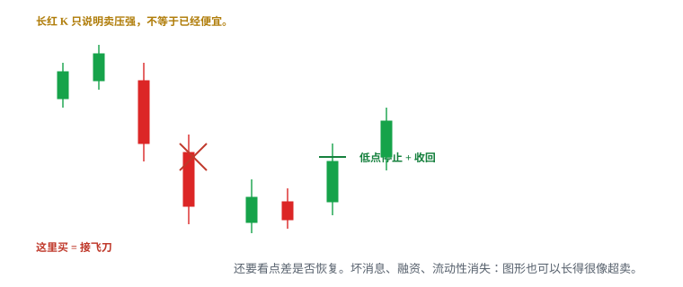
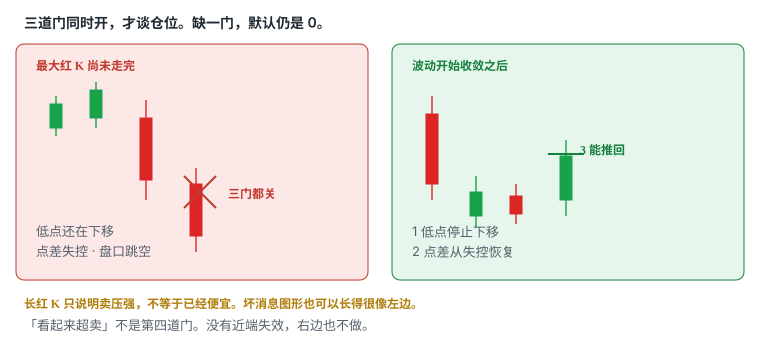
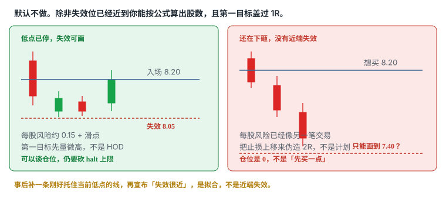
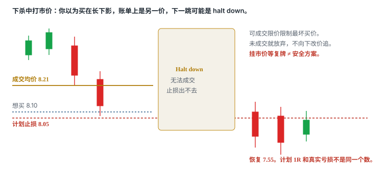

# 5.5 Flush Dip

> 一句话：长红 K 不等于便宜。默认不做。除非低点已经停止、点差恢复、失效位近，并且你接受 halt-down 之后的离散损失。

上一章的回踩假设结构还在：前面真的发生过有效突破，价格回到那条线附近，你在测它有没有变成支撑。本章反过来。价格正在被快速砸下去，图形上很像「超卖」，当下外观却和趋势反转几乎一样。课程把这种低吸叫 at-flush dip buying，并直接标成比较高难度的操作。Warrior 把它排在学习顺序靠近底部，只比「对着停牌进出」稍前。课程作者在交易近十年后才把这一类加入方法库——这句话本身就是警告。

它不适合当作入门第一策略。本章的默认仓位是 0。

共用卷四的仓位公式。Flush 不是「更便宜的回踩」。止损经常画不出来；一旦画出来，失败时速度也快。点差已经拉宽就放弃。下杀中打市价，面对的是未知滑点，下一跳也可能是 halt down。计划 1R 和真实亏损常常不是同一个数。

## 5.5.1 它赌什么，不赌什么



这笔交易赌的是一件很窄、而且经常赌错的事：

```
刚才那一段快速下杀，是流动性暂时错位，不是新信息把价值改写。
卖压释放之后，会有人认为超卖而买，也会有空头回补。
两股买盘制造一段可交易的反弹。
你只在低点停止、点差恢复、价格能被推回去之后进场，
并且近端失效已经被价格走出来。
```

课程给的机制是：除非遇到 offering 或坏消息这类极端情况，价格很少一条直线走到底。「极端情况」那半句就是全部风险所在——若真是坏消息、融资或流动性消失，它就会一条直线跌下去，技术反弹可能不出现。图形在当下区分不了这两种。

它不赌的事：

- 不赌「已经从高点跌了很多，所以该弹」；
- 不赌长红 K、长下影自己有魔力；
- 不赌 RSI 超卖、布林下轨、整美元自己会托住；
- 不赌别人也在买回踩，所以你的失效位可以模糊；
- 不赌反弹一定回到全天高点，再用还没发生的利润为接飞刀辩护；
- 不赌停牌恢复后会在你的止损附近重新打开。

| | 5.4 突破后回踩 | 本章：Flush Dip | 5.12 底部反转 |
|---|---|---|---|
| 前提 | 前面真的发生过有效突破 | 上涨结构正在被砸，或刚被砸完 | 已经走出来的下跌出现失败 |
| 假设 | 旧阻力 / VWAP 已转支撑候选 | 卖压释放，砸完还有承接 | 下跌本身失败，做相反方向 |
| 触发 | 回到参考位后收回，低点未坏结构 | 低点停止 + 点差恢复 + 买盘能推回去 | 下跌结构破坏被接受 |
| 常见失效 | 跌回原区间；证明前面是失败突破 | 低点继续下移 | 新低继续创新 |
| 主要风险 | 把失败突破误判为回踩 | 接飞刀、停牌、坏消息 | 逆势太早、尾部不对称 |
| 默认做不做 | 可以做（门票齐） | **不做**，除非近端失效已在 | 另章，半仓启发式 |

三种不要补成一笔「先当回踩、再当 flush、再当底部反转」的完美赢家。每一笔单独满足触发、失效、股数，全仓风险重算后仍在预算内，才谈加。日志必须用三个名字。

难度大致是：突破穿越 / 突破后回踩 → flush → 对着停牌进出。这个排序不是收益承诺，是学习顺序——启发式。前一层只有在模拟盘有足够样本、扣除滑点后仍能稳定执行，才考虑下一层。没有近端失效的下跌，不是这一章。

## 5.5.2 默认仓位是 0

「默认不做」不是修辞。它的意思是：打开这只股票、看见一根很长的红 K、心里已经出现「便宜了」，此时仓位必须仍是 0。从 0 变成非零，要跨过一组同时成立的条件，而不是跨过你的冲动。

默认是 0，因为这一章同时踩中四件坏事：

1. **当下无法区分**暂时错位和趋势反转。二者外观相似，这是 Warrior 对 dip buy 的原话。
2. **常常没有近端失效。** 低点还在下移时，你画的任何止损都是愿望。
3. **执行环境先坏。** 点差拉宽、盘口跳档、可见大单撤走。市价单的成交价不是你看见的 last。
4. **尾部不连续。** 下一事件可以是 LULD pause 或新闻停牌。停牌期间普通止损无法成交，恢复价可以远离所有图上的线。

允许把仓位从 0 改成非零的，只有这一组同时成立：

- 低点已经停止下移——不是你希望它停；
- 点差从失控恢复到你预算里能接受的宽度；
- 买盘真的把价格推回去了（收回事先存在的参考，或出现更高低点 / 破微高，计划写死一种）；
- 失效位已经近到：按卷四公式算出的股数，第一目标仍能盖过约 1R；
- 你事先接受 halt-down / 复牌跳空的离散损失；不接受，上限就是 0；
- 没有刚出的坏消息、融资、合规或「原因不明但仍在直线下跌」。

任一不确定，仓位仍是 0。不确定不是「先买一点再说」。先买一点，只是用更小的数字做同一件错事。

模拟盘也要模拟延迟、部分成交、滑点和停牌。只在事后顺滑的图上圈「这里该买」，会高估任何急跌低吸的优势。课程录制于特定市场。按市场状态分组，不要把热市里偶尔出现的 V 型收回，直接外推到冷市。

## 5.5.3 长红 K 不等于便宜

长红 K 只说明短时间卖压很强。**不等于价格已经便宜。**

便宜是估值语言。日内图上没有估值。你看见的是：在这段时间窗口里，主动卖压压过了当时愿意挂着的买盘。下一根可以继续同样的事。未完成的那根尤其不能当证据——它的最低价还没写完。

「已经从高点跌了很多」也不是触发。跌幅是结果。结果不能证明下一秒卖压用完。同一段从 9.40 砸到 8.10 的路径，事后可以叫超卖反弹，也可以叫趋势开始。当时你只能看见红 K 还没走完。

从上涨突然切到大红 K，说明「等回调」可能瞬间变成接飞刀。这就是为什么 5.4 和本章必须分开：前者假设结构还在，后者假设结构正在被砸，你在赌砸完。把失败突破里那一截下跌，改口叫 flush，再改口叫「更深所以更好」，是摊平，不是策略。

一根长下影同样不够。下影只说明这段时间里出现过更低的成交，随后价格回到实体附近。它不保证低点已经完成，不保证点差已经恢复，不保证下一根不会再扫一次。用市价去「抢长下影」，抢到的经常是影线中段或影线上方，账单均价比你眼睛盯着的最低价差一截。

四个窗口同时闪红，会制造模式错觉。一次只对计划中的标的和参考位作判断。邻股一起跌，不能当你的失效位，也不能把四张图合成一个可交易形态。

可测试的观察（启发式，用自己的样本校准，不是市场定律）：

- 用已收盘 K 看低点，不用未收盘最低价宣布「已经到底」；
- 连续两根或以上的低点不再下移，才开始谈「停止」，单根长下影不够；
- 红 K 实体仍在延伸、或每根都创新低，一律当作下杀未结束。

这些数字改完必须写进日志。改了「几根算停止」，就是另一套策略。

## 5.5.4 三道门：低点停、点差恢复、能推回去



要等到下面三件事同时成立，才谈得上有失效位。最大红 K 还没走完时猜底，不是策略。真正可控的机会通常出现在波动开始收敛后。

| 门 | 你等到什么 | 常见假象 | 没开时做什么 |
|---|---|---|---|
| 1 低点停止下移 | 已收盘低点不再创新低；随后出现平低或更高低点雏形 | 单根长下影；未完成 K 的瞬时低 | 继续看，仓位 0 |
| 2 点差从失控恢复 | bid/ask 重新连续，宽度回到你预算内 | last 回了一下，但报价仍空洞 | 放弃或再等，不砍滑点预算 |
| 3 买盘能推回去 | 收回事先画好的参考，或破回抽微高（写死一种） | 打穿 ask 但价格不前进；只有颜色翻绿 | 没有触发，不加「先占位」 |

三道门是「与」，不是「或」。低点看起来停了、点差仍有 0.12，你买进去的第一成本就已经吃掉计划里的大半个 R。点差恢复了、价格却仍在一根斜线下移，低点没有停。价格弹了一下却推不回任何事先存在的线，只是下杀中的噪声。

**门 1。** 「停止」是观察结论，要价格走给你看。你希望它停，不是停止。把止损预先钉在「大概这一带该停」，再等价格来迁就你，是反向操作。合法的低点，是已经印出来、并且随后至少有一根 K 没有再往下接受的那个低。用哪个周期必须和这笔的主风险周期一致。用 1 分钟影线宣布 5 分钟低点已完成，是周期混用。

**门 2。** 点差回答的是现在能不能按计划进出，不是未来一定往哪走。下杀中常见：最优价一档消失、买卖价跳空、size 从四位数变成两位数。此时 Level 1 上的 last 可能落后。只按 last 去设限价，你会以为挂在「现价附近」，实际已经离开 inside market 好几档。点差恢复的启发式（必须用这只股票当天自己的正常宽度校准）：回到当天 flush 前典型点差的约两倍以内，并且至少稳定数秒，而不是闪一下又拉开。两倍、数秒，都是启发式。点差已经失控就放弃，不要用「我滑点留多一点」自我安慰——留多了股数必须变小，第一目标往往不够 1R。

**门 3。** 「能推回去」不是颜色从红变绿。绿柱通常只是跟着 K 线走。要看到价格重新站上事先存在的参考，或回抽过程中的微高点被穿过并接受。Ask 被打穿但价格不前进，可能是隐藏流动性或吸收，不是买方已经接管。连续打在 ask 也不单独构成触发。触发仍然是你写死的那一种。

时间也是信息。下杀之后可以横很久。耗着的时候，注意力和买盘都可能散，新闻窗口也可能再次打开。计划里应有时间退出：低点出现后 N 根内没有收回、也没有新的更高低点，当作条件过期。N 是启发式。过期之后若再出现收回，那是新样本，不是把旧计划延期。

「看起来超卖」不是第四道门。RSI、布林、跌幅百分比、聊天室里的「要弹了」，都不能拿掉上面任何一门。

## 5.5.5 没有近端失效就没有这一章



本章的硬规则：**没有近端失效，不做。** 这不是风格偏好。没有近端失效，你就没有 1R，股数公式的分母不存在，任何「先买一点」都是在用账户去赌未知深度。

近端失效长这样：

- 低点已经印在图上（门 1 开了）；
- 你把失效画在这个低点下方，再加现实滑点；
- 入场到这个失效的距离，让你按单笔可亏算出来的股数，对当前盘口不是笑话；
- 第一目标（通常只是刚形成的微高或事先存在的平台）盖过约 1R。

远端失效长这样：

- 低点还在下移，你只能指着更下面某根整数说「大概那里」；
- 或者低点有了，但距离入场已经 0.40、0.80，第一目标仍只有 0.15；
- 或者你把止损上移到噪声区，让盈亏比在纸上变成 2R。

后一种不是近端失效。那是伪造。止损宽就减股数；减完仍不够 1R，正确动作是放弃，不是把止损挤近。

「近」没有统一美分。启发式：先按这只股票 flush 前的正常点差和正常影线，估计一笔干净失败大概要付多少滑点；失效距离如果已经数倍于这个数，先问第一目标还够不够。不要背「止损必须 0.05 / 0.10」。固定美元止损处理不了 2 美元股和 20 美元股，也处理不了点差从 0.02 变成 0.15 的那一分钟。

事后补一条刚好托住当前低点的线，再宣布「失效很近」，是拟合。合法的线，要么是下杀开始前就已经在图上的参考，要么是下杀停止后价格自己印出来的结构低。前者用来谈触发（收回哪一条），后者用来谈失效（哪一个低被向下接受）。不要用同一根事后线同时充当两个角色，再在复盘时挑没被扫到的那种叫法。

靠近 LULD 下轨时，下一事件可能是停牌而不是平滑反弹。此时「近端失效」经常是假的：图上只有几美分，停牌恢复后可以是几十分。对这种暴露，个人上限可以直接是 0。见 5.5.9。

## 5.5.6 参考位必须事先存在

Flush 不是对着红 K 的长度下注。必须先有可验证的参考。Warrior 的清单和基础课是同一句话的展开：前一次突破位、VWAP、均线、整数位、盘前低、前收。LULD 下轨也常被列进去——那是风险边界，不是买入按钮。

| 参考 | 它是什么 | Flush 里怎么用 |
|---|---|---|
| 前收 / 盘前低 | 开盘前就存在的位置 | 收回才谈触发。只是打到，不是触发 |
| VWAP | 当天量权平均成本，动态位置 | 站回 VWAP 是事件，不是保证。止损不要钉在 VWAP 本身 |
| 整美元 / 半美元 | 订单常聚集的心理价 | 必须和点差比较。一次跳动就跨 0.50，半整数没意义 |
| 刚被砸掉的平台 / 旧支撑 | 下杀前看得见的水平 | 收回并接受，才说明砸完这一层后有人接手 |
| 短期均线 | 价格的滞后函数 | 碰线不是触发。失效在结构低，不是均线下方一分钱 |
| LULD 下轨 | 波动暂停带 | **风险**。贴着它买，下一事件可能是 halt down |

多个来源叠在同一价，提高关注优先级，不会把概率变成确定性。VWAP 某一分钟刚好叠在 8.00、又叠在盘前低上，日志里仍是同一条价格路径上的一次事件。不要写成「三条确认」。

线是区域，不是像素。点差、滑点、影线都会让价格在一条带状区域里来回。线应盖住实际发生过反应的那一带。回踩「碰到线」只值得观察。你的工作是看它怎么反应，不是假设它必须弹回去。

动态线还要记住自己会动。VWAP 会随成交移动。开盘前几分钟样本少，不要把早期 VWAP 当铁支撑。HOD 在 flush 里通常正在远离你，不是这一章的目标。你若把第一目标画到刚刚被砸掉的 HOD，再倒推「值得接飞刀」，是用还没发生的利润为高难度交易辩护。

不要在下跌开始以后补画一条刚好托住当前低点的趋势线或水平线，再宣布「flush 回踩成立」。那是事后拟合。也不要把 5.4 的旧阻力在已经被向下接受之后，继续当成「还在的支撑」。线下被接受，那条线的角色已经变了。

LULD 下轨尤其危险。带子随参考价更新，不是固定支撑。价格贴近下沿，可能只是进入 limit state，约十五秒后可以变成 trading pause。把它当整美元那样的回踩位，是把保护机制当成对手盘。

## 5.5.7 触发、失效、目标写死

确认、触发、失效必须分开写。确认是「这件事看起来还像 flush 后的承接」。触发是「现在才允许下单」。失效是「判断错了，价格会先走到哪里」。把确认当成触发，会在第一根不再创新低的 K 里买进去——那一根还可能继续向下。

三种合法触发，选一个写进计划，不要盘中改：

| 触发写法 | 你等到什么 | 优点 | 代价 |
|---|---|---|---|
| 更高低点之后收回 | 低点停止，随后一个更高低点雏形，再收回参考 | 多一次结构证据 | 入场更晚，可能错过最陡的那一截反弹 |
| 收回事先参考位 | 实体重新站上前收 / VWAP / 平台 / 整数 | 简单，离线近 | 可能买在第一根收回里，随后再扫一次低 |
| 破回抽微高 | 回抽过程中的小高点被穿过并接受 | 多一次方向确认 | 入场更高，止损可能被拉宽 |

「碰到线」「出现长下影」「颜色翻绿」都不是触发。Bid hold、收盘确认、trade-through 也要事先定死，不能四者轮流用，直到某一种看起来赚了。

失效同样写死：

- **结构失效**：flush 低点被向下接受（收盘在其下，或价格在其下停留——用你计划里的那一种）；
- **逻辑失效**：点差再次失控、盘口重新消失，或刚出现坏消息 / 融资 / 原因不明的第二波直线下跌——即使低点还没扫到，承接假设已经死了；
- **时间失效**：低点后 N 根内没有收回，也没有新的更高低点。

实际止损还要加滑点。止损钉在「刚好那根低点下方 1 美分」时，噪声会先打你，再走你原来想要的方向。留多少滑点看点差和这只股票的正常影线，不是固定 2 美分。点差已经 0.08，还用 0.02 滑点，计划 1R 和真实亏损不是同一个数。Flush 里滑点预留必须跟着点差走；加大预留之后股数必须变小。

第一目标常常只是：

- 回抽前刚形成的微高；
- 或下一个事先画好的阻力（被砸掉的平台下沿、整数、VWAP）。

不是自动回到全天高点。成功反弹后的第一目标，常常只是前一个微低点或刚被突破的平台。先量到第一阻力有没有 ≥ 1R。不够就跳过，而不是把止损挤近，把目标画远。

可测试版本（边界全部启发式，用自己的样本校准）：

```
前提：下杀已经发生；无新坏消息 / 融资（能核到的范围内）
门 1：已收盘低点停止下移（连续 ≥2 根不创新低，启发式）
门 2：点差回到 flush 前典型宽度的约 2 倍以内，并稳定数秒（启发式）
门 3 + 触发：收回事先参考  或  更高低点后破微高（择一）
失效：flush 低下被接受  或  点差再次失控 / 新消息
时间：低点后 N 根内无收回则退出
第一目标：回抽微高 或 下一阻力，至少约 1R
halt / LULD 下轨附近：个人上限 0，除非计划事先写过可接受跳空
```

每个 N、几根算停止、用哪一个周期，改完必须写进日志并分开统计。改了触发，就是另一套策略。

## 5.5.8 下杀中的市价单



市价单保执行不保价格。限价单保最差价格不保成交。没有第三种订单能同时保证两件事。这句话在平常行情里已经成立；在 flush 里，它从课本当成交账单。

下杀中使用市价买入，你会同时面对：

- **未知滑点。** 你看见 last 8.10，买单扫过已经变薄的 ask，均价可能在 8.18、8.25，甚至更差；
- **未知深度。** 可见 size 可撤。你的股数可能已经大于当前可见深度的一小部分；
- **下一跳是停牌。** 成交还没显示完，股票已经进入 halt down。此后普通止损无法工作。

需要立即成交时，用可成交限价控制最坏买价，而不是裸市价。限价是你允许的最差价格，不是「等涨到那里才买」。超过它，这笔单就不该按原计划继续。

可成交限价要同时预设：

1. 最坏买价写死（入场假设 + 可接受滑点）；
2. 若未成交或只成交一部分，**放弃剩余**，不向下改价；
3. 部分成交之后，立刻按已成交股数重算 1R，而不是假装还在做原计划的全仓。

反复下调限价直到成交，等于把限价单改成了追单。没买到不是错过了一笔必赚的，是市场当时无法按你的最坏价格给你货。把「限价没成交」记进样本。

三个必须分开的价格，在本章比平常更常打架：

- **看到的价格**：屏幕上的 last / 长下影最低点。快速行情里可能已经落后；
- **允许的最差价格**：你的限价；
- **实际成交均价**：账单上的数。绩效只认这一栏。

复盘时只圈影线最低价，会高估自己的执行。热键如果默认是市价，这一章应单独改掉，或直接禁做，直到你能在模拟盘里稳定打出带上限的单。

卖出同样成立。Flush 失败后用市价逃，也可能把 1R 打成 2R、3R。退出用可成交限价保护最差卖价；若点差已经再次失控，那是逻辑失效，按计划减到你能接受的残余风险，而不是对着空白盘口连打。

在流动性消失时，限价单也可能完全不成交。成交与不成交都要纳入统计。这不是执行软件和你作对，是这个 setup 的一部分。

## 5.5.9 Halt-down 尾部

靠近 LULD 下轨、或消息尚未读完时，flush 的下一事件常常不是 V 型收回，而是停牌。停牌期间你出不去。这是卷三已经写过的事实，本章只把它接到仓位上。

Halt-down 尾部指两件相关、但不要混称的事：

1. **进场之后被停下去。** 你在连续交易里买到了，随后进入 LULD pause 或新闻停牌。计划止损覆盖的是连续成交，覆盖不了这一跳。
2. **停牌恢复后的第一段成交。** 复牌价可以远低于停牌前最后一笔。那一段影线或跳空，不是「更便宜的 flush dip」。它是离散损失已经实现之后的新行情。

序列提醒（细节以当前 LULD Plan 和交易所状态为准，不要背课程旧表）：

```
价格碰到下沿 → Limit State（还不是停牌）→ 约 15 秒无法离开
→ 主交易所可宣布约 5 分钟 Trading Pause → 恢复价可以远离止损
```

「五分钟」不是复牌承诺。失衡、拍卖领口、转成新闻 / 监管停牌都会拉长。最后 10 分钟若仍在暂停，通常不再恢复连续交易，改走收盘程序。T1 新闻待披露、设备故障、SEC 停牌的恢复方式与 LULD 不一样。下单前读 reason code，不要只读聊天室里的 halt down。

对仓位的直接推论：

- 贴着 LULD 下轨做本章，个人上限可以直接是 0；
- 已经持仓且价格快速靠近下沿，优先按计划减到你能接受的跳空损失，而不是「再等它弹」；
- 停牌期间挂一张市价单等恢复，不是安全方案：恢复可能继续大幅低开，市价单会在可成交的未知价格执行；
- 恢复后先看可见报价、点差、reason code 和是否还会再停，再决定要不要用**新的**计划做下一笔。旧仓的故事到停牌那一刻已经结束。

恢复后出现的长下影，尤其诱人。它看起来像「砸完了」。实际上你不知道拍卖里堆积的是买还是卖，也不知道下一次 pause 会不会马上再来。把复牌第一分钟单独统计，不要和连续交易里、三道门都开了的 flush dip 丢进同一个桶。

无法接受 halt resume 后离散损失的人，正确仓位是 0。这句话在微回撤、HOD、Gap and Go 里出现过。本章比那些更常碰到它，所以再写一次。压力测试至少假设恢复时不利跳空 10%、20% 或更大，并判断账户是否仍可承受——百分比是启发式，用来逼你算，不是保证上限。

小盘、低价、消息股的停牌密度远高于大盘股。这是选股时就要算进去的风险，不是盘中看见红 K 再决定。

## 5.5.10 坏消息、融资、流动性消失

课程把 flush 说成针对快速的「非理性」下杀。可操作的翻译是：你假设没有新的供给或新的负面信息，在改写这只股票今天还能被买的理由。假设错了，承接不会来。

图形上也可以长得很像超卖反弹的，包括：

- 盘中或盘前刚出的坏消息（临床失败、调查、退市风险、重大合同取消）；
- offering / ATM / 可转债 / 股权融资，供给预期被改写；
- 做市或主要流动性撤出，盘口不是「暂时错位」，是没人报价；
- 更大周期的趋势已经坏了，你在用 1 分钟图给日线下跌找底部。

先核对能核到的原文：交易所 halt feed、公司新闻、SEC 文件标题、是否在融资窗口。标题里的 positive 不是交易结论。读不到原因、原因互相矛盾、或股票在无新闻情况下仍直线下跌，仓位是 0。不要用「大概是非理性」填补信息空缺。

融资尤其不能靠 K 线识别。发行价本身常常变成之后数日的水平，当天的技术反弹可能只是给后来的供给送货。IPO、primary offering、secondary resale、shelf、ATM 不是同一个词。读文件，不要读聊天室缩写。

坏消息下的第一段收回，常只是空头回补的第一推力，后面没有新买盘接力。它完全可以先走出门 1 和门 3 的样子，再继续创新低。所以门 2（点差、深度）和「原因是否已知」要一起看。有收回、但盘口仍空、消息仍不清楚，当作逻辑失效，不要当作更便宜。

流动性消失和「非理性下杀」的差别：前者是你无法按计划离开，后者是你假设还能离开。无法离开时，任何看起来很好的盈亏比都是纸面。计划买的股数已经大于当前可见深度的一小部分，退出会变成你自己的冲击。可见深度不是保证，大单可撤，但「我的 size 已经像盘口上最大的一档」仍然是减仓或放弃的理由。

## 5.5.11 仓位：尾部更肥，上限更低

股数公式不变。变的是：分母里的滑点更大，个人上限更低，halt 暴露时可以直接是 0。

正确顺序永远是：

1. 找到已经印出来的结构失效点（flush 低，而不是愿望位）；
2. 估算现实能成交的入场价（不是影线最低）；
3. 加入按当前点差估的滑点预留；
4. 算出每股风险；
5. 用单笔可承受美元风险反推股数；
6. 再按购买力、流动性、停牌风险和个人上限往下砍。

```
每股风险 = |预计入场 − 失效价| + 预留滑点
股数     = floor(单笔可承受亏损 ÷ 每股风险)
最终股数 = min(风险允许, 购买力允许, 流动性允许, 个人上限, halt 上限)
```

Flush 的个人上限应低于延续类 setup。启发式：用你突破 / 回踩上限的一半或更低，halt 风险可见时再写成 0。一半是启发式，必须用自己的回撤样本改。不要因为「跌了很多所以空间更大」而加大股数。空间更大的是下跌，不是你的优势。

不要把两种 dip 丢进同一个胜率。也不要把「跌到 VWAP 的突破后回踩」和「跌到 VWAP 的 flush」混称。前者的假设是旧阻力已转支撑，后者的假设是结构正在被砸。失效位可能画在同一条 VWAP 上，故事完全相反。

固定股数不叫固定风险。同一只股票，止损 0.12 和止损 0.45，1,000 股的美元风险差三倍以上。Flush 失败那一侧如果突然变宽，你还用回踩那一笔的股数，账户承担的是另一笔交易的风险。

加仓是新的一笔，要重算全仓风险。Flush 低被接受之后的「更低更便宜」，是摊平，不是分批。分批只有在计划事前写过触发、每一笔的失效和全仓上限时才存在。成功反弹后若再加，加的是已经走出来的更高低点或新的突破，不是把原来那一笔的成本往下拽。

没有 follow-through 时用时间退出。横盘既可能蓄势也可能衰竭。观察回落是否守住刚形成的低点、量是否收缩、再上冲有没有新增成交。「还没跌」不是继续持有的充分理由。

## 5.5.12 数字例：同一段从 8.55 砸下来

教学用整数，不是某只股票。单笔可亏 50 美元。点差正常时预留滑点 0.03；点差失控时先不加仓。所有触发都假设你事先写死了「收回事先参考位」。

### A. 三道门开了，近端失效在

从 8.55 一根红 K 砸到 8.05，点差从 0.02 变成 0.12。此时仓位 0。随后 8.08 的低点不再下移，两根 1 分钟不创新低，点差回到 0.03，价格收回事先画好的 8.20 平台，收盘 8.24。

- 入场：收回后 8.22；
- 失效：结构低 8.08 再留 0.03 = 8.05；
- 每股风险 0.17；
- 最多 294 股，再按盘口和 halt 上限往下砍；
- 第一目标是回抽微高 8.36（约 0.8R）或被砸前的 8.40 一带。8.36 不够 1R，要么放弃，要么只做到 8.40 仍 ≥ 1R 的那一格；不要把目标改成 8.55 来凑。

这是本章。日志写 Flush Dip，不要写 dip。

### B. 最大红 K 里打市价

同一根砸向 8.05 的红 K 还没收盘。Last 闪过 8.10，你市价「抢下影」。成交 400 股均价 8.21。下一跳 halt down。恢复打印 7.62。计划止损 8.05 从未成交。亏损不是 0.16，是 0.59 再加费用，已经超过 3R，而且还可能再停一次。

这不是执行细节问题，是这一笔根本不该存在。门 1、门 2、门 3 都没开。

### C. 低点没停，改口说更深更好

8.08 之后你以为门 1 开了，8.22 进了。下一根实体收在 7.96，并在 7.90–8.00 被接受。结构失效已经发生。正确动作是按 8.05 一带离开。不要改口说「这是更深的 flush，更好」，也不要把止损改到 7.70 去「给空间」。走晚了是执行错误，不是把 setup 改名。

### D. 只能画到很远的低点

砸到 8.05 之后没有停止，价格在 7.60–8.00 来回，点差 0.09。你若仍想做，最近还能辩解的结构低是 7.50。入场若按 8.20 收回，失效 7.47（含滑点），每股 0.73。50 ÷ 0.73 → 68 股。第一目标若还是 8.36，只有约 0.2R。

放弃。不要把止损上移到 8.00 假装近端还在——8.00 已经不是结构低。也不要在点差 0.09 时用市价抢。

### E. 失败突破被叫成 flush

8.30 曾经被实体接受，最高 8.55，随后一根实体收在 8.18，并在线下横了两根。这是 5.4 的失败突破，不是本章。在 8.18 买「flush」，门票和三道门都没查。按失败突破走；不要在中途切换名字来逃避原计划的退出。

### F. 坏消息图形像超卖

同样从 8.55 砸到 8.05，三道门甚至一度都像开了：低点停、点差回、收回 8.20。同时公司发布融资。供给假设已经变。仓位是 0。若你已经在 8.22 进了，这是逻辑失效，按计划走，不等「发行价可能是支撑」。发行价成为日后的水平，是另一天、另一笔、另一个名字。

### G. 复牌长下影

Halt down 前最后一笔 8.02。恢复先打到 7.48，再收回 7.90。长下影看起来像教科书。点差 0.18，盘口两档，reason code 仍可能再停。这不是 A。把复牌第一分钟记成「halt 恢复」，单独统计。默认上限 0。

### H. 第二次 flush 不是第一次

第一段按 A 做成，目标到 8.36 减仓。价格再上到 8.48，又一根红 K 砸到 8.10。第二次下杀的质量通常更差：买盘可能已耗，消息窗口更脏，停牌带更近。它可以观察，但不要和第一笔丢进同一个桶，更不要用第一笔的盈利去加大第二笔的股数。序号入日志。

## 5.5.13 和回踩、反转、红翻绿的边界

名字次要，触发和失效不同。边界写清，是为了不把五个形态塞进同一笔账。

| 名字 | 结构假设 | 你等什么 | 失效通常在 |
|---|---|---|---|
| 5.4 突破后回踩 | 突破已被接受，结构还在 | 旧阻力 / VWAP 收回，低点未坏 | 回踩低，或原区间重新接受 |
| 本章 Flush | 结构正在被砸，赌砸完 | 三道门 + 近端失效 | 新低继续下移 |
| 5.6 红翻绿 | 先到昨收下方，再在上方接受 | 昨收被实体接受 | flush 低点 |
| 5.12 底部反转 | 下跌趋势本身失败 | 下跌结构破坏 | 新低 |
| 均线回踩 | 趋势仍在均线上方 | 收回均线或破微高，不是盲碰 | 结构低，不是均线下一分钱 |
| 微回撤 | 强趋势中几乎没整理 | 停 1 根就再穿前高 | 那一根的低点；停顿后可直接 flush |

红翻绿常常**包含**一段 flush：先打到昨收下方，再站回去。若你的计划是「昨收被接受，止损钉在 flush 低」，那是 5.6，参考位是昨收，不是「跌很多」。若你的计划是「不管昨收，只做砸完承接」，那是本章。事前写死。不要因为同一段路径两种名字都能靠上，就事后挑赢的那一个。

底部反转也不是本章。本章发生在**已经存在的上涨**被砸的语境里，你赌这是回撤不是变盘。底部反转发生在一段已经走出来的下跌之后，你赌下跌本身失败。图形都可以先红后绿，统计桶不能合并。默认规则也不一样：反转用延续风险的一半，是 5.12 的启发式；本章则是默认 0，只有近端失效才谈仓位。

旗形旗面里的回撤，在上沿被接受之前买旗面低，是预判，不是本章。微回撤停顿后直接 flush，是微回撤的失败模式，不要把那一截改名为「正好可以按本章接」。

同一段从 8.55 砸到 8.05 再收回 8.24 的走势，可以同时被叫成失败突破、flush dip、红翻绿、底部反转。必须在事前写死你做哪一种。否则每笔都能在事后找到一个赢的叫法。

## 5.5.14 失败后不准改故事

- 失效触发就走，不等「再给一次」。
- 不加仓摊平，除非计划事前写过分批和全仓风险上限。flush 低被接受之后的「更低更便宜」，是摊平。
- 不把亏损的日内单改成隔夜。隔夜会突然加上跳空、盘后流动性、新闻和保证金变化。
- 不因为这一笔亏了，就把下一笔无关的上涨叫「还回来」。
- 不把没成交的限价单在更低的地方反复改价，直到变成市价接飞刀。
- 不把失败突破改名为 flush，再改名为底部反转，再改名为「其实是投资者」。
- 不切换周期去找一根还没破的均线，当作新的支撑故事。
- 不因为四个窗口同时红，就认为这是一个可交易形态。
- 不停牌期间挂市价等复牌来「平均成本」。
- 不把复牌长下影自动算作本章的第二次入场。

卖出后把心理止损调到平均成本，只是价格上的保本；费用与滑点仍可能使净结果为负。Flush 失败很快时，保本心理会让人把止损从结构低拿到成本价，然后被夹死。止损只能往有利方向移，不能往「我可以接受的亏损」移。

课程的风险提醒写得很直白：dip buy 失败后可能继续下跌。「跌很多」不是反转信号。bad news、sell-off 和整体 momentum 改变都可能让原逻辑失效。失败时要按计划退出，不能把日内低吸变成无限期持仓，也不能改口说自己其实是投资者。

## 5.5.15 检查表与日志

门票（任一否，仓位是 0）：

- 这是计划里允许的高难度样本，还是你今天第一笔就想接飞刀？
- 低点是否已经停止下移（已收盘，不是希望）？
- 点差是否从失控恢复，滑点预留是否跟着点差走？
- 买盘有没有把价格推回事先存在的参考，或破了写死的微高？
- 有没有可画的近端失效？第一目标有没有 ≥ 1R？
- 是否刚出坏消息、融资、合规风险，或原因根本未知？
- 是否靠近 LULD 下轨，可能先停牌而不是平滑反弹？
- 若恢复后直接再下一跳，最大损失你是否接受？不接受就是 0。
- 这笔是「三道门开了」，还是只因为已经从高点跌了很多、害怕错过？

结构和执行：

- 触发写死的是收回、更高低点，还是破微高？它发生了没有？
- 失效价在哪里，包含滑点后每股风险多少？对应多少股？
- 计划股数是否大于可见深度的一小部分？
- 订单是可成交限价，还是裸市价？未成交是否准备放弃？
- 这是该周期第几次 flush？第二次有没有单独当新样本？
- 主风险周期是不是你用来宣布「低点已停」的那个周期？

任一关键项是「不确定」，仓位是 0。

每笔至少记录：

- setup 名称：写「Flush Dip」，不要只写 dip，不要和 5.4 共用一个桶；
- 时间周期、当日第几次 flush；
- 三道门各自何时开、用哪根已收盘 K 判定低点停止；
- 参考位是哪一条、是否事后补画（补画则样本作废）；
- 入场属于收回 / 更高低点 / 破微高（必须与计划一致）；
- 入场、失效、第一目标和计划 R；
- 点差（flush 中最宽一档、入场时一档）、滑点预留、期望价格、实际均价、部分成交、未成交；
- 订单类型；是否向下改过限价；
- 是否接近 VWAP、整数、盘前低、昨收或 LULD 带；
- 是否发生 halt、reason code、最大不利跳空；
- 退出是否符合原计划，还是改口、摊平、换周期、改名成投资；
- 1 / 5 / 15 分钟后的结果；
- 若没买到：限价、当时盘口、是否下调过价格。

把「限价没成交」也记进样本。把「以为是 flush、其实是失败突破 / 坏消息 / 复牌第一分钟」单独打标签。过几个月你要能回答：自己是在真的三道门样本上亏，还是在最大红 K 里亏。两种亏法的改正动作不同。前者可能是触发太早、止损太紧或目标太远；后者是默认 0 没守住。

复盘不能只圈最终 V 型收回的图。应记录首次想买时：红 K 有没有走完、点差多少、低点是否已停、当时看得见的 halt 带。事后图看起来顺滑，不能证明当时那根未完成 K 线不该让你放弃。只收藏后来弹回去的图，会高估任何急跌过滤的优势。

统一字段和 5.4、动量章共用。多一个标签不增加优势；少一个名字会把样本搅脏。

## 先记住这些

- 长红 K 只说明卖压强，不等于已经便宜。跌很多不是触发。
- 默认仓位是 0。三道门同时开——低点停止、点差恢复、买盘能推回去——才谈得上进场。
- 没有近端失效就没有这一章。止损宽就减股；不够 1R 放弃。
- 下杀中不要打市价。可成交限价限制最坏买价；未成交就放弃，不向下改价。
- Halt-down 尾部覆盖不了计划止损。不能接受复牌跳空，上限就是 0。
- 坏消息、融资、流动性消失的图形，也可以长得很像超卖。读不到原因，仓位是 0。
- 和 5.4 回踩、5.6 红翻绿、5.12 底部反转分开记账。失败后按计划走，不改口。

## 不要做的事

- 在最大红 K、未完成下影、点差失控时买，或用市价去抢长下影。
- 只因为从高点跌了很多、别人也在买、四个窗口同时红，就进场。
- 没有近端失效仍「先买一点」；把止损上移伪造盈亏比；把目标画到 HOD 为接飞刀辩护。
- 未成交就向下改价追单；停牌期间挂市价等复牌；把复牌长下影当成自动第二次入场。
- 失败突破、坏消息、第二波直线下跌，改名为更深的 flush，或改名为投资。
- 低点被接受之后摊平；把亏损日内单改成隔夜；切换周期找还没破的均线。
- 把回踩、flush、红翻绿、底部反转合并成一笔大赢家，或丢进同一个胜率。
