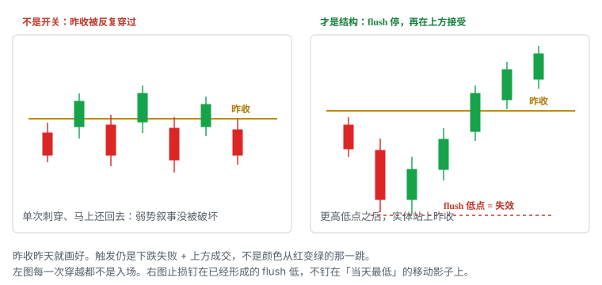

# 5.6 Red-to-Green

> 一句话：昨收昨天就知道。先 flush，再在上方被接受。它不是开关。Squeeze 是假设。

开盘先走到昨天收盘价下方，随后重新站回去，课程叫 Red-to-Green。名字里的红 / 绿只描述当天相对昨收的涨跌状态，不描述公司基本面，也不自动等于当日趋势转强。

前收盘价是位置。这个位置昨天收盘时就已经确定，今天开盘前可以画好。它不是因果开关：价格穿过它，并不保证买方接管。真正要看到的是下跌失败、有人承接、站上之后还有持续成交。

课程常把随后的上涨讲成 short squeeze。更严谨的说法是：新增买盘，加上可能的空头回补，一起把需求推高。图表通常证明不了「这里堆了很多空头」。把能观察的写成触发和失效，把故事留在注释里。

本章只写红翻绿这一条。横盘后的向上突破（Consolidation Squeeze）另章统计，不要和开盘红翻绿丢进同一个桶。Gap and Go 一章会把它当作开盘七种入口之一再列一行；那一行不是第二套定义。

## 5.6.1 昨收是位置，不是开关

定义用一句话就能写完：

> 今天先走到**昨天常规时段收盘价**下方，随后重新站回上方，并在上方被接受。

「昨天常规时段收盘」是固定数字。盘前扫描器上的 Gap %，分母也是它。卷二把前一日高低与收盘列进历史价位；本章只取其中一根线，因为红翻绿的参考位就是这一根。

盘前核对三件事，再画线：

1. 昨收是否已按拆股 / 并股复权；
2. 代码有没有隔夜变更，导致你画的昨收和今天交易的不是同一只证券；
3. 盘后是否已经走过这根线——盘后走过会改变隔夜持仓的损益，但不改「常规时段昨收」这个数字本身。

线画好之后不要再动。事后把昨收改成「其实我想用的是开盘价 / VWAP / 盘前低」，是在换 setup，不是在修正画线误差。

昨收附近往往有双向交易。止盈、止损、条件单、隔夜仓的心理成本，都会堆在同一带。单次穿越可能反复来回。一根影线插过去又回来，是试探，不是接受。接受看起来更像：实体站在线的那一侧，随后的回落不把线还回去。


上图是干净版本：开盘先红、flush 打出低点、更高低点、实体站上昨收。止损钉在已经形成的 flush 低点。前收盘本身不是买入按钮。



左图每一次穿越都可以被事后叫成「红翻绿」。没有下跌失败、没有更高低点、没有上方成交，弱势叙事没有被破坏。右图才是结构：flush 停止，再在上方接受。两张图用同一根昨收，setup 质量完全不同。

「红 / 绿」是报价软件给涨跌幅上的颜色。软件把现价和昨收比，低于就是红，高于就是绿。颜色切换和「买方已经接管」不是同一件事。不要把扫描器从红变绿当成触发。

## 5.6.2 严格定义：先到下方，再站回去

严格意义上的红翻绿，要求价格**先低于**昨收。最常见的路径是低开（gap down），或者平开后立刻打到昨收下方。没有这一步，后面无论出现多少根绿 K，都不该用这个名字。

三种合法路径：

| 路径 | 开盘相对昨收 | 随后发生什么 | 还叫红翻绿吗 |
|---|---|---|---|
| 低开再收回 | 开在昨收下方 | flush 后站回昨收上方 | 是，最干净 |
| 平开下探再收回 | 开在昨收附近 | 先打到下方，再站回去 | 是，仍要下方这一段 |
| 高开后先跌破再收回 | 开在昨收上方 | 先失去昨收，再夺回 | 是，但要和「高开回落」分开记账 |

第三种容易和 Gap Fade、高开阻力空搞混。名字仍可以叫红翻绿，假设却多了一层：高开曾经有效，后来失效，后来又被重新接受。空间、停牌带、空头定位都和低开版不同。日志里加一列「开盘在昨收哪一侧」。

盘前已经低于昨收、盘前自己完成一次收回，是盘前结构，不是开盘红翻绿。开盘后再跌破再收回，才是开盘这一笔。盘前做成的笔，和开盘后同名结构，分开统计。

用哪一根 K 的周期，必须事前写死。1 分钟先站上、5 分钟还在下方，不是「已经红翻绿」。选择周期后，用同一周期定义入场、失效和样本。

## 5.6.3 什么不是红翻绿

下面这些经常被误叫成红翻绿。它们可以是别的 setup，但不是本章。

| 看见什么 | 它实际是什么 | 为什么不是红翻绿 |
|---|---|---|
| 任意一根绿 K | 单根 K 的开收关系 | 没有「相对昨收」这个位置 |
| 高开后继续绿 | Gap and Go / 盘前高突破 | 从未到过昨收下方 |
| 日线连续红日后第一根绿日 | First Green Day | 触发是前日**高点**，不是昨收 |
| 横盘很久后向上离开箱子 | Consolidation Squeeze | 参考位是箱子上沿，不是昨收 |
| VWAP 下方收回 VWAP | VWAP 收回 | 位置是动态均价，不是昨收 |
| 开盘第一分钟暂时翻绿又跌回去 | 未收盘的颜色闪烁 | 没有接受 |
| 已经在昨收上方震荡，偶尔下影点到线 | 线附近的噪声 | 没有先被下方接受 |

First Green Day 尤其容易混。那个研究假设看的是：曾经 in-play 的股票，连日回落之后，**突破前一交易日高点**。昨收和前日高是两根线。一只股票可以同时满足两者，日志仍要写你到底做的是哪一根。

也不要把「扫描器上今天是绿的」当成已经完成的红翻绿。扫描器比较的是现价和昨收，现价在上方只说明状态，不说明曾经跌破、曾经 flush、曾经被接受。

坏消息、融资、流动性消失导致的低开，图形也可以先红后绿。图形像，不等于可做。先核对原始公告。市场反应比主观新闻标签更重要；坏消息下的收回，常只是空头回补的第一推力，后面没有新买盘接力。

## 5.6.4 先 flush，再接受

红翻绿不是「看见昨收就买」。顺序是：

1. 价格先到昨收下方；
2. 出现一段可识别的 flush——快速下探，不是一根上下影都穿过昨收的十字星；
3. flush **停止**：低点不再下移，点差从失控往回收；
4. 出现更高低点，或至少出现明确的承接；
5. 重新站上昨收，并在上方成交（接受）；
6. 上方到第一目标还有空间。

第 3 步之前买入，是在最大红 K 里猜底。那是本卷 5.5 的 flush dip，而且默认不做。红翻绿用的是 flush **之后**的收复，不是 flush **之中**的抄底。

开盘第一分钟里，K 线在数秒内大幅扩张，盘口和成交可能脱节。「可能出现承接」只是观察，不能根据一根未完成的下影确认反转。如果券商开盘卡顿，或自己读不稳订单状态，最简单的控制是避开第一分钟。

从低点恢复后，连续更高低点说明卖方暂时无法继续推进。这仍然不够。接近昨收时，问的是：有没有人在这根线上方继续成交，还是只剩影线试探。课程常把这一段上涨直接叫 squeeze；你能写进计划的只有：低点停了、低点抬高了、昨收被接受了。

接受的最低标准，选一种写死：

- 已收盘 K 的实体完全在昨收上方；或
- 价格穿过后回踩昨收，回踩低点仍在线上方（或只刺穿影线），随后再抬高。

两种都比「最高价碰过昨收」严。未收盘 K 的最高价更不能当已经突破。用未收盘最高价统计，会把大量假信号算进样本。

点差还没从 flush 里恢复，就谈不上接受。报价跳着穿过昨收，你的成交价可能已经远离图上那根线。限价要限制最坏买价；未成交就放弃，不能顺着向下改价去追那一次穿越。

## 5.6.5 触发怎么写死

把红翻绿写成可重复的触发，而不是颜色口诀。

| | |
|---|---|
| 位置 | 昨天常规时段收盘价（盘前画好，不再移动） |
| 前置 | 今天已经在这根线下方被接受过；flush 已经停止 |
| 触发 | 从下向上收复昨收，并在上方成交。写死一种：收盘确认，或回踩守住 |
| 失效 | 已经形成的 flush 低点，加上你预算里的滑点 |
| 常见失败 | 第一次反弹后大红 K 再测低位；基准附近反复穿越；止损放在「当天最低」而低点还在刷新 |
| 不做 | flush 还没停；在最大红 K 里猜底；上方立刻是强阻力；把 SSR 当必须上涨；用后续大涨倒推第一次穿越 |

「在上方成交」四个字要落到订单上。穿越版的入场，是昨收被接受的那一带，不是远远高于昨收的追价。回踩版的入场，是回到昨收附近再抬高的那一带，不是第一次穿越的最高价。两种入场的滑点特征不同，不能共用一个胜率。

锤头、VWAP、短均线、整美元，可以同时出现在 flush 低点附近。它们不是四个加分项，不要累加成机械评分。先问哪一条线定义失效。若失效是 flush 低点，其它线只是语境：它们解释你为什么在这里观察，不把止损改到另一根线上。

若你改用「回踩昨收的低点」当失效，你已经从穿越版换成回踩版。日志里是另一笔。不要盘中把止损从 flush 低点偷偷挪到昨收下方两美分，又继续沿用穿越版的样本名。

触发必须能在入场前用一句话说完。说不完，就还没有计划。合格的句子长这样：

> 昨收 5.00。已经打到 4.72 并出现更高低点。1 分钟实体站上 5.00 后买。失效 4.72 再留 0.05。第一目标盘前高 5.15；不够 1R 则不做穿越，改等回踩。

不合格的句子长这样：「红了又绿了，空头要被挤。」

## 5.6.6 失效在已经形成的 flush 低点

止损放在**已经形成**的 flush 低点。这句话有两个重点。

第一，低点必须已经形成。还在往下走的影线，不是失效位。把止损设在「大概就是这一带」，等于没有失效。等低点不再刷新、后面一根 K 没有继续创新低，这个数字才能写进计划。

第二，用的是这一段 flush 的低，不是「当天截至现在的最低」这个会移动的标签。若第一段 flush 打到 4.72，你按 4.72 进了场，后来又打出 4.60，这不是「止损跟着最低走」，这是失效已经触发。退出。新的 4.60 如果再收回，是新的一笔，按新的低点重算股数。

滑点要加在失效价外面，不要加在脑子里。4.72 的低点，预算滑点 0.05，计划退出按 4.67 算每股风险。开盘和小盘上，0.05 经常不够；用最近同类股票的真实成交，而不是用昨天平静日子的点差。

若 flush 低点距离入场过远，只剩三件事可做：

1. 按每股风险缩小仓位；
2. 放弃穿越，改等回踩，用更近的微结构低点当失效；
3. 放弃这一笔。

没有第四件事：把止损挤进噪声区，或者因为「空间看起来很大」而忽略每股风险。空间不够不能靠加股数补。远处的止损加上过大的股数，是把 1R 写成假数字。

失效触发就走。不能因为仍期待 squeeze 而扩大亏损。也不能因为「还没回到昨收下方很深」就改口说结构还在。红翻绿的多头假设，在 flush 低点被向下接受的那一刻结束。

盘中把止损上移，只允许朝对你有利的方向，并且要符合事先写好的规则：例如回踩昨收守住之后，失效收到回踩低。临时因为害怕而把止损收到入场价，可能把一笔仍有效的结构扫出去；临时因为不甘心而把止损往下加远，是在扩大 1R。两种都要在计划里禁止或写清条件。

## 5.6.7 课程列出的前提（启发式）

幻灯片常列四条。全部标成启发式。它们用来缩小观察名单，不是物理定律，也不是四个打勾就下单。

1. 低流通 / 高成交 / 有经过原始公告核实的催化；
2. 上方没有立刻撞上的明显阻力；
3. 突破要有量并且能站住；
4. **必须发生在开盘后大约 10 分钟之内。**

低流通和高成交同时意味着更高停牌和滑点风险。你筛选的是容易供需失衡的股票，也同时筛选了更肥的尾部。单笔上限、是否允许在 LULD 带附近停留，要比平常更严，而不是因为「课程喜欢这类」就加仓。

「好催化」必须经原始公告核实。标题、聊天室口播、扫描器新闻栏，都不是原始来源。市场反应比你给新闻打的主观标签更重要：同样是「合同」，有的开盘直接高走，有的低开后无人问津。没有催化的低开收回，可以观察，不要和有核实催化的样本混桶。

上方没有立刻撞上的明显阻力，说的是第一目标。昨收上方 3 美分就是盘前高、前日供给或整美元，穿越即使正确也不值得做。空间问题见 5.6.10。

突破要有量并且能站住，是接受的另一句。放量也可能是昨收附近的双向换手。量是观察项，不是单独的买入许可。低量刺穿昨收，更像试探。

课程还列出盘前支撑、VWAP、均线、整美元与锤头等反转参考。用途是帮你在 flush 附近找到「为什么这里可能停」，不是给你一张评分表。缺一项就提高放弃的权重；五项齐了也不降低对接受的要求。

这些数字——float 区间、相对量阈值、10 分钟、日线空间 2R——全部是启发式。改完必须写进自己的计划，用自己的样本验证。不要盘中临时把阈值改成「今天这条也算」。

## 5.6.8 开盘后大约 10 分钟（启发式）

第四条最容易被漏掉，也最容易被讲成迷信。课程的原话大意是：时间拖太久，很多人会认为已经不 in-play，那就**只剩空头去回补，缺乏其他多头买盘的量**，引出来的突破很可能是假突破。

把这句话拆开：

- 空头回补只能提供第一推力；
- 持续上涨需要新增买盘接力；
- 开盘后越久，还在盯着这只股票、愿意在昨收上方加需求的人越少；
- 因此课程把「大约 10 分钟」当作过滤。

这是机制假说，加上一条时间启发式。它不是物理定律。10 分钟不是交易所规则，也不是 LULD 的时间单位。你的计划里必须先选定一种用法，再去统计，不要盘中决定「今天例外」。

三种合法用法，选一种写死：

| 用法 | 规则 | 代价 |
|---|---|---|
| 硬过滤 | 常规时段开盘后超过约 10 分钟还没完成接受，不做 | 会漏掉迟到但后来走远的样本 |
| 研究桶 | 做成，但记进「迟到的红翻绿」，单独算胜率和期望 | 样本要够，不能和准时桶合并吹胜率 |
| 降权 | 超时只允许回踩版、更小仓位、更近失效 | 规则要事先写清「多小、多近」 |

不要第四种：看着 10:05 第一次站上昨收，告诉自己「其实刚开盘不久」。时钟不认感觉。

10 分钟从哪里开始数，也要写死。建议：上市市场常规时段开盘（美股通常 09:30）起算，不从你点开这只股票的时刻起算，不从盘前最后一次触及昨收起算。若你做的是盘前红翻绿，时间窗口另定，不要借用开盘这 10 分钟。

迟到的收回并不少见。横盘半小时后突然穿过昨收，外观很像红翻绿，动能来源却更接近「只剩回补」或普通区间突破。后者应记进横盘挤压或普通突破，不要为了凑红翻绿样本而改名。

热市里 10 分钟可能仍有接力；冷市里 3 分钟就已经没人看。启发式要按市场阶段分组验证，不要用一个热市月份证明「10 分钟永远有效」，也不要用一个冷市月份证明「开盘只能做 2 分钟」。

## 5.6.9 预判、穿越、回踩必须分开

同一根昨收，三种进法是三笔不同的交易。混进一个胜率，样本是脏的。

| 入场 | 你买在哪 | 优点 | 主要风险 | 还算红翻绿吗 |
|---|---|---|---|---|
| 预判 | 昨收下方，赌它马上收回 | 均价更低 | 收回从未发生；你实际在做 flush dip | 通常不算；那是 5.5 |
| 穿越 | 价格穿过昨收并接受的那一带 | 条件已触发 | 滑点、假突破、基准附近立刻还回去 | 是 |
| 回踩 | 接受之后回到昨收附近再抬高 | 失效往往更清楚 | 可能不给回踩；给了也可能失败 | 是，另一笔 |

预判红翻绿，就是在昨收下方接飞刀，再盼着颜色变绿。本章默认不做。若你坚持做，必须按 flush dip 的规则：低点已停、点差恢复、买盘能推回去，并且接受离散的停牌损失。不要把预判成功的样本，事后改名为红翻绿来美化胜率。

穿越版要求你在开盘流动性最差的几分钟里，在一条人人都看见的线上成交。滑点会吃掉图上的 R。记录下单价和实际成交均价。计划股数必须能在当前深度里退出，不能只看进得去。

回踩版等的是：昨收已经从阻力候选变成支撑候选。证据是回落到线附近时量缩、低点不坏、随后再抬高。回踩跌回昨收下方并被接受，说明第一次穿越是假的。按回踩低点出，不要改口说「更深的红翻绿更好」。

同一只股票上，穿越亏了、回踩再进，是两笔。共同失效如果还是最初那个 flush 低点，而你把仓加在更高的地方，全仓风险通常变大。加仓公式见卷四：

```
加仓后总风险 =（全仓平均价 − 共同失效价）× 总股数
```

共同失效不变、平均价抬高，1R 就被你自己打爆了。超预算就减股数，或把有效止损往有利方向移，或不加。

## 5.6.10 空间：第一目标够不够 1R

红翻绿的位置在昨收。第一目标通常在更上面：盘前高、开盘后已形成的高点、最近的整美元、日线供给。先量这段距离，再决定做不做穿越。

教学算法：

```
每股风险 = 入场 −（flush 低点 − 滑点）
到第一目标 = 第一目标 − 入场
R = 到第一目标 ÷ 每股风险
```

R < 1，穿越版默认放弃。不是因为「赚不到钱就不做」，而是因为你在一条人人都看见的线上支付滑点，失败时还要再付一次滑点出去；第一目标不够 1R，期望很难把成本挣回来。

空间不够时的合法动作：

- 等回踩，把失效收到回踩低附近，每股风险变小，同样的第一目标才可能 ≥ 1R；
- 若回踩也不给近端失效，放弃；
- 不把第一目标改成「看感觉还能到的更远的地方」，用还没发生的利润为过远止损辩护。

昨收上方立刻是强阻力，是课程四条前提里的第二条。强阻力包括：盘前高就在线上、前日冲高回落的供给、整美元、正在显示的大卖单墙。墙可以撤，所以它只影响执行，不单独构成「一定过不去」；但第一目标若就在墙里，计划应写成「到了先走」，而不是「突破墙再算赚」。

HOD 会随新高更新。红翻绿成功后，下一笔常常变成 HOD 突破。那是另一条位置，不要把两笔的目标叠成一条大趋势来给第一笔加仓。卷七 AMC 开盘里，合格的红翻绿在靠近支撑处进、在当日高点附近先走；随后在高点附近再追，录像自己都说风险更大——上方空间更少，失效更远。

## 5.6.11 Squeeze 是假设，不是观察

课程喜欢用 short squeeze 解释红翻绿之后的加速。机制可以是真的：价格向上穿过一批空头的止损，回补单变成市价买，推动价格，再触发下一批止损。图表**证明不了**这一段里有多少回补、回补占买盘多少、还剩多少空头。

可观察事实只应写成：

- 价格停止创新低；
- 形成更高低点；
- 收复前收盘并在上方接受；
- 量能是否增加；
- 点差是否仍可执行。

下面这些**不是** squeeze 的证明：

- 屏幕上出现 SSR 标签；
- 借股费变贵或 Locate 变难；
- 价格加速、出现长绿 K；
- 聊天室有人喊「空头要爆了」；
- 你估计 float 小、所以「空头一定挤得动」；
- 历史 short interest 报告——那是滞后数据，而且不含当天新开的日内空。

借股费贵，说明做空成本高，也可以说明已经有人在付这个成本。它不告诉你净空头方向。SSR 只改变部分新空单的价格测试，见下一节。加速的长绿 K，买盘来源可以是新多、回补、做市对冲、期权对冲，图上分不出来。

把 squeeze 当叙事可以：它帮你记得「向上时速度可能突然变快，向下失败时同样快」。当入场条件不行。不要因为「空头必须回补」而在失效之后还拿着。空头没有必须在你的时间窗口回补的义务；他们可以加仓、可以换日、可以根本不在这根线上。

横盘挤压里那句「区间里积累了很多空头」，同样是解释假设。那一章的触发是箱子上沿被接受，不是昨收。不要用 squeeze 这个词把两种结构粘成一种「空头被挤策略」。

## 5.6.12 SSR 不是必须上涨

SSR（Regulation SHO Rule 201）在常规时段相对前一常规时段收盘下跌至少 10%、并由上市市场确认后触发。它限制的是普通空单必须高于当前最优买价才能显示或执行。它不是做空禁令，不保证上涨，不制造 squeeze，不阻止股票继续下跌。完整规则在卷三。

红翻绿经常出现在已经大跌、甚至已经触发 SSR 的股票上。两件事会叠在同一根昨收附近：

- 价格要从下方回到昨收，看起来像「空头走投无路」；
- 屏幕上有一个红字 SSR，看起来像官方盖章。

叠在一起仍不是方向信号。SSR 只让新的普通空单更难主动打到 bid。已经建立的空仓还在。多头卖出不受这条价格测试约束。价格可以在 SSR 下继续创新低，你的红翻绿照样可以在 flush 低点被扫掉。

不要用 SSR 标签去追所谓挤压。不要把「已经跌了 10%」理解成「空头被限制所以必须回补」。10% 是触发阈值，不是反转阈值。盘前看见 SSR，还可能是**昨天**触发、今天仍在生效，和今天这根红翻绿没有新的因果关系。

回测若假设「SSR + 穿过昨收 = 必涨」，会把执行也估错：SSR 下空头的卖压结构变了，并不自动给你更好的买入成交。

## 5.6.13 和相邻 setup 怎么切开

红翻绿是位置加状态转换。旁边还有好几条也用「先弱后强」当口头禅。切开的方法是问：参考位是哪一根线。

| Setup | 参考位 | 和红翻绿的关系 |
|---|---|---|
| 红翻绿 | 昨收 | 本章 |
| Flush dip | 急跌本身的停止 | 常发生在红翻绿之前；预判版容易滑成它 |
| 突破后回踩 | 已被接受的旧阻力 | 昨收被接受之后，回踩昨收可以是它，但要另记 |
| Gap and Go 其它入口 | 盘前高、盘前枢轴、开盘区间、整美元 | 参考位不同；昨收只是其中一种 |
| Opening Range | 事先写死的开盘时长高低 | 昨收可能碰巧在区间里，不是 ORB 的定义 |
| First Green Day | 前日高点（日线） | 更高一级的选股语境，不是开盘颜色 |
| Consolidation Squeeze | 横盘箱子上沿 | 时间更长，方向事先未知 |
| VWAP 收回 | VWAP | 动态线；可与昨收重合，仍是同一条价格路径上的一次事件 |

多个位置重合提高关注度，不是独立概率相乘。昨收、VWAP、整美元开盘后叠在 5.00，你仍然只有一次穿越。日志记「昨收 + VWAP 重合的红翻绿」，不要记成两个 setup 同时赢。

和做空的边界：直接在开盘盲空，最容易遭遇红翻绿式的向上加速。卷六的写法是等待 VWAP 或开盘结构失守，而不是赌第一分钟的方向。本章不教你反手。红翻绿失败之后，空头是新的一笔，要有 locate 和新计划。

和低开动量原型的边界：低开可能来自坏消息、发行、财报或无明显事件。原因会影响收回质量。下跌很多不等于便宜。做多仍然需要收回、更高低点或红翻绿等确认。盲接低开是把「已经跌了」当成优势。

## 5.6.14 开盘实时里它长什么样

把开盘拆成可以暂停的几段。每一段只回答当时已经知道的事。

**开盘几秒到一两分钟。** 价格从开盘区域快速下探，底部量能开始放大。此时只能说「可能出现承接」。一根下影、一个锤头、一次扫到盘前低，都不是反转确认。若买入，你已经不在本章，而在 flush dip。止损必须围绕已形成的低点；不能无限等待回到成本。

**低点停止之后。** 卖方暂时无法继续推进。连续更高低点比单根长下影有用。接近昨收 / 盘中阻力时，看的是成交和站稳，不是颜色。盘口上 ask 不断补单而价格不前进，是吸收或动能不足，不是「马上要挤」。

**第一次站上昨收。** 问三件事：这根 K 收了没有？回落有没有立刻把线还回去？到第一目标还有没有 ≥ 1R？三件里有一件是否，穿越版可以不做。AMC 开盘那段录像里，价格先在 VWAP / 开盘参考附近反复，一笔高位买入被拉下；后来 K 线接近收盘且位置较高，才形成更清楚的红翻绿。冲动那一笔和合格那一笔，不能因为发生在同一区域就算同一 setup。

**站上之后的第一段推进。** 合格的一笔，盈利来自靠近失效的入场和明确目标，不是来自「red 变 green」四个字。接近盘前高或当日高时，盘口出现较大卖单、价格不再立即推进，先走是执行，不是胆小。目标附近的二次入场，通常上方更少、失效更远。

**时间。** 把时钟放在图上。9:32 完成接受，和 9:52 完成接受，课程给的权重不同。你不一定照抄 10 分钟，但必须有自己的时间字段。没有时间字段的红翻绿日志，无法验证 5.6.8。

GTEC 开盘提供另一张对照：开盘最初几分钟是互不相连的小回踩，结构不清楚；到价格重新进入前一交易区间、对着可以指出的前高，红翻绿 / 前高才成为当天最清楚的一笔。结论不是「等几分钟运气会变好」，而是「没有可指出的支撑和目标时，不要把试单叫成红翻绿」。

## 5.6.15 失败、二次下杀、再收回

第一次反弹没有保证趋势持续。随后大红 K 可能重新测试低位，甚至打出新低。

三种失败，不要混着复盘：

1. **假穿越。** 影线或未收盘最高价过了昨收，实体没站住，立刻还回去。若你按未收盘最高价进了场，这是规则漏洞，不是市场骗你。
2. **接受后立刻失守。** 实体站上，下一根又被昨收下方接受。穿越版失效。若止损还在 flush 低点、中间距离很大，亏损会大于「昨收被还回去」这句轻描淡写。
3. **二次 flush。** 回到下方之后继续创新低。原计划结束。新低如果再收回，是新的 flush、新的低点、新的股数。

快速反复会显著增加滑点和追涨杀跌。仓位应比平稳行情小。两次未按预期立即反应，暂停同一类试单——GTEC 录像把这写成可复用规则，红翻绿同样适用。开盘不是必须参与的仪式。错过第一波，后面还有回踩和盘中突破。

下杀后出现强绿 K，反弹幅度大也不等于低点安全。更有用的证据是：下一次回踩是否形成更高低点，以及上方被套成交是否阻挡。复盘要同时保留失败段和恢复段，避免只截最后上涨。只截最后那几根绿 K，任何穿越看起来都是高质量入场。

二次收回的合法条件：

- 原仓已按失效出去，账户回到扁平；
- 新的 flush 低点已经形成；
- 仍满足你的时间启发式，或被明确记进迟到桶；
- 股数按新的距离重算，不沿用第一笔的股数；
- 上方空间重新量过。

不合法的是：第一笔还没走干净，就在更低的地方加，指望两次红翻绿合成一笔大赢家。那是摊平。

ENTX 那天在 6 美元附近跌破后迅速收回，才提供新的回踩依据——不是每次跌破整数都应买。跌破后收回，是「这一侧未能被接受」；直接在跌破的那一刻买，是在猜。红翻绿在昨收上的逻辑相同。

## 5.6.16 数字例：昨收 5.00

教学用整数，不是某只股票。盘前画好：昨收 5.00，盘前低 4.70，盘前高 5.15，上方日线供给 5.40。单笔可亏 50 美元。滑点预算 0.05。

开盘先到 4.72，出现更高低点 4.80，然后回穿 5.00。

**穿越版。** 5.02 接受后买。失效按 flush 低 4.72 − 0.05 = 4.67。每股风险 0.35。50 ÷ 0.35 ≈ 142 股。到盘前高 5.15 只有 0.13，不到 1R。

结论先写在下单前：要么等回踩把止损收近，要么放弃穿越、改等盘前高突破当另一 setup，要么放弃。不能因为「后面还有 5.40」就把第一目标画远。5.15 是已经存在的供给，价格先要过它。

假设你不理空间，142 股在 5.02 成交，下一分钟回到 4.90。结构还没坏，浮动亏损约 17 美元。若你因为害怕把止损收到 4.98，可能在噪声里出去，然后看着它再上 5.15——这是规则问题，事后不要改名叫「其实穿越是对的」。若价格直接打到 4.70，计划亏损约 50，再加滑点可能更多；这才是 1R。

**回踩版。** 站上 5.00 之后回到 5.01–5.03，回踩低 4.99，再抬高。入场 5.04。失效可以收到 4.99 − 0.05 = 4.94。每股风险 0.10。50 ÷ 0.10 = 500 股。到 5.15 是 0.11，大约 1.1R。这是另一笔，不能和穿越共用胜率。

回踩若被 4.95 下方接受，按 4.94 出。不要把仓留着等 4.72，说「反正最初的 flush 低点还在」。你已经把失效改成回踩低；改了就要执行。

**10 分钟启发式怎么用。** 若直到开盘后 25 分钟才第一次站上 5.00，课程会担心只剩回补、缺少新买盘。写成硬过滤就不做。写成研究桶就做，但标题必须是「迟到的红翻绿」。不要在 9:55 告诉自己「今天这只还很 in-play」。

锤头、VWAP、整美元可以同时出现在 4.72 附近。失效仍是 flush 低点。VWAP 若当时走在 4.85，它解释你为什么观察承接，不把止损改到 4.85。止损钉在 VWAP 上，是另一 setup。

**点差恶化。** 4.72 那一下，盘口从 0.02 变成 0.10。你在 5.02 看见的接受，实际买到 5.08，止损成交在 4.64。每股真实风险 0.44，不是 0.35。142 股变成约 62 美元，超过 50 的预算。这就是为什么股数还要再按深度往下砍，为什么开盘默认更小。

## 5.6.17 数字例：昨收叠在 10.00

昨收恰好是 10.00。盘前低 9.40，盘前高 10.20。日线在 10.00–10.30 有过供给。开盘打到 9.55，锤头，抬到 9.80，再穿 10.00。

这里至少叠了三样东西：昨收、整美元、旧供给。关注度更高，假穿越也更多。第一次触及 10.00 被压回来，是正常的，不是「红翻绿失败所以反手」。

**第一次穿越放弃。** 入场若在 10.02，flush 低 9.55，滑点 0.08（整美元附近常常更宽），每股风险 0.55。到 10.20 只有 0.18。放弃穿越。

**回踩才看。** 10.00 上方横了两根 1 分钟 K，回踩低 10.01，再抬高。入场 10.06。失效 10.01 − 0.06 = 9.95。每股 0.11。第一目标仍是 10.20，约 1.3R。到不了 10.20、盘口吸收明显，先走。ENTX 在 10 美元附近的教训是：大量成交后价格仍过不去，剩余仓位的退出开始恶化。「隐藏卖家」只是对吸收的假设；可操作事实是推不动。

**二次 flush。** 回踩失败打到 9.48。原仓应已在 9.95 一带出去。9.48 若再收回 10.00，时间往往已经超过 10 分钟启发式。要么进迟到桶且仓位更小，要么不做。不要因为「刚才那笔是对的，只是止损太近」而把股数加回去。

**高开先跌破再收回。** 若这只股票开在 10.15，先跌破 10.00 到 9.70，再收回，名字仍可叫红翻绿，但开盘在昨收上方。上方 10.20 的盘前高已经很近，还可能对着高开回落的空头。这一笔的失败模式更像「高开结构被破坏后的反抽」，单独记账。

## 5.6.18 盘口、点差、停牌

昨收是人人都画的线。执行环境往往比形态难看。

观察顺序和卷三一致：先结构，再流动性，再下单方式。Time & Sales 是已经发生的成交，不是未成交订单列表。不能从打印颜色直接推断某个交易者的意图。大卖单撤掉可能促成穿过昨收，也可能只是流动性短暂消失。

穿越瞬间要看的几件实事：

- 点差有没有在穿过线的时候突然拉宽；
- bid 是否抬到昨收上方，还是只在下方闪一下；
- 自己的计划股数是否已经大于可见深度的一小部分；
- 限价买是否排得进，卖出时有没有人接。

计划仓位应能在当前深度里合理退出。进得去、出不去，不是红翻绿，是被线卡住。无法用限价控制最坏成交价时，开盘仓位不应等于你在平稳回踩里用的数字。

停牌是红翻绿之后常见的下一事件，尤其低流通、高成交、刚收回关键位的股票。LULD 价格带不是上涨目标，也不是支撑。到达价格带不一定立即暂停；暂停可能超过常见的约 5 分钟；恢复可以向任一方向跳空；暂停期间普通止损无法执行。

仓位压力测试至少假设恢复时不利跳空 10%、20% 或更大。若这笔红翻绿的计划 1R 是 50 美元，而一次向下恢复就会吃掉数百美元，仓位过大，或根本不该在带附近停留。ENTX 的控制发生在进入暂停之前：分批止盈、减仓，发生在第一次 halt 之前。停牌是动量的结果，不是红翻绿的目标。

恢复后两个图表可能短暂显示不同价格。先确认可见买卖一、成交和订单状态，再决定还有没有触发。用错误价格把「红翻绿还在」下进去，等于在未知拍卖结果上加杠杆。

部分成交在开盘和停牌后尤其危险。你以为没买到，尾巴却在；或你以为买满了，实际只有一部分。先取消剩余、对一下账户持仓，再谈下一笔。

靠近向下价格带时，不能因为「已经从昨收跌了很多」就抄底等下一次红翻绿。下一事件可能是 halt down，而不是平滑收回。

## 5.6.19 案例里真正该带走的

完整分钟账在卷七。这里只取和红翻绿定义有关的句子，避免用结果给名字打分。

**AMC 开盘。** 红翻绿需要「下跌失败 + 收复参考 + 上方空间」。条件还没出现时的高位买入，亏的是冲动，不是「红翻绿没做成」。后来 K 线接近收盘且位置较高，才形成更清楚的条件。盈利来自靠近支撑的入场和明确的前高目标。20,000 股不是学习目标：几角钱的不利移动就是数千美元。截图里的大额仓位，证明的是规模会放大执行错误，不是规模是优势。

**GTEC 开盘。** 开盘最初缺乏稳定高低点时的试单，质量低于后来收复水平、对着 HOD 的那一笔。结构清楚时才配得上红翻绿这个名字。盘前已经大涨、开盘改用更小仓位，是在承认尾部，不是在「今天已经赚了所以可以随便做」。连续热键加仓前，要看得见预计总股数和全仓止损。

**ENTX。** 隔夜盘后转强，可以否决昨天的阻力空假设；「可能有空头被套」仍不能单独当多头许可。5.70 支撑、收回参考、VWAP 回踩，是可观察的。连续向上停牌之后降低 size，错过更高的一段属于计划代价。10 美元推不动之后的 flush，结束的是原来的上升阶梯；再接飞刀是新的、更差的假设。

三份录像共同的可复用句：

- 名字不赚钱，位置加接受才可能；
- 第一分钟和停牌恢复的成交质量单独处理；
- 加仓要重算全仓风险；
- 复盘按点击拆开，不要用开盘二十分钟的净盈亏给所有试单打分。

## 5.6.20 计划模板

下单前按这个顺序填。填不完就不点。

1. 标出昨收、盘前低、盘前高、VWAP、整数位、最近上方阻力、LULD 带。
2. 核实催化的原始公告；没有核实就降级为观察。
3. 等开盘 flush 停止。不在最大红 K 里猜底。
4. 观察能否形成更高低点。
5. 选择穿越或回踩，写死一种。要求收盘确认还是回踩守住，也写死。
6. 失效钉在已经形成的 flush 低点（穿越），或回踩低点（回踩）。加上滑点。
7. 量到第一目标的 R。不够 1R 就改等待或放弃。
8. 用可亏 ÷（入场到失效 + 滑点）算股数，再取流动性、开盘更小上限、停牌暴露中的最小值。
9. 写下时间启发式：约 10 分钟是硬过滤、研究桶，还是降权。
10. 写下停牌预案：减仓点、是否允许带附近停留、恢复后先确认报价。
11. 接近 HOD 或历史阻力时分批处理；目标到了就走。
12. 若重新跌破结构或进入 halt，按预案处理，不临时扩大风险。

六栏也可以压成一张卡，和附录 C 对齐：

| | |
|---|---|
| 位置 | 昨收（盘前画好） |
| 触发 | 先跌破再站上，并在上方成交 |
| 失效 | flush 低点 |
| 放弃 | flush 未停；上方立刻是强阻力；把 SSR 当必须上涨 |

Gap and Go 清单里的那一行，必须和这张卡一致。不要在开盘章节把失效改成「基准下方随便一个结构低」，又在本章坚持 flush 低点。你若选用更近的微结构低点，要在两处同时改，并单独统计。

## 5.6.21 复盘：把画面停在入场前

红翻绿是最容易事后讲成必然的结构之一：最后总有一根大绿 K，前面的红看起来都像「为了挤空而做的铺垫」。复盘时把画面停在你点下去之前，逐项写。后面的 K 用纸挡住。

当时已经知道哪些支撑？昨收、盘前低、VWAP，各是多少？有没有把线画在事后才好看的地方？

反转 K 线已经收盘了吗？你用的是未收盘最高价，还是实体？

上方到第一目标的空间是否足够 1R？第一目标当时已经在图上，还是你后来看见 5.40 才补的？

如果没有后来的大绿 K，这笔入场仍合理吗？把后面的上涨抹掉，你是否仍会按同一规则买？

对 squeeze 的判断，哪些是可观测证据，哪些只是推测？SSR、借股费、加速，有没有被你写成证明？

你用的是穿越昨收，还是回踩昨收？有没有把两种混在一起？预判有没有混进来？

时钟：接受发生在开盘后第几分钟？你当时的规则是硬过滤还是研究桶？有没有「今天例外」？

执行：计划买价、实际均价、计划止损、实际止损成交、点差有没有在穿越时拉宽、有没有部分成交、有没有停牌。

严格按规则退出时的结果，不是事后最佳退出点。用最佳点给规则打分，所有失败都会变成「其实该拿到更远」。

最小样本字段：

- 日期、代码、昨收、开盘价、开盘在昨收哪一侧；
- 催化核实与否、float 口径、盘前量；
- flush 低点、更高低点是否出现；
- 入场类型（穿越 / 回踩）、周期、接受定义；
- 入场时刻距开盘几分几秒；
- 第一目标、计划 R、实际滑点；
- 是否 SSR、是否停牌、恢复方向；
- 规则结果（R），以及你当时有没有改规则。

「至少各 20 个成功和失败」是课程训练量的启发式。按波动阶段分组，不要用一个热市月份凑满数字。迟到桶单独凑，不要往准时桶里掺。

## 5.6.22 检查表

盘前：

- 昨收数字核对过复权和代码没有？
- 线已经画上，并且今天不会改？
- 盘前低、盘前高、日线供给、整美元、LULD 带标了吗？
- 催化有原始公告吗？
- 点差和深度按你的计划股数进出得了吗？
- 时间启发式写的是硬过滤、研究桶，还是降权？

flush 期间：

- 低点是否已经停止下移，而不是你希望它停？
- 点差是否从失控恢复？
- 你现在想买的话，是不是已经滑成 flush dip？
- 靠近向下 halt 带吗？靠近则仓位默认是 0。

触发前：

- 已经在昨收下方被接受过吗？
- 更高低点有了吗？
- 接受定义满足了吗（收盘实体，或回踩守住）？
- 穿越和回踩，你记的是哪一种？
- 到第一目标 ≥ 1R 吗？
- 股数按 flush 低点 + 滑点算过吗？还要再按深度砍吗？
- 一句话触发和失效说得出来吗？

持仓中：

- 失效触发了没有？触发就走，不等 squeeze。
- 目标到了没有？到了按计划减。
- 要加仓的话，全仓风险重算了吗？
- 进入 halt 了吗？按事前预案，不按当时心情。
- 第二次下杀后还想进，是新的一笔吗？旧仓清了吗？

复盘：

- 画面停在入场前了吗？
- 有没有用后续大绿 K 给第一次穿越加分？
- 迟到样本有没有混进准时桶？
- squeeze 有没有被写成事实？

任何一项答「不确定」，仓位是 0。红翻绿是价格状态转换，不是买入按钮。真正可重复的是对失败下跌、重新承接、上方空间和风险边界的组合判断。

## 先记住这些

- 昨收昨天就知道，盘前画好。它是位置，不是开关。
- 先到下方，再在上方接受。任意绿 K 不是红翻绿。
- 先等 flush 停止，再谈收复。最大红 K 里猜底是另一章。
- 止损钉在已经形成的 flush 低点。太远就减仓、改回踩，或放弃。
- 开盘后大约 10 分钟是启发式过滤，用样本验证，不要盘中改窗口。
- 穿越和回踩分开记账。预判默认不算本章。
- Squeeze 不能从 K 线上直接读出来。SSR 不是必须上涨。
- 第一目标不够 1R，不做穿越。
- 失效就走。期待挤压不是加仓理由。

## 不要做的事

- 把「红翻绿」三个字当成必涨口诀。
- 把任意绿 K、高开续绿、日线第一根绿日，都叫红翻绿。
- flush 未停就猜底，再把成功样本改名为红翻绿。
- 用未收盘最高价当已经接受。
- 止损放在还在刷新的「当天最低」，或因为空间看起来大就忽略每股风险。
- 因为还在等 squeeze 而扩大亏损。
- 用 SSR 标签去追所谓挤压。
- 把开盘 10 分钟内的红翻绿，和盘中横盘挤压、迟到收回，丢进同一个桶。
- 用后续大涨倒推第一次穿越就是高质量入场。
- 开盘已远离失效位还追，却仍叫红翻绿。
