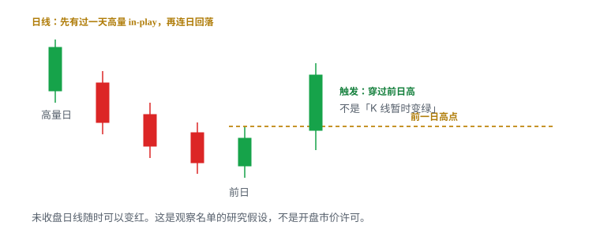

# 5.8 First Green Day

> 一句话：这是研究假设，不是已验证策略。触发是突破前一日高点并被接受，不是 K 线暂时变绿。

讲师在视频开头明确说，这个形态当时仍在研究，条件「只是暂时的，以后可能修改」。本书按这个级别收录：把可观察结构写全，把数字标成启发式，把解释和事实分开，**不当成可直接下单的 setup**。三个成功或失败案例不能把临时参数变成成熟优势。

最有价值的是「持续跟踪过去的 in-play 股票，并在日线状态首次改善时观察」。最需要警惕的是开盘第一分钟因为名字好听而市价。名字好听，不等于已经有失效位、空间和可成交规模。

First Green Day 提供的是**选股语境和日线位置**，不是市价许可。盘中若真要做，仍然用本卷前面已经写过的触发：旗形、贴顶、ABCD、突破后回踩、红翻绿、横盘上沿。本章不发明第五种突破。

## 5.8.1 这一章的级别：研究假设，不是下单卡

多数做多结构可以写成「形状 + 位置 + 触发 + 失效」。First Green Day 还差一步：课程自己没有声称这些条件已经过统计检验。它当时是讲师从少量个人案例里抽出来的候选规则。候选规则的正确用法是：写成可复现的样本定义，收集包括失败和未触发在内的全部窗口，再决定留不留。错误用法是：把三张漂亮图背下来，开盘对着旧明星市价。

「研究假设」在本书里有具体含义：

- 可以进观察名单和日志；
- 可以写成扫描条件和研究规格；
- 不可以单独决定仓位；
- 不可以用它覆盖本卷已经写死的失效规则；
- 不可以用它把一笔追价事后改名为「其实符合 First Green Day」。

附录 C 的策略卡默认假设你已经有当日名单和 1R 上限。本章不配那种卡。若你以后自己跑出样本外正期望，再另写一张，并给它独立的 `strategy_version`。在那之前，这一章的输出只有观察清单和研究记录。

课程录制于异常活跃的 2020–2021。热市里「旧明星隔几天再动一次」出现得更勤；冷市里同样名字可能连续两周没有可执行量。按市场状态分组，不要把热市里的三张图外推成全年规则。

## 5.8.2 定义：观察什么

一只股票曾经是高成交量的 in-play 股票，随后连续数日回落或横盘。课程寻找它第一次突破前一日高点、日线重新形成绿色 K 线的那一天。



可观察的结构，而不是故事：

1. 这只股票曾经有过一天真正 in-play（高量、大波动）；
2. 之后连续数日回落或横盘，不再是每天的明星；
3. 某天它**突破前一交易日高点**，日线看起来重新转强。

左下简图表示首次大涨后连续红日，之后出现第一根向上的日线。多日图上，上方阻力是潜在退出区，下降斜线只是帮助观察下降趋势，不是触发。斜线可以被不同锚点画成完全不同的角度；不要把「跌破下降趋势线」偷偷换成真正的触发。

「曾经 in-play」必须事先写死，否则任何涨过的股票都能事后挤进样本。最小要固定：那一天的涨幅下限、成交量或相对量下限、价格区间、是否允许盘前盘后量并进日线。写得越松，样本越脏；写得越紧，越容易只剩下你已经记得的成功图。两种偏差都要防。

「连续数日回落或横盘」也要有边界。两根红日、十根红日、先红再横盘三天，是不是同一个桶，必须事先声明。课程口语里的「随后几天」不是统计口径。

| | 研究规格（不是下单卡） |
|---|---|
| 语境 | 曾经有过高量 in-play 日，随后数日回落或横盘，中间没有新消息提前 gap up |
| 触发 | 常规时段突破前一交易日高点并被接受；盘中突破与收盘确认是两个版本 |
| 失效 | 突破后立刻跌回前日高下方并被接受；或你为盘中结构另写的旗面 / 回踩低点 |
| 常见失败 | 日线暂时变绿又收红；扫描器在大绿 K 后才报警导致追价；累计量不够、点差太宽不可执行 |
| 不做 | 把它当开盘市价许可；由累计 1 亿股推断空头还没回补 |

这一张表是研究用的骨架。它告诉你事后该记什么，不告诉你现在该买多少股。

## 5.8.3 未收盘的日线还在变

日线是一根到 16:00 才收盘的大周期 K。当前这根的 Open 在 09:30 附近就定了（是否并进盘前，先核平台），High、Low、Close 却会一直改到常规时段结束。开盘后二十分钟日线变绿，只说明「此刻收盘价高于开盘价」。它不说明：

- 今天一定收绿；
- 前一日高点已经被接受；
- 你现在的买入离失效位足够近；
- 后半天不会把这根日线重新画成带长上影的阴线。

卷二已经写过：未收盘的 K 线还在变。把那句话放到日线上，后果更大。一根 1 分钟假突破最多浪费几分钟注意力；把未完成日线的绿色当成「First Green Day 已经确认」，会让你在离开失效位很远的地方还觉得自己站在正确的一边。

颜色本身也不可靠。绿色通常是收盘高于开盘，红色相反——**颜色可被平台改掉**。有的软件用空心 / 实心，有的把盘前并进日线后，开盘价已经不是 09:30 第一笔。研究规格里应写「相对昨收」还是「相对今日开盘」，不要写「日线变绿」四个字就结束。

更干净的说法是两件分开的事：

```
日线颜色 = 今天收盘相对今天开盘（或你写死的另一种口径）
触发事件 = 价格穿过前一交易日高点并被接受
```

课程口语把它们捆在一起，是因为「第一次转绿」好记。研究时必须拆开。一只股票可以突破前日高却仍收阴（长上影）；也可以收阳却从未真正站上前日高（低开后弱反弹）。两种都不是同一句话。

复盘时把画面停在你声称的入场时刻。当时日线还没走完。用收盘后的大绿实体回放「早上显而易见」，是卷二禁止的事后偏差。

## 5.8.4 触发是前日高被接受

真正触发是「突破前一日高点并被接受」，不是「K 线暂时变绿」。接受的最小样子和本卷突破章相同：实体站上，随后的回落不把线还回去。一根长上影插过前日高又收回来，是试探，不是接受。

前一日高点是已经收盘的事实。它比「今天这根日线现在是绿的」稳定。盘前可以画好，开盘后不必改锚点。这是它作为研究触发的主要优点。缺点也明显：前日高可能离当前价很远，也可能离下一层日线阻力很近。位置清楚，不等于盈亏比合格。

「被接受」必须写死一种操作定义，例如：

- 常规时段至少一根已收盘 5 分钟 K 的实体完全站在前日高上方；或
- 突破后回落不回到前日高下方，并形成更高低点；或
- 收盘确认：当日收盘价高于前日高。

三种定义会得到三套样本。不要盘中临时换。触价穿过、5 分钟收盘确认、日线收盘确认，进场越晚通常离失效越远，滑点和盈亏比也一起变。分开记账，不要把「早买的赢家」和「收盘确认才进的输家」拼成一个胜率。

失效同样要事前写。研究日线假设时，一种写法是：突破后价格重新被前日高下方接受。若你实际做的是盘中旗形，失效就应是旗面低点，而不是事后改口用更远的日线低点「再给一次」。日线语境和盘中结构可以同时存在，但一笔交易只能有一个失效。

## 5.8.5 课程的四个候选条件（启发式，来自少量个人案例）

1. Float 约 **300 万–5,000 万股**；
2. 之前有一次明显 in-play 的高量日；
3. 高量日至 First Green Day 之间累计成交量约超过 **1 亿股**；
4. 中间没有新消息导致提前 gap up。

这四条要整组保留，也要整组降级。它们是讲师当时的候选过滤，不是行业定义，不是物理学，没有被视频证明具有统计显著性。改其中一条就是新版本。把区间改成 200 万–8,000 万、把 1 亿改成 8,000 万、允许中间有小 gap，都会得到另一套股票。不要一边改数字，一边沿用旧名字的记忆胜率。

第一条 float 窗口比课程其它地方常用的「约 100 万–1,500 万」更宽。这本身就说明：不同课、不同年份、不同口语，讲师给出的候选范围并不统一。本书一律标成启发式。扫描阶段可以用它缩小名单；决定较大仓位前，回到最新文件核对口径，见 5.8.19。

第二条「明显 in-play 的高量日」是整组里最接近可观察事实的一条。没有这一天，后面的「回潮」没有参照物。仍需防止事后挑选：你记得那根大绿日，是因为后来又涨了一次。正确做法是先按涨幅和量的阈值生成高量日列表，再问后续有没有出现候选日，而不是从候选日往回找一根好看的旗杆。

第三条是最容易被误用的数字，下一节单独拆。

第四条保住「第一次」。它不是「完全没有新闻」——小盘每天都可能有无关 8-K。它说的是：中间没有一次新催化已经把价格大幅抬离原来的回落结构。一旦发生过，后面的绿日更像新事件，不像旧明星回潮。

四条同时满足，仍然只说明「更像课程当时想研究的那种股票」。它不提高你此刻市价买入的胜率。过滤条件和触发条件不是同一层。

## 5.8.6 累计 1 亿股必须换成换手率

「高量日至 First Green Day 之间累计成交量约超过 1 亿股」没有按流通盘归一化。对 300 万股与 5,000 万股 float，同一句「过了 1 亿」的含义完全不同。

教学用整数，不是某只股票：

```
累计换手率 ≈ 区间累计成交量 ÷ 可交易流通盘
```

| Float | 区间累计成交 | 约合换手 |
|---|---|---|
| 300 万股 | 1 亿股 | ≈ 33 倍 |
| 1,000 万股 | 1 亿股 | ≈ 10 倍 |
| 5,000 万股 | 1 亿股 | ≈ 2 倍 |
| 5,000 万股 | 3,000 万股 | ≈ 0.6 倍 |

第一行和第三行都「过了 1 亿股」，筹码被转手的次数差一个数量级。第四行没过课程阈值，却可能比第三行更「拥挤」——如果你真正关心的是换手而不是绝对股数。把绝对阈值写进扫描器，等于按 float 给样本做一次隐形加权：大 float 更容易达标，小 float 更难，或者反过来，取决于你怎么截窗口。

研究时同时保留两个字段：

- 原始累计成交量（对照课程口径）；
- 累计换手率（跨 float 可比较）。

窗口怎么切也要写死。从高量日当天算起，还是从次日算起？是否包含盘前盘后？高量日当天那根已经巨大的量，算不算进「之后的累计」？三种切法数字可以差出一倍。不要今天用一种、复盘时换成另一种，好让样本刚好过线。

即使换手率算对了，它仍然只是供给被买卖过多少次的粗度量。它不是剩余空头、不是锁定筹码、不是「还会再涨一轮」的库存。下一节把这件事说死。

## 5.8.7 换手率仍然证明不了空头回补

视频推测：首次高量日后，买盘减少、价格多日回落，空头逐步建立仓位；当股票不再创新低并突破前一日高点，一部分空头止损回补，形成连锁上涨。

这个解释可以用来**提出问题**。它不能从日线图上读出来，也不能从换手率反推出来。图表本身不能证明：

- 横盘里究竟有多少净空头；
- 当天买盘中多少来自回补；
- 历史 short interest 是否仍然有效；
- 新增多头、做市活动与期权对冲各贡献多少。

换手 10 倍，可能是同一批日内客来回做了十轮，账户净方向几乎没变。也可能是老多头已经走完，新投机客换手进来。也可能中间夹着一次登记转售，名义 float 已经不是你分母里的那个数。这些路径在日线上都可以长得很像「缩量回落后再放量转绿」。

Short interest 报告有滞后。公布日、结算日、报告周期和你的候选日通常对不齐。数据商用的分母还可能是 outstanding 而不是 float。即便数字「很高」，也不知道这些空头的成本区在哪、有没有已经在回落段覆盖了一部分、会不会在你买入之后继续加空。卷一已经拒绝过一句口语：「这只股票空头太多，所以一定会涨。」本章把同一句再拒绝一次，只是分母换成了累计成交。

可观察事实应写成：

> 价格停止创新低、形成更高低点、突破前日高点且量能增加。

Squeeze 依然不能从 K 线上直接读出来。能写进日志的只有上面那句，外加：有没有新文件、点差能不能进出、到下一层日线阻力还有多少空间。机制假说可以放在备注栏，前面加「推测：」。统计期望值时，备注栏不参与分组。

5.6 红翻绿、5.7 横盘挤压和本章共用同一个禁令：故事可以写，触发必须来自价格接受。三章的位置不同——前收盘、箱体上沿、前日高——不要因为都听说过「空头回补」就合成一个胜率。

## 5.8.8 「第一次」被新消息毁掉

第四条候选条件单独拿出来，是因为它决定样本还算不算同一句话。如果高量日之后、候选日之前，已经出现一次足以让价格大幅高开的新公告，日线转绿可能只是新催化。课程想研究的是旧明星在没有新燃料时会不会回潮。两件事可以都赚钱，但不是同一个假设。

应单独记录、并默认另开桶的事件包括：

- 新的公司新闻稿或 8-K（合同、临床、监管、人事）；
- 融资、ATM、PIPE、登记转售；
- 反向拆股、正向拆股、代码变更；
- 交易所合规或退市风险通知；
- 与公司规模相比足够大的分析师或行业事件——仍要回到原文，不靠标题。

「没有新消息」本身也要定义。完全没有 EDGAR 更新的小盘很少。实用写法是：没有足以解释当日 gap 或把价格送出原回落通道的新催化。一条例行的董事任命和一次定价增发，不能算同一级。卷一的信息源梯子在这里照旧：标题聚合器只负责提醒你去打开原文。

中间已经 gap up 过一次，还把它算进「第一次转绿」，会把 Gap and Go 和新催化动量偷渡进本章。5.9 会写开盘缺口。本章若允许缺口，必须事先声明「允许何种大小的缺口」，并单独统计。默认版本是：中间没有新消息导致的提前 gap up。

反向拆股会同时毁掉价格、成交量和 float 口径。拆股前后的累计成交不能直接相加。遇到公司行动，先停手重画，再决定这个窗口还要不要留在样本里。

## 5.8.9 盘前越过 vs 常规时段

盘前曾短暂越过高点但量能低时，课程仍以常规时段的高点和成交为主要参考。这也是一条待验证的选择，不是定律。

它有理由。盘前点差更宽、深度更薄、打印更稀疏。几千股打出来的「越过前日高」，和常规时段十万股站上，不是同一句话。日线 OHLC 在许多平台默认只含 09:30–16:00；盘前极值可能根本不进日线高点。若你的研究触发写的是「日线高点超过昨日高点」，盘前那一刺在有的数据源里等于没发生。

它也有代价。真正的供给和需求有时从 04:00 就开始定价。忽略盘前，会把已经反应过的股票当成「今天才第一次转强」。正确做法不是选边站队，而是写死口径：

```
前日高 = 上一常规时段 High（是否含盘前盘后，写死）
今日是否触发 = 仅常规时段 / 仅盘前 / 任一扩展时段（三选一）
盘前越过但常规时段未接受 = 单独标记，不计入默认触发
```

VYGR 那一类「盘前刺过、常规时段再给一次」的图，应进「盘前已试探」子桶。不要和「当天第一次见到前日高」混在一起。第一次试探失败后的第二次，和干净的第一次，期望值不必相同。

开盘直接远离前日高、所有近端失效都在几美元外，不是 First Green Day，是追。名字再符合，仓位公式也会把股数砍到接近零。这时正确动作是：继续观察能否形成新的盘中旗面，而不是因为日线已经变绿就去补市价。

## 5.8.10 日线位置不是盘中触发

First Green Day 不产生第五种突破。日线语境成立之后，盘中仍是已经写过的结构：

| 你看到的 | 实际用的盘中结构 | 见 |
|---|---|---|
| 接近并穿过前日高 | 水平位突破，要接受 | 5.1 |
| 突破后短暂整理 | 旗形 / 贴顶 / 第一次回撤 | 5.1、5.2 |
| 冲高回踩前日高 | 突破后回踩 | 5.4 |
| 开盘先弱后收复 | 红翻绿（若昨收恰好重要） | 5.6 |
| 横盘数日后再破上沿 | 箱体上沿被接受 | 5.7 |
| 开盘直接远离所有失效 | 追，不是 First Green Day | 5.9 |

「日线转绿」最多把一只旧名字重新放回今天的注意力列表。它不告诉你用 1 分钟还是 5 分钟、预判还是回踩、止损放在哪一根 K 的低点。这些仍然要按盘中结构写。若盘中没有近的失效，日线再漂亮，仓位也是 0。

周期冲突时不许事后改口。一种启发式分工：

```
语境周期 = 日线
setup 周期 = 5 分钟
执行周期 = 1 分钟
失效周期 = 5 分钟
```

用 1 分钟入场、却按日线低点当止损，股数会大到单笔风险不再是你以为的 1R。止损更宽，股数必须更小。这不是 First Green Day 的特例，是卷四仓位公式。

不要在开盘第一分钟因为名字好听而市价。不要把未收盘日线的绿色当成已经确认。不要用「累计 1 亿股所以空头还没回补」决定仓位。这三句是本章的执行禁令，比任何候选阈值都硬。

## 5.8.11 若把它写成研究规格

不要直接采用视频阈值。先建立样本定义：

1. 明确首次 in-play 日的最小涨幅、成交量与价格范围；
2. 明确 First Green Day 是盘中突破还是收盘确认——两种定义会得到两套完全不同的样本；
3. 将累计成交量按 float 归一化，报告换手率，同时保留原始成交量以便对照课程口径；
4. 记录有无新公告、融资、反向拆股与退市风险；
5. 使用包含点差、滑点和无成交的回测，不只看收盘价；
6. 保留所有失败、未触发和不可交易样本；
7. 在样本外时间段验证参数，不根据少数成功图反复调阈值。

第 1 条决定分母从哪天开始。没有高量日定义，就没有「之后的累计成交」。第 2 条决定你到底在测哪一种可交易性：盘中能不能做，还是收盘后隔夜值不值得看。本章默认讨论日内；若有人把它做成隔夜，跳空、盘后流动性和保证金变化全部要另算，那是另一份计划。

第 5 条是小盘研究最容易偷懒的地方。用日线收盘价回测「突破前日高」，等于假设你在收盘价附近可以任意规模成交。真实路径往往是：突破当时点差 0.08，可见深度只有你计划股数的三分之一，随后一根影线把图上的 2R 吐完。回测必须能表达「这分钟买不到」和「这分钟买得到但均价更差」。

第 6 条决定研究诚不诚实。只保存后来大涨的图，任何规则都能被「验证」。未触发的窗口——名单在、前日高没破——要留下，否则命中率没有分母。不可交易的窗口也要留下，见 5.8.16。

第 7 条是防过拟合。三个案例可以启发你写下第一条规则，不能用来同时发现规则、校准阈值、证明有效。样本外时间段、另一类市况、另一家券商的点差，才有资格说「可能不是巧合」。

最小研究记录：

```
首次 in-play 日的定义版本:
float 口径与来源:
高量日到候选日的累计成交 / 换手:
中间是否有新催化或 gap up:
前日高:
盘中是否接受 / 仅收盘变绿:
点差与可成交规模:
到下一层日线阻力的距离:
失效价与计划 R:
观察窗口内是否根本没突破:
strategy_version:
```

`strategy_version` 必须在改阈值的当天就换。事后给赢家贴新版本、给输家留旧版本，是另一形式的作弊。

## 5.8.12 样本桶怎么切

同一只股票、同一个「看起来转绿」的日子，至少要先切成这些不是同一 setup 的桶。混在一个胜率里，后面无法回答「到底哪一句在工作」。

按触发定义：

- 盘中 5 分钟接受前日高；
- 盘中 1 分钟触价穿过；
- 仅收盘高于前日高；
- 仅日线收阳、从未站上前日高（这桶用来证明「变绿」不是触发）。

按路径：

- 回落段持续创新低，直到候选日才抬高；
- 回落段已经走出更高低点，候选日只是破前高；
- 中间横盘多日，前高接近、低点抬高（更像多日贴顶）；
- 中间已经有过一次失败的前日高试探。

按可执行性：

- 当时点差和深度允许计划股数进出；
- 方向对但不可交易；
- 观察窗口内未触发。

按催化：

- 窗口内无新催化；
- 有例行文件、无价格反应；
- 有新催化或 gap up（默认排除，另桶保存）。

按市况：

- 热市小盘活跃周；
- 冷市、全市场成交萎缩。

切完你会发现：课程口头上的「First Green Day」其实是好几句话。这是好事。研究的工作就是把口语拆开，而不是发明一个更响的总名称把它们再粘回去。

## 5.8.13 课程里的 PALT 案例怎么读

PALT 是课程用来展示「回落之后第一次转强」的例子，不是已经验证的模板。不要去背那一天的价格，要看讲师当时让你看的结构。

多日图上：首次高量日之后，价格总体下降，后几日量能明显缩小。临近 setup 时，低点不再持续下移，并接近前一日高点。上方黄色阻力是潜在退出区；入场前必须确认到它仍有足够利润空间。

这三句里，只有结构是可迁移的：

- 高量日提供参照；
- 之后量缩、价格回落或走平；
- 低点停止下移；
- 价格靠近一个事先画好的前日高；
- 再往上数一层历史供给，问空间还够不够。

黄色那一层在原课截图里是具体价。书里不复制截图，也不假装记得精确价位。你自己做研究时，退出区应在入场前画好：最近的横盘、缺口边、整美元或长期均线。入场后再找「其实还有更高的目标」，是用还没发生的利润为已经变差的盈亏比辩护。

把这个案例放进样本时，停在入场前问：

- 当时前日高是否已经画好？
- 突破是否已被接受，还是只有未收盘日线变绿？
- 目标区到入场是否仍 ≥ 计划风险？
- 如果当天没有后来那根大绿 K，入场理由还在不在？
- 你记的是穿越前日高，还是突破后的第一次回撤？

最后一问最容易被漂亮图带偏。大绿 K 出现之后，任何更早的价都看起来是「好买点」。研究要回答的是：按事前规则，那一刻该不该在场。

## 5.8.14 PALT 计划是研究计划，不是规则

课程对 PALT 的计划是：

1. 在接近并突破前一日 high 时寻找入场；
2. 若突破后短暂整理，可等第一次 pullback；
3. 下一个历史 consolidation 区约为目标；
4. 也可以在整美元提前分批止盈。

这是当时的研究计划，不是已验证规则。四步其实已经拆成至少两笔不同的交易：第 1 步是水平位穿越，第 2 步是突破后回踩。本卷 5.1 和 5.4 要求它们分开统计。不能因为都发生在「First Green Day」这一天，就合成一个胜率。

第 3 步的目标是位置，不是承诺。历史横盘区可能已经因复权、增发或时间失效而变弱；也可能仍然堆着被套供给。价格到达那里之后怎么反应，才是事实。第 4 步的整美元是心理关口，见卷二。它和后面动量语境、反转语境里的整美元不是同一假设：这里只是「旧回潮股上的预先供给」，用来提前减仓，不是单独的优势来源。

大绿 K 说明触发后出现真实成交扩张，但不能拿它反证任何提前买入都合理。若扫描器在大绿 K 后才报警，追入时离失效位更远，盈亏比已经变化。课程因此强调要从过去的观察名单主动跟踪，而不是只等动量扫描器。这句话是 PALT 段真正要留下的执行含义，比那四步计划更重要。

扫描器滞后不是软件骂名，是结构问题。动量扫描看的是「此刻已经在动」。First Green Day 的假设是「过去动过、现在才刚要再动」。等它出现在涨幅榜上，你看到的往往已经是扩张段中部。名单跟踪和扫描器报警，是两种完全不同的注意力分配。

## 5.8.15 课程里的 VYGR 案例怎么读

VYGR 用来对照另一种节奏：不是瞬间拉升，而是多日结构抬高后再破。

前两日高点接近，低点逐步抬高，为突破提供了可见的局部结构。把它单独拿出来看，它很像一张更慢的多日贴顶：平的上沿、抬高的低点。First Green Day 的日线标签，没有取消 5.2 对贴顶的要求——只满足「高点接近」、低点没有抬高的，仍是反复冲高失败，不是该买的形状。

盘前曾短暂越过高点但量能低，课程仍以常规时段的高点和成交为主要参考。第一根突破后等待 pullback，可把止损放得更接近结构失效位。这又是穿越和回踩两笔账。回踩没给，不等于穿越那一笔「其实也该等到回踩才算」——那是用后知后觉改规则。

价格随后缓慢上涨而不是瞬间 squeeze，说明 float 与流动性会影响节奏。日线 EMA200 和过去的横盘区都是上方供给候选。均线在这里是位置，不是触发。价格从下方接近 200 EMA，把它当潜在供给，和 5.12 反转课里「从上方回到 200 EMA 找承接」是相反的假设。同一根均线，方向取决于你从哪一侧靠近。

最终收在目标附近，不证明能够事前持有到收盘。退出应服从计划和实时量价。用收盘价当离场，是另一种事后最优：盘中可能已经先碰到目标又吐回，也可能点差在最后一小时拉宽到无法按图上的价出来。研究若声称「持有到目标」，必须说明是触价减仓、收盘减仓，还是盘中结构破坏就走。

这个案例提醒两件事。第一，First Green Day 的日线位置，仍然要落到盘中的旗形或回踩才能有近的失效。第二，节奏慢的股票，用开盘动量的仓位和滑点假设会错配。开盘 gapper 那一套「几分钟决定仓位」的肌肉记忆，套到全天爬行的回潮股上，会让你要么嫌它慢而追下一只，要么中途把止损收到噪声里。

## 5.8.16 低量「失败」：策略失败 vs 不可交易

视频最后展示一个累计量未达到课程阈值的案例。价格确有反弹，但每根 5 分钟成交量很小、点差较宽，难以用较大仓位执行。

这里应把「策略失败」和「不可交易」分开：

- 方向可能上涨；
- 但流动性不足会使入场、加仓和退出质量很差；
- 回测只看收盘价会漏掉真实执行成本；
- 没有成交容量的理论利润不是可实现利润。

策略失败：按你的定义触发了，也进出得了，结果亏了，或没走到目标。它打击的是期望值。

不可交易：结构看起来像，当时的点差、深度或停牌风险不允许按计划股数进出。它打击的是容量。方向对、账户却摸不到那笔利润，不应记成策略胜利。

若你的研究把这类样本删掉，胜率会被人为抬高，因为你只留下「当时就能进出」的幸存者。正确做法是：标成不可交易，计入命中率的分母，不计入可执行期望值的分子。两套数字都要报告：

```
识别率 = 窗口内出现候选结构的次数 / 观察窗口数
可执行率 = 当时能按计划进出的次数 / 候选结构次数
可执行期望值 = 仅在可执行子集上、扣除点差滑点后的平均 R
```

只汇报第三行，读者会以为你找到了优势。其实你可能只是在流动性足够的日子里碰巧没亏。只汇报第一行，又会把买不到的上涨算进策略。三行一起看，才知道这句话有没有交易价值。

低量反弹还有一个教学功能：它说明「累计量阈值」在课程里至少部分是在过滤可执行性，而不只是在过滤方向。即便如此，也不要反过来迷信 1 亿股。过了绝对阈值的大 float 股票，照样可以在你下单的那五分钟里深度消失。可执行性只能当时量，不能用三天前的累计成交代替。

## 5.8.17 数字例：同一条前日高，三种完全不同的账

教学用整数，不是 PALT、VYGR 或任何真实行情。假设：

```
前日高 = 6.20
今日开盘 = 5.95
回落段低点已经抬到 5.80
上方历史横盘 = 6.70
整美元 = 6.50
当前点差 = 0.03
单笔可亏 = 50 美元
```

**A. 穿越前日高。** 6.22 出现已收盘 5 分钟实体接受。失效若画在最近更高低点 5.80 再留 0.05 滑点 = 5.75，每股风险 0.47，最多约 106 股。到 6.50 只有 0.28，不到 1R；到 6.70 是 0.48，约 1R。空间勉强。若你觉得 5.80 太远，应改等回踩，而不是把止损捏到 6.10 却仍按「日线结构」讲故事——6.10 已经不是这个假设的失效。

**B. 突破后回踩。** 6.40 冲过之后回到 6.22–6.25 再抬高。失效可以收到回踩低 6.18 + 滑点 0.04 = 6.14。入场 6.28 则每股风险 0.14，股数才能上去。这是 5.4 的交易，只是位置碰巧在前日高。它不再需要「日线第一次变绿」来辩护。若回踩被 6.20 下方接受，按失败突破走，不要改口说「更深的 First Green Day 回踩更好」。

**C. 开盘已在 6.55，日线已经是大绿。** 前日高远在下方，近端失效没有。这不是 A，也不是 B。扫描器此时可能刚刚报警。若你在 6.58 市价，止损只能乱放：放回 6.20 则每股 0.38 还不算滑点，空间到 6.70 只剩 0.12；放到 6.40 则那根线是你事后找的。正确动作是放弃，或等新的旗面。日线绿得越漂亮，越要防这种情况。

三笔账的前日高都是 6.20。日志必须用三个名字。把 C 的亏损记成「First Green Day 失败」，会污染 A 的研究。

再算一遍换手，避免 1 亿股的错觉。若 float 记为 800 万，高量日到今天累计成交 9,600 万，换手约 12 倍，课程绝对阈值没过；float 记为 2,500 万、累计 1.1 亿，换手约 4.4 倍，阈值过了。哪一只更「拥挤」，绝对股数和换手率会给出相反答案。研究记录必须两行都写。

## 5.8.18 主动跟踪旧名单，不要等扫描器

课程反复落到同一句执行含义：这个想法的工作方式，是持续跟踪过去的 in-play 股票，而不是开盘后等动量扫描器给你新名字。扫描器是卷一的漏斗顶，负责回答「今天谁已经异常」。First Green Day 问的是「昨天之前异常过、今天才刚要改善的是谁」。两个问题的时间点不同。

实用的观察流程可以写成：

1. 高量日当天，就把代码放进「旧明星」名单，记下那一天的高点、低点、成交量、float 口径和催化；
2. 之后每个交易日开盘前，看它是否还在回落或横盘、中间有没有新文件、前日高在哪、到上一层供给有多远；
3. 只有靠近前日高、低点不再下移、点差仍可执行时，才升到当日重点；
4. 升到重点之后，仍然等盘中结构，不在 09:30:01 市价；
5. 连续多日没有接近、或中间已经因新消息 gap up，就降级或移到另一桶。

名单不是越多越好。二十只旧明星会把开盘注意力撕碎。宁可少，把每只的前日高和上一层阻力画好。错过名单外的回潮，是漏斗的设计，不是失败。

扫描器仍可当辅助：例如「价格距离昨日高点 3% 以内」这类接近提醒。提醒之后打开图和盘口，不在颜色高亮上下单。同一只股票同时出现在涨幅榜、新高榜和相对量榜上，仍是同一个事件的三个字段。

主动跟踪的代价是机会成本。你会连续多天看着一只不再动的旧名字。这正是研究该付的学费。若你做不到「连续观察却连续不交易」，First Green Day 对你不是研究题目，是 FOMO 发生器。那种情况应直接从当日流程里删掉这一类，而不是靠「再加一个过滤」欺骗自己。

## 5.8.19 Float 口径、增发与反向拆股

四条候选条件的第一条和第三条都踩在 float 上。Float 数据本身常过期。第三方可能把 outstanding 当成 float，没计入增发、权证或反向拆股。用这个窗口筛名单时，先核对口径。

卷一的三个词这里再用不混：

- **Shares outstanding**：已发行、在外的股份，含内部人；
- **Public float**：通常排除受限持股后公众可交易的部分；
- **实际盘中供给**：此刻愿意在附近成交的数量，远小于名义 float。

扫描阶段可以使用近似值。决定把某只股票留在重点名单、或用换手率做硬过滤之前，回到最新定期报告、8-K 和公司行动。把 float 写成区间，比假装精确到一股更诚实。例如写「第三方约 8–12M，10-Q 期末 outstanding 为 X，近期有 ATM，按 fully diluted 可能更高」，比写「float = 8,234,000」更接近事实。

反向拆股之后，扫描器上的历史量和流通盘可能暂时没改。累计成交若跨过拆股日，必须先按同一股本口径换算，再谈过没过 1 亿、换手是多少。拆股前的 1 亿股和拆股后的 1 亿股，不是同一个库存概念。

权证行权、可转债转换、登记转售生效，会在你还用旧分母算换手的时候，把真实供给突然放大。价格在前日高附近走弱，不一定是「First Green Day 失败」，可能是文件已经改了股票的数量。技术 setup 碰到股本事件，先停，再决定还是不是原来那句话。

低 float 不是天赋。窗口落在 300 万–5,000 万，只说明课程当时想避开极大盘和极微型的两端。两端照样可以出现「高量日后回落再转绿」的图形，只是执行特征和你的账户未必匹配。不要因为一只股票 float「不符合窗口」就认为图形非法，也不要因为符合窗口就认为图形可交易。

## 5.8.20 上方空间与整美元

回潮股的上方通常不是蓝天。它之所以成为旧明星，正因为左侧有过一轮大涨；那一轮留下的横盘、缺口和被套成交，就是今天的供给。入场前先数最近一层，再数下一层。第一层不够 1R，穿越往往不值得做；回踩把止损收近之后，才可能重新合格。

整美元在这类股票上经常和历史横盘重合。6.00、7.00 可能既是心理关口，也是当初派发的位置。预先写好：到关口减多少、没过怎么处理、过了是持有还是改成新的旗形。不要到了关口才决定「这次一定会过，因为空头还没回补完」。

日线 EMA、下降斜线、前高，都只是供给候选。候选的意思是：价格到了要看反应，不是到了必须卖，也不是到了必须加。测量目标（例如回落段的某个百分比回撤）可以画在图上当参考，不能当持有许可。本章没有给出任何已被验证的目标公式，课程也没有。

空间检查还要含当日 LULD 上轨和可能的停牌。回潮若突然变成新一轮抛物线，下一事件可能是 halt 而不是平滑走到你的黄色阻力。仓位仍按失效距离算；尾部按停牌跳空压测。压测过不去，股数是 0。日线假设不能豁免卷三的停牌算术。

## 5.8.21 实盘观察清单（研究用，不是下单许可）

开盘前：

- 这只股票的首次 in-play 日是哪一天，定义版本是哪一个；
- 高量日到今天的累计成交和累计换手；
- float 口径与来源，最近有没有增发或拆股；
- 中间有没有已经 gap up 过一次，导致「第一次」名不副实；
- 前一日高点画在哪，是否只含常规时段；
- 到下一层日线阻力还有多少空间，折合几 R；
- 有没有新 SEC 文件或公司公告改变原先技术 setup。

靠近前日高时：

- 最近几日是否停止创新低，是否出现更高低点；
- 今日成交量是否相对前几日扩张，还是只有日线颜色在变；
- 点差是否允许按计划股数进出；
- 你用的是盘中接受，还是打算等收盘确认；
- 若突破后立刻跌回，失效价和最大亏损是多少；
- 盘中实际结构是穿越、回踩还是还没有结构。

突破之后：

- 接受发生了没有，还是只有影线；
- 扫描器是不是此刻才报警，你是否已经变成追价；
- 第一目标是否仍在，整美元要不要先减；
- 未收盘日线变红时，你的盘中失效有没有先被打到——日线颜色不覆盖盘中计划。

清单上每一项都可以让你把代码留在观察栏。观察栏不是懦弱，是本章唯一诚实的默认仓位。

## 5.8.22 日志字段

卷四的通用字段这里都要。另外固定加这些，否则事后无法复原你当时在研究哪一句话：

```
fgd_version:
inplay_date:
inplay_rule:
float_source:
float_range:
cum_volume:
cum_turnover:
new_catalyst: yes/no/unclear
interim_gap_up: yes/no
prior_day_high:
session_definition: regular / include_extended
trigger_type: none / wick / 5m_accept / 1m_touch / close_above
intraday_structure: flag / flattop / retest / none / chase
spread_at_decision:
depth_vs_size:
next_daily_supply:
room_in_R:
untradeable: yes/no
never_triggered: yes/no
daily_bar_unfinished_at_entry: yes/no
cover_story_in_notes: speculation_only
```

`never_triggered` 和 `untradeable` 不要留空。空着的时候，人会在复盘时按结果回填。`daily_bar_unfinished_at_entry` 用来强迫你承认：入场时日线颜色还不是事实。`cover_story_in_notes` 若写了 squeeze 或回补，必须同时能指出当时可见的价格事实；不能指出，就把那一行删掉。

错过的回潮单独进 `MissedTrades`。不要把「我看着没买、后来涨了」和真实盈亏混在一张期望值表里。也不要因为错过就在下一只旧明星上提前市价——那是用新的违约补偿旧的后悔。

分组统计至少按 `fgd_version`、`trigger_type`、`intraday_structure`、`untradeable` 切开。全样本一个胜率没有解释力。

## 5.8.23 若研究结论是「没有优势」

这是允许的、甚至是这一章最诚实的结局。停止条件与卷四相同：样本外期望值转负、执行不上、尾部不可承受。不要为了保住一个好听的名字，把过滤条件越改越窄，直到只剩下三张成功图。

可能的诚实结论包括：

- 日线结构识别得出，但盘中可执行样本太少，容量为零；
- 热市里有过一段正期望，冷市里消失；
- 只有回踩子集还看一看，穿越子集扣除滑点后为负；
- 全部子集都不值得占用开盘注意力。

无论哪一种，处理方式都一样：写下结论、冻结该 `fgd_version`、停止用它下单。观察名单上的旧明星可以继续当普通股票看——它们仍可能走出旗形或红翻绿，只是不再因为「First Green Day」多拿一份仓位许可。

把「没有优势」写成研究产出，比把三张图写成策略更接近原课的实际位置。讲师当时说条件以后可能修改。修改的一种合法结果，就是整组放弃。

## 先记住这些

- 讲师自己标明仍在研究。本书按研究假设收录。
- 四个数字条件是少量案例的启发式；1 亿股必须换成换手率才有比较意义。
- 触发是前日高被接受，不是日线暂时变绿。未收盘日线随时可以变红。
- 图表证明不了 squeeze。能写进日志的只有停止创新低、更高低点、突破前日高、量能是否增加。
- 盘中仍用前面各章的触发。主动跟踪旧名单，比等扫描器报警更接近原课意图。
- 「不可交易」和「策略失败」分开记。没有成交容量的理论利润不是可实现利润。
- 研究结论可以是没有优势。那也是完整答案。

## 不要做的事

- 用三个案例把临时参数当成成熟优势。
- 开盘第一分钟因名字市价。
- 由换手率推断还剩多少空头。
- 把不可交易的上涨样本删掉以提高胜率。
- 中间已经因新消息 gap up，还把它算进「第一次转绿」。
- 拿未收盘日线的绿色覆盖盘中失效。
- 扫描器在大绿 K 后才报警时追价，还记成同一条 First Green Day。
- 为了保住名字把过滤越改越窄，直到只剩成功图。
