# 5.9 Gap and Go

> 一句话：高开百分比不是信号。Gap and Go 是盘前标好的位置，加上开盘前后被接受的触发。开盘已远离所有失效位，叫追，不叫 Gap and Go。

开盘前后是点差最宽、停牌最多、计划最容易被情绪冲掉的一段时间。能做的前提是：名单在开盘前就定了，关键价已经画上，单笔和单日亏损已经写死。课程把这件事叫 Gap and Go，容易被听成「看到高开就追」。正文不是这个意思。它是先筛选有催化剂、成交活跃且结构清楚的标的，再从开盘前后形成的关键价位里选低风险触发点。

课程把入口拆成七种。它们共享同一条链，名字不同只是参考位不同。每一种都要单独统计。第一次回撤和第二次回撤也不是同一个桶。课程里的 float、缺口大小、盘前成交量、开盘区间长度、红翻绿十分钟窗口，全部是启发式。写进你的计划，用样本验证，不要当物理定律。

```
催化 → 流动性 → 日线空间 → 盘中结构
→ 精确触发 → 精确失效 → 仓位 → 执行
```

填不完这条链，setup 名字再熟也不等于已经有交易计划。开盘不是必须参与的仪式。错过第一波，后面还有回踩和盘中突破。仓位默认更小，因为尾部更肥。

本章是卷五里的开盘过程章。形状（旗形、贴顶、ABCD）在 5.1–5.3；回踩在 5.4，flush 在 5.5；红翻绿的完整定义在 5.6；盘中 ORB / 微回撤 / 整美元在 5.11。这里只回答：缺口股从盘前到开盘怎么筛、怎么画线、七种参考位各自怎么触发和失效、什么时候已经变成追。

## 5.9.1 高开不是信号

Gap = 今天（盘前或开盘）价格相对昨天常规时段收盘的空隙。涨幅本身只说明「和昨天不一样」，不能单独说明上方还有空间。Scanner 是候选生成器，不是进场信号。同一时刻排名靠前的股票仍可能流动性很差。最显眼的 gapper 最拥挤。拥挤带来滑点、假突破和停牌。

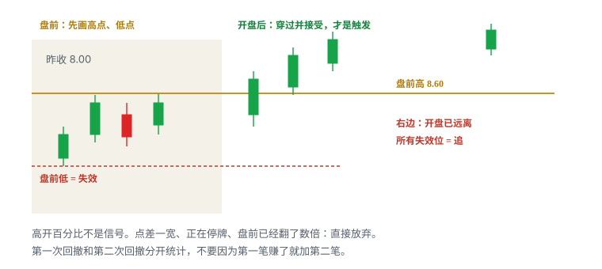

基本定义：

```
Gap % = (当前盘前价 − 前一常规时段收盘价) ÷ 前收盘价 × 100%
```

同一句话里至少要核四件事，否则这个百分比没有执行含义：

- 当前价用 last、bid / ask 中点还是其他值；
- 前收盘是否复权，代码有没有变更；
- 盘前成交量够不够形成可靠缺口——几千股打出来的 40%，和几十万股打出来的 40%，不是同一句话；
- 昨日盘后新闻是否已经在 after-hours 走完，今天的「缺口」其实是昨天已经定价过的路。

严格的 price gap 是两个相邻交易时段之间没有重叠的价格区间。盘前高低本身就是当天最常用的两层。把它们画成区域，而不是一根穿过最高一笔盘前成交的细线。开盘后第一段波动经常先回测这层：站稳，它是支撑候选；失守，它是失败高开。卷二写过：缺口可能很快回补、部分回补、数年不回补，或因公司价值重估永久留在图上。把 gap 当目标前，先确认到缺口边还有没有 ≥ 1R，中间是不是真的空。

高开本身不是做多许可。触发仍在：价格穿过事先画好的线，并且在新价位被接受。未收盘最高价、一根长上影、盘口闪一下，都不是接受。接受看起来更像：实体站上，随后的回落不把线还回去。

## 5.9.2 什么样的缺口值得看

先核对新闻催化剂、流通股本、盘前成交量、点差、日线阻力，再打开图和 Level 2。盘前整理的高低点比单纯涨幅更有用：它们给出触发、止损和利润空间。

课程强调五件事：float、缺口大小、催化剂、熟悉度、盘前成交量。这五项用来缩小名单，不是五个独立确认、更不是五个可以相乘的概率。最明显的 gapper 容易聚集注意力，但拥挤也会增加假突破、滑点和停牌风险。没做过的名字，即使缺口第一，也可以降级为只观察——熟悉度是启发式，写成「新代码默认半仓或观察」，不要写成「没做过就不能涨」。

可交易缺口通常同时具备：

1. **可核验的新鲜催化。** 原始来源、发布时间、与公司规模相关。旧闻、无约束力合作、找不到原文的「FDA related」，催化栏写「无」或删除。无法解释的上涨可以观察技术结构，但应降低确信、仓位和持有时间。不要把「纯技术」四个字写进催化栏。
2. **流通和市值对得上号。** 第三方 float 可能过期、把 outstanding 当 float、没计入增发或反向拆股。扫描阶段可用近似值；决定较大仓位前回到最新文件。低 float 不是优势，是更高的双向尾部。
3. **当前时段的量够你进出。** 盘前 8,000 股的「高 RVOL」撑不起开盘后 2,000 股的订单。先问：按计划股数进出，这笔量够不够让你不是盘口上最大的傻瓜？
4. **点差和深度能承受计划仓位。** 一跳就超过 1R，或可见深度接不住计划股数，前面三项全作废。
5. **日线还有空间。** 上方立刻是前高、200 日均线或刚跑完一轮的供给区，第一目标不到 1R，形态再标准也不进 A 级名单。
6. **能画近端失效。** 盘前已经翻了数倍、没有可画的结构低点，剩下的只有追。

课程里常见的价格窗、float 窗、最小盘前量，全部是启发式。换市场、换年份、换价格区间，同一个数字会失效。写进扫描器，用样本验证。区间外不是绝对禁止，而是你可能没有样本。

「最明显」只解决有人看，不解决当前价格值不值得参与。领先 gapper 的优势是注意力、成交量和共同水平更清楚；风险是大量追价、假突破、halt、早期持仓者借你的买单退出、以及同样的扫描器造成同步止损——你的失效位也可能是两千人的失效位。

## 5.9.3 盘前清单

这份清单用来缩小名单，不是买入许可。任一项答不上来，该股降为观察或删除。数字阈值全部启发式，改完必须写进计划。

```
代码 / 交易所 / 是不是普通股或 ADS？
有没有新鲜、可核验的催化？原文链接和时间？
流通盘来源和日期？市值对得上号？
近期有没有 S-3 / ATM / 424B / 权证 / 反向拆股？
盘前累计成交、同时刻 RVOL 够不够计划股数进出？
点差和可见深度能否承受计划仓位？
日线第一阻力在哪？到它是否 ≥ 计划风险？
盘前高、盘前低、局部 pivot、昨收、整美元 / 半美元画好了没有？
VWAP 先标上，但开盘前几分钟不当铁支撑？
当前 / 预计 LULD 上沿离第一目标多远？停牌风险接受吗？
券商在盘前允许什么订单类型？未成交单会不会带进常规时段？
第一目标到入场 ≥ 1R 吗？含点差之后还成立吗？
A / B / 只观察 / 明确不做，分好了没有？
六栏写齐了没有：Setup / Trigger / Invalidation / Size / Exit / No-trade？
单笔和单日亏损锁写死了没有？
```

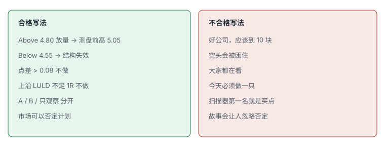

按顺序处理前 5–10 个，而不是只看排名第一。第一名可能点差不可接受、正在 halt、刚宣布增发，或第一阻力只有 0.4R。第二名到第五名里，往往才有能写条件式计划的对象。最终名单可以只有一到三只。没有名字也不交易，是合法输出。

排序只允许四档：

| 档 | 含义 | 开盘动作 |
|---|---|---|
| A | 催化、流动性、日线空间、盘前结构、第一目标 ≥ 1R 都过 | 按已写触发等，不临场换股 |
| B | 缺一层 | 只在非常干净的触发且降低股数时考虑 |
| 只观察 | 结构未完成，或点差 / 停牌不可接受 | 默认不做 |
| 明确不做 | 写下来 | 禁止开盘后临时升级 |

合格写法是条件，不是故事：

```
Above 4.80 放量 → 测盘前高 5.05
Below 4.55 → 结构失效
点差 > 0.08 或上沿 LULD 不足 1R → 不做
开盘已高于 5.20 且失效仍在 4.55 → 追，仓位 0
```

不合格写法：「好公司应该到 10」「空头会被困」「大家都在看」「今天必须做一只」「扫描器第一名就是买点」。故事会诱导忽略否定。观察名单上出现这类句子，就重写；写不成条件就删除该股。

盘前时间是注意力预算。先处理已经跳空、已经有量的名字，比从全市场随机翻图有效——这是启发式流程，不是「只做 gap」。开盘后 gap list 已经基本已知，工作切到：A 类按计划执行；动量扫描只为新出现、通过同一漏斗的名字开门。已经远离盘前计划、只因为又创新高就追，是另一笔没有写过计划的交易。

## 5.9.4 扫描器只生成候选

一个扫描器根据字段筛选证券：gap %、价格、成交量 / 相对量、float、相对昨收涨幅、新高、五分钟动量、停牌状态。结果表示「满足条件」，不表示消息可靠、现在是好入场、数据无误、流动性够、风险收益合理，也不表示你的券商能在盘前下这类订单。

课程的 scanner 是特定商业产品。界面、颜色和访问权限不是需要保留的知识。真正要学的是条件、数据定义和处理顺序。Float 列被涂成蓝色，只是软件配色，不代表低 float 自动更好。扫描结果是实时快照，会随价格和成交量改变，截图不能还原早晨当时的排序。

同一股票同时命中 gap 榜、涨幅榜和相对量榜，常常只是同一个事件的三个字段，不是三份独立证据。Alert 后才打开图和 Level 2，不能在看到颜色高亮后直接下单。

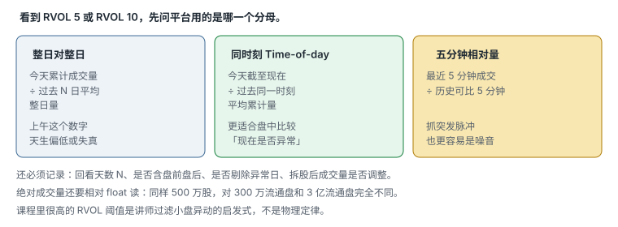

RVOL 至少有三种口径，不能横比：

```
RVOL_daily ≈ 当前累计成交量 ÷ 过去 N 日平均整日成交量
RVOL_tod   = 今天截至当前时刻成交量 ÷ 过去 N 日同一时刻平均累计量
RVOL_5m    = 最近五分钟成交量 ÷ 历史可比五分钟平均量
```

必须记录 lookback N、是否包含盘前盘后、是否排除异常日、分母用整日还是同一时段、拆股后 volume 是否调整。不同扫描器的 `RVOL 10` 可能不是同一含义。盘前更公平的是同时刻口径。课程里「当天成交量是平时的 5 倍」「盘前已经成交几十万股」是讲师的过滤条件，启发式。

Float 扫描阶段可用近似值。决定较大仓位前核：更新时间、是不是把 outstanding 当 float、有没有计入发行 / 行权 / 转换、有没有处理反向拆股、foreign issuer / ADS 口径。写成区间，并写下**来源和日期**。来源不明的「8.2M」只能进待核验。

Short interest 通常不是实时数据。它是背景字段，不是 trigger。超过 100% 也不等于违法，更不等于今天必须上涨。扫描器若把 short interest 标红，先当提醒去查结算日，不当信号。

扫描器回测常见偏差：用今天的 float 回测旧日期；只保留后来大涨的 alerts；不记录 alert 当时价格；以 K 线 high 当可成交 entry；忽略已退市证券；参数由成功图反推；不记录当时延迟；把同一股票连续 alerts 当独立样本。需要保存原始 timestamp 和当时可见字段。筛选条件一改，前后结果就不能直接混在一起。

最小保存字段：

```
timestamp
symbol
last / bid / ask
gap %
change %
cumulative volume
time-of-day RVOL
5m volume / RVOL
float source + date
halt status
news link + publish time
strategy / condition name
scanner version
```

完整漏斗见卷一 1.5。本章只保留开盘要用的那一层：扫描器找的是「值得打开图表的股票」，不是「应该马上买的股票」。

## 5.9.5 开盘前必须画好的线

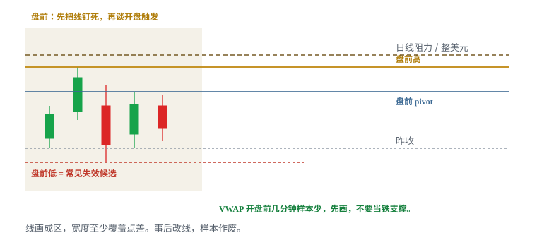

每只 A / B 候选至少画：

| 线 | 它是什么 | 开盘后常见用法 |
|---|---|---|
| 昨收 | 昨天常规时段收盘 | 红翻绿的基准；不是因果开关 |
| 盘前高 | 盘前实际成交形成的绝对高 | 突破 / 回踩的参考，不是天花板 |
| 盘前低 | 盘前实际成交形成的绝对低 | 常见失效候选；失守后高开假设变弱 |
| 盘前 pivot | 盘前反复测试的局部阻力 | 不是绝对高；上方要量到前高 |
| 整美元 / 半美元 | 心理关口 | 关口下蓄势才有形态，数字本身不是优势 |
| 日线第一阻力 | 向左最近的供给区 | 决定第一目标有没有 1R |
| VWAP | 成交量加权均价 | 开盘初期样本少，慎当铁支撑 |
| LULD 上沿 | 动态带子 | 不是目标；靠近则 halt 风险上升 |

线画成区。宽度至少覆盖点差和该股盘前典型噪声。盘前最高一笔成交如果只是 80 股打出来的刺，不要把它当成全市场都认的天花板；可以标，但日志里注明「薄量极值」。Pivot 越容易被不同画法移动，越需要预先保存标线截图。开盘后改线，这笔样本作废。

VWAP 若包含盘前成交，会与只从 09:30 开始计算的版本不同。平台口径写进计划。开盘前几分钟，无论哪种口径，样本都少。不要把早期 VWAP 当铁支撑，也不要用它给已经延伸的开盘当「回踩理由」。

日线先回答：历史低位、区间还是所谓蓝天；上方哪一段有大量被套成交；是否刚跑过一轮又吐回去；复权方式是否可靠。数据还没加载，不能凭扫描器数字下单。计划只需 nearest support、trigger、first resistance、next major resistance。其余远端线放参考层。

## 5.9.6 一条决策链，七种参考位

七种入口不是七个独立优势。它们是同一条链上换了参考位：

| Setup | 参考位 | 统计桶名字（写死） |
|---|---|---|
| 第一次回撤 | 冲动后第一次整理 | `GNG_PB1` |
| 第二次回撤 | 冲动后第二次整理 | `GNG_PB2` |
| 盘前高点 | 盘前绝对高 | `GNG_PMH` |
| 盘前 pivot | 盘前局部阻力 | `GNG_PIVOT` |
| 整美元 / 半美元 | `$x.00` / `$x.50` | `GNG_DOLLAR` |
| 开盘区间 | 事先写死时长的区间 | `GNG_ORB` |
| 红翻绿 | 昨日收盘 | `GNG_R2G` |
| 盘前交易 | 盘前时段的任一结构 | `GNG_PRE` |

第一次和第二次回撤必须拆开。第三次及以后默认不是本章的开盘策略；若你坚持做，另开 `GNG_PB3`，不要并进前两个桶。盘前做成的笔，和开盘后同名结构，也必须拆开——深度、点差、订单类型都不同。

每一种内部还要再拆预判 / 穿越 / 回踩。混进一个胜率，样本是脏的。

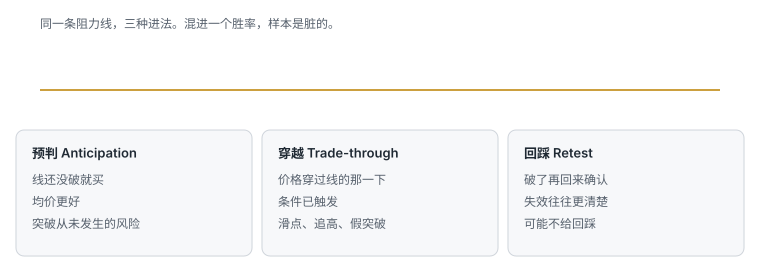

| 入场 | Entry | 优点 | 主要风险 |
|---|---|---|---|
| 预判 | 阻力下方 | 均价较低 | 突破从未发生 |
| 穿越 | 穿过线的那一下 | 条件已触发 | 滑点、追高、假突破 |
| 回踩 | 破了再回来确认 | 失效往往更清楚 | 可能不给回踩 |

开盘策略里，穿越最常见，也最容易在延伸开盘里变成追。回踩更慢，但经常是错过第一波之后唯一还合法的入口。预判要求你能接受「线从没破」；开盘前几分钟点差一宽，预判的成本往往被点差吃掉。

触发条件和失效价必须来自**同一个周期**。1 分钟触发、5 分钟止损，是两套逻辑硬拼。选了周期，就用同一周期定义入场、失效和统计样本。周期写进桶名：`GNG_PB1_1m` 和 `GNG_PB1_5m` 不要合并。

下单前六栏写不齐，就没有这一笔。形态名只填 Setup。判断点永远在价格穿过线并被接受的那一刻。

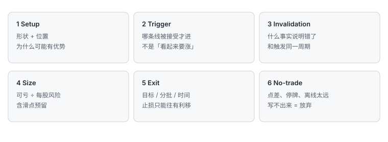

## 5.9.7 Setup：第一次回撤

价格先形成明显冲动，再出现数根小实体回撤，才有「旗杆后整理」的语境。第一次回撤通常最接近原始动量。触发可定义为突破前一根已收盘 K 的高点并接受；失效放在回撤低点，而不是任意固定美分数。

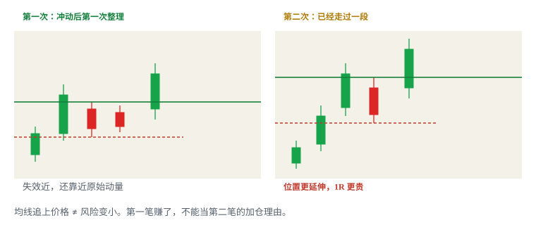

| | |
|---|---|
| 统计桶 | `GNG_PB1`（再加周期） |
| 参考 | 冲动后的第一次局部高点 / 旗面上沿 |
| 触发 | 突破前一根已收盘 K 的高点并接受；或收回旗面上沿（写死一种） |
| 失效 | 该回撤低点，含滑点 |
| 常见失败 | 突破后立即跌回；回撤期间量不缩；1 分钟已经第三次、5 分钟还是第一根扩张 K |
| 不做 | bid 连续坍塌、点差突然拉宽；突破时 ask 不断补单而价格不前进；开盘已远离该回撤低点 |

回撤期间理想状态是成交量收缩、bid 未连续坍塌、点差不突然扩大。若突破时 ask 不断补单而价格不前进，视为吸收或动能不足。量能顺序偏好：

```
冲动扩张 → 回撤收缩 → 突破再扩张
```

失败警告：回撤红量大于冲动段；突破量大但价格不前进；突破后马上跌回区间。这和 5.1 的旗形是同一形状，位置是「缺口股开盘前后的第一段」。不要和盘中动量里更晚的第一次回撤合并——除非你的计划明确它们是同一个定义。5.11 的盘中微回撤，时间窗口和股票状态往往已经不同。

练习时还要收集突破后立即跌回的失败例，不能只留成功上行。成功图是事后结果。

可测试版本（边界全部启发式）：

```
冲动段 >= 相对该股盘前波幅的 X
回撤根数 = 2..5
回撤幅度 <= 50%
回撤量 < 冲动段量
触发 = 前一根已收盘高点被接受
失效 = 回撤低点
周期 = 事先写死的 1m 或 5m
```

教学数。盘前冲动到 8.60，开盘后回落到 8.38–8.45 缩量，前一根已收盘高 8.48。8.50 接受后买。失效 8.38 − 0.03 滑点 = 8.35。入 8.52。每股风险 0.17。单笔可亏 50 → 约 294 股，再按盘口往下砍。第一目标若是盘前高 8.60，空间只有 0.08，不到 1R——要么等更近的微结构把止损收近，要么放弃穿越、改等盘前高的回踩，要么把第一目标改成日线下一层并确认那里仍 ≥ 1R。空间不够不能靠加股数补。

## 5.9.8 Setup：第二次回撤

第二次回撤和第一次同名，但不是同一 setup。已经历较长加速之后，后续同名 pullback 的位置明显更延伸。均线追上价格不等于风险变小；需要看回撤低点到潜在目标的真实 R 倍数。趋势是否已经衰减，每一笔都要重新判断。

| | |
|---|---|
| 统计桶 | `GNG_PB2`（再加周期） |
| 参考 | 第一段延伸之后的第二次整理 |
| 触发 | 该段前一根已收盘高点被接受（写死） |
| 失效 | 该段回撤低点，不是沿用第一次的低点 |
| 常见失败 | 因为第一笔赚了就加仓；把衰减中的回撤当成「更安全的回踩」；止损仍用第一段的宽距离却不减股 |
| 不做 | 第二次已经贴近日线阻力或 LULD 上沿；点差比第一次更宽还不减仓；第三次及以后还并进这个桶 |

「之前成功过」不能成为加仓理由。每个新 entry 都要重新计算最大损失。第一次的赢家如果还拿着，第二次是加仓，必须按卷四重算全仓风险；更常见的正确动作是：第一次按计划减仓，第二次当作新的一笔，股数按新的失效距离算，且默认更小。

第二次允许做的条件（启发式，写进计划再验证）：

- 第一段之后仍然有更高低点，结构没坏；
- 回撤量再次收缩，而不是放量砸；
- 到下一目标仍 ≥ 1R；
- 点差没有比第一段明显恶化；
- 不是开盘已经延伸之后硬数出来的「第二次」。

教学数。第一段已经从 8.40 走到 9.10，回落到 8.88–8.96。入 8.98，失效 8.88 − 0.04 = 8.84，每股 0.14，看起来比第一次还「紧」。但 9.10 上方日线供给在 9.18，空间 0.20，勉强 1R；且 9.20 可能靠近 LULD。这和 8.50 那一笔不是同一个期望值。日志必须用 `GNG_PB2`。若你在 9.10 因为「刚才那笔对了」加到双倍股数，失效一扫，两笔的计划风险会叠成一笔超限。

第三次及以后：课程和 5.1 都提示后续回撤更容易衰减。默认不做。若研究，单独开桶，不要用第二次的胜率给第三次壮胆。

## 5.9.9 第几次必须声明周期

「第几次」在 1 分钟和 5 分钟上不是同一个数。1 分钟可能已经出现多个小 pullback，而 5 分钟仍只是一根扩张 K。若 1 分钟触发距离 5 分钟支撑太远，按 1 分钟止损可能易被噪声扫出，按 5 分钟止损又可能使仓位过大。

选择周期后，用同一周期定义入场、失效和统计样本。不要盘中把亏钱的 1 分钟样本改口成「其实是 5 分钟第一次」。事后改周期，和事后改开盘区间长度，是同一种作弊。

开盘前写死你今天做哪一档：

```
主图周期: 1m
背景周期: 5m（只作语境，不定义止损）
第几次的计数周期: 与主图相同
禁止: 用 5m 低点给 1m 入场当宽止损还不减股
```

多窗口不要分散决策顺序。结构 → 风险 → 流动性 → 最后才是具体下单方式。Level 2 和 Time & Sales 不能代替已经画好的线。四个窗口同时闪，会制造「全市场都在突破」的错觉；一次只对计划中的标的和参考位作判断。

## 5.9.10 Setup：突破盘前高点

盘前高点是市场已经实际成交形成的参考位，不是保证突破的天花板。开盘时同时有许多候选，应提前排序，避免临场追逐。

| | |
|---|---|
| 统计桶 | `GNG_PMH` |
| 参考 | 盘前绝对高点（开盘前钉死） |
| 触发 | 开盘后穿过并接受；或突破后回踩守住（分成 `PMH_THRU` / `PMH_RETEST`） |
| 失效 | 突破后结构低点，或盘前结构低点（写死一种，开盘前选好） |
| 常见失败 | 假突破；一瞬间刺穿不算接受；滑点把图上的 R 吃掉 |
| 不做 | 开盘直接远高于盘前高、失效位变得很远；突破前量枯竭、点差扩大、价格离 VWAP 过远且无法执行 |

第一次穿越、突破后的回踩、以及再次突破是三种不同 entry，不能混称一个 setup。价格突破后若能在关键位上方成交并形成更高低点，属于接受。一根长上影插过去又回来，是试探。


若下方失效点太远，应缩小仓位或放弃，而不是把止损随意抬到噪声区域。记录下单价与实际成交均价。高波动时滑点会让图上的漂亮 R 倍数失真。计划入场应是预期平均成交，不是卖一。

盘前高被打穿的同时，常常也打穿整美元或开盘区间高。这是同一条价格路径上的 confluence，不是独立概率相乘。日志选一个主参考位。主参考位是你用来定义失效的那一根。

教学数。盘前高 8.60，盘前低 8.20，昨收 7.40。开盘 8.58，第一根 1 分钟实体收在 8.66。穿越版：入 8.68，若失效用盘前低 8.20 + 滑点 0.05 = 8.15，每股 0.53——对小账户往往太远。应改用突破后第一根回撤低，或放弃穿越等回踩。回踩版：价格回到 8.60–8.62 守住再抬，失效可以收到 8.54，每股风险小一个数量级。两笔不要共用胜率。

若开盘打印在 9.10，盘前高 8.60、盘前低 8.20 都远在下方，这一节直接结束，去下一节。

## 5.9.11 开盘已延伸 = 追

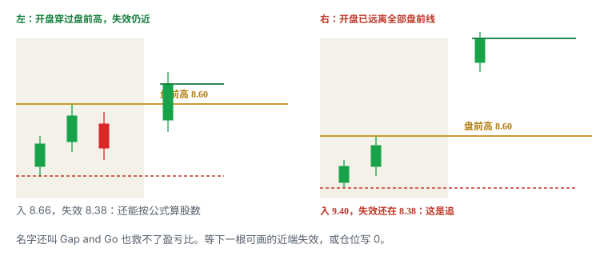

追的定义与 5.1、卷四相同：**入场离失效位太远**。开盘策略里最常见的样子是：09:30 第一笔成交已经远高于盘前高、盘前 pivot、整美元和任何可画的结构低点。这时你没有 Gap and Go，只有一个已经走完的缺口。

判定清单（开盘第一分钟就能用）：

- 所有事先画好的失效位都在远处；
- 要把止损放到盘前低或昨收，每股风险已经大于你的单笔上限所能承受的股数；
- 第一目标（日线阻力或 LULD 上沿）离入场不到 1R，甚至为负；
- 点差已经宽到一跳就超过计划 1R；
- 你想进场的理由是「高开很大 / 扫描器第一 / 别人都在买」，而不是某根线被接受。

处理：

1. 仓位写 0。不要用「先买一点」绕过定义。
2. 等下一根可画的近端结构：回撤、回踩盘前高、新的旗面。那是新的一笔，用新的桶。
3. 若全天不再给出近端失效，全天不做这一只。这是清单的合法输出。
4. 不要把止损抬到「随便一个影线下方」来伪造近端失效。噪声区里的假止损，不是结构失效。

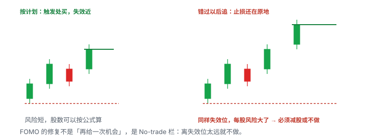

错过开盘第一波不是失败。开盘不是必须参与的仪式。把「必须做开盘」写进计划，是把仪式当成了优势。延伸开盘里用市价去抢第一根大绿 K，计划止损往往在盘前低，真实亏损在 halt 或跳空之后——两个数不是同一个。

有一种看起来像「还没延伸」的假象：开盘价刚好在盘前高上方两三分钱，但盘口已经 0.15 宽。图上距离很近，成交均价会把你送到延伸区。所以判定要用**可成交价**，不用 K 线开盘价。

## 5.9.12 Setup：盘前 pivot

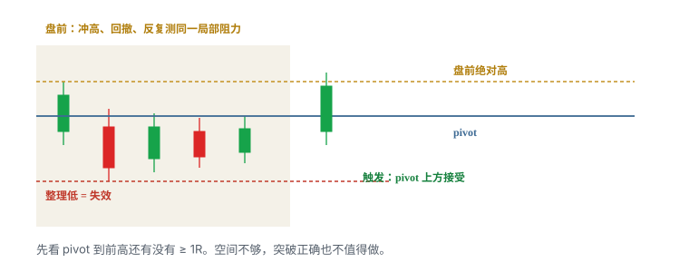

黄色线附近往往不是当天绝对高点，而是盘前冲高、回撤后反复测试的局部阻力。Pivot 有效性的关键是市场多次在附近作出反应，并形成可识别的整理。绝对高是极值；pivot 是被反复承认的区。

| | |
|---|---|
| 统计桶 | `GNG_PIVOT` |
| 参考 | 盘前局部阻力（多次反应，开盘前截图钉死） |
| 触发 | pivot 上方接受 |
| 失效 | 整理低点 |
| 常见失败 | 事后移动标线；突破正确但到前高不到 1R；把一次撤单当成确认 |
| 不做 | 空间不足 1R；盘口深度接不住计划仓位；pivot 只是你事后挑的一根影线 |

触发前先看 pivot 上方最近的前高（常常就是盘前绝对高）。如果空间不足 1R，突破正确也未必值得交易。正确动作是等待回踩把止损收近，或放弃，而不是把目标画到更远的「也许能到的地方」。

图看结构，盘口看当下流动性，成交带看已经发生的交易。Time & Sales 不是未成交订单列表；不能从打印颜色直接推断某个交易者的意图。大卖单撤掉可能促成突破，也可能只是流动性短暂消失。计划仓位应能在当前深度中合理退出，不能只看进入时是否成交。

Pivot 和盘前高不要抢同一个胜率。价格先破 pivot、再破盘前高，是同一路径上的两道门。你事先选一道当主触发。两道都记「做了」，样本会双计。

教学数。盘前绝对高 6.40，反复反应的局部阻力 6.15–6.18，整理低 5.98。6.20 接受后买，失效 5.98 − 0.04 = 5.94，入 6.22，每股 0.28。到 6.40 只有 0.18，不到 1R。这笔 `GNG_PIVOT` 不合格。若你改等 6.40 的回踩，那是 `GNG_PMH` 的回踩版，另一笔。

## 5.9.13 Setup：整美元 / 半美元

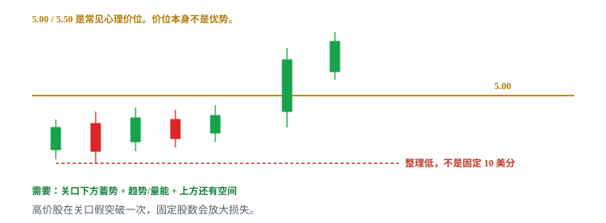

课程把 `$x.00` 与 `$x.50` 当作常见心理价位，并强调价格在其下方横住再突破的形态。价位本身不是优势；需要与趋势、成交量、盘前结构和上方空间同时出现。关口附近是否真的反复成交、是否有整理，比数字是否整齐更重要。

| | |
|---|---|
| 统计桶 | `GNG_DOLLAR` |
| 参考 | 整美元或半美元 |
| 触发 | 关口下方蓄势后穿过并接受 |
| 失效 | 整理低点或清楚的微结构低点，不是统一 10 或 20 美分 |
| 常见失败 | 把心理价位当优势；入场已经在突破 K 顶部，方向对但盈亏比很差；trade-through 后回落到关口下方 |
| 不做 | 高价股仍用固定股数；关口附近没有反复成交、没有整理；一次跳动就跨过 0.50，半整数没有执行意义 |

高价股在关口附近一次假突破的绝对金额更大。固定股数会放大损失。止损来自结构，不是「整美元下方固定一毛」。最好区分预判、穿越和回踩三种执行方式。对照统计穿越后回落到关口下方的样本，避免「整美元必涨」的错觉。

开盘策略里的整美元，和 5.11 盘中动量里的整美元、5.12 / 卷六反转里的整美元，是三个不同假设：

| 语境 | 假设 | 统计桶 |
|---|---|---|
| 缺口股开盘 | 关口下蓄势向上 | `GNG_DOLLAR` |
| 已有盘中动量 | 关口成为加速点 | 5.11 自己的桶 |
| 下跌到关口 | 逆势反应 | 反转桶 |

不要共用一个胜率。5.11 若单独写开盘区间 / 微回撤 / 整美元，那里是盘中位置课；本章只统计**缺口名单、开盘窗口**里的关口。

教学数。价格在 4.92–4.98 横了十余根 1 分钟 K，量缩。5.00 被实体接受，入 5.03，整理低 4.90，滑点 0.03，失效 4.87，每股 0.16。上方日线供给 5.35，空间够。若没有横盘、开盘直接从 4.70 一根打到 5.08，这不是整美元 setup，是延伸开盘。

## 5.9.14 Setup：Opening Range Breakout


Opening range 必须先规定长度，例如 1 分钟、5 分钟或 15 分钟；否则可以事后任意选择。Trigger 是突破已形成区间的高点并接受；失效通常参考区间低点或更紧的结构低。课程提示该形态在缓慢推进、高位盘整的股票上可能更合适——这是启发式，不是「只有 grind 才能做 ORB」。

| | |
|---|---|
| 统计桶 | `GNG_ORB` + 时长（`ORB_1` / `ORB_5` / `ORB_15`） |
| 参考 | 固定时长的开盘区间，开盘前写死 |
| 触发 | 突破已形成区间的高点并接受 |
| 失效 | 区间低点，或更紧的结构低点（写死） |
| 常见失败 | 任意改变区间长度；区间过宽止损太远；过窄被开盘噪声反复触发 |
| 不做 | 首个目标离入场太近还为了「开盘必须交易」而追；回测只用 K 线价忽略开盘滑点 |

开盘首分钟点差、成交速度和 halt 风险都更高，回测使用 K 线价格会低估真实执行成本。突破同时撞上盘前高点时可能形成 confluence，但这些信号都源自同一价格路径。若首个目标离 entry 太近，宁可等待回踩。

区间长度是策略参数，不是盘中灵感。今天做 5 分钟 ORB，就不要在亏钱后改口「其实 15 分钟区间还没破」。三种时长三套样本。样本不够时，只做一种。

区间过宽：止损太远，按公式股数会小到没有意义，或你偷偷改用更近的假止损。区间过窄：开盘噪声反复扫，胜率被噪声主导。两种都不是靠把区间改到「刚好没扫到」来修。

教学数。开盘前写死 5 分钟 ORB。09:30–09:35 高 5.40、低 5.18。5.42 接受后买。失效若用 5.18 − 0.05 = 5.13，每股 0.29。盘前高若在 5.48，空间 0.06，不合格。盘前高若在 5.90，空间够，但要检查 5.50 整美元和 LULD。若 09:31 已经打到 5.70，5 分钟区间还没走完——你没有 ORB，只有延伸。等区间结束再看，或改做别的已写好的桶，不要提前把未完成区间当 ORB。

## 5.9.15 Setup：Red-to-Green（开盘入口版）

完整定义见 5.6。这里只保留开盘清单里的一行：水平基准是昨日收盘价；股票先低于昨收，随后穿越到正涨幅。这只是相对昨收的状态变化，不代表公司基本面或当日趋势自动转强。更重要的是恢复过程中是否形成更高低点、成交量是否配合、昨收上方是否有日线阻力。


| | |
|---|---|
| 统计桶 | `GNG_R2G` |
| 参考 | 昨日收盘 |
| 触发 | 从下向上穿越并守住（收盘确认或回踩，写死一种） |
| 失效 | 基准下方结构低点 / flush 低点 |
| 常见失败 | 反复穿越；用后续大涨倒推第一次穿越；止损放在当天最低而距离过远还不减仓 |
| 不做 | 把任意绿 K 叫红翻绿；flush 未停就猜底；把 SSR 当必须上涨 |

Gap down 后才有严格意义上的红翻绿。高开之后的绿 K 不是红翻绿。不要把任意绿 K 都这样命名。前收盘附近往往有双向交易，单次穿越可能反复来回。可要求已收盘站上，或回踩昨收守住。两种记法分开统计。

开盘 10 分钟窗口仍是 5.6 的启发式，不要在这里改成另一个未声明的时长。课程担心：时间拖太久，只剩回补、缺少新买盘，假突破增加。你可以写成硬过滤（超时不做），或单独开「迟到的红翻绿」桶做研究。不要盘中临时决定「今天例外」。开盘 10 分钟内的红翻绿，和盘中横盘挤压，不要丢进同一个桶。

若止损放在当天低点而距离过远，必须按每股风险缩小仓位，或换更近的微结构失效，或放弃。不要因为「这是红翻绿」就接受一个你平时不会接受的宽止损。

教学数。昨收 5.00，开盘先到 4.72，更高低点 4.80，然后回穿 5.00。穿越版：5.02 接受后买，失效 4.72 − 0.05 = 4.67，每股 0.35。到盘前高 5.15 只有 0.13，不到 1R——要么等回踩，要么放弃穿越、改等盘前高。10 分钟启发式：若直到 09:55 才第一次站上 5.00，按你计划里写死的规则做或不做，不要现场改窗口。

## 5.9.16 Setup：盘前交易

按小时统计的交易分布会提醒：策略效果可能依赖时段。个体历史统计比「盘前一定更好 / 更差」的口号更有价值，但要保证样本数和市场阶段足够。盈利柱不能说明风险相同；还需比较每笔平均风险、最大亏损、滑点和停牌暴露。课程作者的时段优势不能直接迁移到另一套券商、数据源和执行速度。

| | |
|---|---|
| 统计桶 | `GNG_PRE`（内部再按结构分子桶：`PRE_PMH` / `PRE_PIVOT` / `PRE_FLAG` / `PRE_DOLLAR`） |
| 参考 | 任一盘前结构（高点、pivot、旗面、整美元） |
| 触发 | 该结构自己的触发 |
| 失效 | 该结构自己的失效 |
| 常见失败 | 低流动性下少量成交画出漂亮 K 线；常规时段仓位照搬；盘前最后价与 09:30 开盘价差很大 |
| 不做 | 无法用限价单控制最坏成交价；深度接不住；订单类型或路由在盘前不可用 |

正式开盘前已经发生主要上涨、随后在高位整理，是常见画面。盘前深度通常更薄、点差更宽。很多券商只接受限价单。不同系统可能展示不同报价。未成交订单是否进入常规时段，取决于 Time-in-Force，以你的平台当前手册为准。盘后没有常规 LULD 保护。灰色背景只是平台配色，不是风险变小。

盘外不是缩小版的常规时段。用常规时段的市价习惯去打盘前，是把薄流动性当成深流动性。若无法用限价单控制最坏成交价，就不应以常规时段的仓位照搬。少量成交就能画出漂亮 K 线；应先检查真实可成交规模。

盘前做成的笔，和开盘后同名结构，分开统计。盘前突破盘前高，和 09:30 突破同一根线，不是同一句话：参与者、深度、halt 规则、订单类型都变了。09:30 开盘价可能与盘前最后价差异很大——盘前赢家在开盘第一秒变成延伸或缺口回补，是盘前策略必须单独承受的尾部。

盘前最小检查：

```
券商此刻允许的市场和订单类型？
可见深度是否覆盖计划股数的进出？
点差占计划 1R 的多少？
新闻是否已经完整读过，会不会再出第二篇？
TIF 会不会把未成交单带进 09:30？
若 09:30 反向跳空，最大损失是否仍可承受？
```

课程画面里的具体盘前起止时间不可直接套用。以你的券商当日支持为准。资料：[SEC：After-Hours Trading](https://www.sec.gov/files/afterhourtrading.pdf)。

## 5.9.17 七种入口对照

| Setup | 桶 | 参考位 | 典型触发 | 典型失效 | 主要陷阱 |
|---|---|---|---|---|---|
| 第一次回撤 | `GNG_PB1` | 冲动后第一次局部高 | 前一根已收盘高点 | 该回撤低点 | 周期没声明；后段冒充第一次 |
| 第二次回撤 | `GNG_PB2` | 第二段整理 | 该段前高接受 | 该段回撤低点 | 因第一笔赚钱加仓 |
| 盘前高点 | `GNG_PMH` | 盘前绝对高 | 穿越 / 回踩 | 突破后结构低 | 假突破、滑点、开盘已远离 |
| 盘前 pivot | `GNG_PIVOT` | 盘前局部阻力 | pivot 上方接受 | 整理低点 | 事后移动标线；空间不足 |
| 整美元 / 半美元 | `GNG_DOLLAR` | 整数或半整数 | 关口下蓄势后突破 | 区间低点 | 把心理价位当优势 |
| 开盘区间 | `GNG_ORB` | 固定时长区间 | 区间高点突破 | 区间低点 | 事后改时长 |
| 红翻绿 | `GNG_R2G` | 昨日收盘 | 从下向上穿越并守住 | 基准下方结构低 | 反复穿越；任意绿 K |
| 盘前交易 | `GNG_PRE` | 盘前任一结构 | 结构触发 | 结构失效 | 流动性与订单限制 |

第一次回撤通常比第二次更接近原始动量。后面每一笔重新算风险。开盘前几分钟 VWAP 样本少，不要把早期 VWAP 当铁支撑。开盘已远离所有失效位，上表任何一行都不适用——那是追。

同一分钟里价格可能同时穿过 pivot、整美元、盘前高和 5 分钟区间高。日志只记一个主桶：你事先用来定义失效的那一个。其余写成 confluence 备注，不另计一笔赢家。

## 5.9.18 三种入场方式仍要拆开

七个参考位 × 三种入场 = 二十一个潜在子桶。你不需要一开盘就做二十一个。你需要的是：凡是做了的，不要并成一个「Gap and Go 总胜率」。

最低拆法：

```
GNG_PB1_THRU
GNG_PB1_RETEST
GNG_PB2_THRU
GNG_PMH_THRU
GNG_PMH_RETEST
GNG_PIVOT_THRU
GNG_DOLLAR_THRU
GNG_ORB_5_THRU
GNG_R2G_THRU
GNG_PRE_*
```

预判单独开桶，或开盘阶段直接禁做预判——开盘点差经常让「线下方更优均价」变成幻觉。样本不够时，先只做穿越或只做回踩，不要两种都做却记成一种。

多次加回会产生一串不同 setup。第一次突破盘前高是一笔；被扫后在回踩再进是第二笔；再加仓是第三笔。每一笔重算最大损失。不能合并成一笔漂亮的大赢家。卖出后把心理止损调到平均成本，只是价格上的保本；费用与滑点仍可能使净结果为负。

## 5.9.19 开盘不做的几种

- 盘前已经翻了数倍、没有可画的近端失效位；
- 开盘已远离所有事先画好的失效位（追）；
- 点差已经宽到一跳就超过 1R；
- 正在停牌或刚恢复、盘口还没有稳定报价；
- 你还没写完六栏，只是因为「开盘了」；
- 扫描器第一名，但深度接不住计划股数；
- 日线第一阻力离入场不到 1R，还假设「一定冲过阻力」；
- 刚宣布增发 / ATM / 定价，供给假设变了，计划没重写；
- 代码、权证、正股没分清；
- 数据没加载、复权不明、催化找不到原文；
- 单日亏损锁已经触及；
- 你想用第一笔的盈利给第二、第三次加码。

错过开盘第一波，后面还有回踩和盘中突破。开盘不是必须参与的仪式。仓位默认更小，因为尾部更肥。枯燥日的正确输出是缩小仓位或不开张，不是降低标准去填交易次数。

冷热要量化，不要事后用盈亏解释。可记录：盘前达到筛选条件的数量、leading gappers 的中位 follow-through、开盘 15 分钟中位点差、LULD pause 数、同 setup 最近 20 笔期望值。阈值本身是启发式，用来前后比较。按预先写好的区间调整风险，而不是亏损后说「今天市场冷」。

## 5.9.20 仓位、点差、停牌

股数公式不变：可亏金额 ÷（入场到失效 + 滑点），再取流动性、halt 暴露、单日剩余额度的最小值。开盘默认在这个结果上再砍一档——启发式，写成固定比例或固定上限，用样本验证。不要用挑战赛或别人的热键股数。

三个必须分开的数字：

| 名字 | 开盘时特别容易混 |
|---|---|
| 名义敞口 | 「我只买了 800 股」在 9 美元和在 2 美元不是同一句话 |
| 计划风险 | 止损在盘前低、入场在延伸开盘时，1R 会突然变得很大 |
| 尾部风险 | halt、开盘跳空、盘口消失，计划止损覆盖不了 |

「止损价」只是计划输入，不是最大损失保证。对可能 halt 的低流通股票，必须进一步减仓，或直接放弃。接近 LULD 上沿时按「可能暂停且无法退出」计算仓位。带子不是上涨目标。当前 band 以交易所实时信息为准，不要背课程旧表。


开盘前后 halt 密度高于午间。进入停牌后普通卖单和止损单不能让你退出。恢复价可以远离任何你画过的线。halt down 时挂市价等恢复，不是安全方案。更稳妥的原则是进入停牌前控制仓位，恢复后重新观察可见报价。复牌是价格发现，不是免费缺口。

点差已经拉宽就放弃。可成交限价给最坏价格边界，不消灭滑点。课程里的 5–10 美分偏移只是当时标的经验，启发式。偏移太小会错过或局部成交，太大则接近市价。退出时：风险失效优先出去，不为更好价格继续暴露。赢家和输家不应使用同一耐心。

每笔记录计划价、实际均价和最差一笔成交。图上的触发价不是绩效入场价。高速行情里，K 线回测常忽略买卖价、排队顺序与部分成交。

## 5.9.21 数字例：同一只股票，七种名字

教学用整数，不是某只股票，也不是推荐。昨收 4.80。盘前 7:00–9:29：高 5.40，低 5.05，局部反复在 5.22，整美元 5.00 早已在下方，日线供给 5.70，盘前累计成交足够计划 300 股进出，点差 0.03–0.06。催化有原始公告。你的单笔可亏 50 美元。滑点预算 0.04。开盘前写死：主周期 1 分钟；ORB 用 5 分钟；不做预判；开盘延伸则仓位 0。

**盘前交易 `GNG_PRE`。** 8:40 在 5.22 pivot 上方接受。若当时深度接得住、限价能控制最坏价，这是盘前桶。失效用当时整理低。即使后来 09:30 继续涨，这一笔也不并进开盘桶。

**红翻绿 `GNG_R2G`。** 今天盘前从未低于 4.80，没有红翻绿。开盘若直接在 5.30，更没有。不要因为 K 线是绿的就写 R2G。

**整美元 `GNG_DOLLAR`。** 5.00 在盘前早已经过去，开盘不再是「关口下蓄势」。除非开盘回落到 5.00 下方重新横住，否则这个桶今天空着。

**盘前 pivot `GNG_PIVOT`。** 5.22 到盘前高 5.40 只有 0.18。若失效要放到 5.05，每股约 0.21，目标不到 1R。开盘后再做 5.22 的穿越，不合格。

**盘前高 `GNG_PMH`。** 这是今天最干净的主参考。失效若用盘前低 5.05，对 5.42 的穿越仍然偏远。更干净的是：等穿越后的第一次回踩 5.40，失效收到回踩低。

**第一次回撤 `GNG_PB1`。** 开盘冲到 5.52，回落到 5.36–5.42 缩量，前一根已收盘高 5.44。5.46 接受，失效 5.36 − 0.04 = 5.32，入 5.47，每股 0.15，约 333 股，再按盘口砍。到 5.70 有 0.23，约 1.5R。这是合格候选——前提是开盘没有已经延伸到 5.90。

**第二次回撤 `GNG_PB2`。** 若第一段已经到 5.66 才回，再做一次，必须重算。不能因为 5.47 那笔赚了就加倍。

**ORB `GNG_ORB_5`。** 09:30–09:35 若高 5.52、低 5.28，破 5.52 时可能与盘前高、第一次回撤同一路径。你事先选一个主桶。不要三笔都记赢。

**延伸开盘。** 09:30 打印 5.95，盘前高 5.40、盘前低 5.05 都在远处，日线 5.70 已经被抛在后方，前方直接是未知和下一条 LULD。六栏写不齐。仓位 0。等回踩 5.70 或 5.40 形成新的近端结构，那是新的一笔，不再假装这是「盘前高突破」。

同一天结束时，合法日志可能是：盘前一笔 `GNG_PRE`（无论盈亏）、开盘一笔 `GNG_PB1`、一笔明确的 no-trade（延伸）。非法日志是：把这三件事合成「今天 Gap and Go 赢了 1.8R」。

## 5.9.22 失败模式总表

| 你看见的 | 实际是什么 | 正确动作 |
|---|---|---|
| 高开 40%，扫描器第一 | 候选，不是触发 | 走完清单 |
| 开盘远高于盘前高 | 追 | 仓位 0，等近端结构 |
| 影线刺穿盘前高立刻收回 | 试探，不是接受 | 不进；或等回踩规则 |
| 第一次回撤赚了 | 一笔已经结束的交易 | 第二笔重算，默认更小 |
| 1 分钟第三次、5 分钟第一次 | 周期没声明 | 用事先写死的周期计数 |
| pivot 破了但前高就在眼前 | 空间不足 | 不做或等回踩 |
| 整美元光秃穿过 | 没有蓄势的心理数字 | 不做 |
| 亏钱后把 1 分钟 ORB 改成 15 分钟 | 事后改参数 | 样本作废 |
| 任意绿 K | 不是红翻绿 | 只有先红后绿才进 `GNG_R2G` |
| 盘前一根大绿、量 3,000 股 | 薄量画线 | 检查可成交规模 |
| ask 补单价格不走 | 吸收 / 动能不足 | 不追，或按失效走 |
| 点差从 0.03 跳到 0.12 | 执行环境坏了 | 放弃或按新点差重算，通常是放弃 |
| 进入 halt | 你暂时没有退出权 | 事先砍过的仓位；恢复后重看 |
| 刚出增发标题 | 供给假设变了 | 原计划作废，重读文件 |
| 四个窗口同时拉升 | 注意力分散 | 只做名单上 R 最清楚的一只 |

假突破之后：不等待「再给一次机会」；按失效减仓 / 平仓；检查是否成为多头陷阱（5.12 / 5.7）；**不自动反手做空**——反手是新的一笔，要有 locate 和新计划；记录滑点和「在上方停留了多久」。

## 5.9.23 练习、日志与复盘

每种 setup 至少收集成功和失败样本，并记录：

- 当日 gap、盘前成交量、float、催化剂（原文链接）；
- 桶名：`GNG_PB1` / `GNG_PB2` / `GNG_PMH` / `GNG_PIVOT` / `GNG_DOLLAR` / `GNG_ORB_*` / `GNG_R2G` / `GNG_PRE`；
- 周期；入场属于预判、突破还是回踩；
- 距离 VWAP、盘前高点、日线阻力和 LULD 带的距离；
- 计划风险、实际滑点、MAE / MFE；
- 是当日第几次回撤或第几次测试；
- 是否停牌、是否出现点差扩张或深度消失；
- 计划价、实际均价、最差一笔成交；
- 严格按规则退出时的结果，而不是事后最佳退出点；
- 有没有违反六栏；
- `strategy_version`。

「至少各 20 个」是课程训练量的启发式。你的最小样本量写在计划里，按波动状态分组，不要用一个热市月份凑满数字。课程录制期包含异常活跃阶段。按市场阶段分组，避免把热市样本直接外推到冷市。

最终目标不是背七个名字，而是识别：**哪里证明想法成立、哪里证明想法失效、按真实流动性可以下多大。**

不可交易和策略失败要分开。方向可能上涨，但流动性不足会使入场、加仓和退出质量很差。没有成交容量的理论利润不是可实现利润。把这类样本标成不可交易，计入命中率的分母，不计入可执行期望值的分子。若研究把它们删掉，胜率会被人为抬高。

复盘时把画面停在入场前，逐项写：

- 当时已经画好哪些线？
- 触发 K 线已经收盘了吗？
- 到第一阻力是否 ≥ 1R？
- 如果没有后来的大绿 K，这笔入场仍合理吗？
- 你记的是哪一个桶、哪一种入场？
- 开盘是否已经延伸？
- 实际均价相对计划价滑了多少？
- 有没有因为第一笔赚钱而给第二笔加码？

Bad risk 应在入场时有客观定义。如果只给亏损交易补标，会产生事后偏差。错过的交易单独记在 `MissedTrades`，不要混进真实盈亏，也不要把「没追到的大阳线」记成策略损失。

## 5.9.24 开盘检查表

开盘前 10 分钟：

- 名单只有 A / B / 观察 / 不做，没有「到时候看」；
- 每只 A 的六栏能让别人按字面执行；
- 盘前高、低、pivot、昨收、整美元、日线第一阻力、LULD 上沿都在图上；
- 标线截图已保存；
- 周期、ORB 时长、红翻绿窗口已写死；
- 单笔股数按失效距离算好，开盘默认再砍一档；
- 点差上限、halt 暴露、单日锁已写；
- 热键绑定当前窗口，模拟 / 实盘颜色能分清。

开盘第一分钟：

- 可成交价离最近失效有多远？远就是追；
- 点差是否仍在预算里？
- 是否已经 halt 或盘口空白？
- 是否出现清单里的 no-trade？
- 只盯事先写好的一只，不追最新一声提示。

触发当下：

- 穿过的是哪一根事先画好的线？
- 是接受还是影线？
- 这是该周期第几次？
- 主桶是哪一个？有没有把 confluence 当成三个信号？
- 含滑点后的股数是多少？深度接得住吗？
- 第一目标还 ≥ 1R 吗？

触发之后：

- 止损只能往有利方向移；
- 失效就走，不改口；
- 第二笔重算，不因为第一笔赚钱加码；
- 进入 halt 按事先砍过的仓位处理，不在恢复瞬间市价赌方向。

当天收盘后：

- 按桶记账，不记一个总的「Gap and Go」；
- 记下违反六栏的笔，即使赚钱；
- 记下明确的 no-trade，证明开盘不是仪式。

## 先记住这些

- 缺口是位置来源，触发仍在穿过线并被接受。
- 七种入口共用一条决策链，统计必须分开。第一次回撤和第二次回撤也要分开。
- 盘前清单用来删名字，不是用来给高开百分比开绿灯。
- 开盘已远离所有失效位 = 追。仓位 0。等下一根可画的近端结构。
- ORB 的区间长度、红翻绿的时间窗口、第几次的计数周期，必须事前写死。
- 开盘仓位默认更小。错过第一波不是失败。
- 盘前交易和开盘后同名结构不是同一桶。薄量可以画出漂亮 K 线。
- 最终要识别的是：哪里证明想法成立、哪里证明想法失效、按真实流动性可以下多大。

## 不要做的事

- 看到高开百分比就追。
- 开盘已延伸，还把盘前低当止损、把名字叫 Gap and Go。
- 把第一次失败的开盘突破立刻反手。
- 用挑战赛的仓位当学习样本。
- 开盘后因为第一笔赚了就给第二、第三次加码。
- 事后把 1 分钟区间改成 15 分钟，让这笔变成「其实做对了」。
- 把预判、穿越、回踩，或第一次、第二次回撤，并成一个胜率。
- 把盘前成交、开盘成交、盘中动量成交丢进同一个「整美元」桶。
- 用课程作者的小时盈利图证明你的盘前也该加大仓位。
- 在 LULD 附近用「只亏几美分」的假设。
- 扫描器第一名、四个窗口同时拉、聊天室都在喊，代替六栏。
- 引用课程 jpg 截图或加密货币图当证据。
