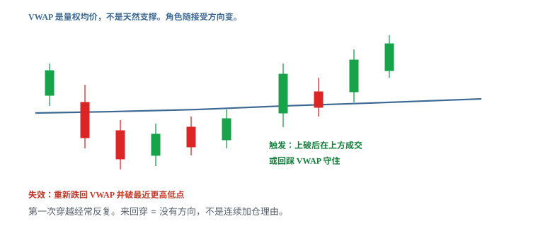
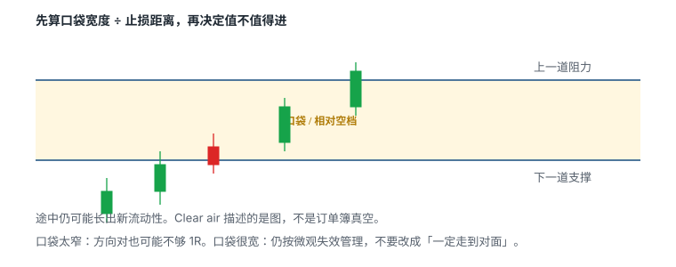

# 5.10 HOD 与 VWAP 是位置

> 一句话：HOD 和 VWAP 是线画在哪，不是形状。形状可以是旗形、贴顶、横盘或一根加速 K。位置越有名，订单越挤。

前九章把旗形、贴顶、ABCD、回踩、红翻绿、挤压、First Green Day、缺口和动量入口写成了可执行的形状或语境。扫描器和聊天室仍会把另外两个名字当成独立策略：**HOD breakout**、**VWAP breakout**。它们不是第三种、第四种形状。它们是当天所有人都看得见的两条动态位置。

本卷第一章已经切开「形状 / 位置」。本章只把这两条位置写透：HOD 怎么更新、VWAP 作为平均成本意味着什么、多条线重合时为什么会挤、挤了以后该看什么。VWAP 的四种走法——回踩、收回 / pop、拒绝 / fade、突破后回踩——写在卷二第四章和卷九第八章，这里不重写一遍。读完本章，日志里应能写出「什么形状、打在哪条位置」，而不是只写一个扫描器标签。

数字——开盘后前 N 分钟、两根 1 分钟收在新侧、口袋至少约 1R、缓冲 0.05–0.15——全部是启发式。换成你的股票池以后，用自己的 MAE 分布校准。

## 5.10.1 形状是怎么走出来的，位置是线画在哪

形状回答：价格最近这段路长什么样。位置回答：你把触发线画在哪一个价。

| 形状（怎么画线） | 位置（线画在哪） |
|---|---|
| Bull flag（旗杆 + 旗面） | 前收盘 |
| Flat top（平顶 + 抬高的低点） | VWAP |
| 横盘箱体 | 当日最高价 HOD |
| ABCD（A→B→C→D） | 整美元、半美元 |
| 微回撤（停 1–2 根） | 盘前高、开盘区间高 |
| 一根加速 K，几乎没有旗面 | 日线阻力、缺口边 |

同一面旗可以贴在前收盘上，也可以贴在 HOD 上，也可以贴在 VWAP 上。同一条 HOD 可以被旗形打穿，也可以被贴顶打穿，也可以被没有整理的加速 K 打穿。形状和位置是乘积，不是同义词。

```
Setup = 形状 + 位置
触发 = 穿过那条事先画好的线，并且被接受
失效 = 该形状自己的结构低点（不是「线下方一分钱」）
```

「会看 HOD」不是会把扫描器里的 `HOD` 列点亮。那只说明价格此刻等于或高于今天到目前为止的最高成交价。你还没有形状，还没有失效，还没有仓位。

把位置误当成形状的典型说法：

- 「我做的是 HOD。」——HOD 不会自己长出旗面。
- 「我做的是 VWAP。」——VWAP 是一条随成交移动的均价路径。
- 「HOD + VWAP + 贴顶三个确认。」——常常是同一段价格，贴了三个标签。

图形名称只填 Setup 里的形状栏。位置另写一栏。缺一栏，样本是脏的。

## 5.10.2 动态位置和静态位置不是一类东西

前收盘、昨日高、盘前高、整美元、日线平台，盘前就能标。它们在常规时段里相对不动（公司行动、错误成交另说）。HOD 和会话 VWAP 会动。

| | 静态位置 | 动态位置 |
|---|---|---|
| 例子 | 前收、盘前高、10.00 | HOD、会话 VWAP、盘中新形成的摆动高 |
| 开盘前 | 可以画好 | 还没有完整样本，或会马上改 |
| 盘中 | 价不变，角色可变 | 价和角色都可以变 |
| 止损 | 可钉在结构，对一下静态价 | 不能假设「线还在刚才那个价」 |

HOD 每创新高就换一个数。VWAP 每多一笔成交就挪一点。你 9:45 写在卡片上的「HOD = 5.12、VWAP = 4.88」，到 10:10 可能已经是另一对数字。计划必须写**规则**（「当前 HOD 被接受」「收回当时的 VWAP 并守住」），不能写死一个上午就不会再改的价，却假装自己还在做同一笔。

动态不是缺点。它的信息是：这条线代表「到目前为止」的事实。HOD 是到目前为止最贵的成交。VWAP 是到目前为止的量权平均成本。事实会刷新。你的地图也要刷新。

## 5.10.3 位置越有名，订单越挤

HOD 和 VWAP 出名，不是因为它们有预测公式，而是因为：

- 几乎每张日内图默认就画 VWAP；
- 几乎每个动量扫描器都有「新高 / 距 HOD」列；
- 止盈、止损、条件单、算法基准容易堆在同一价附近。

挤有两面。突破时跟风单、空头回补、止损买单可以叠在一起，K 线看起来很猛。同一价的另一侧，同样堆着止盈、假突破后的反手、以及把「均价」当墙的限价。上方卖压会更集中。必须看成交是否真的推进，不能看名字有多响。

拥挤不是优势的同义词。它提高**关注优先级**和**波动**，也提高假突破和反向扫单的密度。日志里应记「这层有多挤」，而不是把挤写成加分项再乘进胜率。

## 5.10.4 HOD 的定义：已完成成交形成的当日最高

HOD = High of Day。本书用法：当天截至当前、已经发生过的最高成交价。它随新高更新。

高点应由**已完成的成交**形成。未成交的 ask、Level 2 上的卖墙、K 线还在走时瞬间扫到的影线，都还不是你计划里的 HOD——除非你事先写明「用 1 分钟已收盘最高」或「用打印成交的最高价」，并且全程只用这一种。

必须先写清会话：

| 你说的 HOD | 实际可能是 |
|---|---|
| 常规时段最高 | 09:30 之后的最高成交（以你的交易所时段为准） |
| 含盘前 | 盘前某一笔薄量也可以把「当日最高」抬到一个常规时段到不了的价 |
| 扫描器新高 | 该列用的数据源、是否含盘前、是否用 K 线 high |

三种混用，两个人「都在等 HOD 突破」却不在同一条线上。开盘前把定义写进执行规范：常规时段 HOD、盘前高、开盘后前 N 分钟区间高，分三条，禁止混叫一个 HOD。

低点对称的 LOD（Low of Day）也是位置，不是形状。做多这一章不把它展开成策略。需要时同样：已完成成交、会更新、挤、假突破。

## 5.10.5 HOD 会更新：参考位跟着走

教学数（不是某只股票的行情）：

```
09:32  第一波推到 5.12，回落到 4.96
        此时 HOD = 5.12
09:48  穿过 5.12，最高打到 5.18 后回落
        此时 HOD 更新为 5.18；5.12 不再是「当日最高」
10:07  再穿到 5.31
        HOD = 5.31
```

09:40 你画的触发线在 5.12。09:50 还把 5.12 叫做 HOD，是地图过期。5.12 这时最多是**前一个被突破的平台**，可能变成回踩候选，但它已经不是最高。

更新带来三个执行后果：

1. **旧 HOD 变成阶梯上的一层。** 强趋势是推进 → 回踩 → 旧阻力成为新支撑候选。新 HOD 被接受之后，旧 HOD 要等回踩验证，不能假设它自动托住。
2. **止损若写「HOD 下方」，会跟着跑。** 这不是结构失效，是把动态线误当成固定墙。失效应钉在突破前最近的更高低点或整理低点。
3. **第几次新高不是同一笔。** 第一次穿过开盘后的首个高，和已经延伸 1R 之后再创新高，距离最近更高低点完全不同。混进一个「HOD 胜率」，样本是脏的。

每形成一个新高，检查地图是否需要更新。这和卷二「找最近支撑 → 找最近阻力 → 等确认 → 更新地图」是同一循环，只是这里的「最近阻力」有一半时间就是当前 HOD。

## 5.10.6 盘前高、开盘区间高、HOD 不是同一条线

早盘最容易把三条线叫成一个名字。

| 线 | 何时存在 | 典型误用 |
|---|---|---|
| 盘前高 Premarket high | 开盘前就能标 | 开盘第一根刺穿盘前高，当成 HOD 突破 |
| 开盘区间高 ORB high | 你事先定义的前 N 分钟（启发式）走完才有 | 区间还没走完就当「今日高点突破」 |
| 常规时段 HOD | 开盘后随成交更新 | 把盘前最高一笔薄量算进来，常规时段其实没创新高 |

开盘后前几分钟，HOD 几乎每根 K 都在改。扫描器会连续报警。那不是「很多独立 setup」，是价格在发现当天的第一段区间。把每一声报警都当突破，等于在开盘噪声里用市价追。

盘前高可以高于、低于或等于开盘后的 HOD。高开缺口里，盘前高常常就是开盘后要面对的第一层；低开反弹里，HOD 可能在很长一段时间都低于盘前高。日志写来源，不要写「高点」。

开盘区间作为独立入口写在本卷第 11 章。本章只要求：在 HOD 栏里不要偷装 ORB，在 ORB 栏里不要偷装盘前高。

## 5.10.7 任何形状都可以打穿 HOD

HOD 经常被叫成独立策略。它是位置。打穿它的形状，决定失效在哪、仓位能有多大。

| 你等到的结构 | 失效通常在 | 更像什么 | 日志应写 |
|---|---|---|---|
| 3–5 根缩量旗面，上沿就是当前 HOD | 旗面低 | 旗形打在 HOD 上 | 旗形 @ HOD |
| 同一水平上沿多次未破，上沿恰好是 HOD | 最近抬高的低点 | 贴顶打在 HOD 上 | 贴顶 @ HOD |
| 停 1–2 根再穿前高，前高是 HOD | 停顿低点 | 微回撤打在 HOD 上 | 微回撤 @ HOD |
| 没有旗面，直接打当日最高 | 最近更高低点，往往很远 | 位置穿越 | HOD 穿越（无形状） |

最后一行不是禁做，是承认：没有近的结构低点时，每股风险大，这是追。追的定义是**离失效位太远**，不是「离当天低点远」。HOD 突破扫描器最爱推的，往往就是这一行。

教学数，同一段从 4.00 拉到 5.20：

```
旗面低 4.90，上沿 = 当时 HOD 5.05
入 5.08，失效 4.87（含滑点），每股风险 0.21

没有旗面，HOD 已到 5.20
入 5.28，失效还想用 4.90，每股风险 0.38
这是追。要么放弃，要么承认 0.38 并按公式减股数，不能假装还在做「旗形」。
```

三种不要补成一笔「先旗形、再微回撤、再 HOD 加仓」的完美赢家，除非每一笔都单独满足触发 / 失效 / 仓位，并且全仓风险重算后仍在预算内。加仓改均价，见卷四。

## 5.10.8 穿过 HOD 并被接受，才是触发


水平高点被穿过只是候选。之后能否在新价位**接受成交**——实体站上，随后的回落不把线还回去——才决定质量。一根长上影穿过 HOD 又收回来，是试探，不是接受。用未收盘 K 线的最高价当「已经突破」，会把大量假信号算进样本。

| | 更像真 | 更像假 |
|---|---|---|
| 突破后 | 在新高上方接受成交，量能跟上 | 立刻跌回前高下方 |
| 回落 | 守住旧 HOD，量收缩 | 直接穿过前支撑 |
| 再上冲 | 有新增成交 | 没有新增量能，只是扫止损 |

放量也可能是高位换手。扫描器报警只说明有人设置了「新高」条件，不保证新增买单足以吸收卖压。突破扫描器可能吸引更多关注——这是拥挤，不是许可。

可测试的起始写法（启发式，写死一种）：

```
触发 = 当前常规时段 HOD 被穿过，且 1 分钟收在其上
   或：穿过后回踩旧 HOD，守住并破回踩微高
失效 = 突破前最近更高低点 / 整理低 下方（含滑点）
不做 = 入场离该低点已远还不减仓
     上方不到 1R 就撞日线阻力 / LULD
     点差已经吃掉计划边缘
```

「收在其上」用几根 K、哪个周期，必须事先选一个。大盘常用「两根 1 分钟」减少影线；小盘用两根可能已经走完你要的那段。选完用样本改，不要每笔换定义。

## 5.10.9 离最近更高低点太远就是追

HOD 突破看起来总是「买在最高」。口号「Buy high, sell higher」只在失效近、空间够、股票能承受仓位时有意义。没有明确失效时，它退化成追高。

先量三截：

1. **入场到失效**：最近更高低点或整理低。这是每股风险。
2. **入场到第一阻力**：下一个盘前高、整美元、日线平台、LULD 上轨。这是口袋。
3. **点差与可见深度**：现在能否按计划进出。

(2) ÷ (1) 先够约 1R，再谈第二目标。HOD 被打穿的那一下，(1) 经常突然变宽——因为整理已经在更低的地方结束，而你买在新高。这时正确动作常常是不交易，或等一个新的、更近的微结构，而不是把止损仍钉在几毛钱之前的旗面低，却按「HOD 突破」的兴奋下满仓。

至少回看后续 1、5、15 分钟。记录 MAE 与 MFE。理论 2R 若被滑点吃成 0.3R，那不是「HOD 策略不行」，是这一笔的执行距离不可用。

## 5.10.10 第几次新高必须分开记账

开盘后第一次把常规时段高点推出去，和午后在已经延伸的趋势里再扫一次 HOD，不是同一分布。

记序号时声明周期。1 分钟可能已经是第四次小新高，5 分钟仍只是同一根扩张段。不要跨周期混着数。

启发式分桶（边界用你的样本改）：

| 桶 | 典型语境 | 主要风险 |
|---|---|---|
| 第一次常规时段新高 | 开盘发现价格，或第一次离开开盘区间 | 噪声、假突破、VWAP 还不稳定 |
| 趋势中的再新高，近处有旗面 / 贴顶 | 形状 + HOD | 假突破后回到旗面 |
| 延伸后再新高，近处没有结构 | 追 | 滑点、LULD、立刻反向 |
| 已经多次扫 HOD 失败后再来一次 | 供给还在 | 把耗尽的买盘当成「测得越多越容易破」 |

测试次数没有机械规律。测得越多越容易破、测得越多越坚固，都不是定律。HOD 被反复刺穿又收回，更像高位供给仍在，而不是「下一次一定是真的」。

抛物线（课程描述性经验：约 5 分钟 10%、当日可能 50%，不是法规）里，任何一次 HOD 穿越的尾部都更肥。历史最大涨幅不是目标。先按最近结构定义 1R。

## 5.10.11 VWAP 回答的是平均成本在哪


会话 VWAP（Volume Weighted Average Price）：

```
VWAP = Σ(成交价 × 成交量) ÷ Σ(成交量)
```

价格输入可能是成交价，也可能是 K 线 typical price，取决于平台。它回答：**到目前为止，今天成交的平均成本大概在哪。** 它不回答下一根 K 往哪走。Volume weighting 只是计算差异，不保证比任何均线更能预测价格。VWAP 看不见隐藏意图。

和普通均线的差别就在加权。同一段里 1000 股成交在 10.00、2000 股成交在 11.00，算术中点靠近 10.50，量权平均靠近 10.67。量大的价把线拉过去。这就是「平均成本」四个字的全部内容。

机构常用它衡量执行优劣：买在 VWAP 下、卖在 VWAP 上，相对当日均价「更好」。因为很多人盯着同一条线，它附近容易有反应。这是行为叠加，不是魔法，也不是天然支撑。

风险是否更小，取决于止损距离、结构和执行，不取决于线叫 VWAP。入场已经离开 VWAP 一个完整 1R，还把止损钉回线上，只是追均价，不是「用了机构工具所以更安全」。

平台必须确认的差异，卷二第四章写全了。这里只留执行上会立刻出错的几条：

- 时段从何时开始、是否含盘前；
- 用逐笔还是 K 线近似；
- 多日图是否每天重置；
- 锚定 VWAP 是否另算。

不同软件可以差几分钱。以你下单时用的数据为准。锚定 VWAP 与会话 VWAP 混淆，单独记一笔操作错误。

## 5.10.12 角色随你怎么接近它而变

VWAP 是位置。位置的角色取决于接近方向和事后有没有被接受，不取决于线条颜色。

- 从下往上靠近，可能遇到卖压（线下的人把均价当减仓 / 解套区）；
- 站上之后回踩，可能变成支撑候选（线上的人平均成本附近不愿认亏，空头可能回补）；
- 从上往下靠近，可能遇到买盘；
- 失守之后反抽，可能变成阻力候选。

同一日，同一条 VWAP，可以先当阻力、后当支撑。那不是两个独立概率相乘，是角色换了。转换要写进日志，例如「上午拒绝，午后收回」。不要事后说「VWAP 一直很准」。

HOD 也一样：未被接受时是阻力；被接受且回踩守住时，旧 HOD 是支撑候选。角色来自成交，不来自标签。

止损不要设在「VWAP 本身」或「HOD 本身」，设在结构失效处。线会被影线刺穿。钉在线上等于把正常波动当成失效。

## 5.10.13 「在 VWAP 上方」只是描述

常见描述：

- 价格在 VWAP 上方：当前价高于当日量加权均价；
- 在下方：当前价低于均价；
- 来回穿越：市场可能没有明确方向。

「上方就是强、下方就是弱」是描述，不是买卖规则。高位价格可远离 VWAP 后继续上涨，也可能均值回归；低位同理。「价格在 VWAP 上方」不自动等于做多。读图顺序里，VWAP / EMA 只作为参考位置，不替代价格行为。

斜率提供的是另一条描述，同样不是指令：

| 观察 | 只说明 | 不说明 |
|---|---|---|
| VWAP 上倾，价格在上方 | 当天成交均价在抬高 | 下一根必须涨 |
| VWAP 走平，价格反复穿越 | 缺少方向性 | 「下一次穿越是真的」 |
| VWAP 下倾，价格在下方 | 当天均价在下移 | 必须做空 |
| 价格远离 VWAP 很多 | 相对均价延伸 | 必须立刻回归 |

离 VWAP 远只说明 extension 大。扫描器上的 `VDIF`（距 VWAP 的差）可以当过滤，不能当「该回到线上」的许可。延伸之后可以再延伸。目标仍是下一口袋，不是「回到均价」这个审美。

## 5.10.14 触线不是触发



价格碰到 VWAP 或 HOD，只说明它来到了一个很多人看着的价。触发要另外写。比「碰线」更强的观察：

- 回撤到该位置时量收缩；
- 出现拒绝影线后破微高 / 微低；
- 成交发生但价格不再往不利方向走；
- 回踩守住；
- 大盘 / 板块同向；
- 另一侧有足够口袋。

这些信号彼此相关，仍需长期样本。不要加成「六重确认」。

四种 VWAP 走法的完整触发 / 失效表在卷九第八章。本章只保留位置层面的一句话：

```
真正离开 VWAP ≠ 触线
真正离开 VWAP = 上破（或下破）后在新侧成交，并形成新的更高低（或更低高）
```

第一次穿越经常反复。来回穿 = 没有方向，不是连续加仓理由。开盘 first cross 噪声最高：样本少，点差和波动大，催化还在重新定价。

长时间在 VWAP 附近底座，可能提供较近的风险点，也可能表示注意力已下降。底座本身不是方向。

## 5.10.15 开盘样本少，午后更稳但量更低

同一条 VWAP 规则不能默认跨时段有效。HOD 也一样：开盘后前一段时间，HOD 几乎每分钟都在改；午后新高的含义更接近「趋势又走了一段」，而不是「当天第一次被看见」。

开盘：

- VWAP 数据少，线会乱跳；
- 点差和波动大；
- 催化重新定价；
- 第一次穿越噪声高；
- HOD 快速更新，扫描器连续响。

午前：

- 样本开始够用，VWAP 作为成本参考才站得住；
- 第一次真正的形状 + 位置组合更常出现在这里，而不是 09:31。

午后：

- VWAP 更稳定；
- 量往往更低；
- 多次穿越可能只是区间；
- 收盘附近的 flow 会再改一次。

至少按开盘后前一段时间、午前、午后、收盘前分开统计。小盘卷把午后低量回撤单独标语境；大盘午后仍能成交，诱惑更大，更需要这条分桶。

开盘三分钟的 VWAP 不是铁支撑。开盘三分钟的 HOD 也不是铁突破。

## 5.10.16 小盘和大盘对这两条线的权重不同

小盘也可以收回 VWAP，但小盘的主要位置仍是盘前高、前收、当日高和整数。破 HOD 后面可能是停牌和真空。大盘把 VWAP 抬到主参考，是因为机构化交易和算法更常围着当日均价转。大盘破 VWAP，后面经常是算法来回扫，不是小盘那种停牌连锁。

不要因此：

- 把小盘那套「破 HOD 就市价热键」搬到大盘拥挤的均价上；
- 把大盘「等回踩均价」搬去一张就要停牌的低价股；
- 用同一套「两根 1 分钟接受」不经样本地跨市场。

一天只主做一类市场时，位置的优先级应事先写死。VWAP 框架是大盘日的常用操作系统，不是两套市场的共用圣杯。HOD 在小盘动量里更常当主位置，在大盘里经常只是 VWAP 之上的下一层口袋边缘。

## 5.10.17 重合提高关注度，不是概率相乘


课程画面里常出现：小周期先突破整理区，再接近 VWAP 或 HOD，看起来像连续触发。多个位置重合提高关注度，但不是独立概率相乘。

典型挤在一起的一簇：

```
VWAP ≈ 10.02
HOD  = 10.05
整美元 = 10.00
盘前高 = 10.08
```

四个名字，一个价带。订单、止损、扫描器、整美元习惯、均价基准叠在同一带里。突破时可以很猛；失败时也可以很快把同一带里的止损扫完。日志里仍是**同一条价格路径上的一次事件**，不要记成四笔独立确认。

处理重合的办法不是「三个标签以上才做」，而是：

1. 把重合区画成带，不要四根细线；
2. 触发写一个价（例如「10.05 被接受」），失效写一个结构低；
3. 第一目标写带外的下一层，不要把目标设在带内部几分钱处；
4. 统计时主位置只标一个，其余记为 confluence 备注。

「HOD + VWAP + 贴顶必须同时满足」是把三个相关标签当成圣杯。贴顶的上沿常常就是 HOD；HOD 又常常离 VWAP 不远。三栏全勾，并不比「贴顶 @ HOD，VWAP 在附近」多出独立信息。

Level 2 上刚好出现在 HOD / VWAP 上的大卖单，是可见供给，可以撤、可以改、可以被冰山替代。它增加执行难度，不是第五个确认。完整读法在卷三。

## 5.10.18 小周期先破整理、再靠近 VWAP 或 HOD

连续触发长这样：

```
1 分钟先破旗面上沿
 → 价格走到 VWAP
   → 再走到 HOD
     → 扫描器响「HOD break」
```

事后可以叫三次突破。事前你必须写死做哪一次。否则每一段都能在事后找到一个赢的叫法。

| 你事前写的 | 触发 | 失效 | 常见事后改口 |
|---|---|---|---|
| 旗形 | 旗面上沿接受 | 旗面低 | 「其实我在等 VWAP」 |
| VWAP 离开 | 在 VWAP 新侧接受 | 重新跌回并破微低 | 「其实我在等 HOD」 |
| HOD 穿越 | HOD 接受 | 最近更高低 | 「三次都算我的」 |

如果计划是旗形，VWAP 和 HOD 只是上方口袋或额外供给。旗面低被跌破，这笔结束，即使价格后来破了 HOD。如果计划是 HOD 穿越，旗面只是你用来找近失效的形状；没有旗面就要按穿越的宽止损减仓，不能偷偷用已经不存在的旗面低。

1 分钟信号更快但噪音更多；5 分钟更慢，失效距离通常也更大。两种周期的位置突破分开统计。不要说「1 分钟破了 HOD 但 5 分钟还没破，所以止损可以先不动」。一笔交易只能有一个主风险周期。

## 5.10.19 三种入场在位置上怎么用


同一条 HOD 或 VWAP，三种进法必须分开记账。

| 入场 | 在 HOD / VWAP 上长什么样 | 优点 | 主要风险 |
|---|---|---|---|
| 预判 Anticipation | 线还没破，买在下方整理里 | 均价较低，失效可以较近 | 突破从未发生 |
| 穿越 Trade-through | 价格穿过线的那一下 | 条件已触发 | 滑点、追高、假突破 |
| 回踩 Retest | 破了再回到线上或线附近 | 失效更清晰 | 可能不给回踩 |

提前进入可以改善均价，也承担「位置从未被接受」的风险。HOD 的预判尤其容易变成：整理上沿其实不是 HOD，你只是买在一个还没被承认的局部高点下。穿越是扫描器推给你的那种，也是滑点最大的那种。回踩是位置章节里最常被忽略的：人们记得「破 HOD」，不记得破了以后经常回来测一次旧高。

卖出后把心理止损调到平均成本，只是价格上的保本；费用与滑点仍可能使净结果为负。多次在 VWAP 或 HOD 上加回，会产生一串不同 setup，日志必须分别记录。

高速行情里，HOD 穿越用市价可能不可接受。可成交限价控制最坏买价；不成交就放弃，不能沿着新 HOD 无限改价追。

## 5.10.20 突破后回踩这两条线，前提是前面真破过

突破后价格常回踩原阻力或 VWAP。若该区域转为支撑，并出现卖压衰减，那是本卷第二章的「突破后回踩」，不是新的一种 HOD 策略。

前提：**前面真的发生过有效突破**——接受成交，而不是影线。没有这一步，后面无论跌多深，都不是回踩。把失败的 HOD 穿越改名为 dip buy，或把跌破 VWAP 的多单改成「等均价再走」，是同一类错误：失效单被改成另一套策略。

回踩到旧 HOD 或 VWAP 后迅速收回，比无支撑地持续下跌更符合逻辑。入场必须靠近明确失效位。若需要很宽的 stop，股数应相应下降。

成功反弹后的第一目标，常常只是前一个微高点或刚被突破的平台，而不是「回到今天曾经有过的最高」。把目标画到当前 HOD，再倒推「值得在 VWAP 接」，是用还没发生的利润为交易辩护。

## 5.10.21 失败之后，两条线都会立刻换角色

HOD 刺穿后立刻回到前高下方，并在下方被接受：当日最高这一层从「突破位置」变成「失败高点 / 阻力」。VWAP 收回后立刻跌回线下并破微低：均价从「支撑候选」变回「阻力候选」。

失败后做什么（与本卷突破章同一套，位置不例外）：

1. 不等待「再给一次机会」；
2. 按失效减仓 / 平仓；
3. 检查是否成为多头陷阱；
4. **不自动反手**——反手是新的一笔，要有新计划和（做空时）locate；
5. 记录滑点和「在上方停留了多久」。

「还没跌」不是继续持有的理由。时间退出要写进计划。HOD 突破后横盘，既可能是蓄势，也可能是买盘衰竭。观察回落是否守住旧高、量是否收缩、再上冲有没有新增成交。

不要把失败突破改名为长线持仓。也不要把亏损的多单扛到「等 VWAP」当成波段。那两条位置还在图上，不表示你的原假说还在。

## 5.10.22 口袋宽度先够 1R



HOD 和 VWAP 经常刚好叠在下一层阻力下面。破了均价马上撞 HOD，破了 HOD 马上撞整美元或盘前高，图上很热闹，账上没有空间。

先标上方盘前 pivot、当前 HOD、整美元、日线阻力、LULD 带。量口袋宽度 ÷ 止损距离。不够约 1R，放弃或等更近的失效，而不是指望「破了就会跑很远，因为这是 HOD」。

位置有名会让突破看起来更值得追，也常让第一阻力更近——因为有名的线喜欢长在一起。拥挤和空间是两件事。挤解决不了口袋不够。

空间不够是位置问题，不是胆量问题。正确动作常常是不交易。

## 5.10.23 一条可执行的位置计划（启发式）

下面不是圣杯。它示范怎样把「位置」写成能下单的句子。数字换成你的股票池后再跑样本。

**A. 有形状的 HOD（优先）**

```
语境：股票已 in-play，相对量异常，日线到第一阻力 >= 2R
形状：旗面 2–5 根，量缩，上沿 = 当前常规时段 HOD
触发：上沿被 1 分钟实体接受（写死：收盘站上，不是影线）
失效：旗面低下方，含滑点
目标：下一整美元或盘前高；不够 1R 则放弃
仓位：按失效距离反推，再按相关敞口砍
时间：N 分钟内不推进则减半或退出
不做：开盘后前一段时间的第一次影线刺穿；
      入场离旗面低已经 > 你的每股风险预算
```

**B. 无形状的 HOD 穿越（默认减仓或放弃）**

```
触发：HOD 被穿过并接受
失效：最近更高低——若距离使仓位小到无意义，放弃
日志标签：HOD 穿越（无形状），不要事后改成旗形
```

**C. VWAP 作为位置（不是四种 setup 的合订本）**

```
只做事先选定的一种接近方式（例如：已在上方，回踩到线附近）
触发：区内出现更高低后破微高，或收回后保持你写死的 N 根
失效：结构低，或在线下被接受（二选一，事先写死）
不做：开盘 first cross；VWAP 走平且反复穿越；
      入场已离线一个完整 1R 还把止损钉回线上
完整四种走法的分桶统计：见 9.8
```

缓冲太窄会被正常波动扫出；太宽会让失效失去意义。MAE 分布会告诉你缓冲该有多宽，直觉不会。

## 5.10.24 和旗形、贴顶、回踩怎么并存

本卷前面的形状章仍然有效。本章只禁止一件事：用位置名覆盖形状名，或把几个名字加成一笔。

| 你看见的 | 应记成 | 不应记成 |
|---|---|---|
| 旗面收在 HOD 下，然后上沿被接受 | 旗形 @ HOD | 「HOD 策略赢了」 |
| 平顶上沿就是 HOD | 贴顶 @ HOD | 「flat top + HOD 双确认」 |
| 先破 VWAP，横盘，再破 HOD | 事先写死的那一笔 | 两次都算胜率分子 |
| 回踩旧 HOD / VWAP | 突破后回踩（第二章） | 新的 HOD 策略 |
| 只有一根加速 K 打穿 HOD | HOD 穿越 | 事后画一个旗面 |

形态记分卡里，「是否在 VWAP / HOD 附近」可以当过滤备注，不要当必须同时满足的勾选项。缺形状、缺失效、缺口袋，位置再有名也不做。

## 5.10.25 日志字段

每笔至少记下：

```text
日期 / 时段（开盘后前一段 / 午前 / 午后 / 收盘前）
symbol
形状（旗形 / 贴顶 / 横盘 / 微回撤 / 无形状 / 回踩）
主位置（HOD / VWAP / 盘前高 / 前收 / 整美元 / 其它）
其它重合位置（备注，不计入独立确认）
HOD 定义（常规时段 / 含盘前）
VWAP 配置（是否含盘前、平台）
入场时 HOD 价、VWAP 价、入场价
入场距 VWAP 的距离、距最近更高低点的距离
VWAP 斜率（上 / 平 / 下）
此前穿越 HOD 或 VWAP 的次数
第几次新高（声明周期）
入场类型（预判 / 穿越 / 回踩）
相对量、催化、大盘 / 板块
触发 / 失效 / 第一目标
计划 R、实际滑点、MAE / MFE
接受持续了几根、哪一周期
是否 halt / 点差是否失控
退出是否符合原计划
1 / 5 / 15 分钟后的结果
```

这样才能回答「我到底会不会做位置」，而不是被扫描器标签带着走。FAQ 式的口头规则——「假突破怎么办」「开盘能不能做」——最终都应变成日志里能数的句子，而不是更多例外。

复盘不要只圈最终那根破 HOD 的 K。应记录首次入场时可见的上沿、当时的 HOD / VWAP 数值、止损与上方空间。地图以当时为准。用后来更新过的 HOD 回放「当时显而易见」，是作弊。

## 5.10.26 入场检查表

- 形状栏填了什么？位置栏填了什么？有没有把位置写成形状？
- 这个 HOD 是常规时段最高，还是盘前高、开盘区间高混进来的？
- 当前 HOD 是第几次新高？周期写了没有？
- VWAP 从哪一端接近？角色假设是支撑候选还是阻力候选？
- 「在 VWAP 上方」有没有被你偷偷翻译成「做多许可」？
- 水平位在入场前是否已清晰可见？还是 K 线还在走、你在用未收盘最高价？
- 是第一段突破，还是已经延伸很远后的追价？
- 入场离最近更高低点多远？按这个距离能买多少股？
- 当前点差与预期利润相比是否过大？
- 上方最近阻力有多远？口袋够不够约 1R？
- 重合了几条线？你有没有把它们乘成几个独立概率？
- 预判 / 穿越 / 回踩，你记的是哪一种？
- 若停牌、坏消息或假突破立刻跌回，最大损失是否可承受？
- 这笔是「看到确认」，还是只因为扫描器响了、害怕错过？

任何突破都是条件组合。先有价格地图，再谈触发；先有退出，再谈盈利目标。HOD 和 VWAP 只是地图上的两层，不是许可。

## 5.10.27 本课最容易误用的地方

- 把 VWAP 突破、HOD 突破、flat top 当成三个必须同时满足的圣杯。
- 扫描器一响就市价追，失效还在好几毛钱之前的结构低。
- 开盘三分钟用 VWAP 当铁支撑，用第一根影线当 HOD 突破。
- HOD 已经更新，计划还钉在过期的旧高上，或者反过来：止损跟着新 HOD 跑。
- 「价格在 VWAP 上方」自动做多；「离 VWAP 远了」自动抄均价。
- 来回穿越均价时连续加仓。
- 入场已远离 VWAP，还把止损钉回 VWAP。
- 把 session VWAP 和 anchored VWAP 当成同一条线。
- 失败突破后改口说在做回踩、做波段、做长线。
- 小盘热键打大盘均价，或大盘等回踩去打要停牌的低价股。
- 用未收盘最高价统计「HOD 胜率」。
- 指标、整美元、盘前高、HOD、VWAP 五张标签乘在一起，当成五重确认。

## 先记住这些

- HOD 和 VWAP 是位置，不是形状。Setup = 形状 + 位置。
- HOD 是截至当前的最高成交，会更新。旧高变成阶梯上的一层，不再是「当日最高」。
- VWAP 是当天的量权平均成本。角色随接近方向变。上方 / 下方只是描述。
- 位置越有名越挤。挤提高波动和关注，不提高独立概率。
- 重合是一个价带上的一次事件。不要把标签相乘。
- 触发在穿过线并被接受。未收盘最高价不是突破。触线不是触发。
- 追 = 离失效位太远。HOD 穿越若没有近的结构低，默认是追。
- 止损钉在结构失效处，不要钉在 VWAP 或 HOD 这条线上。
- 四种 VWAP 走法分桶统计，见 9.8；本章不把碰线混成一个胜率。

## 不要做的事

- 把扫描器上的 `HOD`、`VWAP` 当成策略名。
- 开盘 first cross、开盘三分钟铁支撑、未收盘影线当突破。
- 机械地「测得越多越买」。
- 大阳线中途市价追新高。
- 把三种入场、第几次新高、两个时段混成一个胜率。
- 用「等到均价」给已经失效的多单延期。
- 把 HOD、VWAP、贴顶当成必须叠满的圣杯。
