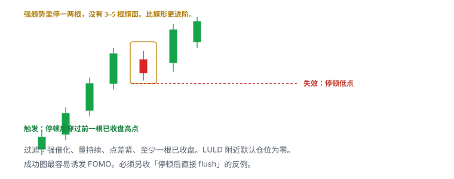
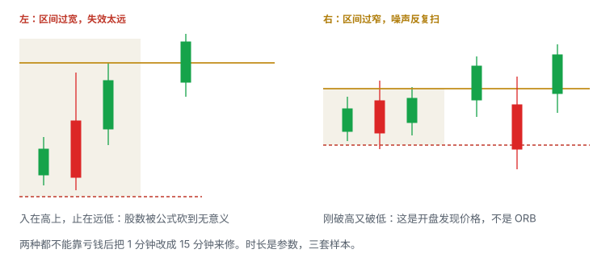
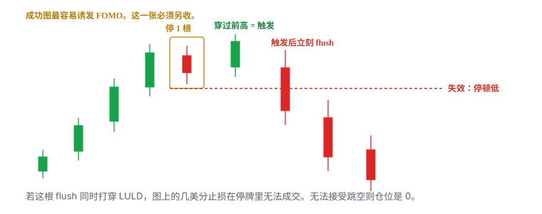
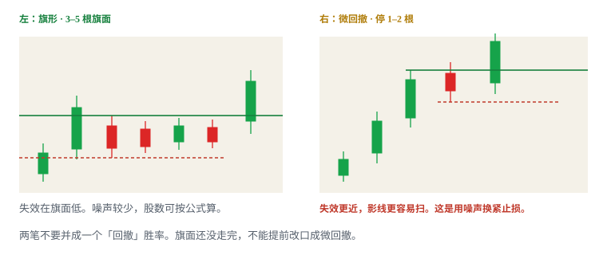
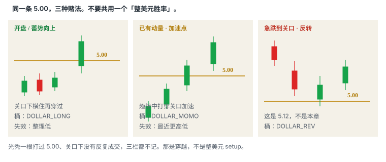

# 5.11 ORB、微回撤与整美元

> 一句话：开盘区间是事先写死时长的位置，微回撤是强趋势里停 1–2 根的形状，整美元是心理关口。三个名字可以叠在同一根 K 上，触发、失效、失败样本不能并。

前十章已经把形状（旗形、贴顶、ABCD、回踩）和两条最有名的位置（HOD、VWAP）写开。扫描器和聊天室还会把另外三个标签当成独立策略：**Opening Range Breakout**、**micro pullback**、**whole / half dollar**。它们不是三种「更高级的旗形」。一个按时钟切区间，一个按停顿根数切形状，一个按报价习惯切位置。本章把这三件写成能下单的句子，并且强制分桶。

5.9 在缺口名单、开盘窗口里用过 ORB 和整美元，桶名是 `GNG_ORB`、`GNG_DOLLAR`。缺口开盘里的 ORB / 整美元在 5.9，桶名是 `GNG_*`。本章写盘中已经 in-play 之后的微回撤和整美元。读过 5.9 的人，这里不是复习提纲：定义、触发、失效、失败、教学数都重写一遍。已经在用 `GNG_*` 记账的，缺口开盘样本继续留在 5.9；不要把同一笔再抄进本章的分子。本章默认桶是：

```
ORB_<时长>_<入场>
MICRO_<第几次>_<入场>
DOLLAR_LONG / DOLLAR_MOMO / DOLLAR_HALF
```

`DOLLAR_REV` 是急跌到关口再反转，写在 5.12，本章不做多那个假设。

数字——1 / 5 / 15 分钟区间、停 1–2 根、关口下横住十余根、缓冲几美分——全部是启发式。写进计划，用自己的 MAE 分布改。它们不是市场定律，也不是这本手册的盈利保证。

下单前仍是同一条链。填不完就没有这一笔：

```
催化 → 流动性 → 日线空间 → 盘中结构
→ 精确触发 → 精确失效 → 仓位 → 执行
```

六栏：Setup / Trigger / Invalidation / Size / Exit / No-trade。形态名只填 Setup。判断点永远在价格穿过事先画好的线并被接受的那一刻。

## 5.11.1 ORB


Opening Range Breakout（开盘区间突破，ORB）赌的不是「开盘一定涨」。它赌一件更窄的事：

**常规时段开始后的前 N 分钟，会先走出一段被市场共同看见的高低。N 走完之后，价格穿过区间高并被接受，说明这段开盘发现已经偏向多头一侧；你用区间低（或事先写死的更紧结构低）当失效，赌第一目标仍盖过 1R 加成本。**

N 必须在开盘前写死。1 分钟、5 分钟、15 分钟是课程里最常见的三档，不是法规。没有事先时长，任何人都可以事后挑一段「看起来像开盘区间」的高低，让这笔变成「其实做对了」。那不是 ORB，是作弊。

区间高、区间低必须来自**已完成成交**。未走完的影线尖、Level 2 上闪过的 ask、盘前某一笔薄量，都不是常规时段 ORB 的边界——除非你事先把定义改成「含盘前」，并且全程只用这一种。含盘前的开盘区间是另一个桶，不要和 09:30 起算的版本合并。

| | |
|---|---|
| 统计桶 | `ORB_1` / `ORB_5` / `ORB_15`，再加 `_THRU` / `_RETEST` / `_ANT` |
| 参考 | 事先写死时长的开盘区间高、低 |
| 触发 | 区间走完后，高点被穿过并接受（收盘站上，或回踩守住，写死一种） |
| 失效 | 区间低点，或更紧的结构低点（开盘前选好，含滑点） |
| 常见失败 | 事后改时长；区间过宽止损太远；过窄被开盘噪声反复扫；影线刺穿算突破；区间未走完就当 ORB |
| 不做 | 首个目标离入场不到 1R 还为了「开盘必须交易」而追；回测只用 K 线价忽略开盘滑点；开盘已远离区间低还不减仓；正在 halt 或盘口空白 |

课程提示：该形态在缓慢推进、高位盘整（grind）的股票上可能更合适。这是启发式，不是「只有 grind 才能做 ORB」，更不是「跳空股不能做 ORB」。跳空股的 ORB 若已经和盘前高、整美元叠在同一价，主桶只能选一个。

ORB 是位置加时钟，不是形状。区间里面可以是旗面、贴顶、乱砸或一根大阴大阳。形状决定你能不能找到比区间低更近的失效；时钟决定这条高线何时才合法存在。没有走完的 N，你没有 ORB 高，只有一个还在形成的 HOD。

可测试的起始写法（边界全部启发式）：

```
会话起点 = 常规时段开盘（以你的交易所为准）
时长 N   = 5 分钟（或你写死的 1 / 15）
区间高   = N 内已完成成交的最高价
区间低   = N 内已完成成交的最低价
触发     = N 结束后，1 分钟实体收在区间高上方
失效     = 区间低 − 滑点
     或：突破后第一段回撤低 − 滑点（更紧，另开子桶）
不做     = N 尚未结束
         区间宽度使股数小到无意义，又不肯减仓
         上方口袋 < 1R
         点差已吃掉计划边缘
```

「收在其上」用几根 K、哪个周期，必须事先选一个。大盘常用两根 1 分钟减少影线；小盘用两根可能已经走完你要的那段。选完用样本改，不要每笔换定义。

量能只当上下文。区间里量萎缩、离开时再扩张，是常见观察，不是许可。开盘前几分钟整段都可能放量，因为那是价格发现，不是旗面。不要把「开盘量大」读成「ORB 已确认」。突破量大但价格不前进，仍是吸收。失败样本里要单独标：刺穿后立刻回到区间内、在区间内被接受。

午后另画的「第一段 5 分钟高低」不是 ORB。ORB 的时钟锚在常规时段开盘。盘前高低、午后第一波、开盘后第 30–45 分钟的箱体，各有各的名字。把它们都叫 ORB，统计从第一天起就是脏的。

教学数。开盘前写死 5 分钟 ORB。09:30–09:35 高 5.40、低 5.18。5.42 被 1 分钟实体接受后买。失效若用 5.18 − 0.05 = 5.13，入 5.44，每股 0.31。单笔可亏 50 → 约 161 股，再按盘口砍。盘前高若在 5.48，空间 0.04，不合格——方向判断对也没有 1R。盘前高若在 5.90，空间够，但要检查 5.50 整美元和 LULD 上沿。若 09:31 已经打到 5.70，5 分钟区间还没走完：你没有 ORB，只有延伸。等区间结束再看，或改做别的已写好的桶，不要提前把未完成区间当 ORB。

回踩版另算。价格先接受在 5.42 上方，回到 5.38–5.41 守住再抬，失效可以收到回踩低。记 `ORB_5_RETEST`。两笔不要共用胜率。穿越版在开盘点差里经常才是你真实能成交的那一种；回踩更干净，但不保证出现。

向下离开区间低是另一笔，方向相反，要有 locate 和新计划。不要把亏钱的多单改口成「其实我在做 ORB 空」。本章做多只写上破。

## 5.11.2 微回撤



Micro pullback（微回撤）赌的也不是「还会涨很久」。它赌：

**已经存在的强趋势里，价格只停 1–2 根、没有走出 3–5 根旗面；停顿低点还完好。穿过停顿前那根已收盘高点并被接受之后，制造前一段冲动的买盘还没做完，且你愿意用「失效极近、噪声极高、停牌尾部更肥」换这一笔。**

它不是「更快的旗形」。旗形用完整旗面换较稳的失效。微回撤把旗面几乎删掉，止损看起来更近，被一根正常影线扫掉的频率更高。课程把它列为更进阶、在热市更有效的 setup——启发式。冷市、低相对量、点差已经拉开的名字上，同一形状经常只是随机停顿。

| | |
|---|---|
| 统计桶 | `MICRO_1` / `MICRO_2` / `MICRO_EXT`，再加周期和入场 |
| 形状 | 几乎垂直的推进中停 1–2 根，小实体或浅回撤，没有 3–5 根旗面 |
| 参考 | 停顿前一根已收盘高点；停顿低点 |
| 触发 | 停顿后穿过该已收盘高点并接受 |
| 失效 | 该停顿低点（含滑点），不是更早的旗杆底，也不是「随便几美分」 |
| 常见失败 | 停顿后直接 flush；还在同一根冲刺 K 里就把未收盘高当微高；LULD 上沿附近几美分风险被停牌跳空打破 |
| 不做 | 没有强催化、持续量、紧点差、至少一根已收盘；无法接受 halt 恢复后的离散损失（此时正确仓位是 0）；把全天每一次浅回撤并进 `MICRO_1` |

没有已收盘的停顿，就没有微回撤。还在走的大绿 K 中间塞一单，叫追 pole，不叫 micro。10 秒图上的「停顿」若你的券商成交速度跟不上，那一档对你不存在——执行限制本身就是过滤，不是技巧不够。

停顿怎么标，必须事先写死，避免事后挑影线：

```
停顿高 = 冲动段最后一根已收盘 K 的高点
停顿低 = 随后 1–2 根已收盘 K 的最低有效低
根数   = 1 或 2（写死上限；第 3 根出现就改记旗形，或放弃）
触发   = 停顿高被下一根已收盘实体接受
失效   = 停顿低 − 滑点
```

回撤期间理想状态仍是：成交量相对收缩、bid 未连续坍塌、点差不突然扩大。若穿过停顿高时 ask 不断补单而价格不前进，视为吸收，不追。这些观察和旗形同一套，只是窗口更短，误判成本更高。

必须同时具备的过滤（缺一项，降为观察或删除）：

1. **股票已经 in-play。** 新鲜可核验催化，或当天已经证明有持续注意力。没有注意力的浅回撤只是薄量抖动。
2. **量在推进段持续，而不是一根孤立天量。** 停顿段相对收缩是加分观察，不是许可。
3. **点差仍能让「停顿低」当失效。** 点差已经接近停顿幅度，图上的 0.04 风险在盘口上不存在。
4. **至少一根已收盘。** 用未收盘最高价当微高，会把大量假信号算进样本。
5. **上方口袋和 LULD 上沿仍允许 1R。** 微回撤经常出现在已经延伸、马上要撞带子的位置。

教学数。价格从 4.80 几乎垂直走到 5.16，1 分钟收盘。下一根小阴停在 5.12–5.16。触发：5.16 被下一根实体接受，入 5.18。失效 5.12 − 0.02 = 5.10，每股 0.08。看起来比旗形「安全」。但 5.10 被影线扫掉的频率更高，且 5.20 上方可能就是 LULD。单笔可亏 50 → 公式给出 625 股——在低价动量股上，这个股数往往已经被深度和 halt 暴露否决。正确动作是按尾部再砍一档或仓位写 0，而不是因为止损「只有 8 美分」就满仓。

同一段从 4.00 拉到 5.20，旗面低 4.90、上沿 5.05 的那一笔是 5.1 的旗形，不是微回撤。旗面还在走第 3 根，不要提前改口「我做微回撤，止损可以更近」。

第一次微回撤（刚离开开盘结构）和已经延伸 1R 之后的微回撤，不是同一个桶。后者记 `MICRO_EXT`。第三次及以后默认不做；若研究，单独开桶，不要用第一次的胜率给第三次壮胆。

失败要单独记账，至少三类，不要并进一个「micro 没赚」：

| 失败 | 价格做了什么 | 样本怎么标 |
|---|---|---|
| 假突破 | 穿过停顿高，立刻回到停顿内并跌破停顿低 | `MICRO_*_FAIL_THRU` |
| 未触发 flush | 停顿低先破，触发从未发生 | 不是亏损单，是 no-trade / 观察 |
| halt 跳空 | 图上止损没碰到，恢复价已远离 | 尾部事件，单独开栏，不并进普通 MAE |

成功图最容易诱发 FOMO。练习时强制另收「停顿后直接 flush」的反例，数量至少和成功图同级。否则你会只记得垂直上涨那一张。

## 5.11.3 整美元 / 半美元


整美元（`$x.00`）和半美元（`$x.50`）是报价习惯堆出来的心理关口，不是预测公式。止盈、止损、条件单、整手习惯、扫描器取整，都容易落在这些数上。挤提高关注和波动，也提高假突破密度。价位本身不是优势。

本章做多只写这一种假设：**价格在关口下方真正横住、反复成交，然后穿过关口并被接受；失效在整理低。** 光秃一根打过 5.00，没有蓄势，不记本章的整美元，那是位置穿越。急跌到 5.00 再抄，是 5.12 的反转，不是这里。

| | |
|---|---|
| 统计桶 | `DOLLAR_LONG`（开盘 / 蓄势向上）、`DOLLAR_MOMO`（已有动量里的加速点）、`DOLLAR_HALF`（半美元单独开，若你样本够） |
| 参考 | 整美元或半美元，画成区，至少盖住点差 |
| 触发 | 关口下方蓄势后穿过并接受；或破了再回踩关口守住（分成 `_THRU` / `_RETEST`） |
| 失效 | 整理低点或清楚的微结构低点，不是统一 10 或 20 美分 |
| 常见失败 | 把整齐数字当优势；入场已经在突破 K 顶部，方向对但盈亏比很差；trade-through 后回落到关口下方；高价股固定股数 |
| 不做 | 关口附近没有反复成交、没有整理；一次跳动就跨过 0.50，半整数没有执行意义；点差已经接近 0.20 还画精确到 1 分的线 |

关口附近是否真的反复成交、是否有整理，比数字是否整齐更重要。4.92–4.98 横了十余根，比「现在是 4.99」更接近本章定义。7.00 和 10.00 通常比 7.00 旁边的 6.00 更挤——不是因为 10 更神圣，是因为更多人把整十当目标。哪几个整数更挤，用你的股票池自己数，不要背名单。

高价股在关口附近一次假突破的绝对金额更大。固定股数会放大损失。止损来自结构。20 美元的股票和 2 美元的股票，不能共用「关口下 10 美分」。

三种入场在关口上同样要拆：

| 入场 | 在 5.00 上长什么样 | 主要风险 |
|---|---|---|
| 预判 | 买在 4.92–4.98 的整理里 | 关口从未被接受 |
| 穿越 | 实体第一次站上 5.00 | 滑点、假突破、入在 K 顶 |
| 回踩 | 破了回到 5.00–5.02 守住 | 可能不给回踩 |

开盘点差宽时预判经常被点差吃掉。样本不够先只做一种。

整美元和半美元不要默认同分布。半美元另开 `DOLLAR_HALF`，或字段标记 `level=half`。一次跳动就跨 0.50 的股票，半美元没有执行意义——那一条在 5.11.14 展开，这里先写成硬过滤：点差或一跳已经吃掉半美元间距，就不画这条触发线。

教学数。价格在 4.92–4.98 横了十余根 1 分钟 K，量缩。5.00 被实体接受，入 5.03，整理低 4.90，滑点 0.03，失效 4.87，每股 0.16。上方日线供给 5.35，空间够。若没有横盘、开盘直接从 4.70 一根打到 5.08，这不是整美元 setup，是延伸开盘或光秃穿越。

半美元教学数。3.42–3.48 反复测试后 3.50 被接受，入 3.52，整理低 3.40，滑点 0.03，失效 3.37，每股 0.15。到 4.00 有空间。若这只股票平时一跳 0.08、点差 0.06，3.50 仍可能有意义；若一跳 0.40，这笔从一开始就不该进 `DOLLAR_HALF`。

对照统计穿越后回落到关口下方的样本，避免「整美元必涨」的错觉。成功图只说明有人在关口上停过；失败图说明同样的人也可以在关口下把止损扫完。关口被接受之后，它变成阶梯上的一层，可以做回踩候选；被拒绝并在下方接受，它从「突破位置」变成阻力。角色来自成交，不来自 `$` 这个字符。

## 5.11.4 三个名字必须拆开，不许混统计

本章是一个知识簇，不是一个策略。并成「ORB / 微回撤 / 整美元总胜率」，样本是脏的。

| 名字 | 它到底是什么 | 时钟约束 | 失效通常在 |
|---|---|---|---|
| ORB | 位置 + 事先时长 | 区间必须先走完 | 区间低或更紧结构低 |
| 微回撤 | 形状（停 1–2 根） | 无开盘时钟，但要已有强趋势 | 该停顿低 |
| 整美元 / 半美元 | 心理位置 | 无时钟；要关口下蓄势 | 整理低 |

同一分钟里，5 分钟 ORB 高可以正好是 5.00，突破那一下前面只停了 1 根。事后能叫三个名字。事前必须写死主桶：你用来定义失效的那一个。其余写成 confluence 备注，不另计一笔赢家，也不当成三个独立概率相乘。

不要做的混法：

- 用 ORB 的胜率给微回撤壮胆；
- 用整美元的「大家都看着」给没有整理的光秃穿越开绿灯；
- 把 5.9 缺口开盘的 `GNG_ORB` 和本章盘中再做的 `ORB_5` 合成一个数；
- 把 `DOLLAR_LONG`、`DOLLAR_MOMO`、`DOLLAR_REV` 合成「我会做整数位」；
- 旗形走完 4 根之后失败，改口成微回撤「其实不该进」。

形状栏、位置栏、时钟栏分开填。缺一栏，这笔在复盘里只能当操作记录，不能进期望值。

## 5.11.5 ORB 的区间长度是参数，不是盘中灵感

三种常见时长是三套策略。样本不够时，只做一种。

| 时长 | 更像什么 | 主要代价 |
|---|---|---|
| 1 分钟 | 开盘第一根的高低 | 噪声最大，点差最宽，假突破最多 |
| 5 分钟 | 课程和小盘里最常见的折中 | 仍常与盘前高、整美元重叠 |
| 15 分钟 | 大盘、指数、更慢的股票 | 区间往往更宽，股数被砍；真正触发更晚 |

今天做 5 分钟 ORB，就不要在亏钱后改口「其实 15 分钟区间还没破」。事后改时长，和事后改「第几次」、事后改周期，是同一种作弊。样本作废。

开盘前写死：

```
主图周期: 1m
ORB 时长: 5m
区间起算: 常规时段开盘，不含盘前
接受: 1 根 1m 实体收在区间高上
失效: 区间低 − 事先写死的滑点
禁止: 亏钱后改 15m；区间未结束提前叫 ORB
```

大盘常把个股 ORB 和指数自己的开盘区间一起看。指数先破自己的区间，个股多单是减仓、收紧还是直接不做，必须事先写。不要临场决定「这一只会抗住」。指数条件和个股 ORB 是一个假说里的两层，不是两个 setup。

小盘的开盘区间经常就是停牌和真空的前奏。区间很漂亮，不表示恢复后还在。按「可能暂停且无法退出」算仓位。

## 5.11.6 区间过宽、过窄、还没走完



区间宽度不是审美，是每股风险。

**过宽。** 止损太远，按公式股数会小到没有意义，或你偷偷改用更近的假止损。假止损钉在噪声区，不是结构失效。正确动作：承认这笔 ORB 的 1R 买不起，放弃，或改等突破后的回踩把失效收到新的微低——那是 `ORB_5_RETEST`，另一笔。

**过窄。** 开盘噪声反复扫高又扫低。胜率被开盘发现价格的随机性主导。那不是「高质量 ORB」，是你把还没结束的拍卖当成了突破。正确动作：这种股票今天可能根本不该用 ORB，改等第一段真正的旗面或回踩。

**还没走完。** 09:32 打出新高，5 分钟 ORB 在 09:35 才存在。提前把当前高当区间高，等于在用一个每分钟都在改的 HOD，却享受「ORB」这个名字的心理安慰。扫描器连续报警「新高」，不是很多独立 ORB。

两种宽度问题都不能靠把区间改到「刚好没扫到」来修。参数在样本外调整，旧样本不重新贴标签。

开盘首分钟点差、成交速度和 halt 风险都更高。回测使用 K 线 high / close 会低估真实执行成本。绩效入场价是实际均价，不是图上第一次穿过区间高的那一像素。

## 5.11.7 盘前高、开盘区间高、HOD 不是同一条线


早盘最容易把三条线叫成一个「高点」。

| 线 | 何时存在 | 典型误用 |
|---|---|---|
| 盘前高 | 开盘前就能标 | 开盘第一根刺穿盘前高，当成 ORB 或 HOD |
| 开盘区间高 | 你事先定义的前 N 分钟走完才有 | 区间还没走完就当「今日高点突破」 |
| 常规时段 HOD | 开盘后随成交更新 | 把盘前最高一笔薄量算进来；或 ORB 高已经被后来的新高替代，计划还钉在旧线上 |

盘前高可以高于、低于或等于后来的 ORB 高。高开缺口里，盘前高常常就是开盘后第一层，ORB 高可能贴在它上面，也可能一开盘就把它留在下方。低开反弹里，整个开盘区间可以都在盘前高之下。日志写来源，不要写「高点」。

HOD 会更新。ORB 高在 N 结束那一刻钉死，不再跟着跑。这是 ORB 相对 HOD 唯一清楚的好处：参考位不会在你下单后改名字。好处到此为止。钉死不表示它更准。

ORB 高被接受之后，它变成阶梯上的一层，可能做回踩候选。新的 HOD 若继续走远，你若还把止损写「ORB 高下方」却不去更新结构，那是把动态趋势误当成固定墙——和 5.10 里「止损跟着 HOD 跑」是镜像错误。失效应钉在你事先选的那一个结构低。

5.10 要求：在 HOD 栏里不要偷装 ORB，在 ORB 栏里不要偷装盘前高。本章重复这一句，因为违反它的样本会同时污染三章的统计。

## 5.11.8 ORB 的三种入场，以及它怎么失败


| 入场 | 在 ORB 上长什么样 | 优点 | 主要风险 | 桶后缀 |
|---|---|---|---|---|
| 预判 | N 还没结束，或高还没破，买在区间里 | 均价较低 | 突破从未发生；开盘点差常把「更优均价」吃掉 | `_ANT` |
| 穿越 | N 结束后穿过区间高的那一下 | 条件已触发 | 滑点、追高、假突破 | `_THRU` |
| 回踩 | 破了再回到区间高附近守住 | 失效往往更清楚 | 可能不给回踩 | `_RETEST` |

开盘阶段预判默认禁做，或单独开桶且仓位再砍。点差一宽，线下方的「便宜」是幻觉。样本不够时，先只做穿越或只做回踩，不要两种都做却记成一种。


穿过不是接受。一根长上影插过区间高又收回来，是试探。用未收盘最高价当「已经 ORB」，会把开盘拍卖算进突破样本。

失败之后角色立刻换：区间高从「突破位置」变成「失败高点」。按失效走，不等待「再给一次机会」，**不自动反手做空**。反手是新的一笔。不要把失败 ORB 改名为长线，也不要改名为微回撤「等它再停一下」。

时间退出要写进计划。破了区间高之后横盘，既可能是蓄势，也可能是买盘衰竭。观察回落是否守住旧高、量是否收缩、再上冲有没有新增成交。N 分钟内不推进则减半或退出——N 另写，不要和开盘区间时长共用一个字母却不声明。

## 5.11.9 微回撤只在已经存在的强势里才合法

微回撤的前置条件比 ORB 更苛刻。ORB 至少还有时钟帮你定义「先等一段」。微回撤没有时钟，只有「已经很强」这一句——而「很强」最容易被 FOMO 伪造。

合法前置：

- 左侧看得见一段相对快速、方向清楚的冲动，通常伴随区间扩大和量扩张；
- 股票当天已经证明有人持续参与，而不是扫描器第一次闪过；
- 你能指出停顿的那 1–2 根，而不是在冲刺 K 的中段想象一个高点；
- 停顿没有把冲动段的大部分还回去。还回去了，延续假设变弱，那是更深的回撤或失败，不是 micro。

非法前置：

- 因为别人都在买；
- 因为刚才一笔旗形赚了；
- 因为 5 分钟还是大绿、1 分钟「看起来要停」；
- 因为课程说热市更有效，今天聊天室很热闹。

热市 / 冷市要量化。可记录：当天通过筛选的名字数、开盘 15 分钟中位点差、LULD pause 数、同 setup 最近 20 笔期望值。阈值本身是启发式。用热市样本证明冷市也能做微回撤，是本书别处已经写过的错误，本章继续禁止。

课程录制于异常活跃的 2020–2021。按市场状态分组。抛物线（描述性经验：约 5 分钟 10%、当日可能 50%，不是法规）里，任何微回撤的尾部都更肥。历史最大涨幅不是目标。先按停顿低定义 1R，再决定这一层还做不做。

反应慢就不要做这一层。学习顺序按执行难度，不按刺激程度。旗形和第一次完整回撤还没在模拟盘里扣除滑点后站得住，微回撤对你不存在。

## 5.11.10 停顿后 flush，以及 LULD 附近的几美分幻觉



微回撤最常见的失败不是「没涨」，是**触发后立刻反向，停顿低被一根扩幅 K 打穿**。成功图几乎垂直，停一下再垂直；失败图在停一下之后同样垂直，只是方向反了。当下外观相似。所以：

- 样本必须另收 flush 反例，不能只留继续上涨；
- 触发后推进的时间窗口要写死（例如 1–3 根不走则减）；
- 失效就是停顿低，破了就走，不要改口「这是更深的回踩，我改做 dip」。

dip 是 5.4 / 5.5 的另一笔，要有新的参考位和新的股数。微回撤失败改名 dip，和 HOD 失败改名长线，是同一类错误。


LULD 是市场结构保护，不是上涨确认。微回撤经常出现在带子附近：看起来每股只亏 5–8 美分，进入停牌后普通止损无法成交，恢复价可以远离任何你画过的线。若无法接受 halt 恢复后的离散损失，正确仓位是 0。不要用「只亏几美分」给 halt 股票配大股数。

当前 band 以交易所实时信息为准，不要背课程旧表。进入停牌前控制仓位；恢复后重新观察可见报价。复牌是价格发现，不是免费缺口。

10 秒微回撤、IPO 首日微回撤、halt 恢复后第一根微回撤，各开各的桶，或直接列为禁做。券商慢、热键不熟、模拟盘没有真实延迟，这三档对你的期望值通常为负。

## 5.11.11 微回撤、旗形、HOD 穿越：同一段趋势里的三笔账



同一段从 4.00 拉到 5.20 的走势，可以同时被叫成三种名字。必须在事前写死你做哪一种。

| 你等的结构 | 失效通常在 | 更像什么 | 日志 |
|---|---|---|---|
| 3–5 根缩量旗面 | 旗面低 | 5.1 旗形 | 旗形，不是 MICRO |
| 停 1–2 根再穿前高 | 那一根的低点 | 微回撤 | `MICRO_*` |
| 没有旗面，直接打当日最高 | 最近更高低点，往往很远 | HOD 穿越 | 5.10，不是本章 |

教学数再写一次，三个桶用同一段价格，方便对照，**不要把三笔补成一个赢家**：

```
旗面低 4.90，上沿 5.05
入 5.08，失效 4.87（含滑点），每股 0.21

微回撤停在 5.12–5.16
入 5.18，失效 5.10，每股 0.08
5.10 被影线扫掉更勤，5.20 上方可能是 LULD

HOD 在 5.20
入 5.28，失效还想用 4.90，每股 0.38
这是追
```

三种不要补成「先旗形、再微回撤、再 HOD 加仓」的完美路径，除非每一笔都单独满足六栏，并且全仓风险重算后仍在预算内。加仓改均价见卷四。第一次的赢家如果还拿着，第二次是加仓，必须重算；更常见的正确动作是第一笔按计划减，第二笔当新的一笔，股数按新失效算，且默认更小。

「第几次」必须声明周期。1 分钟可能已经第三次浅停，5 分钟仍只是一根扩张 K。`MICRO_1_1m` 和 `MICRO_1_5m` 不要合并。不要盘中把亏钱的 1 分钟样本改口成「其实是 5 分钟第一次」。

## 5.11.12 关口本身不是优势，关口下方必须有蓄势


整美元 setup 最容易被听成：「看到 5.00 就准备买。」正文不是这个意思。没有蓄势的关口，只是一个很多人看着的数字。看着不等于在下方承认过它。

蓄势的最低标准（启发式，写死你认哪几条）：

- 关口下方有一段可标高低的整理，而不是一根刺；
- 整理里至少有两次接近关口后的回落，说明这个价被交易过，不是你事后画的；
- 回落没有把整理低不断下移——低点下移是供给还在，不是「测得越多越容易破」；
- 量在整理里相对收缩、在穿过时有推进，仍只是观察，不是许可。

只满足「现在的价格带 00」四个字符，不满足上面任何一条，仓位写 0。

突破 K 已经离开整理低一个完整 1R，还按整美元的名字下满仓，是追。正确动作是等回踩关口，或放弃。入场已经在突破 K 顶部，方向判断正确，盈亏比仍可能很差——5.9 写过这句，本章的失败样本里它会反复出现。

大额可见 ask 停在 5.00 上，可能成交、撤单或被冰山补充。截图不能说明它下一秒会怎样。它增加执行难度，不是第五个确认。完整读法在卷三。不要把「关口上有大卖单被吃掉」写成独立概率再乘进胜率。

## 5.11.13 整美元的三种语境，不许共用胜率



同一条 5.00，至少有三种完全不同的赌法：

| 语境 | 假设 | 统计桶 | 写在哪 |
|---|---|---|---|
| 缺口股开盘，关口下蓄势向上 | 开盘发现后关上被接受 | `GNG_DOLLAR` 或本章 `DOLLAR_LONG`（只选一个记） | 5.9 / 本章 |
| 已有盘中动量，关口成为加速点 | 趋势中的心理门槛被打穿 | `DOLLAR_MOMO` | 本章 |
| 急跌到关口，赌下跌失败 | 逆势反应 | `DOLLAR_REV` | 5.12，本章禁做 |

`DOLLAR_LONG` 和 `DOLLAR_MOMO` 都在本章出现，仍要拆开。前者经常还在开盘后第一段、整理更久、失效可以放到横盘低。后者经常已经离开 VWAP 和开盘区间，整理更短，失效只能放到最近更高低，尾部更肥。用开盘横盘那一笔的胜率，给午后抛物线打 10.00 壮胆，是脏样本。

半美元单独开 `DOLLAR_HALF`，或在日志里用字段标记 `level=half`，不要假设 4.50 和 5.00 同分布。低价股上半美元可能真的有反应；一次跳动就跨 0.50 的股票上，4.50 只是价格路过。

动量股常把整数、半整数、停牌线、第一次 / 第二次回撤叠在同一走势里。这些条件彼此相关，不能把五个价位标签当作五个独立确认。主参考位是你用来定义失效的那一根。

## 5.11.14 半美元何时没有执行意义

半美元不是「小一号的整美元」。它有没有意义，取决于波动和点差，不取决于你想多画一条线。

不做半美元（或画了也不当触发）的几种：

- 一跳就跨过 0.50，线在成交里从不被单独承认；
- 点差已经接近 0.20，精确到 0.50 的线会被点差淹没；
- 价格在 20、50、100 这种大关口附近，中间的 x.50 注意力被整十抢走；
- 你无法指出半美元下方的整理，只是价格从 4.40 走到了 4.60。

反过来，低价股在 2.50、3.50 反复横住，半美元可以比旁边一个没什么人看的整美元更挤。用样本数，不要用信仰。计划里写：

```
半美元启用条件:
  该股近 20 个交易日在 x.50 有可标记反应
  且当日点差 < 半美元间距的 1/5（启发式）
否则: 只画整美元，半美元当备注
```

高价股的整美元本身就要减仓。假突破一次 0.30，200 股已经是 60 美元，超过很多账户的单笔预算。固定「整美元我都买 200 股」是用股数代替结构。

## 5.11.15 同一条价格路径上的三个标签

教学路径（不是某只股票）：

```
09:30–09:35  高 5.00，低 4.78     ← 5 分钟 ORB 高刚好是整美元
09:36        一根小阴停在 4.94–5.00
09:37        实体穿过 5.00
```

这一分钟可以叫：`ORB_5_THRU`、`MICRO_1`、`DOLLAR_LONG_THRU`。三句话描述同一事件。合法日志只记一个主桶。主桶怎么选，开盘前写优先级，例如：

```
有事先写死的 ORB 且区间已结束 → 记 ORB
否则有关口下明确整理 → 记 DOLLAR_*
否则只有 1–2 根停顿 → 记 MICRO
禁止: 三个都记赢
```

优先级可以改，但要写进 `strategy_version`，并且旧样本不重新贴标签去美化曲线。5.10 对 HOD + VWAP + 贴顶写过同一条：重合是一个价带上的一次事件。

处理重合：

1. 把 4.96–5.04 画成带，不要三根细线抢 5.00；
2. 触发写一个价（「5.00 被接受」），失效写一个结构低（「4.78」或更紧的 4.94，事先选）；
3. 第一目标写带外的下一层（5.20、5.50、日线供给），不要把目标设在 5.06；
4. 统计时主位置只标一个。

若失效你选了 4.78，每股风险按 ORB 算，就不要在日志里享受微回撤「只亏 6 美分」的幻觉。选了 4.94，就承认这是更紧的微结构，噪声扫出归这一笔，不要事后说「其实 ORB 低还没破，我不该停」。一笔交易只能有一个失效。

## 5.11.16 口袋、点差、停牌、仓位


三个 setup 都经常死在「破了马上撞下一层」。ORB 高贴着盘前高，盘前高贴着整美元，整美元贴着 LULD。图上热闹，账上没有空间。

先量三截：

1. 入场到失效：每股风险；
2. 入场到第一阻力：口袋；
3. 点差与可见深度：现在能否按计划进出。

(2) ÷ (1) 先够约 1R，再谈第二目标。空间不够是位置问题，不是胆量问题。正确动作常常是不交易，或等回踩把 (1) 收近。不要指望「这是整美元 / 这是 ORB，破了就会跑很远」。

股数公式不变：可亏金额 ÷（入场到失效 + 滑点），再取流动性、halt 暴露、单日剩余额度的最小值。开盘默认再砍一档——启发式。微回撤因为尾部更肥，再砍一档。不要用挑战赛或别人的热键股数。

三个必须分开的数字：

| 名字 | 本章特别容易混 |
|---|---|
| 名义敞口 | 「微回撤只买 400 股」在 5 美元和在 halt 带下不是同一句话 |
| 计划风险 | ORB 用区间低当止损时，1R 会突然变得很大 |
| 尾部风险 | halt、开盘跳空、盘口消失，计划止损覆盖不了 |

点差已经拉宽就放弃。可成交限价给最坏价格边界，不消灭滑点。高速行情里微回撤和 ORB 穿越用市价可能不可接受。不成交就放弃，不能沿着新高无限改价追。

退出：风险失效优先出去，不为更好价格继续暴露。赢家和输家不应使用同一耐心。卖出后把心理止损调到平均成本，只是价格上的保本；费用与滑点仍可能使净结果为负。

## 5.11.17 教学总例：同一只股票，三个名字怎么记

教学用整数，不是某只股票，也不是推荐。昨收 4.60。盘前高 4.95，盘前低 4.70，日线供给 5.40。催化有原始公告。盘前累计成交够计划 300 股进出，点差 0.03–0.06。单笔可亏 50。滑点预算 0.04。开盘前写死：主周期 1 分钟；ORB 用 5 分钟；主桶优先级 ORB > DOLLAR > MICRO；不做预判；开盘延伸则仓位 0；半美元 4.50 已在下方，今天只认 5.00。

**延伸开盘。** 09:30 打印 5.30。盘前高、任何可画的近端低都在远处。三个 setup 全不合格。仓位 0。等回踩 5.00 或 4.95 形成新的近端结构，那是新的一笔。

**合格 ORB。** 09:30–09:35 高 5.00、低 4.82。09:36 小阴 4.94–5.00。09:37 实体收 5.06。按优先级记 `ORB_5_THRU`。入 5.06，失效若用区间低 4.82 − 0.04 = 4.78，每股 0.28，约 178 股，再砍。到 5.40 有 0.34，约 1.2R，勉强合格。不要再记一笔 `DOLLAR_LONG` 和一笔 `MICRO_1`。

**改用更紧失效。** 若你事先写的是「突破后第一段回撤低」，失效可以收到 4.94 − 0.04 = 4.90，每股 0.16。那必须开盘前就写在计划里，并且这笔改记 `ORB_5_RETEST` 或单独的紧止损子桶。不能 09:37 看了盘口再决定用哪个低点。

**不合格整美元。** 若 09:30–09:35 高是 5.12、低是 4.88，价格从 4.90 一根打过 5.00，关口下没有横盘——`DOLLAR_LONG` 今天空着。5.00 只是路过。

**不合格微回撤。** 若冲动段只有 0.08、停顿那根上下影把整段都包进去，没有「已经很强」。不要因为名字好听就进 `MICRO_1`。

**盘中动量整美元。** 午前已经离开开盘区间，沿 9 EMA 走到 5.42–5.48 横住，再穿 5.50。这是 `DOLLAR_MOMO` 或 `DOLLAR_HALF`，不是开盘那笔 ORB 的加仓理由。失效用 5.42 一带的整理低，重算股数，默认更小。5.50 上方若立刻是 LULD，仓位 0。

**微回撤出现在延伸段。** 5.50 之后只停 1 根再穿。记 `MICRO_EXT`。过滤一项不过（点差、halt、口袋）就不做。不要说「开盘 ORB 做对了，这是同一趋势的免费加仓」。

当天结束时，合法日志可能是：一笔 `ORB_5_THRU`、一笔明确的 no-trade（延伸开盘）、一笔 `DOLLAR_MOMO` 或跳过。非法日志是：把这些合成「今天 5.11 赢了 2R」。

## 5.11.18 失败模式总表

| 你看见的 | 实际是什么 | 正确动作 |
|---|---|---|
| 开盘 90 秒就创新高 | 区间未走完 | 不是 ORB；仓位 0 或等 N 结束 |
| 1 分钟 ORB 亏了，改口 15 分钟 | 事后改参数 | 样本作废 |
| 区间从 4.20 到 5.10 | 过宽 | 放弃或等回踩，不伪造近止损 |
| 区间只有 4 美分，来回扫 | 过窄 / 开盘拍卖 | 今天可能不该用 ORB |
| 影线刺穿区间高立刻收回 | 试探，不是接受 | 不进；或等回踩规则 |
| 停 1 根再穿，随后 flush | 微回撤失败 | 按停顿低走；不改名 dip |
| 还在大绿 K 中段下单 | 追 pole | 不是 MICRO |
| 热市样本证明冷市也能 micro | 状态没分组 | 分开记账，冷市默认不做 |
| 看到 5.00 就买 | 数字当优势 | 先找关口下整理 |
| 光秃打过整美元 | 位置穿越 | 不记 `DOLLAR_*` |
| 急跌到 5.00 抄 | 反转假设 | 去 5.12，不要进本章分子 |
| ORB 高 = 5.00 = 微高 | 同一路径 | 只记一个主桶 |
| 点差从 0.03 跳到 0.12 | 执行环境坏了 | 放弃或按新点差重算，通常放弃 |
| 止损「只有 6 美分」且靠近 LULD | 尾部不是 6 美分 | 仓位 0 或按跳空暴露砍 |
| 第一笔赚了给第二笔加倍 | 用结果给新风险开绿灯 | 每笔重算，默认更小 |
| 四个窗口同时拉 | 注意力分散 | 只做名单上 R 最清楚的一只 |
| 失败后立刻反手 | 新的一笔没有计划 | 先出来；空头要有 locate |

假突破之后：不等待「再给一次机会」；按失效减仓 / 平仓；检查是否成为多头陷阱（5.12）；不自动反手；记录滑点和「在上方停留了多久」。

## 5.11.19 日志、检查表、学习顺序

每笔至少记下：

```text
日期 / 时段（开盘后前一段 / 午前 / 午后 / 收盘前）
symbol
主桶（ORB_* / MICRO_* / DOLLAR_*）
周期、ORB 时长、第几次（声明周期）
入场类型（预判 / 穿越 / 回踩）
形状栏、位置栏、时钟栏
重合的其它标签（备注，不计入独立确认）
催化、float 来源与日期、相对量、市场状态
入场、失效、第一目标、计划 R
入场距停顿低 / 区间低 / 关口的距离
距 VWAP、HOD、盘前高、LULD 上沿的距离
下单类型、期望价、实际均价、最差一笔、部分成交
点差、可见深度、是否 halt、最大不利跳空
MAE / MFE
1 / 5 / 15 分钟后的结果
退出是否符合原计划
有没有违反六栏
strategy_version
```

「至少各 20 个成功和失败」是课程训练量的启发式。你的最小样本量写在计划里，按波动状态分组。不可交易（点差 / 深度不够）要标出来，计入命中率分母，不计入可执行期望值分子。只收藏后来大涨的图，会高估任何过滤。

复盘时把画面停在入场前，逐项写：

- 当时区间走完了吗？停顿那根收盘了吗？关口下整理看得见吗？
- 主桶是事先写的那个吗？
- 到第一阻力是否 ≥ 1R？
- 如果没有后来的大绿 K，这笔入场仍合理吗？
- 实际均价相对计划价滑了多少？
- 有没有因为第一笔赚钱而给第二笔加码？
- 有没有事后改时长、改第几次、改周期？

Bad risk 应在入场时有客观定义。如果只给亏损交易补标，会产生事后偏差。错过的交易单独记在 `MissedTrades`，不要把「没追到的大阳线」记成策略损失。

入场检查表：

- 三个名字你事前选了哪一个？失效写在哪？
- ORB：N 结束了吗？高、低钉死了吗？过宽或过窄？
- 微回撤：已收盘停顿在哪？过滤五项过了吗？这是第几次、是否已延伸？
- 整美元：关口下有整理吗？这是 LONG、MOMO 还是你偷做的 REV？
- 半美元今天有执行意义吗？
- 入场离失效多远？按这个距离能买多少股？深度接得住吗？
- 口袋够不够约 1R？LULD 上沿呢？
- 点差是否仍在预算里？
- 预判 / 穿越 / 回踩，你记的是哪一种？
- 若立刻 halt 或假突破，最大损失是否可承受？
- 这笔是看见线被接受，还是害怕错过？

学习顺序（执行难度，不是收益排序）：

```
有整理的整美元（DOLLAR_LONG）
  → 5 分钟 ORB 回踩
    → 5 分钟 ORB 穿越
      → 动量里的整美元（DOLLAR_MOMO）
        → 第一次微回撤（过滤全过）
          → 延伸段微回撤 / 1 分钟 ORB / halt 附近
            → 默认禁做
```

前一层只有在模拟盘有足够样本、扣除滑点后仍能稳定执行，才考虑下一层。反应慢选择更慢的一层，而不是为了模仿讲师的 1 分钟手速硬上微回撤。

## 先记住这些

- ORB 是事先写死时长的开盘区间。区间未走完，没有 ORB。
- 微回撤是强趋势里停 1–2 根，不是更快的旗形。失效近，噪声和停牌尾部都更大。
- 整美元 / 半美元是心理位置。关口下没有蓄势，就没有本章这个 setup。
- 三个名字可以叠在同一根 K 上。主桶只有一个：你用来定义失效的那一个。
- 每种都有自己的触发、失效、失败。不要并成一个胜率。
- 穿过并被接受才是触发。影线、未收盘最高价、数字好看，都不是。
- 追 = 离失效位太远。开盘已延伸、突破 K 顶部、LULD 前的「几美分止损」，都按这个定义处理。
- 开盘仓位默认更小。微回撤再小一档。无法接受 halt 跳空则仓位是 0。
- 最终要识别的是：哪里证明想法成立、哪里证明想法失效、按真实流动性可以下多大。

## 不要做的事

- 事后把 1 分钟区间改成 15 分钟，让这笔变成「其实做对了」。
- 区间还没走完就叫 ORB，或把盘前高、HOD、ORB 高混成一个「高点」。
- 把预判、穿越、回踩，或 `DOLLAR_LONG` / `DOLLAR_MOMO` / `DOLLAR_REV`，并成一个胜率。
- 把五个价位标签乘成五个独立概率。
- 在还没收盘的冲刺 K 里做微回撤。
- 只用成功的垂直图，不收停顿后 flush 的反例。
- 用热市样本证明冷市也能做微回撤。
- 看到 `$x.00` 就买；光秃打过关口还记整美元。
- 高价股固定股数；统一 10 美分止损。
- 在 LULD 附近用「只亏几美分」的假设。
- 失败后改口说在做 dip、做长线、做反转，或立刻反手。
- 第一笔赚了就给第二、第三次加码。
- 引用课程 jpg 截图或加密货币图当证据。
