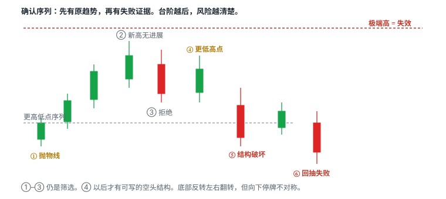
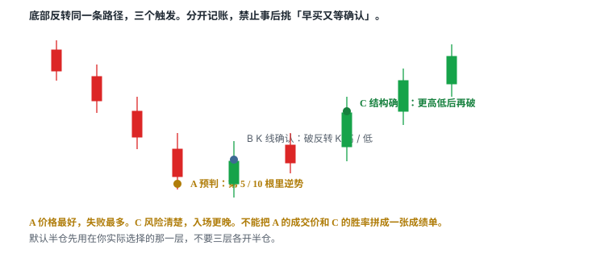
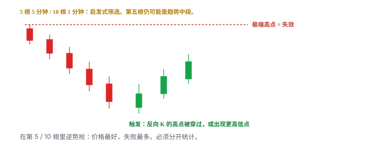
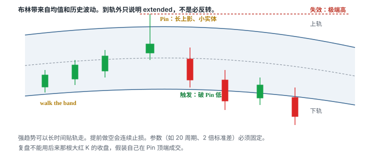
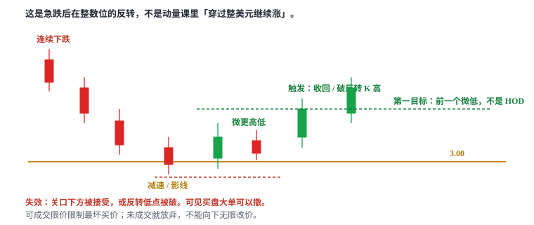
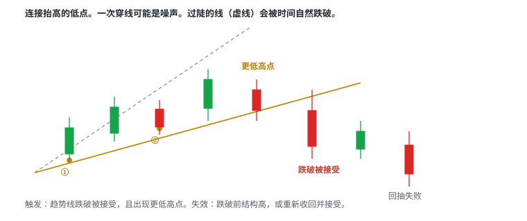
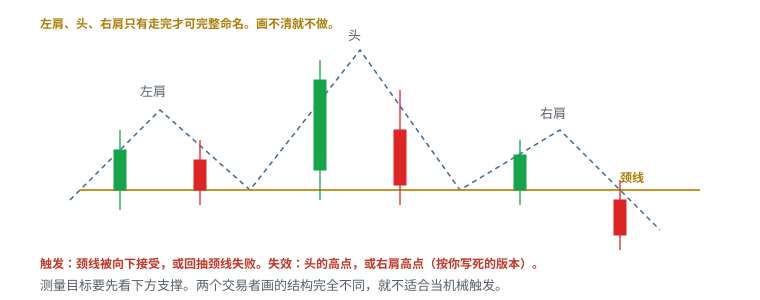

# 5.12 反转与陷阱

> 一句话：反转和 trap 都在交易「原方向失败」。没有失败证据的「反转」只是猜顶底。

前面几章做的是延续：旗形、贴顶、回踩、红翻绿、Gap and Go、第一次回撤、HOD、动量里的整美元。那些假设都是「原来的方向还在」。本章反过来：原方向已经走得足够远，你要等它**失败**，再做相反的那一侧。

失败必须被价格走出来。连续绿 K、RSI 超买、碰到布林上轨、碰到整美元、碰到 200 EMA，都只说明 extended 或到达了一个很多人看着的位置。市场可以在 extended 状态继续更久，久到超过账户能承受的时间。Scanner 报警说明价格进了你预设的极端区，不代表此刻必须逆势进场。

反转是逆势。默认规则（启发式，必须用自己的样本校准，不是照抄）：

- 使用延续风险的一半；
- 等确认，而不是在第 5 / 10 根里抢；
- 不在 halt 带附近猜；
- 不平均加仓；
- 第一目标保守到 VWAP 或最近支撑 / 阻力；
- 新高（做空反转）或新低（做多反转）立即失效。

延续和反转必须分开统计。一张先抛物线、再回撤、再恢复的图，顶部反转、下跌延续、底部反转是三个不同假设。一次回撤不能证明长期趋势结束。先写交易周期、方向和失效点，避免同一仓位不断改故事。

课程把反转拆成两处讲：形态课里的顶部 / 底部、VWAP fade、趋势线跌破、头肩、trap；策略课里的连续 K、布林外侧 Pin、整美元反转、日线 200 EMA。名字不同，共同核心只有一句：**先有原趋势，再有失败证据。**

## 5.12.1 这一章和延续章怎么分开

同一根 VWAP、同一条整美元、同一段急跌，可以同时被三章认领。必须在事前写死你做哪一种，否则每笔都能在事后找到一个赢的叫法。

| 你以为自己在做 | 实际假设 | 写在哪 |
|---|---|---|
| 突破后回踩到 VWAP | 旧阻力已转支撑，趋势还在 | 5.4 / 5.10 |
| 急跌后的 flush dip | 上涨结构被砸，赌砸完还有承接 | 5.5 |
| 急跌到整美元再反转 | 下跌趋势出现失败，做相反方向 | 本章 |
| 穿过整美元继续涨 | 心理关口被接受，动量延续 | 5.6 / 5.11 |
| VWAP 突破做多 | 从下方接受，转支撑 | 5.6 / 5.10 |
| VWAP fade 做空 | 从下方碰到后被拒绝 | 本章 |

失效位可能画在同一条线上，故事完全相反。日志里的 setup 名必须能让三个月后的你分清当时赌的是哪一句。

底部反转也不是 5.5 的 flush dip。flush dip 发生在**已经存在的上涨**里，你赌这是回撤不是变盘。底部反转发生在一段已经走出来的下跌之后，你赌下跌本身失败。图形都可以先红后绿，统计桶不能合并。

## 5.12.2 延续和反转必须分开统计



一张先冲高、再大幅回撤、再逐渐恢复的图，会被三种人同时圈起来：

- 顶部反转的人说：高点已经失败；
- 下跌延续的人说：这是熊旗，还要再往下；
- 底部反转的人说：低点已经站住。

三句话在不同时间窗口都可以暂时正确。右侧重新上涨，只说明「反转」也有时间尺度，不证明你在高点那一笔空单是对的。先写：

1. 交易周期（1 分钟、5 分钟、还是日线语境下的日内单）；
2. 方向（逆着哪一段）；
3. 失效点（哪一个高 / 低被破，假设就死）。

同一仓位不允许从「我在做空顶部」改成「其实我在等它变成底部再翻多」。那是两笔，要有新的触发、新的股数、新的 locate。

Scanner 通过极端波动找候选，右侧的图才用于确认。扫描结果要保存全部样本，包括继续加速、观察窗口内根本没有反转的股票。只收藏后来反转成功的图，会高估任何极端过滤的优势。

极端走势可持续得比账户承受时间更久。预判仓位必须非常小，或直接禁做。默认半仓是相对延续而言；预判再减半，或写成 0。

## 5.12.3 顶部 / 底部反转的确认序列

连涨只说明 extended，不说明下一根必跌。固定「五根 / 十根」是后面几节的策略分类，不是市场定律。放量同时可能说明原趋势更强，因此仍需失败信号。底部反转是反向结构，但向下停牌和强迫卖出会产生不对称尾部风险——序列可以左右翻转，风险数字不能。

一个顶部反转确认序列：

1. 抛物线延伸；
2. 新高缺少价格进展（更高的高点几乎不带来净涨幅，或影线把进展还回去）；
3. 第一次明显拒绝；
4. 更低高点；
5. 跌破原来的更高低点序列；
6. 回抽失败。

越早入场，赔率可能高但命中率低。按入场类型分开统计。①–③ 仍是筛选：股票进入观察名单，还不是按钮。④ 给出空头结构的雏形。⑤ 和 ⑥ 才是大多数人应该写进计划的触发。

| | |
|---|---|
| 触发 | 结构破坏被接受：跌破更高低点序列，或回抽失败（写死用哪一种） |
| 失效 | 极端点 / 反转高点之上（含滑点） |
| 常见失败 | 把「已经涨很多」当触发；高点离入场太远还不做缩小；Scanner 报警直接空 |
| 不做 | 失效距离不可承受；仍在加速创新高；底部反转时 halt down 风险未评估 |

反转风险按高点（空）或低点（多）失效计算。若这个距离离入场太远，就不做，而不是把止损收到「感觉舒服」的地方。舒服的止损如果挡不住结构，只是把一笔大亏拆成先小亏再市价砍。

底部序列对称写：

1. 向下延伸；
2. 新低缺少价格进展；
3. 第一次明显承接；
4. 更高低点；
5. 穿过原来的更低高点序列；
6. 回抽站稳。

V 型一次拉回不是默认情景。除非股票非常热门、成交量极大或停牌后重新引入关注，下跌转上涨通常更慢，还要先经过横盘。短暂反弹也可以只是更低高点。

## 5.12.4 确认与入场的三种层级



| 层级 | 例子 | 优缺点 |
|---|---|---|
| 预判 Anticipation | 第 5 / 10 根同向 K 内逆势 | 价格最好，失败最多 |
| K 线确认 | 反转 K 后破其低 / 高 | 较明确，仍可能只是停顿 |
| 结构确认 | 更低高 / 更高低后再突破 | 风险更清楚，入场更晚 |

每种方式独立统计。不能把预判的最好成交价与结构确认的胜率拼在一起。也不能三层各开半仓——默认半仓用在你事先写死的那一层。

教学数，同一段从 5.40 落到 3.10 的下跌，你要做多反转：

| 层级 | 入场（含滑点） | 失效 | 每股风险 | 半仓后的股数（单笔可亏 50） |
|---|---|---|---|---|
| 预判 | 第 10 根 1 分钟红 K 里买 3.18 | 3.08（当时可见低） | 0.10 | 250 股，但低点常被继续刷新 |
| K 线确认 | 反转 K 高 3.32 被穿，入 3.36 | 反转 K 低 3.12 | 0.24 | 104 股 |
| 结构确认 | 更高低 3.28 后破 3.45，入 3.48 | 3.25 | 0.23 | 108 股 |

预判那一行的 0.10 看起来「更安全」，只是因为你把失效画在一个还在移动的低点上。后面两行贵，是因为你买到了已经失败过一次的结构。三行不要补成「先买 250、确认后再加」的完美赢家，除非每一笔单独满足触发 / 失效，并且全仓风险重算后仍在预算内。

## 5.12.5 Setup：连续 5 根以上的 5 分钟 K



两个方向都先有多根同向 5 分钟 K，之后出现反向 K——这是衰竭候选。连续 K 的数量是筛选规则，不是触发。第五根仍可能只是趋势中段。第六根、第七根继续同向，并不违反任何自然定律。

「5 根」是启发式。是否允许十字星、平收、上下影线很长的「假同向」，必须写死。不写死，回测时你会在失败样本里把十字星算作中断，在成功样本里又把它算进连续。

| | |
|---|---|
| 筛选 | 5 根或更多同向 5 分钟 K（十字星 / 平收规则写死） |
| 触发 | 出现反转 K 后破其低 / 高，或形成更低高 / 更高低后再破 |
| 失效 | 极端点（做空用最高，做多用最低），含滑点 |
| 常见失败 | 一根反向 K 只是停顿；逆着仍在加速的 tape，限价成交和止损滑点都差 |
| 不做 | 把「买到底 / 空到顶」的事后精确性当作可重复目标；距离大还不减仓 |

更严的写法是两段：先等反向 K 收完，再等它的另一侧被穿过。盘中用未收盘的「看起来要反」当下触发，等于回到预判，必须记进预判桶。

反转入场经常逆着仍在加速的 tape。你的限价可能完全不成交；止损市价可能滑出计划 1R。成交与不成交都是样本。不要事后用「其实我想买在最低那一分」改写未成交的单。

多个标的同时走出连续 5 分钟同向 K，往往是同一个高波动状态。这些样本并不独立。一天扫到八只一起暴跌，不能当成八次独立验证。

## 5.12.6 Setup：连续 10 根以上的 1 分钟 K

一分钟 K 对偶然的小反向 tick 很敏感。「连续」需要固定是否允许十字星、平收、只高 / 低 0.01 的反向实体。规则越松，筛选越容易触发；规则越严，样本越少、越接近已经走完的抛物线。

下跌过程中点差常扩大，图上的最低价不一定是现实可买到的价格。若在 LULD 下轨附近，可能先停牌而非平滑反弹。停牌恢复后的第一口可以跳过你画的反转 K。

| | |
|---|---|
| 筛选 | 10 根或更多同向 1 分钟 K（定义写死） |
| 触发 | 与上一节同一套层级：预判 / K 线确认 / 结构确认 |
| 失效 | 极端点 |
| 常见失败 | 多个标的同时近乎垂直——同一波动状态下的样本并不独立 |
| 不做 | 未核实的重大新闻或 news halt；坏消息下把「超跌」当必须反弹 |

测试时将连续 K 数量、总幅度、成交量高潮和距离 VWAP 分开记录。「10 根」是启发式。把「10 根 + 远离 VWAP + 放量高潮」捆成一个圣杯，改其中一项就是新版本，旧样本不能直接继承胜率。

1 分钟连续 K 和 5 分钟连续 K 经常叠在同一段抛物线上。日志只记一个主周期。用 1 分钟的窄风险算股数、用 5 分钟的宽结构当「真正想法」，实际损失会被低估。

## 5.12.7 Setup：布林带外侧 Pin



价格连续上涨到布林上轨外，顶部出现带长上影的小实体 K（课程里的 pin / doji）。布林带来自移动均值和历史波动；价格到轨外不是概率保证。Pin 表明**该时间窗内**高位被拒绝，但拒绝可以只持续这一根。还需要跌破该 K 低点，或随后形成更低高点。

强趋势中价格可以长时间贴着轨道走（walk the band）。轨道本身会跟着价格上移。提前做空会连续止损：你不是在空一个顶部，你是在空一段还活着的趋势。

| | |
|---|---|
| 筛选 | 价格在布林带外，且出现 Pin / 小实体长影（参数如 20 周期、2 倍标准差必须固定，并注明周期——启发式） |
| 触发 | 拒绝之后破该 K 的低 / 高，或结构确认 |
| 失效 | 极端点（Pin 的影线顶端之外，含滑点） |
| 常见失败 | 用最终大红 K 的收盘假装自己在顶部成交；walk the band；参数改一次就「更准」 |
| 不做 | 做空时没有借股、碰到 SSR、halt 与回补约束未评估；只因「在轨外」就下单 |

指标参数改一次就是新版本。20 周期、2 倍标准差是常见默认，不是发现。换 18 / 2.2 让历史图形更好看，是拟合。

不要用 RSI 超买、价格在布林外、连续 K 线去猜顶。它们只能表示 extended。反转入场应来自价格结构；指标用于发现候选和衡量极端。Scanner 可以按「轨外 + 连续 K」报警，你的手指仍要等触发栏那一行。

复盘时常见作弊：截图已经是后面那根吞没大阴线，于是假装自己在 Pin 的上影卖空。可执行入场通常早于那根大阴，风险更不确定；或者更晚，卖在已经跌过一截之后。按当时能看见的触发记账。

## 5.12.8 Setup：整美元 / 半美元反转



股价持续下跌，在整数或半整数附近出现减速和反弹。整数位是可能吸引订单的心理参考，不是硬地板。可见买盘大单可以撤掉。价格可以直接穿过 3.00 并在 2.90 一带被接受——那时原假设已死，不要改口说「真正的支撑在 2.50」。

这与第五章、第六章的整美元**不是同一假设**。那边是趋势中穿过关口继续走；这里是逆着已经走出来的下跌，赌关口附近出现失败。同一条 5.00，两套触发、两套失效、两个统计桶。

| | |
|---|---|
| 参考 | 整美元或半美元（若一次跳动就跨 0.50，半整数没有执行意义） |
| 触发 | 微更高低点、收回关口，或突破反转 K 高点 |
| 失效 | 价格直接跌破关口并在下方成交；或反转低点被破 |
| 常见失败 | 「接近整数位」时下行动能尚未结束；可见买盘大单撤掉；用市价向下追 |
| 不做 | 把可见深度当支撑保证；向下无限改价追单；第一目标画到全天高点再倒推「值得抄」 |

成功反弹后的第一目标可能只是前一个微低点，而不是回到全天高点。把目标画到 HOD，再倒推「值得在 3.00 接」，是用还没发生的利润为高难度交易辩护。

可成交限价要限制最坏买价，未成交就放弃。点差已经 0.08、你计划在 3.00「精确」抄底，线本身没有执行意义。高价股在关口假突破一次，固定股数会放大损失——股数仍由失效距离反推，再乘本章的半仓。

「接近」必须量化。写 `3.00 ± 0.05` 还是 `第一次触及 3.00`，不写就会在 3.12 买进并称之为整美元反转。

## 5.12.9 Setup：日线 200 EMA


长期趋势上涨并远离均线，随后快速下跌到均线群附近——到达均线只提供语境，需要盘中结构才能决定入场。大幅跌到均线可能是正常回撤，也可能是趋势真正破坏。两种情况的前半段长得一样：价格从高处回到一条人人看得见的线。

也可以相反：价格从下方接近 200 EMA，把它当阻力，做「反弹到阻力再向下」的空头假设。均线的作用取决于价格从哪一侧接近以及当时趋势，不能机械规定碰线就买。

| | |
|---|---|
| 语境 | 价格从上方回到日线 200 EMA（做多假设）或从下方接近（做空假设） |
| 触发 | 盘中结构：拒绝之后的反向接受（更高低后收回，或更低高后向下接受） |
| 失效 | 做多：均线下方结构低点；做空：均线上方结构高点 |
| 常见失败 | 碰线就下单；把正常回撤当成趋势结束；平台均线对不上还当精确价 |
| 不做 | 没有盘中结构；日线 200 与 1 分钟 200 混用；失效距离大还不缩到半仓以下 |

200 EMA 是启发式的广泛参考，不是魔法线。不同平台的盘前数据、复权和起始样本会使数值略有差异。你下单用哪套数据，就用哪套算触发和失效，不要图表软件一条线、券商另一条线。

日线 200 EMA 不是 200 分钟均线。一分钟图上的 EMA 100 / 200 是另一组信号。日线均线每天在动，不能当固定靶心。和整美元、历史套牢区叠在同一带时，观察权重上升，仍然不是独立概率相乘。

从上方跌到均线的做多，第一目标常常只是回到最近的盘中供给，不是回到启动高点。从下方顶到均线的做空，第一目标常常只是回到最近的盘中需求或 VWAP。测量「回到均线之前走了多远」不能当目标。

卷六把 Daily EMA 当高开股的上方地图来用。本章只收「到达均线之后的反转假设」。两章可以看同一条线，日志名字不要混。

## 5.12.10 Setup：VWAP fade，以及 fade 后再突破


**VWAP fade**：价格反弹到 VWAP 附近受阻，再转弱。它交易的是「均价附近的供给还在」，不是「VWAP 永远是阻力」。

**VWAP 突破**（对照，做多写法见 5.6 / 5.10）：价格从下方向上突破 VWAP，并尝试在其上方维持。真正突破不只是触线，而是上破后在其上成交并形成更高低点。

同一日 VWAP 可先做阻力、后做支撑。中间那一次 fade 失败，不能永久定义这只股票「弱」；右侧再突破，也不能抹去上方还没被消化的供给。日志应记录这是当日第几次碰 VWAP。

| | |
|---|---|
| Fade 触发 | VWAP 附近拒绝后向下接受 |
| Fade 失效 | 重新站上 VWAP 并接受 |
| Fade 常见失败 | 横盘日来回穿越，把每一次都当成独立 fade；第一次失败就宣布趋势死了 |
| 再突破触发 | 失败之后再次上破并在上方接受 |
| 再突破失效 | 重新跌回 VWAP 并破最近更高低点 |
| 再突破常见失败 | 第二次突破抹去上方供给的幻觉；把两次尝试的概率相乘 |
| 不做 | 不记录 attempt number；上方历史水平已经挡住第一目标还不缩预期 |

检查：VWAP 是否含盘前数据、当天锚定起点、穿越时成交量、突破后 bid 是否能保持、距离下一水平位有多少空间。开盘前几分钟样本少，不要把早期 VWAP 当铁墙。在 VWAP 附近来回穿越的横盘日，信号会反复失效——那天的正确动作常常是不交易 VWAP。

Fade 的第一目标通常是最近的盘中低点或下一档整数，不是「回到开盘」。再突破的第一目标通常是 fade 当时的拒绝高点或上一档供给，不是「回到 HOD」。上方多条历史水平会限制目标，不能只因收回 VWAP 就预期回到高点。

长时间在 VWAP 附近 base，可能提供风险点，也可能表示注意力已下降。base 之后的突破和 fade 都要重新问：现在还有没有人在看。

## 5.12.11 上升趋势线被跌破



连接抬高的低点，跌破后价格失去原上升斜率。一次穿线可能是噪声；结合收盘、成交量和更低高点。趋势线越陡，越容易因时间推移自然被跌破——抛物线的切线尤其如此。线由主观锚点决定，不能作为唯一止损。

抛物线顶部会出现多条趋势线变化：先加速、后转为下降通道，斜率变化比一条线更有信息。抛物线不可能永久维持；加速本身同时提高反转风险。跌破后不一定直线下跌。若空头入场太晚，利润可能已被第一段下跌消耗，剩下的是横盘或回抽，盈亏比已经坏了。

| | |
|---|---|
| 触发 | 趋势线跌破被接受，且出现更低高点 |
| 失效 | 跌破前的结构高点，或重新收回趋势线并接受 |
| 常见失败 | 一条过陡的线被时间自然跌破；事后换锚点让线「一直有效」；穿影线就算破 |
| 不做 | 把趋势线当唯一止损；练习时不保存当时锚点；跌破后追在已经走完的第一段之后 |

事先写清：两个端点的时间和价格、是否允许穿影线、触发按触及还是收盘、跌破后怎么退。回测时禁止用事后才知道的第三个点去修正当时那条线。

趋势线和均线、VWAP 同时出现，不等于三个独立概率信号。它们都来自同一条价格路径。假突破后能否守住前低，比线条交叉本身更重要。

## 5.12.12 Setup：头肩顶



经典结构：左肩、较高的头、右肩、颈线。中间高点高于两侧，右侧跌破颈线后向 VWAP / 均线回落。左肩、头、右肩只有形成后才可完整命名。右肩走出来之前，它只是「又一次回撤」，也可以演化成旗形再创新高。

颈线可能是水平线、斜线或一条带。两个交易者如果锚点不同，画出的触发价可以差一截。结构不 obvious 就不适合当机械触发。「只交易明显形态」可以减少自由度，但仍需定义什么叫明显。课程里有不合格反例：高低点混杂，不勉强命名本身是技能。

| | |
|---|---|
| 触发 | 颈线被向下接受，或回抽颈线失败（分开统计） |
| 失效 | 头的高点，或右肩高点（版本写死） |
| 常见失败 | 高低点混杂，两个人画出完全不同的结构；把三个凸起自动投射成「头到颈线」的等距目标 |
| 不做 | 不勉强命名；结构不 obvious 还当机械触发；失效用头的高点但入场离头太远还不缩仓 |

较客观的记录：三个摆动高点的时间和价格、颈线两个锚点、触发是跌破还是回抽失败、头顶以上的 invalidation、到第一目标的空间是否覆盖止损与成本。

目标投射（头到颈线的垂直距离往下量）不是保证。先看下方支撑、VWAP、整美元。测量目标如果已经被支撑挡住，就不要为了「形态完整」把目标画穿那一层。

头肩底是镜像。底部的不对称仍然在：命名之前可能先遇到 halt down，等你能画出右肩，流动性已经换了一轮。不要因为会画头肩顶，就把规则倒过来当头肩底的许可。

## 5.12.13 Setup：多头陷阱 / 空头陷阱


Bull trap：

1. 价格突破明显阻力；
2. 追价买盘进入；
3. 价格无法维持，快速跌回原区间；
4. 被套多头止损进一步增加卖压。

Bear trap 是反向结构：向下破位后迅速收回区间。

Trap 发生在真实突破尝试之后，而不是任意一根反向 K。先看突破是否吸引成交量，再看为何没有价格进展。形态共有特征是重新回到原区间。Trap 是结果描述；在突破发生前无法确定它一定失败。成功突破和 trap 的共同前半段相同，因此必须以**接受**作为分界。

只收集 trap 图会高估反向交易的可预测性。你看见的每一张「诱多」截图，都过滤掉了同一位置后来走出去的突破。

| | |
|---|---|
| 观察 | 突破尝试后重新回到原区间，且在区间内被接受 |
| 多头陷阱后 | 先执行自己的多单止损 |
| 若要做空 | 新的入场、借股、风险计划，不是自动反手 |
| 触发（若做反向） | 跌回突破位并在下方接受（空）；或收回突破位并在上方接受（多） |
| 失效 | 陷阱那一侧的极端点（空：刺穿高点上；多：刺穿低点下） |
| 常见失败 | 因想「赚回来」立即反手；突破前就预判 trap；把任意红 K 叫 trap |
| 不做 | 用 trap 图证明反向可预测；反手时没有 locate 和新的 1R |

关键不是猜「主力故意诱多」。要看的是：突破有没有被接受、放量后有没有 progress、回落是否重新跌破触发位、失败后反方向是否出现可定义风险的结构。

你手里如果已经有一笔被 trap 的多单，第一件事是按原计划止损。翻空是第二笔。两笔的盈亏不要在脑子里轧差成「我从陷阱里赚回来了」——日志会假装你擅长反手，账户只看见两套滑点。

## 5.12.14 放量假突破与 trigger trap

这两张图和上一节是亲戚，不要再发明第三种「主力」叙事。它们都是：**明显位置被短暂越过，没有被接受，然后还回去。**


High-volume false breakout 的核心组合：

1. 出现在重要位置附近；
2. 价格短暂突破；
3. 紧接着一根明显的大红 K；
4. 该红 K 成交量显著放大；
5. 突破未能保持。

这一根红 K 是强预警，不是完整 downtrend 本身。真正的转换确认仍需后续形成更低高点、跌破更高低点。


大盘课把类似结构叫 trigger trap：穿过明显水平后瞬间反转。可交易事实仍是没有接受、快速跌回、微观结构被破坏。预防：等收盘或回踩，控制滑点。不要猜算法猎杀。

和 bull trap 的分工：

| 名字 | 多出来的约束 | 仍然要等 |
|---|---|---|
| Bull / bear trap | 强调回到原区间、追价盘被套 | 接受 / 拒绝 |
| High-volume false breakout | 强调那根放量反转 K | 更低高、结构破坏 |
| Trigger trap | 强调「触发位」本身被用来反打 | 同样的接受 |

三种不要在复盘时来回改名，挑一个对你最好看的标签。事前写死你用哪一套触发栏。

如何确认不是普通回撤：前一重要更高低点是否失守、反弹是否无法回到高点、回落量是否大而反弹量是否小、阻力上方是否无法保持、更大周期是否也开始破坏。Daily EMA、历史阻力、整美元应提前画好。价格到达这些区域时，多头准备止盈，空头开始寻找确认。若第一条阻力被接受，则看下一条，不要强行猜顶。

## 5.12.15 接受与拒绝（反转版）


突破后观察（多头延续还活着的证据）：

- 多久维持在水平上方；
- bid 是否抬到旧阻力；
- 回踩是否量缩；
- 是否形成新的更高低点；
- 大成交是否带来进展。

失败特征（反转交易者要等的东西）：

- 立即跌回；
- 卖盘量很大却不涨；
- 旧阻力没有转支撑；
- 点差扩大；
- 更低高点后跌破区间。

这些和第一章的表是同一套眼睛。反转交易者等的是失败特征被确认，而不是「已经走了很远」。走得远只提高观察权重，不提高「下一根必须回头」的概率。

量柱颜色不等于买卖方向。上涨 K 对应的绿柱不是「全是主动买」。看的是总量相对前几根、相对同时段常态、突破价附近的成交速度，以及大成交有没有价格进展。放量也可能是顶部换手。

## 5.12.16 默认半仓：仓位、目标、失效距离

反转是 countertrend。延续单的 1R 若是账户允许的满风险，反转单默认只用一半。具体比例必须靠统计，而不是照抄。半仓解决的是：你错的时候，原趋势往往还在加速，滑点和停牌比延续单更肥。它不解决「方向看反」。

股数公式不变，只是分子先减半：

```
反转股数 = (单笔可亏 × 0.5) ÷ (入场到失效 + 滑点)
再取流动性、halt 暴露、locate 成本等上限的最小值
```

教学数。延续突破你允许亏 100 美元。同一账户做反转，分子改成 50。入场 5.18、失效 5.52（极端高 + 滑点），每股风险 0.34，股数约 147，而不是 294。若 5.52 离你太远、目标只有到 VWAP 的 0.20，盈亏比已经坏了——半仓也别做。

默认还可以写成：

- 等确认（K 线或结构，预判另算更小仓或禁止）；
- 不在 halt 带附近猜；
- 不平均加仓；
- 第一目标保守到 VWAP / 最近支撑或阻力；
- 新高（做空）或新低（做多反转）立即失效。

Fear 导致不执行原计划，最终会表现为具体订单：不按止损、过早止盈、把日内单变 swing、亏损后不敢做下一笔合规信号。解决方案仍是自动限制和减小规模，不是「更勇敢地抄底」。反转尤其容易诱发「已经跌这么多，再扛一下」。扛一下的名字叫把失效点往后挪，必须当成规则违约记。

目标不要用「回到起点」。抛物线从 4.00 到 6.00，顶部反转的第一目标可能是 5.40 的前一个更高低点或 5.20 的 VWAP。6.00 回到 4.00 是事后叙事，不是计划。

## 5.12.17 数字例：同一段抛物线的三笔账

教学数，不是某只股票的行情。开盘后 25 分钟从 4.20 拉到 5.80，五根 5 分钟绿 K，VWAP 在 5.05，布林上轨在 5.62，整美元 6.00 还没到，日线 200 EMA 远在 3.80。

**账 A：你把它当 HOD / 连续突破（延续，卷五前几章）。**
入 5.82，失效用最近更高低点 5.48，每股 0.34。目标看 6.00。这是追。按延续满风险算股数。后面这一章的任何反转规则都管不着它——它根本不是反转。

**账 B：连续 5 分钟 K 的顶部反转，K 线确认。**
第 5 根高 5.86，收 5.74，留下上影。下一根跌破 5.68 的实体低，入 5.64。失效 5.90（极端高 + 滑点），每股 0.26。半仓：可亏 50 ÷ 0.26 ≈ 192 股。第一目标 VWAP 5.05，纸面约 2.2R，能否成交另说。若价格先回到 5.88，假设立刻死，不要改成「再等头肩」。

**账 C：你等结构。**
5.80 之后反弹只到 5.72（更低高点），再跌破 5.50 的前更高低点，入 5.46。失效可以收到 5.75，每股 0.29。半仓约 172 股。第一目标仍是 5.05。入场更晚，你放弃了 5.80 到 5.46 那一截，换到更清楚的结构。不要在复盘里把账 B 的入场和账 C 的止损拼成一笔。

若第 6 根 5 分钟继续收到 6.10，账 B、账 C 都没触发。这是必须留下的「没反转」样本。Scanner 当天会把这只股票标红，它仍然可以再走 20%。

同一段的底部版本：从 5.80 砸到 4.10，接近 4.00。预判买 4.08 是接飞刀，归 5.5 或本章预判桶。整美元反转要等 4.00 附近减速、微更高低、收回 4.00 或破反转 K 高。第一目标是 4.35 的前一个微低，不是 5.80。

## 5.12.18 底部反转的不对称

向下转向上通常更慢、更难。下跌已经赶走许多买家，新买家不会凭空同时出现。直接 V 型不是默认情景。

先找潜在支撑：整美元 / 半美元、VWAP、EMA 100 / 200、前一明确低点、预期中的更高低点。这些均线周期是课程模板，标成启发式。第一个支撑反弹后如果继续创新低，反转判断就失败。只有后续低点抬高并突破前一个更低高点，上涨结构才逐步建立。

常见路径是先横盘，而不是先暴涨：

1. 股票先进入下跌；
2. 在支撑或已经回撤一大段后停止下跌；
3. 价格开始横盘，量能降低；
4. 空头继续在区间里加；
5. 价格迟迟不再创新低；
6. 空头耐心下降；
7. 向上突破区间时触发回补；
8. 回补帮助建立新的向上结构。

「已经横盘」本身不是做多信号。价格也可以向下破位。横盘时成交量小、盘口更薄，大仓位止损缺少买家承接，滑点更严重。更稳妥的倾向是：不预测最低点；等横盘明确向上突破；等成交量从低迷水平明显增加；再考虑跟随。

Halt down 让不对称变成实际尾部。LULD 下轨附近的「超卖」可能先停牌。恢复后的开盘可以远低于你的限价，也可以远低于你的止损。底部反转在连续向下停牌期间的默认仓位是 0。坏消息、增发、流动性消失导致的下杀，图形也可以长得很像超卖。先核实新闻，再谈结构。

## 5.12.19 不用指标猜顶

RSI overbought、价格在布林外、连续 K 线、碰到整数位、一根 topping tail，都只能表示 extended 或到达位置。市场可以在 extended 状态继续更久。

反转 entry 应来自价格结构。指标用于发现候选和衡量极端。Scanner 的工作是把极端标出来；图表的工作是确认失败；订单的工作是只在触发栏成立时出现。

指标互相矛盾时再加一个指标来投票，是在给同一价格动作找心理安慰。宁可回到价格、成交量、VWAP 和你画的那几层区域。课程讲者介绍但不使用 RSI，正确读法不是因此开除 RSI，而是：只有它对明确策略带来可测增量才保留。超买不是必须下跌，超卖不是必须反弹。

把「五根 / 十根 / 轨外 / 200 EMA」当成四个独立圣杯叠乘，是把筛选条件误当成独立证据。它们经常描述同一段抛物线。日志里记一个主 setup，其余记成语境。

## 5.12.20 和 flush、动量整美元、VWAP 突破的边界

再钉四条容易混的边：

1. **Flush dip（5.5）** 假设上涨还在，急跌是砸。本章底部反转假设下跌已经是主趋势。同一根长红 K，先问主趋势是哪一句。
2. **动量整美元（5.6 / 5.11）** 假设关口被向上接受。本章整美元反转假设关口附近下跌失败。方向相反。
3. **VWAP 突破做多** 是位置上的延续。本章 VWAP fade 是位置上的失败。同一根线，接受方向决定名字。
4. **假突破之后（5.1.10）** 先走自己的止损，不自动反手。反手若要做，落入本章 trap / 放量假突破，必须有新计划。

边界写进计划的方式很具体：开盘前先写「今天若到 5.00，我做穿过还是做反转」。盘中不允许因为已经亏了，就把延续单改名为反转单。

## 5.12.21 No-trade

下面任一成立，默认空仓：

- 未核实的重大新闻或 news halt；
- 连续 LULD halt，尤其是向下；
- 点差大于计划目标的显著比例；
- 无法借到股票却计划做空；
- 离可定义失效点太远，半仓后盈亏比仍然不够；
- 只因为浮亏而把延续交易改称反转；
- 已达到当日亏损上限；
- 同一趋势已连续逆势止损；
- 横盘日 VWAP 来回穿，没有方向；
- 头肩、趋势线、trap 画出来两个人对不上；
- 预判层级你并未单独授权，却手已经伸进第 5 根；
- 坏消息下的「超跌」，基本面事件还在定价。

同一趋势连续逆势止损，说明你在用反转规则打一段还活着的趋势。停手，不要加规则例外。

## 5.12.22 反转样本怎么标

每个扫描报警记录，包括没有下单的：

```
极端条件（连续 K / 轨外 / 整美元 / 200 EMA / 远离 VWAP）:
入场层级（预判 / K 线 / 结构）:
距离 VWAP / EMA / 布林带:
连续 K 数与总幅度:
是否成交量高潮:
停牌状态:
第几次碰该位置:
触发 / 止损 / 目标:
借股 / SSR / 点差:
反转前还走了多远:
到反转用了多久:
观察窗口内根本没反转?
MAE / MFE:
失败原因:
```

最后一项尤其重要。只有把「根本没反转」的案例留下，才能判断这种极端过滤是否真的有优势。

复盘标签还可以包括：为什么把它当反转候选、延伸度量、第一次拒绝、更低高点、结构破坏、与 VWAP 的关系、是否执行了原止损、是否自动反手（违约）。

按 setup 分桶，不要把连续 5 分钟、布林 Pin、整美元反转、头肩、trap 倒进同一个胜率。按层级再分一次。按多 / 空再分一次——底部的 halt 暴露会让对称的图形产生不对称的期望值。

## 5.12.23 各 setup 对照

| Setup | 筛选 / 语境 | 触发 | 失效 | 第一目标习惯 |
|---|---|---|---|---|
| 连续 5 根 5 分钟 | ≥5 根同向 5m | 破反转 K 或结构 | 极端点 | VWAP / 最近反向结构 |
| 连续 10 根 1 分钟 | ≥10 根同向 1m | 同上，主周期写死 | 极端点 | 同上；注意点差 |
| 布林外侧 Pin | 轨外 + 长影小实体 | 破 Pin 低 / 高 | 影线极端 | 中轨或 VWAP，不是起点 |
| 整美元反转 | 急跌接近整数 / 半整数 | 微 HL / 收回 / 破反转 K | 关口下方接受或反转低 | 前一个微低 |
| 日线 200 EMA | 从一侧接近均线 | 盘中反向接受 | 均线另一侧结构点 | 最近盘中供给 / 需求 |
| VWAP fade | 反弹到 VWAP | 拒绝后向下接受 | 重新站上并接受 | 最近盘中低 |
| fade 后再突破 | 当日已有失败尝试 | 再次上破并接受 | 跌回 VWAP 且破 HL | 前拒绝高 / 上一档供给 |
| 上升趋势线跌破 | 已有抬高的低点连线 | 跌破被接受 + LH | 结构高或收回接受 | 第一段下跌后的平台 |
| 头肩顶 | 左肩、头、右肩已形成 | 颈线接受或回抽失败 | 头或右肩（写死） | 下方支撑 / VWAP，不是等距保证 |
| Bull / bear trap | 真实突破尝试后回到区间 | 跌回 / 收回突破位并接受 | 刺穿极端 | 区间对侧；先平原仓 |
| 放量假突破 | 重要位置 + 放量反转 K | 未能保持后的结构破坏 | 刺穿高 / 低 | 前更高低点一带 |

所有行的仓位默认先乘 0.5。筛选栏成立而触发栏不成立，仓位是 0。

## 5.12.24 入场检查表

- 原趋势是哪一段、哪个周期？反转的是它，还是你已经亏掉的那一笔？
- 失败证据到了哪一台阶：extended、拒绝、更低高、结构破坏、回抽失败？
- 你用的层级是预判、K 线还是结构？日志写的是不是同一层？
- 失效点是极端点还是结构点？含滑点后半仓还做不做？
- 第一目标是 VWAP / 最近结构，还是事后才知道的起点？
- 有没有 halt、SSR、借不到股票、点差已经吃掉目标？
- 这是当日第几次碰 VWAP / 整数 / 均线？
- 若这是 trap，你先平的是哪一笔？反手是不是新计划？
- 形态两个人能画出同一条颈线 / 趋势线吗？
- 观察窗口里「没反转」的样本你今天存了吗？

任何反转都是条件组合，不是单一蜡烛。先有原趋势，再有失败；先有退出，再谈抄到了哪里。

## 先记住这些

- 延续和反转分开统计。没有失败证据就是猜。
- 连续 K、布林外、200 EMA、整美元、VWAP，都是筛选或位置，触发仍在结构。
- 预判 / K 线确认 / 结构确认必须分开。不要拼最好价格和最高胜率。
- 默认半仓。失效太远就再减或放弃。第一目标保守。
- Trap 是事后描述。先走自己的止损，不自动反手。
- 头肩、趋势线画不清就不做。
- 「没反转」的样本比成功抄底图更值钱。

## 不要做的事

- 已经涨 / 跌很多所以该反转。
- 用 RSI、布林、连续 K 猜顶，还把参数调到历史好看。
- 头肩画不清还硬做；趋势线事后换锚点。
- 因浮亏把原来的突破单改名为反转单。
- 只保存 trap 图和抄到底的图。
- 在 halt 带、坏消息、借不到股票时照常半仓。
- 三层入场各开一次，事后认领最漂亮的那一层。
- 可见买盘大单当整美元支撑，撤单后再往下改价。
