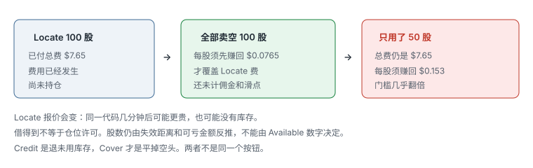
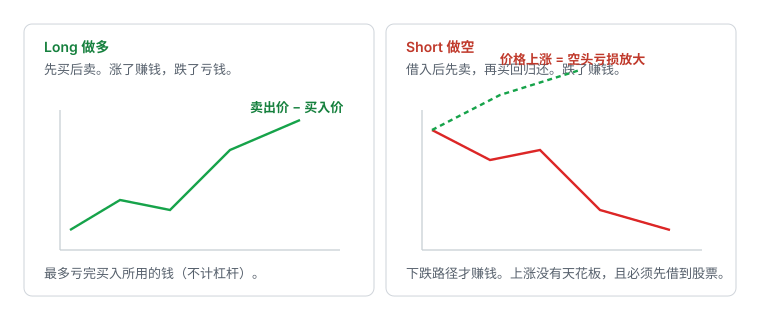

# 6.1 Locate 与借股

> 一句话：Locate、可卖库存、空头仓位是三件事；Credit 不是 Cover；亏损不封顶。先能借到、费用进得去期望值，再谈后面几章的图形。

做多和做空在图上可以写成对称的触发：一边是向上被接受，一边是拒绝之后向下被接受。风险不对称。多头在不计杠杆时，最多亏掉买入用掉的钱；空头面对的是价格可以涨到任意高。停牌恢复上跳、借不到股票、强制回补，都会让「计划止损」覆盖不到真实亏损。

所以这一章不讲形态。形态放到后面几章。这里只把交易链、监管要求、费用、库存和仓位含义写清楚。没有这一章，后面所有空头 setup 都只是在纸上画箭头。

课程里出现过的按钮位置、每股报价、退费比例和「隔夜可能是五倍」，一律当**启发式示例**。界面来自旧平台录像。实际操作以自己券商的当前说明和附录 A 的官方文本为准。

## 6.1.1 这一章解决什么、不解决什么

这一章要回答的是：已经看到潜在 short setup 之后，你能不能、值不值得、按什么顺序把股票卖出去。它不回答「阻力画在哪」「假突破怎么认」「动量股什么时候空」。那些是 6.2 以后的事。

先记住整条链：

```text
发现做空机会
  → 向券商询价（还不是 Locate 成交）
    → 接受报价，得到可卖库存
      → 卖出借入的股票（short 成交）
        → 买回来（cover）
          → 把还用不到的库存还给借出方（有的平台叫 credit）
```

缺任何一截，后面的箭头都不成立。图形再漂亮，借不到就是股数为 0。借得到但费用已经吃掉整个 1R，也是股数为 0。

这一章明确不写：

- 历史阻力、Gap-Up Short、Daily EMA、动量空、Leader–Laggard 的触发规则；
- 某家 2020 年平台 Short List 窗口的点击教程；
- 如何绕过 locate、如何裸卖空、如何把订单标成 short exempt。

普通账户没有「我自己觉得能还上」的例外。没有 locate 就点 Sell，是在和交割规则对赌，不是策略。

## 6.1.2 你到底在卖什么

做空的现金流是：向券商借入你并不持有的股票，先卖掉，以后再买回归还。利润近似为：

```text
（卖出价 − 回补价）× 成交股数
− Locate / 借股费
− 佣金、路由、监管费
− 滑点
− 持有期间的借券利息、股息等价物、公司行动义务
```

你在 5.00 卖空 1,000 股，账户里会出现大约 5,000 美元的卖空收入。这不是「最多只能亏 5,000」。价格到 8.00，你已经亏 3,000；到 20.00，每股亏 15。那不是「原始价格的 100%」封顶。风险预算必须按止损后的美元损失算，不能按收到的卖空收入算。

额外风险包括：

- 借股费突然变化，或可借库存消失；
- 出借方召回，券商强制你买回（buy-in）；
- 股票派息或发生公司行动，空头通常要支付等价物；
- squeeze、停牌与向上跳空；
- borrow 数据、short interest 数据滞后，不能当实时仓位图。

现金账户和多数 IRA 根本不允许股票卖空。软件里有 Short 按钮，不等于你的账户类型、保证金协议和库存都允许你按那个按钮成交。IRA 里亏损仍是真亏，补资还可能补不回来；用更高风险的替代品去模仿被禁止的空头，比「今天不做」更糟。细节在小盘卷的账户结构一章，这里只要先把账户类型当成硬过滤器。

## 6.1.3 四个容易混在一起的词

课程和平台会把下面四个词挤在同一块屏幕上。它们不是同一个状态。

**Short setup。** 你在图表或盘口上发现的做空机会，例如价格接近预先画好的阻力、冲高失败、出现更低高点。它只是交易判断。它不给你借股权，也不产生损益。

**Locate。** 向券商查询并锁定一批「今天可能借到、可以拿去交割」的股票。询价是一回事，接受报价是另一回事。你可能为此先付一笔费。Locate 不是持仓。

**Borrow / 可卖库存。** 接受报价之后，账户获得的可卖空股数。界面上常叫 Available。价格涨跌暂时不直接打到这笔库存上。Available 100 只表示你最多还能再卖掉 100 股，不表示你已经空了 100 股。

**Short position。** 卖空订单真正成交之后才有。这时亏损不封顶。Cover 才是平仓。

可把四个词串成一句：

```text
看到 setup ≠ 完成 locate ≠ 库存到账 ≠ 空头仓位
```

屏幕上输入股票代码和股数，只是在询价。出现 Accept / Cancel，才是券商返回了 Locate 报价。Inventory 里出现 Available，才是报价已接受。这三步加在一起，仍然不等于已经建立 short position。

## 6.1.4 监管要的是 Locate，不是你的感觉

美国股票卖空受 Regulation SHO 约束。对普通账户，核心要求是：券商在接受卖空订单前，必须有**合理依据**相信股票能借到，并在交割日交付。做市商有限例外。普通交易者没有「我自己觉得能还上」的例外。

订单应标记 short。不是 long，也不是你自己标的 short exempt。Short exempt 是给特定做市和合规情形的，是 Rule 201 价格限制的例外，**不是** locate 例外，更不是给你开的后门。

没有 locate 就去做空，后果不是「少付一笔借股费」，而是失败交割、强制回补、账户限制。这些都比「少做一笔」贵。

公开材料：

- [SEC：Regulation SHO 概述](https://www.sec.gov/investor/pubs/regsho.htm)（文中结算周期可能仍写 T+2；股票和 ETF 自 2024-05-28 起标准结算是 T+1，机制部分仍有用）
- [FINRA：Short Interest — What It Is, What It Is Not](https://www.finra.org/investors/insights/short-interest)

核对日期和口径以 [附录 A](../appendix/A-current-rules.md) 为准。冲突时以官方文本为准，不以视频为准。

## 6.1.5 三件事不是同一个状态


| 状态 | 是什么 | 还不是什么 |
|---|---|---|
| **Locate** | 券商认为今天能找到可交割的股票。你可能为此付了一笔费。 | 不是持仓，也不是保证全天都能借到同样数量。 |
| **可卖库存** | Locate 被接受后，你被允许卖掉的数量。界面上常叫 Available。 | 还没有损益，价格涨跌暂时不直接打到这笔库存上。 |
| **空头仓位** | 卖空真正成交之后才有。 | 这时亏损不封顶。Cover 才是平仓。 |

把未用完的 locate 释放出去（有的平台叫 Credit），是退库存，不是平仓。仍有未平空头时，维持该持仓所需的股票不能随意归还。

询价、接受报价、库存到账、卖空成交，是四个动作。少写一步，复盘里就会把「付了 locate 费」记成「做了一笔空」。那两笔账必须分开：一笔是固定成本，一笔才是方向仓位。

Locate 通常按日、按券商、按账户生效。上午借到，不保证下午还能加；A 券商有库存，不保证 B 券商也有。课程案例里同一只股票在一家不可借、在另一家可以借，费用大约每股几分钱——那只说明可借状态随券商和时间变化，不是今天的报价单。

## 6.1.6 询价、报价、接受

各家界面不同。留下来的是动作，不是按钮颜色。

1. 打开借股 / Short List / Locate 窗口。
2. 输入股票代码和**计划可能用到**的股数。
3. 提交询价，等待报价。
4. 阅读报价：每股费用、股数、总价、有效期。
5. 决定 Accept 或 Cancel。
6. 接受后核对 Inventory / Available。
7. 这时才允许讨论下空单。

报价行里的 `Price`，在这类窗口里通常是**每股 Locate 费用**，不是股票市价。`Total$` 是整笔预留成本。把 0.08 读成「股价八分钱」会把整笔账算错。

基本计算式：

```text
总借股费 = 每股 Locate 费 × Locate 股数
```

教学用的数量级（不是现行报价）：

| 股票（录像当时） | 每股 Locate 费 | 股数 | 总费用 |
|---|---:|---:|---:|
| 难借小盘 A（较早报价） | 0.0515 | 100 | 5.15 |
| 同一代码稍后 | 0.0765 | 100 | 7.65 |
| 难借小盘 B | 0.4170 | 5,000 | 2,085.00 |

同一代码几分钟后可以从每股 0.05 变成 0.07。看到一次便宜报价，不代表稍后仍是同一价格，也不代表 Accept 之后库存会一直停在那个数字。报价可以消失。库存可以在你还没下单时被收回。

股数不要随意填大。费用通常随申请股数线性增加；没用到的部分也已经发生成本。输入的应当是「交易计划真正可能用到的上限」，不是「万一走出大行情好有备货」。

讲师的个人原则是：Locate 太贵时通常不借。这是启发式，不是法规。真正应该比较的是：

```text
预期交易利润 是否明显大于
Locate 费 + 佣金 / 平台费 + 滑点 + 其他费用
```

例如借 100 股付了 7.65：仅 Locate 费已经等于每股 0.0765。做空后股价只下跌 0.05，毛利润 5 美元。还没算佣金和滑点，毛利润已经小于 Locate 费。「方向看对」不等于「交易赚钱」。

## 6.1.7 Easy to Borrow 和 Hard to Borrow

容易借的股票（ETB），券商名单上可能直接允许空，不一定单独买 locate。难借的（HTB）——热门小盘、刚暴涨、被主题资金盯上的、刚上市或刚反向拆股的——往往要先买 locate：为「今天可能借到」付一笔费用。

ETB 不是看空信号。容易借可能吸引更多人去空，第一次回落里的空头反而更容易被挤回去。HTB 也不是看多信号。难借只说明做空贵、参与者少或库存紧，不证明价格必须涨。

「10 美元以下更难借」是课程口语，**启发式**，不是边界。低价、低流通、高拥挤、IPO、新闻停牌前后，HTB 更常见；高价大盘也可能在事件日突然变难借。不要用固定价格当过滤器的唯一条件。

实盘要逐项确认：

1. 现在是 ETB 还是 HTB；
2. Locate 报价单位（每股还是总价）；
3. 买的是哪一种 locate（日内、隔夜、可退、不可退，名称各家不同）；
4. 已用 / 未用库存分别是多少；
5. Credit 是否依赖别人接手，是否保证退回；
6. 隔夜费、召回和强制回补规则。

界面、按钮位置、退费比例会过时。留下来的是这六个问题。某家旧平台上的绿色 Locate、橙色 Credit，只能用来理解「询价 ≠ 接受 ≠ 持仓」，不能当操作手册。

选券商时，借股是比较项，不是开盘后再学的细节。比较的是：热门小盘当天能否借到、报价是否事前可见、库存和已用数量是否分得清、SSR 下订单如何被拒或改价。不要在模拟盘里假设「永远 ETB、永远零费用」。

## 6.1.8 Locate 费必须进期望值



卷四的净盈亏式在空头侧必须把 Locate 写进去：

```text
Short 毛盈亏 =（卖空价 − Cover 价）× 成交股数
净盈亏 = 毛盈亏 − 佣金 − 平台/路由费 − 监管费 − Locate/借券 − 滑点
```

忽略其他费用时：

```text
仅覆盖 Locate 费所需的每股跌幅 = 总 Locate 费 ÷ 实际成交股数
```

分母是**实际成交股数**，不是申请股数。费用按你买下的 locate 算，不按你后来用掉多少算。

教学用的数量级（不是报价）：

| 申请 | 每股 Locate 费 | 总费 | 实际卖空 | 仅覆盖 Locate 的每股跌幅 |
|---|---:|---:|---:|---:|
| 100 | 0.0765 | 7.65 | 100 | 0.0765 |
| 100 | 0.0765 | 7.65 | 50 | 0.153 |
| 2,000 | 0.08 | 160 | 2,000 | 0.08 |
| 1,000 | 0.10 | 100 | 400 | 0.25 |
| 5,000 | 0.417 | 2,085 | 5,000 | 0.417 |

第一行：100 股全部卖掉，股价至少要朝有利方向走 0.0765，才刚覆盖 Locate。第二行：同样付了 7.65，只用 50 股，每股门槛几乎翻倍。第四行：借 1,000、只用 400，每个成交股要先贡献 0.25。第五行：还没开仓，策略已经背着两千美元的固定成本。

难借股票即使下跌，跌幅也可能不足以覆盖费用。把 Locate 当成「反正股票会跌就能摊掉」，是在用尚未发生的毛利去支付已经发生的成本。

比较时用同一口径。不要拿「这只股票今天可能跌 1 美元」这种事后叙事，去覆盖事前已经锁定的 locate 账单。计划里应写：

```text
第一目标距离 × 计划成交股数
是否明显大于
Locate 总费 + 往返成本 + 预留滑点
```

不够就 Cancel，不要 Accept 之后再希望走出更大空间。Accept 的瞬间，这笔固定成本已经属于你。

## 6.1.9 借了很多、只用了很少

过量 locate 有三种常见借口：

1. 「万一走出大行情，我好加仓。」
2. 「先占住库存，别让别人借走。」
3. 「反正可能退一部分。」

第一种把 Available 当成加仓许可。加仓规则在风险卷：价格按预期走了之后，用更近的失效位加第二笔，并且重算全仓风险。库存多，不构成加仓理由。

第二种把 locate 当成囤积。你为没有使用的股数付费；别人未必借不到；你自己的期望值先坏了。

第三种把 Credit 当成保险。退回不保证，金额未必高，还可能依赖别人接手。不能在 Accept 前把「可能退回」写进分子。

因此：

- 不要为了「以后可能用到」而过量 locate；
- 当天若确定只用一个试探仓，按试探仓询价，不要按幻想中的满仓询价；
- 同一代码多次询价，每次报价都可以更贵，也可以没有；
- 复盘时把「付了 locate、没有成交」单独记成一笔成本，不要假装这一天没交易。

## 6.1.10 Locate 股数不是仓位许可

Locate 到 5,000 股，只说明券商允许你最多卖空这么多，并不说明风险管理允许你卖空这么多。真实股数仍由：

```text
股数 = 单笔可承受亏损 ÷ (|入场价 − 失效价| + 预留滑点)
最终股数 = min(风险允许, 购买力允许, 流动性允许, 可借股数, 个人上限)
```

可借股数是五个上限之一。没有股票可借，股数就是 0。有 5,000 股 Available，只把「可借」这一项暂时抬到 5,000；其余四项仍可能把你压到 200。

购买力、Available 库存、热键默认股数，都不是风险预算。账户能借 5,000 股，和你应该空 5,000 股，是两件事。

空头还要再取一次更小值，因为：

- 跳空向上的尾部比跳空向下更「没有天花板」；
- 停牌恢复可以远高于你的止损；
- 挤兑式回补会让点差和滑点同时爆炸；
- Locate 成本要从期望值里扣；
- SSR 可能让你无法按计划加空，或无法按设想的价格成交。

加仓摊平不做。空单被套后加仓，是在无限亏损的一侧放大名义敞口。价格按预期下跌后，才考虑是否用更近的失效位加第二笔；加完必须重算：

```text
全仓风险 = Σ[(各批入场价 − 共同失效价) × 各批股数]
```

共同失效价若仍在拒绝高点之上，总风险通常显著增加。超预算就减股数，或不加。库存还够，不是超预算的许可证。

## 6.1.11 Cover 和 Credit

| 动作 | 对象 | 结果 |
|---|---|---|
| Cover | 空头仓位 | 买回股票，平掉损益 |
| Credit / 释放库存 | 尚未使用或已 cover 后不再需要的 locate | 把借股资格还给券商，**可能**退回一部分费用 |

Cover 是关闭空头持仓。Credit 是归还尚可使用的借股库存。两者不是同一个按钮，也不是同一个热键。仍有 open short position 时，不能把维持该持仓所需的股票随意归还。

一个完整的日内例子：

1. 接受 100 股 locate，付了费用，Available = 100，仓位 = 0。
2. 卖掉 60 股，仓位 = short 60，Available 下降到还没用的部分（具体字段各家不同）。
3. 买回 60 股 cover，仓位 = 0，损益已经发生。
4. 若确定当天不再空这只股票，对剩余库存执行 Credit。
5. Credit 之后，若再出现 setup，必须重新询价。新报价可以更贵，也可以没有。

Credit 不保证退回。权衡是：

- **早点释放**：可能拿回部分费用，但失去当天再次做空的能力。
- **继续保留**：保留重做空的灵活性，但资金成本已经发生。

讲师的建议是：只有真正确定当天不再需要空这只股票时，才考虑释放。这是启发式。有人会在确认 cover 之后立刻 credit，以免忘记；有人会留到收盘前。选哪一种，先读自己的券商：未使用库存晚上是否自动归还、自动归还是否退费、退费是否依赖二次转借。

不要为了很小的返还，过早失去当天再次做空的能力。也不要为了「说不定下午还有第二次」，把已经确定不用的昂贵库存留到隔夜。

## 6.1.12 日内库存、隔夜空头、召回

各家规则不同。常见结构是：

- 没有未平仓位时，未使用库存可能在晚间自动归还；
- 空头隔夜，会变成 overnight short，借股费率往往更高；
- 出借方可以召回。券商可以不事先按你希望的价格，直接给你买回。

课程里「隔夜可能是五倍」之类的口头倍数，**不是规则**。实际费率、库存回收时间和隔夜要求，以账户协议为准。不要把录像里的倍数写进计划当公式。

本书的日内空头默认当天 cover。隔夜空头是另一类业务：要单独计算借股费、隔夜跳空和召回，不和日内 resistance short 混在同一个统计桶。因亏损不愿平仓而「被迫隔夜」，会突然新增盘后流动性、新闻、保证金变化和无法按日内止损退出。如果 swing 不是事前计划，收盘前必须按日内失效处理。

召回和强制回补不是「再给你一次按原计划止损的机会」。买回价格可以远离你的失效位。仓位必须在进去之前就按最坏情况砍过：被买回时不利跳空 10%、20% 或更大，账户是否仍可承受。

## 6.1.13 股息、公司行动与强制回补

空头通常要支付股息等价物给借出方。除权、拆股、增发、权证行权会改写你的义务和可借库存。新闻催化那一卷讲过多头侧的稀释；空头侧同一份文件可以让你借不到、被买回，或在停牌里出不去。

下单前至少问：

- 今天或明天是否除息、除权；
- 是否有已宣布但未完成的发行、反向拆股、合并；
- 券商会不会在公司行动前后收回 HTB 库存；
- 你的 cover 单在新闻停牌期间能不能工作。

强制回补（buy-in）可以发生在你「还没准备结束这笔交易」的时候。它不是你的 cover 计划，是券商为了交割去市场买。价格、时机、是否通知，以协议为准。计划里要写「被买回时我接受这笔亏损」，而不是假设自己总能先跑掉。

## 6.1.14 亏损不封顶



多头在不计杠杆时，理论最大损失接近投入资本。空头没有对应的上界。价格从 5 涨到 20，空头每股亏 15；从 5 涨到 50，每股亏 45。中间还可以插入停牌、SSR、点差爆炸和强制买回。

这不是口头警告，是仓位必须比同等 1R 的多单更小的原因。三个不能接受的推理：

1. **涨很多所以一定会跌。** 价格可以在看似不合理后继续涨数倍。
2. **胜率高所以风险小。** 小赢多次加一次巨大回补，期望值仍可为负。
3. **止损限制最大损失。** 停牌、跳空、流动性消失时，成交价可能远离止损。

「我有止损」覆盖的是连续成交。覆盖不了停牌后的第一跳，也覆盖不了盘口蒸发后的第一笔成交。这时唯一还在你手里的控制，是开仓时的股数。

低价低流通盘可连续 halt up。halt up 时挂一张市价买单等恢复，不是安全方案。恢复价可以远离计划止损。对小盘空单，这是尾部风险，不是执行细节。

## 6.1.15 空头的止损是买入

止损用 cover 完成。方向反了：多头止损是卖，空头止损是买。买的一侧同样面对点差、深度和停牌。

| 订单 | 空头止损时会发生什么 |
|---|---|
| Stop market | 向上触发后变成市价买。跳空、停牌恢复、盘口变空时，可能买得很贵。 |
| Stop limit | 触发后变成限价买。价格一口气越过限价，可能根本买不进。 |
| 限价挂在失效位 | 价格没碰到就不成交；碰到了也不保证队排得上。 |


停牌期间普通止损单无法执行。恢复价可以远离计划止损。点差突然变宽、Level 2 上买单消失、连续向上停牌，都让「我有止损」这句话失效。

计划里要写清三件事：

1. 结构失效价在哪（判断被证伪的位置，不是随便一个美分）；
2. Cover 用什么订单；
3. 停牌中我接受「出不去」，恢复后按预先写好的规则处理，不现场发明「再等等」。

halt resumption short、第一次顶部猜测、抛物线中途盲空，应单独隔离，不纳入普通 setup。那些样本的尾部不是这一章的 locate 费能描述的。

## 6.1.16 同样 1R，空头侧默认更小

卷四的公式仍然成立。空头把同一美元风险摊到更宽的尾部上，股数就必须更小。预留滑点在开盘、停牌前后、HTB 名字上要加大；加大之后股数必须变小。

不要先选股数再回头挤止损。错误顺序是：Available 显示 2,000，热键默认 2,000，再把失效位画近一点，让表格里的 1R 看起来没超。正确顺序是：先有失效，再有每股风险，再和五个上限取最小。

小账户尤其不能按「股数看起来不多」安慰自己。低价股 2,000 股的名义可能只有几千美元，一跳 0.40 已经超过全天预算。股数多不是优势，每股风险乘股数才是你在赌的东西。

## 6.1.17 SSR 不是借不到，也不是禁空

Regulation SHO **Rule 201** 的价格测试在卷三。这里只钉和借股的关系。

上市市场确认某只股票在常规时段相对前一常规时段收盘价下跌至少 **10%** 后，触发短路器。触发后，普通空单**不能在当前最优买价（National Best Bid）或更低的价格显示或执行**。限制持续到当天结束以及**下一个交易日**。判定只发生在常规时段；一旦触发，在仍有持续 NBBO 的扩展时段也可以适用。

因此：

- SSR **不是**不能做空；
- 它**不保证**股价会涨，也不制造 squeeze；
- 股票仍可以继续跌；
- 它改变的是**空单的执行**：你可能必须挂在 bid 之上，向下追空会更难成交；
- 它不是 Locates 变少的同义词。借不到股票是另一件事；
- 普通交易者不要自行把订单标成 short exempt。

两者经常同时出现在大跌的小盘上，但机制独立：

| 组合 | 含义 |
|---|---|
| 有 Locate，股票在 SSR | 你可以空，但不能在 NBB 或以下显示 / 执行 |
| 没有 Locate，没有 SSR | 很多硬借股票你仍然空不了 |
| 没有 Locate，又在 SSR | 既借不到，又更难按下跌价成交 |
| 有 Locate，不在 SSR | 仍要付费用、管召回、管向上跳空 |

把 SSR 标签当成「空头要被挤、应该追多」，是把执行限制误读成方向信号。同样的 breakdown 触发，在 SSR 下可能买得到 cover、卖不掉新空单。计划里要写清「填不掉就放弃」，不能改口改成市价砸 bid。

资料：[SEC Rule 201 FAQ](https://www.sec.gov/divisions/marketreg/rule201faq.htm)

## 6.1.18 Short interest 不是实时仓位图

Short interest 告诉你截至某次统计、已报告的空头规模。它不是盘中拥挤度仪表，也不能证明下一笔一定 squeeze。公开材料见上一节的 FINRA 链接。

借股费率变贵、SSR 亮起、价格加速，都可以和回补同时出现。任何单独一条都不是 squeeze 的证明。把它当叙事可以，当入场条件不行。

「这只股票空头太多，所以一定会涨」和「这只股票空头太多，所以我要加入他们」是同一枚硬币的两面。都缺少触发。你能用的只有：今天这只股票在你的账户里能不能借到、费用多少、价格有没有按你预先写好的方式拒绝或跌破。

## 6.1.19 课程启发式，不要当定律

下面这些数字在基础课和进阶演示里反复出现。本书一律标成**启发式**：可以写进你自己的检查单当起始提醒，必须用自己的样本和当前券商规则校准。它们不是市场的自然定律，也不是法规。

| 课程说法 | 正确读法 |
|---|---|
| 盘前成交量 × 10 ≈ 全天量 | 粗估基线。不同盘前时长、开盘前剩余时间、股票类型和市场环境不能共用一个固定倍数。持续突破、停牌或消息变化时倍数会完全失效。 |
| 「已经超过预测量所以该反转」 | 错。新的关注者可以继续进入。量超预期更可能让历史阻力直接被突破。 |
| 低价 / 10 美元以下更难借 | 口语。HTB 与价格相关，但没有这条普遍边界。 |
| 隔夜借股大概是五倍 | 口头示例，不是费率表。 |
| Locate 太贵我就不借 | 讲师个人门槛。你的门槛应写成「费用相对计划 1R 和第一目标」的比例，而不是背他的绝对美元。 |
| Gap 超过某百分比才考虑高开空 | 筛选条件，属于后面的 setup 章，不是借股规则。 |

更合理的用量方式是：截止同一盘前时间、与历史相似事件比较、根据开盘首 5 / 15 / 30 分钟更新，并给出高低情景，而不是单一数字。那是选股和阻力章的事。这一章只要先拒绝：因为「量已经够大了」就去买一份昂贵 locate。

## 6.1.20 为什么有的课程很少做空

一份小盘课把少做空的原因列得很具体：borrow availability、borrow fee、SSR、高风险、退休账户限制。这些不是性格问题，是可执行性问题。

图形上看起来完美的 breakdown，可能：

- 借不到；
- 借得到但 Locate 费吃掉整个 1R；
- 借得到、费用可接受，但 SSR 下空单挂不进；
- 成交了，下一秒 halt up。

所以空头策略的第一过滤器不是形态，是：

```text
今天这只股票，在你的账户里，
能不能用可接受的成本、可接受的规则，
卖掉你计划的那一点股数。
```

过不了这一关，图再好看也不进样本。能借到，也不等于应该空——「能借到」只是过滤器的第一道门，不是入场理由。News、scanner hit、easy-to-borrow、VWAP 回踩，单独任何一条都不是交易理由。

## 6.1.21 模拟盘漏掉的四件事

入门阶段更适合先在模拟盘把「拒绝之后向下接受」和 cover 流程走熟。Halt resumption short、第一次顶部猜测、抛物线中途盲空，应单独隔离。

模拟盘通常低估：

1. **借不到。** 模拟里 Short 按钮几乎总是亮的。
2. **Locate 费。** 方向正确的交易会被固定成本打成净亏。
3. **强制买回。** 模拟很少在你不想走的时候把你买掉。
4. **真亏钱时的加仓冲动。** 空单浮亏时加仓，是无限亏损一侧的摊平。

过了模拟盘，也不表示期望值为正。实盘第一阶段应用最小股数验证：询价、接受、Available、成交、cover、credit 这六个动作在你的券商上分别长什么样。不要用测试大单去反推规则。

## 6.1.22 盘前到收盘的操作顺序

把借股写成每日流程，而不是看到红 K 再临时点窗口。

**盘前。** 账户类型是否允许卖空；名单上的空头候选是否 ETB / HTB；若要询价，股数是否不超过计划可能使用的范围；报价的 Price 是不是每股借股费；总费用相对计划 1R 是否可接受；是否已经 SSR（可能是昨天触发、今天仍生效）；公司行动和新闻停牌。盘前完成 locate，不等于必须交易。

**开盘后。** 触发出现之前，库存只是成本。没有触发就不要因为「钱已经付了」去找一个空。付了 locate 而没有成交，记成本，不记「错过」。

**成交后。** 仓位、Available、未完成订单分开看。Cover 计划写在入场前：第一目标、部分回补、最终失效。不要用盘中新故事覆盖原来的失效位。

**Cover 之后。** 只有确定不再需要库存时才考虑 Credit。若还可能做同一只股票的第二次、第三次短空，先核对剩余 Available 和重新询价的当前报价。

**收盘前。** 日内空头默认平掉。未使用库存按券商规则处理。不要把浮亏空单改名为 swing。

## 6.1.23 复盘字段

每笔涉及借股的交易，至少多记这些，不要只记进出场价：

- 询价时间、接受时间、当时每股费用和总费用；
- 申请股数、实际成交股数、未使用股数；
- 仅覆盖 Locate 所需的每股跌幅；
- ETB / HTB、是否 SSR、是否在持仓期间被召回或买回；
- Cover 的计划价与实际成交价；
- 是否 Credit、退回多少、是否事后又重新询价；
- 若没开仓：这笔 locate 费作为单独成本入账。

阻力空、动量空还要另记结构字段，见后面几章。不要因为结果赚钱，就把本来不合格的 locate（费用已经大于计划目标）改写成「当时合理」。

## 6.1.24 下单前检查单

- [ ] 账户类型允许卖空（不是现金账户，也不是禁止卖空的 IRA）。
- [ ] 我看到的是明确的 short setup，而不是因为「能借到」就想做空。
- [ ] ETB / HTB 已确认；Locate 报价的 `Price` 是每股借股费，不是股票市价。
- [ ] 预期利润有足够空间覆盖 Locate、滑点和其他费用。
- [ ] Locate 股数不超过计划真正可能使用的范围。
- [ ] 接受报价后，Inventory / Available 已正确显示；我没有把 Available 当成已经持仓。
- [ ] 入场、失效、第一目标、股数已经写在计划里。股数由失效距离反推，再和可借股数取小。
- [ ] 已按向上跳空和停牌恢复做过尾部压力测试。
- [ ] 知道当前是否 SSR，以及券商如何路由合规空单。
- [ ] Cover 用什么订单；停牌中我接受「出不去」。
- [ ] Cover 后，只有确定不再需要库存时才考虑 Credit。
- [ ] 了解自己券商当前的日内归还、退费、隔夜和召回规则。

答不出的那一条，就是 no-trade。

## 6.1.25 常见错误

1. **把报价里的 `Price` 当成股票价格。** 那一列常常是每股 Locate 费。
2. **Locate 后误以为已经持仓。** Locate 只是取得可卖空库存；订单成交才产生空头。
3. **只看方向，不算成本。** 难借股票即使下跌，跌幅也可能不足以覆盖 Locate 费。
4. **为了「以后可能用到」而过量 Locate。** 没用到的库存也可能已经付费。
5. **过早 Credit。** 稍后再次出现 setup 时，可能要重新询价，价格也可能已经上涨或没有库存。
6. **没有 Cover 就以为可以归还。** Open short 与未使用库存必须分开。
7. **把 Available 或购买力当成可承受亏损。**
8. **空单被套后加仓摊平。**
9. **把 SSR 标签当成必涨、禁空或 squeeze。**
10. **把 ETB 当成看空、把 HTB 当成看多。**
11. **照搬旧视频里的每股 Locate 费、退费比例和隔夜倍数。**
12. **现金账户或 IRA 里按课程热键直接 Sell Short。**
13. **把 short interest 或滞后的 borrow 名单当成盘中仓位图。**
14. **付了 locate 费之后，为了「别浪费」去找一个不合格的空。**
15. **模拟盘里从没见过拒单，就假设实盘永远借得到。**

## 6.1.26 复习题

1. Locate 100 股与做空 100 股有什么区别？
2. 每股 Locate 费为 0.08，借 2,000 股，总费用是多少？
3. 借 1,000 股花费 100 美元，但实际只做空 400 股；仅覆盖 Locate 费，每个成交股需要贡献多少利润？
4. 为什么价格方向判断正确，交易仍可能亏损？
5. Cover 和 Credit 分别关闭或归还什么？
6. 为什么 Locate 报价越高，策略需要的预期优势越大？
7. 询价、接受、Available、成交，哪一步才产生亏损不封顶的仓位？
8. SSR 亮起时，是不是不能做空？它和 locate 是同一件事吗？
9. 账户能借 5,000 股，为什么仍可能只应空 200 股？
10. 「盘前量 × 10」为什么不能当成全天量的预测定律？

### 答案

1. Locate 只是取得最多可卖空 100 股的库存；卖空订单成交后才形成持仓。
2. `0.08 × 2,000 = 160` 美元。
3. `100 ÷ 400 = 0.25` 美元/股，还没包含其他费用。
4. 下跌产生的毛利润可能小于 Locate、佣金、滑点等总成本。
5. Cover 关闭空头持仓；Credit 归还未再需要的借股库存。
6. Locate 是交易开始前已经存在的成本，只有足够大的有利价格移动才能覆盖它。
7. 成交。前三步都还没有方向仓位。
8. 不是禁空。SSR 限制普通空单必须高于当前 NBB；locate 管能不能借到并交割。两者独立。
9. 可借只是五个上限之一。失效距离、滑点、流动性、个人上限和尾部测试都会把股数砍下去。
10. 倍数随盘前时长、剩余时间和事件变化；突破、停牌或新闻会让基线作废。它是启发式，不是公式。

## 先记住这些

- Locate 在先，图形在后。没有 locate 就点 Sell，是在和交割规则对赌。
- Locate ≠ 可卖库存 ≠ 空头仓位。询价 ≠ 接受 ≠ 持仓。
- Credit 不是 Cover。一个退库存，一个平底仓。
- 亏损不封顶，仓位更小。计划止损管连续成交，管不了停牌后的第一跳。
- Locate 费按申请股数算；实际少用，每股门槛上升。
- Available 和购买力都不是风险预算。
- SSR 限制空单价格，不是禁空，也不是 squeeze，更不是借不到。
- 盘前量倍数、10 美元 HTB、隔夜五倍，全部是启发式。

## 不要做的事

- 现金账户或 IRA 里按课程热键直接 Sell Short。
- 把借股费当成「反正股票会跌」。
- 空单被套后加仓摊平。
- 把 Available 数字或购买力当成可承受亏损。
- 把 SSR 标签当成必涨或多头入场条件。
- 把 ETB / HTB / short interest 当成方向信号。
- 照搬旧视频里的每股 Locate 费、退费比例和隔夜倍数。
- 为了不浪费已经付掉的 locate，去找一个没有触发的空。
- 自行把订单标成 short exempt，或寻找「不用借也能空」的后门。
