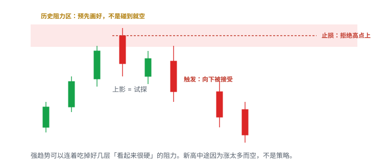
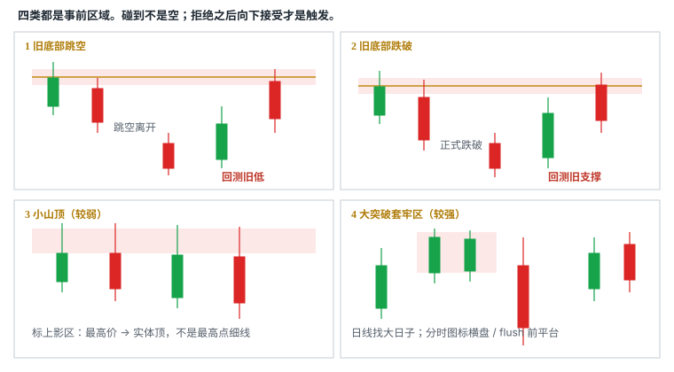
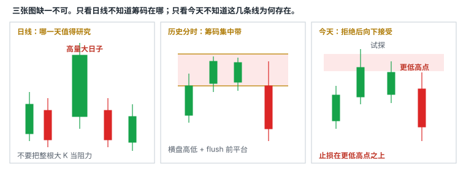

# 6.2 历史阻力做空

> 一句话：碰到预先画好的历史阻力不是做空许可；拒绝之后向下接受才是触发。止损放在刚形成的更低高点之上。

上一章解决「能不能空」。这一章只解决一种空头 setup：**Historical Resistance Short（历史阻力做空）**。Daily EMA 在 6.4。高开直接撞上阻力的 Gap-Up Short 在 6.3。动量股里的假突破和趋势转换在 6.5。各自另开统计桶。这里出现它们，只是为了对照：位置可以相同，触发和失效不同，就不能共用一个胜率。

空头和多头用同一套词：形状、位置、触发、失效。差别在方向和尾部。多头突破的触发是穿过线并在上方被接受。空头阻力交易的触发是：价格先到达预先画好的供给区，出现拒绝，再向下被接受。少了「预先画好」，你就是在新高中途猜顶。少了「拒绝之后的向下接受」，你就是在碰线的那一刻和趋势对赌。

```
股票池 + 市场环境 + setup + trigger + invalidation + sizing + exit + 成本
```

「我做历史阻力空」只填 Setup 一栏。线画在哪、什么叫拒绝、什么叫向下接受、止损钉在哪一个高点上，必须在开盘前写死。Locate、可卖库存、SSR、停牌跳空按 6.1 处理。没有 locate 就没有这一章。

## 6.2.1 这笔交易在赌什么

历史阻力空赌的不是「已经涨太多所以该跌」，也不是「套牢盘一定会卖」。它赌的是一件更窄的事：

**过去某个清楚、集中的交易失败区，今天仍然可能提供供给。价格进入你事先标出的区域后被拒绝，并且在拒绝之后向下被接受，使第一目标盖过 1R 加 Locate、借股和滑点。**

把它拆开，才能知道哪一句话被证伪：

| 句子 | 被什么证伪 |
|---|---|
| 区域是事前画的，不是盘中新高上临时描的 | 开盘后才在最高价上补一条线 |
| 过去那里发生过足够集中的失败 | 日线只是一根大 K，分时图高位几乎没停留、量也不突出 |
| 今天的买盘在该区开始衰竭 | 进入区域后量能扩张、实体站上、回落不把线还回去 |
| 拒绝之后出现向下接受 | 只有上影，或跌破后立刻收回区域 |
| 更低高点之上仍是近的失效 | 止损只能放在很远的尖峰上，1R 已经吃掉口袋 |
| 你能按失效价附近离开 | 点差失控、盘口消失、停牌跳过止损线 |

图表无法告诉你历史持仓是否还在。公司行动、换手、时间都会改写筹码。所以「套牢盘会卖」是机制假设，不是可观察事实。可操作的观察只有：冲高失败、更低高点、支撑跌破、量在阻力区是否开始衰竭。

这笔交易**不是**在赌：

- 碰到阻力就反转；
- 第一次测试一定守住；
- 旧底部、小山顶、大突破套牢区有固定胜率排序；
- 历史阻力日成交量与今天估算总量存在某个神奇比例；
- 形状漂亮就等于订单能按图成交。

## 6.2.2 碰到不是触发

阻力不是「到这个价一定反转」的精确点，而是卖压更可能集中出现的**价格区域**。强趋势可以连着吃掉好几层看起来很硬的阻力。把线画出来的目的，是让你在价格到达前提前知道该重新评估，而不是让你在到达前挂空。



同一段「价格走到 5.00 附近」可以同时被三种人圈起来：

- 猜顶的人说：到了历史阻力，该空；
- 突破的人说：站上 5.00 就追多；
- 这一章的人说：先看它在 5.00 一带怎么失败，失败被接受了再空。

前两种把位置当成许可。第三种把位置当成观察窗。窗口打开之后，默认动作是不交易，直到拒绝和向下接受都走出来。

| 你看见的 | 它实际说明什么 | 还不是什么 |
|---|---|---|
| 价格碰到区域 | 供给区被测试 | 不是空头触发 |
| 一根长上影 | 试探，买方没能保持 | 不是向下接受 |
| 更低高点 | 空头结构开始出现 | 单独一根不够 |
| 跌破最近微结构低点并站下 | 向下被接受 | 若立刻收回，接受作废 |
| 突破并在区域上方站稳 | 这层阻力失败 | 不是「立刻在下一层提前挂空」的许可 |


一根长上影穿过阻力又收回来，对多头是「不是突破」，对空头也还不是入场。它只说明：这一次测试没有被接受。真正的空头触发要等价格离开区域、并在下方留下实体，随后的反抽不把线还回去。用未收盘 K 的最高价宣布「已经拒绝」，和用未收盘最高价宣布「已经突破」，是同一类脏样本。

## 6.2.3 阻力为什么会形成

三类参与者足够解释大多数盘面，不必发明更神秘的机制。它们可以同时存在，图上看不见「谁」。

**等待机会的空头。** 不同交易者可能独立找到相似的日线位置。价格接近该区域时，做空卖单同时增加。这是可能的供给来源，不是保证。股票容易借时，第一次回落里的空头也可能被迅速挤回，价格会走到下一层才出现真正的拒绝。

**过去被套的持仓者。** 一只股票曾在高位有大量成交，之后大幅下跌。没有止损、继续持有的人会被套在高位。将来价格重新回到其成本区时，一部分人会想「终于解套」，于是卖出。逻辑是：

```
过去高成交区 → 下跌套牢 → 价格返回 → 解套卖盘
```

旧底部那一类不一定主要来自大量 bagholders，也可能来自：人人能画出的明显技术位置、等待回测的空头、跌破后被套的原多头、整数位附近的心理卖压。位置越清楚、越多人能画出相似的线，越值得提前关注。清楚不等于有效。

**当天多头的连锁离场。** 前两类卖压让价格从阻力处回落后：新买家看到冲高失败，参与意愿下降；成交量开始减少；已经入场的日内多头陆续离场；离场卖单进一步压低价格。这解释了为什么一个阻力失败有时不只产生一根红 K，而会发展成持续较久的下跌。它同样是事后叙事。交易上你能用的只有：冲高失败、更低高点、支撑跌破。

Daily EMA 那一层动态阻力在 6.4。本章只处理**历史结构**：旧底部跳空、旧底部跌破、小山顶、大突破日留下的套牢区。

## 6.2.4 和均线阻力的差别

日线 EMA 100 / 200 是平台算出来的线。Historical Resistance 需要你主动阅读历史价格结构。

工作方式是：

1. 在盘前或股价开始上涨时打开日线；
2. 向左查看过去的价格波动；
3. 找到符合特定结构的日期或区域；
4. 必要时进入那一天的 1 分钟、5 分钟或 15 分钟图；
5. 把潜在卖压区域画在当前图表上。

日线告诉你「哪一天、哪个带值得研究」。分时图告诉你当时到底在哪里横盘、放量和突然下跌。不要把日线大 K 的整个高度都当成阻力。

两大来源，拆成四类：

- **Historical 底部**：过去的明显低点 / 支撑被破坏后，未来成为阻力。破坏方式有两种——直接跳空离开，或在附近交易一段时间后正式跌破。
- **Historical 高位**：下降或横盘里留下的小山顶；以及大突破日留下的套牢区。

均线每天都在动，不能当固定靶心。历史区域钉在价格上，但筹码会老化。两者都是地图，都不是按钮。叠加时提高关注优先级，不会把概率变成确定性。

## 6.2.5 四类对照



| 类型 | 日线特征 | 具体画法 | 相对强度（启发式） | 主要逻辑 |
|---|---|---|---|---|
| 旧底部跳空 | 明显低位后直接跳空下跌 | 标旧低位区域 | 中等 | 旧支撑转阻力 |
| 旧底部跌破 | 明显低位被正式跌破 | 标被跌破的 low 一带 | 中等 | 回测旧支撑 |
| 小山顶 | 下降 / 横盘中的局部高点 | 标上影线区域 | 较弱 | 过去冲高失败、空头防守 |
| 大突破套牢区 | 高量突破后失败 | 进入历史分时图标横盘 / flush 前平台 | 较强 | 大量高位成交者等待解套 |

「相对强度」是阅读优先级，不是胜率表。强催化、高量、频繁停牌可以让最强的那一层直接失效。小山顶在强新闻里尤其容易被穿过。形状相似，不代表筹码规模相同。

给每个区域打等级（启发式，改完必须写进计划）：

- A：大突破高量套牢区 + 整数位 / 其他阻力叠加；
- B：清楚旧底部，或多个小山顶重合；
- C：单个小山顶、低量或很久以前的模糊结构。

只把 A、B 写进当天计划。C 留在图上当提醒，不单独开仓。第一层被突破，不自动把下一层升级成「必须空」。下一层仍然要等自己的拒绝和向下接受。

## 6.2.6 类型一：旧底部跳空

先找过去曾经非常明显的低位。随后价格从这个区域直接 gap down，原来的支撑被留在上方。价格长期位于其下方。以后从下方重新涨回这里，旧支撑便可能转换为新阻力。

```
过去支撑 → 直接跳空离开 → 长期在下方 → 反弹回测 → 潜在阻力
```

跳空留下的是一个**空出来的决策带**，不是一根贴在缺口边缘的细线。画法是：标出跳空前最后被守住的低位一带，必要时把缺口上下沿一起标成区域。不要把跳空当天整根大阴线的全部高度都当成阻力。

这一类不一定主要来自大量套牢盘。人人都能看见「这里曾经是底，后来一夜之间没了」。等待回测的空头、跌破预期后被套的原多头、整数位附近的心理卖压，都可以叠在同一带。位置越清楚，越值得提前画；越清楚，也越容易在强催化里被当成突破靶。

教学整数（不是某只股票的行情）：旧底部在 5.00 附近，随后直接跳到 4.20 下方，并在 4.20 之下交易了数周。今天高开股盘前回到 4.90–5.10。你的工作不是在 5.00 挂空，而是：

1. 把 4.90–5.10 画成区域，而不是 5.00 一根线；
2. 看开盘后是否迅速进入下降结构；
3. 若第一波已从 5.10 砸到 4.40，不宜在 4.40 追空；
4. 等反弹重新接近 4.90–5.10，观察是否低量、上影、冲高失败；
5. 失败被向下接受后，止损放在刚形成的更低高点之上。

「5.00 永远不能过」不是这一类的定义。价格可以第一次未能突破，第二次略微越过又很快跌回。真正要观察的是越线后能否继续成交并站稳，不是最高价是否高出几分钱。

## 6.2.7 类型二：旧底部跌破

和跳空同一逻辑，破坏方式不同：股价在旧低位附近交易一段时间后，明确跌破这个 low，之后长期留在下方。以后从下方回测，旧支撑转为潜在阻力。

```
过去支撑 → 附近交易一段时间 → 正式跌破 → 长期在下方 → 反弹回测 → 潜在阻力
```

「正式跌破」要和主风险周期一致。用 1 分钟影线宣布日线底部已经死了，是周期混用。更稳妥的最小定义（启发式）：收盘站下旧低区域下沿，随后一次反抽的高点仍在下沿之下。只插一根影线就回来，旧底部身份还在，今天就不能把它当已经转成的阻力。

画法：标被跌破的 low 一带，而不是只钉在最低一笔成交。若跌破前有一段横盘，横盘下沿往往比影线尖更有用。若跌破后很快收回并重新站上，这层「旧底部转阻力」的资格要降级或删除。

当天如果一只高开股盘前或开盘正好来到旧底部：

1. 先把旧底部画成区域；
2. 看开盘后是否迅速进入下降结构；
3. 若第一波已跌很多，不宜在低位追空；
4. 等反弹重新接近阻力，观察是否出现低量反弹、上影或冲高失败；
5. 做多的人在该区域下方避免追高。

开盘在阻力处快速下跌后，后续成交量常变小。错过最早的空头后，再追入的盈亏比可能明显变差。这和多头「大阳线中途市价追」是同一类错误，只是方向反了：追的定义是离失效位太远。

一张日线可能有多个清楚的旧底部。都画出来，再按价格从近到远处理。第一条线可能只造成短暂回落；如果突破，观察下一条。不要因为第一处失效，就认定上方没有阻力。也不要因为第一处失效，就在第二处提前挂空——第二处仍然要等自己的拒绝。

## 6.2.8 类型三：小山顶

它常见于日线的下降段或横盘阶段。价格多次反弹，每次在类似区域留下局部高点，看起来像一连串小山峰。

标记方法：

1. 找出日线局部高点；
2. 标出当天的最高价；
3. 标出当天 K 线实体顶部；
4. 把二者之间的**上影线区域**作为候选阻力。

实体顶部：红 K 是开盘价，绿 K 是收盘价。上影线区间是「当日最高价 → 实体顶部」。不是只在最高点画一条细线。多个局部山顶的上影区域重叠时，比单独一根随机上影更有参考价值。红 K 与绿 K 的实体顶部定义不同，所以必须先分辨当日开盘价和收盘价。

上影代表价格曾到达更高位置，但未能保持，收盘前被压回。未来重回该区时，可能遇到过去在此加空的资金、希望维护下降结构的参与者、看到「过去到这里就失败」的技术交易者，以及过去追高、等待解套的持仓者。这些仍然是机制假设。阴影区只代表历史卖压发生过，不能告诉你今天的买盘强度。

这一类通常不如「大突破套牢区」强。它更适合做提醒：

- 到达该区域后降低追价；
- 检查是否出现拒绝；
- 若新闻强、量大，则接受它可能轻易被突破；
- 突破后转向下一个小山顶或其他阻力。

平台自动画的历史水平仍需人工判断，不应因为软件画出来就默认有效。自动线常把每一个局部高点都连上，图上密密麻麻时，决策价值已经没了。只留清楚、当天可能触及、且最好互相重叠的上影带。

教学整数：下降结构里连续三个局部高点的上影分别落在 6.18–6.30、6.12–6.26、6.15–6.28。你标的是 6.12–6.30 这一带，不是 6.30、6.26、6.28 三条细线。今天反弹先到 6.14，出现上影后回到 6.00，这只是试探。更低高点若出现在 6.08，止损候选在 6.08 之上，而不是自动钉回 6.30。

## 6.2.9 类型四：大突破日的套牢区

这是历史阻力里相对更强的一类。强度来自成交规模，不来自 K 线颜色。讲师最常用的也是这一类，因为它回答的是「哪里曾经有大量人完成交易」，不是「哪根日线看起来最大」。

**先在日线找「过去的大日子」。** 站在今天向左找：

- 当天最高价高于今天当前价格；
- 成交量显著放大；
- 当天出现大幅突破；
- 随后又出现明显 flush 或失败。

日线只能告诉你哪一天值得深入，不能准确告诉你套牢成交集中在哪个价格。把整根历史大阳或大阴都涂成阻力，是这一章最常见的懒画法。

**再进入那一天的分时图。** 较近日期优先看 1 分钟；更久以前可能只有 5 分钟或 15 分钟。目标不是固定使用最短周期，而是看清当日成交结构。重点标两类位置：

1. 高成交横盘区域的高低边界；
2. 大幅 flush 发生前最后维持住的价格区域。

如果历史数据只有 15 分钟图，线会更粗糙，应把它当宽区域而不是精确价格。



为什么 consolidation 会留下相对更强的阻力：

```
新闻推动大涨
  → 大量交易者在高位横盘中买入
    → 价格突然 flush
      → 许多人来不及止损，成为 bagholders
        → 以后价格回到其成本区
          → 解套卖单可能集中出现
```

与小山顶相比，大突破日通常有更高成交量，因此潜在套牢筹码更多。这仍是机制假设。你无法从今天的图证明那些持仓还在。你能做的是：事前标出当时成交真正集中的带，然后等今天的失败。

不要把整个历史大 K 都当阻力。缩小到：

- 横盘的高低边界；
- 成交最集中的平台；
- flush 前最后一个支撑 / 平台；
- 容易重合的整美元 / 半美元。

可以画成多条线，也可以画一个窄区间。交易时先看下沿反应；若突破，观察区间上沿或下一层。下沿被接受，这层套牢区的空头假设作废，转看上一沿，而不是在同一带加空。

## 6.2.10 日线找哪一天，分时图找筹码

每个案例都要在两个时间层级之间来回切换。看图时先确认你在看 Daily 还是当天 / 历史分时，再看自己标的区域。不要把日线大 K 的整个高度都当成阻力。

三张图缺一不可：

| 图 | 回答什么 | 回答不了什么 |
|---|---|---|
| 今天之前的日线 | 哪一天、哪一带值得研究 | 筹码集中在哪一个精确价 |
| 那一天的 1 / 5 / 15 分钟 | 横盘高低、flush 前平台、高位停留多久 | 今天买盘会不会在这里衰竭 |
| 今天的分时 | 价格进入这些线后如何反应 | 这几条线为什么存在 |

只看 Daily 不知道筹码集中在哪。只看今天又不知道这几条线为何存在。只看历史分时、不回到今天，你会把过去的失败当成今天的许可。

形状相似，不代表筹码规模相同。日线很乱、有多个视觉上相似的高点时，单看形状很容易画太多线。必须回到那一天的分时图核对：高位停留了多久、成交量是否极端。高位只是瞬间经过、成交量又不突出，潜在 bagholders 较少，阻力权重应降低。复盘时给每条线标注「强 / 中 / 弱」和形成日期，避免图表被无差别水平线填满。

Historical Resistance 不是静态的。每一次高量上涨失败，都可能新增一层未来阻力：

```
每一次高量上涨失败 → 都可能新增一层未来阻力
```

复盘后应更新图表，而不是永远只保留几年前的线。新失败区要记录成价格带，而不是把「13」本身当作具有魔力的数字。教学整数：某日在 12.80–13.20 高位横盘后整日下跌，下一次上涨面对的是 12.80–13.20，不是「13 这个数字」。

## 6.2.11 怎样画，怎样不画


市场不会精确停在你画的那根线上。点差、滑点、影线都会让价格在一条带状区域里来回。线应盖住**实际发生过反应的那一带**，不要为了贴合最高一根影线画得过分精确。


寻找上方日线阻力时，少画线的一种方法：

1. 从最新价格向左看；
2. 遇到挡住视线的大 K 线，不跨过其价格范围去挑内部小点；
3. 从该 K 线 High 再向左、向上找下一个明显 High；
4. 依次标出可能的阻力。

优点是减少密密麻麻的水平线，优先保留明显价位。缺点是「挡住」「明显」的判断主观；以前被突破的价位仍可能再次产生反应，不能机械删除。大突破日往往就是那根「挡住视线」的大 K——对它不要停在日线 High，要进分时图把内部平台拆出来。这是 left-and-up 的补充，不是例外：日线负责定位，分时负责收缩。

更稳妥的标注分级：

- A：近期且高量、多次有反应，或大突破套牢区；
- B：较远但明显的旧底部 / 重叠小山顶；
- C：只有单次或较弱证据；
- 已突破：保留灰色，观察是否发生 role reversal；
- 与当前价过近：合并为区域。

入场前只保留最近失效点、第一目标和下一重要目标。其他远端水平用于情景参考。这是历史图上的事后标注；练习时应只用当时可见数据重画。

旧阻力被向上突破并在上方被接受，才有资格成为新支撑的**候选**。要等回踩验证，不能假设换位已经完成。只插一根影线就回来，区域身份不变。用 1 分钟影线宣布日线阻力已经换成支撑，是周期混用。

## 6.2.12 整美元叠加与多层地图


旧底部正好落在整美元附近时，决策区更显眼。教学整数：旧底部在 5.00 附近，今天两次测试——第一次未能突破，第二次略微越过又很快跌回。这里不是「5.00 永远不能过」，而是 Historical 底部与 whole dollar 叠加，让 5.00 附近成为一个更显眼的决策区域。

心理价位必须和当前点差比较：

- 一次跳动就跨越 0.50 美元，单独画半整数意义很小；
- spread 已经接近 0.20 美元，精确到一两美分的水平线没有实际执行意义；
- 水平线应结合此前真实高低点，而不是仅因数字「好看」就画。

多层的正确用法是**按价格从近到远排队**，不是同时对每一层下注：

- 当前价先遇到哪一层，就先观察哪一层；
- 第一层只造成短暂回落，不算这层「赢了」，也不算上层「没了」；
- 第一层被接受，转向下一层，重新等拒绝；
- 不要因为第一处失效，就认定上方没有阻力；
- 不要因为第二层还在图上，就在第一层被突破的瞬间加空。

借股难易和空头拥挤会影响第一次反应。股票 easy-to-borrow 时，第一层回落里的空头可能被 squeeze，价格走到下一层（例如下一个旧底部 5.80 一带）才出现 shooting star 式的拒绝。阻力地图需要多层；是否空，仍应根据价格确认，而不是只依赖历史线。

## 6.2.13 盘前画线

**从当前价格向上扫描日线。** 只找当前价格以上、当天可能触及的位置。太远的线增加噪声。盘前已经明确越过某层时，不应继续把它当成上方未测试阻力；观察能否保持在上方，若回踩不破，它可能转支撑。

**先标旧底部，再标小山顶，再找大突破日。** 检查是否有清晰 gap down 或明确 breakdown，是否与整美元 / 半美元重合。对下降或横盘中的局部高点，画上影区域。筛选高量、大波动、后来失败的日期，深入分时图，把高成交横盘与 flush 前位置画出来。

**给每个区域打等级。** A / B 进计划，C 当提醒。叠加写在同一行：例如「7.20–7.45 大突破套牢 + 7.50 半美元 = A」。不要把五个 C 加成一个 A。

**只把当天用得上的线留给盘中。** 每几分钱一条线会失去决策价值。屏幕上的线按优先级分层：最近、最明显、最可能影响当前仓位。当前价格位于哪两层之间，比寻找一条「神奇阻力」更实用。

**交易中动态更新。**

- 阻力下方：多头不盲目追高；空头还没到观察窗。
- 进入区域：观察量、盘口、K 线失败。默认仍是不交易。
- 拒绝之后向下接受：按计划触发，止损在更低高点之上。
- 明确突破并站稳：转向下一层，原空头计划作废。
- 突破后回踩守住：旧阻力可能成为支撑。不要因为原计划想做空就不断加仓对抗强动量。

盘前完成 locate，不等于必须交易。Locate 是可执行性，不是触发。

## 6.2.14 触发：拒绝之后向下接受

把 trigger 写成可执行的一句话，必须先选定一种，并且成功失败都用这一种：

| 你写进计划的触发 | 它实际要求什么 | 主要风险 |
|---|---|---|
| 仅碰线 / 仅上影 | 价格进入区域或留下上影 | 这是观察，不是触发。禁止当主规则 |
| 拒绝后跌破最近微结构低点 | 先有拒绝，再向下穿过你事先标的短周期低点 | 假跌破、滑点、当前 K 尚未收盘 |
| 收盘确认 | 选定周期的 K 收在区域下沿之下 | 等收盘时已经离开，盈亏比变差 |
| 回抽失败 | 先向下接受，再回到区域下沿附近守不住 | 可能不给回抽；把普通反弹误当成回抽 |

三种可执行触发不要事后任选。回测时把成功样本算「上影就已经该空」、失败样本又说「尚未向下接受」，统计是脏的。本章默认主规则是：**拒绝之后的向下接受**。预判挂空和回抽失败若要做，各自写成独立版本号。

真拒绝和假拒绝的对照：

| | 更像真拒绝 | 更像假拒绝 / 即将被接受 |
|---|---|---|
| 进入区域后 | 上影、实体无法站上、量开始跟不上涨幅 | 实体站上，回落不把线还回去 |
| 随后 | 更低高点，跌破最近低点 | 更高低点，继续推进 |
| 量 | 上冲量缩，或放量但价格不前进 | 量能扩张且价格推进 |
| 离开后 | 反抽无法收回区域下沿 | 很快重新站上并走新高 |


放量也可能是顶部换手。高量但价格不再上涨，不能只把高量视作「还会涨」。反之，也不能因为「已经超过历史阻力日的成交量」就认定必须反转。阻力交易比较的是**今天的量有没有在阻力区开始衰竭**，不是和一个固定倍数赛跑。

常用执行顺序：

1. 盘前完成 locate，不等于必须交易；
2. 标出历史阻力区与盘前高点；
3. 等价格到位后观察失败；
4. 触发入场，止损在刚形成的更低高点之上；
5. 在 VWAP、短周期均线、前低或整美元分批 cover；
6. 若价格突破并站稳阻力，按计划退出。

「第一根创新低」可以写成更细的触发：回落过程中，当前 K 第一次跌破前一根已收盘 K 的 low。它只说明短期方向重新向下，不说明一定走完整个阻力回落，也不保证能在触价成交。必须事先写死：你做的是跌破前一根 low，还是跌破整段进入区域后的局部低点。两种分开统计。

## 6.2.15 止损：更低高点之上

Stop 放在**刚形成的更低高点之上**，再留一点滑点。这是结构失效，不是「我最多想亏 10 美分」。

更低高点的含义是：买方已经无法回到前一次测试的高度。价格重新向上接受这个更低高点，说明拒绝失败，空头假设结束。你不再讨论「再给一次机会」，因为判断错了的事实已经出现。

| 你标的失效 | 适用 | 不要这样做 |
|---|---|---|
| 刚形成的更低高点之上 | 标准：先拒绝，再等 LH，再向下接受 | 把止损挤进 LH 实体中部，只为了让股数好看 |
| 阻力区上沿之外 | 还没有清楚的 LH，只有一次拒绝 | 未声明就把上沿和 LH 混用 |
| 盘前高点之上 | 高开后整个开盘结构都在阻力区下被压 | 停牌、跳空时假定该价能成交 |

不要把止损放在「区域正中间」。区域是观察带，不是安全垫。也不要把止损放在第一波大跌之后的远处尖峰上还按近端风险下仓——那是在已经远离失效位的地方追空。

教学整数：区域 5.00–5.15。第一次上冲到 5.18 收回，这是试探，还不是空。随后反弹只到 5.08 再向下，5.08 是更低高点。触发若是跌破进入区域后的局部低 4.96，估计入场含滑点 4.93，止损放在 5.08 之上例如 5.12。每股风险 `5.12 − 4.93 = 0.19`。若你把止损放到 5.18 之上的 5.22，每股风险变成 0.29，股数必须相应变小；那是另一种更宽的失效，要另开统计桶。

实际 stop 可能很宽。仓位必须相应改变，而不是把线往下挪。如果更低高点到入场的距离吃掉大部分口袋，这一笔的正确动作是 **no-trade**，不是改用固定 10 美分。

滑点不能抄一个固定美分。点差宽、盘口薄、开盘三分钟、停牌前后，预留要加大；加大之后股数必须变小。计划止损只覆盖连续成交场景。跳空、停牌后，实际退出可能远离计划线。对可能 halt 的低流通股票，图上的 1R 不是最大损失保证。空头的亏损不封顶，股数还要按向上跳空的尾部再砍一刀。

一笔交易只能有一个主风险周期。如果以 5 分钟更低高点为止损，却按 1 分钟很窄风险计算仓位，实际损失会被低估。不要说「1 分钟破了但 5 分钟还没破，所以止损可以先不动」。

正确顺序永远是：先找到结构失效点（更低高点之上），再估算现实能成交的入场价，加入滑点，用单笔可承受美元风险反推股数。错误顺序是：先想空多少股，再把止损挤到噪声区。

## 6.2.16 目标、cover、不再追

第一目标必须在下单前标清。常用候选：

- VWAP；
- 短周期均线；
- 进入阻力区之前的最近支撑 / 前低；
- 整美元 / 半美元；
- 下一层明显需求带。

分批 cover 能锁定部分利润。剩余仓位仍需明确 trailing 失效：例如反弹形成新的更低高点时，把剩余仓的失效下移到新 LH 之上；或者价格重新接受区域下沿时，剩余仓一次性退出。不要把「还能再跌」写成没有失效的持有理由。

在已经大跌后追空，止损距离远且容易遇到反弹。等反弹失败，比在长红 K 底部再卖更接近「近的失效」。错过最早的 short 后，后续成交量常变小，再追入的收益风险可能明显变差。

追空的定义和追多对称：**离失效位太远**。不是离顶部远。第一波已经离开区域 0.80，失效还在更低高点 5.08，你在 4.28 再卖，不是历史阻力空，是在下跌中途猜还会跌。那一笔若要做，必须另写 setup、另算股数，通常不该和本章共用样本。

Cover 是第二次成交。薄深度会在入场和回补两边都造成滑点。下跌到支撑或 LULD 下沿前应提前计划 cover，而不是期望整天单边下跌。SSR 下普通卖空不能在当前最优买价或更低主动击穿，执行按券商实现；触发出现但订单无法按计划成交，这一笔就是 no-trade，不是「先空了再说」。

## 6.2.17 量能：「盘前量 × 10」不是定律

有的课用「盘前成交量 × 10」粗估常规时段总量，再拿这个数字去和历史阻力日的成交量比。视频自己也展示：持续突破、停牌或消息变化时，倍数会完全失效。

不同盘前时长、开盘前剩余时间、股票类型和市场环境，不能共用一个固定倍数。更合理的用法是把它当基线，并记录预测区间：

- 截止同一盘前时间；
- 与历史相似事件比较；
- 根据开盘首 5 / 15 / 30 分钟重新更新；
- 给出高低情景，而不是单一数字。

一旦出现连续新高、新闻或停牌，早先的盘前基线就应作废。错误做法是因为「已经超过预测量」就认定价格一定反转。量能扩张说明新的关注者仍在进入。

历史阻力日成交量与今天估算总量的比率，可以作为复盘特征。没有证据表明某个固定比例能普遍预测反转。Float 越大或越小，也不会机械决定阻力强弱。低 float 只提高双向尾部，不是「阻力更硬」的证明。

看量时问三个问题：

1. 和进入区域之前的几根比，是扩张还是萎缩？
2. 和这只股票平时同一时段比，是否异常？
3. 放量之后价格有没有推进？还是成交很多却走不动？

相对量的正确基准：同一标的、同一时段、同一交易时段。开盘十分钟自然比午间活跃，不能用全天平均直接判断。盘前与常规时段的量基础不同，应分开比较。

## 6.2.18 当天怎么用，什么时候不用

如果一只 gapper 盘前或开盘正好来到历史阻力：

1. 先确认区域是开盘前画的，类型和等级已经写下；
2. 确认 locate 仍在、费用已进期望值；
3. 看开盘后是迅速进入下降结构，还是实体站上区域；
4. 若第一波已跌很多，等反弹重新接近，而不是低位追空；
5. 反弹接近时看低量、上影、冲高失败；
6. 向下接受后入场，止损在更低高点之上；
7. 若开盘直接接受在阻力上方，空头计划降为观察，转看下一层。

Long trader 在该区域下方避免追高。这不是空头许可的镜像口号，而是同一张地图的另一侧用法：位置让多头降低追价，让空头开始寻找确认。两侧都还需要自己的触发。

以下情况，历史阻力空的默认权重下降，直到变成明确不做：

- 强催化、量能持续扩张、连续新高；
- 盘前已经接受在区域上方，并且回踩守住；
- 可借库存紧张、Locate 费已经吃掉 1R；
- 点差失控，或一跳就超过计划风险；
- 低价低流通盘、连续 halt up 的路径清晰；
- 第一层被接受后，你只是因为「还想空」而盯着下一层提前下手；
- 大级别仍强，1 分钟在阻力区的回落只是 5 分钟旗面。

隔夜已经接受更高价格时，不要机械套用「昨天有高位回落，所以今天回到旧阻力就空」。历史阻力没有作废，它只是不再是当天的第一假设。短逻辑可能改成「可能有被套空头」，而多头仍然需要自己的支撑和触发。卷七的停牌案例会看到这种切换；本章只要求你承认：地图还在，假设可以换。

高开直接撞上预先阻力、用开盘区间失守做触发，是 Gap-Up Short，不是本章的主规则。可以共用同一张阻力地图，必须分开记账。

## 6.2.19 为什么「阻力到了就空」危险

- 强催化会吸引远超历史的成交量；
- 可借库存紧张会增加拥挤和回补压力；
- 过去阻力可能因基本面改变而失效；
- 公开 float、short interest 与 borrow rate 可能滞后；
- 低价低流通盘可连续 halt up；
- 做空者的最大盈利接近股价跌到零，最大亏损却不封顶。

碰到阻力不是做空许可。强趋势可以连着吃掉好几层。新高中途因为「已经涨太多」而空，不是策略。阻力还没拒绝就提前挂空，等于把止损交给趋势。第一层被突破后立刻加空，是在用同一笔仓位对抗已经被接受的方向。

空头拥挤本身会改写第一层的反应。人人都看见同一条旧底部，第一次回落可能只是把先空的人挤出去。easy-to-borrow 时这种现象更常见。正确回答不是「所以不要画旧底部」，而是：第一层允许短暂失败；是否还有下一层、下一层有没有自己的拒绝，才决定你还看不看。

课程比较「历史阻力日成交量」与「今天估算总量」，可以作为复盘特征。把它写成「量比小于 X 就一定反转」，是把启发式升级成定律。样本里必须保留：量比很小却继续涨、量比很大却仍在区域失败的日子。

## 6.2.20 三种入场必须分开记账

| 入场 | Entry | 优点 | 主要风险 |
|---|---|---|---|
| 预判 Anticipation | 区域内部或下沿上方提前空 | 均价较高（对空头更有利） | 突破从未失败；止损常更宽 |
| 穿越 Trade-through | 拒绝后向下穿过微结构低点 | 条件已触发 | 滑点、假跌破 |
| 回抽 Retest | 向下接受后回到区域下沿再失败 | 失效更清晰 | 可能不给回抽；误判失败突破后又站上 |

提前进入可以改善均价，也承担「拒绝从未发生」的风险。本章的默认主规则是穿越并接受。预判和回抽若要做，各自写成独立版本号。回抽还要满足一个前提：前面的向下离开已经被接受。没有这一步，后面无论反弹到哪，都不是阻力空的 retest，而是普通回撤或新的突破尝试。

失败突破（对空头来说是阻力被接受）时：

1. 不等待「再给一次机会」；
2. 按 invalidation 回补；
3. 检查是否变成空头自己的 trap；
4. **不自动反手做多**——反手是新的一笔，要有新计划和自己的支撑；
5. 记录 slippage 和 acceptance time（在区域下方停留了多久）。

同一段从 4.60 涨到 5.20 再回到 4.80 的走势，可以同时被叫成历史阻力空、动量假突破、VWAP fade。必须在事前写死你做哪一种，否则每笔都能在事后找到一个赢的叫法。

## 6.2.21 常见错误

1. **只看日线，不进入历史分时图。** 日线大 K 无法告诉你真正的高成交平台在哪。
2. **把一根细线当作绝对价格。** Historical Resistance 通常是区域。最高价高出几分钱不构成突破，差几分钱也不构成「没碰到」。
3. **画太多线。** 每几分钱一条线会失去决策价值，应保留清楚且当天可能触及的位置。
4. **忽略新闻与成交量。** 小山顶在强催化、高量环境中很容易被突破。
5. **阻力被突破后马上做空加仓。** 突破可能触发 squeeze；应转看下一层或观察回踩。
6. **只看形状，不看历史成交规模。** 同样的 consolidation，低量短暂停留与高量长时间交易的套牢盘完全不同。
7. **事后挑最好看的位置。** 复盘时必须记录开盘前实际画出的线，避免用结果倒推。
8. **碰到就空。** 位置不是触发。
9. **用未收盘最高价宣布已经拒绝，或用未收盘最低价宣布已经向下接受。**
10. **第一波大跌后在远离更低高点的地方追空。**
11. **止损放在区域中间，或先定股数再挤止损。**
12. **把预判、穿越、回抽混成一笔，成功算得早、失败算得晚。**
13. **因为「已经超过盘前量 × 10」就认定必须反转。**
14. **第一层失效后，认定上方没有阻力；或认定上方每一层都必须空。**
15. **用 1 分钟影线改写日线区域的身份。**
16. **把 Daily EMA、VWAP、整美元和历史套牢区加成「四个确认」，却没有一个可证伪的向下接受。**
17. **只保存后来回落的成功图，不收突破、回踩转支撑、开盘先上冲打止损的样本。**
18. **Locate 很贵仍按普通 1R 下仓，或把未用 locate 当成已经开仓。**
19. **因为股票 easy-to-borrow，就忽略第一次回落可能只是拥挤空头被挤。**
20. **用后来走完的大阴线，证明当时碰线那一刻「本来就该空」。**

模拟盘能练画线和触发顺序，通常低估四件事：借不到、Locate 费把方向正确的交易打成净亏、强制买回、以及真金白银亏损时加仓摊平的冲动。模拟绿了，只说明你在那个环境里按按钮的顺序大致对了。

## 6.2.22 复盘字段

每笔 resistance short 至少记录：

| 字段 | 记什么 |
|---|---|
| 事前截图 | 开盘前实际画出的线，避免用结果倒推 |
| 类型与等级 | 旧底部跳空 / 旧底部跌破 / 小山顶 / 大突破套牢区；A / B / C |
| 叠加 | 整数位、日线均线、盘前高点 |
| 量 | 当日实际量相对盘前估算的误差；进入区域后是衰竭还是扩张 |
| 催化、float、Locate | 成本必须进盈亏 |
| 入场时是否已有失败信号 | 碰线还是拒绝之后向下接受 |
| 更低高点在哪 | 计划止损与实际成交；是否被跳空 / 停牌带过 |
| 最大有利 / 不利波动 | 含滑点 |
| 入场类型 | 预判 / 穿越 / 回抽，三种分开 |
| 规则违约 | 是否因盈利结果美化了原本不合格的入场 |

练习可以按开盘前约束来做，而不是按收盘后的漂亮图来做：

1. 只看开盘前数据，截一张日线；
2. 分别找一个旧底部、一个小山顶、一个过去大突破日；
3. 进入大突破日的分时图，标横盘与 flush 前平台；
4. 给每个区域打 A / B / C；
5. 写下：若价格进入 A / B，你等什么样的拒绝和什么样的向下接受；止损钉在哪一个更低高点之上；
6. 收盘后检查首次触碰、突破、回踩和成交量反应。触碰成功回落、直接突破、先突破再失败，三种都要留。

这套方法的价值是建立「等价格回到预定区域再验证」的纪律。最需要丢弃的是固定倍数、固定量比和「历史套牢盘一定会卖」的确定性。

## 先记住这些

- 历史阻力空赌的是：过去集中失败的供给区，今天仍可能在拒绝之后提供向下接受。
- 碰到不是做空许可。触发是拒绝之后的向下接受。
- 止损在刚形成的更低高点之上，再留滑点。股数由距离反推。
- 四类：旧底部跳空、旧底部跌破、小山顶、大突破套牢区。相对强度是阅读优先级，不是胜率。
- 日线找哪一天，分时图找筹码集中在哪一段。不要把整根大 K 当阻力。
- 小山顶标上影区：红 K 从开盘到最高，绿 K 从收到最高。
- 大突破套牢区标横盘高低和 flush 前平台。
- 阻力是区域。多层按从近到远排队，第一层失效不自动空第二层。
- 盘前量乘一个整数，不是成交量定律。
- 形态只负责提出假设；接受、成交量、执行成本和失效点才决定它是不是一笔交易。

## 不要做的事

- 新高中途因为「已经涨太多」而空。
- 阻力还没拒绝就提前挂空。
- 只看日线大 K，不进入历史分时图。
- 画太多线，每几分钱一条。
- 第一层被突破后立刻加空对抗。
- 第一波已远离更低高点还追空。
- 把止损挤进区域中间，或先定股数再找失效。
- 用未收盘影线宣布已经拒绝或已经接受。
- 把预判、穿越、回抽混进同一个胜率。
- 因为「已经超过预测量」就认定必然反转。
- 用后来走完的大红 K，证明当时碰线那一刻就该空。
