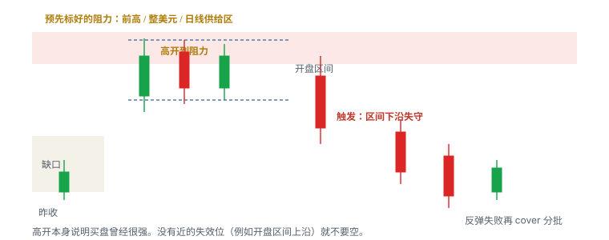
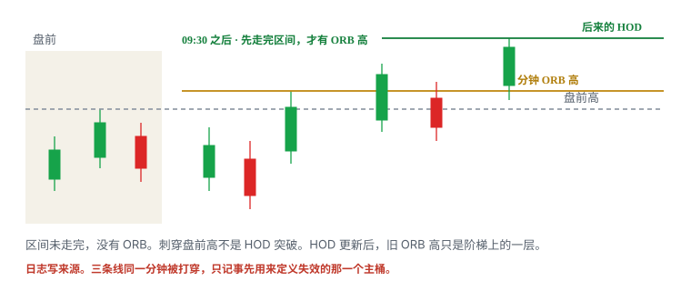

# 6.3 Gap-Up Short

> 一句话：高开到预先阻力不是开盘例行。Locate 在先，盘前高失败和开盘结构失守才是触发；50% 缺口只是筛选启发式；halt-up 尾部覆盖不了计划止损。

上一章把历史阻力画成区域：旧底部、小山顶、大突破套牢区。碰到那些线不是做空许可。拒绝之后向下接受才是触发。本章只取其中一种开盘形态：**价格已经隔夜或盘前跳到那片供给上方或里面，常规时段开盘后无法在高位被接受。**

课程叫它 Gap-Up Short，也叫 Gap-Up Resistance Short。名字容易听成「高开就空」。正文不是这个意思。高开本身说明买盘曾经很强。假突破式的上影很常见，真跌破也很常见。没有近的失效位就不要空。开盘第一秒对着缺口市价卖，是在和开盘拍卖对赌，不是策略。

本章是位置 setup，不是标的分类。6.4 的 Gap Fade 看的是「这类股票曾经有过高开回落的历史」。两者可以重叠，统计必须分开。卷五的 Gap and Go 是同一张图的另一侧：盘前高被接受做多。同一根盘前高，多空不能共用一个胜率。

```text
Locate → 预先阻力 + 盘前高
  → 开盘结构清楚
    → 拒绝之后向下接受
      → 失效近、仓位按 halt-up 尾部砍过
        → 分批 cover，剩余仓位仍有 trailing 失效
```

填不完这条链，缺口再大也不进样本。开盘不是必须参与的仪式。错过第一波，后面还有反弹失败。仓位默认比同等 1R 的多单更小，因为向上尾部更肥。

## 6.3.1 定义：高开到预先阻力

定义用一句话写完：

> 高开到一个**事先标好**的阻力（前高、整美元、日线供给区、盘前高），开盘后无法继续在高位被接受，回落到某个**开盘前或开盘后已写死**的结构之下。



能留下的只有四条。少一条，名字再熟也不做。

| 条件 | 必须看见什么 | 还不是什么 |
|---|---|---|
| 阻力预先存在 | 开盘前截图里已经画好的区域 | 开盘后在最高价上补的一条线 |
| 开盘结构清楚 | 盘前高、开盘区间、或冲高失败后的微结构低点 | 「看起来要跌了」 |
| 借得到 | Locate 已接受，Available 覆盖计划股数，费用进期望值 | 软件里有 Short 按钮 |
| 仓位砍过尾部 | 恢复时不利跳空 10%、20% 或更大，账户仍可承受 | 「我有止损」 |

触发不是高开百分比，也不是碰到阻力。触发是：**拒绝之后的向下接受**。常见写法有两种，必须事先选一种记账：

1. **盘前高失败。** 常规时段无法在盘前高之上被接受，跌回盘前高下方，并跌破一个已写死的微结构低点。
2. **开盘区间下沿失守。** 事先写死时长的开盘区间走完后，价格在区间低点之下被接受。

两种都要有近的失效：盘前高之上、开盘区间上沿、或刚形成的拒绝高点之上，再留滑点。没有近的失效，你只是在缺口里猜顶。

| | |
|---|---|
| 统计桶 | `GUS_PMH` / `GUS_OR` / `GUS_RETEST`（反弹回阻力再失败） |
| 位置 | 预先历史供给 + 盘前高 / 整美元 / 开盘区间 |
| 形状 | 冲高失败、更低高点、无法在阻力上方被接受 |
| 触发 | 拒绝之后向下接受：盘前高失守，或开盘区间下沿失守 |
| 止损 | 拒绝高点或区间上沿之外，含滑点。盘前高只是参考，不是成交保证 |
| 第一目标 | VWAP、短周期均线、前低、整美元 / 半美元，分批 cover |
| 不做 | 开盘盲空；借不到；第一波已远离失效位；催化强、量超预期、隔夜已接受更高价 |

缺口百分比大，潜在回落空间大，动能和 squeeze 风险也大。这两句话要一起写进计划，不能只抄前半句。

## 6.3.2 什么不是 Gap-Up Short

下面这些经常被误叫成本章。它们可以是别的 setup，但不是这一笔。

| 看见什么 | 它实际是什么 | 为什么不是本章 |
|---|---|---|
| 开盘第一秒对着缺口市价卖 | 开盘拍卖对赌 | 没有拒绝，没有向下接受，没有近的失效 |
| 高开很大，所以「一定回补」 | 缺口迷信 | 卷二写过：缺口可以当天填、部分填、数年不填 |
| 「这类股票以前高开都会回落」 | 6.4 Gap Fade | 标的分类启发式，不是位置触发 |
| 盘前高被接受后继续涨 | 5.9 Gap and Go | 同一根线的多头侧 |
| 没有缺口，只是盘中回到历史供给 | 6.2 历史阻力空 | 缺「高开到阻力」这一层 |
| 碰到日线 EMA 100 / 200 | 均线阻力，下一章 | 动态线，不是本章的静态供给 |
| 停牌恢复后第一笔就空 | 6.4 停牌恢复空 | 独立尾部策略，不是开盘缺口空 |
| 已经大跌一截再追空 | 空头版的追 | 离失效位远，下方空间已被吃掉 |
| 扫描器上今天是绿的、涨幅第一 | 状态，不是结构 | 颜色切换不是拒绝 |

隔夜已经接受更高价格时，不要机械套用「昨天有高位回落，所以今天高开就空」。卷七 ENTX 那一章会看到：前一日冲高回落，但盘后重新上涨并横盘，第二天盘前仍有量且守住支撑——短逻辑从阻力空改成了「可能有被套空头」，而多头仍然需要自己的支撑和触发。历史阻力没有作废，它只是不再是当天的第一假设。

同一根下跌里，你可能同时看到盘前高失守、开盘区间失守和 VWAP 失守。只选一个定义记账。否则样本会把「所有高开回落」都算进每一个名字，胜率变得没有意义。

## 6.3.3 Locate 先于图形

高开名单里最热的名字，往往也是最难借的名字。图形在 Locate 之前没有执行含义。6.1 写过机制，这里只写开盘空的顺序。

盘前必须完成：

1. 账户类型允许卖空（现金账户和多数 IRA 直接划掉本章）；
2. ETB / HTB 已确认；
3. Locate 报价已接受，Inventory 出现 Available；
4. 申请股数不超过计划真正可能使用的范围；
5. 预期利润明显大于 Locate 费 + 佣金 + 滑点 + 借股持有成本；
6. 知道当前是否已经或即将触发 SSR。

完成 Locate 不等于必须交易。付过借股费，仍可以全天空仓。把 Locate 费当成沉没成本去「找一笔空」，是在用固定成本强迫自己开仓。正确处理是：费用已经发生，是否开仓仍看触发；没触发就把这笔费记进当天成本，不要事后编一个不合格入场来摊。

```text
仅覆盖 Locate 费所需的每股跌幅 = 总 Locate 费 ÷ 实际成交股数
```

教学数。昨收 4.00，盘前 6.20，缺口 55%。Locate 每股 0.12，申请 800 股，总费 96。实际只空 400 股，仅覆盖 Locate 就要跌 0.24。若第一目标是 VWAP 6.00、入场 6.10，图上空间只有 0.10——方向对也付不起借股。这笔在开盘前就该降为观察，或把 Locate 申请砍到你真会用的股数。

询价、接受、库存到账、卖空成交，是四个动作。高开股的报价几分钟可以变一次。08:50 问到的每股费用，09:25 可能已经翻倍或没库存。开盘前再对一次 Available，不要拿一张早盘截图当全天许可证。

HTB 且费用已经吃掉计划 1R 的，本章默认仓位是 0。不是「先空一点看看」。空一点也是一笔有尾部的空头。


## 6.3.4 50% 缺口是筛选启发式

课程用较大的缺口百分比做筛选，视频里出现过 **50%** 这类阈值。这句话必须整句留下：

> 50% 是课程筛选条件，不是法规，也不是普遍最优参数。

```text
Gap % = (当前盘前价 − 前一常规时段收盘价) ÷ 前收盘价 × 100%
```

同一句话里至少核四件事，否则这个百分比没有执行含义：

- 当前价用 last、bid / ask 中点还是其他值；
- 前收盘是否复权，代码有没有变更；
- 盘前成交量够不够形成可靠缺口——几千股打出来的 50%，和几十万股打出来的 50%，不是同一句话；
- 昨日盘后新闻是否已经在 after-hours 走完，今天的「缺口」其实是昨天已经定价过的路。

缺口大意味着两件事同时成立，不能只记一件：

| 缺口大时你希望看见的 | 缺口大时同时变大的 |
|---|---|
| 若拒绝成立，回落到昨收或中途整美元的空间 | 开盘点差、停牌密度、借不到、squeeze |
| 更多短线多头的成本堆在高位 | 更多短线空头挤在同一根盘前高上 |

把 50% 写成扫描器条件可以。把它写成「过了 50% 就该空」不行。20% 但撞上 A 级套牢区、盘前高清楚、Locate 便宜，可能比 80% 但新闻极强、连续 halt、借不到的名字更接近可交易。区间外不是绝对禁止，而是你可能没有样本。换市场、换年份、换价格带，同一个数字会失效。写进计划，用样本验证。

教学数，全部启发式，不是建议阈值：

| 盘前缺口 | 常见误读 | 更接近事实的问题 |
|---|---|---|
| 15%–25% | 「不够大，没空间」 | 到第一供给还有没有 ≥ 1R？Locate 费占比多少？ |
| ~50% | 「到了课程门槛，可以空」 | 阻力预先存在吗？开盘结构清楚吗？催化是否强到该先观察？ |
| 100% 以上 | 「一定回补」 | 低价低流通盘会不会连续 halt up？失效位还近吗？ |

严格的 price gap 是两个相邻交易时段之间没有重叠的价格区间。盘前高低本身就是当天最常用的两层。把它们画成区域，而不是一根穿过最高一笔盘前成交的细线。把 gap 当空头目标前，先确认到缺口边还有没有 ≥ 1R，中间是不是真的空。缺口边缘是潜在反应区，不是「缺口一定回补」。

## 6.3.5 阻力必须预先存在

Gap-Up Short 的「Up」只说明怎么到达。空的理由仍是供给区。供给区必须在开盘前就在图上。开盘后在最高价上补一条线，再把这笔叫阻力空，是在用结果画原因。

画线顺序沿用 6.2，这里不重写四类阻力的全部细节：

1. 从当前盘前价向上扫描日线，只找当天可能触及的位置；
2. 先标旧底部，再标小山顶，再找大突破日的套牢区；
3. 进入历史分时图，标高成交横盘和 flush 前平台，不要把整根日线大 K 当阻力；
4. 检查整美元 / 半美元是否重合；
5. 给每个区域打 A / B / C。只把 A、B 写进当天空头计划。


盘前高、盘前低、昨收、局部 pivot、整美元，和历史供给是不同来源。它们可以叠在同一带，提高关注度，不是五个独立概率相乘。日志选一个主参考位。主参考位是你用来定义失效的那一根。

合格的事前图至少能回答：

- 这片供给是哪一天、哪一段成交留下的？
- 它是区域还是你事后喜欢的一个价？
- 盘前高在供给下沿、内部，还是已经刺穿上沿？
- 若开盘直接站稳在供给上方，第一假设是空还是改看下一层？

盘前已经站上供给上沿、并且在上方横盘有量，第一假设常常不再是 Gap-Up Short。价格已经在新的一侧被接受。继续空，等于在和已经完成的重估对赌。历史供给还在图上，它可能变成后来的回踩支撑，或更后面的下一层空——那是另一笔，另一个桶。

融资、权证行权、反向拆股会改写「历史套牢还在不在」。公开 float、short interest、borrow rate 都可能滞后。图表无法告诉你过去的持仓是否还在。所以阻力是机制假设，触发只能用当天的拒绝和向下接受。

## 6.3.6 盘前高点失败

盘前高是市场已经实际成交形成的参考，不是保证回落的天花板，也不是保证突破的地板。对空头，它通常是当天第一层、开盘前就能钉死的线。课程把盘前高当作风险参考：止损可以参考它，但不能保证在停牌或跳空时按该价成交。



三根线不要混叫一个「高点」：

| 线 | 何时存在 | 空头用法 |
|---|---|---|
| 盘前高 Premarket high | 开盘前钉死 | 失败高开的第一层；失守后才谈向下接受 |
| 开盘区间高 | 事先写死的 N 分钟走完之后 | 空头失效常放在这根之上 |
| 常规时段 HOD | 开盘后才开始更新 | 事后最高，不能当开盘前的阻力 |

盘前高失败，不是「开盘没过盘前高就空」。失败要被价格走出来：

1. 常规时段尝试盘前高，出现上影、更低高点，或无法在上方留下实体；
2. 随后跌回盘前高下方；
3. 再跌破一个事先写死的微结构低点（盘前 pivot、开盘后第一段回撤低、开盘区间低——开盘前选好）；
4. 在下方被接受，而不是一根影线扫过又收回。


上图在多头里读「实体站上才是接受」。空头同一标准：一根长上影插过盘前高又收回，是试探，不是空头许可；实体回到盘前高下方、随后的反弹不把线还回去，才更像接受。未收盘最高价、盘口闪一下、Level 2 上出现大卖单，都不是触发。图表定义结构，盘口只辅助执行。

盘前成交量通常更低、点差更宽，很多券商只接受限价单。所以盘前「突破」或盘前「失败」的质量，默认低于常规时段同样形状。一笔薄量打出来的盘前绝对高，可能只是错误成交或孤立打印。开盘前问：这根高是多次反应的区域，还是一根刺？多次反应的，权重大；一根刺，画成宽区，或降级为 C。

盘前高正好叠在历史供给下沿或整美元上时，关注度更高，假突破也更密。主桶仍只能选一个。推荐默认：位置记历史供给，触发记盘前高失败或开盘区间失守，不要把 confluence 写成三重确认。

教学数。昨收 5.00，盘前高 7.80–7.84，历史套牢下沿 7.90，整美元 8.00。开盘 7.72，第一根 1 分钟上影到 7.86，实体收 7.68。这还不是空：上影是试探。第二根跌破 7.60 的开盘后低点并在下方留下实体，才进入 `GUS_PMH`。失效若用 7.86 + 0.06 滑点 = 7.92，入 7.55，每股 0.37。单笔可亏 50 → 约 135 股，再按盘口和 halt-up 压力测试往下砍。第一目标若是 VWAP 7.40，空间 0.15，不到 1R——要么等更近的微结构把止损收近，要么放弃，不要靠加股数补空间。

若开盘直接打印在 8.40，盘前高 7.84 远在下方，这一节的盘前高失败不存在。你面对的是延伸高开。要么等新的开盘区间和更近的拒绝，要么当天不做空这一只。

## 6.3.7 开盘区间、触发、失效

开盘区间是事先写死时长的位置，不是事后挑一段「看起来像开盘」的高低。5.11 写过多头 ORB。本章用同一根时钟，方向相反。

```text
会话起点 = 常规时段开盘（以你的交易所为准）
时长 N   = 5 分钟（或你写死的 1 / 15）
区间高   = N 内已完成成交的最高价
区间低   = N 内已完成成交的最低价
触发     = N 结束后，价格在区间低下方被接受
失效     = 区间高 + 滑点
         或：冲高失败的拒绝高点 + 滑点（更紧，另开子桶）
不做     = N 尚未结束就空
         区间宽度使股数小到无意义，又不肯减仓
         到第一目标 < 1R（含 Locate）
         点差已吃掉计划边缘
         没有 Locate
```

N 必须在开盘前写死。没有事先时长，任何人都可以事后挑一段让这笔变成「其实做对了」。那不是开盘区间空，是作弊。含盘前的区间是另一个桶，不要和 09:30 起算的版本合并。

区间未走完，你没有区间低，只有一个还在形成的开盘波动。09:31 一根大红 K 打穿盘前低，不等于 5 分钟 OR 空已经触发。提前把未完成区间当触发，和多头提前把未完成区间当 ORB，是同一类错误。

两种合法空头触发，分开统计：

| 桶 | 触发 | 失效 | 常见失败 |
|---|---|---|---|
| `GUS_PMH` | 盘前高无法被接受，跌破写死的微结构低 | 拒绝高 / 盘前高之上 | 影线当失败；开盘已远离盘前高还用它当近端失效 |
| `GUS_OR` | N 走完后区间低下被接受 | 区间高之上 | 事后改 N；区间过宽；N 未完就空 |
| `GUS_RETEST` | 第一波已跌，反弹回供给 / 盘前高再次失败 | 新的拒绝高之上 | 在长红 K 底部追空，冒充回抽失败 |

第一波已经远离失效位再追空，止损距离远，且容易遇到反弹。等反弹失败，比在长红 K 底部再卖更接近「近的失效」。这和多头「大阳线中途市价追」是同一类错误，只是方向反了：追的定义是离失效位太远。

教学数。开盘前写死 5 分钟空头 OR。09:30–09:35 高 9.40、低 8.95，盘前高 9.28，历史供给 9.20–9.50。09:36 一根 1 分钟实体收在 8.88。`GUS_OR`：入 8.86，失效 9.40 + 0.08 = 9.48，每股 0.62。单笔可亏 50 → 约 80 股。再按「恢复上跳 15%」压一次：80 × 8.86 × 0.15 ≈ 106，超过单笔上限就再砍。第一目标 VWAP 8.70 只有 0.16，不够 1R——合格的第一目标至少要能覆盖 Locate 和滑点，否则放弃穿越、改等 `GUS_RETEST`，或当天不做。

若 09:30 开盘价 9.90，5 分钟区间还没走完就已经远离所有事前线：你没有 Gap-Up Short，只有延伸。仓位写 0。

## 6.3.8 不要开盘盲空

直接在开盘盲空，最容易遭遇红翻绿式的向上挤压。等待开盘结构失守，比赌第一分钟的方向更可证伪。

开盘前后是点差最宽、停牌最多、计划最容易被情绪冲掉的一段时间。拍卖打印的第一笔成交，不是「市场已经决定要跌」。它只是开盘匹配的结果。随后一分钟可以向上扫完所有隔夜空单，再下来；也可以直接下去。你事先不知道是哪一种。

盲空的典型句子，没有一句是触发：

- 「缺口太大了，一定会回。」
- 「扫描器第一名，空头会赚钱。」
- 「昨天上影，今天高开就是送给空头的。」
- 「我已经付了 Locate，不开仓浪费。」
- 「第一根是红的。」
- 「别人都在空。」

事后图可以呈现清晰下降趋势。开盘时仍可能先上冲并触发止损。用收盘后完整的大红 K 证明自己当时就该空，是在用未来信息评分。复盘必须看当时可见的盘前图、当时点差、当时有没有拒绝。

红翻绿是 5.6 的多头位置：先到昨收下方，再站回去。高开股若开盘后先砸、再收回昨收或开盘价之上，盲空的止损会在最拥挤的回补里成交。你的 cover 是别人红翻绿的燃料。这不是故事，是订单方向：空头止损是买入。

判定清单（开盘第一分钟就能用，用来决定**不做**）：

- 还没有任何已完成的拒绝；
- 所有事先画好的失效位都在远处，或根本还没形成开盘区间；
- 要把止损放到盘前高或日线上沿，每股风险已经大于单笔上限所能承受的股数；
- 点差已经宽到一跳就超过计划 1R；
- 你想进场的理由是缺口百分比、扫描器排名或 Locate 费，而不是某根线被向下接受。

处理：仓位写 0。不要用「先空一点」绕过定义。等盘前高失败、开盘区间失守，或反弹回供给再失败。若全天不再给出近端失效，全天不做这一只。这是清单的合法输出。

有一种看起来像「还没盲」的假象：开盘价刚好在盘前高下方两三分钱，但盘口已经 0.20 宽。图上距离很近，成交均价会把你送到延伸区的另一侧。判定要用**可成交价**，不用 K 线开盘价。

## 6.3.9 量不是反转证明

有的课用「盘前成交量 × 10」粗估常规时段总量，再拿这个数字去和历史阻力日的成交量比。视频自己也展示：持续突破、停牌或消息变化时，倍数会完全失效。

不同盘前时长、开盘前剩余时间、股票类型和市场环境，不能共用一个固定倍数。更合理的用法是把它当基线，并记录预测区间：

- 截止同一盘前时间；
- 与历史相似事件比较；
- 根据开盘首 5 / 15 / 30 分钟重新更新；
- 给出高低情景，而不是单一数字。

一旦出现连续新高、新闻或停牌，早先的盘前基线就应作废。错误做法是因为「已经超过预测量」就认定价格一定反转。量能扩张说明新的关注者仍在进入。阻力交易比较的是**今天的量有没有在阻力区开始衰竭**，不是和一个固定倍数赛跑。

历史阻力日成交量与今天估算总量的比率，可以作为复盘特征。没有证据表明某个固定比例能普遍预测反转。Float 越大或越小，也不会机械决定阻力强弱。

开盘后看量，只当上下文：

| 观察 | 可能含义 | 不能推出 |
|---|---|---|
| 冲到供给区时量萎缩、上影变长 | 推进变弱，值得看失败 | 现在必须空 |
| 冲到供给区时量扩张、实体站上 | 新的关注者在接受更高价 | 「量太大了所以顶了」 |
| 跌破盘前高时量扩张 | 向下接受更像那么回事 | 会跌到昨收 |
| 已经超过盘前量 × 10 | 你的基线错了，或事件比预想大 | 历史阻力一定生效 |

量来自同一条价格路径。不要把「量大 + 上影 + 碰到整数」当成三个独立信号相乘。日志里量是一列特征，不是第二套触发。

## 6.3.10 催化与隔夜接受会否决空

新闻越强、成交量越超预期，历史阻力越可能直接被突破。这不是附注，是第一过滤器。

盘前把催化写成可核验的事实，不要写成情绪：

- 原始来源、发布时间、和公司规模是否相关；
- 是新鲜信息，还是旧闻在盘前被重新传播；
- 有没有同步的 S-3 / ATM / 424B / 权证 / 反向拆股——供给预期变了，套牢叙事也变了；
- 盘后 / 盘前是否已经在供给上方被接受。

无法解释的上涨可以观察技术结构，但应降低确信、仓位和持有时间。不要把「纯技术」四个字写进催化栏来回避「我没读文件」。坏消息下的高开更少见，但仍可能发生在并购、空头回补或错误传播里。读不到原因，空头仓位默认也是 0——你不知道自己在和什么对赌。

隔夜路径比昨天的日线更优先。昨天冲高回落，只说明昨天。盘后若重新走回高位并横盘，第二天盘前又守住支撑，开盘第一假设就不是 Gap-Up Short。7.4 ENTX 是这本书里的标准否决例：左边可以画成标准供给，右边的隔夜接受把空头许可拿走了。地图要更新。昨天的高位成交区还在，它可能在更后面变成阻力，不再是开盘第一分钟的空头许可。

第一假设被否决之后，不要为了「计划写过空」而寻找更差的入场。空头计划的合法输出包括：全天不空这只。多头若要做，用卷五自己的支撑和触发，不要用「空头被套」当买入条件。Squeeze 是解释，不是入场。

强催化 + 高开 + 盘前高被接受，优先看成 5.9 的观察对象，而不是「更好的空」。同一只股票同一天，可以先观察多、再在真正的拒绝后空，但必须是两笔、两个桶、两套股数。不许用一笔仓位来回改口。

## 6.3.11 Halt-up 尾部

高开小盘最肥的那一侧，往往不是你计划的回落，而是向上停牌后的第一跳。计划止损覆盖的是连续成交。覆盖不了这一跳。


对 Gap-Up Short，halt-up 不是小概率脚注。低价、低流通、主题资金、开盘点差已经很宽的名字，开盘后几分钟就可以触及 LULD 上沿。进入停牌后不能连续调整止损。恢复价可以直接越过风险线。做空还可能同时遇到：无可借股、Locate 失效、强制买回、连续向上停牌。

因此：

- 止损单在停牌期间无法让你退出；
- 恢复可以向任一方向跳空，halt up 并不保证恢复后继续涨，也不保证回落；
- halt up 时挂一张市价买单等恢复，不是安全方案——市价会在未知价格成交；
- halt down 时挂市价买单等恢复，和 halt up 时挂市价卖单等恢复，是同一类赌博；
- 课程若把某类停牌恢复形容成接近保证的全垒打，必须明确拒绝：市场交易没有保证。

仓位必须在进去之前就按最坏情况砍过：恢复时不利跳空 10%、20% 或更大，账户是否仍可承受。通不过这一句，上限就是 0。这不是胆小，是承认计划止损在这一跳上是假的。

连续 halt up 把本章从「开盘结构空」变成另一类业务。6.4 的停牌恢复空是独立策略，有自己的触发、更小的上限、以及「没有明确券商规则就禁做」的默认。不要把一笔普通的 `GUS_PMH` 在第一次停牌后改名为停牌恢复空，并加大仓位。第一次停牌出现，普通 Gap-Up Short 的默认动作是：能出则按计划出，出不去就接受尾部已经由股数限制；恢复后重新观察，当作新的一笔，股数只减不增。

LULD 上沿不是空头目标。价格带动态变化；到达价格带不一定立即暂停；暂停可能超过常见时间；多个数据源可能在恢复瞬间不同步。空头的 cover 目标应画在带内仍有成交的位置：VWAP、整美元、前低。把目标画在下沿「再多空一点」，是在用监管机制当流动性。

教学数。入场 6.40，计划止损 6.70，每股 0.30。200 股看起来是 60 美元的 1R。恢复时打印 7.70，每股亏 1.30，这一跳是 260 美元，再加滑点。若你不能接受 260，200 股一开始就不该存在。按 20% 上跳：6.40 × 0.20 = 1.28，单笔可亏 50 → 最多约 39 股。Available 3,000 和热键默认 200，在这一栏里都没有投票权。

## 6.3.12 仓位、cover、SSR

卷四的公式仍然成立，空头再取一次更小值：

```text
股数 = 单笔可承受亏损 ÷ (|入场价 − 失效价| + 预留滑点)
再与 halt-up 压力测试后的上限取较小值
再扣 Locate 后，第一目标仍须 ≥ 1R，否则仓位 = 0
```

加仓摊平不做。空单被套后加仓，是在无限亏损的一侧放大名义敞口。价格按预期下跌后，才考虑是否用更近的失效位加第二笔；加完必须重算全仓风险。共同失效价若仍在拒绝高点之上，总风险通常显著增加。超预算就减股数，或不加。

Cover 是买入。下跌中买家变少，空头 cover 是在抢已经变薄的买盘。分批 cover 能锁定部分利润，剩余仓位仍需明确 trailing 失效。常见的分批位置：

- 第一批：VWAP，或最近的整美元 / 半美元；
- 第二批：前低、盘前低、开盘区间外的下一层支撑；
- 剩余：结构破坏（更高低点被接受、重新站上盘前高或供给上沿）则全部买回。

不要把「拿到昨收、缺口回补」写成必须发生的目标。缺口可以不回补。第一目标不够 1R 就不要开仓，不要靠幻想回补来补盈亏比。

SSR 不是禁空，也不是 squeeze。Regulation SHO Rule 201：相对前一常规时段收盘下跌至少 10% 后，普通空单不能在当前最优买价或更低显示或执行。高开回落的股票，跌深了会亮起 SSR。这时你可能买得到 cover、卖不掉新空单。计划里要写清「填不掉就放弃」，不能改口改成市价砸 bid。把 SSR 标签当成「空头要被挤、应该翻多」，是把执行限制误读成方向信号。

订单选择服从 6.1：Stop market 在跳空和恢复时可能买得很贵；Stop limit 可能根本买不进。开盘点差宽时，用可成交限价限制最坏卖价；未成交就放弃，不向下追着砸。止损侧预留的滑点，按更差的那一侧（向上）估，不要按平时多单的滑点估。

日内空头默认当天 cover。隔夜空头是另一类业务：借股费、隔夜跳空、召回，不和 `GUS_*` 混在同一个统计桶。

## 6.3.13 盘前清单与条件式计划


这份清单用来缩小空头名单，不是卖出许可。任一项答不上来，该股降为观察或删除。数字阈值全部启发式，改完必须写进计划。

```text
账户允许卖空？现金 / IRA 已排除？
Locate 已接受？Available ≥ 计划股数？费用进期望值？
新鲜催化原文和时间？是加强空还是该先否决空？
隔夜是否已在供给上方被接受？
历史供给 / 整美元 / 盘前高画好了没有？主参考位是哪一根？
盘前高是多次反应，还是一根薄量刺？
开盘区间时长 N 写死了没有？触发选 PMH 还是 OR？
失效价、滑点、halt-up 10% / 20% 压力测试过了没有？
第一目标到入场 ≥ 1R 吗？含 Locate 和点差之后还成立吗？
当前 / 预计 LULD 上沿离失效多远？连续 halt 风险接受吗？
SSR 若亮起，新空单填不掉时是否放弃？
A / B / 只观察 / 明确不做，分好了没有？
六栏写齐了没有：Setup / Trigger / Invalidation / Size / Exit / No-trade？
单笔和单日亏损锁写死了没有？
```

合格写法是条件，不是故事：

```text
Setup: GUS_PMH
Trigger: 09:30 后无法在 PMH 7.84 上方被接受，
         且 1 分钟实体跌破 7.60
Invalidation: 7.92（拒绝高 + 滑点）
Size: 单笔 50 ÷ 0.37 → 先 135 股，halt-up 15% 后再砍到 60
Exit: 1/2 VWAP；1/2 前低；站回 7.84 全部 cover
No-trade: 开盘可成交价 ≥ 8.10；点差 > 0.12；
          无 Available；催化原文是并购 / 明确新合同；
          盘后已在 8.00 上方横盘被接受
```

不合格写法：「好空」「Locate 都付了」「昨天套牢盘一定会卖」「高开 50% 必回」「今天必须空一只」。故事会诱导忽略否定。观察名单上出现这类句子，就重写；写不成条件就删除该股。

排序只允许四档：

| 档 | 含义 | 开盘动作 |
|---|---|---|
| A | Locate 可接受、供给预先存在、盘前高清楚、第一目标 ≥ 1R、halt-up 压过后仍有股数 | 按已写触发等，不临场换股 |
| B | 缺一层（费用偏高、供给只有 B 级、区间可能过宽） | 只在非常干净的触发且再降股数时考虑 |
| 只观察 | 催化过强、隔夜已接受、点差 / 停牌不可接受 | 默认不空 |
| 明确不做 | 写下来 | 禁止开盘后临时升级 |

按顺序处理前几只高开，而不是只空排名第一。第一名可能借不到、正在 halt、刚宣布融资，或失效位只有在日线上沿。没有名字也不空，是合法输出。

## 6.3.14 教学数：同一高开，三种完全不同的账

同一只股票，昨收 4.00，盘前 6.20（缺口 55%），盘前高 6.35，盘前低 5.90，历史供给 6.30–6.60，整美元 6.00 / 7.00。Locate 每股 0.08。单笔可亏 50。以下三笔不要共用胜率。

**账 A：开盘盲空。** 09:30 打印 6.28，市价卖，均价 6.22。止损心里想着盘前高 6.35，实际盘口 0.18 宽。没有拒绝，没有向下接受。随后 30 秒扫到 6.55，停牌。恢复 7.10。这不是 Gap-Up Short 的失败样本，这是未定义交易。记 `UNPLANNED_OPEN_FADE`，不要事后改名为本章。

**账 B：盘前高失败。** 开盘 6.18，两根 1 分钟上影到 6.36 / 6.33，实体都回到 6.20 下。第三根收 6.08，跌破开盘后低 6.12。`GUS_PMH` 触发。入 6.06，失效 6.36 + 0.06 = 6.42，每股 0.36。50 ÷ 0.36 ≈ 138 股。halt-up 15%：6.06 × 0.15 × 股数，要压到约 55 股才守住 50。Locate 55 × 0.08 = 4.40，第一目标 6.00 空间 0.06，仍不够 1R。正确输出：触发成立，但空间不够，仓位 0，或改等反弹到 6.20–6.30 的 `GUS_RETEST`。方向判断对，不等于这笔可做。

**账 C：开盘区间失守后的回抽。** 5 分钟 OR 高 6.40、低 6.05。09:36 跌破 6.05，你没追。09:42 反弹到 6.22 出现更低高点，再次跌破 6.10。`GUS_RETEST`。入 6.08，失效 6.26 + 0.05 = 6.31，每股 0.23。50 ÷ 0.23 ≈ 217，halt-up 15% 砍到约 54 股。第一目标 6.00 仍只有 0.08。若你接受第一目标改到盘前低 5.90（空间 0.18，仍勉强），必须事先写死，且 6.00 整美元可能先挡住。到不了 5.90 就按计划在 6.00 cover，不要改口成「缺口一定补完」。

三笔的共同点：55% 缺口什么也没决定。决定盈亏比的是失效距离、可成交价、Locate 和 halt-up。决定能不能叫本章的，是拒绝之后的向下接受。

## 6.3.15 复盘字段

每笔 Gap-Up Short 至少记录：

| 字段 | 记什么 |
|---|---|
| 事前截图 | 开盘前实际画出的供给、盘前高、昨收、整美元。事后补画则样本作废 |
| 桶 | `GUS_PMH` / `GUS_OR` / `GUS_RETEST` / 或 `UNPLANNED_OPEN_FADE` |
| 缺口 % | 口径：用的价、前收是否复权、盘前量 |
| 50% 启发式 | 是否用它筛选；有没有把阈值当成入场 |
| Locate | 报价、申请股数、实际成交股数、费用、是否 Credit |
| 催化 | 原文链接、时间；隔夜是否已接受更高价 |
| 入场时是否已有失败信号 | 碰线、影线，还是拒绝之后的向下接受 |
| 触发周期 | 1 / 5 分钟，是否和失效同一周期 |
| 计划止损与实际成交 | 含点差、滑点、未成交、SSR 填不掉 |
| 最大有利 / 不利波动 | 含开盘第一分钟最宽点差 |
| halt | 是否 halt up；reason code；恢复价；计划止损是否被越过 |
| cover | 分批位置；剩余仓位的 trailing 失效；是否改口等缺口回补 |
| 规则违约 | 是否因盈利结果美化了原本不合格的入场；是否开盘盲空事后改名 |
| 相邻桶污染 | 有没有同时记进 6.2、6.4 Gap Fade、5.9 或 5.6 |

把「Locate 了但没开仓」也记进样本。把「以为是 Gap-Up Short、其实是隔夜已接受 / 强催化突破 / 开盘盲空」单独打标签。过几个月你要能回答：自己是在真的拒绝样本上亏，还是在开盘第一秒亏。两种亏法的改正动作不同。前者可能是失效太近、目标太远或 Locate 吃掉边缘；后者是默认 0 没守住。

复盘不能只圈最终完整大红 K 的图。应记录开盘当时：有没有已完成的拒绝、点差多少、盘前高是否只是一根刺、当时看不看得见 halt 带。事后图看起来顺滑，不能证明当时那根未完成 K 线就该空。只收藏后来跌下去的图，会高估任何高开过滤的优势。

这套方法的价值是建立「高开之后仍要等价格在预定区域失败」的纪律。最需要丢弃的是固定缺口百分比、固定量比、开盘例行空，以及「历史套牢盘一定会卖」的确定性。

## 先记住这些

- Gap-Up Short 是高开到预先阻力之后的失败，不是开盘例行，也不是缺口百分比。
- Locate 在先。完成 Locate 不等于必须交易。费用进期望值。
- 50% 之类阈值是课程筛选启发式，不是法规，也不是入场。
- 盘前高失败要被常规时段走出来：无法在上方被接受，再向下接受。影线不是触发。
- 开盘区间时长事先写死。没有近的失效位就不要空。
- 开盘盲空最容易变成红翻绿的燃料。事后完整大红 K 不能证明当时该空。
- 盘前量 × 10 不是成交量定律。量扩张不是反转证明。
- 强催化、量超预期、隔夜已接受更高价，第一假设可以不再是空。
- halt-up 尾部覆盖不了计划止损。股数按恢复上跳砍过。连续向上停牌后只减不加。
- 和 6.2 盘中阻力空、6.4 Gap Fade、5.9 Gap and Go 分开记账。

## 不要做的事

- 开盘第一秒对着缺口市价卖，或用「已经付了 Locate」强迫自己空。
- 开盘后在最高价上补一条线，再把这笔叫阻力空。
- 把 50% 缺口、盘前量 × 10、历史套牢叙事当成触发。
- 把一根盘前刺、一根开盘上影、Level 2 大卖单当成盘前高失败。
- 开盘区间还没走完就空；第一波已远离失效位还追空。
- 止损只写盘前高，却当它在停牌里也能成交。
- halt up 时挂市价买单等恢复；第一次停牌后加仓改名为停牌恢复空。
- 空单被套后摊平；把亏损日内空改成隔夜；把 SSR 当成必涨或多头许可。
- 用收盘后的长红 K 证明自己当时就该盲空；把 Gap Fade、阻力空、Gap and Go 并进同一个胜率。
