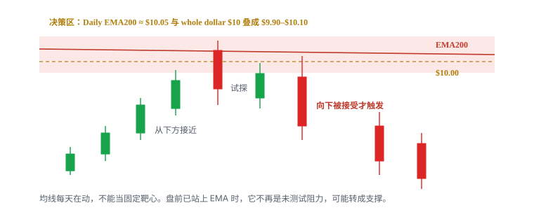
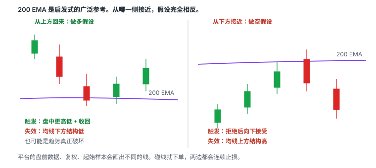

# 6.4 Daily EMA 阻力

> 一句话：Daily EMA 是会移动的决策区，不是到线就反转的按钮；多头用它准备止盈或当收回后的支撑，空头用它找拒绝之后的向下接受。

6.2 处理的是历史结构：旧底部、小山顶、大突破日留下的套牢区。那些线钉在过去成交过的价格上。本章处理另一类位置：平台每天算出来、人人能看见、会跟着收盘价挪动的日线指数均线。

整美元、半美元、盘口大单、VWAP、短周期均线都被突破之后，上方还剩什么？对已经大幅高开的股票，过去的支撑往往扔在很远的下方。当天更需要一张从近到远的上方地图。Daily EMA 是这张地图里现成的一层。

它同时服务多空，方向完全取决于价格从哪一侧接近：

- 做多的人：接近强阻力时准备止盈或至少降低预期；突破并站稳后，同一条线才可能改口当支撑。
- 做空的人：接近时开始准备 Locate、观察失败信号、寻找近的失效位；碰线本身不是卖出许可。
- 空仓观察者：提前知道哪些价格值得盯，而不是等反转发生后才解释。

卷五 5.12 把「到达日线 200 EMA 之后的反转」收成一个逆势 setup。本章更宽：它是高开股的上方路标，也是下跌回到均线时的下方路标。两章可以看同一条线，日志名字不要混。碰线只提供语境。触发仍是盘中结构。

## 6.4.1 这一章在赌什么

Daily EMA 交易赌的不是「均线有磁力」，也不是「200 日是宇宙常数」。它赌的是一件更窄的事：

**足够多的人把同一条日线均线画在相近的价格带上。价格第一次认真测试这条带时，供给或需求更可能在这里集中。你不预测它必须反转；你只在价格对该带做出可证伪的反应之后，按事先写好的方向下单。**

把它拆开，才能知道哪一句话被证伪：

| 句子 | 被什么证伪 |
|---|---|
| 这是日线图上的均线，不是分钟均线 | 你把 1 分钟 EMA 200 当成 Daily EMA 200 |
| 当前价格路径上，它是下一个有实际意义的障碍 | EMA 200 远在 40% 之外，或已经贴在现价几分钱里 |
| 多个独立依据落在同一带 | 只有一条孤立均线，周围没有整数位、历史结构或失败 K |
| 价格对该带做出拒绝或接受 | 只有影线扫过，或盘前已经明确站在另一侧 |
| 你能按失效价附近离开 | 点差失控、停牌跳过止损、借不到、Locate 费吃掉目标 |

这笔交易**不是**在赌：

- 碰到均线的那一 tick 就是最高价或最低价；
- EMA 100 或 200 对所有股票、所有催化同样有效；
- 第一次触及一定成功，第二次一定失败，或反过来；
- 突破瞬间穿线就完成「阻力转支撑」；
- 视频里回落的案例可以当胜率。

「我做 Daily EMA」填不进交易计划的任何一栏。均线只负责提出「在哪观察」。完整策略至少需要：

```text
股票池 + 催化与量 + 均线带 + 叠加 + trigger + invalidation + sizing + exit + Locate/成本
```

图形名称只填 Setup 一栏。屏幕上一次成功的回落，不能当作统计验证。课程选出的高开股案例是教学切片，不是回测。

## 6.4.2 高开股为什么更重视上方

讲师主要交易的是盘前已经大幅跳空上涨的 gapper。这类股票开盘时往往已经远离过去的支撑。只要新闻、成交量和资金流仍然强，价格本身的上涨动量就可能充当短期支撑。旧支撑还在图上，但对当天的第一笔交易常常用不上。

因此注意力更多放在上方：下一个可能出现集中卖压的地方。Daily EMA 的好处是——你不必向左翻几个月去找模糊的旧高，平台会把一条人人能看见的曲线画出来。坏处也在这里：人人能看见，不等于人人会在同一 tick 离场；强催化可以把「人人能看见」的线直接打穿。

做多接近该带时，问题不是「还能不能涨」，而是「这一段冲动还值不值得用原来的仓位和原来的目标去持有」。做空接近该带时，问题不是「已经涨太多所以该跌」，而是「预先画好的供给带有没有出现失败，失败之后有没有近的失效」。

这里的阻力仍然是区域。单一 EMA 的意义有限。和整数位、历史套牢区、冲高失败的 K 线叠在同一带时，观察权重才上升。权重上升不是胜率保证。

## 6.4.3 阻力为什么会形成

理解成因的目的，是避免把均线当成没有逻辑的魔法线。视频给出三类参与者，足够解释大多数盘面。

**等待机会的空头。** 不同交易者可能独立找到相似的日线位置。价格接近该区域时，做空卖单同时增加。这是可能的供给来源，不是保证。借股贵、SSR、可借库存薄，都会让「大家都想在这儿空」变成「大家都挤在这儿空」，结果可能是回补，不是下跌。

**过去被套的持仓者。** 一只股票曾在高位有大量成交，之后大幅下跌。没有止损、继续持有的人会被套在高位。将来价格重新回到其成本区时，一部分人会想「终于解套」，于是卖出。逻辑是：

```text
过去高成交区 → 下跌套牢 → 价格返回 → 解套卖盘
```

Daily EMA 本身不是套牢区。它只是一条计算结果。当这条线刚好穿过过去的高成交平台，两类故事叠在一起，观察价值更高。图表无法告诉你这些历史持仓是否还在。公司行动、换手、时间都会改写筹码。所以这是机制假设，不是可观察事实。

**当天多头的连锁离场。** 前两类卖压让价格从阻力处回落后：新买家看到冲高失败，参与意愿下降；成交量开始减少；已经入场的日内多头陆续离场；离场卖单进一步压低价格。这解释了为什么一个阻力失败有时不只产生一根红 K，而会发展成持续较久的下跌。它同样是事后叙事。交易上你能用的只有：冲高失败、更低高点、支撑跌破。

三类人可以同时出现，也可以一个都不出现。均线不会「制造」卖压。它只是一个容易被共同盯住的坐标。

## 6.4.4 Daily EMA 是什么，不是什么


EMA 把过去多个交易日的价格压缩成一条平滑曲线，并对较近的价格赋予更高权重。递推形式在 2.4 已经写过：

```text
EMA(today) = α × Price(today) + (1 − α) × EMA(previous)
α = 2 / (n + 1)
```

本章说的是：

- **Daily EMA 100**：日线图上的 100 日指数移动平均；
- **Daily EMA 200**：日线图上的 200 日指数移动平均。

EMA 比简单均线跟得稍紧，**仍然滞后**。价格先走，线后挪。它不是支撑墙，不是阻力墙，不是买卖指令，也不是未来价格的无偏估计。价格碰到均线后有没有反应，才是事实。

它不是：

- 精确到一分钱的入场价；
- 200 分钟均线、200 根 1 分钟 K 的均线、或「200 这个数字本身」；
- 可以事后轮换 8、9、10、20、21、50、100、150、200 直到「刚好挡住」的那条曲线；
- 可以替代催化、成交量、盘口和结构的独立系统。

输入数据会改线的位置。你必须知道自己的平台用的是：收盘价还是 typical price；是否包含盘前盘后；是否复权；当前未收盘日 K 会不会让均线在盘中漂移。你下单用哪套数据，就用哪套算触发和失效。不要图表软件一条线、券商另一条线。

## 6.4.5 时间框架混用是最贵的错误


不要把 Daily EMA 200 误解成 200 分钟均线。时间框架是日线，每根 K 代表一天。一分钟图上的 EMA 100 / 200 是另一组信号，不能和日线均线混用。同一个数字 `200`，在 1 分钟、5 分钟、15 分钟、日线上完全不同，因为每个周期的输入 K 线不同。

常见混用有四种，成本都很高：

**把盘中短均线当成日线阻力。** 1 分钟 9 EMA、5 分钟 20 EMA 回答的是当天微观动量。它们可以在日线 EMA 下方反复提供回踩。你若在 1 分钟 9 EMA 上做空，却在日志里写成「Daily 200」，三个月后样本是脏的。

**用日线均线当盘中触发。** 日线告诉你「今天可能在哪一带改变」。1 分钟或 5 分钟告诉你「现在有没有拒绝、有没有向下接受」。小周期没有触发，单靠「碰到 200 EMA」不够。

**用小周期转换去空一个大周期仍在创新高的股票。** 可以做，但 R 要更苛刻，样本要分开记。这是在逆大级别趋势。5.12 的半仓启发式从这里来，不是从均线周期来。

**持仓周期和画线周期对不上。** 每次说出「均线起作用了」之前先回答：

1. 我看的是 1 分钟、5 分钟还是日线？
2. 我打算持仓几秒、几分钟还是几小时？
3. 当前回调是否真的破坏了高一级结构？
4. 我的止损依据属于哪个时间周期？

若用 1 分钟图入场，却等日线级别判断来证明自己正确，风险会失控。一笔交易只能有一个主风险周期。日线 EMA 是位置层；盘中结构是触发层；止损必须和仓位用同一套结构点来算。

未收盘的日 K 还会变。开盘后三十分钟，今天的「收盘价」根本不存在，但有的平台已经把当前价喂进 EMA，线会在盘中轻微漂移。不要把这种漂移当成新的信号。盘前把昨日收盘算出来的均线价记下来，盘中用那条带来观察，比盯着跳动的小数更干净。

## 6.4.6 100 与 200 是启发式，不是物理定律

课程基于个人经验，给出使用优先级：

- Daily EMA 200 通常作为更优先的观察层；
- Daily EMA 100 的权重相对低一些；
- 当 EMA 200 离当前价格太远，EMA 100 才更有实际交易意义。

这是启发式，不是物理定律，也不是这本手册的盈利保证。200 被优先观察，主要因为它被广泛画在图上，订单更容易在附近聚集——这是行为叠加，和「200 这个窗口在数学上最优」不是一回事。换一组数字，线会挪地方，历史图形看起来也会「更准」。那是拟合，不是发现。

不要事后轮流尝试 8、9、10、20、21、50、100、150、200，直到找到「刚好托住」的那条线。计划里写死你用哪两条。改参数必须另开样本。

「先遇到」不等于「更强」。价格上涨时会先测试更近的那一条；若强动能突破它，更远的那一条才是下一层候选。两条线都要画出来，按价格从近到远排列。

EMA 100 不是固定使用，而是取决于它在当前价格路径中是否是「下一个有实际意义的障碍」。新闻和量能不足以支持持续大涨、而 EMA 200 仍在很远的上方时，更近的 EMA 100——尤其再叠半美元——才有当天的决策价值。EMA 200 已经贴在现价几分钱内、一天之内来回穿越，它就退化成噪声，不能当独立障碍。

斜率也是启发式过滤，不是开关：明显上斜的 200 日线，作为上方阻力时，价格要穿过一条仍在抬高的带；走平的均线，趋势意义更弱，两侧来回扫止损更常见。不要因为均线「向上」就禁止做空，也不要因为均线「向下」就禁止做多。方向仍看接近哪一侧，以及盘中有没有失败。

不同平台的盘前数据、复权和起始样本会使数值略有差异。小盘还要先问这张日线能不能信：反向拆股会把旧价格按比例抬高，复权后的均线可能穿过从未真实成交过的价。8.4 写过复权。本章只要求：均线价和历史阻力一样，先确认口径，再画带。

## 6.4.7 均线每天在动，不能当固定靶心

历史高点钉在一个价。Daily EMA 不钉。每个交易日收盘后，线都会移动。强趋势里，200 日线可以一天走几美分到几美元，取决于股价和波动。

所以你不能把上周四记下的 10.02 永远当本周的阻力。盘前重新读数。把「昨日收盘对应的 EMA 100 / 200」写进计划，并允许它是一个带，而不是一个点。

动态还有一层含义：你今天看见的均线，已经包含了昨天的收盘。昨天若是大阳线，均线会被向上拽；昨天若是大阴线，均线会被向下拽。高开股常常是「价格已经跑到均线前面」，不是「均线在追价格」。路标图要按今天的现价去排，不要按上周的记忆去排。

反复测试会消耗一侧订单，也可能说明该区域失效。同一条 Daily EMA，开盘测一次、午盘再测一次，第二次的权重通常低于第一次——除非第二次叠上了新的失败结构或新的整数位。第几次必须声明，并写在日志里。

## 6.4.8 区域，不是一个 tick


阻力不是「到这个价一定反转」的精确点，而是卖压更可能集中出现的**价格区域**。市场不会精确停在你画的那根线上。点差、滑点、影线都会让价格在一条带状区域里来回。把 EMA 当成精确到一分钱的墙，是本章最常见的执行错误。

例如 EMA 200 位于 10.02，整美元在 10。虽然两个数字不完全相同，仍可把 10 附近看成一个阻力区域，而不是争论到底应画在 10.00 还是 10.02。定义成 `9.90–10.10` 这样的带，比单点更可执行。

带的宽度至少要考虑：

- 当前点差；
- 这只股票最近几根 1 分钟 K 的典型影线；
- 你计划止损必须留出的滑点；
- 叠加的整数位、历史平台上下沿。

点差已经 0.08、你却在 10.02「精确」空，线本身没有执行意义。一次跳动就跨越 0.50 的低价股，单独强调「均线在 10.07、整数在 10.00」也没有执行意义——它们已经是同一个带。

真正要观察的是越线后能否继续成交并站稳，不是最高价是否高出几分钱。影线刺进带内又收回，和实体穿过带并在另一侧停留，是两种事实。前者是试探，后者才进入「接受 / 拒绝」的讨论。未收盘最高价不是突破。影线插一下不是接受。

「接近」必须量化。写 `EMA200 = 10.05，决策区 9.90–10.10` 还是 `第一次触及均线价`，不写就会在 10.18 追空并称之为 Daily EMA 做空。接近的定义写进计划，盘中不许改口。

## 6.4.9 叠加提高观察权重，不把概率相乘



单一阻力的意义有限；多个独立依据落在同一价格附近时，观察优先级更高。常见叠加包括：

- Daily EMA 200 + 整美元；
- Daily EMA 100 + 半美元；
- Daily EMA + 历史高成交 / 套牢区；
- Daily EMA + 盘前高点或开盘区间上沿；
- Daily EMA + 盘口明显卖单；
- Daily EMA + 冲高失败的 K 线结构。

叠加不是独立概率相乘。历史高点常常本身就是整数关口；VWAP 某一分钟也可能刚好叠在半美元上；EMA 200 算出来落在 10.02，本来就离 10 很近。你数出「四个理由」，往往在数同一群订单。日志里记一个主 setup，其余记成语境。把「均线 × 整数 × 历史阻力 × 盘口墙」叠乘成 90% 胜率，是把筛选条件误当成独立证据。

叠加的正确用法是定义带，而不是叠加许可：

1. 把落在相近价格的依据圈成一个带；
2. 给这个带打观察等级，而不是胜率；
3. 到达前准备，不提前猜顶；
4. 用盘中拒绝 / 接受决定做不做。

若 EMA 200 为 10.05，而历史阻力和整美元都在 10 左右，定义 `9.90–10.10` 为重点区域。这是一张价格路标图上的一站，不是四张独立的入场票。

盘口大单可以出现在这个带里，也可以随时撤掉。Level 2 回答的是现在的执行环境，不是未来一定往哪走。只因看到「墙」就提前反向入场，容易被撤单或真正突破击中。完整读法在 3.2。本章只要求：大单是叠加项，不是触发。

整美元、半美元的执行限制和 2.2、5.11 相同：一次跳动就跨 0.50，半整数没意义；点差已经接近带的宽度，精确线没有意义。EMA 不会让一条本来不可执行的整数线变得可执行。

## 6.4.10 从哪一侧接近，角色就反过来



EMA 的角色取决于价格从哪一侧接近：

- 从下方靠近：可能是阻力；
- 突破并站稳后回踩：可能由阻力转为支撑；
- 从上方下跌接近：可能直接表现为支撑。

同一条线，两种完全相反的假设。不能在图表上看到 EMA 就预设固定方向。

从上方跌到均线的做多，第一目标常常只是回到最近的盘中供给，不是回到启动高点。从下方顶到均线的做空，第一目标常常只是回到最近的盘中需求或 VWAP。测量「回到均线之前走了多远」不能当目标。

「突破并站稳」不是蜡烛瞬间穿线。要在均线那一侧留下实体，随后的回落不把线还回去。最好再等一次回踩：价格回到带附近，低点没有把带还回去，再继续原来的方向。没有这一步，你只是在穿线的那一刻猜。

也可以把角色写成一张对照表：

| | 从下方接近 | 从上方接近 |
|---|---|---|
| 默认假设 | 阻力，供给可能出现 | 支撑，需求可能出现 |
| 多头动作 | 降低预期、分批止盈、不追 | 等盘中更高低 + 收回，才考虑 |
| 空头动作 | 等拒绝之后向下接受 | 降低追空、准备 cover，或干脆不做 |
| 失效 | 带的上沿之外被接受 | 带的下沿之外被接受 |
| 常见误用 | 碰线就空 | 碰线就抄 |

大幅跌到均线可能是正常回撤，也可能是趋势真正破坏。两种情况的前半段长得一样：价格从高处回到一条人人看得见的线。到达均线只提供语境，需要盘中结构才能决定入场。

## 6.4.11 多头：接近时止盈，站稳后才谈支撑

对已经拿着仓位的多头，Daily EMA 首先是减仓区，不是加仓理由。

接近事先画好的 EMA 带时：

- 分批止盈，尤其第一目标本来就在这附近；
- 收紧风险：把失效从更远的开盘结构收到最近的更高低点；
- 不在强阻力下方盲目追高；
- 上方口袋不够 1R，就不要为「形态还在」继续加仓。

这不是「均线到了必须卖光」。强催化、高量、停牌行情可以快速穿越通常有效的技术位置。你卖的是计划里的减仓规则，不是对均线的信仰。留下的底仓必须有新的失效：例如带被向下接受，或更高低点失守。

对还没进场、想在均线上做多的人，假设完全不同。你赌的是：从上方回来的抛压在带附近被吸收，盘中出现更高低并收回。触发在结构，不在均线价。失效在均线下方的结构低点，含滑点。仓位按 5.12 的逆势启发式先砍半，失效太远再减或放弃。第一目标不要画回启动高点。

盘前已经明确越过 EMA 时，多头更不该把该线当成上方未测试阻力。观察价格能否保持在 EMA 上方；若之后回踩不破，它可能转成 support；向上重新寻找下一处阻力。原来「到线就停」的计划作废。

## 6.4.12 空头：碰线不是许可

空头触发语言和 6.2 相同：价格先到达预先画好的供给区，出现拒绝，再向下被接受。少了「预先画好」，你就是在新高中途猜顶。少了「拒绝之后的向下接受」，你就是在碰线的那一刻和趋势对赌。

| | |
|---|---|
| 位置 | 盘前标出的 Daily EMA 带，最好再叠整数位或历史供给 |
| 形状 | 冲高失败、更低高点、无法在带的上方被接受 |
| 触发 | 拒绝之后的向下接受，例如跌破最近的微结构低点 |
| 止损 | 刚形成的更低高点之上，或带的上沿之外，再留滑点 |
| 目标 | VWAP、短周期均线、前低、整美元，分批 cover |
| 不做 | 价格正在加速新高；点差已经失控；借不到；第一波已远离失效位；盘前已站上均线仍当未测试阻力 |

到达前准备，不提前猜顶：

- 提前检查是否可借，Locate 费进期望值；
- 等价格实际出现失败、卖压或动量下降；
- 避免只因碰线就逆势下注；
- 第一波已经远离失效位，那是追空，不是阻力空。

「价格到了 EMA」不是立刻逆势做空的充分条件。第一次触及阻力时，你并不知道顶部已经形成。只截取「后来回落」的结果，是事后偏差。复盘应同时保存触线、突破、回踩和后续四个阶段。

强波动、反复停牌时，通常有效的技术位置可以直接失效。波动减弱、再次回到同一带时，阻力反应才可能更明显。你不能用第二次的回落，证明第一次就该空。样本要按「第几次触及」和「当时是否在 halt / squeeze」分开。

隔夜继续 gap up、开盘位置正好落在 Daily EMA 带里，是 6.2 Gap-Up Short 的一种具体位置，不是新形态。阻力必须预先存在。开盘区间要清楚。触发仍是区间下沿失守或冲高失败后的向下接受。直接在开盘盲空，最容易遭遇红翻绿式的向上挤压。

空头仓位按向上尾部砍过。止损更不是最大损失的保证：停牌、跳空、流动性消失时，成交价可能远离止损。现金账户和多数 IRA 做不了本章的空头侧。过不了 6.1 那张可执行性表，均线再漂亮也不做。

## 6.4.13 从近到远画一张路标图

不要只记一根线。打开日线，把可能影响今天路径的位置按价格从近到远排列。例如当前价 8：

1. EMA 100：8.50；
2. 整美元：9；
3. 历史阻力：9.80–10；
4. EMA 200：10.05。

这是一张价格路标图，不是四张独立的入场票。第一条可能只造成短暂回落；如果突破，观察下一条。不要因为第一处失效，就认定上方没有阻力。也不要因为你「计划在 200 日线空」，就无视更近的 8.50 和 9.00——价格可能根本走不到你喜欢的那一层。

太近的线是噪声。EMA 100 若在 8.07、现价 8.00，一天之内会反复穿越，不能当独立障碍。太远的线增加幻想。EMA 200 若在 14，而今天的高开股在 8 附近、盘前量也撑不起那一跳，就不要把 14 写进当天计划。远端线放参考层。

给每个区域打等级，可以借用 6.2 的字母：

- A：Daily EMA 200 + 整数位或大突破套牢区，带的宽度可执行；
- B：Daily EMA 100 + 半美元，或清楚但孤立的 200 日线；
- C：均线贴着现价、低量、很久以前的模糊结构、或平台口径都对不齐。

只把 A、B 写进当天计划。C 留在图上当提醒，不单独开仓。突破 A 之后，B 才升级为当前层。

学习重点不是记股票代码，而是建立从近到远的阻力地图：

```text
近端 EMA 100 → 若被突破则看 EMA 200 → 再检查是否与整数位、历史供给重合
```

多头的对称地图是从近到远的上方目标，加上从近到远的下方失效。空头的地图是从近到远的供给，加上一旦被接受就要立刻改口的下一层。

## 6.4.14 开盘前工作流

**确认股票是否属于强势高开。** 记录 gap 百分比、盘前成交量、新闻催化、float 与流动性、是否已出现多次停牌或异常波动。不是高开股，Daily EMA 仍可能作为普通位置存在，但本章的主要场景是：当天路径有机会走到这条带。

**打开日线，先标：** Daily EMA 100、Daily EMA 200、明显的整美元 / 半美元、历史成交密集区或前高。记下平台、复权、价格源。把昨日收盘算出的均线价写成数字，不要只「看见一条线」。

**按价格从近到远排列。** 删掉太近的噪声和太远的幻想。当前价格位于哪两层之间，比寻找一条神奇阻力更实用。

**找叠加区域。** 把落在同一带的依据合成一个决策区。写出带的上下沿，不要写出「大概在均线附近」。

**到达前准备，不提前猜顶。** 做多：接近阻力时分批止盈，收紧风险，不在强阻力下方盲目追高。做空：提前检查是否可借，等价格实际出现失败，避免只因碰线就逆势下注。空仓：写出「什么情况让我放弃这个判断」。

**若突破，立刻更新地图。** 删除已经明确失效的阻力假设；观察阻力是否变支撑；转向下一个候选；不要因为原计划想做空就加仓对抗。

盘前已经 gap 到 EMA 上方，工作流从第一步就改：该 EMA 不再是未测试阻力。改问它能不能当支撑，以及下一层在哪。不要开盘后还按昨晚的空头计划执行。

工作流不是交易。走完这六步，大多数股票的结论应是「今天只观察」。有带、有叠加、有近的失效、有 Locate，才进入盘中等待。

## 6.4.15 触发、失效、第一目标

把多空写成可执行的两行，避免同一条均线在日志里既当突破又当反转。

**空头（从下方接近，当阻力）：**

| | |
|---|---|
| 语境 | 价格从下方进入预先画好的 Daily EMA 带 |
| 触发 | 拒绝之后向下接受：跌破最近微结构低点，或跌破那根失败 K 的低点。不是仅凭上影 |
| 失效 | 带的上沿之外被接受，或拒绝高点之上，含滑点 |
| 第一目标 | 最近盘中需求、VWAP、前低或整美元。下单前标清 |
| 常见失败 | 碰线就空；强新闻高量直接穿越；跌破后迅速重新站上 |
| 仓位 | 按失效距离反推，再按向上尾部取更小值。逆势默认再乘启发式半仓 |

**多头（从上方接近，当支撑；或突破后回踩）：**

| | |
|---|---|
| 语境 | 价格从上方回到 Daily EMA 带，或昨日已站上、今日回踩 |
| 触发 | 盘中更高低 + 收回，或回踩后重新在带的上方被接受 |
| 失效 | 带的下沿之外被接受，或回踩低点被向下接受 |
| 第一目标 | 最近盘中供给，不是启动高点 |
| 常见失败 | 碰线就抄；把正常回撤当成趋势结束；平台均线对不上还当精确价 |
| 仓位 | 失效太远就放弃。逆势半仓启发式仍然适用 |

预判、穿越、回踩是三笔不同的交易。预判是价格还没到带就下单；穿越是影线或实体刚穿过就下单；回踩是带被测试后出现结构。不能把预判的最好成交价与结构确认的胜率拼在一起。日志写死你用哪一层。

确认越多，入场越晚；风险变清楚的同时，剩余空间也可能已经被消耗。这是趋势交易的老问题。解决办法不是提前猜顶，而是：要么接受更小的仓位和更近的第一目标，要么不做。

Cover / 止盈分批。空头在 VWAP、短均线、前低把第一笔拿回来；剩余仓位仍需明确 trailing 失效。多头对称。不要用「均线还在上面 / 下面」代替结构失效。

## 6.4.16 教学切片：五类盘面怎么读

下面五段是课程里用来讲方法的切片，不是回测，也不是「碰到类似代码就下单」。不要记股票名字。每段只训练一件观察：左侧日线把带画在哪，右侧盘中到位之后发生了什么，以及当时你并不知道后面会怎样。

**切片 A：近端 EMA 100 先被吃掉，远端 EMA 200 与整美元重合。**

日线上 EMA 100 离当前强势行情很近，过去两次触及后都出现过回落。随着均线自己下移，它越来越贴近现价，变成一天之内就会被反复穿越的噪声。价格突破它之后，下一层才是 EMA 200；而 EMA 200 又落在整美元附近。正确的事前地图是：

```text
近端 EMA 100（可能先有反应，但太近、容易被突破）
  → 若被接受，看 EMA 200
    → 检查是否与整美元合成一个带
```

盘中第一次到达该带后没有继续扩张，形成顶部并向下。这张图支持的是「多个阻力依据在同一区域时值得重点观察」，不是「碰到红线就一定做空」。你当时能做的，是减少追涨、准备 Locate、等拒绝之后的向下接受。

**切片 B：强波动、反复停牌时，同一条带第一次可以直接失效。**

EMA 200 同样与整美元接近。股票当时持续出现快速上涨和停牌，波动极强，第一次接近时直接穿越。后来波动减弱，再次回到同一带，阻力反应才更明显。

结论不是「均线下午才有效」。结论是：阻力强度不能脱离当时的 momentum；停牌频繁、量能急剧增加的股票可能越过通常有效的技术位置。如果只截取「后来回落」的结果，会产生事后偏差。真正困难的是第一次触及时并不知道顶部已经形成。样本必须按第几次触及、当时是否在 halt 里分开记。

**切片 C：隔夜继续 gap up，开盘就落在 Daily EMA 带里。**

第一天因新闻上涨，盘后继续走高；第二天再次高开，开盘位置正好接近 Daily EMA 200，附近还有历史阻力。这是 6.2 Gap-Up Short 的位置换成了均线带，不是新形态。

可能发生的参与者行为：预先研究日线的空头在同一区域等待；多头看到多重阻力后降低追价意愿；开盘快速下跌后，成交量迅速衰减；量能下降使之后的反弹越来越弱。回落不是由 EMA 单独制造的，而是技术阻力、隔夜获利盘和开盘卖压共同作用的结果。复盘应记录价格到达阻力前后的成交量，而不能只看最终 K 线形状。开盘盲空仍然禁止：要等开盘区间失守或冲高失败后的向下接受。

**切片 D：同一条 EMA，从下是阻力，从上是支撑。**

盘前高开到 EMA 200 + 整美元 + 历史阻力附近，之后无法继续——这是阻力侧。同一张日线也可以看见：EMA 100 曾形成支撑并出现反弹；EMA 200 也曾形成支撑，配合新闻后价格继续上涨。

关键不是均线的名字，而是价格位于均线哪一侧、第一次测试还是重复测试，以及测试后有没有站稳。因此不能在图表上看到 EMA 就预设固定方向。多头在站稳之前把「它以前托过」写成今天的买入理由，是在用另一侧、另一天的故事。

**切片 E：EMA 200 太远，当天真正有意义的是 EMA 100 + 半美元。**

新闻和量能不足以支持持续大涨，EMA 200 仍在很远的上方。股价从大约 5 涨到 10.50 一带，Daily EMA 100 恰好在半美元附近，随后价格转弱。EMA 100 不是固定使用，而是取决于它在当前价格路径中是否是下一个有实际意义的障碍。

这里同时有两条事前可见的依据。正确用法是接近该区时减少追涨、等待失败信号。错误用法是提前假定 10.50 一定是最高点，或因为「200 才是正统」而忽略当天走得到的那一层。

五段共用同一张读图顺序：

1. 左侧 Daily Chart：当前价格从哪一侧接近哪一条 EMA；
2. EMA 附近是否还有整美元 / 半美元或历史高点；
3. 右侧盘中触及该区域后，是立即回落、短暂穿越，还是突破后站稳；
4. 当时的量、停牌、新闻是否允许你把这条带当硬顶；
5. 你有没有在到达前就下单。

能得出的结论是方法，不是那五次结果的平均。

## 6.4.17 什么时候这条线容易失效

没有任何指标百分之百有效。以下因素同时出现得越多，突破阻力的可能性越高：

- 盘前已经 gap 到 EMA 上方；
- 新闻强度很高；
- 成交量显著增加；
- 波动率非常大；
- 频繁触发波动性停牌；
- 空头被迫回补。

这些不是各自独立的开关，而是一个强动能环境的组合。画完阻力线后还要写一列「什么情况让我放弃这个判断」。强催化、高量和停牌行情可以快速穿越通常有效的技术位置。

阻力强度不能脱离当时的 momentum。停牌频繁、量能急剧增加的股票可能越过通常有效的技术位置。第一次接近时直接穿越，后来波动减弱再回来，才出现反应——你若只保存后来那一段，会高估这条线。

量能扩张说明新的关注者仍在进入。阻力交易比较的是**今天的量有没有在阻力区开始衰竭**，不是和某一个历史倍数赛跑。错误做法是因为「已经超过预测量」就认定价格一定反转。6.2 写过盘前量乘整数不是定律。本章同样成立。

借股难易和空头拥挤会影响第一次反应。股票容易借时，第一次回落里的空头可能被迅速挤回，价格会走到下一层才出现真正的拒绝。股票难借时，看得见的空头更少，均线带可能根本没有人在卖。不要把「200 日线」理解成「空头已经就位」。

LULD 上沿如果就在均线带里，你的止损可能无法按计划成交。停牌期间普通止损无效。带的位置再漂亮，只要贴着 halt 带，空头侧就应单独降级或划掉。

## 6.4.18 盘前已经越过：立刻改地图

如果价格在盘前已经明确越过 EMA：

1. 不应继续把该 EMA 当成上方未测试阻力；
2. 观察价格能否保持在 EMA 上方；
3. 若之后回踩不破，它可能转成 support；
4. 向上重新寻找下一处阻力。

「明确越过」要有标准。盘前一根影线扫过均线价又跌回带下，不是越过。盘前已经在均线上方成交一段时间、回踩不把带还回去，才是越过。标准写进计划，避免开盘前三分钟改口。

高开直接撞上 Daily EMA，和盘前已经越过，是两种地图。前者：开盘就在带里，按 Gap-Up Short 或开盘减仓处理，仍然要等开盘结构。后者：带已经在脚下，空头计划作废，多头计划改成回踩或下一层。把两者都叫「EMA 交易」，样本会脏。

强 momentum 可以连着突破 EMA 100 再突破 EMA 200，之后 EMA 200 成为支撑，并推动回补。原计划想做空的人，如果在第一层被打穿后加仓对抗，会变成第二章警告过的那类错误：因为叙事而不是因为结构。突破后立刻更新地图，比「再给均线一次机会」便宜。

## 6.4.19 突破并站稳之后

原阻力只有在「突破并站稳」后才可能转成支撑，不是蜡烛瞬间穿线就完成角色转换。站稳至少要求：

- 价格在带的另一侧留下实体，而不是只有影线；
- 随后的回落不把带还回去；
- 最好再出现一次回踩测试，测试后继续原来的方向。

复盘时应同时保存触线、突破、回踩和后续四个阶段，避免只用最终截图证明自己的判断。四个阶段是四段事实，不是一个箭头。

突破后的多头回踩，假设变成：旧供给被吃完，带从阻力改口为支撑。这和 5.4「突破后回踩」是同一类交易，只是线画在 Daily EMA 上。日志不要写成 5.12 的反转。失效是回踩低点被向下接受，或证明前面是失败突破。

突破后的空头，第一任务是离开。第二任务才是问「下一层在哪」。不要在带的上方把原来的空单改名为「它会回来」。可以重新计划一笔新的空：下一层供给 + 新的拒绝 + 新的失效。那是新单，不是旧单加仓。

角色转换失败很常见。价格穿过均线、在上方停几根 K、再跌回带下，对多头是失败突破，对空头可能重新变成阻力假设。中间那一次「看起来站稳」，不能永久定义这只股票强。第几次测试、当时的量和停牌状态，都要进日志。

## 6.4.20 和历史阻力、整美元、VWAP、盘口怎么分工

四类位置经常画在同一张图上。分工写清楚，才不会每笔都能事后找一个赢的叫法。

**历史阻力（6.2）** 需要你主动向左读结构：旧底部、小山顶、大突破日的分时平台。它钉在过去的价。日线告诉你哪一天值得研究，分时图告诉你筹码集中在哪一段。

**Daily EMA（本章）** 是平台算出来的动态曲线。你不必翻历史分时也能得到一个数字。它的价值是现成、公开、每天更新。它的弱点是口径依赖平台，且不含「那一天到底在哪个价成交最多」的信息。

**整美元 / 半美元（2.2、5.11）** 是心理关口。订单习惯聚在整齐的数字上。它不移动。和 EMA 接近时，合成一个带。

**VWAP** 是当天的量权平均成本，不是日线工具。它回答今天的持仓成本大概在哪。高开股的 Daily EMA 往往在 VWAP 上方很远；回落时 VWAP 才变成空头 cover 或多头回踩的盘中位置。不要把 Daily EMA 和 VWAP 画成同一条线的两个名字。

**盘口大单** 是当下可见供给，可撤、可改。它只在执行那几秒有意义，不能代替盘前画好的带。

一张对照：

| 位置 | 动不动 | 盘前能否确定 | 典型误用 |
|---|---|---|---|
| 历史供给 | 钉在旧价，除非你改画 | 能，但要进分时图核对 | 把整根历史大 K 当阻力 |
| Daily EMA | 每天动，盘中可能微漂 | 能记下昨日收盘对应的值 | 当成 1 分钟 200，或当成精确 tick |
| 整美元 | 不动 | 能 | 点差已经吃掉半美元仍「精确」画 |
| VWAP | 当天每笔成交都在改 | 开盘前不存在常规时段 VWAP | 把 VWAP fade 写成 Daily EMA |
| 盘口墙 | 随时消失 | 不能当计划主依据 | 看见大卖单就空 |

它们常会重合。重合时提高关注优先级，最终确认仍来自价格到达该区域后的成交量、速度和能否站稳。

短周期 9 / 20 EMA 属于盘中动量参考，不是本章的阻力层。价格沿着 1 分钟 9 EMA 上升，同时接近 Daily 200，两件事可以同时为真：微观趋势仍向上，宏观位置已经进入供给带。做多减仓、做空等待失败，依据的是日线带，不是把 9 EMA 跌破当成「Daily EMA 已经失效」。

## 6.4.21 常见错误

1. **把 EMA 当成精确到一分钱的墙。** 应看区域和反应，不应只看价格是否刚好触线。
2. **混淆时间框架。** Daily EMA 的含义来自日线；一分钟 EMA 100 / 200 是另一组信号。200 分钟均线更是另一组。
3. **把启发式周期当成最优解。** 事后轮换参数直到图形好看，是拟合。
4. **只看 EMA，不看新闻与量。** 强催化、高量和停牌行情可快速突破技术阻力。
5. **在价格到达前就提前做空。** 你可能在真正阻力到来前已经被 squeeze。
6. **阻力突破后仍坚持原判断。** 旧阻力可能失效，甚至转换成新支撑。加仓对抗强 momentum 是叙事，不是结构。
7. **碰线就抄、碰线就空。** 到达是语境，盘中结构才是触发。
8. **盘前已经站上，仍当未测试阻力。** 地图要在开盘前改完。
9. **把示例的相关性当成保证。** 视频展示的是讲师选出的案例，不是统计回测；应自行记录足够样本，包括「到了均线却根本没反转」。
10. **把叠加当成独立概率相乘。** 多个名字常常指向同一群订单。
11. **主风险周期和画线周期对不上。** 1 分钟入场、日线证明、5 分钟止损，三套数字不能合成一个 R。
12. **平台口径不一致。** 图表一条线、券商另一条线，还按一分钱止损。
13. **均线贴着现价仍当独立障碍。** 一天之内来回穿越的线是噪声。
14. **第一目标画回启动高点或启动低点。** 用还没发生的利润为高难度交易辩护。
15. **日志名字混用。** 5.12 反转、6.2 历史阻力空、本章的高开路标、突破后回踩，四笔交易可以看同一条线。三个月后必须分得清当时赌的是哪一句。
16. **只保存后来回落的图。** 真正困难的是第一次触及时并不知道顶部已经形成。
17. **用一根红 K 定义均线已经生效。** 单独一根 K 不足以证明供给做完，也不足以证明趋势结束。
18. **因为「已经涨很多 / 跌很多」而提前下手。** 延伸不是触发。
19. **SSR、借不到、点差已经吃掉目标，仍按图交易。** 可执行性在形态前面。
20. **同一趋势连续逆势止损后继续加规则例外。** 停手。

模拟盘能练「到带之后等结构」的手顺，通常低估四件事：借不到、Locate 费把方向正确的交易打成净亏、强制买回、以及真金白银亏损时加仓摊平的冲动。过了模拟盘，也不表示期望值为正。

## 6.4.22 复盘字段

每次遇到 Daily EMA，至少记录：

| 字段 | 记什么 |
|---|---|
| 股票 / 日期 | 以及平台、是否复权、价格源 |
| 观察周期 | 日线位置 + 盘中触发周期 + 计划持仓时间 |
| 新闻催化 | 有 / 无、强度，不要事后编 |
| 盘前量 / 开盘量 | 以及是否多次停牌 |
| 当前趋势 | 声明周期；不要用一根 K 定义 |
| EMA 100 / EMA 200 | 昨日收盘对应的数值、与现价距离、斜率大致上斜 / 走平 / 下斜 |
| 决策区 | 写成带，例如 9.90–10.10，不是一个 tick |
| 是否叠加 | 整美元 / 半美元、历史阻力、盘前高、盘口墙 |
| 接近方向 | 从下（阻力假设）还是从上（支撑假设） |
| 第几次触及 | 第一次 / 第二次……当时动量是否已变 |
| 入场层级 | 预判 / 穿越 / 回踩（结构） |
| 首次触碰反应 | 拒绝、穿越、站稳 |
| 是否突破并转为支撑 | 四个阶段：触线、突破、回踩、后续 |
| halt / squeeze | 有 / 无 |
| Locate / SSR / 点差 | 成本必须进盈亏 |
| 计划止损与实际成交 | 停牌、未成交、滑点 |
| 实际交易与结果 | 含是否因为原计划想做空而对抗 |
| 规则违约 | 是否因盈利结果美化了原本不合格的入场 |

「没反转」的样本比成功回落图更值钱。只有把到了均线却继续走的案例留下，才能判断这条过滤是否真的有优势。

复盘不要从最右边最后一根 K 开始。正确顺序和读趋势一样：先看盘前你到底画了什么，再看价格如何接近，再看当时你是否有触发，最后才看后来走完的大周期 K。用后来走完的日线，证明当时那一分钟「本来就该空」，是事后偏差。

这套方法的价值是建立「等价格回到预定区域再验证」的纪律。最需要丢弃的是固定周期崇拜、一分钱的墙、以及「历史套牢盘一定会卖」的确定性。

## 先记住这些

- Daily EMA 不是到线就反转的按钮，而是提前标出的决策区。真正的信号来自叠加与价格、成交量、动量对该区域的实际反应。
- 它是区域，不是一个 tick。10.00 和 10.02 应合成一个带，而不是一场精度辩论。
- 叠加提高观察权重，不把独立概率相乘，更不是做空许可。
- 100 / 200 是课程启发式。200 通常优先，是因为它被广泛观察；它太远时再重点看 100。不要事后换参数拟合。
- Daily EMA 200 不是 200 分钟均线，也不是 1 分钟 EMA 200。时间框架混用是最贵的错误。
- 均线每天在动；盘前已站上，就不要再把它当未测试阻力。
- 从下方接近可能是阻力，从上方接近可能是支撑。角色取决于接近方向和是否站稳，不取决于均线的名字。
- 多头：接近时分批止盈、不追；站稳并回踩不破，才谈支撑。
- 空头：Locate 在先；触发是拒绝之后的向下接受，不是碰线。
- 第一次触及并不知道顶部已经形成。复盘要留触线、突破、回踩、后续，以及根本没反转的样本。

## 不要做的事

- 把 EMA 当成精确到一分钱的墙。
- 只看均线，不看新闻与量。
- 在价格到达前就提前做空，或在带下方盲目追高。
- 阻力突破后仍坚持原判断并加仓对抗。
- 混淆日线 EMA 和一分钟 / 分钟 EMA。
- 事后轮换 8、9、10、20、50、100、200，直到找到「刚好挡住」的线。
- 盘前已经越过，仍按未测试阻力去做空。
- 把叠加的四个名字乘成高胜率。
- 用后来回落的图，证明第一次碰线就该下单。
- 主风险周期、画线周期、止损周期三套混用，再为一个 R 辩护。
- 把 5.12 反转、6.2 历史阻力、本章路标、突破后回踩倒进同一个胜率。
