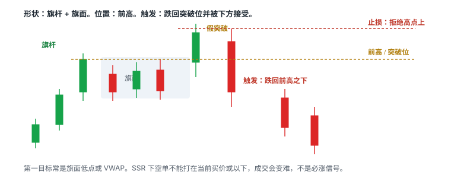

# 6.5 动量股做空

> 一句话：动量股做空不是把多头 setup 上下翻转。对象是当天已经大幅上涨、仍在被短线资金交易的股票；触发是拒绝或跌破后的向下接受；停牌恢复空默认禁做，不是全垒打。

6.2、6.3 的阻力空，针对的是「价格走到预先存在的供给区」。本章针对另一类对象：当天已经走出一段明显上涨、成交还活着、名字还在扫描器前列的股票。图形可以叫假突破、趋势转换、停牌恢复、下降旗形、VWAP 回抽失败、高开回落。它们共用同一套约束：Locate 在先，触发是拒绝或跌破之后的向下接受，仓位按向上尾部砍过。

不要把「涨很多所以一定会跌」写进计划。价格可以在看似不合理后继续上涨数倍。胜率高也不是风险小：小赢多次加一次巨大 squeeze，期望值仍可为负。止损更不是最大损失的保证：停牌、跳空、流动性消失时，成交价可能远离止损。

课程把六个名字堆在同一节里。本章把每一个拆开：形状、位置、触发、失效、常见失败、什么时候不做。同一根下跌里你可能同时看见 VWAP 失守和下降旗形。只选一个定义记账。否则样本会把「所有下跌」都算进每一个名字，胜率变得没有意义。

停牌恢复空单独隔离。它不是日常高胜率 setup，不是「接近保证的全垒打」。没有明确券商规则、最大离散损失和极小仓位时，最合理的规则是禁做。

## 6.5.1 这笔交易在赌什么

动量股做空赌的不是「估值已经离谱，市场必须纠正」。它赌的是一件更窄的事：

**制造当天上涨的买盘已经在某个可标的位置失败。失败被价格走出来之后，仍有足够卖盘把价格推离失效位，使第一目标盖过 1R、Locate 和两边滑点。**

把它拆开，才能知道哪一句话被证伪：

| 句子 | 被什么证伪 |
|---|---|
| 上涨已经留下可画的结构（前高、旗面、VWAP、开盘区间） | 只有一根孤立绿 K，没有任何可标的失败位置 |
| 失败已经发生：拒绝，或跌破后向下接受 | 只有上影、只有第一根红 K、价格仍在加速新高 |
| 你能按计划价格卖掉借入的股票 | 没有 Locate、SSR 让空单挂不进、点差吃掉触发 |
| 下方还有可实现空间 | 一破就撞上 VWAP / 前低 / LULD 下沿，口袋不够 1R |
| 你能按失效价附近买回来 | 点差失控、盘口消失、停牌跳过止损线、强制买回 |

图表只能显示合成后的成交价格。下跌可能同时来自新空头卖出和多头止损。你不需要猜「是谁在卖」。可操作的观察是：关键位有没有被接受在下方，回抽有没有失败，量能是否从冲动扩张转成回抽收缩再向下再扩张。

这笔交易**不是**在赌：

- 已经涨很多，所以下一根必跌；
- 课程截图里的成功例等于基础胜率；
- 止损单能在停牌里按原价成交；
- SSR 会阻止价格继续涨，或保证你的空单更容易成交；
- 六个名字里随便认领一个，事后都能解释这笔空。

「我做动量空」填不进交易计划的任何一栏。形态名只是「在哪画线」的规则。完整策略至少需要：

```
股票池 + 账户允许卖空 + Locate + 市场环境 + setup
+ trigger + invalidation + sizing + cover + 成本
```

图形名称只填 Setup 一栏。屏幕上一次成功的实时示范，不能当作统计验证。

## 6.5.2 可执行性先于形态

过不了这一表，形态再像下面六个 setup 也不做。现金账户和多数 IRA 直接划掉本章。软件里有 Short 按钮，不等于已经借到股票。

下单前逐项回答：

| 问题 | 必须明确的内容 |
|---|---|
| Borrow | Easy-to-borrow 还是 hard-to-borrow；数量是否真的可用 |
| Cost | Locate、borrow、佣金和可能的持仓费 |
| Rule | 是否触发 SSR；券商怎样路由合规订单 |
| Corporate | 新闻、增发、拆股、并购或其他事件 |
| Entry | 具体跌破 / 拒绝触发 |
| Stop | 结构失效价；停牌跳空时止损不保证成交 |
| Size | 按每股风险及尾部风险取更小值 |
| Cover | 第一目标、部分 cover、最终失效 |
| Operational | 召回、强制买回、盘后流动性和平台限制 |

模拟盘能练触发和 cover 的手顺，通常低估四件事：借不到、Locate 费把方向正确的交易打成净亏、强制买回、以及真金白银亏损时加仓摊平的冲动。过了模拟盘，也不表示期望值为正。

入门阶段更适合先在模拟盘练下降旗形与确认后的 VWAP 回抽失败。停牌恢复空、第一次顶部猜测、极端抛物线中途空，应单独隔离，不纳入普通样本。

Locate 费必须进期望值。方向看对、股价跌了 0.05，毛利润可能还不够付 Locate。借了很多、实际只用了很少，会显著抬高每个成交股承担的成本。Available 5,000 不表示风险管理允许你卖 5,000。机制、询价、Credit 与强制买回写在 6.1。

## 6.5.3 形状、位置、触发、失效、向下接受

前几卷已经定死三个词。**形状**是价格怎么走出来的。**位置**是线画在哪。**触发**是价格穿过你预先画的线，并且你愿意用那根线当失效位。认出一面下降旗，只是形状。它贴在 VWAP 下方、前低附近，才有位置。当前这根 K 跌破旗面低点并被接受，才是触发。

空头侧还要再钉死第四个词：**向下接受**。一根长上影穿过阻力又收回来，是试探，不是接受。接受看起来更像：收盘站在线的那一侧，随后的回抽不把线还回去。用未收盘 K 线的最低价当「已经跌破」，会把大量假信号算进样本。


把 trigger 写成可执行的一句话，必须先选定一种，并且成功失败都用这一种：

| 你写进计划的触发 | 它实际要求什么 | 主要风险 |
|---|---|---|
| 触价 trade-through | 成交出现在关键位之下（例如旗面低 4.90，成交 4.89） | 假跌破、滑点、当前 K 尚未收盘 |
| 收盘确认 close | 选定周期的 K 收在关键位之下 | 等收盘时已经离开，盈亏比变差 |
| 回抽失败 retest fail | 先接受在下方，再回到关键位附近守不住 | 可能不给回抽；把失败跌破误当成回抽 |

三种不要事后任选。回测时把成功样本算「提前卖」、失败样本又说「尚未触发」，统计是脏的。

失效位必须和触发画在同一周期上。用 1 分钟微低当触发、用 5 分钟拒绝高点当「真正想法」，实际损失会被低估：你按窄距离算仓，按宽结构认输。

第一目标在下单前标清。候选通常是：旗面低点、VWAP、前一突破位、前低、下一档整美元、LULD 下沿之前。目标太近，即使方向对也不值得承担 squeeze。跳过。

## 6.5.4 和阻力空、多头动量的不对称

6.2、6.3 的阻力空：供给区在盘前就画在图上，价格走过去，你等拒绝。本章的动量空：当天自己长出来的结构（假突破、旗面、VWAP 回抽、开盘区间）也可以当决策区。两者可以重叠。高开撞上日线套牢区，同时开盘后走出假突破，日志只认领一个主名字。

卷五的突破、回踩、红翻绿，失败时你是卖出离场。流动性好的时候，卖比空头止损时的买更容易：下跌中买家变少，空头 cover 是在抢已经变薄的买盘。

所以动量股做空还有一层执行不对称：

- 入场（卖）可能在下跌中相对容易成交，但 SSR 会反过来让卖变难；
- 止损（买）发生在上涨、停牌恢复或挤兑里，点差和滑点往往更差；
- 目标（再买）发生在更低的位置，那里关注度和深度可能已经下降。

两边都要成交，才能把图形上的 R 变成账户里的 R。薄盘、低价、主题股把这一条放大。仓位按更差的那一侧预留滑点。


5.12 的顶部反转，赌的是一段已经走出来的上涨失败。本章六个名字里，假突破和趋势转换最容易和它抢样本。差别在记账：反转章按「原趋势 + 失败证据」分桶；本章按当天动量股上可重复的短线结构分桶。同一笔不要进两个胜率。

## 6.5.5 SSR 怎样改空单执行

Regulation SHO **Rule 201**：上市市场确认某只股票在常规时段相对前一常规时段收盘价下跌至少 **10%** 后，触发短路器。触发后，普通空单**不能在当前最优买价（National Best Bid）或更低的价格显示或执行**。限制持续到当天结束以及**下一个交易日**。机制全文在 3.5。这里只写它对六个动量空 setup 的执行含义。


SSR **不是**不能做空，**不保证**股价会涨，**不制造** squeeze。它改变的是：你看见的下跌，普通空单常常参加不了。

教学数。当前报价 Bid 8.80 × 2,000 / Ask 8.82 × 500，股票已在 SSR：

- 打 bid 的市价空单：交易中心的政策和程序应阻止它在 8.80 或更低显示或执行；
- 限价空 8.80：等于挂在 NBB，通常不能显示；
- 限价空 8.81：高于当前 NBB，原则上可以显示，不一定立刻成交；
- 限价空 8.82 或更高：更接近 ask，成交机会更大，入场更差。

几秒后报价变成 Bid 8.70 / Ask 8.73。你原来挂在 8.81 的空单现在远高于新 NBB，变成排队在市场上方的被动卖单。下跌继续，你还没进场。再几秒后价格反弹到 Bid 8.80 / Ask 8.84，8.81 可能突然成交。你空在反弹里，而不是空在你当初看见的 8.70。

这对六个 setup 的扭曲不一样：

| Setup | SSR 下常见执行结果 |
|---|---|
| 假突破 | 跌回突破位时你想卖，单子挂在 bid 上方排队；真正成交往往在第一次回抽 |
| 趋势转换 | 关键更高低点失守那一跳，普通空单经常填不掉 |
| 停牌恢复 | 恢复瞬间 NBB 可能还没稳定；复牌第一秒市价空是把拍卖未知价和价格测试叠在一起 |
| 下降旗形 | 旗面低点被砸穿时最难主动加入；等反弹回抽失败，才更接近可成交 |
| VWAP fade | 从 VWAP 拒绝后的第一段下跌常卖不掉；回抽 VWAP 再失败，才是 SSR 日更现实的入口 |
| 高开回落 | 开盘结构失守若发生在已经跌满 10% 之后，盲追空几乎必然排队 |

因此个人规则必须可观察：

| 类别 | 可执行的写法 | 不可执行的写法 |
|---|---|---|
| Setup | SSR 日只做回抽失败，不做第一跳追空 | 「看情况空」 |
| Execution | 禁止按「打 bid」那组热键发空单；限价必须高于当时 NBB | 「注意一下 SSR」 |
| Review | 记计划价、当时 NBB、是否被拒、实际成交价 | 只看盈亏 |
| Behavior | 连续两笔因 SSR 排队不成交却强行改市价后停止 | 「保持纪律」 |

热键也要跟着改语义。若你有一组「卖在 bid / 略低于 bid」的空单键，SSR 日它可能被拒、被改价，或发出一张根本不能显示的单。应收起这组键。不要在拒单后连点。

盘中刚触发 SSR 时，已经挂在 NBB 或以下的普通空单可能被取消。不要假设「早上挂的单下午还在原价」。触发后立刻核对 Open Orders。

模拟盘和很多回测引擎不知道 Rule 201。它们看到 K 线碰到你的空单价格，就记一笔成交。SSR 日这是假成交。动量空的回测若用触价假设，会系统性高估假突破和旗形跌破的可执行性。

SSR 管价格测试。Locate 管你能不能借到股票去交割。两者经常同时出现在大跌的小盘上，但机制独立。不要把「SSR + hard to borrow」读成一条消息。

资料：[SEC Rule 201 FAQ](https://www.sec.gov/divisions/marketreg/rule201faq.htm)。

## 6.5.6 Setup 1：假突破做空



形状：看起来健康的上升旗形，或多次测试的前高。位置：前高 / 旗面上沿 / 整美元。行为：突破后马上被压回。

它和卷五 bull flag 赌的是相反的一句。多头旗赌旗杆买盘还没做完。假突破空赌：突破尝试已经失败，上方供给还在。同一面旗，上沿被接受是 5.1；跌回突破位并被下方接受，才是本章这一笔。


Bull trap 是事后结构标签。图无法证明每一笔卖单的身份。做空触发仍应是跌回关键位、破微结构低点或回抽失败。直接在第一根红 K 追空，可能在下方支撑前得到很差的盈亏比。

| | |
|---|---|
| 形状 | 旗杆 + 旗面，或多次测试的水平前高；突破 K 已经印出来 |
| 位置 | 前高、旗面上沿、整美元、盘前高 |
| 触发 | 重新跌破突破位，或跌破那根突破 K 的低点，并在下方被接受。不是仅凭上影线 |
| 失效 | 拒绝高点之上，留滑点。每股风险可能很大，股数必须缩小 |
| 第一目标 | 旗面低点、VWAP 或前一突破位。下单前标清 |
| 常见失败 | 跌破后迅速重新站上；下方支撑太近，盈亏比不够；把影线当触发 |
| 不做 | 第一根红 K 里追空，离失效位已远；SSR 下无法接受你的空单价格；突破尚未发生就猜它会假 |

放量假突破是更强的预警，仍不是完整下降趋势。


高量但价格不再上涨，不能只把高量视作确认。还要等更低高点和关键更高低点失守，才从「假突破预警」升级成下一节的趋势转换。一根大红 K 可以只是停顿。

图表负责定义结构。盘口只辅助执行。Level 2 上出现大卖单，不能单独当触发。假突破之后也可能快速收回；跌破后不能延迟执行空头止损。

SSR 日：跌回突破位那一跳，普通空单常常填不掉。更可执行的写法是：跌破被接受之后，等第一次回抽无法收回突破位，再在高于当时 NBB 的限价卖。这一笔必须单独统计，不要和「触价即空」混桶。

## 6.5.7 Setup 2：趋势转换做空

上升结构转为下降结构。短周期上：冲高失败，随后破坏更高低点序列，短均线转平并向下。

一个更低高点不够。更清楚的确认是：跌破关键 swing low 后，反弹无法收回。


| | |
|---|---|
| 位置 | 预先阻力、VWAP、短周期均线转弱 |
| 筛选 | 已经存在的更高高 / 更高低序列开始走坏 |
| 触发 | 关键更高低点失守，且反弹形成更低高点后再次向下（写死用「破低」还是「回抽失败」） |
| 失效 | 转换过程中的拒绝高点之上 |
| 第一目标 | 前一个被破坏的更高低点一带，或 VWAP / 前低；不要默认「跌一整天」 |
| 常见失败 | 只有一个更低高点就空；大级别仍强，1 分钟转弱只是 5 分钟回撤 |
| 不做 | 时间周期没写死；确认越多入场越低，剩余空间已被消耗还不缩目标；Locate 贵到等确认期间借股消失仍硬做 |

确认越多，入场越低；风险变清楚的同时，剩余空间也可能已经被消耗。这是趋势交易的老问题：等清楚了，盈亏比差了。解决办法不是提前猜顶，而是：要么接受更小的仓位和更近的第一目标，要么不做。

短周期转弱前先检查大周期支撑和 VWAP。用 1 分钟趋势转换去空一个 5 分钟或日线仍在创新高的股票，样本必须分开记，R 更苛刻。

空头入场与 cover 需要两次成交，薄深度会在两边都造成滑点。下跌到支撑或 LULD 下沿前应提前计划 cover，而不是期望整天单边下跌。

若 Locate 很贵，等待确认的时间也可能导致借股消失。这属于策略可执行性，而非图形问题。图形漂亮、库存没了，这笔不存在。

SSR 日：关键更高低点失守往往是一跳。计划应写成「破低后的回抽失败」，而不是「看见破低就市价砸」。回测用触价假设的趋势转换空，实盘会系统性迟到。

## 6.5.8 Setup 3：停牌恢复做空（默认禁做）

这不是普通的「高胜率 setup」，而是具有离散尾部风险的独立策略。任何「接近保证的全垒打」的说法必须明确拒绝：市场交易没有保证。即使历史样本多数下跌，一次向上跳空就可能超过许多小盈利。

课程案例应当理解为「停牌如何切断连续成交」，而不是鼓励在恢复前放大市价单。没有把这类交易从普通阻力空和普通动量空里隔离出去之前，不要把它写进日常计划。

结构：股票极端上涨，价格扩张，盘口变薄，触发向上停牌。进入停牌后不能连续调整止损，恢复价可以直接越过风险线。做空还可能遇到无可借股、Locate 失效、强制买回或连续向上停牌。


| | |
|---|---|
| 筛选 | 已经 halt up，或即将碰到 LULD 上沿；你预先写明「只观察，不在停牌里加仓」 |
| 触发 | 仅在你预先写明的恢复条件：例如恢复后无法在停牌前高点之上被接受，并跌破某个开盘后结构。不是复牌第一秒盲空 |
| 失效 | 计划价往往没有意义。用仓位限制尾部，而不是用订单保证最大亏损 |
| 仓位 | 按恢复时不利跳空 10%、20% 或更大仍可承受来砍。通常应单独设更低上限，默认是 0 |
| 常见失败 | 恢复向上跳空；连续第二次 halt up；点差极宽，市价单出现极端滑点；Locate 在停牌期间失效 |
| 不做 | 没有明确券商规则、最大离散损失和极小仓位；把课程里的「保证全垒打」当成可交易规则；halt down 时挂市价买单、halt up 时挂市价卖单等恢复 |

恢复的第一笔成交可能大幅跳空、点差极宽、成交远离预期、再次立刻停牌。halt down 时挂市价买单等恢复，和 halt up 时挂市价卖单等恢复，是同一类赌博。

默认规则（启发式，必须写成你自己的禁做条款，不是市场定律）：

1. **日常计划里，停牌恢复空 = 不做。**
2. 若将来单独开一个实验桶，仓位上限远低于普通 1R 空，且单日最多一笔。
3. 实验桶的样本不得并进假突破、旗形、VWAP fade 的胜率。
4. 连续两次非计划停牌暴露之后，当天停止该策略。
5. 没有 Locate、没有可见 NBBO、没有连续交易状态，手指离开热键。

无法接受 halt resume 后离散损失的人，正确仓位是 0。这句话在微回撤、HOD、Gap and Go 里出现过。本章比那些更常碰到它，所以再写一次。百分比 10%、20% 是用来逼你算的启发式，不是保证上限。恢复可以跳得更远。

SSR 若已在生效，恢复后的第一批普通空单仍然要满足「高于当时 NBB」——但恢复瞬间 NBB 可能还没稳定，quotes 在重置，spread 可以极宽。不要用「复牌第一秒市价空」去赌方向。恢复后先看：交易状态是否已是连续交易、NBBO 是否连续发布、你的空单限价是否仍高于新 NBB。

Reason code 要读。`LUDP` 和 `T1` 不是同一件事。新闻停牌的方向取决于内容，不是「停完必跌」。读 3.6，不要只读聊天室里的 halt up / halt down。

## 6.5.9 Setup 4：下降旗形跌破

左侧先发生向下推动，随后价格弱反弹或横盘，构成旗面，再尝试跌破。

反弹量缩、高点下降、处于 VWAP 下方时，延续的语境更清楚。

它是 5.1 bull flag 的方向镜像，风险不是镜像。多头旗失败时你卖得出去的概率，通常高于空头旗失败时你买得回来的概率。旗面高点可以在一次短线 squeeze 里被一口气打穿。

| | |
|---|---|
| 形状 | 左侧 impulse down + 弱反弹或横盘旗面 |
| 位置 | 最好在 VWAP 下方；高点下降 |
| 触发 | 整理区低点跌破并在下方被接受 |
| 失效 | 旗面高点之上 |
| 第一目标 | 前低、下一支撑、LULD 下沿之前 |
| 常见失败 | 1 分钟旗被一次点差扩大或短线回补破坏；反弹收回 VWAP 并形成更高低点 |
| 不做 | 已连续大跌后才追空，下面空间不足；在长红 K 底部再卖；LULD 下沿几分钱的地方「再空一点」 |

1 分钟下降旗形容易受一次点差扩大或短线回补破坏。止损不能依赖「应该会跌回来」。SSR 下可否成交与如何挂单，必须在模拟盘按真实券商机制练习。先标日线支撑和 LULD 下沿，避免在下沿几分钱的地方为了「再空一点」去承担 squeeze。

已连续大跌后才追空，是空头版本的追：离失效位（旗面高点）可能仍然远，而下方空间已经被吃掉。等反弹失败再卖，比在长红 K 底部再卖更接近可交易的盈亏比。

量能顺序偏好（观察，不是许可）：

```
向下冲动扩张
  → 反弹 / 横盘收缩
    → 跌破再扩张
```

旗面量大于冲动段，延续假设变弱。突破量大但价格不前进，不能只把高量当成确认。

同一段走势可以同时被叫做「趋势转换后的第一面下降旗」和「VWAP 下方的 continuation」。日志只留一个主名字。用 5 分钟旗面高做止损、按 1 分钟很窄的旗面低算仓，是把风险算小了。

SSR 日：旗面低被砸穿时你往往卖不掉。更接近可成交的是旗面低失守后的弱回抽，回抽高点仍在旗面内、且你的限价高于当时 NBB。这一笔叫「回抽失败空」，不要事后改口说自己抓住了跌破那一 tick。

## 6.5.10 Setup 5：VWAP 回抽失败

股价早盘冲高后逐渐走弱，反弹到 VWAP 附近受阻，再次下行。VWAP 是位置，不是形状。

「碰 VWAP」不是入场。需要拒绝、更低高点，或重新跌破微结构低点。


它交易的是「均价附近的供给还在」，不是「VWAP 永远是阻力」。同一日 VWAP 可先做阻力、后做支撑。中间那一次 fade 失败，不能永久定义这只股票「弱」。日志应记录这是当日第几次碰 VWAP。

| | |
|---|---|
| 位置 | VWAP（可叠加下降短均线、更低高点） |
| 触发 | VWAP 处拒绝之后的向下接受 |
| 失效 | 重新站上 VWAP 并接受；或拒绝高点之上（写死用哪一种，含正常波动） |
| 第一目标 | 最近盘中低或下一档整数，不是「回到开盘」 |
| 常见失败 | VWAP 本身趋平且价格反复跨越；把每一次穿越都当成独立 fade；第一目标太近 |
| 不做 | 开盘前几分钟就把早期 VWAP 当铁墙；重新站上后还扛着空单改口；不记录 attempt number |

VWAP、下降均线和更低高点都源自同一条价格路径，不能当作三个独立信号加分。成功例说明 setup 长什么样，不说明基础胜率。必须保留重新站上 VWAP 后被挤的失败例。

止损放在 VWAP 上方时要留出正常波动，否则价格来回穿越会频繁止损。如果 VWAP 本身趋平且价格反复跨越，说明方向 edge 很弱。那天的正确动作常常是不交易 VWAP。

检查：VWAP 是否含盘前数据、当天锚定起点、穿越时成交量、跌破后 bid 是否能保持、距离下一水平位有多少空间。开盘前几分钟样本少。不同平台的盘前计入规则会使数值略有差异。你下单用哪套数据，就用哪套算触发和失效。

如果第一目标太近，即使入场正确也不值得承担空头回补风险。跳过。

5.12 也写过 VWAP fade。那一章把它放在反转家族里。本章只收「当天动量股冲高走弱之后，回到均价再失败」这一种日内空。两章可以看同一条线，日志名字不要混：反转 fade 的失效常常是极端点；动量 fade 的失效更常是重新接受在 VWAP 之上。

SSR 日：从 VWAP 拒绝后的第一段下跌，普通空单常排队。回抽 VWAP 再失败，才是更现实的入口。第一次没卖掉，不要在更低的位置改成市价去「补上」。

## 6.5.11 Setup 6：高开回落

历史上出现高开或急涨后大幅回落的股票，会被拿来寻找「有 gap-and-fade 历史」的对象。历史行为可以作为分类特征，但公司事件、float、融资和市场环境都会改变。大红 K 是日后看见的完整结果；开盘时不能知道它最终会收在哪里。

6.2 的 Gap-Up Short 强调「高开到预先阻力」。本章的 Gap Fade 强调「这类股票曾经有过高开回落的历史」。两者可以重叠，统计时仍应分开：一个是位置 setup，一个是标的分类启发式。分类启发式没有独立证据，就不要提高仓位。

5.9 的 Gap and Go 是高开之后做多。本章这一节是高开之后等结构失守再空。同一只高开股，开盘前不要同时把两个方向都写成「A 级」。先写清当天第一假设是延续还是失败；假设被证伪，再另开一笔。

| | |
|---|---|
| 位置 | 预先阻力、开盘区间、VWAP |
| 筛选 | 高开（或盘前急涨）+ 可画的开盘 / 盘前结构；历史 fade 只作分类，不作许可 |
| 触发 | 开盘结构失守，或 VWAP 失守后回抽失败。不是开盘第一秒盲空 |
| 失效 | 开盘区间上沿或拒绝高点之上 |
| 第一目标 | VWAP、前低、缺口边（若缺口仍在且距离够 1R），分批 cover |
| 常见失败 | 红翻绿式向上挤压；催化剂强于历史，量能继续扩张；cover 时流动性消失 |
| 不做 | 开盘盲空；价格守住 VWAP；借不到；盘前量显著异常还不降级观察；旧图相似就提高仓位 |

直接在开盘盲空，最容易遭遇红翻绿式挤压。等待 VWAP 失守更可验证。真实执行还需考虑：能否在高位借到、cover 时有没有流动性、借股费是否按日收取。

把 gap 大小、开盘区间、VWAP 回抽、借股成本和市场环境分开记入日志。旧图相似不是入场条件。

Gap 百分比大意味着潜在回落空间，也意味着动能和 squeeze 风险更大。用 50% 之类阈值做筛选，是课程启发式，不是法规，也不是普遍最优参数。新闻越强、成交量越超预期，历史 fade 越可能直接失效。

隔夜已经接受更高价格时，不要机械套用「昨天有高位回落，所以今天高开就空」。短逻辑可以从 resistance short 改成「可能有被套空头」。历史阻力没有作废，它只是不再是当天的第一假设。多头仍然需要自己的支撑和触发。

SSR 日：若高开后先冲高再快速跌满 10%，你想空的时候限制已经亮起。开盘结构失守那一跳可能卖不掉。写成「失守后回抽开盘区间下沿失败」，比写成「跌破就砸」更接近真实成交。

## 6.5.12 六个名字怎样放进同一张计划

它们不是六个必须同时满足的圣杯，也不是每天轮着做一遍的清单。先问：

1. 今天这只股票能不能空、成本能不能接受？（6.1）
2. 有没有预先存在的供给区？（6.2、6.3）
3. 当前结构是假突破、趋势转换、旗形、VWAP 回抽，还是只有「涨太多了」？
4. 触发和失效能否写在同一周期上？
5. 第一目标离触发有多远？够不够覆盖 Locate 和滑点？
6. 停牌密度高不高？若高，Setup 3 的尾部规则是否把仓位砍到接近零？
7. 是否已在 SSR？空单限价是否仍高于当时 NBB？填不掉是否已经写好放弃？

同一根下跌里，你可能同时看到 VWAP 失守和下降旗形。只选一个定义记账。认领规则事先写死，例如：

| 当时看得见的主结构 | 记这个名字 |
|---|---|
| 刚发生过对前高 / 旗面上沿的失败突破 | 假突破 |
| 更高低点序列已经坏掉，旗面还不清楚 | 趋势转换 |
| 已经 halt，你在等恢复 | 停牌恢复（默认 0 仓） |
| 左侧已有向下冲动，当前是弱反弹后的跌破 | 下降旗形 |
| 决策区就是 VWAP，其它结构都弱 | VWAP fade |
| 高开，触发是开盘结构或 VWAP 失守 | 高开回落（与 6.2 Gap-Up Short 再分一次） |

事后看见完整大红 K，再回头给这笔空改名，样本作废。

预判、穿越、回抽失败是三笔不同的交易。假突破可以预判「这根突破 K 会失败」，也可以等跌回突破位，也可以等回抽失败。三种不要拼成「最好价格 + 最高胜率」。

## 6.5.13 仓位、cover、LULD

卷四的公式仍然成立：

```text
股数 = 单笔可承受亏损 ÷ (|入场价 − 失效价| + 预留滑点)
```

空头还要再取一次更小值，因为：跳空向上没有天花板；停牌恢复可以远高于止损；挤兑式回补会让点差和滑点同时爆炸；Locate 成本要从期望值里扣；SSR 可能让你无法按计划加空。

购买力、Available 库存、热键默认股数，都不是风险预算。加仓摊平不做。空单被套后加仓，是在无限亏损的一侧放大名义敞口。价格按预期下跌后，才考虑是否用更近的失效位加第二笔；加完必须重算全仓风险。超预算就减股数，或不加。

Cover 是买入。方向反了：

| 订单 | 空头止损 / 止盈时会发生什么 |
|---|---|
| Stop market | 向上触发后变成市价买。跳空、停牌恢复、盘口变空时，可能买得很贵 |
| Stop limit | 触发后变成限价买。价格一口气越过限价，可能根本买不进 |
| 限价挂在失效位 | 价格没碰到就不成交；碰到了也不保证队排得上 |
| 目标上的限价买 | 下跌中买家变少，可能成交一部分或完全不成交 |

停牌期间普通止损单无法执行。点差突然变宽、Level 2 上买单消失、连续向上停牌，都让「我有止损」这句话失效。这时唯一还在你手里的控制，是开仓时的股数。

贴近 LULD 下沿时，继续追空的尾部风险是 halt down，不是「SSR 会托住价格」。下沿几分钱的地方为了「再空一点」去承担 squeeze，盈亏比通常已经坏了。先标日线支撑和 LULD 下沿，第一目标写在它们之前。

分批 cover 能锁定部分利润，剩余仓位仍需明确 trailing 失效。不要把「剩下的让它跌到零」写成计划。小盘低价可以长时间横在低位，借股费按日收，隔夜是另一类业务。本书的日内空头默认当天 cover。

## 6.5.14 工作例子：从看到结构到下单

下面全程是教学整数，用来走一遍六栏，不是某只股票、某一天的行情。

日线：上方最近清晰阻力在 6.80，已经远在当前价之上，当天主要矛盾不在历史套牢区。5 分钟：开盘从 4.20 冲到 5.40，量扩张；随后在 5.20–5.40 整理，量缩小，看起来像一面多头旗。1 分钟：突破 5.40 到 5.52 后立刻被压回，5.40 下方出现实体。点差约 0.03。Locate 每股 0.04，已接受 400 股库存。未在 SSR。LULD 下沿大约在 4.70 一带。

你认领的是假突破，不是下降旗形——因为左侧主结构仍是向上旗，失败刚发生。六栏可以写成：

| 项目 | 这一笔的回答 |
|---|---|
| Setup | 1 分钟假突破空；5 分钟旗面上沿 5.40 未能被接受 |
| Trigger | 5.40 被向下接受；触价 5.39，预估滑点后 5.36 |
| Invalidation | 拒绝高 5.52 之上，计划 5.56（含滑点） |
| Size | 每股风险 0.20；单笔 80 美元 → 400 股；再按流动性与 Locate 费往下砍到 300 |
| Exit | 第一目标旗面低 / VWAP 一带 5.05（约 1.5R）；时间退出：跌破后 10 分钟无推进减半 |
| No-trade | 重新站上 5.40；点差扩到 0.10；进入 halt；SSR 亮起后限价无法高于 NBB 成交 |

这笔的假设很窄：5.40 之上的突破是失败。价格重新接受在 5.40 之上，假设结束，可成交限价或市价买回，不讨论「还会再假一次」。价格接受在 5.40 之下之后立刻拉回 5.45，按计划止损，而不是改口等 5.52。

若你改口说「其实这是趋势转换，真正失效在今天高点 5.80」，每股风险变成 0.44，300 股已经超过预算。那是另一笔，要重算股数。不能用假突破的窄风险进场，用趋势转换的宽结构认输。

Locate 费：0.04 × 400 = 16。即使只用 300 股，固定成本仍按申请股数走（以你的券商规则为准）。第一目标的毛利必须先盖过 16 再谈 1R。方向对、只跌 0.04，可能刚够费用。

若同一时刻股票已经 SSR，5.39 的触价空单可能根本不会显示。正确动作是放弃触价版本，或改写成：回抽 5.40 失败、限价高于当时 NBB。不成交就空手。不要连点改成打 bid。

## 6.5.15 入场检查表

下单前逐条回答。答不出的那一条，就是 no-trade：

- 账户类型允许卖空吗？不是现金账户，也不是禁止卖空的 IRA？
- Locate 已经接受、Available 已显示、费用进期望值了吗？
- 当前是否 SSR？空单限价是否高于当时 NBB？填不掉是否放弃？
- 这个水平位在入场前是否已清晰可见？
- 六个名字里，你事先认领的是哪一个？触发和失效写在同一周期吗？
- 触发是触价、收盘确认，还是回抽失败？日志写的是不是同一层？
- 失效价在哪里，包含滑点后应卖多少股？尾部压力测试过了吗？
- 第一目标离触发有多远？够不够 1R 加 Locate 加两边滑点？
- 下方是否立刻是 VWAP、前低或 LULD 下沿？
- 停牌密度高不高？若高，仓位是否已经按离散跳空砍到接近零？
- 这是「看到确认」，还是只因为「涨太多了」或害怕没参与？
- 若重新站上关键位，你是按计划 cover，还是准备改故事？

任何动量空都是条件组合，不是单一红 K。先有可执行性，再有结构；先有退出，再谈「空到了哪里」。

## 6.5.16 三个不应接受的推理

1. **「涨很多所以一定会跌。」** 价格可以在看似不合理后继续上涨数倍。没有位置、没有拒绝、没有向下接受，就没有空头 setup。Scanner 报警只说明股票进了你预设的极端区，不代表此刻必须逆势进场。

2. **「胜率高所以风险小。」** 小赢多次加一次巨大 squeeze，期望值仍可为负。空头的期望值必须按含尾部的分布来看，不能按「最近十笔七笔赚了」来看。课程口头里的高胜率没有样本量、成本和失败交易明细，不能据此自动扩大仓位。

3. **「止损限制最大损失。」** 停牌、跳空、流动性消失时，成交价可能远离止损。唯一事先还在你手里的控制是股数。把「我有止损」写成仓位许可，是在用连续市场的工具去覆盖离散市场的风险。

把这三条写在热键旁边，比再背一个形态名字有用。

## 6.5.17 复盘字段

每笔动量空至少记录：

```
主名字（六个里只留一个）:
入场层级（预判 / 触价 / 收盘 / 回抽失败）:
主风险周期:
触发 / 失效 / 第一目标（入场前截图）:
Locate 费与申请 / 实际股数:
当时是否 SSR、当时 NBB、订单是否被拒:
计划价与实际成交价:
停牌次数、reason code、恢复跳空:
点差、可见深度、两边滑点:
第一目标是否在 LULD 下沿之前:
MAE / MFE:
是否改口换 setup 名:
是否在被套后加仓:
失败原因（含「根本没触发」）:
```

按 setup 分桶，再按层级分一次，再按是否 SSR 分一次。不要把假突破、旗形、VWAP fade、停牌恢复倒进同一个胜率。停牌恢复即使将来做实验，也必须单独一张表。

隐藏后续 K 线，防止看到结果再命名。只收藏后来大跌的图，会高估任何「涨多了就空」过滤器的优势。

## 6.5.18 常见错误

1. 看见第一根红 K 或长红 K 底部就市价追空。
2. 用未收盘 K 的最低价宣布「已经跌破」。
3. 跨 1 分钟和 5 分钟混着定义触发和失效。
4. 以 5 分钟拒绝高为失效，按 1 分钟很窄距离下仓。
5. 把预判、穿越、回抽混成一笔，成功算得早、失败算得晚。
6. 把 VWAP、下降均线、更低高点当成三个独立信号加分。
7. 把课程里的「保证全垒打」当成停牌恢复的可交易规则。
8. 在 LULD 下沿或日线支撑几分钱的地方追空。
9. 空单被套后加仓摊平。
10. SSR 下连点打 bid，或自行把订单标成 short exempt。
11. 用 K 线触价回测 SSR 日的空单，当作成交。
12. 旧图相似就提高 Gap Fade 的仓位。
13. 开盘第一秒盲空，把红翻绿挤正当成「没料到」。
14. 借不到或 Locate 费已经吃掉 1R，还因为图形漂亮而下单。
15. 同一根下跌同时记进六个名字，胜率变得没有意义。
16. 只保存教科书成功图，不收重新站上、squeeze、向上跳空。
17. 失败后等待「再给一次机会」，或自动翻多去追已经离开的价格。
18. 把 Available 数字或购买力当成可承受亏损。
19. 用 RSI 超买或「已经涨很多」代替结构失效。
20. 把一次实时示范或单笔大红当成策略已验证。

模拟盘能练流程，但成交质量、心理压力、借股和停牌恢复与实盘不同。模拟绿了，只说明你在那个环境里按按钮的顺序大致对了。

## 先记住这些

- 做空不是多头 setup 的镜像。借股、SSR、停牌上跳、无限亏损都是策略的一部分。
- 假突破、趋势转换、下降旗形、VWAP 回抽失败，触发都是拒绝或跌破之后的向下接受。
- 每个名字必须自带触发、失效和失败模式。同一笔只认领一个名字。
- 停牌恢复空是独立的尾部策略，默认禁做，不是高胜率日常，没有保证，不是全垒打。
- 开盘盲空不是 Gap Fade。旧图相似不是入场条件。
- SSR 限制空单必须高于当前 NBB。它改执行，不改方向，也不制造 squeeze。
- 仓位按失效距离反推，再按向上尾部砍过。唯一事先还在你手里的控制是股数。

## 不要做的事

- 在第一根红 K、长红 K 底部或新高中途猜顶。
- 把课程里的「保证全垒打」当成可交易规则。
- 用胜率或「已经涨太多」替代失效位。
- 把 VWAP、均线、更低高点当成三个独立信号加分。
- 在 LULD 下沿或日线支撑几分钱的地方追空。
- 空单被套后加仓摊平。
- 在 halt 中排无价格保护的市价空单等恢复。
- 在 SSR 下假装自己能打 bid，或勾 short exempt。
- 把六个名字叠成一个胜率，或事后给成功的空单改名。
- 现金账户、IRA、没有 Locate、费用已经吃掉 1R 时，仍然点 Short。
