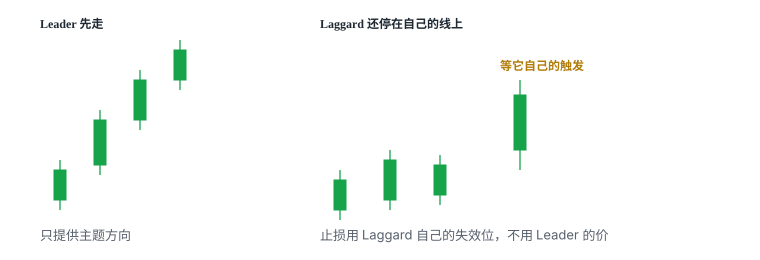
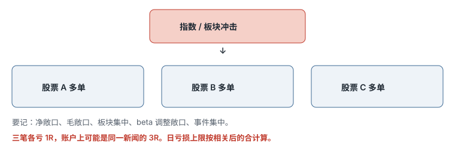
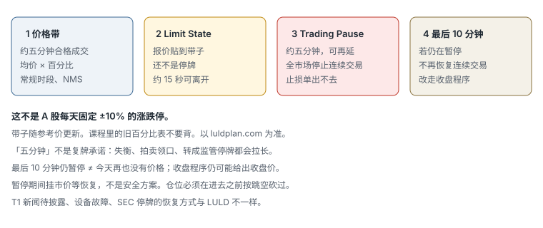

# 6.6 Leader–Laggard

> 一句话：领头股只提供语境；落后股必须等它自己的触发，止损用它自己的失效位。仓位按落后的那只算。

当多只股票受同一新闻或同一市场主题驱动时，它们的价格可能在一段时间内同方向运动，但不会逐 tick 重合。先动的那只给出方向信息，尚未完全反应的那只有时会随后补上。可利用的是短暂偏离：

```text
共同驱动仍有效 + 一只已移动 + 另一只尚未反应
```

这不是「A 涨了所以买 B」，也不是统计套利里的价差回归。两只股票的流动性、停牌风险、借股和各自的支撑阻力可以完全不同。相关性突然断裂时，只交易落后股仍承担完整方向风险；即使同时交易两只，也可能两边都亏。

「Leader」和「Laggard」不是永久身份。同一时段中，A 可能先动；几分钟后 B 又可能成为先动的一只。屏幕上必须不断重标：**这一分钟谁先给出信息，谁还停在自己的线上。**

前几章处理的是**单只**股票：Locate、预先阻力、日线均线、动量股自己的拒绝或跌破。这一章多出来的只有一件事：把另一只股票当成实时语境。语境不能代替触发。触发、止损、目标和股数，全部画在你实际持仓的那只上。

## 6.6.1 这笔交易在赌什么

Leader–Laggard 赌的不是「两家公司基本面相同」，也不是「相关系数永远接近 1」。它赌的是一件更窄的事：

**共同主题资金仍在同时交易这两只。先动的一只已经用成交把方向说清楚。后动的一只还没有把同一信息完全写进价格。只要共同驱动没有断，后动的一只随后跟随的概率，暂时高于随机两只股票。**

把它拆开，才能知道哪一句话被证伪：

| 句子 | 被什么证伪 |
|---|---|
| 共同驱动仍有效 | 主题资金散了；一只出现独立新闻；连续多次不再互跟 |
| 先动的一只给出的是方向，不是噪声 | 领头股假突破 / 假跌破后迅速收回 |
| 后动的一只尚未反应 | 时间差已经被吃完，入场时落后股已经走过一段 |
| 跟随会发生在你还能定义止损的位置 | 落后股贴在自己的支撑 / 阻力上，目标近、止损远 |
| 你能按落后股的失效价离开 | 点差失控、停牌跳过止损、借不到或强制回补 |

这笔交易**不是**在赌：

- 领头股的每一根 K，落后股都必须复制；
- 两只股票的涨跌幅百分比必须接近；
- 领头股停牌期间，旧 K 线仍然有效；
- 口头「百分之八十到九十」会在你的账户里重现；
- 同步本身是对冲。

「我做同步」填不进交易计划的任何一栏。形态名只是「看哪两张图」的规则。完整策略至少需要：

```text
共同催化
  → 当天已多次同向反应
    → 当前谁领、谁落后
      → 落后股自己的触发
        → 落后股自己的失效
          → 按失效距离算股数
            → 领头股失效时的退出规则
```

缺任何一格，你只是在用另一只股票给自己壮胆。

## 6.6.2 领头股给语境，落后股给订单

关键原则可以写成四句，四句都要同时成立：

1. **领头股提供方向线索。** 它告诉你主题资金此刻在买还是在卖。
2. **实际成交发生在落后股。** 你买卖的是尚未完全反应的那只。
3. **入场必须是落后股自己的触发。** 拒绝、跌破、突破被接受，全部用落后股的图。
4. **止损必须是落后股自己的失效位。** 不能用领头股的价格给落后股设止损。

不能用 A 的图替 B 设置所有价格。GME 跌破 50，并不等于 AMC 的止损可以画在 GME 的 50 上。AMC 有自己的前低、前高、整美元、VWAP 和点差。股数、Locate、SSR、LULD 带子，也全部按 AMC 算——如果你空的是 AMC。

领头股如果假跌破并快速收回，这个时间差可能不是机会，而是同步关系已经失败。应立即重新评估，而不是等待落后股替自己证明判断。信息源没了，仓位的原始理由没了。



上图左边已经走完一段，右边还停在自己的线上。可交易的是右边即将出现的触发，不是左边已经走完的那一段。左边再陡，也不许在右边用市价去「补上错过的涨跌幅」。

双重失效必须事先写死：

| 失效类型 | 看哪只 | 你做什么 |
|---|---|---|
| 价格失效 | 落后股跌破 / 升破自己的止损 | 按计划 cover 或止损 |
| 信息失效 | 领头股假突破、迅速反转、进入停牌且不再更新 | 即使落后股还没打到止损，也降级或退出 |

课程里多次 cover，并不等落后股自己走出完整反转结构。那不是随意提前离场，而是第二条失效已经触发。复盘时不要把「后来落后股又走了一段」改写成「当时不该按信息失效离开」。

## 6.6.3 身份会换

Leader 只是**当前几秒或几分钟**先给出信息的一只。它不是龙头股的基本面头衔，也不是观察名单上的固定排序。

同一主题里，身份对调是常态，不是异常：

- 前几分钟 GME 先破低，AMC 落后；
- 过一会儿 AMC 假突破后先下跌，GME 反而停在较高位置；
- 再过一会儿一只进入停牌，另一只暂时失去可用的实时领头。

每只股票独立的订单流、流通盘、技术位和停牌带子不断变化，谁先动也会变化。你必须在每一笔计划上重新写：

```text
这一分钟的 Leader = ____
这一分钟的 Laggard = ____
落后股自己的触发 = ____
落后股自己的止损 = ____
领头股怎样算信息失效 = ____
```

不要把早上确认过的「GME 是领头」沿用到中午。不要因为昨天 A 总是先动，今天就不再看 B 的图。身份写在这一笔上，不写在这个主题上。

板块同情（同一行业一起动）更慢、更粗，和本章不是同一 setup。油价涨了去买所有航空股，缺少秒级时序，也缺少落后股自己的触发。本章只处理：同一主题资金、同一屏幕、几秒到几分钟的反应差。

## 6.6.4 为什么会有时间差

即使共同催化相同，每只股票仍有独立差异：

- 流通盘；
- 股价；
- 成交量和点差；
- 当时订单簿；
- 个股自己的支撑 / 阻力；
- 波动性停牌的触发区间和暂停时间；
- 借股是否可得、Locate 费；
- 是否处于 SSR；
- 不同交易者关注度；
- 热键、扫描器和聊天室把哪只放在第一位。

同步不意味着 K 线完全相同。时间差可以从几秒到几分钟。可利用的正是这段偏离，不是两只股票长期长得像。

后半天成交量下降后，关系可能变弱，只在极端 K 线或停牌附近短暂恢复。开盘和高量阶段更常出现同步。新闻刚发生的头几天、同一行业受政策影响、主题资金同时关注几只股票时，观察价值更高。一次巧合的相似 K 线不足以建立策略。

两只股票可以在日线上「看起来相关」，盘中却各走各的。日线相关回答不了「这一分钟谁先破低」。策略依据是盘中反复出现的同向反应，不是历史 beta。

## 6.6.5 什么时候值得观察

典型环境：

- 两只或以上股票被同一主题资金同时交易（课程教学用的是当时的 meme 主题里的 GME 与 AMC）；
- 同一行业刚出政策或共同新闻，并且盘中已经看到互跟；
- 新闻发生后的头几个交易日，关注度仍高；
- 开盘后成交量最高的时段；
- 出现大幅突破、flush 或波动性停牌，另一只尚未走完同一段。

不值得假设同步的环境：

- 只是同板块、没有共同催化、当天也没有互跟；
- 后半天量枯，偶尔一根相似 K；
- 一只已经出了独立财报、独立融资或独立监管消息；
- 一只停牌、一只正常交易，你却还把停牌前最后一根 K 当实时领头；
- 时间差已经消失，落后股的位置已经变成追单。

「值得观察」不是「必须交易」。同步是过滤器，不是许可。没有落后股自己的触发，观察名单上的第二只股票只是第二只股票。

## 6.6.6 口头 80%–90% 不能迁移

讲师提到自己历史上使用该方法曾有百分之八十到九十左右的胜率。这是个人口头经验，不是本手册提供统计样本得出的可验证结果。

那句话缺的东西，正好是仓位公式需要的东西：

- 没有样本量；
- 没有纳入与排除规则；
- 没有成本（佣金、点差、滑点、Locate、借券）；
- 没有失败交易明细；
- 没有停牌跳空和强制回补；
- 没有「信息失效提前退出」是否算赢；
- 没有另一位交易者、另一段市场、另一对股票的重复。

因此不能据此自动扩大仓位。个人案例不是可迁移保证。高胜率也不是风险小：小赢多次加一次巨大断裂或一次停牌跳空，期望值仍可为负。

自己的股数必须来自：

```text
最大允许亏损 ÷ 每股止损距离
```

落后那只的每股止损距离，用落后那只的图计算。加上滑点预算。做空时再和尾部风险取更小值——停牌、跳空、流动性消失时，计划止损覆盖不到真实亏损。详见 [4.1](../vol-4-risk/01-position-size-and-expectancy.md) 与 [6.1](01-locate.md)。

课程案例里出现过 2,000 股、1,000 股、实际成交 900 股。这些数字对个人账户不是目标。它们只说明：同步交易的节奏可以快到以秒计，股数必须小到你能在领头股一反弹就立刻处理；预设数量与真实成交可能不同。

把口头高胜率写成仓位公式，是本章最贵的错误之一。胜率来自你自己在相同定义下的样本。换一对股票、换一个时段、换一条退出规则，都是另一套策略。

## 6.6.7 先确认「真同步」

盘前和盘中检查：

1. 两只股票是否有同一催化或清楚的共同主题？
2. 是否已连续出现多次同方向反应？
3. 谁先突破、谁后跟随，时间差是否相对稳定？
4. 当一只反向时，另一只是否也反向？
5. 成交量是否仍高？
6. 当前各自是否被独立支撑 / 阻力阻挡？

至少观察多次反应后，才把同步作为辅助优势。单次相似不能证明稳定关系。如果两只股票后来不再反应，策略依据就消失。

第六条单独强调：即使主题仍在，落后股自己贴着强支撑时，向下空间可能不够支付 1R；贴着强阻力时，向上空间同样可能不够。共同方向正确，不代表现在有位置。

并排两张相同或可比较周期的图。纵轴绝对价格不同，所以比较的是拐点出现顺序，不是蜡烛高度。GME 一根大阴和 AMC 一根小阴，可能描述的是同一秒的同一信息；高度差来自股价和波动，不来自「谁更弱」。

不要用相关系数、对冲比率或自动价差指标代替这六条。那些工具回答另一类问题。本章要的是你能用肉眼在两张图上指出：谁先破、谁还没破、破的是各自哪一根线。

## 6.6.8 工作区：两张图，中间是盘口

实盘常见布局：左右并排两只股票，中间是 Level 2。每张图按固定顺序看：

1. 先确认左、右分别是哪只股票，热键下单的代码是不是你以为的那只；
2. 比较两边 K 线的相对时序，不要比较绝对股价；
3. 找出谁先破 high / low，谁仍停在原区间；
4. 最后看**被交易股票**自己的入场、支撑、阻力和止损。

中间的盘口是执行工具，不负责证明两股相关。Level 2 上出现大卖单，不能单独当同步触发。盘口只帮助你把落后股那一笔成交在计划价附近。

两张图必须使用相同或可比较的周期。不要左 1 分钟、右 5 分钟还在数「谁先动」。周期写进计划。一笔交易只能有一个主风险周期，这个周期属于落后股。

静态截图无法完整表达几秒钟的先后关系。复盘记录应写明：

- 领头股先动几秒；
- 落后股入场时距自身支撑或多空失效位多远；
- 当时成交量是否仍高；
- 退出是价格失效还是信息失效。

课程原视频的逐帧截图不进本书。图全部重画。代码和价格是历史教学材料，不是今天的观察名单。

## 6.6.9 无停牌时的做空

假设当天已确认两只同步：

1. 标出两只股票各自的前低 / 支撑；
2. 观察其中一只先接近破位；
3. 若另一只仍停在较高位置，它可能是落后股；
4. 在落后股上寻找更好的空头入场——它自己的拒绝或微结构；
5. 领头股真正跌破后，等待落后股跟随；
6. 领头股假跌破或快速反弹，则立即 cover 落后股；
7. 落后股到达自己的支撑后，不应只因为领头股还弱就无限持有。

| | |
|---|---|
| 语境 | 领头股先接近或跌破自己的低点 |
| 触发 | 落后股自己的拒绝、跌破前低、或回抽失败被向下接受 |
| 止损 | 落后股自己的失效位：拒绝高点之上，或前一根 K 顶部，留滑点 |
| 信息失效 | 领头股收回、假跌破、不再创新低 |
| 第一目标 | 落后股自己的下一支撑，或 LULD 下沿之前 |
| 不做 | 看到领头股跌就市价追空落后股；落后股已贴近自身支撑；时间差已被吃完 |

触发仍是拒绝或跌破之后的向下接受，与 [6.5](05-momentum-short.md) 相同。多出来的只是：领头股让你把注意力放到落后股的那一根线上。没有那一根线，领头股再弱也不构成空头 setup。

SSR 按你实际空的那只算。领头股不在 SSR、落后股在 SSR，你可能无法按计划价格卖空落后股。策略在执行层已经不可用。详见 [3.7](../vol-3-execution/07-ssr.md)。

## 6.6.10 无停牌时的做多

把上述逻辑反过来：

1. 领头股先突破高点或从支撑反弹；
2. 落后股尚未上涨；
3. 在落后股上寻找它自己的多头触发；
4. 领头股继续上涨，支持持有；
5. 领头股失败 / 回落，立即重新评估；
6. 落后股接近自己的阻力时止盈。

这不是看到领头股涨就无条件市价买落后股。必须确认时间差尚未被吃完，且落后股的进场位置仍有合理止损。

多头同样有双重失效。领头股冲高失败，落后股那笔多单的语境就没了。不要改口说「落后股自己的旗形还在」。旗形若真的还在，那是另一笔、用落后股自己结构定义的交易，应重新写计划，而不是把同步多单续上。

第一目标用落后股自己的阻力、整美元或前高。领头股还能涨多少，不决定你在落后股上该拿多久。空间不够 1R 加成本，放弃。

## 6.6.11 仓位按落后的那只算，同步不是对冲

只交易落后股，仍承担完整方向风险。主题反转时，两只可以一起反。你并没有「用领头股对冲落后股」。

同时交易两只更危险。名义上两笔，风险上可能是同一主题的 2R。日亏损上限按相关后的合计算，不要按「两笔各 1R、互不影响」算。



上图讲的是同向持仓。Leader–Laggard 通常只做落后的那一只，但主题冲击仍然是同一个。不要因为「我只做了一只」就认为敞口已经分散。

Locate 按你实际空的那只算。领头股容易借、落后股借不到，策略直接不可执行。领头股 Locate 便宜、落后股每股已经贵过预期利润，方向看对仍可能净亏。费用进期望值，不进事后解释。

两只股票的流动性和停牌风险可以完全不同。仓位按落后的那只的点差、深度、LULD 距离和 halt 密度砍，不按领头的涨跌幅放大。领头股从 50 跌到 47，不是你在落后股上加仓的理由。

不要把一组股票的相关性当成 1。主题资金可以在几分钟内只留下一只、丢掉另一只。留下的那只继续涨或继续跌，被丢掉的那只可以原地不动。你若拿着被丢掉的那只，领头股的图会不断给你错误的安慰。

股数公式不再写第二遍。这里只强调分母：

```text
每股止损距离 = |落后股入场价 − 落后股失效价| + 滑点
股数 = min(按 1R 算出的股数, 按停牌尾部仍可承受的股数, 可借到的股数)
```

分子是你的最大允许亏损，不是领头股今天已经走了多少。

## 6.6.12 有波动性停牌时

这里的停牌指美国个股因剧烈波动触发的 LULD / volatility halt，不是固定涨跌幅。一只暂停、价格暂时不更新；另一只仍在正常交易，继续吸收共同信息。暂停的那只恢复时，可能一次性重估到新价格。两只股票的暂停先后和区间不同，时间差可从几秒扩大到几分钟。机制见 [3.6](../vol-3-execution/06-halts-luld-sessions.md)。


教学上常见的信息链：A 先向上停牌；随后 B 冲高失败并向下停牌；共同主题仍然成立。此时 B 的弱势为仍在停牌的 A 提供新的负面信息。A 恢复时可能向下重估。

这是「同步信息如何传递」，不是鼓励在恢复前放大市价单。额外风险：

- 恢复的第一笔可能大幅跳空；
- 点差极宽；
- 成交远离预期；
- 再次立刻停牌；
- 市价单可能出现极端滑点。

Halt 风险单独降仓。没有把这类交易从普通同步里隔离出去之前，不要把它写进日常计划。计划止损覆盖的是连续成交，覆盖不了这一跳。

领头股已经停牌时，它不再产生连续成交，不能继续当实时领头。强行用停牌前最后一根 K 推断未来，等于把旧信息重复使用。等待恢复，是同步策略里有效的空仓状态。

一只 halt up、一只 halt down，左右在暂停前给出相反的短时状态，形成重新定价风险。恢复瞬间不同数据源可能短暂不同步。热键在错误代码上打出市价单，比「没抢到时间差」贵。



LULD 带子不是目标，也不是支撑。落后股接近自己的下沿时，继续持有同步空头，是在用停牌赌博。下沿之前应有 cover 计划。

## 6.6.13 教学时间线怎么读

下面用当时被同一主题资金同时交易的 **GME** 与 **AMC** 说明同步策略在真实时间里长什么样。代码、价格、股数是历史教学材料，不是今天的观察名单，也不是可复制的仓位。

读法：

- 两张图并排、中间是盘口；
- 比较拐点出现顺序，不是蜡烛高度；
- 每一轮先问「这一分钟谁是领头」；
- 再问「被交易的那只有没有自己的触发和止损」；
- 最后问「离场是价格失效还是信息失效」。

身份会交换：前几分钟 GME 先动，过一会儿 AMC 又可能先动。八轮不是同一笔交易的加仓，是同一主题里反复出现的短暂偏离。每一轮单独记账。

| 轮次 | 当时领头 | 实际交易 | 要记住的那一句 |
|---|---|---|---|
| 1 | GME 走弱 | 空 AMC | 领头股未真正停牌并反弹，立刻 cover |
| 2 | GME 再 flush | 空 AMC | 股数必须小到能立刻处理；2,000 不是目标 |
| 3 | GME 反弹 | 多 AMC | 不为卖早而追；AMC 自己有 9.50 阻力 |
| 4 | AMC 先下跌 | 空 GME | 身份对调；仓位按 GME 算 |
| 5 | AMC 停牌 | 不交易 GME | 信息源暂停时，空仓是策略 |
| 6 | GME 下跌 | 空 AMC | 方向对、位置差，仍是坏入场 |
| 7 | 相反停牌 | GME 恢复空 | 恢复是尾部，不是高胜率日常 |
| 8 | AMC 先跌 | 空 GME | 等新 K，不在长红 K 底部追 |

后面每一节只展开一轮。不要把八轮合成一个胜率。

## 6.6.14 第一轮：GME 先走弱，空 AMC

两侧图表处在同一时段。GME 先出现更明确的向下 K，AMC 仍停在相对较高位置，形成可以尝试的滞后。空 AMC，预期它跟随 GME。GME 跌破前低，AMC 随后下跌。GME 接近向下停牌价但没有真正进入，出现「假跌停」式的停滞然后反弹。担心领头股反弹，马上 cover AMC。

这里的离场并不等 AMC 自己完全反转，而是领头股的弱势信号失效。如果先跌的一侧马上反弹，时间差可能不是机会，而是同步已经失败。

这一轮把 6.6.2 的双重失效走了一遍：AMC 自己的空头结构可能还没坏，但信息源已经坏了。Cover 是根据信息源失效。继续持有并改口说「AMC 自己看起来还会跌」，等于把同步交易偷偷换成单票动量空，却还用着同步的仓位理由。

假跌停是口语。价格接近 LULD 下沿、盘口变薄、随后没有进入暂停而是反弹，只说明下沿附近的供给需求暂时平衡，不说明「下一次一定会停」。不要把「差一点停牌」当成下一笔更大空单的许可。

## 6.6.15 第二轮：GME 再次快速下跌，再空 AMC

GME 又一波下跌接近向下停牌价。在 AMC 上空 2,000 股。AMC 迅速跟跌，说明这一次滞后很短。GME 再次未能真正停牌，出现反弹。AMC 空头随即 cover。一旦领头股在停牌价附近没有继续并反弹，继续持有落后股空头的原始理由变弱。

2,000 股对个人账户不是目标数字。它只说明：同步交易的节奏可以快到以秒计，股数必须小到你能在领头股一反弹就立刻处理。滞后很短，并不自动等于仓位可以更大——滞后越短，你越没有时间从容找落后股自己的好位置。

同一主题里连续两轮「GME 先弱、空 AMC、GME 反弹后 cover」，容易诱使第三次提前下单、加大股数。第三次必须重新走检查表。前两轮赢了，不改变口头胜率不可迁移这一条。

## 6.6.16 第三轮：GME 反弹、AMC 仍下跌，做多 AMC

GME 已经反弹，AMC 尚未跟随，出现短暂背离。做多 AMC，预期它补涨。GME 的反弹没有继续加强，AMC 又接近自己约 9.50 的阻力。先卖出。AMC 随后确实跟涨，但错过后续不是必须纠正的错误：不为卖早而追单。

这一轮说明三件事：

1. 同步可以做多，不只做空。方向跟着领头股当时的信息，不跟着「我今天是空头账户」。
2. 目标仍在落后股自己的阻力上。9.50 是 AMC 的线，不是 GME 的线。
3. 卖早之后价格继续走，不证明当时的卖出是错误。当时面对的是领头股反弹没有加强，以及落后股贴近自身阻力。后来走出的那段，是另一笔交易。

两张图必须使用相同或可比较的周期。复盘记录应写明「领头股先动几秒、落后股入场时距自身支撑或多空失效位多远」。漏记时序，这轮看起来会像普通的阻力附近做多，同步优势无法检验。

## 6.6.17 第四轮：身份对调，AMC 先下跌，空 GME

背景：GME 接近自己的 50 美元整美元阻力，本来就在找空。AMC 突然出现假突破后下跌，与仍较高的 GME 出现不同步。

执行：AMC 准备跌破前低。在 GME 上尝试空 1,000 股，实际成交 900 股——预设数量与真实成交可能不同。AMC 先快速下跌，GME 随后跟跌。AMC 接近向下停牌价，GME 自身停牌价仍在更低的约 47。在 GME 接近 47.50 时先 cover。随后 GME 反弹。

这里有三层依据，比单纯看到 AMC 下跌更有意义：

- 共同主题同步；
- AMC 的领先弱势；
- GME 自己的 50 美元阻力。

多重依据不是三个必须同时满足的圣杯，而是这一笔空 GME 不完全依赖相关性。Cover 仍要参考 GME 自己约 47.50 的位置，而不能只等 AMC 继续下跌。仓位按 GME 算，不按 AMC 的跌幅算。GME 的 LULD 下沿与 AMC 的下沿不是同一根线，cover 点也不能抄过来。

这一轮是身份对调的标准样本。若计划本上仍写着「GME 永远是领头」，你会错过 AMC 先动的那几秒，或者更糟：继续空 AMC，而真正先给出信息的已经是 AMC 自己。身份写在这一笔上。

实际成交 900 而不是 1,000，提醒执行层：深度、SSR、点差都会改写计划股数。日志记成交股数，不记「我想空的股数」。

## 6.6.18 第五轮：领头股停牌时先观望

AMC 已在停牌中，没有继续更新的信息。没有强行交易 GME，而是：等 AMC 恢复；观察 GME 在等待期间没有继续破低；AMC 恢复后尝试回踩买入；AMC 反弹后先卖；看到 AMC 已走强、GME 仍在低位，再观察 GME 的 49 突破；实际突破发生时盈亏比已变差，因此没有追。

一只进入停牌后，屏幕不再产生连续成交，不能继续当实时领头。强行用停牌前最后一根 K 推断未来，等于把旧信息重复使用。等待恢复，是同步策略里有效的空仓状态。当信息源暂停或入场已经太迟，优势可能不存在。

这一轮比前几轮赢的单更重要。同步策略包含「不交易」。课程容易让人以为必须把每一秒的偏离都下单。空白本身是规则：没有实时领头，就没有同步 setup。GME 自己若另有阻力空或动量空，那是 6.2 或 6.4 的单，不要借同步的名字下进去。

49 突破发生时盈亏比已变差、因此不追，是位置规则，不是同步规则。即使领头股已经走强，落后股入场离失效位太远，仍然放弃。

## 6.6.19 第六轮：方向对、位置差

GME 开始下跌，随后空 AMC。但 AMC 已经先跌了一段，入场较差，附近又有支撑。若 GME 反弹或 AMC 突破前一根 K 顶部，计划止损。GME 继续跌破，AMC 最终同步破低，然后 cover。

同步方向正确不代表任何位置都能下单。领头股已经先跌，但被交易股票也已经走过一段。距离自身支撑越近，可继续下跌的空间越小，而止损可能仍要放在上一根 K 顶部。这会让收益缩小、风险不变。「它大概率会跟」与「现在还有好位置」必须分开判断。课程明确承认这不是理想入场。

这一轮即使结果为赢，样本里应标成差位置。赢的差位置会教人下次更早追。日志若只记盈亏，不记入场距自身支撑的距离，第六轮会污染胜率。

把口头 80%–90% 套在这类入场上尤其有害：你以为「跟」的概率高，于是接受更差的盈亏比。期望值可以在胜率看起来仍高的时候翻负。

## 6.6.20 第七轮：停牌恢复，AMC 向下停、GME 向上停

AMC 先出现假突破并向下停牌；GME 同时处于向上停牌。在 GME 恢复时准备 1,000 股空单。恢复后成交并迅速下跌。接近向下停牌价时，盘口挂单减少，像是假跌停。为防反弹，cover。之后订单又补回，GME 最终真的向下停牌。

卖早不等于错误。当时面对的信息是「可能假跌停并立即反弹」，cover 是风险决策；后面继续跌是事后结果。左右股票在暂停前给出相反的短时状态，形成重新定价风险。AMC 的向下信息被用来推测 GME 恢复后可能走弱，但恢复第一笔可能跳空，市价单的实际成交价不可控。

盈利案例没有展示所有可能的坏成交，因此暂停交易应单独降仓，不能按普通同步交易估算风险。一次向上跳空就可以吃掉许多轮小盈利。没有最大离散损失和极小仓位时，最合理的规则是禁做。

这一轮不要记进「无停牌同步」的样本桶。定义已经变了：触发不再是连续图上的跌破，而是恢复时的重定价。换了触发，胜率不能合并。

1,000 股同样不是目标。恢复时的滑点可能远大于连续交易时的止损距离。仓位按不利跳空 10%、20% 或更大仍可承受来砍，而不是按 GME 停牌前最后一跳的高度来砍。

## 6.6.21 第八轮：等待新 K，避免在低位追空

两只股票都在下降趋势、接近短周期均线。AMC 先跌。GME 已在当前 K 的较低位置，直接空容易遇到下一根回拉。等新 K 出现、价格稍反弹后再找空。止损放在前一根 K 顶部。AMC 跌破前低，GME 随后跌破约 36.50。当 AMC 开始反弹时，cover GME。

领头股给方向，入场仍由落后股的自身结构决定。直接在长红 K 底部追空容易遇到回拉；等待改善的是入场位置，不是改变相关性本身。领头股的下跌没有继续、开始出现反弹时，即使 GME 仍可能再次走低，原始同步空头的即时优势已经下降。用领头股进入，也用领头股的失效离开。

复盘不能因为后来可能继续下跌，就把当时按计划退出评价为错误。第八轮把「等自身触发」说得很具体：触发可以是新 K 的回抽失败，而不是当前 K 的最低价。当前 K 还在走，最低价不是失效位，也不是好的空头入口。

短周期均线在这里只是位置备注。均线不是同步的证明，也不是必须同时满足的条件。触发仍是落后股自己的结构。

## 6.6.22 和阻力空、动量空的边界

| | 阻力空 / Gap-Up Short | 动量股做空 | Leader–Laggard |
|---|---|---|---|
| 看几只 | 一只 | 一只 | 至少两只 |
| 语境 | 预先供给区 | 当天已大幅上涨 | 共同主题仍在、先动的一只 |
| 触发 | 该股自己的拒绝后向下接受 | 该股自己的跌破 / 拒绝 | **落后股**自己的触发 |
| 止损 | 该股拒绝高点 | 该股结构失效 | **落后股**自己的失效 |
| 额外失效 | 供给区被接受 | 重新走强、停牌上跳 | 领头股信息失效、停牌、不再互跟 |
| 不是 | 涨太多所以空 | 第一根红 K 猜顶 | A 动了所以买卖 B |

同一根下跌里，你可能同时看到 GME 的 50 美元阻力和 AMC 领跌。只选一个定义记账。否则样本会把「所有主题下跌」都算进每一个名字，胜率变得没有意义。第四轮那种多重依据，日志里仍应指定主 setup：若没有 AMC 先动你不会空，就记 Leader–Laggard；若没有 50 美元你不会空，就记阻力空。主名字只有一个。

不要和配对交易、价差回归、多一只空一只的对冲混名。本章默认方向性仓位在落后股上。你没有在交易价差。价差走阔时，你亏的是落后股的方向，不是价差本身。

加密货币不收。现货、合约、不同交易所的基差，都不套用这一章的停牌、Locate 和 LULD 规则。

## 6.6.23 策略失效

出现以下情况时，不应继续假设同步：

- 共同新闻影响已经衰减；
- 一只出现新的个股独立新闻；
- 成交量明显下降；
- 两只股票连续多次不再互相跟随；
- 领头股自己的突破 / 跌破失败；
- 落后股被强支撑 / 阻力阻挡；
- 一只流动性、借股或停牌状态完全改变；
- 时间差已经消失，追入后盈亏比很差；
- 身份已经对调，你还在用旧标签下单；
- 领头股停牌，你仍把最后一根 K 当实时信息。

领头股结构先坏，落后股那笔也要降级或退出。若入场的主要理由是领头股破位，领头股迅速收回时，不能继续持有并改口说「落后股自己看起来还会跌」。

失效后不要自动反手。领头股反弹，可能只是否定刚才那一笔空头，并不自动给出落后股的多头触发。反手是另一笔，必须重新满足落后股自己的触发和止损。

连续两次不再互跟，就应把这对股票从「当天同步」降为「普通两只」。第三次相似再出现，也要当新的观察，而不是当关系已经恢复的证明。一次巧合不足以重建策略。

## 6.6.24 可测试定义与日志

没有定义就没有样本。至少写死：

```text
股票对     = 当天共同主题下的两只（例：当时的 GME / AMC）
主周期     = 1 分钟（或你写死的另一周期；两张图相同）
真同步     = 开盘后至少 N 次同向反应，且反向时也同向
Leader     = 这一分钟先破各自关键位的一只
Laggard    = 尚未破、仍停在自身结构内的一只
触发       = 落后股自身：跌破前低 / 拒绝后向下接受 / 突破被接受
失效_价格  = 落后股自身：前一根 K 顶（空）或结构低点（多）
失效_信息  = 领头股收回、假破、停牌、不再创新高或新低
放弃       = 落后股距自身支撑/阻力 < 1R；点差 > 滑点预算；无法 Locate
仓位       = 1R ÷ (落后股每股止损 + 滑点)，再与停牌尾部、可借数量取 min
退出       = 先到者：价格失效 / 信息失效 / 落后股自身目标
不做合并   = 无停牌样本与停牌恢复样本分开；做多与做空分开
```

N、1R、主周期全部可改。改一天，就要新开一列样本。不要在亏损后把 N 从 3 改成 1，再把旧的赢家算进新规则。

日志至少多记四列，普通单票日志没有它们：

- 入场时 Leader / Laggard 分别是谁；
- 估计时差（秒）；
- 落后股入场价距自身支撑或阻力的距离；
- 离场类型：价格 / 信息 / 目标 / 纪律外。

不记这四列，你无法检验「真同步」和「位置差」这两条。盈亏列会把第六轮那种差位置赢家，和第一轮那种信息失效后的正确 cover，混成同一个数字。

模拟盘能练并排读图和双重退出的手顺，通常低估四件事：落后股借不到、Locate 费把方向正确的交易打成净亏、停牌恢复的滑点、以及真金白银时看到领头股动了就市价追落后股的冲动。过了模拟盘，也不表示期望值为正。

## 6.6.25 入场检查表

- [ ] 两只股票确实共享同一催化，不是「看起来都在涨」；
- [ ] 已观察到不止一次同步，反向时也曾同向；
- [ ] 当前谁是领头，谁是落后，写在这一笔上；
- [ ] 领头股的确认位置已经发生，不是你猜它马上会发生；
- [ ] 落后股的入场、止损、目标都在它自己的图上；
- [ ] 落后股自己没有紧贴会吞掉 1R 的支撑 / 阻力；
- [ ] 当前同步仍处于高量时段，不是下午枯量里的一根相似 K；
- [ ] 两张图周期相同或可比较；
- [ ] 下单代码是落后股，不是看走眼的领头股；
- [ ] 实际交易的那只借得到，Locate 费已进期望值；
- [ ] SSR / LULD / 停牌状态已按落后股核对；
- [ ] 停牌时是否接受跳空 / 滑点；不接受就禁做恢复市价单；
- [ ] 领头股失败后立即退出的规则已经写死；
- [ ] 仓位没有因「感觉胜率高」或口头 80%–90% 失控；
- [ ] 若同时还想做领头股，相关敞口已按同一主题合并进日亏损上限。

任何一项答不出，就还在观察。观察不是惩罚，是策略的一部分。第五轮已经示范过空仓。

## 6.6.26 常见错误

1. 看到 A 跌就市价追空 B，落后股没有自己的触发。
2. 用领头股的价格给落后股设止损。
3. 把口头高胜率写成仓位公式，或把课程里的 2,000 股当成目标。
4. 身份已经对调，仍按开盘时的「谁是领头」下单。
5. 信息源已经停牌，还用它的最后一根 K 当下单依据。
6. 在落后股自己的支撑上追空，止损却仍在上一根 K 顶。
7. 停牌恢复用放大的市价单去「抢时间差」。
8. 方向判断正确就认为任何位置都能进；忽略第六轮那种差盈亏比。
9. 领头股收回后继续持有，改口说落后股自己还会走。
10. 把同步当成对冲，同时做两只还不合并主题敞口。
11. 左 1 分钟、右 5 分钟比较谁先动，再合成一个胜率。
12. 比较蜡烛高度而不是拐点时序。
13. 一次相似 K 线就宣布「今天这对同步」。
14. 一只出了独立新闻，仍用旧主题解释偏离。
15. 把板块同情、日线相关、配对交易和本章混成同一个桶。
16. 落后股借不到或 SSR 下无法成交，仍按领头股的图幻想执行。
17. 卖早或 cover 早之后追单，把第三轮、第七轮的事后走势当成必须纠正的错误。
18. 无停牌样本和 halt resume 样本合并统计。
19. 只保存成功跟随的并排图，不收断裂、假跌破和差位置赢家。
20. 把加密或其他市场的「谁先动」套进本章的 Locate / LULD / SSR 规则。

模拟盘绿了，只说明你在那个环境里按按钮的顺序大致对了。它不证明口头胜率属于你。

## 先记住这些

- 先证明共同驱动仍在，再用先动股票确认方向，同时只在后动股票自身仍有清楚入场、止损和空间时交易。
- 领头股只提供语境。订单、止损、Locate、SSR、LULD 全部落在落后股上。
- 身份会变。止损永远画在你持仓的那只上。
- 双重失效：落后股的价格失效，或领头股的信息失效。先到先处理。
- 领头股假跌破或停牌，落后股那笔要立刻降级。等待恢复是有效空仓。
- 方向正确、位置差，仍然是坏交易。
- 口头 80%–90% 没有样本、成本和失败明细，不能迁移，不能放大仓位。
- 同步不是对冲。相关性不是 1。股数按落后股的止损距离算。
- GME / AMC 的价格和股数是历史教学时间线，不是观察名单。
- 无停牌跟随和停牌恢复是两套样本。

## 不要做的事

- 看到 A 跌就市价追空 B。
- 用领头股的价格给落后股设止损。
- 把口头高胜率写成仓位公式。
- 信息源已经停牌，还用它的最后一根 K 当下单依据。
- 在落后股自己的支撑上追空，止损却仍在上一根 K 顶。
- 停牌恢复用放大的市价单去「抢时间差」。
- 因为后来又走了一段，就把按信息失效离开的 cover 改判为错误。
- 把课程截图、加密品种或其他市场的规则，直接贴进这一章的执行。
