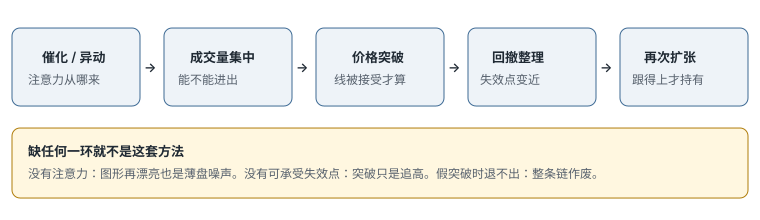

# 8.1 策略框架与模拟

> 一句话：这套方法交易的是注意力和短期动量，不是「低价股必涨」。先把股票池、触发、退出和样本验证拆开，再谈赚钱。

卷五已经把旗形、贴顶、回踩、红翻绿、Gap and Go 的**形状**写过一遍。那些形状在小盘上照样出现。本卷不再重画同一张旗面，而是回答另一组问题：小盘的注意力从哪来、为什么同样的形状会在低流通、停牌、增发和盘口消失里失效、怎样用模拟盘证明自己能执行而不是能复述。

读完这一章，你手里应该只有两样东西：一份单一 setup 的完整规则，以及一套还没开始筛选「好看样本」的连续记录办法。没有第三样——没有「已经理解 anticipate breakout，可以开真钱」这种许可。

## 8.1.1 小盘动量实际在买什么

小盘日内的 long momentum 不是价值回归，也不是「便宜所以该涨」。它依赖一条很短的链：



```text
催化或异动 → 成交量集中 → 价格突破 → 回撤整理 → 再次扩张
```

交易者试图在突破前后参与，并快速减仓。链上同时要成立的条件比口号多：

- 当日确实有集中注意力，不是只有扫描器颜色；
- 股票的深度能承受你计划的股数，进出都算；
- 入场到失效点的距离可控，停牌带不会一口吃掉好几倍 1R；
- 突破后有足够 follow-through，而不是一根影线；
- 假突破时，限价单和盘口深度允许你真实退出。

「Buy high, sell higher」只是趋势交易的口号。没有明确 invalidation 时，它会退化成追高。追的定义在卷四已经写过：离失效位太远。小盘上还要再加一条——离 LULD 上沿太近、点差已经吃掉目标，也是追，哪怕价格「看起来才刚起步」。

这套方法对**注意力消失**极度敏感。新闻过气、午后量枯、增发公告、同板块明星股把资金吸走，图形还可以继续漂亮几分钟，然后买盘突然不在。所以框架的第一句不是「找低价」，而是「找今天有人在交易、并且你退得出的异动」。

## 8.1.2 和卷五的分工

形状、位置、触发、失效这四个词，全书通用。卷五负责形状目录。本卷负责小盘过程：

| 卷五已经给了什么 | 本卷要保住什么 |
|---|---|
| 旗形、贴顶、ABCD 怎么画线 | 第几次、哪个时段、停牌后还算不算同一笔 |
| Gap and Go 的位置（盘前高、前收） | 盘前清单、拥挤、开盘点差、LULD |
| 红翻绿、回踩的触发 | 低开是否有坏消息、收回是否只是反弹 |
| 接受 vs 影线 | 小盘影线经常是点差，不是拒绝 |

同一天不要把小盘和大盘两套神经叠在同一组热键上。卷九会把大盘写成另一套节奏。这里先定死：本卷默认你当天主做小盘动量。

## 8.1.3 价格和流通盘只是初筛

课程通常偏好较低价格、较低流通盘（float），并允许在极端热门行情里例外交易更高价、更大流通的股票。这两句话如果不当成**事先写好的池子规则**，复盘时就会变成：所有失败都被规则排除，所有成功都叫「例外」。

事先定义四件事：

1. **核心价格 / 流通盘范围**。这是启发式，用来缩小搜索，不是自然定律。你自己的区间必须以自己的滑点和停牌样本校准。
2. **允许例外的条件**：相对量、美元成交额、催化强度各要过哪条线。
3. **例外仓位是否强制降低**。答案通常是是。
4. **例外样本是否和核心池分开统计**。必须分开。把 GME 那种历史热点和普通 3 美元低流通股丢进同一个胜率，数字没有意义。

低流通会放大涨幅，也会放大点差、停牌、增发和无法退出的风险。流通盘数字本身还不可靠：反向拆股后扫描器可能显示「极低 float」，但权证、可转债、货架发行仍在增加供给。核验链放到第 03 章。这里只需记住：float 是筛选字段，不是优势本身。

极低价股还有报价增量问题。1 美元上下的最小报价单位不同，适用规则、场所和订单类型都会改你看见的价格。比较成本用：

```text
点差百分比 = (卖一 − 买一) ÷ 中间价
```

0.01 的绝对点差，对 0.20 美元股票大约是 5%，对 20 美元股票大约是 0.05%。更细的 tick 不会自动增加可交易性。课程排斥所谓 penny stock 的真正理由应写成流动性、合规、报价结构和操纵风险，而不是「低于某条价格线就不能做」。那条价格线如果要写进计划，也标成启发式，并且用点差百分比和深度去校准。

## 8.1.4 三种入场，三种统计桶

小盘突破常见三种执行。它们不是同一 setup 的三个「技巧」，而是三种风险结构。

| 类型 | 入场 | 优点 | 主要风险 |
|---|---|---|---|
| 预判 Anticipation | 阻力下方 | 均价较低 | 突破从未发生 |
| 穿越 Trade-through | 突破成交 | 条件已触发 | 滑点、追高 |
| 回踩 Retest | 突破后回抽 | 失效更清楚 | 可能不给回踩 |

课程演示里常见的画面是：在阻力下提前进，突破时减仓，回撤后再按新结构加回。看起来像一笔漂亮的大赢家。日志里它至少是两到三笔不同的决策：

- 提前进：赌的是整理不会先破低；
- 突破减仓：承认扩展段的盈亏比已经变差；
- 加回：新的触发、新的失效、新的股数。

把 mental stop 调到均价，只是价格上的保本。费用和滑点仍可能使净结果为负。多次 add-back 如果合并记账，你会高估自己的胜率和平均盈利，同时低估总风险。

预判改善均价，代价是「突破从未发生」。小盘上这个代价更大：整理区可能直接停牌、突然增发、盘口撤光。所以预判仓位默认小于穿越仓位，而且必须有独立的时间退出——整理拖过你预先写的根数或分钟数，就按失效处理，不要改口说「还在蓄势」。

## 8.1.5 固定美分目标会毁样本

课程常用「每股先赚 10 美分」当训练目标。对 3 美元股票和 100 美元股票，10 美分的意义完全不同；对点差已经 0.10 的股票，它甚至小于一轮往返成本。

目标应根据下面这些东西设定，而不是固定美分：

- 第一技术阻力（盘前高、整数、日线供给区）；
- 结构风险的 R 倍数；
- 当日已走出的波动或 ATR 的某个分数（启发式，自己校准）；
- Level 2 可见深度——目标如果薄到你自己的卖单就会打穿，数字是假的；
- LULD 带宽——目标贴着上沿，等于计划停牌。

训练阶段可以给自己一个**过程目标**：连续 20 笔按同一规则减仓，而不是连续 20 笔每股赚满 10 美分。后一种目标会逼你在没有空间的股票上硬拿，或在已经该走的时候继续拿。

## 8.1.6 「利润垫」不是风险许可

讲者会在先盈利后扩大仓位，理由是账户已经有 cushion。账户盈亏不改变下一笔的概率。它只改变两件事：你的心理，以及当日还剩多少风险预算。

安全写法：

- 单笔风险不因已盈利而无限上升；
- 当日累计风险有固定上限；
- 放大只能来自经过验证的 setup 和流动性，并且写成具体倍数；
- 盈利回吐达到阈值就停止；
- 不用「house money」描述已经赚到的钱——那是你的钱，亏掉一样少。

卷九会把 A+ 仓位写成最多 1.25–1.5 个单位这类启发式上限。小盘同样适用，而且更严：小盘的尾部更肥，同倍数下账户曲线更脆。

## 8.1.7 模拟计划：先固定，再收集

模拟不是「先随便做，等赚钱了再写规则」。规则先写，样本后收。一份最小计划：

```text
股票池：核心价格 / 流通盘；例外条件；例外是否单独统计
可交易时段：例如只做常规开盘后前 90 分钟（启发式）
唯一 setup：一个名字，一种触发，一种失效
单笔最大风险：
单日最大风险：
最大交易次数：
订单类型：默认可成交限价，不用裸市价
保守滑点：按点差和时段预留
日志字段：见下
复盘日：每周固定，不在亏损当天改规则
```

课程用过「每笔最大 50 美元风险，按 0.10 / 0.20 / 0.40 止损换算 500 / 250 / 125 股」这种算术。`股数 = 最大风险 ÷ 每股风险` 这个框架是对的。同一页里再写一个「满仓固定 1000 股」就和框架冲突。满仓仍应由当笔止损距离决定。每日 100–250 美元盈利目标和每周目标只是训练示例，不应制造「今天还没赚到所以必须再做」的压力。

日志至少记下：

```text
日期 / 时段 / 市场阶段
代码 / 证券类型
催化来源与时间
流通盘来源与日期
setup 名 / 第几次
入场类型：预判 / 穿越 / 回踩
计划价 / 实际均价
失效价 / 实际退出
计划 R / 实现 R
MAE / MFE
点差、是否停牌、滑点
是否守规
```

模拟盘能练流程，不能证明实盘可复制。它通常低估：点差突然变宽、排队不成交、部分成交、停牌、借不到股票、真亏钱时的冲动。所以模拟记录必须人为加上保守滑点，并且把未成交、错代码、热键误触单独记成操作风险，而不是删掉。

## 8.1.8 一个月盈利不是进入实盘的证据

「先证明能选对股票、形态并保持盈利」这个方向对。「一个月」只是短期门槛，可能只有少量样本，或只覆盖一种热市。更完整的门槛在第 05 章展开，这里先留下拒绝自动切换的理由：

- 所有交易计入实际成本和保守滑点；
- 至少覆盖多个波动阶段，而不是连续 20 个好做的早晨；
- 没有严重平台错误，或错误已被单独修复；
- 回撤在计划范围；
- 违规交易不贡献主要利润；
- 最小实盘仓位可承受最坏成交；
- 有停止和退回模拟的条件。

课程下一阶段到了，不构成你切换真钱的理由。框架的价值在它能被拒绝、被统计，而不是听起来合理。

## 8.1.9 策略适配交易者，不是交易者适配讲者

课程会把快速反应、计算机能力和风险容忍度与 1 分钟交易联系起来。这不表示反应慢就只能失败。你可以选择：

- 用 5 分钟确认，而不是 1 分钟穿越；
- 更少标的，开盘前就排序；
- 更少交易，允许全天空仓；
- 预设止损和目标，减少盘中改单；
- 更高流动性、更宽点差阈值的股票；
- 完全不同的持有周期。

小盘的尾部是停牌和点差。如果你的执行速度、券商路由或性格不允许你在几秒内按计划退出，正确的适配是换更慢的确认，而不是强迫自己进入最快节奏去「像他们一样」。第 16 章访谈里反复出现的可迁移原则，第一条就是：找到与个人、券商和市场匹配的窄策略。传记不用读，这条留下。

## 8.1.10 本章结束时只做这两件事

1. 写出**一个** setup 的完整规则：形状、位置、触发、失效、股数公式、不做条件。
2. 在模拟环境收集未经筛选的连续样本。好看的、失败的、没做成的，全部留下。

不要因为理解了「提前进突破」就开始真钱。下一章先把三层风险和停牌尾部写死；再下一章才谈选哪只股票。

## 8.1.11 单一 setup 规则的最小完整版

下面是一份可以直接改数字的草稿。括号里的阈值都是启发式，必须换成你自己的样本。

```text
名字：常规时段，开盘后第一次 5 分钟回撤做多
股票池：核心价格与流通盘范围内、当天有核验过的催化
时段：开盘后 5–90 分钟；开盘后前 5 分钟不做
形状：有冲动段，回撤 2–5 根，回撤幅度不超过冲动段一半
位置：回撤不跌破 VWAP 和开盘后更高低点
触发：前一根已收盘 5 分钟 K 的高点被接受
失效：回撤低点下，与触发同一周期
不做：点差超过某阈值；上沿 LULD 不足 1R；第 2 次及以后的回撤；
      日线第一阻力不足 1R；融资风险未核验
订单：可成交限价，偏移按点差调整
仓位：单笔上限 ÷（入场到失效 + 滑点预留），再按深度砍
退出：第一阻力减仓；其余按结构移动；时间退出预先写死
统计：与预判、穿越、回踩分桶；与第 2、第 3 次回撤分桶
```

写得比这更短，通常是还没准备好收集样本。写得比这更长、却没有唯一触发，通常是把七个入口又塞回去了。先跑这一个。


## 先记住这些

- 交易的是注意力链，不是低价。
- 价格和流通盘是池子，不是优势。
- 预判、穿越、回踩分开记账。
- 固定美分目标和「利润垫加仓」都会污染样本。

## 不要做的事

- 把课程里的 10 美分、1000 股、一个月盈利当成自己的硬规则。
- 用讲者的热市曲线当期望值。
- 还没写唯一 setup，就同时练七种开盘入口。
