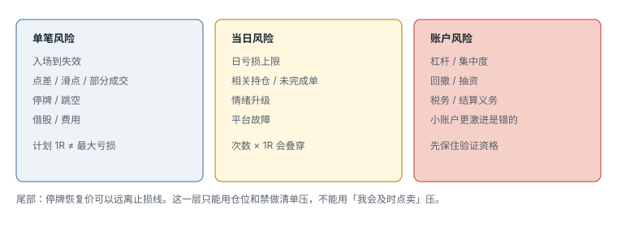

# 8.2 风险管理

> 一句话：止损价是计划输入，不是最大亏损保证。小盘要同时管单笔、当日、账户，以及停牌盖不住的那一截。

卷四已经写过股数公式、R 和期望值。本章不重讲算术，只把小盘特有的尾部、相关性和行为升级写进同一套控制系统。读完之后，你应该能指出自己计划里哪一行是 1R，哪一行是「1R 之外的东西」，以及到达日亏损后下一笔无论多好看都不属于当天。

## 8.2.1 三个层级，外加一层尾部



### 单笔

- 入场到结构失效；
- 点差、滑点、部分成交；
- 停牌 / 跳空；
- 借股和费用（做空时）。

### 当日

- 日亏损上限；
- 相关持仓（同一只股票多笔、同一板块多只低流通）；
- 未完成订单；
- 情绪升级；
- 平台故障。

### 账户

- 杠杆；
- 集中度；
- 回撤；
- 抽资；
- 税务和结算义务。

只控制每笔止损，仍可能因交易次数和相关性，把当日风险叠到不可承受。小盘上还要单独承认第四句话：**计划 1R 在连续成交时才近似成立**。停牌期间普通止损无法执行，恢复价可以远离止损线。这一截叫尾部风险，只能靠仓位、禁做清单和「靠近 LULD 就不做」压，不能靠「我会看盘」压。


## 8.2.2 盈亏比、期望值、利润因子

课件用平均盈利 2、平均亏损 1 表示 2:1。单独的 2:1 不保证盈利。还需要胜率、费用和样本量。

「成功交易者最低 1:1」不是普遍门槛。高胜率策略可以低于 1:1；低胜率策略需要更高的平均盈利。平均值还可能被极少数大单扭曲，应同时看中位数和左尾分位数。

成本后期望值：

```text
EV = p × 平均盈利 − (1 − p) × 平均亏损 − 平均成本
```

利润因子：

```text
PF = 毛盈利 ÷ 毛亏损
```

这两项仍不是完整风险报告。还要看最大回撤、连亏长度、左尾，以及 **actual R 经常大于 planned R** 的频率。小盘上后一项几乎总会发生：滑点、部分成交、停牌恢复。如果 30% 的亏损笔 actual R ≥ 2，你的「每笔 25 美元」只是愿望。

## 8.2.3 胜率不是猜硬币

一笔交易不是因为结果只有赢或亏，就各 50%。胜率来自 setup 条件、退出规则、数据与成交、市场阶段、执行行为。同一 setup 如果过早止盈，胜率可能升高但盈亏比下降；把止损放宽，也可能制造「高胜率」，同时积累罕见巨亏。

小盘里还有一种假高胜率：只在热市、只在第一波、只在自己盯得住的早晨做，然后把冷市和午后全部标成「没做所以不算」。没做也是样本。扫描器报了、六栏写不齐、主动放弃，应记成 skipped。否则你会高估自己在「所有可交易日」上的表现。

## 8.2.4 股数从失效反推，再被流动性砍一刀

流程：

1. 定义结构失效点（和触发同一周期）；
2. 估算实际入场（不是买一，是扫过可见卖盘后的均价）；
3. 加入滑点预留；
4. 计算每股风险；
5. 用美元风险反推股数；
6. 再按深度、名义金额和停牌风险往下砍。

```text
预期入场 = 4.08
结构止损 = 3.92
滑点预留 = 0.04
每股风险 = 0.20
单笔上限 = 40 美元
股数 = 200
```

若这只低流通股可能在停牌后直接到 3.20，40 美元并不是保证最大损失。对 halt-exposed 的交易，必须再减仓或放弃。判断「halt-exposed」的启发式：距离 LULD 上沿不足 1R、已经停过一次、盘口深度薄到你自己的单会打穿、新闻可能再出。

名义敞口、计划风险、尾部风险三个数字必须分开。购买力告诉你能开多大，不告诉你能亏多少。

## 8.2.5 下跌加仓改变的是风险，不是胜率

下跌后加仓会改善均价、增加股数、放大总美元风险、让退出更难。只有策略事先定义分批入场、统一失效和最大总风险时，才是计划内的 scale-in。因为亏损而临时加仓，是规则改变。

小盘上这条更硬。低流通股的第二次买往往发生在盘口已经变差的时候：点差变宽、买盘撤走、你加完立刻变成最大买家。统一失效如果还放在原低点，总风险可能是原计划的两到三倍。

加仓只允许发生在价格按预期推进之后，并且加完仍满足：

```text
总开放风险 = Σ 各批股数 × (各批均价 − 共同失效)
总开放风险 ≤ 单笔上限
另外留停牌跳空余量
```

若必须把止损抬进正常噪声区才能让数字好看，说明加仓规模过大。

## 8.2.6 恐惧要翻译成订单行为

恐惧不是性格标签。复盘时写它改了哪一项：方向、仓位、价格还是时机。常见形式：

- 不按止损；
- 过早止盈；
- 把日内单变成隔夜；
- 亏损后不敢做下一笔合规信号；
- 错过之后追下一只完全没计划的股票。

解决方案是自动限制、减小规模和预演，不是要求自己「更勇敢」。能写成规则的包括：连续两笔规则内亏损后仓位减半；日亏损触及后取消所有订单；热键误触或账户点错当天 lockout。意志力不进计划正文。

## 8.2.7 把日内单变成隔夜，是换了一套风险

因亏损不愿平仓而隔夜，会突然新增：隔夜跳空、盘后流动性、融资或新闻、借股变化、保证金变化、无法按日内止损退出。如果 swing 不是事前计划，收盘前必须按日内失效处理。不能用长期故事覆盖短期错误。

小盘隔夜还有一层：隔夜增发、ATM、货架发行往往在盘后或盘前出现。你以为在「等反弹」，公司在卖股票。第 03 章会把融资检查写成选股步骤。这里只要记住：隔夜不是止损的替代品。

## 8.2.8 日亏损上限怎么设

设置时考虑：正常单笔 R、正常连亏长度、当日可接受的账户百分比、平台是否支持硬锁、未平仓风险是否计入。

启发式示例，必须用自己的回撤校准：

```text
R = 25 美元
软暂停 = −2R    （停下来看市场和行为，不是看下一只是不是更好）
硬停止 = −3R    （取消订单，不再开新仓）
盈利回吐停止 = max(固定金额, 当日高点回吐比例)
```

软暂停用来审查，硬停止不允许主观例外。达到硬停止后，下一笔无论看起来多好，都不属于当天计划。

小盘开盘前 30 分钟的滑点分布和午后不同。同一 3R 在开盘可能三笔就到，在午后可能是六笔噪声。所以日亏损是美元或 R 的上限，不是「今天还可以再试几次」。次数上限要单独写。

## 8.2.9 破产风险：小账户更激进是错的

高波动结果下，即使正期望，过大风险比例也可能在优势兑现前把账户打穿。危险因素：

- 每笔冒账户的 10%；
- setup 高度相关；
- 多笔同一代码；
- 杠杆；
- 尾部损失远大于止损；
- 策略参数来自小样本。

「小账户要更激进才能长大」是错误方向。账户小到无法以安全仓位交易目标股票时，继续模拟，或换点差和波动更适合的产品。课程里的小账户挑战不是学习路径，第 05 章会单独降级。

IRA 等退休账户的补资还受年度贡献规则约束，亏损后不一定能重新注资。那种账户的回撤上限应比应税账户更紧。细节在第 06 章。

## 8.2.10 亏损之后问什么

不要问「下一笔能否赚回来」。改问：

- 前一笔是否合规？
- 当前 setup 是否独立满足条件？
- 当日剩余风险预算？
- 有没有行为红旗？
- 市场阶段是否已经变了？

报复交易的识别标志很具体：同一代码因为浮亏而加仓；换一只完全没研究过的股票；把股数加倍；把失效位下移。这些一旦出现，走 lockout，不要走「再给自己一次机会」。

## 8.2.11 做空时风险表更长

做空不是把多头图上下翻转。除了方向，还要处理借股、费用、召回、SSR、强制买回、停牌向上跳空、理论上无上限的亏损。卷六写机制。小盘过程里至少下单前回答：

| 问题 | 必须明确 |
|---|---|
| 借股 | 是否真的可借，数量是否够 |
| 成本 | locate、借券、佣金、隔夜费 |
| 规则 | 是否 SSR，券商如何路由 |
| 公司行动 | 新闻、增发、拆股 |
| 入场 | 具体跌破或拒绝，不是「涨太多了」 |
| 止损 | 结构失效；停牌时不保证成交 |
| 仓位 | 按每股风险和尾部取更小值 |
| 回补 | 第一目标、部分回补、最终失效 |
| 操作 | 召回、强制买回、盘后、平台限制 |

三个不能接受的推理：

1. 涨很多所以一定会跌。价格可以在看似不合理后继续涨数倍。
2. 胜率高所以风险小。小赢多次加一次巨大回补，期望值仍可为负。
3. 止损限制最大损失。停牌、跳空、流动性消失时，成交价可能远离止损。

入门阶段更适合先在模拟盘练确认后的结构空，而不是猜顶、停牌恢复空、抛物线第一次红 K。后几类单独隔离，不纳入普通 setup。

## 8.2.12 风险日志

每笔记录：

```text
计划 R
实际 R
计划止损
实际退出
滑点
MAE / MFE
停牌暴露
仓位规则
规则违约
```

每周找：

- 实际亏损超过 1R 的原因；
- 止损限价未成交；
- 高频加回导致总风险被低估；
- 某价格 / 流通盘区间的尾部损失；
- 盈利后是否无纪律扩大仓位。

风险管理不是让每笔只亏很少，而是确保任何合理的失败序列都不会夺走继续验证策略的能力。

## 先记住这些

- 1R 是连续成交时的计划，不是停牌后的上限。
- 日亏损硬停止之后没有「这一笔例外」。
- 小账户更安全的做法是继续模拟，不是加大仓位。

## 不要做的事

- 用平均盈亏比代替左尾和 actual R。
- 因为浮亏把日内单改成隔夜。
- 用「已经赚过了」给下一笔开更大仓。
