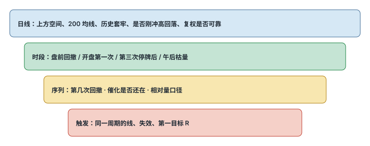

# 8.4 日线与盘中语境

> 一句话：日线决定空间和历史供给，盘中图决定当日触发。同一个形态脱离语境没有统一胜率。

卷五已经把旗形、贴顶、回踩、红翻绿、Gap and Go 的画法写完。卷六写做空机制。本章不重开形状课，只回答小盘上真正改胜率、改盈亏比、改能否成交的那些字段：复权、第几次、哪个时段、量在哪一段、离停牌带多远、第一目标够不够 1R。

把这些字段写进日志，形态统计才不会把本质不同的交易混在一起。

## 8.4.1 日线的任务

日线不负责给秒级入场，而是回答：

- 当前是历史低位、区间，还是所谓蓝天（图上可见高点之上）？
- 最近长期均线在哪里？
- 上方哪一段有大量被套成交？
- 是否有缺口 / 窗口？
- 是否刚跑过一轮又吐回去？
- 图表是否被反向拆股扭曲？

长期向下、中间夹着几次突然大涨又回落，是融资和反向拆股背景下常见的历史形状。左侧高价经过复权后，可能并非当时真实交易价，不能直接当精确阻力。最右侧新的异动可以有日内动量，但上方历史供给和「冲高回落」记录会降低持有信心。

需要结合最新公司行动重画水平，而不是在压缩图上画几十条线。计划只保留会影响当下决策的：最近支撑、触发、第一阻力、下一道主要阻力。其余远端线放参考层。

线要画成区域，宽度至少考虑点差和典型波动。已经被当前大 K 穿越的旧阻力，可降级为潜在支撑 / 回踩，而不是简单删除。

## 8.4.2 反向拆股复权

连续反向拆股会把旧价格按比例抬高。「历史曾到数千美元」往往是复权数学，不是自然回归目标。使用历史价位前：

1. 查看公司行动历史；
2. 确认平台是完全复权还是未复权；
3. 将水平换算到当前股本口径；
4. 检查旧成交量是否同样调整；
5. 更重视拆股之后的近期结构。

扫描器上的历史量和流通盘也可能暂时没改。日线语境的第一步经常是：这张图能不能信。

## 8.4.3 相对量让形态可执行，但不保证成功

课程强调高相对量，理由是需要真实关注、流动性和突破参与。形态在低量时也可能看起来完美，但一笔订单就能改变价格，退出困难。高量也可能来自派发，必须看量有没有带来价格进展。

把有效性拆开，不要混成一句「高质量 setup」：

| 维度 | 问什么 |
|---|---|
| 形态质量 | 结构干净，失效点清楚 |
| 流动性质量 | 计划股数能进出 |
| 催化质量 | 注意力是否还在 |
| 空间质量 | 上方到第一目标是否够 R |
| 风险质量 | 失效点可承担，停牌带够远 |

「只等高质量」的含义是允许整天无交易。

日线总量可能很高，但当前五分钟已经枯竭。反之，刚发布新闻时五分钟量可能异常高，而日累计尚未显著。同时记录：累计成交量、按时段定义的相对量、最近 5 分钟相对量、美元成交额、触发时的量、突破后的量。口径写进计划，不要盘中换分母。

## 8.4.4 指定主周期，冲突时不许事后改口



交易前指定：

```text
语境周期 = 日线
setup 周期 = 5 分钟
执行周期 = 1 分钟
失效周期 = 5 分钟
```

这是启发式分工，不是唯一正确组合。关键是：若执行图与 setup 图冲突，按预设优先级，不事后切换。不能用 1 分钟入场、5 分钟止损，却仍按 1 分钟风险配置股数。止损更宽，股数必须更小。

1 分钟显示更细的回撤，5 分钟把它们聚合成较平滑的趋势。1 分钟可能已经是第三次小回撤，5 分钟仍只是一根扩张 K。「第几次」必须声明周期。

## 8.4.5 给每一种盘中形状贴语境标签

相同的牛旗，至少有这些不是同一 setup 的情况：

- 第一次盘前回撤；
- 开盘第一次回撤；
- 第三次停牌后的回撤；
- 午后低量回撤。

标签至少包含：

```text
时段 + 序列号 + 催化 + 日线位置 + 量能状态
```

卷五的形状名只回答「线怎么画」。小盘统计桶必须更细。第一次回撤通常更接近原始动量；后面每一次都要重新判断趋势有没有衰减。不要把第二、第三次和第一笔丢进同一个胜率。

## 8.4.6 入场空间：形态完美也可以不合格

设入场 5.20，失效 5.05，风险 0.15；第一日线阻力 5.28，空间 0.08。即使形态标准，第一目标小于 1R，仍不合格。不要假设「一定冲过阻力」来制造 2R。

小盘上还要检查：

- 第一目标是否贴着 LULD 上沿；
- 盘口在目标附近是否已经堆着明显卖单，且这些卖单是真的在成交还是在撤；
- 点差是否已经吃掉目标的很大一部分。

空间不够就等待回踩或放弃。开盘不是必须参与的仪式。

## 8.4.7 小盘过程：开盘缺口

高开不是信号。Gap and Go 在小盘上是一套盘前到开盘的过程，不是「看到涨幅就市价」。卷五写过位置和触发。这里只保留小盘清单。

盘前先问：

```text
新鲜催化？
流通和市值对得上号？
盘前量和相对量够不够计划股数？
点差和深度能否承受？
日线阻力和稀释风险看过没有？
盘前高、局部枢轴、低点、VWAP 画好了没有？
到第一目标的距离 ≥ 计划风险？
LULD / 停牌风险你接受吗？
```

最显眼的 gapper 最拥挤。拥挤增加假突破、滑点和停牌。扫描器第一名仍可能流动性很差。

开盘过程共用同一条链：

```text
催化 → 流动性 → 日线空间 → 盘中结构
→ 精确触发 → 精确失效 → 仓位 → 执行
```

课程里那组入口——第一次回撤、盘前高、盘前枢轴、整数 / 半整数、开盘区间、红翻绿、盘前交易——在小盘上仍然只是**参考位不同**。它们不是七个独立优势。共享陷阱是：

- 后段追高，却沿用第一波的仓位；
- 把心理整数关口当成优势本身；
- 事后移动枢轴；
- 任意改开盘区间长度；
- 盘前深度极薄时，用常规时段仓位照搬；
- 开盘已远高于盘前高，失效位变得很远，还叫 Gap and Go。

盘前交易要单独统计。扩展时段的深度、点差、可用户类型和路由，往往与常规时段不同。少量成交就能画出漂亮 K 线。无法用限价控制最坏成交价时，仓位不应等于开盘后。

每种入口至少收集成功和失败样本，并记录缺口、盘前量、流通、催化、入场属于预判 / 穿越 / 回踩、离 VWAP 和 LULD 的距离、计划风险与实际滑点、第几次测试、是否停牌。严格按规则退出时的结果，而不是事后最佳退出点。

## 8.4.8 小盘过程：已经存在的强势

动量做多的核心不是追任何上涨。群体同时聚集到少数活跃标的，方向可以突然改变。「别人都在买」是观察结果，不是风险控制。

课程录制期包含异常活跃的市场阶段。练习时按市场阶段分组，避免把热市样本直接外推到冷市。所谓抛物线——短时间极大涨幅——是描述性经验，不是法规边界。上涨越快，回撤和停牌风险越大。历史最大涨幅不能当作当前仓位的目标。

小盘动量入口仍是卷五那些形状加位置。过程上按对速度、流动性判断和离散风险的要求，学习顺序大致是：

```text
第一 / 第二次回撤
  → ABCD / VWAP 收回
  → 整数关口 / 当日高点
  → 微回撤
  → 接回撤（dip）
  → 停牌附近进出
```

这个排序不是收益承诺。前一层只有在模拟盘有足够样本、扣除滑点后仍能稳定执行，才考虑下一层。

几条小盘特有的约束：

- **微回撤**几乎没有完整旗面，失效点近、噪声多。额外过滤：强催化、持续量、紧点差、至少有一根可识别的已收盘 K。靠近 LULD 上沿时，几美分风险的假设可能被停牌后的跳空打破。无法接受恢复后离散损失，正确仓位是零。
- **当日高点突破**的参考位会随新高更新。突破扫描器吸引关注，不保证新增买单足以吸收卖压。入场离最近更高低点越远，越应减小仓位或等待回踩。突破后重新接受在前高下方，setup 已失效，不应改名为长线持仓。
- **接回撤**的难点是「暂时回撤」和「趋势反转」当下外观相似。不应仅凭红 K 已经很长就买。有效接回撤常需要下跌减速、关键位有实际买盘反应、再突破微观高点。价格在关键位下方被接受，原支撑假设失效。课程作者把这一类放得很后，本身说明它不适合作为入门第一策略。
- **停牌进出**是独立策略，不是普通突破。LULD 是保护机制，不是上涨确认。恢复交易价格可能向上也可能向下跳空。进入停牌后无法用普通止损连续退出。当前停牌代码与状态以交易所实时信息为准。初学阶段可以直接列为禁做。

## 8.4.9 小盘过程：做空动量股

做空不是把多头 setup 上下翻转。第 02 章的风险表在这里变成过程约束：

- 假突破空：触发是重新跌破突破位或突破 K 的低点，不是仅凭上影。下方第一目标先标旗面低点、VWAP 或前一突破位。SSR 下普通卖空不能在当前买一或更低主动击穿，具体执行以券商实现为准。
- 趋势转换空：一个更低高点不够。更清楚的确认是跌破关键摆动低点后反弹无法收回。确认越多，入场越低，空间也可能已被消耗。大级别仍强时，1 分钟转弱可能只是 5 分钟回撤。
- 熊旗跌破：反弹量缩、高点下降、处于 VWAP 下方时，延续语境更清楚。已连续大跌后才追空，先标日线支撑和 LULD 下沿。
- VWAP 回落：碰线不是入场。需要拒绝、更低高点或重新跌破微观低点。VWAP 走平且价格反复跨越，方向优势很弱。
- 高开回落：历史「冲高回落」只能当分类特征。开盘盲空最容易遭遇红翻绿挤压。催化剂强于历史、盘前量显著异常或价格守住 VWAP 时，不能只因旧图相似而强行做空。
- 停牌恢复空：离散尾部。课程里接近「保证全垒打」的说法必须明确拒绝。没有明确券商规则、最大离散损失和极小仓位时，最合理的规则是禁做。

「涨很多所以一定会跌」在小盘上尤其危险。抛物线可以再走一段你账户承受不起的距离。

## 8.4.10 小盘过程：反转是逆势，先有失败证据

反转交易不是「已经涨 / 跌很多所以该反转」。极端是筛选条件。真正触发必须来自动能衰减、结构改变和可定义的失效点。

一个顶部反转的确认序列可以写成：

1. 抛物线延伸；
2. 新高缺少价格进展；
3. 第一次明显拒绝；
4. 更低高点；
5. 跌破上升低点序列；
6. 回抽失败。

越早入场，价格可能越好，命中率越低。按入场层级分开统计：

| 层级 | 例子 | 代价 |
|---|---|---|
| 预判 | 连续同向 K 内逆势 | 失败最多 |
| K 线确认 | 反转 K 后破高 / 低 | 仍可能只是停顿 |
| 结构确认 | 更低高 / 更高低后再突破 | 更晚，更清楚 |

课程里的「连续五根五分钟 / 十根一分钟」、布林带外、整数关口、日线长期均线，都是筛选器或位置，不是市场定律。强趋势中价格可以长时间贴着轨道走。指标用于发现候选和衡量极端，入场仍应来自价格结构。

连续 K 的定义要固定：是否允许十字星、平收。一分钟对偶然的反向 tick 很敏感。下跌过程中点差常扩大，图上的最低价不一定是现实可买到的价格。靠近 LULD 下沿时，可能先停牌而非平滑反弹。

反转默认更小仓、等确认、不在停牌带附近猜、不加仓摊平、第一目标保守到 VWAP 或最近支撑、新高 / 新低立即失效。具体比例靠自己的统计。

反转的不做条件：未核实的重大新闻或新闻停牌；连续 LULD；点差大于计划目标的显著比例；无法借到却计划做空；离可定义失效点太远；只因为浮亏把顺势单改称反转；已达到日亏损；同一趋势已连续逆势止损。

样本必须留下「根本没反转」的扫描结果。只有这样，极端过滤器才有可检验的意义。

陷阱是结果描述，不是事前标签。成功突破和失败突破的前半段经常相同，分界是接受还是拒绝。多头失败后先执行自己的止损，不要因为想赚回来立即反手。反手是新的入场、新的借股、新的风险计划。

## 8.4.11 接受、拒绝、量价顺序

突破后观察：多久维持在水平上方；买一是否抬到旧阻力；回踩是否量缩；是否形成新的更高低点；大成交是否带来进展。

失败特征：立即跌回；卖一方向成交很大却不涨；旧阻力没有转支撑；点差扩大；更低高点后跌破区间。

延续偏好的量能顺序：

```text
冲动扩张 → 回撤收缩 → 突破再扩张
```

警告：回撤的主动卖量大于冲动段；突破量大但价格不前进；卖一不断补单；突破后马上跌回区间；点差扩大。

这些观察在小盘上更嘈杂。可见大单可以取消。把盘口故事留给第 05 章；语境章只要求你在触发前后记下量价是否同向。

## 8.4.12 语境核对清单

- 图是否复权，近期是否反向拆股 / 增发；
- 最近支撑 / 阻力、长期均线；
- 曾经的明星股还是反复失败；
- 当前时段、序列号、相对量口径；
- 形态是第几次、催化是否还在；
- LULD 距离；
- 入场到第一目标的 R；
- 主周期是否预先指定；
- 这一笔属于预判、穿越还是回踩。

真正的语境不是「这图看起来强」，而是把影响胜率、盈亏比和成交的条件全部写成可分组字段。

## 先记住这些

- 日线管空间和供给，盘中管触发。
- 第几次、哪个时段、哪个周期，必须写进名字。
- 第一目标不够 1R，形态再标准也不做。

## 不要做的事

- 用未复权或错误复权的历史高点当目标。
- 把停牌附近、微回撤、接飞刀和普通第一次回撤放进同一个统计桶。
- 用「一定能过前面那根线」给空间不够的交易编造 2R。
