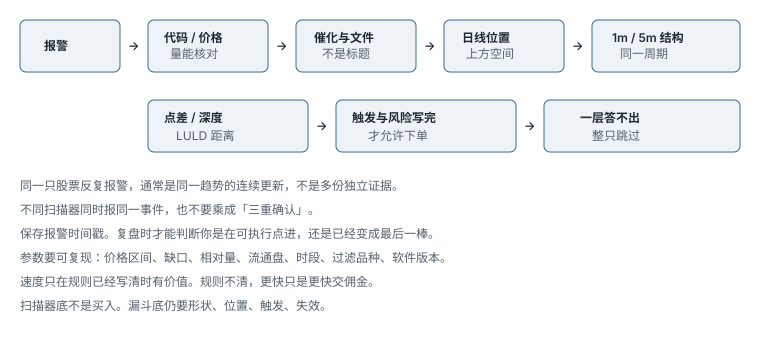

# 8.5 执行、扫描与纪律

> 一句话：扫描器负责发现候选，图负责定义 setup，订单工具负责执行。速度只在规则已经清楚时有价值；税务和平台都不是交易信号。

本章合并课程里分散的四块：盘口与成交、高速执行与扫描、纪律和进入实盘、税务与工具验收。按钮位置和软件外观过时很快，不进正文。能留下的是窗口职责、订单语义、防错和证据门槛。

卷三已经讲过报价、Level 2、Time & Sales、热键和停牌机制。这里只保留小盘执行过程：薄盘里怎么估成交均价、扫描器报警后怎么走完漏斗、怎样从模拟切到最小真钱、课程里的税务和平台演示应降级成什么。

## 8.5.1 盘口只证明三件事

Level 2 和成交明细最可靠的信息是：当前显示什么、实际成交了什么、成交以后价格做了什么。「谁在背后、为什么这样做」通常是推测。

颜色只是界面编码。同一价格用同一颜色，是为了识别价位，不是每个做市商的身份。买一卖一的颜色由平台设置，绿色不天然代表看多。设置时确认：价格分组、买卖方向、场所、数量单位、LULD / 状态、隐藏单是否有标识。

大买盘 / 大卖盘可以取消、移动、只显示一部分，不能当作墙。真正要看的是成交打到该价后，数量是减少、补回还是撤走。多个窗口同时看不同股票，会降低对单一订单变化的判断质量。

所谓买盘堆叠，有用的组合是：多档买盘上移、买一数量增加、卖一被打掉、最新成交抬高。只有数量增加、价格不前进，可能是吸收或噪声。必须把订单簿和成交连起来。


## 8.5.2 计划入场价是预期均价，不是卖一

买入 5000 股前，先按可见卖盘估理论均价。假设卖一到更远几档分别是 800、1200、2000、1000 股，价格递增。若全部可见且不撤单，理论均价是加权平均。真实结果还受其他买单、隐藏流动性和更新延迟影响。计划入场应是预期平均成交，不是卖一。

每笔记录计划价、实际均价和最差一笔成交。图上的触发价不是绩效入场价。高速行情里，K 线回测常忽略买卖价、排队顺序与部分成交。

「机构单」不能从一张图确认。大数量或异常成交不足以识别最终受益人。机构可拆单、使用算法、隐藏数量或跨场所；零售也可能聚合成大成交。资料里把「机构」改写成「大额 / 持续的流动」，避免不可验证的归因。

## 8.5.3 可成交限价给最坏价格边界，不消灭滑点

买单设在卖一上方可以扫取可用卖单，但不会高于限价。课程里的 5–10 美分偏移只是当时标的经验，应按点差、价格、波动和深度调整，标成启发式。偏移太小会错过或局部成交，太大则接近市价风险。限价只能给最坏价格边界，仍可能相对预期发生滑点。

退出时，在卖一挂限价可能让买方主动成交，价格较好但不保证成交。用可成交限价打买一，更可能立即出去，但承担点差。赢家和输家不应使用同一耐心：风险失效时优先退出，不为更好价格继续暴露。

分批规则必须同时测试剩余仓位的止损。例如三分之一到第一目标、三分之一到下一阻力、三分之一按结构移动——看起来完整，若部分成交后仍按原股数卖，会反向开仓或漏仓。

## 8.5.4 热键放大的是速度，也放大错单

固定 1000 / 2000 股的热键，会让美元风险随止损宽度变化。速度适合快速突破，也让固定股数在错误代码上瞬间成交。Buy / add / sell / cancel 必须在模拟环境逐一验证。标签帮助记忆，不防焦点和账户错误。

防错比肌肉记忆优先：

- 模拟与实盘使用明显不同的颜色或账户标签；
- 每个买卖热键明确股数、订单类型、偏移和路由；
- 设置全部取消、一键平仓、禁用热键的独立键位；
- 不用可能与操作系统冲突的组合；
- 小额实盘验证前逐一核对着券商当前文档；
- 软件升级、工作区导入或键盘更换后重新测试；
- 不使用无法确认代码、方向与数量的「一键全自动」。

训练日志要记录按键错误和未遂，即使没有产生亏损。卷三写过热键逻辑；这里只强调：小盘热键的第一验收项是 max-share 和 flatten，不是更快。

## 8.5.5 高速突破是执行方式，不是独立优势

课程说得对的一句：突破交易本身不是策略，而是快速捕捉已有 setup 的利润。如果 setup 没有统计优势，更快进出只会更快积累佣金、滑点和错误。

一笔高速交易仍需完整字段：

```text
语境 → 触发 → 限价 → 失效
→ 第一目标 → 部分退出 → 最长持有时间
```

标的必须适合这种速度：预期突破幅度要明显大于点差。目标只有 10 美分而点差已占 5 美分，理论利润不现实。大盘股通常不适合几秒钟的这种打法，卷九是另一套节奏。不能为了快速交易而固定全仓；仓位仍由失效点距离决定。

实盘速度来自预设，不是临场反应。开盘前应预先标触发、最大限价、止损和第一目标，突破时只执行已写计划。成交后立刻核对仓位、均价与未完成订单，避免重复下单。窗口越多越容易错代码。热键必须绑定当前激活窗口，并有明显确认。

衡量时不要只看胜率和毛盈亏：

| 指标 | 为什么需要 |
|---|---|
| 报警到下单的延迟 | 判断入场是否依赖人工速度 |
| 预期 vs 实际成交 | 衡量滑点 |
| 成交比例 | 识别只在有利行情未成交的问题 |
| 佣金和费用 | 高频小目标对费用敏感 |
| 持有时间 | 验证是不是真的在做突破执行 |
| MFE / MAE | 判断退出与止损设计 |
| 热键错误 | 把操作风险量化 |
| 停牌暴露 | 识别止损无法执行的尾部 |

真正要优化的是从可验证 setup 到可控成交的路径，而不是屏幕数量或按键速度。

## 8.5.6 扫描之后必须走完漏斗



```text
报警
  → 代码 / 价格 / 量能核对
  → 催化和文件
  → 日线位置和空间
  → 1 分钟 / 5 分钟结构
  → 点差、深度和 LULD
  → 计划触发和风险
  → 下单
```

任何一层无法回答就跳过。扫描器的价值是缩小搜索范围，不是制造「必须交易」的紧迫感。报警通常发生在价格已经移动之后；直接点第一名容易成为最后追高者。同一股票反复报警，通常是同一趋势的连续更新。不同扫描器同时报告同一事件，注意力重复不应被误当作多重确认。

预先保存扫描器原始时间戳。复盘时才能判断报警是否早于可执行入场。只保存最后大涨图会造成幸存者偏差。所有触发，包括快速失败者，都要进入样本。

平台差异很大：数量单位、颜色、路由、空头可借、热键语义都可能不同。界面相似不表示订单语义相同。券商、前端、行情商可能是不同实体，故障点也不同。选平台依据当前文档和测试，不照搬课程旧品牌组合。若策略不使用某些字段，隐藏它们可能提高执行准确。直接从总深度推断方向容易过拟合；先固定三到五个观察变量。

常见执行错误，写成检查表比写成性格批评有用：

- 限价已挂出却重复按买；
- 部分成交后仍按原股数卖；
- 取消未确认就发新单；
- 代码联动错误；
- 路由不支持扩展时段；
- 止损与止盈同时造成反向仓位；
- 停牌前可成交单残留；
- 把模拟成交当成真实深度。

## 8.5.7 纪律是控制系统，不是口号

收益目标不能覆盖最大亏损规则。仓位管理、心理纪律、交易计划和从模拟转入实盘必须连在一起。

### 只在风险不增加时加仓

「加到赢家」不代表总风险自动不变。加仓价更高、股数更多，回撤时可能穿过新止损。每次加仓前重新计算从当前总仓位到新失效点的美元风险，并留滑点和停牌余量。若需要把止损抬到正常噪声区才能让数字好看，说明加仓规模过大。

### 坏交易后的停手必须预先承诺

亏损当下再决定是否停止，通常太晚。「赚回来」不是有效 setup。当日停止不应被视为失败，而是风险系统按设计工作。

可设置三级阈值（启发式）：

- 警告：连续 2 笔规则内亏损，仓位减半；
- 停止：达到日亏损上限，取消订单并停止新仓；
- 锁定：出现规则外加仓、账户 / 方向错误或情绪失控，至少停止到下一交易日。

达到停止后离开屏幕。继续盯盘会重新触发错过恐惧。第 06 章从访谈里留下的原则之一：达限后关闭图，而不只是口头说结束。

### 心理问题先翻译成可观察行为

不要只写「今天没纪律」。写：是否在触发前入场；是否扩大止损；是否给输家加仓；是否超过日亏损；是否因错过而追价；是否在没有借股 / 计划时下空；是否改用更大股数回本；是否隐藏或删除亏损交易。行为可以统计和修正，抽象自责不能。

### 交易计划从「条件同时满足」开始

「完美」不代表必赢，而是所有预定义条件同时满足。初期只保留 1–2 个 setup，避免每种价格变化都能被某个名字合理化。对每个 setup 同时写明确的不做条件。

| 类别 | 内容 |
|---|---|
| 市场 | 交易时段、允许的市场环境 |
| 标的 | 价格、流通、量、点差范围 |
| Setup | 触发、失效、第一目标 |
| 风险 | 单笔、单日、单周上限 |
| 仓位 | 按止损距离计算，不固定股数 |
| 执行 | 订单类型、热键、是否允许盘前盘后 |
| 停止规则 | 连亏、操作错误、情绪异常 |
| 复盘 | 每日截图、每周统计、规则版本 |

「多数交易者亏钱」在课程里是教学口号，视频没有给出可核查样本。佣金规模、账户类型、产品和观察期限不同，会得到完全不同的比例。应关注自己扣除费用后的期望值，而不是用未经证实的总体比例制造恐惧或信心。

## 8.5.8 从模拟到实盘的门槛


课程的「完成课程、书面计划、模拟盘表现、了解税务、选择券商、从小股数开始」方向对。「模拟盘盈利一个月」不能自动证明样本足够或策略稳健。转实盘前还需验证模拟是否真实模拟点差、滑点、部分成交和行情延迟。课程中的每日金额目标不应复制；初期目标应是按规则执行和限制损失。

建议最低证据（启发式，用自己的交易频率校准）：

- 同一规则版本至少覆盖数十个交易日，而不是同一热市里的二十个早晨；
- 每个主 setup 有可审计的连续样本，成功失败都在；
- 扣除估计费用和滑点后期望值为正；
- 最大回撤在预定上限内；
- 最近一段时间无重大规则外交易；
- 能完整解释最差的一批和所有热键错误；
- 实盘仓位从能承受全部损失的最小单位开始。

小仓位的目的是适应真实盈亏的情绪，不是快速赚钱。从 100 股亏 10 美元推到 1000 股亏 100 美元是线性算术，但市场冲击、滑点和心理反应不一定线性。「对某金额亏损无感」不是增仓充分条件。每次只改变一个变量，例如仓位。

```text
同一规则 + 足够样本 + 没有新的最大回撤
  → 仓位增加一小步（例如 10–25%，启发式）
  → 冻结一个复盘窗口
```

一旦规则执行率下降或回撤创新高，退回前一级。

小账户挑战不能作为收益基准。账户小不等于风险小；集中仓位和高换手反而可能更脆弱。挑战结果不典型，且通常发生在已有多年经验之后。小账户还更容易受佣金、数据费、借股费、结算和保证金规则影响。选择券商时比较监管、资金安全、费用和执行，不以绕过某个限制为唯一目标。日历上多数绿日会强化「每天都应盈利」的错觉。更有用的日历应同时标记风险、setup 次数、规则违约和市场阶段。

## 8.5.9 账户规则会过时，以当前文件为准

课程中的美国 PDT、结算周期和券商限制属于录制期信息。附录 A 按公开资料核对：美国证券标准结算已为 T+1；FINRA 已用盘中保证金框架替换旧 PDT，存在生效和券商迁移过渡期。现金账户、保证金账户、期权和不同司法辖区规则不同，不能用视频中的单一数字替代确认。过渡期内必须问清自己的券商用新旧哪一套。

一份可以直接填写的进入实盘门：

```text
策略版本：
样本区间：
笔数 / 交易日：
扣费后净期望值：
最大回撤：
守规率：
模拟真实性已核对：
起始实盘仓位：
单笔上限：
日停止：
自动锁定：
放大条件：
退回模拟条件：
```

只有这些答案都有证据时才进入实盘。进入之后，首要验收项是「执行是否与模拟盘一致」，不是第一个月赚多少钱。

## 8.5.10 税务：概念分层，不是省税方案

全日交易不会自动获得某种交易者税务身份。美国语境里，投资者与交易者、短期资本利得、按市值计价选择、通过公司实体发工资，是不同资格、不同时点、不同申报。家庭办公室、设备、订阅是否可扣除取决于事实与税法。课程举例不是个税意见。

比较实体结构时，要把维护成本、合规风险、州税和可用收益类别一起计算。交易利润的性质不会仅因把券商账户放入公司就自动改变。录制期数字和规则会过时。

应保存：券商税表与月结单；逐笔成交、洗售调整和公司行动；软件、数据、设备和教育费用凭证；实体 / 薪酬文件；选择提交与回执；与专业顾问的书面结论。实际选择应由了解证券交易税务的合格专业人士根据个人情况确认。监管机构对交易者与投资者的基础区分，以当前官方主题说明为准。

本节不构成税务或法律建议。

## 8.5.11 平台演示应变成配置规范

可迁移的是窗口职责：扫描器、图、Level 2、成交明细、下单、持仓与风险。每个窗口必须回答一个明确问题，不能为了「像专业交易台」无限增加屏幕。最先配置的应是最大股数、最大亏损、全部取消和账户识别，而不是更激进的热键。

上线前逐项测试（先模拟，再用最小真钱验证成交语义）：

```text
正确的实盘 / 模拟账户
行情权限与时间戳
盘前盘后按计划开启
默认订单类型与时效
股数计算
可成交限价偏移
止损行为与触发源
SSR 行为
全部取消 / 一键平仓
防重复下单
断线重连
券商应急电话 / 流程
```

软件升级或券商不同都可能改变订单语义。平台熟练不等于策略熟练；能快速下单也可能只是快速执行错误。

## 8.5.12 结课标准是独立决策，不是看完

课程用收尾章汇总选股、setup、执行、风险和心理。总结页本身不产生能力。若仍需依赖别人告诉你下一笔买什么，说明尚未完成独立决策闭环。最终产物应短到开盘前能读完，详细证据留在手册与日志。

只保留这些核心文件：

1. 一页交易计划：允许的市场、时段、setup、单笔 / 单日风险。
2. Setup 手册：每个 setup 的成功和失败图、触发、止损、目标。
3. 执行规范：平台、热键、订单类型、异常处理。
4. 交易日志：完整成交、截图、MFE / MAE、费用、是否守规。
5. 每周复盘：按规则版本和市场阶段汇总。
6. 变更日志：每次只改一个规则，并写生效日期。

一段验证期可以这样安排（天数是启发式）：先修正平台错误；再只交易一个 setup 收集连续样本；然后审计所有跳过和违规，不加新 setup；在相同规则下换一个市场阶段再看；最后决定继续模拟、最小实盘，或退回修改。

「完成课程」只表示输入结束。「能交易」要由未来、未见数据上的一致执行证明。感觉掌握不能替代扣除费用后的统计、最大回撤和规则遵守率。出现大亏时先判断规则失效还是执行违纪，再决定改策略或改行为。

## 先记住这些

- 盘口证明显示、成交和随后的价格，不证明身份。
- 扫描器漏斗走不完就跳过。
- 进入实盘看证据链，不看日历绿天。

## 不要做的事

- 把模拟成交、课程热键脚本和旧 PDT 数字直接搬进真钱。
- 用小账户挑战或「已经有利润垫」放大仓位。
- 把税务身份、公司实体和券商功能当成一种省税按钮。
