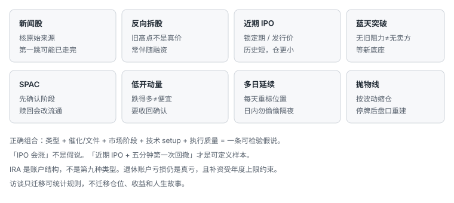

# 8.6 股票类型与 IRA

> 一句话：同一个旗形出现在新闻股、反向拆股、新上市或 SPAC 上，供给和信息不同。先识别类型，再选 setup。IRA 是税务结构，不是风险豁免。

本章把动量股的类型、退休账户约束，以及访谈里真正可迁移的原则放在一起。访谈不是代表性样本。被邀请的盈利交易者天然有选择偏差和幸存者偏差。金额、仓位和成长速度都不能作为预期结果。传记不进正文。

## 8.6.1 类型不是 setup



正确组合是：

```text
股票类型
+ 催化 / 文件
+ 市场阶段
+ 技术 setup
+ 执行质量
= 一条交易假说
```

例如「近期 IPO + 第一个五分钟回撤」是可定义的样本。「IPO 会涨」不是。类型回答的是：额外要核验什么、仓位默认怎么砍、什么情况直接不做。setup 仍然是形状加位置。

## 8.6.2 新闻股

新闻或事件后出现突然放量和价格重估，之前的低波动区不再代表当前状态。先确认来源、发布时间和是否真正涉及该公司，避免交易旧闻或同名误读。公司文件用监管机构检索核验，不靠标题情绪。

新闻带来的第一跳可能已经消耗大部分空间。等待结构不等于错过。同时检查最近临时报告、发行文件、权证、ATM 或其他潜在稀释。盘口相对波动往往很薄，名义仓位可能难以退出。新闻标的容易进入波动性停牌；止损单不能覆盖停牌跳空。短线计划只回答触发、风险与流动性，不把标题当估值。

## 8.6.3 反向拆股

反向拆股按比例减少股数并提高每股名义价格，历史价格通常被平台回溯调整。调整后的过去高点不等于当时真实成交的相同名义价格。它本身不创造企业价值，常与维持上市要求或资本结构问题相关。流通变小可能放大波动，也放大点差、停牌和操纵风险。

核对生效日、比例、代码或证券识别号变化，以及券商是否正确更新仓位。扫描器的流通和历史量可能暂时未调整。近期反向拆股与融资计划同时存在时，把稀释风险单独列为不做条件。成功突破案例不能代表反向拆股有正面优势。

## 8.6.4 近期 IPO 突破

上市后历史短、上方已成交套牢盘少，突破发行后高点可能进入价格发现。「没有历史阻力」不等于没有卖方：早期投资者、承销稳定机制和锁定期都会影响供给。日线样本不足时，不要强行套用长期均线。

突破前先查看发行价、首日高低、锁定期、流通与后续文件。上市初期的极端走势不代表「第 N 天」是可复制信号。数据历史短、停牌频繁且估值不确定时，仓位应小于普通动量 setup。把上市年龄作为分类字段。

## 8.6.5 蓝天突破

价格突破图中所有可见高点，进入无历史上方阻力的区域。这是图表状态描述，不保证持续上涨。整数关口、发行计划和新卖方仍会出现。突破 K 很大时，最近结构低点可能太远，应等待新底座而非直接追。

将历史最高与平台数据范围内的最高区分开，避免历史不完整。上方无旧阻力不等于没有拒绝。若入场接近峰值，止损可能跨越多个停牌带；预设百分比止损也未必成交。复盘同时记录突破后短、中、稍长窗口的回报分布。

## 8.6.6 SPAC

SPAC 阶段包括空白支票公司、寻找目标、宣布交易、股东投票、赎回和合并后公司，风险并不相同。流通量会因赎回、权证与 PIPE 等变化，旧的流通数字可能失真。先确认当前法律实体、代码、交易阶段和文件，而不是只看标签。

权证与普通股是不同证券，代码相近但价格和赎回条款不同。极端赎回后的低流通可造成挤压，也会让退出流动性突然消失。事件跳空会打断历史图的连续性。标题、监管文件与交易状态需要交叉确认。

## 8.6.7 低开动量

低开可能来自坏消息、发行、财报或无明显事件。原因会影响反弹质量。下跌很多不等于便宜。做多需要收回、更高低点或红翻绿等确认。先标昨收、盘前高低、VWAP 和日线支撑。

同一扫描器会同时找到反弹和延续下跌，方向必须由结构决定。坏消息下的停牌可能不是普通波动性停牌，恢复时间和信息风险不同。不因价格低就增加股数；按止损距离和实际深度定仓。盲接低开是把「已经跌了」当成优势。

## 8.6.8 多日延续

首日急涨后，后续交易日仍保留成交量和注意力，可能形成第二段。每个交易日都要重新标盘前和日线位置，不能沿用首日入场逻辑。隔夜持仓增加跳空、发行和新闻风险；日内计划不能偷偷变成波段。

把第 1 日、第 2 日、第 3 日及以后分开统计。后一天价格更高不说明风险更小；离原始底座越远，失败时回撤可能越深。短均线在极端趋势中滞后，不能单凭仍在均线上方继续持有。记录隔夜跳空对总收益的贡献，区分日内优势与隔夜暴露。

## 8.6.9 抛物线

波动呈簇集而不是稳定状态。普通行情可交易的小整理，在这里可能一根 K 就跨过止损。仓位应以波动调整，不能沿用低波动标的的固定股数。最终反转通常猛烈，但提前猜顶仍可能遭遇多次回补。

接近停牌带时，可见盘口可能在恢复后完全重建。盈利截图常隐藏未成交订单与滑点，必须用券商成交回报复盘。如果计划亏损无法覆盖一次恢复跳空，这个仓位就过大。

## 8.6.10 每类股票的附加字段

| 类型 | 额外核验 |
|---|---|
| 新闻 | 原始来源、发布时间、是否旧闻 |
| 反向拆股 | 比例、生效日、调整后流通、融资 |
| 近期 IPO | 上市天数、发行价、锁定期、首日高点 |
| 蓝天 | 真正历史高、上次融资文件 |
| SPAC | 当前阶段、赎回、权证、PIPE |
| 低开 | 下跌原因、是否新闻停牌、收回位 |
| 多日 | 第几天、隔夜缺口、持续相对量 |
| 抛物线 | 停牌次数、带宽距离、按波动调整的仓位 |

只有把这些额外风险纳入日志，形态统计才不会把本质不同的交易混在一起。

## 8.6.11 IRA 是账户结构

IRA 是税务和退休账户结构，不是风险豁免。允许的订单、有限保证金、期权与结算处理取决于托管商 / 券商。录制期开户步骤、第三方接入表单、最低资金和旧品牌组合都不能照搬。当前开户只从官方入口开始，并核实第三方数据权限。不要在未知旧表单输入账户号、用户名、电话或签名。

「平台能下单」不等于税法、账户协议和风险都允许。IRA 通常不能像普通保证金账户一样借款建立杠杆。有限保证金的功能和定义由券商规定，不应与监管意义上的参与人借款混淆。做空、裸期权、借股和某些价差可能被限制，必须逐项确认。

先区分两层。账户层回答：传统、Roth 还是其他类型；允许哪些证券和订单类型；是否有有限保证金；结算和善意交易违规如何处理；期权权限；年费、数据和平台费；领取、转移和受益人。策略层回答：交易什么标的；是否日内；止损、仓位与日亏损；是否跨越财报 / 隔夜；是否需要做空、借股或复杂期权；最大回撤对退休目标的影响。两层都满足才下单。

## 8.6.12 不把 IRA 当普通现金账户照搬

常见操作风险：使用尚未结算资金；订单被拒绝后临场改策略；期权指派形成账户无法持有的股票仓；价差一腿被指派；无法做空却用更高风险替代品追求相同方向；高频费用侵蚀退休资产；因税递延误以为亏损没有成本。

IRA 内亏损仍是真实资本损失，且可能减少未来复利基础。美国税务规则下，退休账户通常不允许参与人借款；与不合格人员之间的某些借贷、资产转移和自利交易可能构成禁止交易，并导致严重税务后果。这与券商所称有限保证金不是同一件事。具体条款需向券商与税务专业人士确认。监管机构当前 FAQ 和账户协议优先于任何课程截图。

核对只用当前官方文件：托管法律实体、账户协议、有限保证金协议、期权协议、合格证券、结算与善意交易规则、费用与行情、第三方平台授权、账户保护、交易台应急流程。课程中的券商、最低资金和旧日内交易门槛数字都不作为当前事实。

风险预算应更保守。退休账户补充资金受年度贡献和资格规则约束，亏损后不一定能随意重新注资。建议拆成单笔、单日、单周，以及该退休账户可接受的最大回撤。触及最后一层时停止主动交易并重新评估资产配置，而不是用更大仓位恢复。

IRA 类型、贡献、领取和转移规则会变化。主动交易的税务处理与普通应税账户不同。某些资产或交易可能触发禁止交易或其他问题。期权指派等特殊情形需专业判断。本节只整理概念，不构成税务或法律建议。

## 8.6.13 访谈里只留下可统计的原则

十四段访谈提供的是策略适配、失败处理和执行限制的案例。读的时候问：起始资本、市场时期、券商、仓位、未展示亏损和机会成本是什么。同一建议若无法转化成自己的日志字段，就只保留为观点。

反复出现、可以写进规则的主题：

1. **窄策略要匹配个人、券商和市场。** 执行更慢就避开数秒级微回撤，改做更清楚的结构。工具不适合时跳过 setup，而不是强行追价。建一张平台 / setup 兼容表。
2. **快速止损，不摊平。** 输家比赢家更快处理。双顶不直接追，等待回撤或确认。看不懂盘口和价格行为的极端股票，合法跳过。
3. **模拟盘用来练规则。** 在模拟里乱下单会训练坏习惯。新 setup 回模拟。模拟使用与实盘相同的仓位模型和日亏损。若实盘重复违规，退回模拟专练该行为。
4. **日志同时保存图、想法、成交和当时行为。** 把错误定位到入场、仓位、止损或执行，而不是归因于股票。每日日志不因结果好坏中断。未成交的卖单视为风险。
5. **大亏后的首要动作是减仓或停止。** 随后赚回不能洗白当日规则。先恢复守规，再恢复仓位。大亏后分辨策略缺陷与执行缺陷。
6. **市场阶段会让面包黄油失效。** 出现结构性断裂时停做并重建样本。账户高水位不参与单笔决策。热市结果单独分阶段。
7. **仓位增加会恶化成交和心理。** 小仓成交不能外推到大仓。扩仓前做容量测试。券商层设置最大股数 / 名义金额。误按数量也会形成巨大仓位。
8. **问责减少规则外交易。** 向同伴或自己提交每日守规，比事后自责有用。公开复盘针对行为，不针对「我是不是失败者」。
9. **不与他人盈亏比较。** 别人的股数、热市曲线和挑战赛不是你的期望。有长期投资组合也不表示日内技能已经建立。极端赢家不计入普通期望值。
10. **保护继续学习的资本和时间。** 今天不需要强制找到交易。达限后关闭图。好 / 坏情绪偏离中心时都不扩仓。任何单周不能威胁账户生存。

从过程里还能抽出几条更具体、可直接进计划的句子：

- 盘前标位置，等突破被接受，再买第一次回撤——如果你的统计显示自己不适合预判穿越。
- 按市值分组分开持有时间、仓位和目标，不要用小盘退出规则去管大盘，也不要反过来。
- 停牌恢复后等待可定义结构，而不是第一秒交易。
- 按多空分开算期望值；某一侧持续为负就停做那一侧。
- 分账户、分日志保存投资、波段和日内。
- 不借亲友资金去满足账户门槛。

## 8.6.14 访谈不支持的结论

- 不能估计总体成功率；
- 不能证明某课程、券商或 setup 必然盈利；
- 不能把受访者股数当建议；
- 不能把特定热市收益外推；
- 不能因最终盈利就认定所有中间大亏合理；
- 不能用一句「结果不典型」替代风险分析。

最好的用法是从全部访谈只选一条能写进自己规则并可统计的改进，然后用未来样本验证。不要一次移植十条。

## 8.6.15 类型怎样改同一笔旗形

同一段「冲动 + 回撤 + 再破高」，写在不同类型上，计划里应出现不同字段：

| 同一旗形出现在 | 额外必问 | 默认处理 |
|---|---|---|
| 新闻股 | 新闻是否已定价、是否还要出文件 | 第一跳后等结构，仓位小于核心池 |
| 反向拆股 | 复权、生效日、融资是否跟上 | 旧高点不用；融资未核就不做 |
| 近期 IPO | 锁定期、发行价、上市第几天 | 仓位再砍；不用长期均线 |
| 蓝天 | 是真历史高还是数据窗口高 | 大 K 后等新底座，不追柱顶 |
| SPAC | 阶段、赎回、权证是否搞混 | 代码核对前零仓 |
| 低开 | 坏消息还是无消息、能否收回 | 没有收回确认就不做多 |
| 多日第 3 天 | 隔夜缺口贡献、相对量是否还在 | 每天重标；禁止偷偷隔夜 |
| 抛物线 | 停牌次数、带宽、恢复跳空 | 按波动缩到可能为零 |

如果你的日志里这些行经常是空的，形态统计就是脏的。脏统计会让你以为「旗形不行了」，其实是类型变了。

## 8.6.16 IRA 里的策略裁剪

退休账户往往不能做空、不能用普通杠杆、结算更严。正确裁剪是减少策略，不是找替代品去模仿被禁止的一侧。

可以留下：只做多、只做有催化的第一次 / 第二次回撤、常规时段、当日必须平仓、点差和停牌阈值更严、单日和账户回撤更紧。  
应拿掉：需要借股的空、停牌恢复博弈、微回撤、用期权复制方向却没有相应权限和指派预案、为了「账户闲着」而在没有结构时交易。

有限保证金若存在，用途是结算便利，不是把退休账户当成保证金账户来加大名义。订单被拒后，正确动作是停，不是改用市价或换一只更差的股票把方向做出来。费用对退休资产是复利的反面：同一套高频小目标，在应税账户里已经勉强，在 IRA 里更不合适。

贡献和领取规则会变。执行前读托管商当前文件和合格专业人士意见。本书不处理你该选传统还是 Roth，只处理：这个账户一旦亏掉，补回来的路径比应税账户窄。

## 8.6.17 从访谈抽出一条，写成下周规则

不要写「我要更有纪律」。写一条下个复盘窗口能数得出来的：

```text
规则版本 1.7 生效日：____
本窗口唯一改动：达日亏损后关闭图，而不是继续盯扫描器
度量：当日亏损触及后是否还有新开仓（目标 = 0）
不改：setup、股数公式、股票池
若两周内仍出现达限后新开，退回模拟专练离开屏幕
```

访谈里十条原则，一次只引进一条。引进之前问：它是否与现有规则冲突？能否在日志里打勾？失败时退回哪一版？答不出这三问，就还只是共鸣，不是规则。

## 先记住这些

- 类型改的是核验字段和默认仓位，不改形状定义。
- IRA 亏损是真亏，补资还可能补不回来。
- 访谈只迁移可统计规则。

## 不要做的事

- 把「SPAC / IPO / 反向拆股」当成买入理由。
- 在 IRA 里用更高风险替代品模仿不能做的空头。
- 复制别人的仓位、收益或借钱过门槛。
